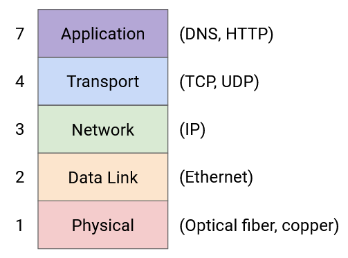
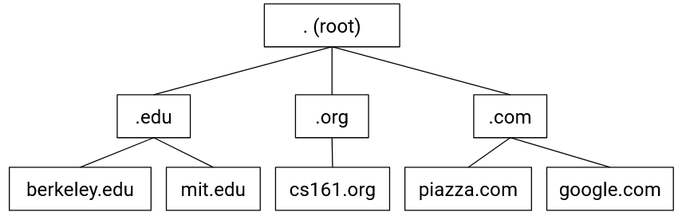
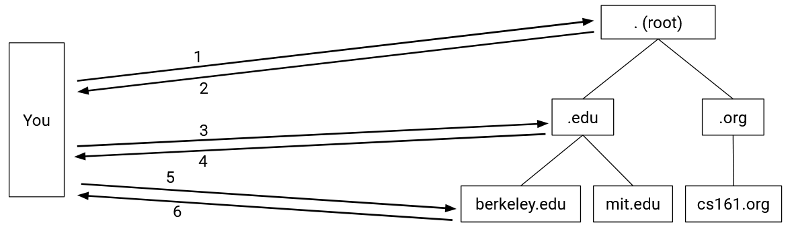
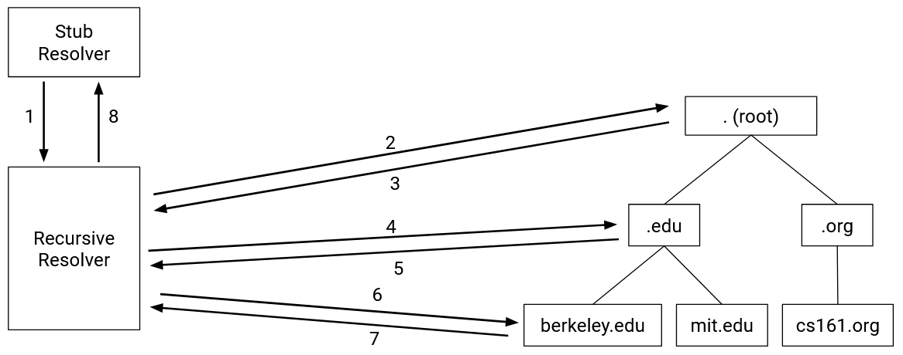
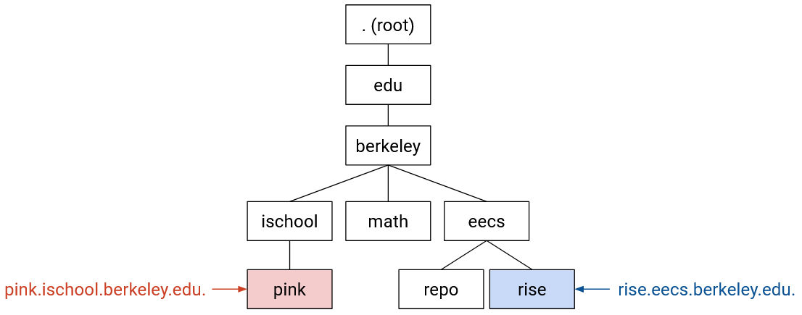
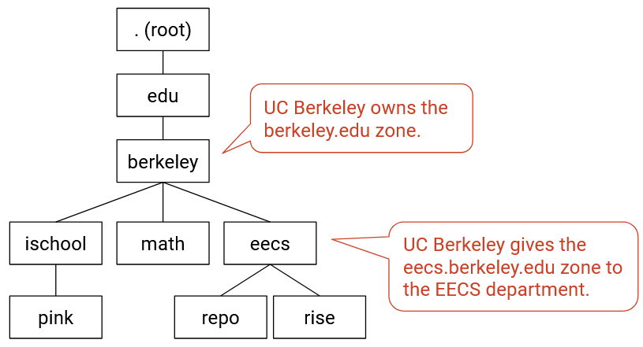
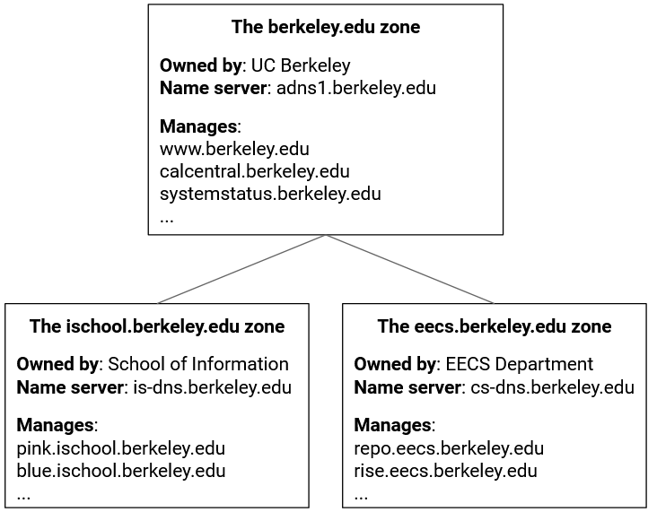
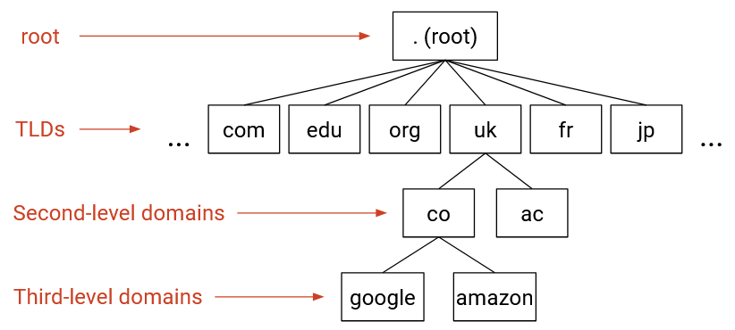
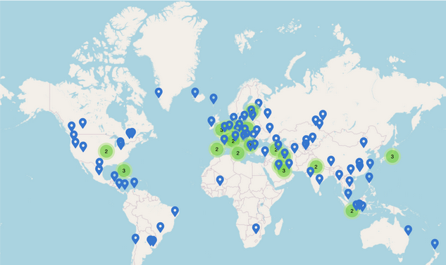
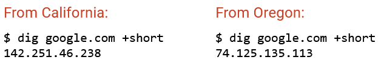

# DNS

## DNS dùng để làm gì? (What is DNS For?)

Trong phần này, chúng ta sẽ xem xét một số ứng dụng phổ biến ở **Layer 7** (tầng ứng dụng) hoạt động trên nền tảng các tầng mà chúng ta đã xây dựng trước đó.

Ứng dụng đầu tiên chúng ta sẽ tìm hiểu là **DNS (Domain Name System – Hệ thống tên miền)**, đây là một giao thức hoạt động trên các tầng (1–4) để cung cấp chức năng mạng quan trọng là **name resolution** (phân giải tên miền).

Trên Internet, thông tin thường được lập chỉ mục theo hai cách khác nhau. Con người truy cập các trang web bằng các tên dễ đọc như *google.com* và *eecs.berkeley.edu*, trong khi máy tính truy cập các trang web bằng địa chỉ IP như *172.217.4.174* và *23.195.69.108*. **DNS** là giao thức dịch giữa hai cách biểu diễn này.

## Lược sử DNS (Brief History of DNS)

Để hiểu tại sao DNS được thiết kế như hiện nay, chúng ta cần quay lại tìm hiểu lịch sử phát triển của nó.

Trên Internet nguyên thủy và tiền thân của nó (**ARPANET**), có ba ứng dụng chính. Đây là thời kỳ trước khi có **World Wide Web** và trình duyệt web, khi hầu hết ứng dụng chạy trên dòng lệnh.

- **Remote terminal (telnet)** cho phép người dùng kết nối từ xa tới một máy khác và chạy lệnh trên máy đó. Bạn có thể đã nghe đến **SSH**, phiên bản hiện đại và bảo mật hơn của giao thức này.
- **File transfer** cho phép người dùng truyền tệp giữa máy cục bộ và máy từ xa. Bạn có thể đã nghe đến **FTP (File Transfer Protocol)**, giao thức tầng ứng dụng dùng để truyền tệp.
- **Email** cho phép người dùng trao đổi thư điện tử. Email hiện đại thường có giao diện web trong trình duyệt, nhưng ban đầu, người dùng phải gõ lệnh trong terminal như *mail alice@46.0.1.2*, trong đó *46.0.1.2* là địa chỉ IP của người nhận và *alice* là tên người dùng trên máy đó.

Trong cả ba trường hợp, để thực hiện thao tác, cần chỉ định một máy chủ từ xa. Nhưng như đã đề cập, việc ghi nhớ địa chỉ IP của các máy chủ từ xa là khó và không thân thiện với người dùng.

Nỗ lực đầu tiên để khắc phục vấn đề này là gán một **hostname** (tên máy) cho mỗi địa chỉ IP. Mỗi máy tính sẽ có một tệp *hosts.txt* ánh xạ mỗi hostname tới địa chỉ IP tương ứng. Ví dụ, chúng ta có thể ánh xạ hostname *ucb-arpa* tới *10.0.0.78*, và thay vì gõ *mail mosher@10.0.0.78*, ta có thể gõ *mail mosher@ucb-arpa*.

Khái niệm này thực tế vẫn tồn tại đến ngày nay. Nếu bạn từng khởi chạy một máy chủ trên máy tính của mình, nó thường có địa chỉ IP *127.0.0.1* và hostname *localhost*. Nhập một trong hai vào trình duyệt sẽ cho kết quả giống nhau.

Chúng ta phải đảm bảo rằng *hosts.txt* giống nhau trên các máy tính khác nhau. Nếu bạn đến một máy khác và gõ *mail mosher@ucb-arpa*, bạn vẫn phải gửi thư đến đúng người. Ban đầu, tệp hosts được duy trì bởi một người duy nhất (Elizabeth Feinler) và được chia sẻ giữa người dùng bằng cách sao chép tài liệu giấy.

Tệp hosts dạng giấy ban đầu có thể đọc được bởi con người. Nó ánh xạ hostname tới địa chỉ, nhưng cũng bao gồm thông tin như tên đầy đủ của người dùng, các giao thức họ sử dụng (ví dụ: TCP, FTP), và thậm chí cả số điện thoại.

Mọi người đều đồng ý (như được đề cập trong **RFC606** năm 1973) rằng đây là một tình huống bất hợp lý. Nếu bạn nhận được bản sao giấy của tệp, bạn phải nhập thủ công vào máy tính. Hơn nữa, vì tệp được truyền tay dưới dạng giấy, bạn có thể nhận phải bản đã lỗi thời.

Cải tiến đầu tiên là làm cho danh sách này có thể đọc được bởi máy tính. Khi đó, thay vì bản giấy, chúng ta có thể dùng các giao thức như FTP để chia sẻ tệp. Nhưng cách này vẫn không thể mở rộng. Không thể yêu cầu một người duy nhất duy trì tệp này mãi mãi. Ngoài ra, khi tệp trở nên lớn, việc tải xuống có thể rất chậm, và nếu kết nối mạng bị gián đoạn, bạn có thể chỉ nhận được một phần tệp.

**DNS** lần đầu được đề xuất vào năm 1983 (**RFC882**) như một giải pháp cho các vấn đề này. Kể từ đó có một số sửa đổi, nhưng hệ thống cơ bản vẫn được sử dụng cho đến ngày nay.

Một thông tin thú vị: phần mềm đầu tiên để chạy máy chủ DNS trên Unix là **BIND** (1984, UC Berkeley), và đến nay vẫn khá phổ biến.

## Mục tiêu thiết kế của DNS (DNS Design Goals)

Lược sử trên cho chúng ta thấy một số mục tiêu thiết kế của DNS cần ghi nhớ:

- **DNS phải có khả năng mở rộng**: Internet có số lượng máy chủ khổng lồ, và mỗi giây có một lượng lớn truy vấn được thực hiện. Các máy chủ có thể được thêm hoặc gỡ bỏ thường xuyên.
- **DNS phải luôn sẵn sàng, nhẹ và nhanh**: Hầu như mọi kết nối Internet đều bắt đầu bằng một truy vấn DNS để phân giải hostname thành địa chỉ IP. Do đó, DNS phải cực kỳ nhanh, nếu không mọi kết nối sẽ bị chậm lại. Đồng thời, không được tồn tại **single point of failure** (điểm lỗi đơn lẻ), nếu không Internet sẽ ngừng hoạt động khi xảy ra sự cố.

## Name servers (Máy chủ tên miền)

Sẽ thật tuyệt nếu có một máy chủ tập trung duy nhất lưu trữ ánh xạ từ mọi tên miền tới mọi địa chỉ IP để mọi người có thể truy vấn, nhưng thật không may, không có máy chủ nào đủ lớn để lưu trữ địa chỉ IP của mọi tên miền trên Internet và đủ nhanh để xử lý khối lượng truy vấn DNS khổng lồ từ toàn thế giới. Thay vào đó, DNS sử dụng một tập hợp nhiều **name server** (máy chủ tên miền), là các máy chủ chuyên dụng để trả lời các truy vấn DNS.

Mỗi name server chịu trách nhiệm cho một **zone** (vùng) tên miền cụ thể, để không máy chủ nào phải lưu trữ toàn bộ tên miền trên Internet. Ví dụ, một name server chịu trách nhiệm cho zone *.com* chỉ cần trả lời các truy vấn cho tên miền kết thúc bằng *.com*. Máy chủ này không cần lưu bất kỳ thông tin DNS nào liên quan đến *wikipedia.org*. Tương tự, một name server chịu trách nhiệm cho zone *berkeley.edu* không cần lưu thông tin DNS nào liên quan đến *stanford.edu*.

Mặc dù có mục đích đặc biệt (trả lời truy vấn DNS), một name server cũng giống như bất kỳ máy chủ nào khác trên Internet – mỗi máy chủ đều có một tên miền dễ đọc (ví dụ: *a.edu-servers.net*) và một địa chỉ IP mà máy tính có thể đọc được (ví dụ: *192.5.6.30*). Cần lưu ý không nhầm lẫn giữa tên miền của máy chủ và zone mà nó phục vụ. Ví dụ, name server này có *.net* trong tên miền, nhưng lại trả lời các truy vấn DNS cho các tên miền *.edu*.

## Cấu trúc phân cấp của Name server (Name server hierarchy)

Bạn có thể nhận thấy hai vấn đề với thiết kế này. Thứ nhất, zone *.com* có thể nhỏ hơn toàn bộ Internet, nhưng vẫn là bất khả thi nếu một name server phải lưu trữ tất cả các tên miền kết thúc bằng *.com*. Thứ hai, nếu có nhiều name server, làm sao máy tính của bạn biết phải liên hệ với cái nào?

**DNS (Domain Name System – Hệ thống tên miền)** giải quyết cả hai vấn đề này bằng cách đưa ra một ý tưởng mới: khi bạn truy vấn một name server, thay vì luôn trả về địa chỉ IP của tên miền bạn hỏi, name server đó cũng có thể hướng bạn đến một name server khác để lấy câu trả lời. Điều này cho phép các name server có zone lớn như *.edu* chuyển hướng truy vấn của bạn đến các name server có zone nhỏ hơn như *berkeley.edu*. Khi đó, name server cho zone *.edu* không cần lưu trữ bất kỳ thông tin nào về *eecs.berkeley.edu*, *math.berkeley.edu*, v.v. Thay vào đó, name server *.edu* lưu thông tin về name server *berkeley.edu* và chuyển hướng các yêu cầu cho *eecs.berkeley.edu*, *math.berkeley.edu*, v.v. đến name server *berkeley.edu*.

DNS sắp xếp tất cả các name server thành một cấu trúc cây phân cấp dựa trên các zone của chúng:

**Root server** (máy chủ gốc) ở cấp cao nhất của cây có tất cả các tên miền trong zone của nó (zone này thường được viết là *.*). Các name server ở cấp thấp hơn của cây có các zone nhỏ hơn và cụ thể hơn.

## Tra cứu DNS (Khái niệm) – DNS Lookup (Conceptual)

Các truy vấn DNS luôn bắt đầu từ root. Root sẽ hướng truy vấn của bạn đến một trong các name server con của nó. Sau đó, bạn gửi truy vấn đến name server con, và name server đó lại chuyển hướng bạn đến một trong các name server con của nó. Quá trình này lặp lại cho đến khi bạn truy vấn đến một name server biết câu trả lời, và nó sẽ trả về địa chỉ IP tương ứng với tên miền của bạn.

Để chuyển hướng bạn đến một name server con, name server cha phải cung cấp zone của name server con, tên miền dễ đọc và địa chỉ IP của nó, để bạn có thể liên hệ với name server con đó để biết thêm thông tin.

Ví dụ, một truy vấn DNS cho *eecs.berkeley.edu* có thể diễn ra như sau (phiên bản minh họa dạng comic có tại [howdns.works](https://howdns.works/)):

1. Bạn → root name server: Vui lòng cho tôi biết địa chỉ IP của *eecs.berkeley.edu*.
2. Root server → bạn: Tôi không biết, nhưng tôi có thể chuyển bạn đến một name server khác có nhiều thông tin hơn. Name server này chịu trách nhiệm cho zone *.edu*. Nó có tên miền dễ đọc là *a.edu-servers.net* và địa chỉ IP là *192.5.6.30*.
3. Bạn → name server *.edu*: Vui lòng cho tôi biết địa chỉ IP của *eecs.berkeley.edu*.
4. Name server *.edu* → bạn: Tôi không biết, nhưng tôi có thể chuyển bạn đến một name server khác có nhiều thông tin hơn. Name server này chịu trách nhiệm cho zone *berkeley.edu*. Nó có tên miền dễ đọc là *adns1.berkeley.edu* và địa chỉ IP là *128.32.136.3*.
5. Bạn → name server *berkeley.edu*: Vui lòng cho tôi biết địa chỉ IP của *eecs.berkeley.edu*.
6. Name server *berkeley.edu* → bạn: Được, địa chỉ IP của *eecs.berkeley.edu* là *23.185.0.1*.

Khi đã có câu trả lời, chúng ta có thể lưu nó vào bộ nhớ đệm (**cache**) để không phải hỏi lại nếu cần dùng bản ghi này sau đó.

## Stub Resolvers và Recursive Resolvers

Ban đầu, máy chủ đầu cuối (ví dụ: máy tính của bạn) sẽ tự thực hiện các truy vấn DNS, liên hệ trực tiếp với từng name server.

Ngày nay, máy tính của bạn thường ủy quyền nhiệm vụ tra cứu DNS cho một **DNS Recursive Resolver** (bộ phân giải đệ quy DNS), bộ này sẽ truy vấn các name server thay cho bạn. Khi thực hiện tra cứu, **DNS Stub Resolver** (bộ phân giải stub DNS) trên máy tính của bạn sẽ gửi truy vấn đến recursive resolver, để resolver thực hiện toàn bộ công việc và trả lại kết quả.

Làm thế nào để biết địa chỉ IP của resolver? Khi bạn kết nối Internet lần đầu, ai đó (ví dụ: ISP hoặc Router) có thể cung cấp địa chỉ của resolver. Bạn cũng có thể nhập thủ công địa chỉ của resolver mà bạn muốn sử dụng.

Một số resolver nổi tiếng trên Internet gồm 1.1.1.1 (do Cloudflare vận hành) và 8.8.8.8 (do Google vận hành). Chúng thường có địa chỉ IP dễ nhớ để chúng ta không cần gọi tên. Nếu không, chúng ta sẽ phải thực hiện truy vấn DNS để tìm địa chỉ IP của chúng, và mục đích của các máy chủ này là thực hiện truy vấn DNS cho chúng ta.

Ngoài các công ty công nghệ, các **ISP (Internet Service Provider – Nhà cung cấp dịch vụ Internet)** cũng vận hành các resolver như một phần của dịch vụ Internet mà họ bán cho khách hàng. (Sẽ thật tệ nếu bạn trả tiền cho dịch vụ Internet nhưng lại phải nhập địa chỉ IP thủ công vào trình duyệt.)

Router trong gia đình bạn cũng có thể đóng vai trò là resolver. Truy vấn DNS có thể nhanh hơn nếu bạn sử dụng một router ở gần về mặt vật lý (độ trễ giữa bạn và router thấp hơn).

Một lợi ích lớn của resolver là khả năng lưu đệm tốt hơn. Resolver xử lý truy vấn từ nhiều máy chủ đầu cuối khác nhau (không chỉ riêng máy tính của bạn), nên nó xây dựng được bộ nhớ đệm lớn hơn nhiều. Nếu bạn hỏi resolver về *eecs.berkeley.edu* và trước đó có ai đó đã hỏi cùng câu này gần đây, resolver có thể trả lời ngay mà không cần liên hệ thêm bất kỳ name server nào khác.

Lưu ý rằng mặc dù recursive resolver lưu trữ bộ nhớ đệm lớn hơn, stub resolver vẫn có thể duy trì bộ nhớ đệm riêng của mình. Một số truy vấn có thể được trả lời ngay từ cache của stub resolver mà không cần hỏi recursive resolver.

## Dự phòng (Redundancy)

Cho đến giờ, chúng ta vẫn đang nói về “name server *berkeley.edu*”, nhưng thực tế, mỗi zone có nhiều name server. Tất cả các name server của một zone đều giống nhau về chức năng, và mỗi name server có thể trả lời bất kỳ truy vấn nào trong zone đó.

Điều này đảm bảo tính sẵn sàng cho zone, và nếu một name server gặp sự cố, các server khác vẫn có thể trả lời truy vấn cho zone đó. Theo quy ước, mỗi zone phải có ít nhất hai name server, nhưng trên thực tế, hầu hết các zone sẽ có ít nhất ba.

Thông thường, một trong các name server được chỉ định là **primary server** (máy chủ chính) thực sự quản lý zone. Các server còn lại là **secondary mirror server** (máy chủ bản sao phụ) chỉ lưu trữ và phục vụ bản sao thông tin từ máy chủ chính.

Trong quá trình tra cứu DNS, name server có thể trả lời bạn: “Tôi không biết, nhưng bạn nên hỏi zone *.edu*. Zone này có 13 name server. Đây là tên miền và địa chỉ IP của từng cái.” Sau đó, bạn có thể chọn name server nào để liên hệ tiếp theo.

## **DNS APIs**

Bây giờ, khi chúng ta đã có cái nhìn khái quát về **DNS (Domain Name System – Hệ thống tên miền)**, hãy xem nó được triển khai thực tế như thế nào.

Trước hết, lập trình viên sử dụng DNS để thực hiện tra cứu (**lookup**) như thế nào?

Có những **API** (giao diện lập trình ứng dụng) tương đối đơn giản, phổ biến và ổn định để thực hiện tra cứu DNS. API này khá giống nhau giữa các ngôn ngữ lập trình khác nhau.

Trong thư viện C chuẩn, hàm *gethostbyname("foo.com")* có thể được dùng để tra cứu địa chỉ IP tương ứng với *foo.com*. Tuy nhiên, hàm này chỉ hỗ trợ **IPv4**, nên hiện đã bị loại bỏ (deprecated), mặc dù bạn vẫn có thể bắt gặp nó trong một số mã nguồn.

Phiên bản cập nhật, cũng nằm trong thư viện C chuẩn, là *getaddrinfo("example.com", NULL, NULL, &result)*, dùng để tra cứu địa chỉ IP của *example.com* và lưu kết quả vào cấu trúc *result*. Bạn không cần quá lo lắng về chi tiết hoặc các tham số bổ sung (ở đây được đặt là NULL). API thay thế này hỗ trợ nhiều hơn IPv4, ví dụ như **IPv6**.

Là lập trình viên, bạn không cần quan tâm đến các phức tạp của DNS như **recursive resolver** (bộ phân giải đệ quy) hay các name server cụ thể. Bạn chỉ cần gọi hàm thư viện chuẩn. Các hàm này thường gửi yêu cầu đến **stub resolver** (bộ phân giải stub) trong hệ điều hành của bạn.

## **DNS sử dụng UDP, không phải TCP**

Về bản chất, DNS là một giao thức **client-server** (máy khách – máy chủ). Một bên (client) gửi câu hỏi, và bên kia (server) gửi câu trả lời. Client thường là máy người dùng hoặc recursive resolver, còn server thường là name server. Vậy client và server nên định dạng thông điệp như thế nào?

DNS sử dụng **UDP (User Datagram Protocol)** – gói tin best-effort, không có bắt tay TCP – để giúp DNS nhẹ và nhanh. Chúng ta không phải chờ hoàn tất **3-way TCP handshake**. Chúng ta cũng không cần quan tâm đến việc gói tin đến đúng thứ tự, vì truy vấn và phản hồi thường vừa vặn trong một gói UDP duy nhất.

Với UDP, server không cần lưu trạng thái cho mỗi kết nối (trái ngược với TCP, nơi server phải duy trì bộ đệm). Mỗi gói tin có thể được xử lý độc lập. Điều này giúp DNS nhẹ hơn, vì name server nhận rất nhiều yêu cầu, và việc mở kết nối mới cho từng yêu cầu sẽ rất tốn kém.

Vậy làm sao xử lý việc UDP không đáng tin cậy và gói tin có thể bị mất? Chúng ta giải quyết bằng cơ chế thử lại đơn giản: nếu không nhận được phản hồi trong một khoảng thời gian nhất định, hãy gửi lại truy vấn. Thời gian chờ (**timeout**) khác nhau giữa các hệ điều hành, và đôi khi khá chậm.

Việc UDP không đáng tin cậy và timeout chậm là lý do tại sao cần có một resolver ở gần và có thể liên hệ đáng tin cậy. Ví dụ, một resolver trong router gia đình ở gần bạn và thường khá ổn định (ít tắc nghẽn trong mạng nội bộ). Bạn cũng có thể cải thiện độ tin cậy bằng cách có nhiều resolver dự phòng (ví dụ: router gia đình và 8.8.8.8).

Như đã đề cập, truy vấn và phản hồi DNS thường vừa trong một gói tin. Ngoại lệ đáng chú ý là khi chúng ta **transfer zone** (truyền vùng dữ liệu) giữa **primary name server** (máy chủ tên miền chính) và **secondary name server** (máy chủ tên miền phụ). Secondary name server sẽ yêu cầu: “Hãy gửi cho tôi tất cả bản ghi của bạn để tôi có thể phục vụ chúng.” Phản hồi có thể rất lớn, nên các truyền vùng này thường được thực hiện qua TCP.

Những cải tiến gần đây của DNS đã bổ sung các tính năng bảo mật (ví dụ: ngăn kẻ tấn công thay đổi bản ghi trong quá trình truyền), điều này đôi khi cũng yêu cầu chuyển từ UDP sang TCP.

Hãy nhớ rằng UDP sử dụng **port** để hỗ trợ nhiều ứng dụng trên cùng một server. Theo quy ước, tất cả name server lắng nghe truy vấn DNS trên **UDP port 53**. Số port này là cố định và được biết rộng rãi để mọi người có thể liên hệ đúng cổng trên name server.

## **Định dạng gói tin DNS (DNS Message Format)**

Trường đầu tiên là **identification field** (trường định danh) dài 16 bit, được chọn ngẫu nhiên cho mỗi truy vấn và dùng để ghép yêu cầu với phản hồi. Khi gửi truy vấn DNS, trường ID được điền bằng các bit ngẫu nhiên. Vì UDP là giao thức không trạng thái, phản hồi DNS phải gửi lại đúng các bit này trong trường ID để bên gửi truy vấn biết phản hồi này thuộc về truy vấn nào.

16 bit tiếp theo dành cho **flags** (cờ). Bit **QR** cho biết thông điệp là truy vấn (0) hay phản hồi (1). Bit **RD** cho biết bạn muốn resolver thực hiện truy vấn đệ quy hay chỉ trả về những gì name server nói (kể cả khi là “Tôi không biết”).

Về lý thuyết, bạn có thể chỉ định loại truy vấn trong flags, nhưng loại *IQUERY* đã lỗi thời, và loại *STATUS* hầu như không được định nghĩa, nên loại *QUERY* được dùng cho hầu hết mọi trường hợp.

Flags cũng có thể cho biết truy vấn thành công hay không (ví dụ: cờ *NOERROR* được đặt trong phản hồi nếu truy vấn thành công, cờ *NXDOMAIN* được đặt nếu truy vấn hỏi về tên miền không tồn tại).

Trường tiếp theo cho biết số lượng câu hỏi được hỏi (trên thực tế, luôn là 1). Ba trường tiếp theo được dùng trong thông điệp phản hồi và cho biết số lượng **resource record** (RR – bản ghi tài nguyên) chứa trong thông điệp. Chúng ta sẽ mô tả chi tiết từng loại RR này sau.

Phần còn lại của thông điệp chứa nội dung thực tế của truy vấn/phản hồi DNS. Nội dung này luôn được cấu trúc thành tập hợp các RR, mỗi RR là một cặp khóa–giá trị kèm loại dữ liệu.

Cụ thể, khóa của một bản ghi DNS được định nghĩa chính thức là bộ 3 *<Name, Class, Type>*, trong đó *Name* là dữ liệu khóa, *Class* luôn là *IN* cho Internet (trừ các truy vấn đặc biệt để lấy thông tin về DNS), và *Type* chỉ loại bản ghi. Giá trị của bản ghi DNS chứa *<TTL, Value>*, trong đó *TTL* là thời gian sống (tính bằng giây – thời gian bản ghi có thể được lưu trong cache), và *Value* là dữ liệu giá trị thực tế.

Có ba loại bản ghi chính trong DNS:  
- **A type record** ánh xạ tên miền sang địa chỉ IPv4 (khóa là tên miền, giá trị là địa chỉ IP).  
- **AAAA type record** ánh xạ tên miền sang địa chỉ IPv6.  
- **NS type record** ánh xạ zone sang tên miền (khóa là zone, giá trị là tên miền).

Bạn cũng có thể gặp bản ghi loại **CNAME** dùng để tạo bí danh hoặc chuyển hướng. Cả tên và giá trị đều là tên miền, và bản ghi cho biết cả hai tên miền này có cùng địa chỉ IP.

Điểm mấu chốt: Mỗi gói DNS có một trường ID ngẫu nhiên 16 bit, một số siêu dữ liệu, và một tập hợp các resource record. Mỗi bản ghi thuộc một trong bốn loại (question, answer, authority, additional) và chứa loại, khóa, giá trị. Có các bản ghi loại A và loại NS.

## **DNS Lookup (Triển khai thực tế)**

Bây giờ, hãy cùng đi qua một truy vấn DNS thực tế để lấy địa chỉ IP của *eecs.berkeley.edu*. Bạn có thể thử tại nhà với tiện ích [*dig*](https://en.wikipedia.org/wiki/Dig_(command)) – nhớ đặt cờ *+norecurse* để bạn có thể tự lần theo quá trình đệ quy.

Mỗi truy vấn DNS bắt đầu từ **root server**. Tên và địa chỉ IP của các root server thường được mã hóa sẵn trong resolver, dưới dạng **root hints file**. Bạn có thể xem một root hints file tại: [https://www.internic.net/domain/named.root](https://www.internic.net/domain/named.root).

Root server đầu tiên có tên miền *a.root-servers.net* và địa chỉ IP *198.41.0.4*. Chúng ta có thể dùng *dig* để gửi yêu cầu DNS đến địa chỉ này, hỏi địa chỉ IP của *eecs.berkeley.edu*.

***
$ dig +norecurse eecs.berkeley.edu @198.41.0.4

;; Got answer:
;; ->>HEADER<<- opcode: QUERY, status: NOERROR, id: 26114
;; flags: qr; QUERY: 1, ANSWER: 0, AUTHORITY: 13, ADDITIONAL: 27

;; QUESTION SECTION:
;eecs.berkeley.edu.          IN   A

;; AUTHORITY SECTION:
edu.                172800   IN   NS   a.edu-servers.net.
edu.                172800   IN   NS   b.edu-servers.net.
edu.                172800   IN   NS   c.edu-servers.net.
...

;; ADDITIONAL SECTION:
a.edu-servers.net.  172800   IN   A    192.5.6.30
b.edu-servers.net.  172800   IN   A    192.33.14.30
c.edu-servers.net.  172800   IN   A    192.26.92.30
...
***

Trong **phần đầu tiên** của phản hồi, chúng ta có thể thấy thông tin tiêu đề (**header information**), bao gồm trường **ID** (*26114*), các cờ phản hồi (**return flags**) (*NOERROR*), và số lượng bản ghi được trả về trong mỗi phần.

**Phần question** (**question section**) chứa 1 bản ghi (bạn có thể xác minh bằng cách thấy *QUERY: 1* trong phần header). Bản ghi này có **key** là *eecs.berkeley.edu*, **type** là *A*, và giá trị (**value**) để trống. Điều này biểu thị tên miền mà chúng ta đã truy vấn (giá trị để trống vì chúng ta chưa biết địa chỉ IP tương ứng).

**Phần answer** (**answer section**) để trống (*ANSWER: 0* trong header), vì root server không cung cấp câu trả lời trực tiếp cho truy vấn của chúng ta.

**Phần authority** (**authority section**) chứa 13 bản ghi. Bản ghi đầu tiên có **key** là *.edu*, **type** là *NS*, và **value** là *a.edu-servers.net*. Đây là root server cung cấp cho chúng ta zone và tên miền của các name server tiếp theo mà chúng ta có thể liên hệ. Mỗi bản ghi trong phần này tương ứng với một name server tiềm năng mà chúng ta có thể hỏi tiếp.

**Ghi chú:** Thông thường, máy chủ có tên đứng đầu (theo thứ tự chữ cái hoặc số) là **primary server** (ở đây là *a.edu-servers.net*), và các máy chủ còn lại là các **mirror** (bản sao). Ngoài ra, việc có nhiều bản ghi cùng tên (*.edu*) là bình thường. Điều này chỉ cho biết có nhiều name server có thể trả lời truy vấn cho zone này.

**Phần additional** (**additional section**) chứa 27 bản ghi. Bản ghi đầu tiên có **key** là *a.edu-servers.net*, **type** là *A*, và **value** là *192.5.6.30*. Đây là root server cung cấp cho chúng ta địa chỉ IP của name server tiếp theo bằng cách ánh xạ một tên miền từ phần authority sang một địa chỉ IP.

Kết hợp lại, **phần authority** và **phần additional** cung cấp cho chúng ta zone, tên miền, và địa chỉ IP của name server tiếp theo. Thông tin này được phân tách thành hai phần để duy trì cấu trúc **key–value** của thông điệp DNS.

**Bổ sung:** *172800* là **TTL (time-to-live)** cho mỗi bản ghi, được đặt ở mức 172.800 giây = 48 giờ trong trường hợp này. *IN* là lớp **Internet class** và về cơ bản có thể bỏ qua. Đôi khi bạn sẽ thấy các bản ghi loại *AAAA*, tương ứng với địa chỉ IPv6 (trong khi bản ghi loại *A* thông thường tương ứng với địa chỉ IPv4).

**Kiểm tra nhanh:** Name server nào chúng ta sẽ truy vấn tiếp theo? Làm sao chúng ta biết vị trí của name server đó? Chúng ta sẽ truy vấn name server đó về điều gì?  
Trả lời: Truy vấn *a.edu-servers.net*, vị trí của nó được biết nhờ các bản ghi trong phần additional. Truy vấn địa chỉ IP của *eecs.berkeley.edu* giống như trước.

***
$ dig +norecurse eecs.berkeley.edu @192.5.6.30

;; Got answer:
;; ->>HEADER<<- opcode: QUERY, status: NOERROR, id: 36257
;; flags: qr; QUERY: 1, ANSWER: 0, AUTHORITY: 3, ADDITIONAL: 5

;; QUESTION SECTION:
;eecs.berkeley.edu.           IN   A

;; AUTHORITY SECTION:
berkeley.edu.        172800   IN   NS   adns1.berkeley.edu.
berkeley.edu.        172800   IN   NS   adns2.berkeley.edu.
berkeley.edu.        172800   IN   NS   adns3.berkeley.edu.

;; ADDITIONAL SECTION:
adns1.berkeley.edu.  172800   IN   A    128.32.136.3
adns2.berkeley.edu.  172800   IN   A    128.32.136.14
adns3.berkeley.edu.  172800   IN   A    192.107.102.142
...
***

The next query also has an empty answer section, with *NS* records in the authority section and *A* records in the additional section which give us the domains and IP addresses of name servers responsible for the *berkeley.edu* zone.

***
$ dig +norecurse eecs.berkeley.edu @128.32.136.3

;; Got answer:
;; ->>HEADER<<- opcode: QUERY, status: NOERROR, id: 52788
;; flags: qr aa; QUERY: 1, ANSWER: 1, AUTHORITY: 0, ADDITIONAL: 1

;; QUESTION SECTION:
;eecs.berkeley.edu.         IN   A

;; ANSWER SECTION:
eecs.berkeley.edu.  86400   IN   A   23.185.0.1
***

Cuối cùng, truy vấn cuối cùng cung cấp cho chúng ta địa chỉ IP tương ứng với *eecs.berkeley.edu* dưới dạng một bản ghi loại **A** duy nhất trong phần **answer** (phần trả lời).

Trên thực tế, vì **recursive resolver** (bộ phân giải đệ quy) lưu vào bộ nhớ đệm (**cache**) càng nhiều câu trả lời càng tốt, nên hầu hết các truy vấn có thể bỏ qua một vài bước đầu và sử dụng các bản ghi đã được lưu trong cache thay vì phải hỏi lại các root server và name server cấp cao như *.edu* mỗi lần. Cơ chế lưu đệm giúp tăng tốc DNS vì ít gói tin hơn phải được gửi qua mạng để phân giải tên miền thành địa chỉ IP. Lưu đệm cũng giúp giảm tải yêu cầu lên các name server cấp cao nhất.

Bây giờ, khi chúng ta đã biết DNS được triển khai như thế nào để hỗ trợ các truy vấn, chúng ta có thể xem DNS thực sự hoạt động ra sao trong thực tế và khám phá khía cạnh kinh doanh thực tế của DNS.

## **DNS Authority Hierarchy** (Phân cấp quyền quản lý DNS)

Cấu trúc cây mà chúng ta đã vẽ thực tế thể hiện ba cách khác nhau mà DNS mang tính phân cấp.

Như chúng ta đã thấy, tên miền DNS có cấu trúc phân cấp. Đây là lý do tại sao tên miền của chúng ta, như *eecs.berkeley.edu*, gồm nhiều từ được phân tách bằng dấu chấm.

Chúng ta cũng đã thấy rằng hạ tầng của DNS có tính phân cấp. Chúng ta có thể tổ chức các name server thành cấu trúc cây, trong đó mỗi name server chỉ biết về phần cây mà nó quản lý.

Phân cấp thứ ba mà chúng ta sẽ giới thiệu là **authority** (quyền quản lý). Điều này cho biết ai là người định nghĩa các tên tồn tại trong cây. Ví dụ, tổ chức vận hành name server *.edu* chịu trách nhiệm cho tất cả các tên miền trong zone *.edu*. Tổ chức *.edu* có thể ủy quyền quản lý một phần zone của mình cho các đơn vị cấp dưới trong cây.

Ví dụ, tổ chức *.edu* có thể nói: *berkeley.edu* (và tất cả các tên miền con) thuộc zone của tôi, và tôi sẽ chuyển quyền kiểm soát phần này của zone cho tổ chức UC Berkeley. Bây giờ, chúng ta đã tạo ra một zone mới thuộc sở hữu của UC Berkeley, và tổ chức *.edu* không cần biết về các cập nhật trong zone *berkeley.edu* mới này. UC Berkeley có quyền tạo các tên miền mới trong zone của mình, hoặc có thể ủy quyền một số phần của zone cho các đơn vị cấp dưới khác.

Khi vẽ cây này với cả ba khía cạnh phân cấp, chúng ta có thể nói chính xác hơn rằng mỗi nút đại diện cho một **zone**. Zone được định nghĩa chính thức là một đơn vị quản trị chịu trách nhiệm cho một phần của hệ thống phân cấp.

- **Về mặt tên miền**: mỗi zone chứa một hoặc nhiều ánh xạ tên–IP, trong đó các tên là tên miền con của zone đó. Zone *eecs.berkeley.edu* có thể chứa tên *eecs.berkeley.edu* hoặc *iris.eecs.berkeley.edu*, nhưng không thể chứa *math.berkeley.edu*.
- **Về mặt hạ tầng**: zone đó được hỗ trợ bởi một hoặc nhiều name server trả lời các truy vấn về tên miền trong zone.
- **Về mặt quyền quản lý**: zone được kiểm soát bởi một tổ chức, tổ chức này được cấp quyền từ zone cha để quản lý các tên miền trong zone. Ví dụ, UC Berkeley, tổ chức kiểm soát zone *berkeley.edu*, có thể ủy quyền zone *eecs.berkeley.edu* cho khoa EECS.

## **DNS Zones in Practice** (Các zone DNS trong thực tế)

Vậy trong thực tế, những tổ chức này là ai?

**Root zone** (zone gốc) được kiểm soát bởi **ICANN (Internet Corporation for Assigned Names and Numbers)**. ICANN chịu trách nhiệm phân chia các phần của root zone (đại diện cho toàn bộ Internet) cho các **top-level domain** (TLD – tên miền cấp cao nhất) cụ thể.

Tất cả các zone nằm ngay dưới root trong cây là các **TLD**. Internet ban đầu được phát triển ở Mỹ, nên các TLD đầu tiên chia Internet thành các zone dựa trên mục đích, như *.com* (thương mại), *.gov* (chính phủ), *.edu* (giáo dục), và *.mil* (quân sự). Sau đó, các TLD cho quốc gia được tạo ra, như *.fr* (Pháp) và *.jp* (Nhật Bản).

Lịch sử cho thấy số lượng TLD ban đầu khá ít. Gần đây, ICANN bắt đầu bán các TLD mới với giá đăng ký 150.000 USD (chưa kể chi phí duy trì hàng năm), dẫn đến sự bùng nổ các TLD mới. Tính đến năm 2024, có hơn 1.500 TLD, bao gồm các TLD dành riêng cho công ty như *.google*, và các TLD đặc biệt như *.travel* hoặc *.pizza*.

Mỗi TLD được vận hành bởi một tổ chức, và tổ chức đó có thể quyết định cấu trúc chia nhỏ TLD của mình. Ví dụ, TLD *.uk* được quản lý bởi Nominet, và họ quyết định chia zone *.uk* theo mục đích, tạo ra các zone như *.co.uk* (thương mại), *.ac.uk* (học thuật).

Các zone sâu hơn trong cây có thể được gọi theo độ sâu của chúng. *example.com* là tên miền cấp hai (**second-level domain**), và *blog.example.com* là tên miền cấp ba (**third-level domain**). Các zone này thường được kiểm soát bởi các tổ chức hoặc công ty khác nhau, những đơn vị mua zone đó từ zone cha. Khi bạn mua một zone, bạn cũng cần thông báo cho zone cha về các name server mà bạn sử dụng. Điều này cho phép zone cha chuyển hướng người dùng đến name server của bạn.

Các name server ở sâu hơn trong cây thường được vận hành bởi **domain name registrar** (nhà đăng ký tên miền). Registrar là các công ty sở hữu các zone cụ thể và cho phép người dùng lưu trữ dịch vụ của họ trên các tên miền trong zone đó. Ví dụ, tôi có thể trả phí hàng tháng để lưu trữ trang web của mình trên *blog.foo.com*. Registrar thường sẽ cung cấp dịch vụ thêm ánh xạ tên miền–IP tương ứng vào name server của họ.

Ngoài các registrar, các công ty như Google cũng có thể vận hành name server riêng cho các ứng dụng của họ (ví dụ: cung cấp bản ghi cho *maps.google.com*). Amazon Web Services cũng có một name server gọi là **Route 53**, nơi người dùng có thể thêm các bản ghi để được phục vụ.

## **Root Server Availability with Anycast** (Tính sẵn sàng của Root Server với Anycast)

Sẽ rất tệ nếu các root server không khả dụng. Một người có cache trống sẽ không thể thực hiện bất kỳ truy vấn DNS nào. Cuối cùng, cache của mọi người sẽ hết hạn khi TTL (time-to-live) kết thúc, và Internet sẽ ngừng hoạt động.

Để dự phòng, có 13 root server được đặt tại nhiều nơi trên thế giới. Chúng ta có thể tra cứu [địa chỉ IP](https://www.iana.org/domains/root/servers) của các root server, vốn là thông tin công khai và được biết rộng rãi.

Con số 13 vẫn có vẻ khá ít, xét rằng toàn bộ Internet phụ thuộc vào chúng. Để cung cấp khả năng sẵn sàng cực cao, thực tế có nhiều hơn 13 root server, nhưng danh sách chỉ chứa 13 địa chỉ IP, nhờ một kỹ thuật thông minh gọi là **anycast**.

Trong kỹ thuật **anycast**, chúng ta triển khai nhiều bản sao (**mirror**) của một root server và sử dụng cùng một địa chỉ IP cho tất cả. Nếu bạn liên hệ với tên miền *k.root-servers.net* hoặc địa chỉ IP tương ứng, bạn có thể đang kết nối tới bất kỳ bản sao nào của nó.

Mỗi root server trong số 13 cái thực chất bao gồm nhiều bản sao. Ví dụ, *f.root-servers.net* có hơn 3.000 instance. Các bản sao này có thể được vận hành bởi các nhà cung cấp mạng khác nhau (ví dụ: Google và Cloudflare có thể hỗ trợ vận hành các root mirror).

Để triển khai **anycast**, trong quá trình hoạt động của giao thức định tuyến (**routing protocol**), mỗi máy chủ bản sao (**mirror**) sẽ thông báo cùng một địa chỉ IP. Phần còn lại của giao thức định tuyến vẫn hoạt động như bình thường. Bạn có thể nhận được nhiều thông báo về các tuyến đường (**route**) tới *k.root-servers.net*, và bạn có thể chấp nhận bất kỳ tuyến nào trong số đó, kết quả là các gói tin của bạn sẽ được định tuyến tới một trong các mirror. Nếu một mirror gặp sự cố, các mirror còn lại vẫn tiếp tục gửi thông báo, và bạn có thể chấp nhận một tuyến đường khác để duy trì tính sẵn sàng.

Anycast cũng có nghĩa là các địa chỉ IP của root server rất hiếm khi thay đổi, ngay cả khi các mirror được thêm hoặc gỡ bỏ. Do đó, **root hints file** (tệp gợi ý root) chứa các bản ghi cho các root name server với giá trị **TTL (time-to-live)** rất dài (42 ngày).

Đây là bản đồ tất cả các mirror của *k.root-servers.net*. Tất cả chúng đều quảng bá cùng một địa chỉ IP, và router của bạn có thể sẽ chọn kết nối tới mirror gần nhất. *k.root-servers.net* được vận hành bởi **RIPE** (tại châu Âu), điều này có thể giải thích tại sao có nhiều mirror ở châu Âu.

Các **public resolver** (bộ phân giải công cộng) như 8.8.8.8 của Google cũng có thể sử dụng anycast để đạt độ sẵn sàng cao.

## **DNS for Email** (DNS cho Email)

DNS có thể được sử dụng để lưu trữ và cung cấp nhiều thông tin hơn là ánh xạ tên miền–địa chỉ IP. Ví dụ, nếu bạn muốn gửi email tới một địa chỉ như *evanbot@berkeley.edu*, máy tính của bạn vẫn cần biết phải gửi các gói tin tới đâu.

Để phân giải địa chỉ email thành máy chủ thư (**mail server**), chúng ta có thể sử dụng các bản ghi loại **MX (Mail Exchange)**. Các bản ghi này ánh xạ tên miền như *berkeley.edu* tới máy chủ thư như *aspmx.l.google.com*. Lưu ý rằng máy chủ thư có thể nằm ở một zone khác (ví dụ: trong trường hợp này, các máy chủ thư của UC Berkeley được Google vận hành).

Trước đây, một địa chỉ email tương ứng với một người dùng trên một máy cụ thể, vì vậy máy chủ thư chính là máy đó. Ngày nay, bạn có thể muốn truy cập email của mình từ bất kỳ đâu. Đó là lý do tại sao các bản ghi MX ánh xạ tới các máy chủ thư như *aspmx.l.google.com*, nơi nhận thư của bạn và cho phép bạn truy cập từ bất kỳ máy tính nào.

Một điểm khác biệt quan trọng của bản ghi MX là giá trị của chúng còn chứa **priority** (độ ưu tiên). Nếu bạn nhận được nhiều bản ghi MX, tất cả đều ánh xạ cùng một tên miền tới các máy chủ thư khác nhau, bạn nên thử kết nối tới máy chủ thư có độ ưu tiên cao nhất (số nhỏ nhất) trước.

## **DNS for Load Balancing** (DNS cho Cân bằng tải)

Chúng ta đã thấy trong phần demo rằng name server cuối cùng trả về một bản ghi loại **A**, nhưng thực tế có thể nhận được nhiều bản ghi loại A, ánh xạ một tên miền tới nhiều địa chỉ IP. Không có thứ tự cố định cho các bản ghi này, và server có thể xáo trộn thứ tự trước khi trả về. Tất cả đều hợp lệ, và client có thể chọn bất kỳ bản ghi nào (thường là bản đầu tiên). Việc cung cấp nhiều địa chỉ IP hữu ích cho **load balancing** (cân bằng tải) và **redundancy** (dự phòng).

Name server cũng có thể trả về các bản ghi loại A khác nhau tùy thuộc vào ai gửi truy vấn và từ đâu. Điều này hữu ích nếu chúng ta muốn cân bằng tải cho một tên miền phổ biến như *www.google.com* trên nhiều máy chủ. Ví dụ, chúng ta có thể cố gắng gửi người dùng tới máy chủ gần nhất.

Name server lúc này cần thêm logic bổ sung (có thể là độc quyền) để quyết định bản ghi nào sẽ được gửi trong phản hồi. Name server có thể kiểm tra recursive resolver là ai. Nó cũng có thể kiểm tra client cuối là ai, mặc dù điều này yêu cầu mở rộng DNS để truy vấn của resolver bao gồm địa chỉ của client. Thậm chí, nó có thể kiểm tra vị trí địa lý của người dùng cuối, mặc dù điều này cần ánh xạ địa chỉ IP sang vị trí vật lý. Các cơ sở dữ liệu thương mại như **MaxMind** tồn tại để phục vụ việc ánh xạ này.

Cân bằng tải dựa trên vị trí địa lý của người dùng không phải lúc nào cũng hoàn hảo. Ngay cả khi biết vị trí vật lý của máy chủ và của người dùng, chúng ta vẫn phải phỏng đoán máy chủ nào gần nhất về mặt mạng. Chúng ta cũng không biết về hiệu năng (ví dụ: **network bandwidth** – băng thông mạng) giữa người dùng và các máy chủ khác nhau.

Dưới đây là một thí nghiệm để xem Google thực hiện cân bằng tải theo vị trí địa lý tốt như thế nào. Chúng tôi tra cứu *www.google.com* tại San Francisco và Oregon và nhận được hai địa chỉ IP khác nhau.

Sau đó, chúng tôi thực hiện **reverse lookup** (tra cứu ngược) để ánh xạ mỗi địa chỉ IP tới một tên máy chủ cụ thể (khác nhau cho mỗi máy chủ, không phải *www.google.com*). Kết quả là một bản ghi loại **PTR (Pointer)**, ánh xạ địa chỉ IP sang tên (ngược lại với bản ghi loại A). Chúng ta có thể thấy rằng địa chỉ IP mà Google cung cấp cho San Francisco được ánh xạ tới một máy chủ có tên *sfo03s25*. Giả sử *sfo* là viết tắt của San Francisco, thì điều này khá chính xác.

Nếu xem xét độ trễ (**latency**), kết nối từ máy tính ở San Francisco tới địa chỉ IP được cấp cho San Francisco mất 20 ms, trong khi kết nối từ máy tính ở San Francisco tới địa chỉ IP được cấp cho Oregon mất 35 giây. Google đã làm rất tốt khi cung cấp cho máy tính ở San Francisco một máy chủ gần hơn!
