# HTTP

## Lược sử HTTP (Brief History of HTTP)

Năm 1989, **Tim Berners-Lee** đang làm việc tại **CERN** (phòng thí nghiệm nghiên cứu ở Thụy Sĩ) và cần trao đổi thông tin giữa các nhà khoa học. Thời điểm đó, đã tồn tại các giao thức như **FTP (File Transfer Protocol)** để truyền tệp qua Internet. Tuy nhiên, một tệp thường chứa các liên kết tới những tài nguyên khác trên Internet. Mục tiêu của ông là tạo ra một giao thức và định dạng tệp cho phép liên kết các trang với nhau và truy xuất các trang đó.

Phiên bản đặc tả HTTP ban đầu được đánh số **HTTP/0.9** và phát hành năm 1991. **HTTP/1.0** được tiêu chuẩn hóa năm 1996, và **HTTP/1.1** được tiêu chuẩn hóa năm 1997. Trừ khi có ghi chú khác, phần này đề cập đến HTTP/1.1, vì đây là phiên bản phổ biến nhất hiện nay. Các phiên bản mới hơn có tồn tại (xem ở cuối phần này), nhưng các nguyên tắc cơ bản của giao thức đã giữ nguyên trong hơn 20 năm.


## Kiến thức cơ bản về HTTP (HTTP Basics)

HTTP hoạt động trên **TCP (Transmission Control Protocol)**. Hai bên muốn gửi dữ liệu qua HTTP sẽ bắt đầu bằng việc thiết lập kết nối TCP. Sau đó, họ có thể sử dụng cơ chế **bytestream** (luồng byte) của TCP để trao đổi dữ liệu có độ dài tùy ý một cách tin cậy. Các máy chủ chạy HTTP không phải lo lắng về việc gói tin bị sắp xếp lại, mất mát, v.v.


HTTP là một giao thức **client-server**. Một bên được chỉ định là **client** (ví dụ: bạn – người dùng cuối), và một bên là **server** (ví dụ: Google, trang web ngân hàng, v.v.). Client gần như luôn chạy HTTP trong trình duyệt web (ví dụ: Firefox hoặc Chrome), mặc dù HTTP cũng có thể chạy theo cách khác (ví dụ: trực tiếp trên terminal).

Khi thiết lập kết nối HTTP, server phải lắng nghe các yêu cầu kết nối trên **port** cố định và phổ biến là 80. (**HTTPS**, phiên bản bảo mật hơn, sử dụng port 443). Client có thể chọn bất kỳ **ephemeral port** (cổng tạm thời) ngẫu nhiên nào để bắt đầu kết nối, và server sẽ gửi phản hồi về cổng đó.

HTTP là một giao thức **request-response** (yêu cầu – phản hồi). Mỗi yêu cầu từ client sẽ nhận được đúng một phản hồi tương ứng từ server.


## HTTP Requests (Yêu cầu HTTP)

Thông điệp yêu cầu HTTP được định dạng ở dạng văn bản thuần (**plaintext**) dễ đọc, nghĩa là bạn có thể gõ trực tiếp yêu cầu HTTP thô vào terminal. Yêu cầu gồm ba phần: **method** (phương thức), **URL**, **version** (phiên bản), và nội dung tùy chọn (**optional content**).

Thông điệp kết thúc bằng một ký tự xuống dòng (thực tế là **CRLF** – Carriage Return Line Feed), bạn có thể hình dung như việc nhấn phím Enter sau khi gõ yêu cầu HTTP trong terminal.

- **Version**: chỉ định phiên bản HTTP đang sử dụng, ví dụ: HTTP/0.9, HTTP/1.0, HTTP/1.1, v.v.
- **URL**: xác định tài nguyên trên server. Bạn có thể hình dung URL như đường dẫn tệp mà bạn muốn lấy từ server từ xa. Ví dụ: trong URL `http://cs168.io/assets/lectures/lecture1.pdf`, chúng ta đang yêu cầu tệp `lecture1.pdf` trong thư mục `assets/lectures` trên server `cs168.io`. (Server không bắt buộc phải hoạt động theo cách này, nhưng đây là một cách hình dung hữu ích).
- **Method**: xác định hành động mà người dùng muốn thực hiện. Ban đầu, HTTP chỉ có một phương thức là **GET**, cho phép client lấy một trang cụ thể (được chỉ định bởi URL) từ server.

Sau này, HTTP được mở rộng thêm các phương thức khác. Đáng chú ý là **POST**, cho phép client gửi dữ liệu tới server. Ví dụ: khi người dùng điền vào một biểu mẫu và nhấn Submit, dữ liệu sẽ được gửi tới server trong một yêu cầu POST.

Một số phương thức ít dùng hơn gồm:  
- **HEAD**: chỉ lấy phần header (metadata) của phản hồi, không lấy nội dung.  
- **PUT, CONNECT, DELETE, OPTIONS, PATCH, TRACE**: mở rộng HTTP thành giao thức cho phép người dùng tương tác và thay đổi nội dung trên server, thay vì chỉ lấy nội dung như thiết kế ban đầu.  

Lưu ý: Với các phương thức như POST, chúng ta vẫn phải cung cấp URL để chỉ định cách diễn giải dữ liệu gửi đi. Ví dụ: trên trang web ngân hàng, gửi tên tới `/send-money` sẽ khác với gửi cùng tên đó tới `/request-money`.

- Với **GET request**, nội dung yêu cầu thường rỗng, vì chúng ta chỉ yêu cầu một trang từ server.  
- Với **POST request**, nội dung yêu cầu chứa dữ liệu mà chúng ta muốn gửi tới server.


## HTTP Responses (Phản hồi HTTP)

Mỗi yêu cầu HTTP tương ứng với một phản hồi HTTP. Phản hồi cũng ở dạng văn bản thuần dễ đọc, nghĩa là bạn có thể đọc phản hồi HTTP thô trong terminal. Phản hồi gồm bốn phần: **version** (phiên bản), **status code** (mã trạng thái), thông điệp tùy chọn (**optional message**), và **content** (nội dung).

- **Version**: chỉ định phiên bản HTTP đang sử dụng.
- **Content**: chứa nội dung mà server trả về, ví dụ: trang mà người dùng yêu cầu trong GET request.
- **Status code**: là số cho phép server thông báo kết quả xử lý yêu cầu của client. Mỗi mã trạng thái có thông điệp dễ đọc đi kèm.

Các mã trạng thái được phân loại theo giá trị số:

- **100** = Thông tin (**Informational responses**).
- **200** = Thành công (**Successful responses**).  
  - `200 OK`: yêu cầu thành công (ý nghĩa cụ thể phụ thuộc vào phương thức và ứng dụng).  
  - `201 Created`: yêu cầu thành công và một tài nguyên mới đã được tạo (thường thấy trong POST hoặc PUT).
- **300** = Chuyển hướng (**Redirection messages**).  
  - `301 Moved Permanently`: tài nguyên đã được chuyển vĩnh viễn.  
  - `302 Found`: tài nguyên được chuyển tạm thời.  
  Trong các trường hợp này, phản hồi thường kèm thông tin bổ sung về vị trí mới của tài nguyên (ví dụ: URL khác).
- **400** = Lỗi từ phía client (**Client errors**).  
  - `401 Unauthorized`: client chưa được phép truy cập nội dung, nhưng có thể truy cập nếu xác thực (login).  
  - `403 Forbidden`: client đã xác thực, server biết danh tính nhưng vẫn không cho phép truy cập.
- **500** = Lỗi từ phía server (**Server errors**).  
  - `500 Internal Server Error`, `503 Service Unavailable` là phổ biến. Client hầu như không thể làm gì ngoài thử lại sau.

Một số mã lỗi rất quen thuộc như `404 Not Found` (không tìm thấy tệp) và `503 Service Unavailable` (dịch vụ không khả dụng).

Đôi khi, việc chọn mã trạng thái phù hợp có thể không rõ ràng. Ví dụ: nếu gửi yêu cầu HTTP phiên bản 0.9 tới Google, mã phù hợp có thể là `505 HTTP Version Not Supported`, nhưng Google lại trả về `400 Bad Request`. Thông thường, mục tiêu là trả về mã lỗi thuộc đúng nhóm (ví dụ: 400 hoặc 500) để kích hoạt hành vi xử lý phù hợp từ phía client.

## **HTTP Headers**

Nếu **client** (máy khách) có thêm thông tin muốn gửi tới **server** (máy chủ), họ có thể bao gồm **metadata** (siêu dữ liệu) bổ sung gọi là **header**. Trong **HTTP/1.1**, không có header nào là bắt buộc, vì vậy việc không gửi bất kỳ header nào là hợp lệ (mặc dù server hoặc client có thể mong đợi một header nhất định và báo lỗi nếu thiếu).

Ví dụ: **Location header** có thể được sử dụng trong phản hồi HTTP mã 300 để chỉ ra vị trí mới của tài nguyên.

Đôi khi, thông tin trong header là tùy chọn. Ví dụ: **User-Agent header** trong yêu cầu cho phép client thông báo cho server biết về trình duyệt hoặc chương trình client đang sử dụng (ví dụ: Firefox hoặc Chrome). Điều này có thể cho phép server xử lý yêu cầu khác nhau tùy thuộc vào giá trị của header (ví dụ: người dùng đang dùng Chrome hay đang gửi yêu cầu từ terminal).

Một số trường hợp khác, thông tin trong header lại rất quan trọng. Ví dụ: **Content-Type** cho biết payload (dữ liệu tải) là một trang HTML, hình ảnh, video, v.v. Thông tin này giúp trình duyệt biết cách hiển thị phản hồi HTTP. Nếu một server lưu trữ nhiều website, **Host header** có thể được dùng trong yêu cầu để chỉ định website nào cần truy cập.

Một số header liên quan đến **request** (yêu cầu). Chúng cho phép client truyền thông tin tới server. Ví dụ:  
- **Accept header**: cho phép client cho server biết loại nội dung mà client mong đợi (ví dụ: HTML cho trang dễ đọc với con người, JSON cho dữ liệu máy có thể phân tích).  
- **User-Agent header**: cho biết loại client đang được sử dụng.  
- **Host header**: cho biết host cụ thể đang được truy cập (trong trường hợp server lưu trữ nhiều website).  
- **Referer header**: cho biết cách client đã thực hiện yêu cầu (ví dụ: nếu họ nhấp vào một liên kết từ Facebook để thực hiện yêu cầu này).

Một số header liên quan đến **response** (phản hồi). Hãy nhớ rằng header là metadata về nội dung, không phải bản thân nội dung. Ví dụ:  
- **Content-Encoding**: cho biết cách diễn giải các bit của phản hồi (ví dụ: Unicode/ASCII cho văn bản dễ đọc, hoặc gzip cho tệp nén).  
- **Date header**: cho biết thời điểm server tạo ra phản hồi.

Một số header là **representation header**, được sử dụng trong cả request và response để mô tả cách nội dung được biểu diễn. Ví dụ: **Content-Type header** chỉ định loại tài liệu (ví dụ: văn bản, hình ảnh) và có thể xuất hiện trong POST request hoặc GET response. Representation header cho phép chúng ta truyền nhiều loại nội dung khác nhau qua HTTP, giúp giao thức này tổng quát và có thể được sử dụng cho nhiều loại ứng dụng.


## **HTTP Examples** (Ví dụ về HTTP)

Trong terminal, bạn có thể gõ:

```
telnet google.com 80
```

để kết nối tới **Port 80** (HTTP) trên server của Google. Terminal sau đó sẽ cho phép bạn gõ một yêu cầu HTTP thô, kèm header, như:

```
GET / HTTP/1.1
User-Agent: robjs
```

Đây là một GET request cho trang gốc trên server, chạy trên HTTP phiên bản 1.1. **User-Agent header** cho biết loại client mà chúng ta đang sử dụng.

Tương tự, phản hồi cũng ở dạng văn bản dễ đọc:

```
HTTP/1.1 200 OK
Date: Sat, 16 Mar 2024 18:33:08 GMT
Content-Type: text/html; charset=ISO-8859-1
<!doctype html><html lang="en"><head><meta content="Search the world's information, including webpages, images, videos and more. Google has many special features to help you find exactly what you're looking for." name="description">...
```

Dòng `HTTP/1.1 200 OK` cho chúng ta biết phiên bản và mã trạng thái (200) cùng thông điệp tương ứng (OK). Có hai header đi kèm: ngày tạo phản hồi và loại nội dung. Sau đó, phần nội dung chứa HTML thô của trang web. Nếu mở HTML này trong trình duyệt, nó sẽ hiển thị như một trang web thực sự.

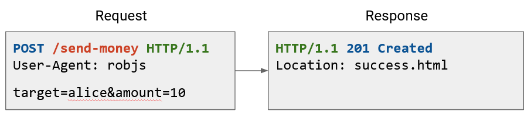

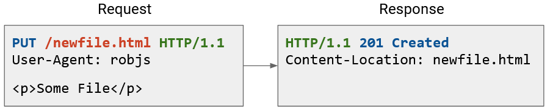

Dưới đây là một số ví dụ khác. Lưu ý rằng phần nội dung trống trong GET request, nhưng chứa dữ liệu trong POST và PUT request. Ngược lại, phản hồi của POST và PUT không có nội dung, nhưng phản hồi của GET thì có.

Mã trạng thái và header cung cấp metadata hữu ích về yêu cầu. Ví dụ: mã trạng thái `201 Created` cho biết tệp mà chúng ta gửi đã được lưu thành công trên server. Header cho biết vị trí trên server nơi tệp được lưu (và chúng ta có thể dùng vị trí đó để tải lại tệp sau này).


## **Speeding Up HTTP with Pipelining** (Tăng tốc HTTP với Pipelining)

Tải một trang duy nhất trong trình duyệt web của bạn có thể yêu cầu nhiều HTTP request. Khi bạn yêu cầu một video YouTube, trình duyệt phải gửi các yêu cầu riêng cho:  
- Video chính  
- HTML chứa văn bản khác trên trang (ví dụ: tiêu đề video, bình luận)  
- Ảnh thu nhỏ (thumbnail) của các video liên quan  
… và nhiều thành phần khác. Nhiều yêu cầu trong số này có thể tới cùng một server (ví dụ: server của YouTube).

Hãy nhớ rằng HTTP chạy trên TCP. Trong trường hợp đơn giản, mỗi yêu cầu riêng biệt sẽ cần bắt đầu một kết nối TCP mới với **3-way handshake**. Sau khi yêu cầu hoàn tất, chúng ta đóng kết nối và lại thực hiện handshake cho yêu cầu tiếp theo.

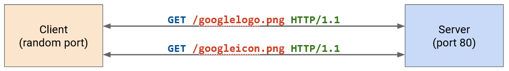

**HTTP/1.1** đã tối ưu điều này bằng cách cho phép nhiều HTTP request và response được **pipelined** (xếp nối) trên cùng một kết nối. Giờ đây, chúng ta không cần một kết nối TCP riêng (với handshake riêng) cho mỗi yêu cầu nữa.

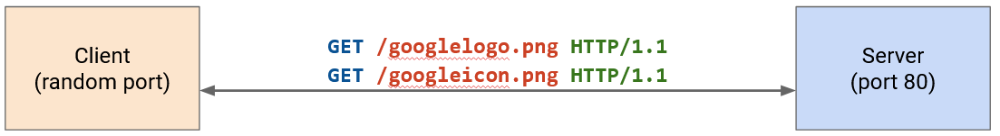

Một nhược điểm của tối ưu hóa này là server giờ phải giữ nhiều kết nối mở đồng thời hơn. Server cần có cơ chế **timeout** (hết thời gian chờ) cho các kết nối. Nếu server bị quá tải với các kết nối mở, client có thể gặp lỗi như `503 Service Unavailable`. Kẻ tấn công có thể lợi dụng điều này để thực hiện **denial-of-service attack** (tấn công từ chối dịch vụ).


## **Tăng tốc HTTP với Caching: Các loại** (Speeding Up HTTP with Caching: Types)

Một chiến lược khác để tăng tốc **HTTP** là lưu vào bộ nhớ đệm (**cache**) các phản hồi, nhằm tránh việc gửi các yêu cầu trùng lặp cho cùng một dữ liệu.

Nếu không có caching, mọi yêu cầu đều phải đi đến server.

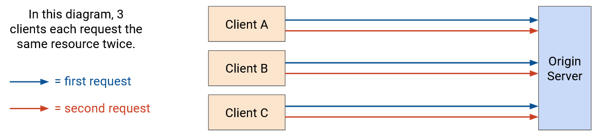

Có ba loại HTTP cache:

- **Private cache** (bộ nhớ đệm riêng) gắn liền với một client (máy khách) cụ thể kết nối tới server (ví dụ: cache trong trình duyệt của bạn). Khi cùng một người dùng yêu cầu cùng một tài nguyên lần thứ hai, họ có thể lấy tài nguyên từ cache cục bộ. Tuy nhiên, private cache không được chia sẻ giữa các người dùng.

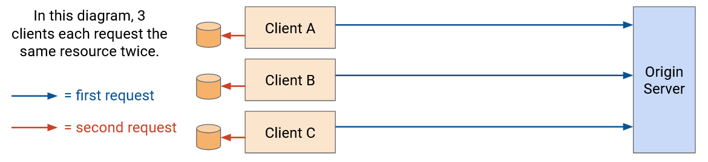

- **Proxy cache** (bộ nhớ đệm proxy) nằm trong mạng (không nằm trên máy của người dùng cuối), và được điều khiển bởi nhà vận hành mạng, không phải nhà cung cấp ứng dụng. Các cache này có thể được chia sẻ giữa nhiều người dùng, vì vậy một người dùng yêu cầu một tài nguyên lần đầu tiên có thể nhận dữ liệu từ proxy cache thay vì từ **origin server** (máy chủ gốc).

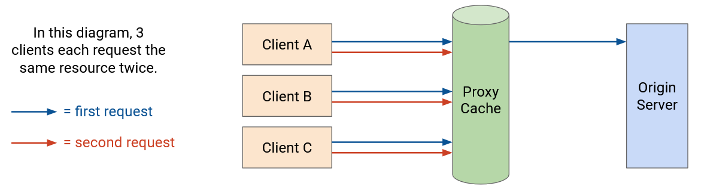

  **Vấn đề** với proxy cache là client cần một cách nào đó để được chuyển hướng tới proxy cache. Ứng dụng không vận hành proxy cache, nên origin server không nhất thiết biết về nó. Nhà vận hành mạng cần một cách để kiểm soát client và thông báo cho họ về proxy cache.

  Một cách phổ biến là “nói dối” trong phản hồi **DNS** (nếu nhà mạng kiểm soát cả proxy cache và **recursive resolver**). Khi client tra cứu địa chỉ IP của origin server, recursive resolver có thể trả về địa chỉ IP của proxy cache (ví dụ: 1.2.3.4). Khi đó, các yêu cầu tới origin server sẽ đi tới proxy cache, nơi có thể phục vụ dữ liệu đã được cache. Nếu tài nguyên chưa có trong proxy cache, proxy cache sẽ gửi yêu cầu tới origin server, nhận dữ liệu và trả lại cho người dùng.

  Một vấn đề khác là ứng dụng không quản lý proxy cache, nên origin server phải tin rằng proxy cache hoạt động đúng (ví dụ: tôn trọng thời hạn cache, trả dữ liệu chính xác).

- **Managed cache** (bộ nhớ đệm được quản lý) nằm trong mạng và do nhà cung cấp ứng dụng điều khiển. Các máy chủ cache này được triển khai riêng biệt, không phải là origin server tạo ra nội dung. Vì được kiểm soát bởi nhà cung cấp ứng dụng, managed cache cho phép ứng dụng có nhiều quyền kiểm soát hơn.

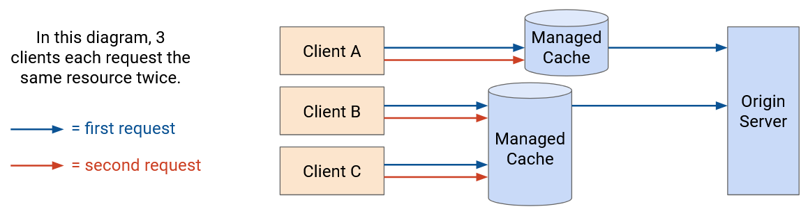

  Vì ứng dụng kiểm soát cả origin server và cache, họ có thể tự chuyển hướng người dùng tới cache. Ví dụ: khi bạn yêu cầu một trang video YouTube từ origin server, phản hồi có thể chứa HTML (tiêu đề video, bình luận). HTML này có thể bao gồm các liên kết để tải video và hình ảnh từ proxy cache (ví dụ: tải từ `static.youtube.com` thay vì `www.youtube.com`).


## **Tăng tốc HTTP với Caching: Lợi ích và Hạn chế** (Benefits and Drawbacks)

Caching mang lại lợi ích cho tất cả mọi bên:

- **Client**: tải trang nhanh hơn vì tránh được các yêu cầu trùng lặp và có thể sử dụng proxy gần hơn.
- **ISP** (nhà cung cấp dịch vụ Internet): giảm số lượng HTTP request/response truyền qua mạng, tiết kiệm băng thông.
- **Server**: nhận ít yêu cầu hơn, giảm tải xử lý.

Tất cả (client, ISP, server) đều quan tâm đến việc mang lại hiệu năng tốt cho client. Client muốn xem video chất lượng cao, và ISP cùng ứng dụng sẽ thu hút nhiều khách hàng hơn nếu cung cấp hiệu năng tốt. Caching giúp đạt được điều này vì client có thể nhận dữ liệu từ cache gần hơn (cục bộ hoặc trong mạng), với độ trễ (**latency**) thấp hơn. Ngoài ra, hãy nhớ rằng **TCP throughput** và **RTT** (round-trip time) tỉ lệ nghịch, nên RTT ngắn hơn tới server gần hơn sẽ cho throughput cao hơn. Điều này đặc biệt hữu ích cho nội dung lớn như video.

Khi nghĩ về caching, cần xem xét nội dung có thay đổi ở các yêu cầu sau hay không:

- **Tài nguyên tĩnh**: không thay đổi giữa các lần yêu cầu (ví dụ: logo Google).
- **Tài nguyên động**: thay đổi tùy người yêu cầu và thời điểm yêu cầu (ví dụ: kết quả tìm kiếm Google).

Một số tài nguyên tĩnh có thể được cache và phục vụ từ proxy hoặc managed cache, trong khi tài nguyên động phải được tạo mới. Ví dụ: kết quả tìm kiếm Google (HTML) cần được tạo động từ origin server, nhưng HTML đó có thể chứa liên kết tải logo Google (tĩnh) từ managed cache.

Thuận lợi là các tài nguyên lớn như hình ảnh và video thường là tĩnh và có thể cache mạnh tay. Nội dung động như HTML tùy biến thường nhỏ hơn. Client có thể lấy nội dung động từ origin server (xa) và dùng cache/proxy (gần) cho nội dung tĩnh.


## **Tăng tốc HTTP với Caching: Triển khai** (Implementation)

Để triển khai caching, chúng ta cần dùng **HTTP header** để mang metadata về caching (ví dụ: thời gian lưu cache). Đây là một ví dụ khác cho thấy header giúp mở rộng giao thức gốc (vốn không hỗ trợ caching).

- Trong **HTTP/1.0**, caching dùng **Expires header**, chỉ định thời gian dữ liệu có thể được cache.
- Trong **HTTP/1.1**, giới thiệu **Cache-Control header** phức tạp hơn. Để tương thích, một số web server trả về cả hai header. Client HTTP/1.0 sẽ bỏ qua Cache-Control, còn client HTTP/1.1 sẽ ưu tiên Cache-Control hơn Expires.

**Cache-Control header** chỉ định loại cache nào được phép lưu dữ liệu và thời gian lưu. Ví dụ: nếu tài nguyên là động và thay đổi theo từng người dùng nhưng giữ nguyên theo thời gian cho một người dùng cụ thể, server có thể trả về:

```
Cache-Control: private, max-age=86400
```

Điều này nghĩa là nội dung chỉ được lưu trong cache cục bộ của người dùng (không lưu trong proxy/managed cache chia sẻ) và có thể lưu trong 1 ngày (86400 giây).

Một số dữ liệu không thể cache (ví dụ: nội dung động thay đổi thường xuyên). Khi đó, server có thể đặt:

```
Cache-Control: no-store
```

để báo rằng client và proxy không được cache nội dung.

Cache-Control là tùy chọn, nên không đảm bảo client sẽ đọc hoặc tuân thủ. Bạn có thể coi đây là “yêu cầu” từ server để cache dữ liệu. Điều này đặc biệt đáng lo với proxy cache (không do nhà cung cấp ứng dụng vận hành). Ngược lại, private cache do client (trình duyệt) vận hành, vi phạm chỉ ảnh hưởng tới chính họ. Managed cache do cùng nhà cung cấp ứng dụng vận hành, nên họ có thể đảm bảo tuân thủ quy tắc từ origin server.

Header này cũng có thể dùng cho chính sách phức tạp hơn. Ví dụ: server có thể cho phép cache dữ liệu, nhưng yêu cầu trước khi dùng dữ liệu cache, client phải gửi **HTTP HEAD request** để lấy lại header và xác thực dữ liệu. Nếu header cho thấy dữ liệu đã thay đổi, hãy xóa cache.


## **Content Delivery Networks (CDNs)** – Mạng phân phối nội dung

Trước đây, chúng ta đã thấy rằng **managed cache** (bộ nhớ đệm được quản lý) là một chiến lược tốt để lưu đệm và cải thiện hiệu năng cho người dùng. Không giống như **private cache** (bộ nhớ đệm riêng), chúng được chia sẻ giữa nhiều người dùng (ví dụ: một người dùng yêu cầu một nội dung lần đầu tiên vẫn có thể được phục vụ từ cache). Đồng thời, khác với **proxy cache** (bộ nhớ đệm proxy), chúng được kiểm soát bởi nhà cung cấp ứng dụng (**application provider**), điều này giúp ứng dụng có nhiều quyền kiểm soát hơn. Ứng dụng có thể đảm bảo rằng cache tuân thủ các quy tắc do **origin server** (máy chủ gốc) đặt ra, và origin server có thể kiểm soát việc người dùng được chuyển hướng tới cache nào.

Triển khai managed cache trên toàn mạng dẫn đến ý tưởng về **Content Delivery Network (CDN)** – tập hợp các máy chủ trong mạng phục vụ nội dung (ví dụ: các tài nguyên HTTP).

Để đạt hiệu năng tốt, chúng ta cố gắng đặt CDN gần người dùng cuối. Ở đây, “gần” có nghĩa là gần về mặt địa lý, nhưng cũng gần về mặt mạng (ít số bước nhảy hơn).

CDN mang lại tất cả lợi ích của caching. Người dùng nhận được nội dung với hiệu năng cao hơn vì máy chủ gần hơn. Chúng ta có thể giảm lượng **network bandwidth** (băng thông mạng) và hạ tầng cần thiết, vì người dùng chủ yếu gửi yêu cầu tới các máy chủ gần thay vì một origin server duy nhất (có thể ở rất xa).

CDN cho phép nhà cung cấp mở rộng hạ tầng máy chủ dễ dàng hơn. Với một origin server duy nhất, chúng ta phải nâng cấp máy chủ đó trở nên cực kỳ mạnh và có băng thông cực lớn. Ngược lại, với CDN, chúng ta chỉ cần bổ sung thêm nhiều máy chủ nhỏ trên khắp Internet.

CDN cũng cung cấp khả năng **redundancy** (dự phòng) tốt hơn cho nhà cung cấp. Nếu một origin server gặp sự cố, dịch vụ có thể bị gián đoạn. Ngược lại, với CDN, nếu một máy chủ gặp sự cố, người dùng vẫn có thể được chuyển hướng tới các máy chủ khác.


## **Triển khai CDN** (CDN Deployment)

Hãy nhớ lại mô hình Internet: Yêu cầu của client được chuyển tiếp qua các **WAN router** (do ISP sở hữu) cho đến khi đến một **peering location** (điểm kết nối ngang hàng). Sau đó, yêu cầu đi tới peering location trong mạng của nhà cung cấp ứng dụng. Yêu cầu tiếp tục đi qua mạng WAN của ứng dụng cho đến khi đến **datacenter network** (mạng trung tâm dữ liệu), nơi đặt origin server.

Nếu không triển khai CDN, mọi yêu cầu đều phải đến origin server. Điều này dẫn đến **latency** (độ trễ) cao nhất (so với các phương án có CDN), hiệu năng thấp nhất, yêu cầu nhiều băng thông nhất, và buộc origin server phải mở rộng để xử lý mọi yêu cầu.

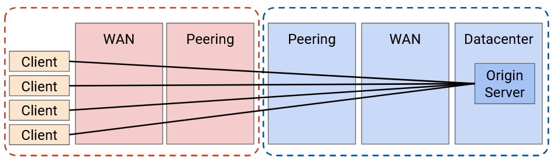

Một lựa chọn tốt hơn là triển khai một số máy chủ CDN ở rìa mạng của nhà cung cấp ứng dụng. Ví dụ: nếu mạng của Google kết nối ngang hàng với mạng ISP ở New York, chúng ta có thể đặt một số CDN tại đó.

Khi đó, lượng băng thông truyền qua mạng của nhà cung cấp ứng dụng giảm đáng kể. Origin server chỉ cần gửi video tới CDN một lần, và CDN có thể phục vụ video đó cho nhiều người dùng. Mạng ứng dụng không còn cần mở rộng mạng WAN của mình.

Ngoài ra, như đã thấy, chúng ta có thể mở rộng bằng cách thêm nhiều CDN thay vì nâng cấp một origin server duy nhất. Chúng ta cũng có thêm khả năng dự phòng.

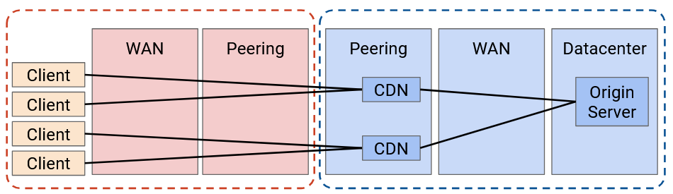

Chúng ta có thể làm tốt hơn nữa bằng cách đẩy caching sâu hơn vào trong mạng. Lúc này, ứng dụng triển khai máy chủ ngay bên trong mạng của ISP.

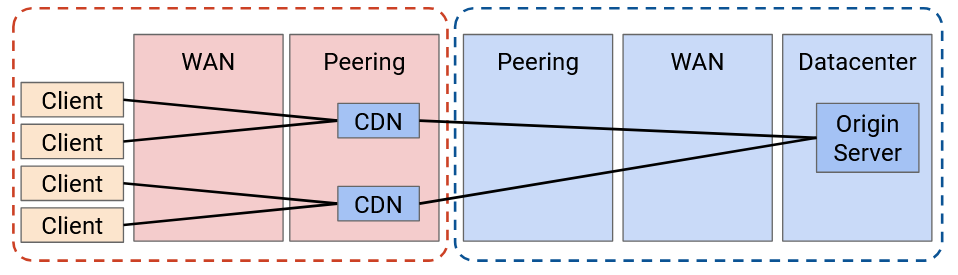

Tại sao ISP lại đồng ý cho ứng dụng triển khai CDN trong mạng của họ? Thực tế, điều này mang lại lợi ích cho cả hai bên. Khách hàng của ISP sẽ có hiệu năng tốt hơn vì họ có thể sử dụng CDN gần hơn. Ngoài ra, lưu lượng lớn giữa người dùng và CDN giờ đây được giữ hoàn toàn trong mạng của ISP. Điều này có nghĩa là ISP cần ít băng thông hơn ở kết nối peering giữa ISP và ứng dụng (vì nội dung chỉ được gửi một lần qua kết nối đó).

Trên thực tế, ISP và CDN thường hợp tác để triển khai máy chủ. Ví dụ: ứng dụng cung cấp máy chủ miễn phí, và ISP kết nối máy chủ vào mạng miễn phí. Trong một số trường hợp, ISP và CDN cần đàm phán về khoản thanh toán (CDN trả cho ISP hoặc ISP trả cho CDN), tùy thuộc vào vị trí triển khai máy chủ trong mạng và chi phí máy chủ cũng như kết nối. Tuy nhiên, cả hai bên đều có lợi ích trong việc triển khai các máy chủ này.

Chúng ta có thể tiến xa hơn nữa, nhưng cuối cùng sẽ gặp giới hạn chi phí – lợi ích. Trong trường hợp cực đoan, chúng ta có thể triển khai CDN tại từng hộ gia đình, nhưng chi phí có thể vượt quá lợi ích. Đặc biệt, CDN hoạt động tốt nhất khi có nhiều người dùng sử dụng nó. Cache tập thể sẽ lớn hơn, và một điểm triển khai có thể phục vụ nhiều người dùng.

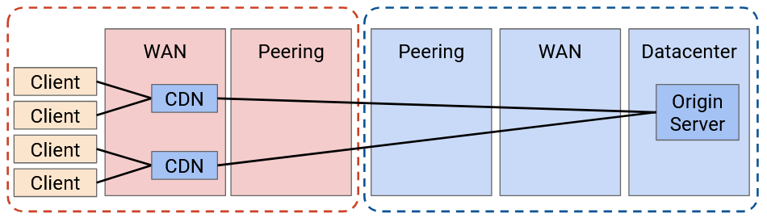

Nói chung, luôn tồn tại sự đánh đổi giữa chi phí bổ sung CDN mới và số tiền tiết kiệm được từ việc giảm xây dựng băng thông. Trên thực tế, CDN tồn tại trong mạng ISP vì chúng vẫn mang lại lợi nhuận khi lắp đặt.

Báo cáo năm 2023 của **Sandvine** (công ty giám sát gói tin) cho thấy 15% tổng lưu lượng Internet đến từ Netflix, 11,4% từ YouTube, và 4,5% từ Disney+. Nếu một ISP cài đặt máy chủ cho chỉ ba ứng dụng này trong mạng của họ, họ có thể giảm tới 25% dung lượng mạng cần xây dựng.

Các nhà cung cấp ứng dụng lớn như Google, Netflix, Amazon và Facebook triển khai CDN cả trong mạng của họ và trong mạng ISP.

Nếu bạn là nhà cung cấp ứng dụng, có thể bạn không phải là “ông lớn” công nghệ như Google hay Amazon, nhưng bạn vẫn muốn nội dung của mình được phân phối qua CDN để đạt hiệu năng tốt. Các ứng dụng nhỏ hơn có thể không đủ khả năng tự triển khai CDN. Tuy nhiên, các công ty như Cloudflare, Akamai và Edgio đã triển khai CDN, và bạn có thể trả phí để họ phân phối nội dung của bạn trên CDN sẵn có của họ. Các nhà cung cấp CDN này cũng triển khai hạ tầng cả trong mạng của họ và trong mạng ISP.

CDN cũng có thể được ISP sử dụng, vì bản thân ISP cũng có thể có ứng dụng phục vụ nội dung. Khi bạn trả tiền cho dịch vụ Internet, ISP có thể cung cấp thêm dịch vụ TV (truyền hình trực tiếp hoặc video theo yêu cầu). Các ISP này triển khai CDN riêng để phục vụ nội dung TV đó một cách hiệu quả.

Về cơ bản, các máy chủ trong CDN giống như bất kỳ máy chủ nào khác trên Internet cung cấp nội dung, mặc dù chúng thường được tối ưu hóa cao để lưu trữ và phân phối lượng lớn nội dung. Một số máy chủ có thể được tối ưu để lưu trữ và phục vụ lượng lớn dữ liệu, trong khi một số khác được tối ưu để phục vụ nhanh các phần nội dung nhỏ cho số lượng lớn khách hàng.


## **Directing Clients to Caches** (Chuyển hướng client tới các bộ nhớ đệm)

Trong một **CDN (Content Delivery Network – Mạng phân phối nội dung)**, có nhiều máy chủ khác nhau trên khắp Internet cùng cung cấp một nội dung giống nhau. Vậy làm thế nào để client (máy khách) biết nên kết nối tới máy chủ nào?

Một số kỹ thuật từ **DNS (Domain Name System)** cũng có thể áp dụng cho CDN. Chúng ta có thể sử dụng **anycast**, trong đó nhiều máy chủ quảng bá cùng một tiền tố địa chỉ IP (**IP prefix**). Điều này cho phép thuật toán định tuyến tìm đường tốt nhất tới bất kỳ máy chủ nào trong số đó.

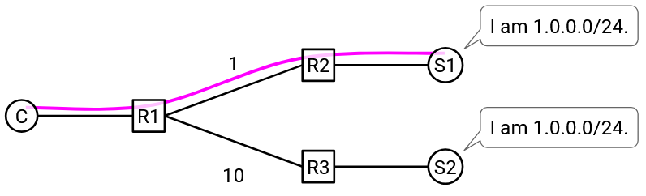

Một vấn đề của anycast là với các kết nối dài hạn. Giả sử client đang có một kết nối **TCP** đang hoạt động với một trong các máy chủ. Trong quá trình kết nối, một liên kết trung gian trong mạng bị lỗi. Vì tất cả các máy chủ đều có cùng địa chỉ IP, nên từ góc nhìn của router trung gian, việc chuyển tiếp tới bất kỳ máy chủ nào cũng hợp lệ. Router trung gian có thể bắt đầu chuyển tiếp gói tin tới một máy chủ khác (có cùng địa chỉ IP). Tuy nhiên, kết nối TCP ban đầu là với máy chủ cũ, và máy chủ mới này không thể tiếp tục kết nối đó.

Lưu ý rằng vấn đề này không xảy ra khi chúng ta dùng anycast trong DNS, vì các kết nối DNS rất ngắn (thường chỉ là một gói UDP duy nhất).

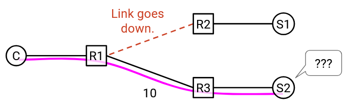

Chúng ta cũng có thể dùng DNS để **load-balance** (cân bằng tải). Khác với anycast, các máy chủ lúc này có địa chỉ IP khác nhau, nhưng vẫn cùng một tên miền. Khi client truy vấn ánh xạ tên miền–IP, **DNS name server** có thể trả về địa chỉ IP khác nhau tùy theo vị trí của client.

Cách tiếp cận dựa trên DNS này không gặp vấn đề với kết nối dài hạn như anycast, vì các máy chủ có địa chỉ khác nhau. Router sẽ không đột ngột chuyển gói tin sang máy chủ khác.

Một vấn đề của cách tiếp cận dựa trên DNS là thiếu tính chi tiết (**granularity**). Ví dụ cực đoan: giả sử tất cả người dùng trong ISP Comcast dùng chung một **recursive resolver**. Điều này có nghĩa là tất cả gửi truy vấn DNS tới resolver này, và resolver sẽ gửi truy vấn tới **application name server**. Application name server chỉ thấy rằng truy vấn đến từ Comcast, và phải trả về một địa chỉ IP duy nhất cho Comcast. Kết quả là mọi người dùng trong mạng Comcast sẽ dùng cùng một máy chủ, ngay cả khi họ ở khắp nơi trên thế giới.

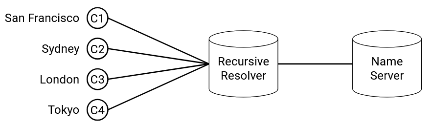

Một cách tiếp cận mạnh mẽ hơn anycast hoặc DNS là **application-level mapping** (ánh xạ ở tầng ứng dụng). Khi origin server nhận một yêu cầu HTTP, các liên kết trong phản hồi có thể trỏ tới các máy chủ khác nhau (ví dụ: `static1.google.com` hoặc `static2.google.com`, hai máy chủ ở các vị trí khác nhau), tùy thuộc vào nơi yêu cầu xuất phát. Hoặc, origin server có thể trả về mã trạng thái HTTP 300-level để chuyển hướng người dùng tới máy chủ phù hợp.

Cách tiếp cận ở tầng ứng dụng này không gặp vấn đề về granularity như DNS, vì ứng dụng có thể thấy địa chỉ của client trong yêu cầu HTTP. Nó cũng không gặp vấn đề của anycast, vì các máy chủ có thể có địa chỉ IP khác nhau.

Tuy nhiên, giống như trong cân bằng tải dựa trên DNS, ứng dụng vẫn cần một cách để ước lượng máy chủ gần nhất với client (gần có thể là về mặt địa lý hoặc dựa trên cấu trúc mạng).

Một lợi ích của application-level mapping là có thể tinh chỉnh tùy theo nội dung. Ví dụ: các video phổ biến có thể được triển khai trên nhiều máy chủ, cho phép mọi client lấy video từ máy chủ gần nhất. Ngược lại, các video ít phổ biến hơn có thể chỉ được triển khai trên ít máy chủ, buộc người dùng phải kết nối xa hơn để lấy nội dung.


## **Newer HTTP Versions** (Các phiên bản HTTP mới hơn)

Khi Internet phát triển, **HTTP** bắt đầu được sử dụng bởi ngày càng nhiều ứng dụng, vì đây là một giao thức rất dễ tổng quát hóa.

Cuối cùng, vấn đề bảo mật của HTTP trở nên đáng lo ngại hơn. Một máy chủ ngân hàng chạy HTTP có lẽ không muốn thông tin được gửi dưới dạng văn bản thuần (**plaintext**) qua mạng, nơi các router trung gian hoặc kẻ tấn công có thể đọc được.

**HTTPS** là một phần mở rộng của HTTP bổ sung bảo mật. Một giao thức gọi là **TLS (Transport Layer Security)** được xây dựng trên TCP, nơi người dùng trao đổi khóa bí mật và mã hóa thông điệp trước khi gửi qua bytestream. HTTPS có cùng giao thức cơ bản, nhưng chạy trên TLS (TLS chạy trên TCP), thay vì trực tiếp trên TCP không bảo mật. Trong những năm gần đây, đã có xu hướng nâng cấp website lên HTTPS, và tính đến năm 2024, hơn 85% website mặc định sử dụng HTTPS.

**HTTP/2.0** được giới thiệu năm 2015, là bản sửa đổi lớn đầu tiên của giao thức kể từ năm 1997. Mục tiêu chính là cải thiện hiệu năng bằng cách giảm độ trễ và tăng tốc độ tải trang.

HTTP/2.0 giới thiệu **server push** (đẩy từ phía máy chủ), cho phép server gửi phản hồi ngay cả khi client chưa gửi yêu cầu. Điều này cho phép server dự đoán và chủ động gửi nội dung mà người dùng có thể cần, mà không phải chờ yêu cầu. Ví dụ: khi tìm kiếm Google, HTML kết quả được trả về. Sau đó, trình duyệt phân tích HTML, nhận ra cần logo Google và gửi yêu cầu HTTP khác. Với HTTP/2.0, server có thể gửi logo Google ngay lập tức, không cần chờ yêu cầu.

HTTP/2.0 còn có các cải tiến hiệu năng khác:  
- **Header compression** (nén header) để tiết kiệm dung lượng.  
- **Request/response prioritization** (ưu tiên yêu cầu/phản hồi) để nội dung quan trọng (ví dụ: văn bản kết quả tìm kiếm) được gửi trước nội dung ít quan trọng (ví dụ: logo Google).  
- **Multiplexing** hiệu quả hơn: nhiều yêu cầu đồng thời được xử lý thông minh, tránh việc phản hồi nhỏ bị chặn bởi phản hồi lớn.

HTTP/2.0 được hỗ trợ rộng rãi bởi cả client (trình duyệt hiện đại) và server (ví dụ: CDN).

**HTTP/3.0** được giới thiệu năm 2022 (không lâu sau HTTP/2.0, so với khoảng cách giữa 1.1 và 2.0). Ngữ nghĩa giống HTTP/2.0, nhưng thay đổi giao thức tầng vận chuyển (**transport layer protocol**). Thay vì chạy trên bytestream của TCP, HTTP/3.0 chạy trên một giao thức vận chuyển mới gọi là **QUIC (Quick UDP Connections)**, được thiết kế riêng để hoạt động tốt với HTTP/3.0. QUIC được Google phát triển và chuẩn hóa tại **IETF**.

HTTP/3.0 là một ví dụ về việc cố ý từ bỏ một trong những nguyên tắc cốt lõi của mạng máy tính (**layering**) để đổi lấy hiệu quả cao hơn. Bằng cách cho phép thiết kế tùy chỉnh cả giao thức tầng vận chuyển (QUIC) và tầng ứng dụng (HTTP/3.0), chúng ta có thể tối ưu để cả hai hoạt động tốt cùng nhau.
