# **Triển khai Collective** (Collective Implementations)

## **Động lực: Triển khai AllReduce** (Motivation: Implementing AllReduce)

Bây giờ, khi chúng ta đã có định nghĩa của 7 **collective** (tập hợp thao tác truyền thông tin giữa nhiều nút), chúng ta có thể bắt đầu suy nghĩ về cách triển khai chúng trong một mạng. Để triển khai một collective, có hai câu hỏi cần trả lời:  
- Chúng ta sử dụng **topology** (kiến trúc kết nối) nào để kết nối các nút?  
- Dữ liệu nào cần được trao đổi giữa các nút để hoàn thành thao tác một cách hiệu quả?

Khi đã quyết định topology sẽ dùng và dữ liệu cần trao đổi, chúng ta có thể phân tích hiệu năng của thiết kế. Tổng lượng **network bandwidth** (băng thông mạng) đã sử dụng là bao nhiêu? Thời gian để hoàn thành thao tác là bao lâu? Có thể tập trung vào các chỉ số hiệu năng khác, nhưng trong phần này, chúng ta sẽ tập trung vào hai chỉ số này.

Để đo hiệu năng, chúng ta định nghĩa một số biến: Có tổng cộng $$p$$ nút. Mỗi vector có tổng cộng $$D$$ byte. Điều này có nghĩa là mỗi phần tử vector (mỗi ô trong hình minh họa) có kích thước $$D/p$$ byte.

Trong phần này, chúng ta đặt $$p=5$$ để một số ví dụ minh họa dễ hình dung hơn. Lưu ý rằng điều này cũng có nghĩa là mỗi vector bây giờ có 5 phần tử thay vì 4 phần tử. (Ghi chú: Hãy nhớ rằng vector đại diện cho dữ liệu bất kỳ, và chúng ta chia mỗi vector thành $$p$$ **sub-vector** (vector con) có kích thước bằng nhau, trong đó $$p$$ là tổng số nút. Việc tăng $$p$$ từ 4 lên 5 không nhất thiết nghĩa là có nhiều dữ liệu hơn, mà có thể chỉ là chia cùng một lượng dữ liệu thành 5 phần thay vì 4 phần.)

Trong phần này, chúng ta sẽ tập trung vào việc triển khai collective **AllReduce**, mặc dù các ý tưởng có thể áp dụng cho các collective khác. Nhắc lại rằng AllReduce tính tổng theo từng phần tử của các vector, sau đó gửi vector tổng này tới tất cả các nút.

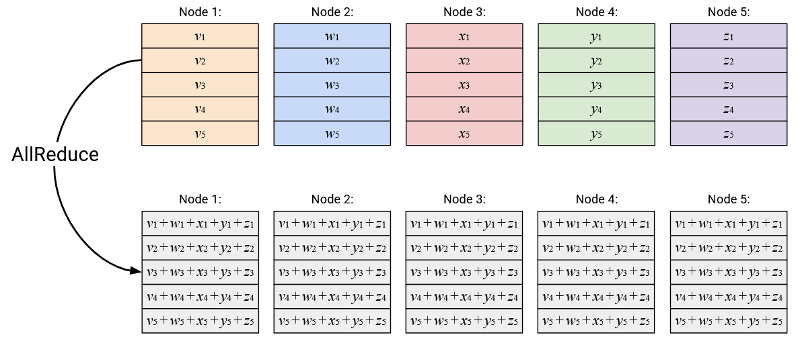

## **Cách tiếp cận 1: Full Mesh** (Approach 1: Full Mesh)

Topology đầu tiên chúng ta xem xét là **full-mesh** (lưới đầy đủ), trong đó mỗi nút có một liên kết trực tiếp tới mọi nút khác.

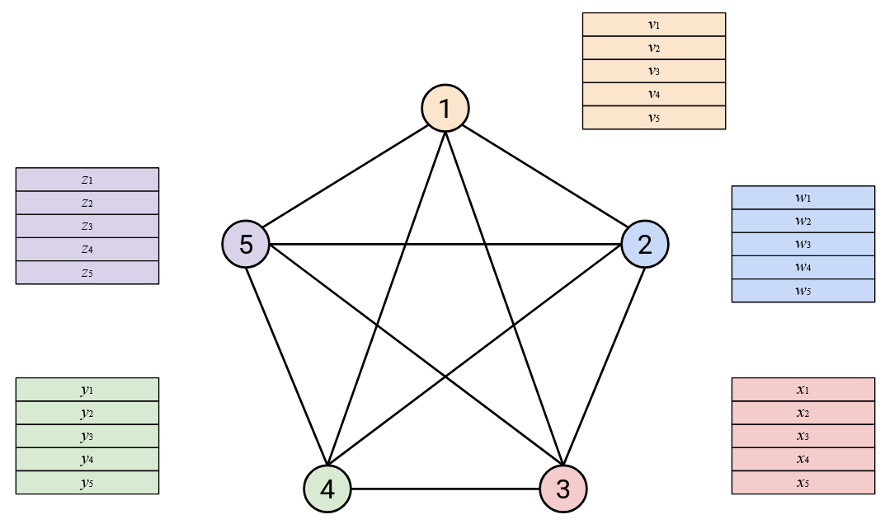

Với topology này, chúng ta có thể triển khai AllReduce theo các bước:  
1. Mỗi nút gửi toàn bộ vector của mình trực tiếp tới mọi nút khác.

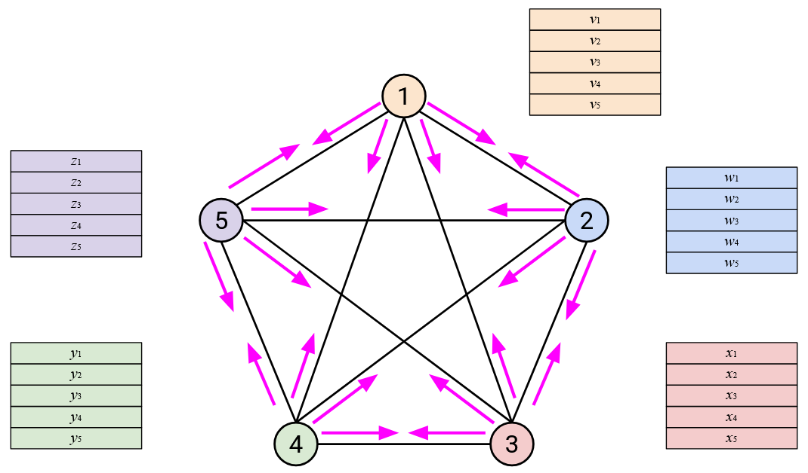

2. Sau đó, mỗi nút cộng tất cả các vector mà nó nhận được.

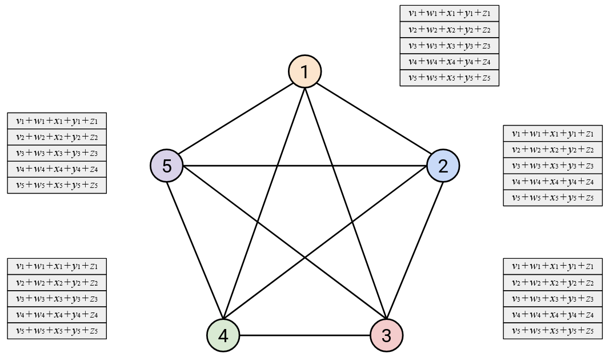

**Băng thông sử dụng:** Mỗi nút cần gửi toàn bộ vector ($$D$$ byte) của mình tới tất cả $$p-1$$ nút khác, nên mỗi nút gửi $$D(p-1)$$ byte. Có tổng cộng $$p$$ nút, nên tổng dữ liệu gửi là $$Dp(p-1) = O(D \cdot p^2)$$ byte.

**Thời gian thực hiện:** Phụ thuộc vào giới hạn tài nguyên của các nút và liên kết, nhưng giả sử không có giới hạn tài nguyên, tất cả việc gửi vector có thể diễn ra đồng thời, hoàn thành trong một bước thời gian (**time step**). Nói cách khác, Node 1 gửi dữ liệu tới tất cả các nút khác, sử dụng đồng thời tất cả các liên kết ra của nó. Cùng lúc đó, Node 2 cũng gửi dữ liệu tới tất cả các nút khác, sử dụng đồng thời tất cả các liên kết ra của nó. Giả sử không có giới hạn tài nguyên, cách tiếp cận này chỉ mất một time step để hoàn thành, trong đó mỗi nút cần gửi và nhận $$2 \cdot D \cdot (p-1)$$ byte mỗi time step (mỗi nút gửi $$D \cdot (p-1)$$ byte và nhận $$D \cdot (p-1)$$ byte, cộng lại thành hệ số 2).

## **Cách tiếp cận 2: Reduce tại một nút** (Approach 2: Reduce at One Node)

Trong topology tiếp theo, chúng ta để một nút duy nhất thực hiện toàn bộ công việc tính toán:

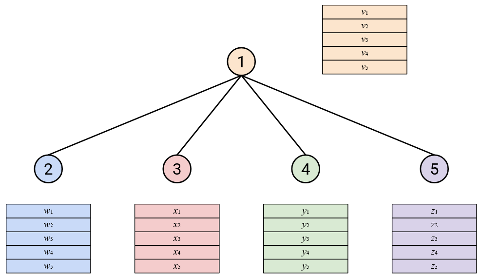

Để chạy AllReduce:  
1. Tất cả các nút (trừ Node 1) gửi vector của mình tới Node 1.

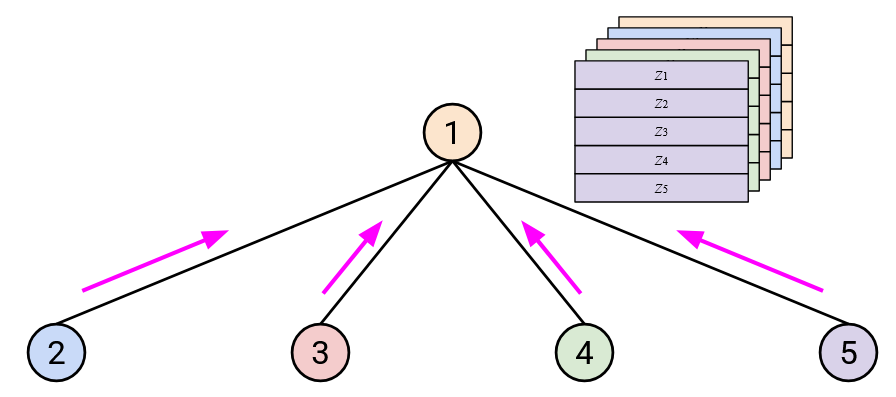

2. Node 1 tính tổng, và gửi vector tổng này trở lại cho tất cả các nút.

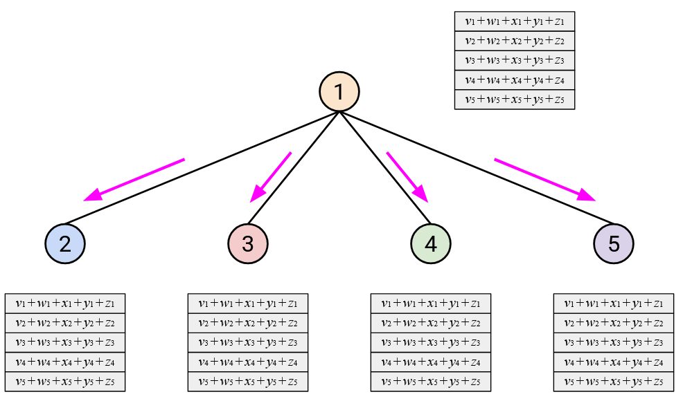

**Băng thông sử dụng:**  
- Bước 1: Mỗi nút (trừ Node 1) cần gửi toàn bộ vector tới Node 1, tức là $$D$$ byte. Có $$p-1$$ nút gửi dữ liệu, nên tổng dữ liệu gửi trong bước này là $$D(p-1)$$ byte.  
- Bước 2: Node 1 phải gửi vector tổng tới tất cả các nút khác. Vector tổng có kích thước $$D$$ byte, gửi tới $$p-1$$ nút, nên tổng dữ liệu gửi trong bước này cũng là $$D(p-1)$$ byte.

Tổng cộng, qua hai bước, chúng ta gửi $$2 \cdot D \cdot (p-1) = O(D \cdot p)$$ byte. Lưu ý rằng đây là cải thiện hệ số $$p$$ so với $$O(D \cdot p^2)$$ byte trong cách tiếp cận full-mesh.

**Thời gian thực hiện:** Giả sử không có giới hạn tài nguyên, tất cả các nút có thể gửi vector của mình tới Node 1 cùng lúc. Sau đó, chúng ta phải chờ Node 1 tính tổng. Khi tổng đã được tính, Node 1 có thể gửi vector tổng tới tất cả các nút khác cùng lúc. Tổng cộng, cách tiếp cận này mất 2 time step để hoàn thành, trong đó Node 1 phải gửi hoặc nhận $$D \cdot (p-1)$$ byte mỗi time step.

Chúng ta không đo chính xác độ dài của một time step ở đây, nhưng điểm so sánh chính là: với cách tiếp cận này, toàn bộ việc gửi ở bước 1 phải hoàn tất trước khi việc gửi ở bước 2 bắt đầu. Ngược lại, trong cách tiếp cận đầu tiên, toàn bộ dữ liệu có thể được gửi đồng thời.

**Nhược điểm:** Cách tiếp cận này tạo ra một **single point of failure** (điểm lỗi đơn) tại Node 1. Do đó, cách này không thường được sử dụng trong thực tế.

## **Cách tiếp cận 3: Tree-Based** (Dựa trên cấu trúc cây)

Trong topology tiếp theo, chúng ta sẽ xây dựng một **binary tree** (cây nhị phân). Ở đây, “binary” nghĩa là mỗi nút có tối đa 2 **child** (nút con).

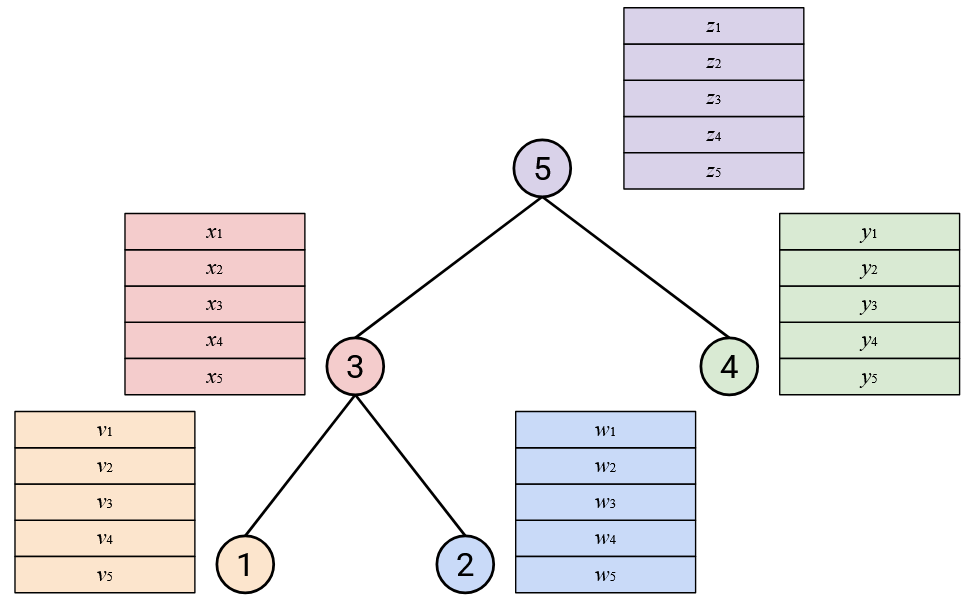

Để chạy **AllReduce**: Bắt đầu từ các **leaf node** (nút lá) ở đáy cây, mỗi nút gửi vector của mình tới **parent** (nút cha).

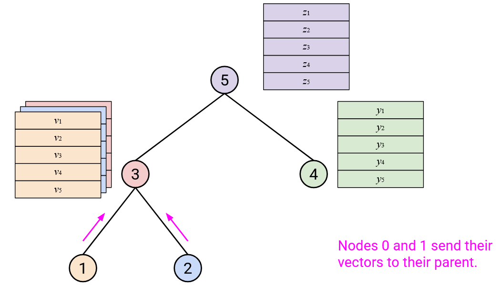

Khi nhận được tất cả vector từ các child, bạn sẽ cộng chúng với vector của mình.

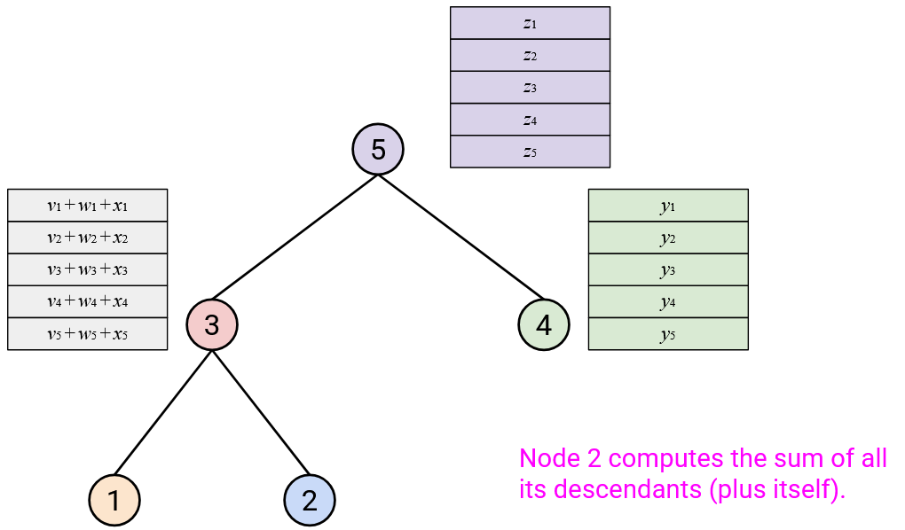

Sau đó, bạn gửi vector tổng này lên parent.

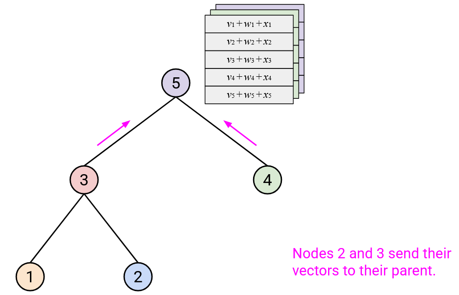

Sau khi lặp lại bước này qua tất cả các tầng của cây, **root** (nút gốc) sẽ tính được tổng cuối cùng.

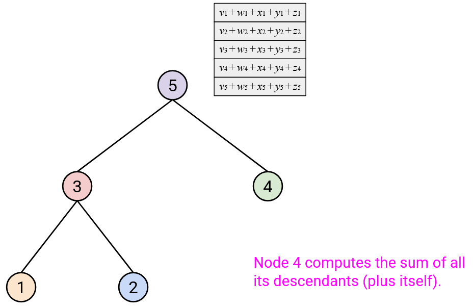

Tiếp theo, ở bước thứ hai, root gửi vector tổng này xuống cây, tới các child của nó. Khi nhận được vector tổng từ parent, bạn sẽ gửi một bản sao của vector tổng đó tới tất cả các child của mình.

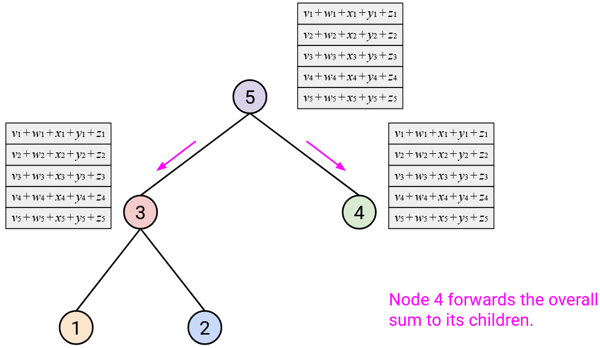

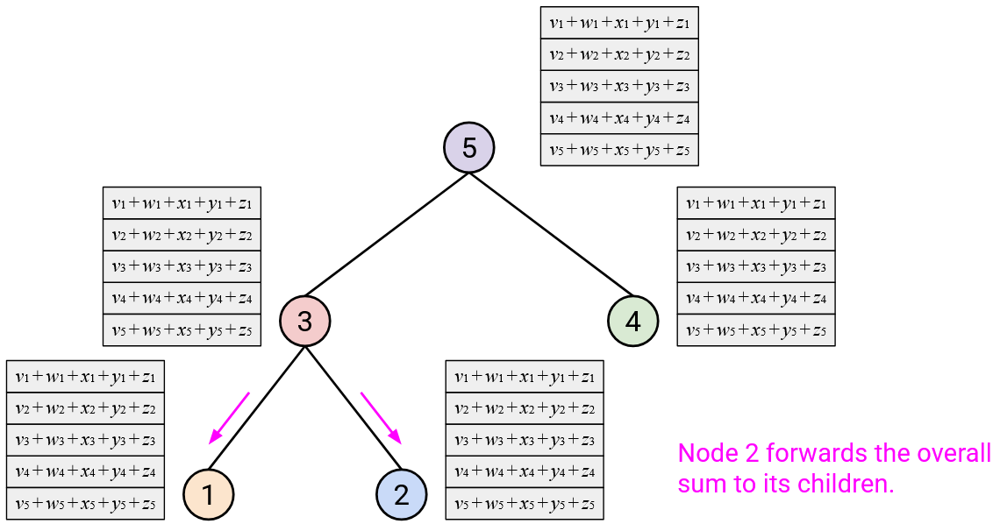

**Băng thông sử dụng:**  
- Bước 1: Mỗi nút nhận tối đa 2 vector từ các child (vì cây là nhị phân) và gửi 1 vector tới parent. Điều này cho giới hạn trên là $$3D$$ byte mỗi nút, tổng cộng $$3D \cdot p$$ byte trong Bước 1.  
- Bước 2: Mỗi nút nhận 1 vector từ parent và gửi tối đa 2 vector tới các child. Giới hạn trên vẫn là $$3D$$ byte mỗi nút, tổng cộng $$3D \cdot p$$ byte trong Bước 2.

Tổng cộng, qua hai bước, chúng ta gửi $$6 \cdot D \cdot p = O(D \cdot p)$$ byte. Đây là cải thiện hệ số $$p$$ so với **full-mesh**, và bằng với cách tiếp cận **reduce-at-one-node**.

**Thời gian thực hiện:** Bạn phải chờ nhận vector từ các child trước khi có thể gửi vector tổng (tổng vector của bạn và vector của các child) lên parent. Tổng cộng, cách tiếp cận này mất $$O(\log p)$$ **time step** để gửi vector lên cây, và thêm $$O(\log p)$$ time step để gửi vector tổng xuống cây, tức tổng cộng $$O(\log p)$$ time step. Mỗi nút phải gửi hoặc nhận tối đa $$3D$$ byte mỗi time step (ít hơn so với các cách tiếp cận khác). So sánh chính xác về thời gian cần thay thế giá trị $$D$$ và giới hạn tài nguyên mạng, nhưng nhìn chung, cách này cần nhiều time step hơn, song mỗi time step có thể hoàn thành nhanh hơn vì lượng dữ liệu truyền nhỏ hơn.

Lưu ý rằng chúng ta đã tận dụng phép **reduction** (giảm dữ liệu) trong triển khai này. Mỗi nút cộng vector của mình với vector của các child, nên chỉ cần gửi một vector tổng duy nhất lên parent. Trong cách tiếp cận ngây thơ hơn, mỗi nút sẽ gửi cả 3 vector (vector của mình và của 2 child) lên parent, nhưng ở đây chúng ta đã tiết kiệm băng thông.

Nói chung, các collective dạng hợp nhất dữ liệu (**Reduce**, **ReduceScatter**, **AllReduce**) cho phép tối ưu triển khai. Trong Reduce và ReduceScatter, tổng lượng dữ liệu nhận thực tế nhỏ hơn lượng dữ liệu gửi, và chúng ta có thể tận dụng điều này. Ví dụ, nếu biết đầu ra là tổng của tất cả vector, và bạn nhận 2 vector, bạn có thể cộng chúng lại và gửi một vector tổng duy nhất, thay vì gửi riêng từng vector.

## **Cách tiếp cận 4: Ring-Based (Naive)** (Dựa trên vòng – Ngây thơ)

Trong hai cách tiếp cận cuối, chúng ta sẽ xây dựng topology dạng **ring** (vòng). Lưu ý rằng liên kết vòng từ Node 1 tới Node 5 không có gì đặc biệt so với các liên kết khác (việc liên kết này dài hơn không mang ý nghĩa gì).

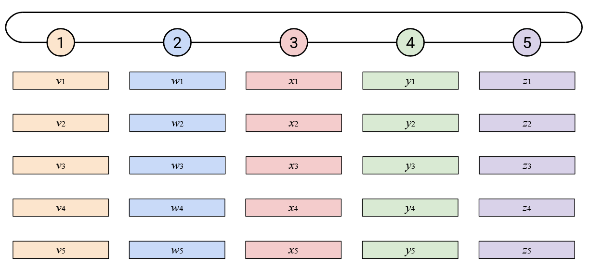

Để chạy AllReduce theo cách ngây thơ: Node 5 bắt đầu bằng cách gửi vector của mình sang trái.

Khi nhận vector từ **neighbor** (nút láng giềng) bên phải, bạn cộng nó với vector của mình.

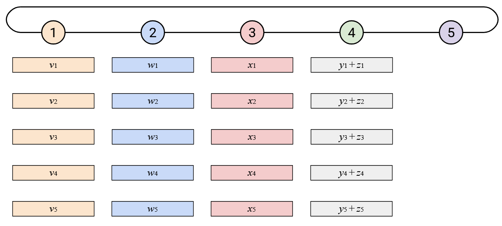

Sau đó, bạn gửi vector tổng này sang **neighbor** bên trái.

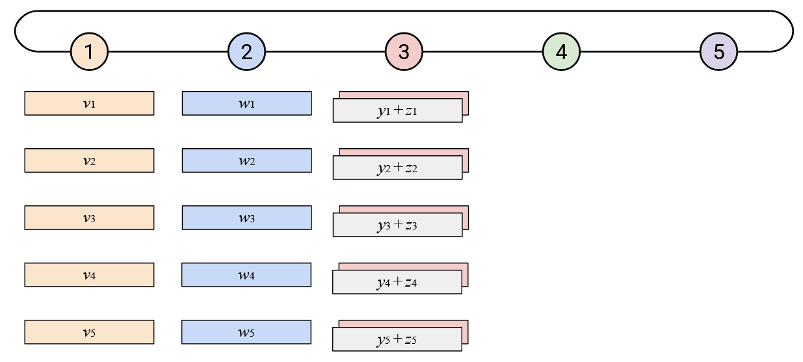

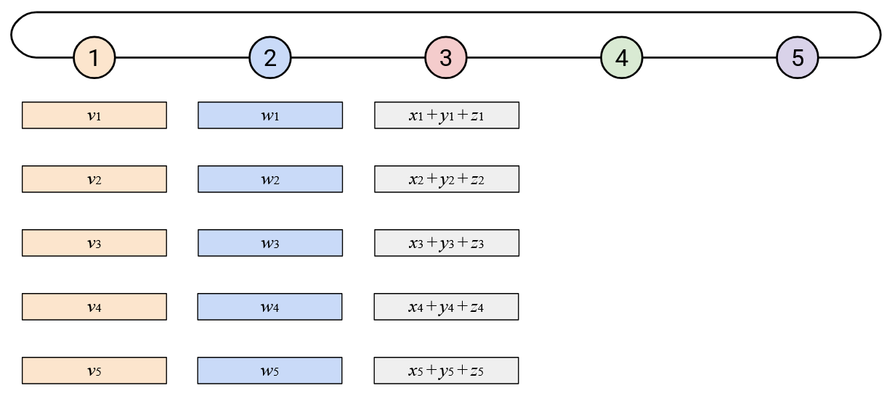

Quá trình này sẽ tiếp tục quanh vòng.

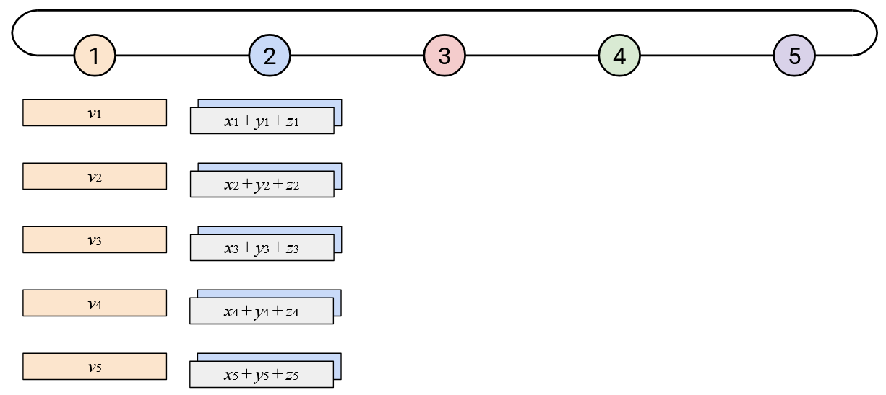

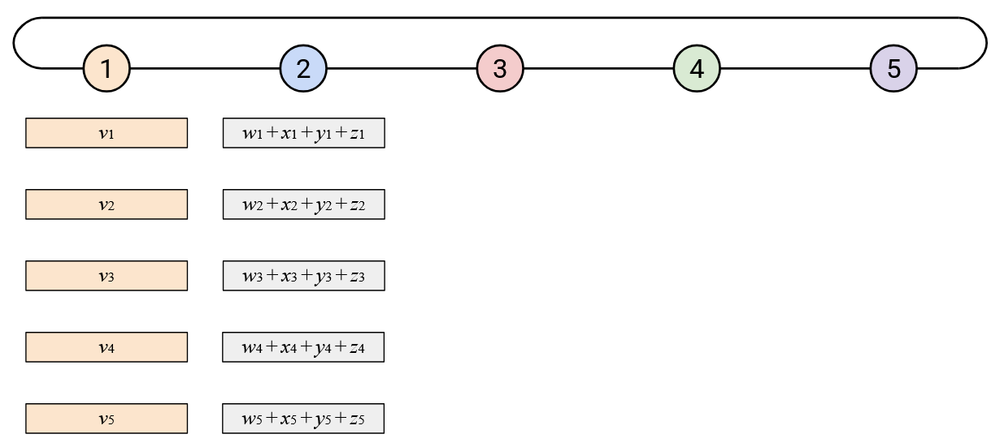

Cuối cùng, Node 1 sẽ tính được vector tổng cuối cùng.

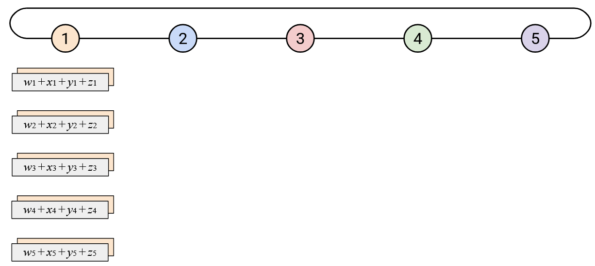

Sau đó, ở bước thứ hai, chúng ta gửi vector tổng này quanh vòng để mọi nút đều có bản sao. Node 5 bắt đầu bằng cách gửi vector tổng sang trái. Khi nhận vector tổng từ neighbor bên phải, bạn gửi một bản sao sang neighbor bên trái. Quá trình này tiếp tục quanh vòng cho đến khi mọi nút nhận được vector tổng.

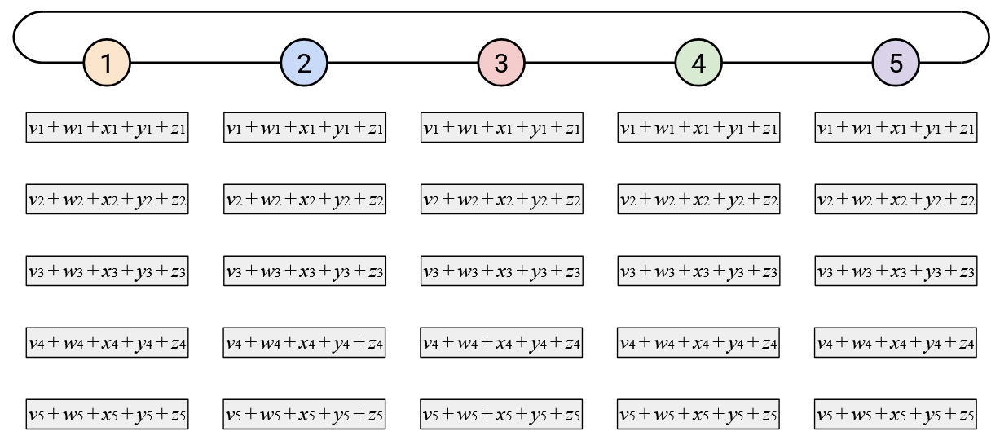

**Băng thông sử dụng:**  
- Bước 1: Mỗi nút nhận 1 vector từ neighbor bên phải và gửi 1 vector sang neighbor bên trái. Giới hạn trên là $$2D$$ byte mỗi nút, tổng cộng $$2D \cdot p$$ byte.  
- Bước 2: Mỗi nút lại nhận 1 vector và gửi 1 vector. Giới hạn trên vẫn là $$2D$$ byte mỗi nút, tổng cộng $$2D \cdot p$$ byte.

Tổng cộng, qua hai bước, chúng ta gửi $$4 \cdot D \cdot p = O(D \cdot p)$$ byte.

**Thời gian thực hiện:** Bạn phải chờ nhận vector (từ bên trái) trước khi có thể gửi vector (sang bên phải). Tổng cộng, cách này mất $$p$$ time step để vòng lặp hoàn tất ở bước 1, và thêm $$p$$ time step để gửi vector tổng ở bước 2, tức tổng cộng $$2p = O(p)$$ time step. Mỗi nút phải gửi hoặc nhận tối đa $$2D$$ byte mỗi time step.

Giống như topology dạng cây, so sánh thời gian chính xác cần thay thế giá trị $$D$$ và giới hạn tài nguyên mạng. Nhìn chung, so với hai cách tiếp cận đầu tiên, cách này cần nhiều time step hơn, nhưng mỗi time step có thể hoàn thành nhanh hơn vì lượng dữ liệu truyền nhỏ hơn.

**Lưu ý:** Chúng ta chọn Node 5 làm điểm bắt đầu, nhưng các điểm bắt đầu khác cũng có thể hoạt động. Tương tự, chúng ta có thể di chuyển theo chiều trái–phải thay vì phải–trái.

## **Cách tiếp cận 5: Ring-Based (Optimized)** (Dựa trên vòng – Tối ưu)

Các cách tiếp cận trước đây đều cho ra kết quả đúng, nhưng tạo ra **bursty workload** (tải công việc dồn cục). Trong cách ring-based ngây thơ, mỗi nút dành phần lớn thời gian ở trạng thái chờ, không làm gì. Tại một thời điểm, bạn đột ngột nhận toàn bộ vector, phải ngay lập tức cộng vector đó với vector của mình, rồi gửi kết quả sang trái. Mọi nút khác phải chờ bạn hoàn thành thao tác này.

Để tạo tải công việc ít dồn cục hơn và cân bằng hơn, chúng ta có thể **stagger** (xen kẽ) các bước của AllReduce dạng ring-based *ngây thơ* (naive ring-based AllReduce). Việc gửi toàn bộ vector sang trái cùng lúc sẽ khiến nó bị quá tải. Thay vào đó, bạn có thể gửi vector về bên trái theo từng lượt một, mỗi element một lần gửi.

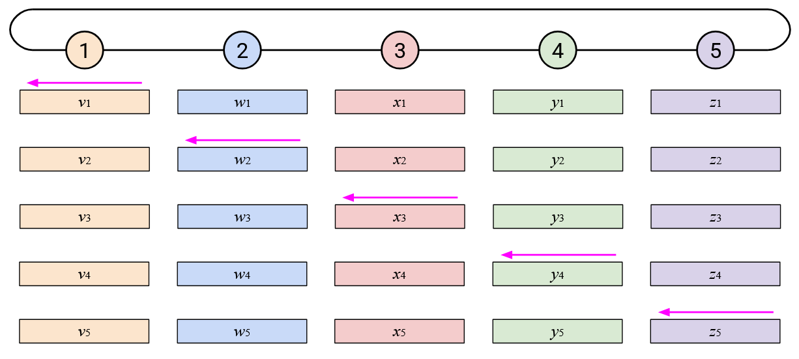

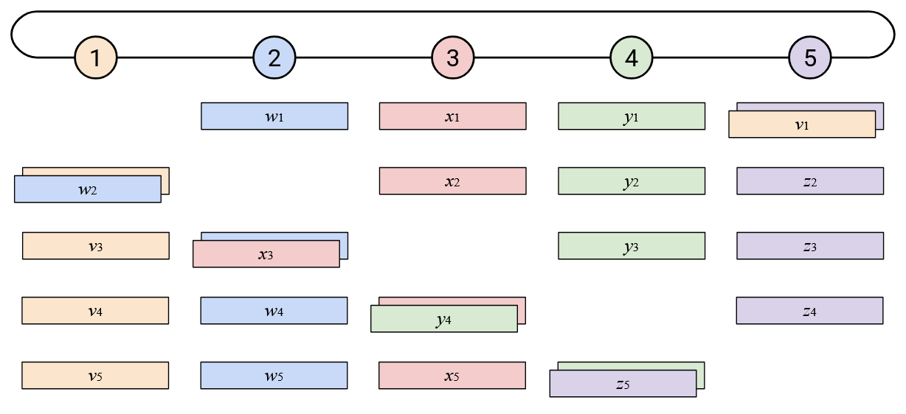

Khi bạn nhận được **một phần tử** (từ bên trái), bạn có thể cộng phần tử đó với phần tử tương ứng của mình. Sau đó, bạn gửi kết quả tổng này (vẫn chỉ là một phần tử) sang bên trái.

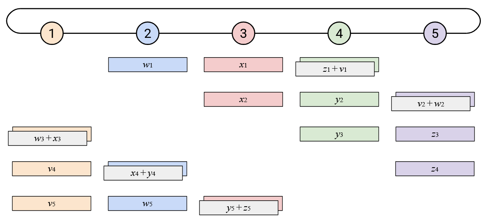

Ngoài việc **stagger** (xen kẽ) việc gửi từng phần tử của vector, hãy chú ý rằng **điểm bắt đầu** cũng được sắp xếp xen kẽ. Thay vì điểm bắt đầu là Node 5 gửi tất cả các phần tử của nó, bây giờ chúng ta bắt đầu bằng cách để nút thứ $$i$$ gửi phần tử thứ $$i$$ của nó.

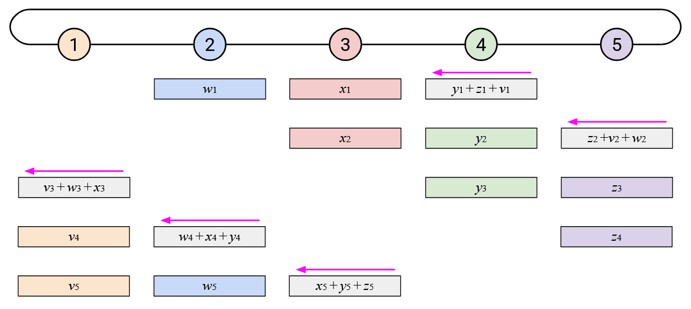

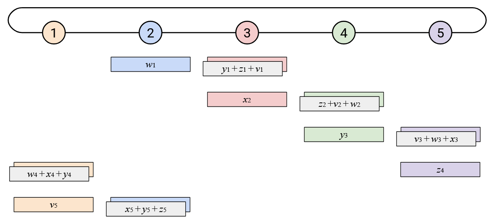

Bằng cách xen kẽ thao tác theo cả hai chiều này (mỗi nút gửi một phần tử tại một thời điểm, và mỗi nút bắt đầu ở một phần tử khác nhau), chúng ta có thể tạo ra một **workload** (tải công việc) cân bằng hơn. Ở mỗi **time step**, mỗi nút nhận đúng một phần tử từ bên phải, tính một phép cộng, và gửi đúng một phần tử sang bên trái.

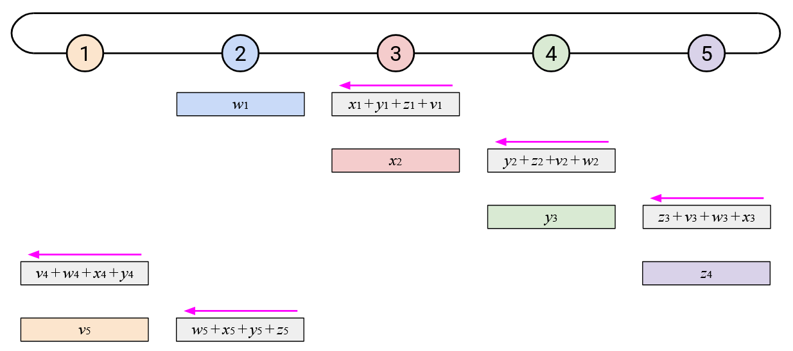

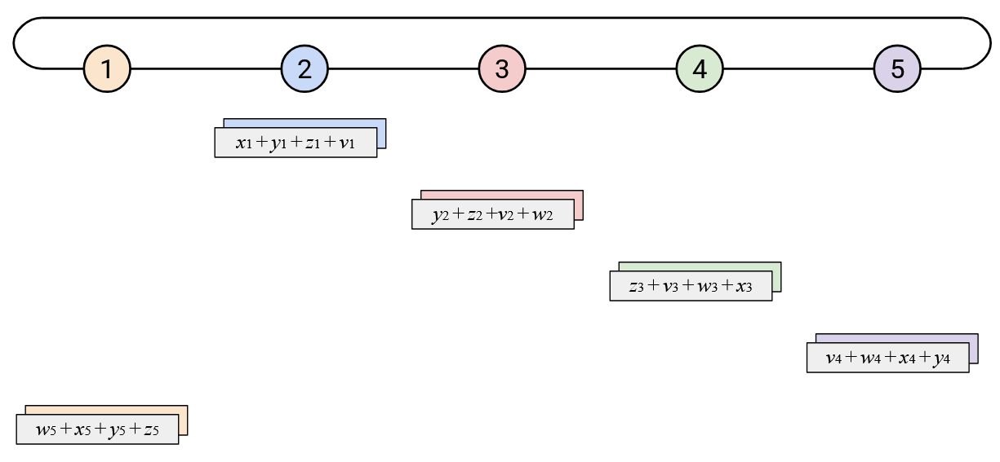

Nếu chúng ta lặp lại quá trình này $$p$$ lần, thì mỗi phần tử sẽ đi hết một vòng quanh vòng tròn.

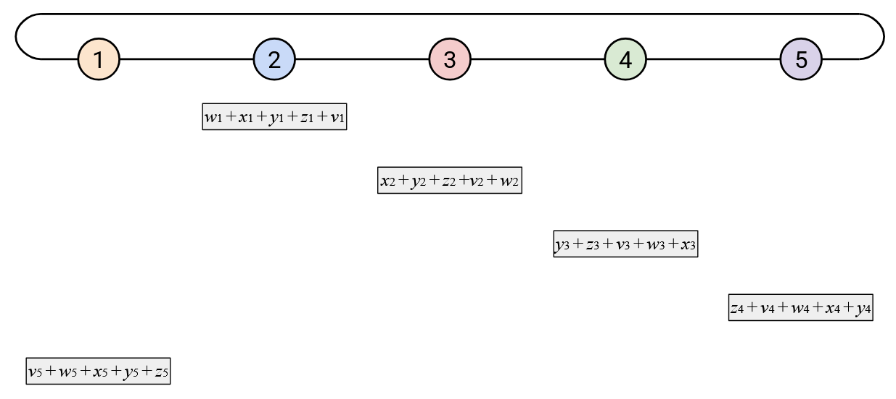

Tuy nhiên, không phải mọi nút đều biết tất cả các phần tử của vector tổng, vì vậy chúng ta phải chạy thêm một vòng nữa. Giống như trong cách tiếp cận **naive** (ngây thơ), ở vòng thứ hai này, khi bạn nhận được một phần tử của vector tổng, bạn chỉ cần gửi một bản sao sang bên phải.

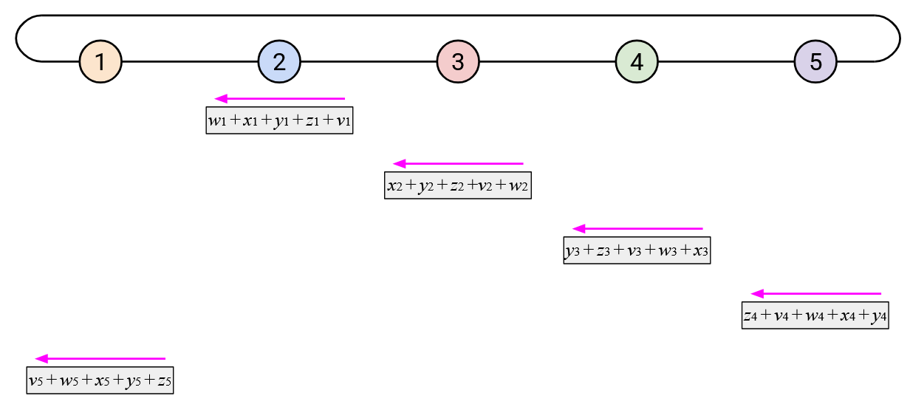

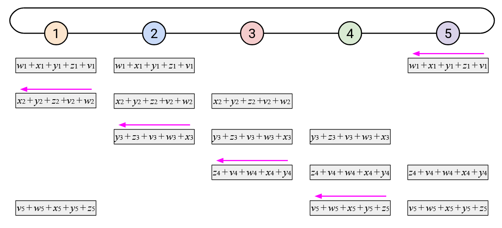

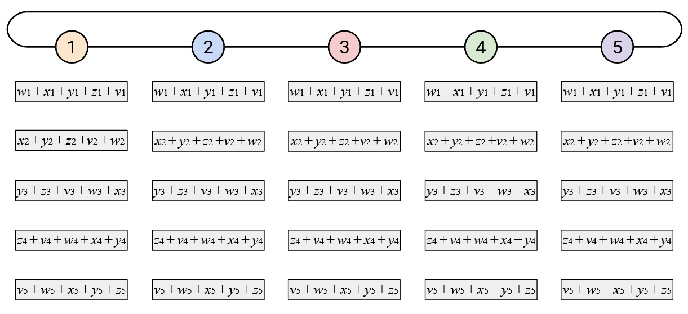

Khi xem bản demo động này, hãy chú ý vào **hai chiều** mà chúng ta đang xen kẽ thao tác:  
- Nếu bạn tập trung vào một **cột**, bạn sẽ thấy rằng chúng ta gửi từng phần tử một, và nhận từng phần tử một.  
- Nếu bạn tập trung vào một **hàng**, bạn sẽ thấy rằng mỗi nút nhận tổng của tất cả các phần tử thứ $$i$$ cho đến thời điểm đó, cộng thêm phần tử thứ $$i$$ của mình, và gửi tổng mới sang trái. Vì thao tác này đi qua tất cả các nút, chúng ta biết rằng cuối cùng sẽ cộng được tất cả các phần tử thứ $$i$$ lại với nhau.

**Tóm lại**, **optimized ring-based AllReduce** thực hiện chính xác các thao tác giống như **naive ring-based AllReduce**. Điểm khác biệt duy nhất là chúng ta đã xen kẽ việc gửi và nhận vector, để giảm tính “dồn cục” (**burstiness**) của tải công việc tại mỗi nút.

**Phân tích băng thông và thời gian** của optimized ring-based AllReduce giống với naive ring-based AllReduce:  
- Mỗi nút nhận/gửi $$2D$$ byte ở bước đầu tiên, và thêm $$2D$$ byte ở bước thứ hai, tổng cộng $$4 \cdot D \cdot p = O(D \cdot p)$$ byte.  
- Chúng ta vẫn cần $$O(p)$$ time step để hoàn thành hai vòng quanh vòng tròn.

Tuy nhiên, **băng thông trên mỗi time step** đã được cải thiện trong cách tối ưu. Trong cách naive, mỗi nút phải nhận và gửi toàn bộ vector trong một time step, tổng cộng $$2D$$ byte truyền trong một time step. Trong cách tối ưu, mỗi nút chỉ phải nhận và gửi **một phần tử** tại mỗi time step, tổng cộng $$2D/p$$ byte truyền trong một time step.

## **Overlay và Underlay Topologies**

Hãy nhớ rằng các thao tác collective này được định nghĩa sao cho **user** (ví dụ: chương trình huấn luyện AI) có thể chọn bất kỳ tập hợp $$p$$ host nào và yêu cầu chúng chạy một thao tác AllReduce. Khi user chọn $$p$$ host, rất có thể chúng không được kết nối sẵn theo topology vòng. Làm thế nào để triển khai AllReduce dạng vòng ngay cả khi các host không được kết nối vật lý theo topology vòng?

Câu trả lời là sử dụng **overlay**. Chúng ta có thể vẽ các liên kết ảo để kết nối các host thành topology vòng:

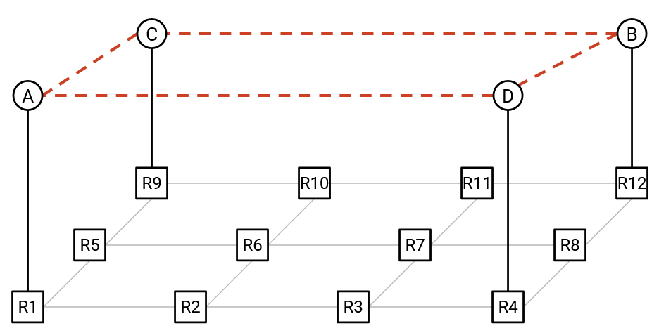

Khi Node D gửi vector tới Node B, ở góc nhìn **overlay**, Node D đang gửi vector qua một liên kết ảo duy nhất tới neighbor trực tiếp của nó. Ở góc nhìn **underlay**, vector này thực tế phải đi qua nhiều **hop** (bước nhảy) trước khi đến đích là Node B.

Như đã thấy khi thảo luận về **overlay-based multicast**, hiệu năng của overlay phụ thuộc vào mức độ khớp giữa topology overlay và mạng underlay. Trong bối cảnh huấn luyện AI, hiệu năng đặc biệt quan trọng vì chúng ta đang truyền một lượng dữ liệu khổng lồ.

Để minh họa tại sao topology overlay quan trọng, giả sử có 4 nút muốn chạy AllReduce. Làm thế nào để **đánh số** các nút nhằm đạt hiệu năng tốt nhất?

Trước hết, lưu ý rằng **bất kỳ cách đánh số nào** cũng sẽ cho ra kết quả AllReduce đúng. Nói cách khác, bất kỳ nút nào cũng có thể là Node 1, Node 2, v.v. (Điều này không đúng với tất cả các thao tác collective, nhưng đúng với AllReduce.)

Dưới đây là hai cách đánh số nút:

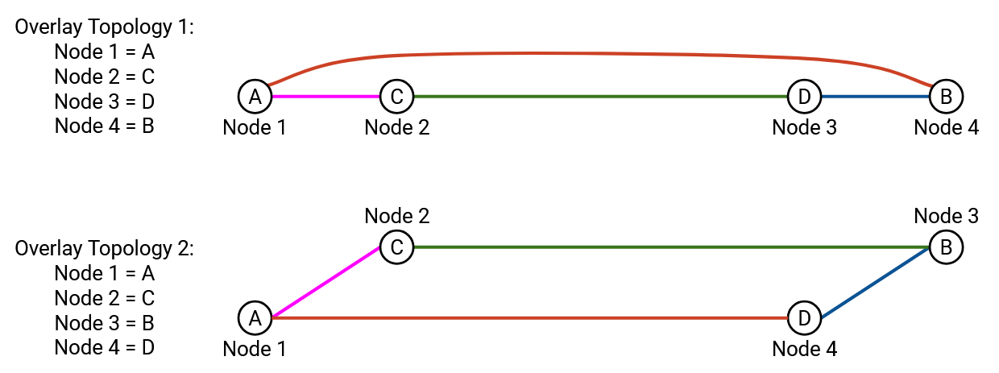

Cách đầu tiên dẫn đến **average stretch** (độ giãn trung bình) là 3.5. Đặc biệt, hãy chú ý rằng các liên kết ảo C–D và B–A phải đi qua nhiều liên kết trong mạng underlay.

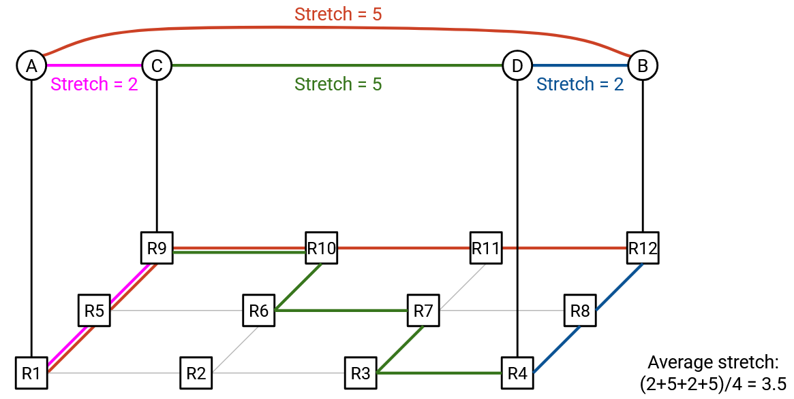

Ngược lại, cách thứ hai dẫn đến average stretch là 2.5. Tập hợp các liên kết ảo này đặt các liên kết liền kề trong vòng gần nhau hơn.

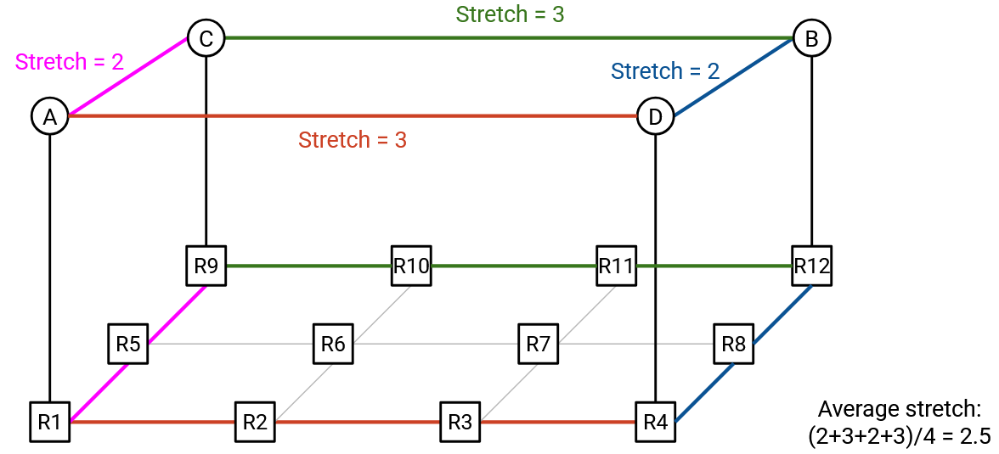

Nói chung, để tối ưu hiệu năng của AllReduce dạng vòng, chúng ta muốn các nút liền kề (ví dụ: Node $$i$$ và Node $$i+1$$) gần nhau trong mạng.

Sơ đồ này minh họa một topology underlay bất kỳ, nhưng ý tưởng tương tự áp dụng cho các topology dạng **datacenter-like** (giống trung tâm dữ liệu) được sử dụng trong huấn luyện AI. Hãy nhớ rằng trong các topology này, một số nút có kết nối hiệu năng rất cao (ví dụ: hai GPU trên cùng một máy), trong khi các nút khác có kết nối kém hơn (ví dụ: hai GPU ở các rack khác nhau).

Các tác vụ huấn luyện AI có tính dự đoán, và topology cơ sở hạ tầng là cố định và có cấu trúc. Điều này có nghĩa là chúng ta có nhiều cơ hội để tối ưu hiệu năng của tác vụ huấn luyện. Ví dụ: chúng ta có thể gán các tác vụ cụ thể cho các nút cụ thể, sao cho các thao tác collective được thực hiện trên các nút gần nhau (ví dụ: tất cả các nút trong cùng một rack). Việc tìm cách tối ưu hóa các tác vụ huấn luyện AI là một lĩnh vực nghiên cứu đang rất sôi động.

## **Các lớp trừu tượng** (Layers of Abstraction)

Tóm lại, bạn có thể hình dung các thao tác collective ở **ba lớp trừu tượng**:

1. **Definitions** (Định nghĩa): Ở lớp trừu tượng cao nhất, chúng ta định nghĩa thao tác bằng cách chỉ rõ đầu vào và đầu ra mong đợi. User chỉ cần hiểu các định nghĩa này để sử dụng collective, mà không cần biết cách triển khai.

2. **Overlay**: Giảm xuống một lớp trừu tượng, chúng ta xem xét dữ liệu được trao đổi trong the overlay topology. At this level, you can assume that the nodes are organized in a useful topology (e.g. tree or ring), and can send data along virtual links in that topology.

3. Underlay. At the lowest level of abstraction, we think about how the virtual links (overlay) correspond to actual physical links in the underlay. When Node 5 sends a vector to Node 4, that vector actually has to be forwarded across several physical routers and links.