# **Collective Operations** (Các thao tác tập thể)

## **Động lực: AI Training** (Huấn luyện trí tuệ nhân tạo)

Như bạn có thể đã đọc trên các bản tin, **AI (Artificial Intelligence – Trí tuệ nhân tạo)** là một lĩnh vực nghiên cứu rất sôi động. Các hệ thống AI hiện đại đòi hỏi phải huấn luyện mô hình trên một lượng dữ liệu khổng lồ.

Trong phạm vi ghi chú này, chúng ta sẽ hoàn toàn bỏ qua chi tiết về cách các mô hình này hoạt động. Tất cả những gì bạn cần biết là chúng ta bắt đầu với một mô hình chưa được huấn luyện: hãy hình dung nó như một ma trận lớn chứa đầy các số ngẫu nhiên. Sau đó, chúng ta huấn luyện mô hình này bằng một lượng dữ liệu huấn luyện khổng lồ: hãy hình dung quá trình này như việc thực hiện rất nhiều phép nhân ma trận (tức là các phép nhân và cộng) giữa dữ liệu huấn luyện và mô hình. Cuối cùng, đầu ra là một mô hình đã được huấn luyện: hãy hình dung nó như ma trận lớn ban đầu, nhưng giờ đây chứa đầy các con số hữu ích.

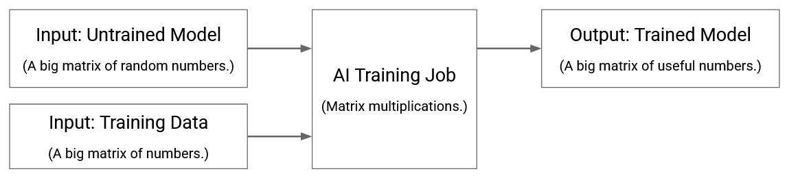

Trên thực tế, quá trình huấn luyện AI phức tạp hơn nhiều. Ví dụ, quá trình huấn luyện mang tính lặp (**iterative**): bạn sẽ chạy mô hình trên một tập dữ liệu huấn luyện, và xem kết quả đạt được. Sau đó, bạn tính toán một giá trị sai số (**error term**) dựa trên những lỗi đã mắc phải, và sử dụng nó để cập nhật mô hình. Chúng ta sẽ không quan tâm đến các chi tiết này. Ở đây, chúng ta chỉ coi quá trình huấn luyện như một “hộp đen” (**black box**) thực hiện rất nhiều phép nhân ma trận trên các bộ dữ liệu cực lớn.

## **Distributed Training** (Huấn luyện phân tán)

Các tác vụ huấn luyện AI quá lớn để có thể chạy tuần tự trên một máy tính duy nhất. Nếu bạn thực hiện phép nhân ma trận bằng cách nhân từng số một, tác vụ huấn luyện sẽ không bao giờ hoàn thành. Thay vào đó, chúng ta cần **parallelize** (song song hóa) các tác vụ này để nhiều phép toán (ví dụ: phép nhân) được thực hiện đồng thời. Có nhiều cách tiếp cận **distributed computing** (tính toán phân tán), mỗi cách song song hóa công việc theo một chiều khác nhau:

- Chúng ta có thể chia nhỏ dữ liệu huấn luyện để mỗi **node** (nút) huấn luyện trên một tập con dữ liệu khác nhau.  
- Chúng ta có thể chia nhỏ chính mô hình, để mỗi node huấn luyện một tập con của mô hình.  
- Chúng ta có thể **pipeline** (xâu chuỗi) các phép toán, để mỗi node thực hiện một tập con các phép toán. Ví dụ: nếu thao tác mong muốn là “cộng 5” rồi “bình phương số đó”, chúng ta có thể chia ra sao cho node của bạn thực hiện phép cộng, sau đó chuyển kết quả cho tôi để node của tôi thực hiện phép bình phương. Khi đó, mỗi mẩu dữ liệu sẽ đi qua node của bạn trước, rồi đến node của tôi, để hoàn thành toàn bộ thao tác.

Một lần nữa, chúng ta sẽ hoàn toàn bỏ qua chi tiết về cách công việc được phân chia. Chúng ta chỉ biết rằng có một tác vụ lớn, và nó đã được chia thành các tác vụ con nhỏ hơn.

Điều quan trọng mà chúng ta quan tâm là cách các node này **synchronize** (đồng bộ) với nhau. Các node thường cần giao tiếp với nhau để đảm bảo trạng thái của chúng nhất quán. Ngoài ra, sau khi thực hiện một phép toán, có thể mỗi node sẽ giữ một phần của kết quả, và tất cả cần phối hợp để ghép các phần đó thành kết quả đầy đủ.

Kết hợp hình dung về mô hình huấn luyện với hình dung về tính toán phân tán, chúng ta có một cái nhìn tổng quan ở mức cao về huấn luyện phân tán:

1. **Chia tác vụ thành các tác vụ con**. Mỗi node thực hiện một tác vụ con.

    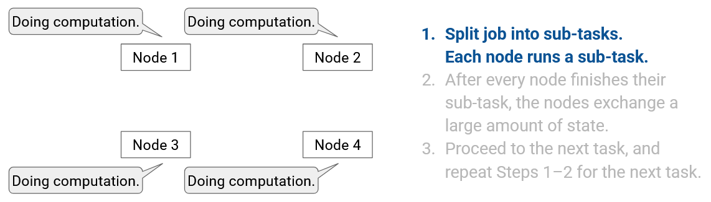

2. **Sau khi mọi node hoàn thành tác vụ con**, tất cả trao đổi một lượng lớn trạng thái.

    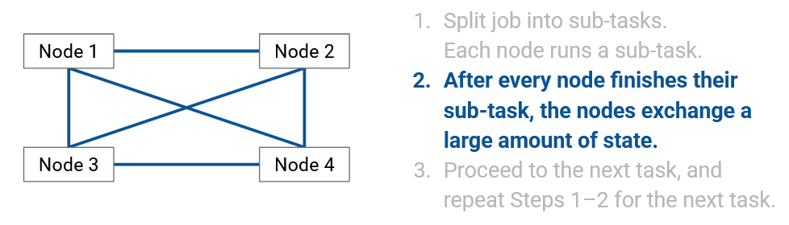

3. **Chuyển sang tác vụ tiếp theo**, và lặp lại bước 1–2 cho tác vụ tiếp theo.

    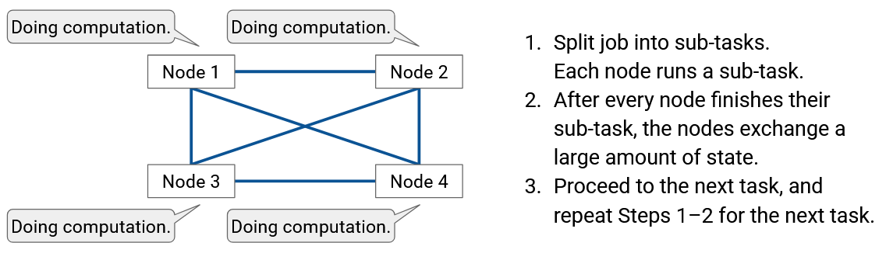

Trọng tâm của chúng ta là **quá trình trao đổi dữ liệu ở bước thứ hai**, và cách làm cho quá trình trao đổi dữ liệu này hiệu quả hơn.

Một lần nữa, chúng ta không quan tâm chính xác dữ liệu nào được trao đổi. Tùy thuộc vào cách phân chia công việc và tùy thuộc vào mô hình AI cụ thể mà chúng ta xây dựng, bản chất của dữ liệu trao đổi có thể hơi khác nhau. Điều chúng ta tập trung là **cách dữ liệu đó được trao đổi**.

## **Hạ tầng huấn luyện phân tán** (Distributed Training Infrastructure)

Khi chúng ta chia nhỏ một tác vụ huấn luyện cho nhiều **node** (nút), thì chính xác mỗi node là gì?

Mỗi node có thể là một máy tính chạy **CPU** tiêu chuẩn, nhưng trên thực tế, các node thường là **GPU (Graphics Processing Unit – Bộ xử lý đồ họa)** chuyên dụng. Đây là các chip xử lý được thiết kế đặc biệt để thực hiện các tác vụ AI (ví dụ: nhân ma trận) một cách rất hiệu quả. Thay vì GPU, các node cũng có thể là **TPU (Tensor Processing Unit)** – chip tối ưu hóa cho AI do Google phát triển.

Một tác vụ huấn luyện có thể chạy trên vài trăm node, hoặc thậm chí hàng chục nghìn node, tùy thuộc vào kích thước, bối cảnh tác vụ và sức mạnh của từng node.

Các GPU được kết nối với nhau trong một mạng có cấu trúc giống **datacenter** (trung tâm dữ liệu), mang lại các lợi ích của datacenter mà chúng ta đã thấy trước đây:  
- Các node nằm gần nhau về mặt vật lý (ví dụ: trong cùng một tòa nhà).  
- Các node được tổ chức theo một topology có cấu trúc (ví dụ: **Clos network**).  
- Các node đồng nhất (được xây dựng giống nhau).  
- Các liên kết có băng thông rất cao.

Nếu bạn nhìn vào bên trong một datacenter huấn luyện AI, bạn sẽ thấy các **server** (máy chủ) được tổ chức thành các **rack** (giá đỡ), giống như trong bất kỳ datacenter nào khác. Tuy nhiên, khác với các datacenter thông thường, mỗi server chứa một hoặc nhiều GPU để tính toán AI. Server cũng có thể có một CPU đa dụng thông thường cho các tác vụ phụ, mặc dù CPU này thường không mạnh và không đảm nhận phần lớn công việc tính toán. Tất cả GPU trên server sử dụng cùng một **NIC (Network Interface Card – card giao tiếp mạng)** để trao đổi dữ liệu với các server khác.

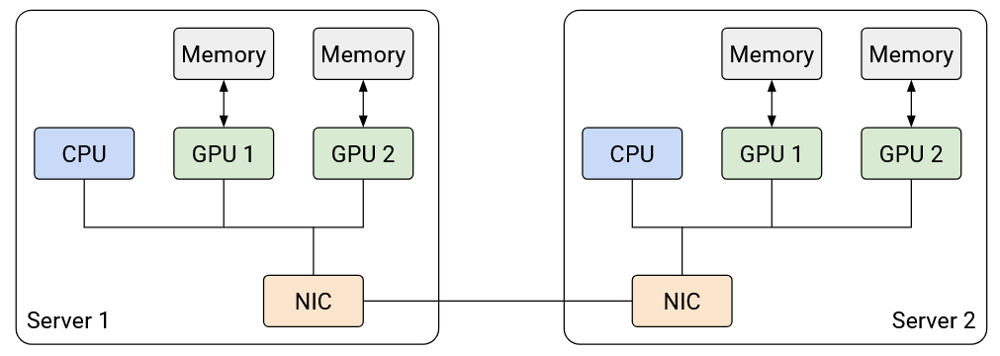

Vì mỗi server có nhiều GPU, chúng ta cần điều chỉnh một chút mô hình trừu tượng topology mạng. Giống như trước đây, các server được kết nối với nhau qua **switch** và các liên kết băng thông cao. Tuy nhiên, giờ đây chúng ta cũng phải xem xét khả năng hai node trên cùng một server giao tiếp với nhau. Giao tiếp trong cùng một server cực kỳ hiệu quả so với giao tiếp giữa các server, nên chúng ta có thể mô hình hóa liên kết nội bộ server như một liên kết có băng thông vô hạn và **latency** (độ trễ) bằng 0.

Mỗi GPU có thể có bộ nhớ riêng, và chúng ta có thể sử dụng các kỹ thuật như **RDMA (Remote Direct Memory Access)** để tăng tốc việc truyền dữ liệu giữa bộ nhớ của các GPU.

Có nhiều topology khác nhau để kết nối giữa các rack, nhưng trong phạm vi này, chúng ta sẽ sử dụng topology **fat-tree Clos** để kết nối các rack. Dù sử dụng topology nào, một số cặp GPU sẽ gần nhau hơn (ví dụ: GPU trong cùng một server có thể giao tiếp mà không cần qua mạng), một số cặp sẽ xa hơn (ví dụ: GPU trên các server khác nhau nhưng cùng rack, kết nối qua một switch), và một số cặp sẽ xa nhất (ví dụ: GPU trên các rack khác nhau, kết nối qua nhiều hop). Các cặp GPU gần nhau có thể giao tiếp với băng thông cao hơn và độ trễ thấp hơn so với các cặp xa nhau. Tóm lại, nếu chọn ngẫu nhiên một cặp node, sẽ có cặp được kết nối tốt hơn cặp khác.

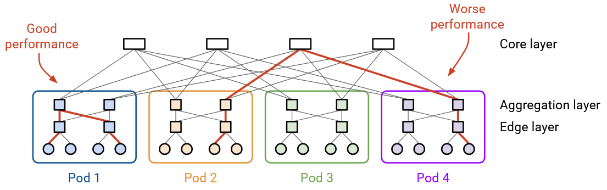

Ngoài ra còn có các topology khác. TPU được tích hợp sẵn **router** trên chip, nên có thể kết nối trực tiếp TPU vào mạng mà không cần switch. Một topology phổ biến với TPU là kết nối chúng thành **3D torus** (khối lập phương 3D có các cạnh nối vòng). Ví dụ: nếu bạn đi tới đỉnh của khối lập phương và tiếp tục theo liên kết hướng lên, bạn sẽ quay lại đáy khối; hoặc nếu bạn đi tới mặt trước và tiếp tục theo liên kết hướng ra trước, bạn sẽ quay lại mặt sau. Giống như topology Clos, một số cặp node sẽ gần nhau (ví dụ: hàng xóm trực tiếp), trong khi các cặp khác sẽ xa hơn (ví dụ: cách nhau nhiều hop).

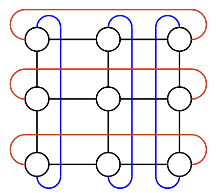

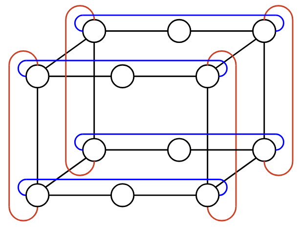

## **Collective Communication: Định nghĩa**

Bây giờ, khi chúng ta đã biết tác vụ (**distributed computing – tính toán phân tán**) và hạ tầng để chạy tác vụ đó (mạng datacenter-like của GPU/TPU), chúng ta có thể chính thức định nghĩa vấn đề cần giải quyết.

**Định nghĩa trong sách giáo khoa** của **collective communication** (giao tiếp tập thể) là: Một nhóm node trao đổi dữ liệu theo cách phối hợp như một phần của tính toán nhóm. Nói một cách không chính thức, ý tưởng là nhiều node cùng làm việc để đạt một mục tiêu chung, và các node phải trao đổi dữ liệu trong quá trình đó.

Các ý tưởng và thuật ngữ về collective communication đã được phát triển từ nhiều thập kỷ trước trong bối cảnh **supercomputer** (siêu máy tính). Chủ đề này một lần nữa trở thành lĩnh vực nghiên cứu sôi động nhờ những tiến bộ gần đây trong AI. Các triển khai hiện đại của **Collectives Communication Libraries** bao gồm **NCCL** (Nvidia), **MSCCL** (Microsoft), **TCCL** (Thunder Research Group), v.v. Mã nguồn của NCCL có sẵn trực tuyến nếu bạn quan tâm.

Điều gì khiến collective communication khác với những gì chúng ta đã thấy trước đây? Có 3 điểm khác biệt chính:

**1. Giao tiếp có cấu trúc cao (Highly structured communication):**  
Trước đây, khi nghĩ về mạng, chúng ta thường trừu tượng hóa dữ liệu được trao đổi. Chúng ta không biết trước ai sẽ giao tiếp với ai, và xây dựng mạng sao cho bất kỳ cặp host nào cũng có thể giao tiếp bất cứ lúc nào.

Ngược lại, trong collective communication, có một mục tiêu rất cụ thể mà các node muốn đạt được, và chúng ta biết mục tiêu này từ trước. Điều này có nghĩa là, không giống Internet chung, chúng ta có một cấu trúc rất rõ ràng về dữ liệu nào sẽ được trao đổi qua mạng, và khi nào dữ liệu đó cần được trao đổi. Nói cách khác, chúng ta có một kịch bản trao đổi dữ liệu và tính toán được lập trình chặt chẽ mà tất cả các node sẽ cùng phối hợp thực hiện.

**2. Hạ tầng mạng chuyên dụng (Dedicated network infrastructure):**  
Trước đây, chúng ta xây dựng mạng có thể hỗ trợ nhiều kết nối đồng thời. Ngay cả trong mạng datacenter, nhiều **tenant** (người thuê) có thể gửi dữ liệu qua mạng cùng lúc.

Ngược lại, các tác vụ huấn luyện AI thường rất lớn và thường chạy trên hạ tầng chuyên dụng. Tác vụ huấn luyện là tác vụ duy nhất chạy trên mạng, và không có dữ liệu nào khác được gửi qua mạng. Điều này có nghĩa là chúng ta có thể dự đoán chính xác lượng băng thông được sử dụng tại bất kỳ thời điểm nào.

**3. Dữ liệu được biến đổi khi trao đổi (Data is transformed as it's exchanged):**  
Trước đây, khi nghĩ về việc gửi dữ liệu qua Internet (ví dụ: qua **HTTP/TCP/IP stack**), mô hình quen thuộc là máy chủ có một dữ liệu (ví dụ: một tệp) và muốn gửi một bản sao dữ liệu đó cho người dùng.

Ngược lại, khi chạy một thao tác collective, dữ liệu có thể được biến đổi khi truyền qua mạng. Điều này khác với những gì chúng ta đã thấy. Các phép toán thường khá đơn giản (ví dụ: tính tổng), nhưng điều đó có nghĩa là dữ liệu do bên gửi gửi đi không nhất thiết giống dữ liệu mà bên nhận nhận được.

Chúng ta có thể thiết kế một sơ đồ giao tiếp phối hợp từ đầu cho mỗi mô hình AI, nhưng điều này sẽ tốn công và lặp lại nhiều công việc. Thay vào đó, chúng ta sẽ định nghĩa một tập hợp các mẫu giao tiếp cơ bản gọi là **collectives**. Sau đó, chúng ta có thể sử dụng các collectives này như các khối xây dựng cơ bản để thiết kế các sơ đồ giao tiếp phối hợp cho các tác vụ cụ thể. Bạn có thể coi các thao tác collective cơ bản như **API** cho giao tiếp phân tán, ví dụ: các hàm thư viện có sẵn cho người dùng. Người dùng có thể gọi các hàm collective này theo nhiều cách khác nhau để đạt mục tiêu cụ thể.

Thực tế cho thấy, chúng ta chỉ cần một số lượng tương đối nhỏ các thao tác collective nguyên thủy, và hầu hết các tác vụ trong huấn luyện AI có thể được phân rã thành các thao tác này, rồi biểu diễn dưới dạng nhiều cách kết hợp khác nhau của chúng.

Trọng tâm của chúng ta sẽ là **các thao tác collective này là gì** và **chúng được triển khai như thế nào trong mạng**. Chúng ta sẽ không bàn về lý do tại sao huấn luyện AI lại dẫn đến những thao tác collective cụ thể này. Lý do chúng ta chọn những thao tác này làm khối xây dựng cơ bản liên quan nhiều hơn đến bản chất của tính toán AI, điều này nằm ngoài phạm vi của chúng ta.

## **Collective Operations: Setup** (Thiết lập các thao tác tập thể)

Chúng ta sẽ định nghĩa 7 thao tác collective cơ bản. Chúng ta sẽ định nghĩa **chức năng** của các thao tác này bằng cách chỉ rõ **đầu vào** (dữ liệu mỗi node đang giữ trước khi thao tác diễn ra) và **đầu ra** tương ứng (dữ liệu mỗi node giữ sau khi thao tác hoàn tất). Ở đây, chúng ta **không** chỉ định cách thao tác được triển khai trong mạng (phần này sẽ được đề cập sau).

**Đầu vào:** Có $$p$$ node. Trong các ví dụ, chúng ta đặt $$p=4$$, nhưng các giá trị khác cũng được.

Mỗi node có một vector dữ liệu gồm $$p$$ phần tử. Trong các ví dụ này, bạn có thể hình dung dữ liệu như một mảng gồm 4 số nguyên. Trong thực tế, dữ liệu này có thể có số chiều cao hơn, ví dụ: 4 hàng của một ma trận, hoặc 4 phần dữ liệu huấn luyện có kích thước bằng nhau.

**Đầu ra:** Các phần tử được di chuyển giữa các node theo một cách xác định trước. Đầu ra chỉ rõ giá trị nào sẽ nằm ở ô nào sau khi thao tác hoàn tất.

Ngoài ra, đôi khi các phần tử có thể được **aggregate** (tổng hợp), ví dụ: cộng lại với nhau. Đầu ra cũng chỉ rõ phép tính nào (nếu có) được thực hiện trong thao tác này, và kết quả được đặt vào ô nào.

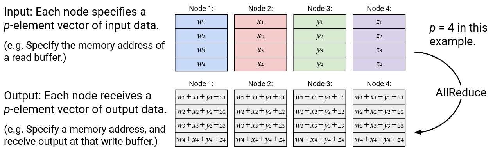

Trước khi thao tác collective diễn ra, cần có một số bước **phối hợp bổ sung** để mỗi node biết số thứ tự của mình và tổng số node (ví dụ: “Bạn là node 1, và có tổng cộng 4 node”). Việc phối hợp bổ sung này nằm ngoài phạm vi của chúng ta, nhưng bạn có thể hình dung rằng một **scheduler** hoặc **controller** tập trung sẽ phân phát thông tin này tới các node và thiết lập tác vụ.

Để thực thi một thao tác collective, mỗi node chạy **chính xác cùng một đoạn mã**, song song, tại cùng một thời điểm. Tất cả cùng gọi thao tác collective giống nhau để bắt đầu, và khi thao tác hoàn tất, đầu ra phải khớp với định nghĩa của thao tác. Lý tưởng nhất là các node có tài nguyên phần cứng giống nhau, để tất cả hoàn thành cùng lúc. Nếu một số node chậm hơn, thao tác sẽ ở trạng thái **blocking** (chặn), nghĩa là phải chờ tất cả hoàn thành trước khi chuyển sang tác vụ tiếp theo.

**Tóm lại**, các thao tác collective được điều phối bởi một controller thiết lập tác vụ. Thao tác này **đồng bộ** (mọi node bắt đầu cùng lúc), **đồng nhất** (lý tưởng là hoàn thành cùng lúc) và **blocking** (phải chờ tất cả hoàn thành trước khi tiếp tục).

Với phần thiết lập đã xong, chúng ta sẵn sàng xem định nghĩa của 7 thao tác collective. Các thao tác này có thể chia thành 2 nhóm:  
- 4 thao tác về **redistribution** (phân phối lại dữ liệu mà không biến đổi nó)  
- 3 thao tác về **consolidation** (tổng hợp nhiều mảnh dữ liệu thành một đầu ra duy nhất).

### **Operation: Broadcast**

**Mô tả:** Lấy toàn bộ vector trong một **root node** (nút gốc) được chỉ định, và gửi một bản sao của toàn bộ vector đó tới mọi node.

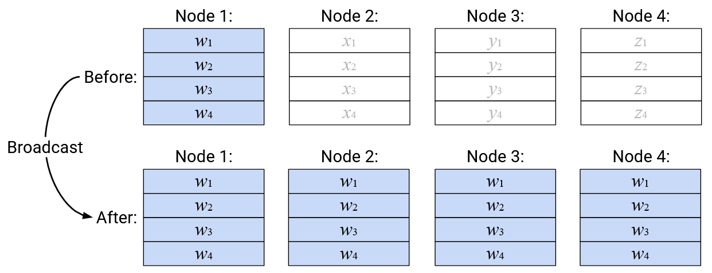

**Ghi chú:**  
- Sơ đồ minh họa Broadcast với Node 1 là root, nhưng có thể chọn node khác làm root. Người dùng phải chỉ định root node như một “tham số” của thao tác.  
- Vector đầu vào ở các node không phải root **không** được dùng để tạo đầu ra (giống như tham số hàm không được sử dụng).  
- Vị trí lưu vector đầu vào và đầu ra không nhất thiết phải giống nhau. Nếu dùng cùng địa chỉ bộ nhớ, một số thao tác (như Broadcast) sẽ ghi đè dữ liệu đầu vào. Có thể dùng địa chỉ bộ nhớ khác để lưu đầu ra.

### **Operation: Scatter**

**Mô tả:** Lấy toàn bộ vector trong một root node được chỉ định. Gửi phần tử thứ $$i$$ của vector này tới node thứ $$i$$.

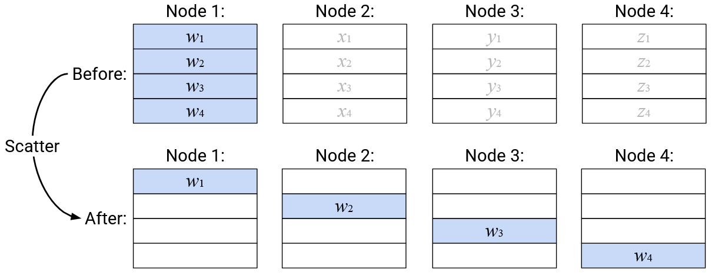

**Ghi chú:** Giống như Broadcast, có thể chỉ định bất kỳ node nào làm root. Vector đầu vào ở các node không phải root không được dùng để tạo đầu ra.

### **Operation: Gather**

**Mô tả:** Tạo một vector mới, trong đó phần tử thứ $$i$$ được lấy từ phần tử thứ $$i$$ của node thứ $$i$$. Gửi vector này tới một root node được chỉ định.

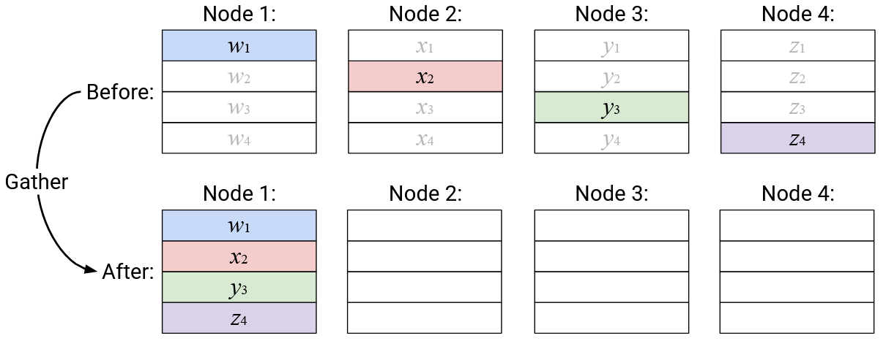

**Ghi chú:** Trong thao tác này, không có dữ liệu nào được lưu vào bộ đệm nhận của các node không phải root.

### **Operation: AllGather**

**Mô tả:** Tạo một vector mới, trong đó phần tử thứ $$i$$ được lấy từ phần tử thứ $$i$$ của node thứ $$i$$. Gửi một bản sao của vector này tới mọi node.

**Mô tả thay thế:** Node $$i$$ thực hiện Broadcast phần tử thứ $$i$$ của mình, để nó trở thành phần tử thứ $$i$$ trong vector đầu ra của mọi node.

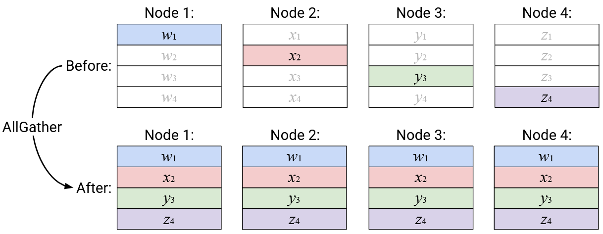

### **Operation: Reduce**

**Mô tả:** Tính tổng theo từng phần tử (**element-wise sum**) của tất cả các vector, và gửi vector tổng này tới một root node được chỉ định.

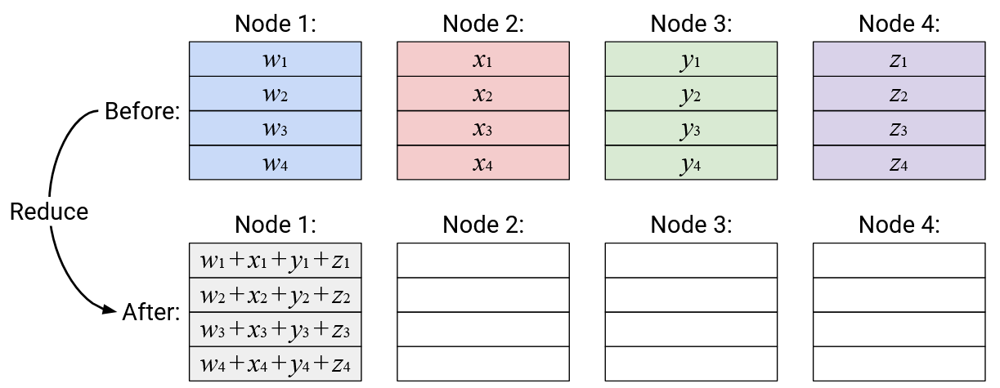

**Ghi chú:** Trong phần này, chúng ta dùng phép cộng làm phép **reduction** (giảm dữ liệu), nhưng có thể thay bằng phép khác (ví dụ: nhân). Các phép reduction thường **associative** (kết hợp) và **commutative** (giao hoán), nghĩa là có thể thực hiện theo bất kỳ thứ tự nào mà vẫn cho kết quả giống nhau.

### **Operation: AllReduce**

**Mô tả:** Tính tổng theo từng phần tử của tất cả các vector, và gửi một bản sao của vector tổng này tới tất cả các node.

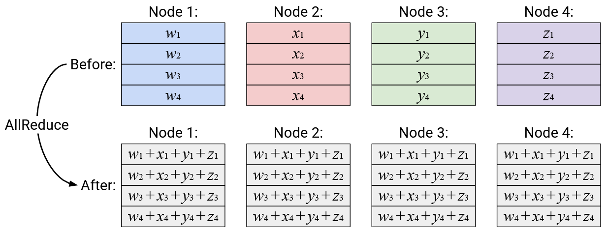

### **Operation: ReduceScatter**

**Mô tả:** Tính tổng theo từng phần tử của tất cả các vector. Gửi phần tử thứ $$i$$ của vector tổng tới node thứ $$i$$.

**Mô tả thay thế:** Phần tử thứ $$i$$ của mỗi node được cộng lại, và kết quả (một số vô hướng) được gửi tới node $$i$$.

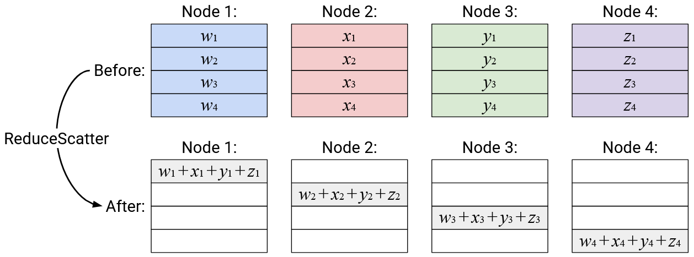

## **Duals** (Các cặp thao tác đối ngẫu)

Một số cặp thao tác là **dual** của nhau, nghĩa là một thao tác là “đảo ngược” của thao tác kia. Khi xét dual, chúng ta bỏ qua các phép reduction, chỉ quan tâm ô nào được ghi dữ liệu trong đầu ra.

- **Broadcast** và **Reduce** là dual của nhau: Broadcast đọc từ 4 ô trong root node và ghi vào tất cả 16 ô của mọi node. Reduce làm ngược lại: đọc từ tất cả 16 ô và ghi vào 4 ô trong root node.

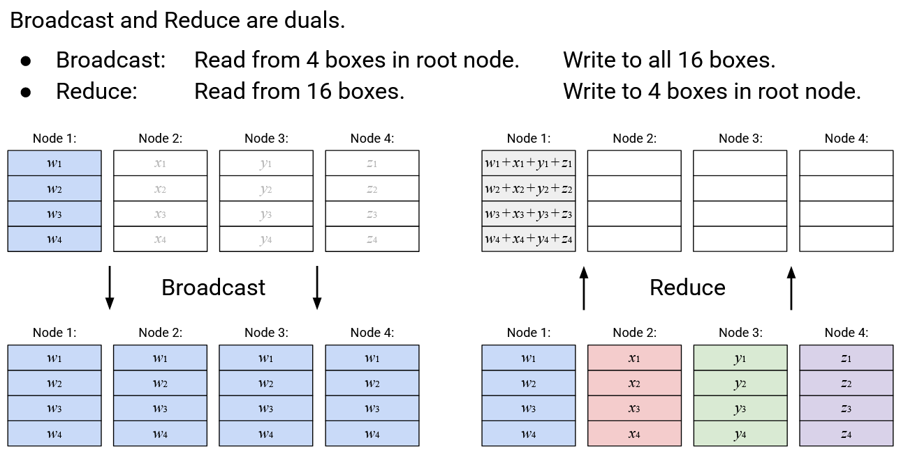

- **Scatter** và **Gather** là dual của nhau: Scatter đọc từ 4 ô trong root node và ghi vào ô thứ $$i$$ của node $$i$$ (tổng 4 ô). Gather làm ngược lại.

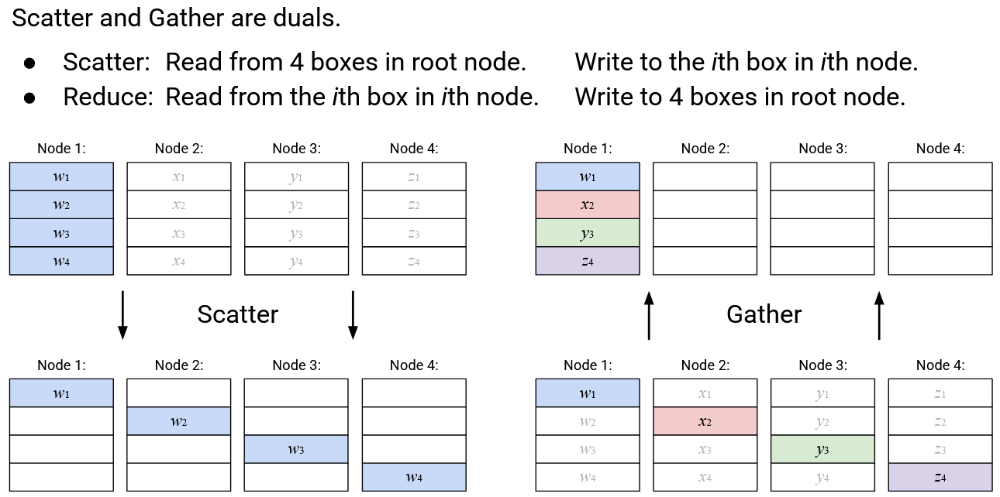

- **AllGather** và **ReduceScatter** là dual của nhau: AllGather đọc từ ô thứ $$i$$ của node $$i$$ và ghi vào tất cả 16 ô. ReduceScatter làm ngược lại.

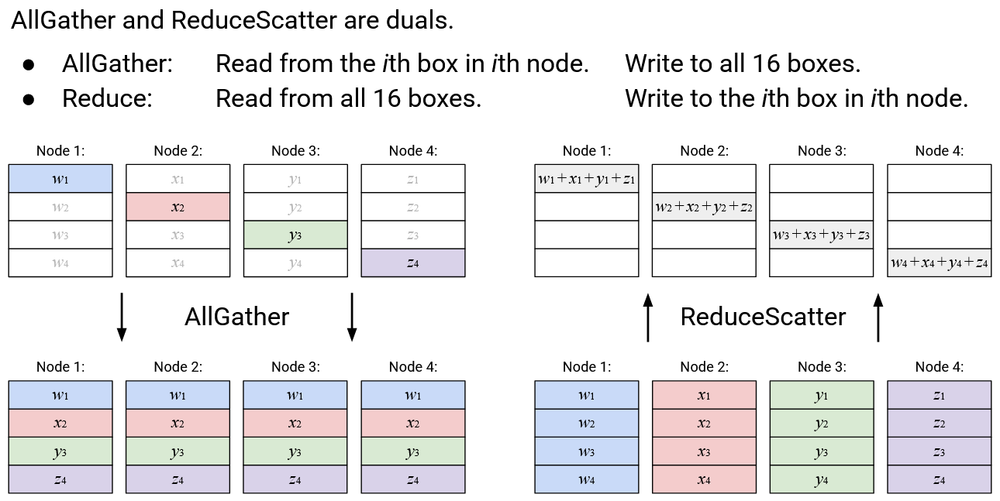

- **AllReduce** không có dual, hoặc có thể coi nó là dual của chính nó.

Ý tưởng về dual hữu ích khi nghĩ về triển khai: với cùng topology và phương án định tuyến, một thao tác và dual của nó sẽ có hiệu năng giống nhau (ví dụ: cùng tổng băng thông sử dụng), vì tổng lượng dữ liệu gửi và nhận là như nhau.

## **Compositing Operations** (Kết hợp thao tác)

Người dùng có thể kết hợp nhiều thao tác để tạo ra thao tác mong muốn.

Ví dụ: AllReduce could equivalently be expressed as a ReduceScatter, followed by an AllGather.

