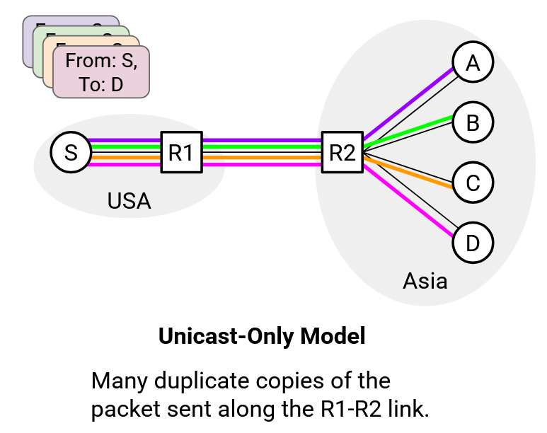
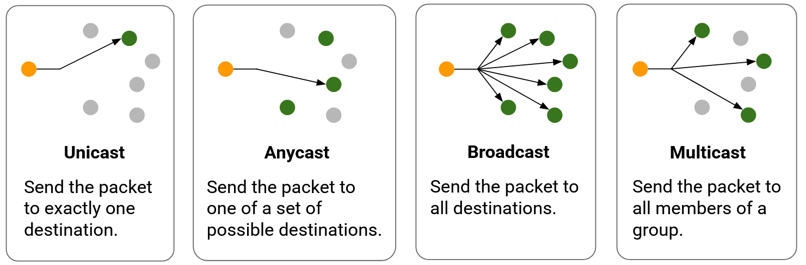
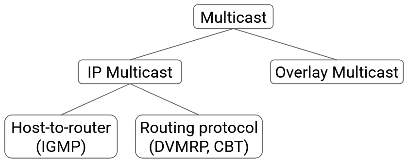

# **Multicast**

## **Động lực: Multicast** (Motivation: Multicast)

Trong tất cả các chủ đề mà chúng ta đã tìm hiểu cho đến nay, chúng ta đều nói rằng mục tiêu của Internet là truyền dữ liệu giữa các **host** (máy chủ/máy trạm). Đặc biệt, chúng ta đã giả định mô hình truyền **unicast** (truyền đơn hướng), nghĩa là có một nguồn duy nhất gửi dữ liệu tới một đích duy nhất.

Nhiều giao thức mà chúng ta đã thấy (ví dụ: **HTTP**, **DNS**, **TCP**, **TLS**) dựa trên mô hình **client-server** (máy khách – máy chủ), vốn dựa trên mô hình truyền unicast. Trong mô hình client-server, có một client và một server trao đổi dữ liệu, điều này ngụ ý rằng chúng đang gửi dữ liệu unicast cho nhau.

Phần lớn lưu lượng trên Internet thực sự là unicast, nhưng vẫn có một số ngoại lệ. Đặc biệt, một số ứng dụng liên quan đến việc giao tiếp theo nhóm giữa các host. Ví dụ: một trò chơi nhiều người chơi (**multi-player game**), một ứng dụng truyền nội dung trực tiếp (**live content delivery app**, ví dụ: họp trực tuyến qua Zoom, phát trực tiếp một trận đấu thể thao), hoặc một tài liệu cộng tác (ví dụ: Google Docs). Cũng có những ứng dụng nhóm đặc thù hơn, như **discovery** (tìm kiếm thiết bị, ví dụ: gửi một thông điệp tới tất cả thiết bị Apple để tìm loa gần nhất), hoặc huấn luyện AI (chúng ta sẽ nghiên cứu phần này sau).

Mô hình client-server không phải là cách tự nhiên nhất để hình dung các tình huống này. Trong một trò chơi nhiều người chơi hoặc một ứng dụng hội nghị truyền hình, không tồn tại một client hoặc một server duy nhất. Vậy mạng nên hỗ trợ các ứng dụng này như thế nào để giúp lập trình viên dễ dàng phát triển chúng hơn?

Một câu trả lời khả dĩ là: Mạng **không cần** hỗ trợ gì cả. Giao tiếp nhóm có thể được triển khai bằng unicast. Ví dụ: khi bạn cập nhật một tài liệu cộng tác, bạn có thể gửi một gói tin unicast riêng tới từng thành viên khác trong nhóm để họ biết về bản cập nhật của bạn.

Tuy nhiên, cách tiếp cận chỉ dùng unicast này có thể kém hiệu quả. Xét ví dụ topology mạng, trong đó bạn ở Mỹ và tất cả các thành viên khác của nhóm ở châu Âu. Nếu bạn gửi các gói tin unicast riêng tới từng thành viên, bạn đang gửi nhiều bản sao trùng lặp của dữ liệu qua tuyến cáp quang biển đắt đỏ. Ngoài ra, điều này buộc bên gửi phải gửi nhiều gói tin unicast trùng lặp, dẫn đến khả năng mở rộng kém (ví dụ: tưởng tượng một server duy nhất phát trực tiếp một trận đấu thể thao cho hàng triệu người dùng).

Một cách tiếp cận tự nhiên hơn là chỉ gửi **một** gói tin qua tuyến cáp biển, sau đó để một thiết bị ở châu Âu (ví dụ: một **router** hoặc một host) phân phối bản sao gói tin đó tới các thành viên trong nhóm. Lý tưởng nhất, chúng ta muốn tránh gửi các bản sao trùng lặp của một gói tin trên cùng một liên kết. Nói cách khác, mỗi liên kết chỉ nên mang gói tin đó **một lần** (hoặc không mang, nếu không có thành viên nhóm nào ở phía đó).

Cách tiếp cận này đòi hỏi mạng phải có hỗ trợ bổ sung và cần phát triển một số giao thức mới.

---

## **Định nghĩa Multicast** (Multicast Definitions)

Hãy nhớ rằng chúng ta đã thấy bốn mô hình truyền gói tin cho đến nay:

- **Unicast:** Gửi gói tin tới đúng một đích duy nhất.  
- **Anycast:** Gửi gói tin tới một trong số các đích có thể. Chỉ cần một thành viên trong tập đích nhận được gói tin.  
- **Broadcast:** Gửi gói tin tới tất cả các đích. Định nghĩa “tất cả” phụ thuộc vào ngữ cảnh, nhưng bạn có thể hình dung là tất cả host trong một mạng cục bộ.  
- **Multicast:** Gửi gói tin tới tất cả các thành viên trong một nhóm. Host có thể tham gia/rời nhóm bất kỳ lúc nào. Lưu ý rằng bạn có thể gửi gói tin tới một nhóm ngay cả khi bạn không phải là thành viên của nhóm đó.

Mô hình multicast có thể được sử dụng để giải quyết các vấn đề giao tiếp nhóm đã nêu ở trên. Ví dụ: tất cả host quan tâm đến việc nhận phát trực tiếp một trận đấu thể thao có thể tham gia vào một **multicast group**. Sau đó, dịch vụ phát trực tiếp có thể gửi gói tin multicast tới toàn bộ nhóm.

Một ví dụ khác: nếu muốn dùng multicast cho mục đích discovery, chúng ta có thể để tất cả máy in trong tòa nhà tham gia vào một multicast group. Khi đó, người dùng có thể gửi gói tin multicast tới toàn nhóm để tìm các máy in mà họ có thể sử dụng.

---

## **IP Multicast và Overlay Multicast** (IP vs. Overlay Multicast)

Một cuộc tranh luận lâu dài trong lịch sử multicast là câu hỏi về kiến trúc: **Chúng ta nên triển khai multicast ở tầng nào?**

- Một lựa chọn là triển khai multicast ở **Layer 3**, đôi khi gọi là **IP multicast**. Trong cách tiếp cận này, chúng ta bổ sung hỗ trợ chuyên biệt cho các router để chúng hiểu cách gửi gói tin multicast. Cách này cho hiệu năng tốt hơn, nhưng khó triển khai hơn.

- Lựa chọn khác là triển khai multicast ở **Layer 7**, đôi khi gọi là **overlay multicast**. Trong cách tiếp cận này, ứng dụng sẽ xử lý toàn bộ chức năng multicast. Cách này giữ nguyên Layer 3, nên các router chỉ cần hiểu unicast. Cách này cho hiệu năng kém hơn, nhưng dễ triển khai hơn.

Không có lựa chọn nào là tuyệt đối tốt hơn. Chúng ta sẽ nghiên cứu cả hai cách và phân tích các đánh đổi giữa chúng.

