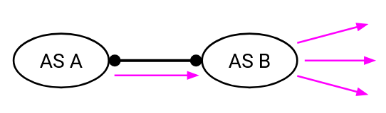
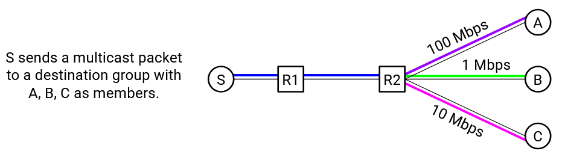

# **Thách thức của IP Multicast** (IP Multicast Challenges)

## **Định tuyến liên miền** (Inter-Domain Routing)

Các giao thức mà chúng ta đã mô tả trước đây (**IGMP**, **DVMRP**, **CBT**) có thể được sử dụng cho **intra-domain multicast routing** (định tuyến multicast trong nội miền). Tuy nhiên, chúng không thể dễ dàng mở rộng để hỗ trợ **inter-domain multicast routing** (định tuyến multicast liên miền).

Một vấn đề lớn ở đây là **scalability** (khả năng mở rộng). Ví dụ: nếu chúng ta sử dụng DVMRP ở quy mô toàn cầu, thì định kỳ, khi trạng thái **pruning** (cắt tỉa) bị xóa, các gói tin sẽ bị **flood** (phát tràn) ra toàn bộ Internet, điều này là không khả thi.

Ngoài ra, hãy nhớ rằng định tuyến liên miền còn có thách thức về **AS autonomy** (tính tự chủ của hệ thống tự trị) và **privacy** (quyền riêng tư). Ví dụ: nếu chúng ta sử dụng CBT ở quy mô toàn cầu, thì **core router** (bộ định tuyến lõi) có thể nằm trong một mạng khác, và điều này yêu cầu bạn phải tin tưởng người khác kiểm soát core router đó.

Định tuyến multicast liên miền là một vấn đề khó, và đã có nhiều nghiên cứu để phát triển giải pháp. Ví dụ: vấn đề chọn core trong CBT có thể được giải quyết bằng cách có nhiều core (mỗi mạng một core) và các core này giao tiếp với nhau. Tuy nhiên, trên thực tế, việc triển khai multicast liên miền rất ít được áp dụng.

## **Tính phí** (Charging)

Mô hình dịch vụ **IP multicast** về cơ bản mâu thuẫn với mô hình kinh doanh mà các **ISP** hiện đại sử dụng. Ví dụ: xét đồ thị AS dưới đây, trong đó AS A và AS B là **peers** (ngang hàng):

Là peers, AS A và AS B nên trao đổi một lượng lưu lượng tương đương, nhưng multicast khiến việc định nghĩa “lưu lượng tương đương” trở nên khó khăn. Ví dụ: giả sử AS A gửi một gói multicast tới AS B. Có thể AS B có nhiều **children** (nút con) là thành viên của nhóm. Điều này có nghĩa là AS B nhận một gói, nhưng phải gửi ra nhiều gói. AS B đã sử dụng nhiều băng thông hơn AS A. Liệu AS A có cần trả thêm phí cho AS B vì điều này không? (Đây là một câu hỏi mở, chưa có câu trả lời rõ ràng.)

Ví dụ khác: xét đồ thị AS dưới đây, trong đó AS A là **provider** (nhà cung cấp) và AS B là **customer** (khách hàng):

AS B trả tiền cho AS A để sử dụng dịch vụ. Nếu AS B gửi một gói multicast, và AS A phải chuyển tiếp nhiều bản sao của gói đó tới nhiều đích khác nhau, thì AS A có nên tính phí cao hơn so với một gói unicast không? Nếu có, thì nên tính thêm bao nhiêu? (Cũng là một câu hỏi mở, chưa có câu trả lời rõ ràng.)

Việc thiết kế mô hình kinh doanh trở nên khó khăn hơn bởi vì mô hình IP multicast không theo dõi rõ ràng kích thước nhóm. Nếu muốn tính phí dựa trên kích thước nhóm đích, thì không có cách rõ ràng nào để xác định kích thước của một nhóm đích bất kỳ. **Forwarding table** (bảng chuyển tiếp) chỉ cho bạn biết về **parent** và **children** của bạn trên các cây phân phối khác nhau, nhưng không cho biết tổng số **end host** sẽ nhận gói tin này.

## **Kiểm soát tắc nghẽn** (Congestion Control)

Xét một nguồn gửi gói multicast xuống **delivery tree** (cây phân phối) tới nhiều người nhận. Nguồn cần chọn một tốc độ gửi hợp lý để tránh quá tải mạng. Vậy tốc độ nào là phù hợp?

Lưu lượng sẽ đi qua nhiều đường khác nhau, và mỗi đường có thể có dung lượng khác nhau. Nguồn có thể gửi ở tốc độ 1 Mbps để tránh quá tải bất kỳ liên kết nào, nhưng điều này để lại dung lượng chưa sử dụng ở các đường khác. Ngược lại, nguồn có thể gửi ở tốc độ 100 Mbps để tối đa hóa hiệu năng, nhưng điều này sẽ làm một số liên kết bị quá tải. Không có câu trả lời rõ ràng cho tốc độ tối ưu.

Trên thực tế, một giải pháp khả thi là định nghĩa các nhóm khác nhau tùy theo hiệu năng. Ví dụ: chúng ta có thể định nghĩa bốn nhóm multicast khác nhau, mỗi nhóm nhận cùng một luồng video nhưng với chất lượng khác nhau. Khi đó, người nhận có thể thử tham gia các nhóm khác nhau để xem nhóm nào cho hiệu năng tốt nhất.

## **Độ tin cậy** (Reliability)

Giống như **IP unicast**, IP multicast là **best-effort** (nỗ lực tối đa nhưng không đảm bảo), điều này làm tăng độ phức tạp. Ví dụ: bạn có thể gửi một gói tin, và nó có thể đến một số, nhưng không phải tất cả, thành viên nhóm.

Chúng ta có thể thử thêm **ack** (xác nhận) để giải quyết, nhưng điều này cũng có vấn đề. Nếu nhóm có hàng triệu thành viên, một nguồn gửi sẽ không thể xử lý hàng triệu ack cho mỗi gói tin.

Một cách tiếp cận khác là sử dụng **negative acknowledgement** (**nack**), trong đó một thành viên nhóm không gửi gì nếu nhận được gói, và gửi nack nếu không nhận được (ví dụ: khi bộ đếm thời gian hết hạn). Tuy nhiên, nếu nhóm có hàng triệu thành viên, nguồn gửi có thể bị quá tải.

Trong cách tiếp cận nack, cũng không rõ cách khôi phục sau lỗi. Nếu ai đó không nhận được gói, chúng ta có nên multicast lại gói đó cho toàn nhóm không? Điều này lãng phí băng thông vì một số thành viên đã nhận được và sẽ nhận bản sao trùng lặp.

Một cách khác là unicast gói tin chỉ tới những thành viên gửi nack. Nếu nhiều thành viên không nhận được gói, điều này cũng lãng phí vì phải unicast nhiều bản sao của cùng một gói. Ví dụ: nếu liên kết đầu tiên làm rơi gói, nghĩa là **không thành viên nào** nhận được gói.

Cách truyền lại nào tốt hơn? Không rõ ràng, và còn phụ thuộc vào số lượng thành viên nhận được gói.

Trên thực tế, một số ứng dụng IP multicast hiện đại không triển khai độ tin cậy. Hoặc, họ triển khai bằng cách mã hóa thêm **redundancy** (dữ liệu dự phòng) vào luồng dữ liệu (ví dụ: **error-correcting codes** – mã sửa lỗi) để các lỗi và mất mát có thể được khôi phục từ chính dữ liệu, không cần sự hỗ trợ của mạng.

Việc mã hóa dự phòng đồng nghĩa với việc cần nhiều bit hơn để mã hóa cùng một lượng dữ liệu. Ví dụ: nếu muốn gửi dữ liệu tương đương 5 gói, bạn có thể gửi 10 gói, và mã hóa sao cho bất kỳ 5 gói nào cũng có thể khôi phục dữ liệu gốc.

## **Bảo mật** (Security)

Một hạn chế khác của IP multicast là thiếu **access control** (kiểm soát truy cập). Bất kỳ ai cũng có thể tham gia một nhóm, và bất kỳ ai cũng có thể gửi thông điệp tới bất kỳ nhóm nào. Nếu muốn áp dụng kiểm soát truy cập (ví dụ: chỉ người dùng trả phí mới được xem trận đấu), bạn phải xây dựng chức năng này riêng.

Việc thiếu kiểm soát truy cập dẫn đến các lỗ hổng bảo mật. Một kẻ tấn công có thể flood gói tin tới một nhóm multicast cụ thể, khiến tất cả thành viên nhóm bị quá tải. Lưu ý rằng điều này hiệu quả hơn so với unicast, nơi kẻ tấn công phải flood gói tin tới từng thành viên riêng lẻ.

Các biện pháp bảo mật bổ sung như **encryption** (mã hóa) cũng khó triển khai. Giả sử bạn mã hóa thông điệp multicast bằng cách cung cấp cho mỗi thành viên nhóm một **shared secret key** (khóa bí mật chung). Nếu ai đó rời nhóm, nhưng bạn vẫn dùng cùng khóa, người đó vẫn có thể đọc thông điệp. Một cách là chuyển sang dùng khóa mới, nhưng khi đó bạn cần một cách để phân phối khóa mới này một cách an toàn tới các thành viên còn lại.

## **IP Multicast trong thực tế** (IP Multicast in Practice)

Vì tất cả những thách thức trên, IP multicast ngày nay chủ yếu được sử dụng trong phạm vi một miền duy nhất, chứ không phải trong đủ các tên miền khác nhau.

Một số ứng dụng vẫn có thể cần giao tiếp nhóm qua nhiều mạng (ví dụ: trò chơi đa người chơi, hội nghị truyền hình). Thay vì dựa vào IP multicasting, vốn không hỗ trợ giao tiếp giữa các mạng, nhiều ứng dụng đã triển khai các giải pháp tùy chỉnh riêng cho giao tiếp nhóm.

Ví dụ, nếu nhóm đủ nhỏ, ứng dụng có thể triển khai một máy chủ trung gian. Giao tiếp nhóm được truyền unicast đến máy chủ trung gian, sau đó máy chủ này truyền tin nhắn unicast đến các thành viên khác trong nhóm.

Hoặc, nếu nhóm đủ nhỏ, giải pháp unicast đơn giản (gửi các gói tin unicast riêng lẻ đến từng thành viên trong nhóm) có thể hoạt động tốt.

Nếu IP multicast không hoạt động giữa các miền và các giải pháp tùy chỉnh yêu cầu công sức thêm để triển khai và mở rộng quy mô, các ứng dụng hiện đại xử lý giao tiếp nhóm như thế nào? Một giải pháp là sử dụng overlay multicast, một giải pháp thay thế cho IP multicast thực hiện chức năng mạng ở Lớp 7 thay vì Lớp 3. Chúng ta sẽ tìm hiểu về overlay multicast trong phần tiếp theo.