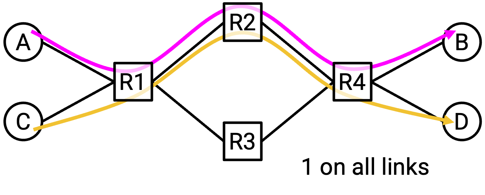
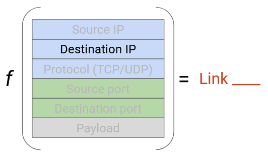
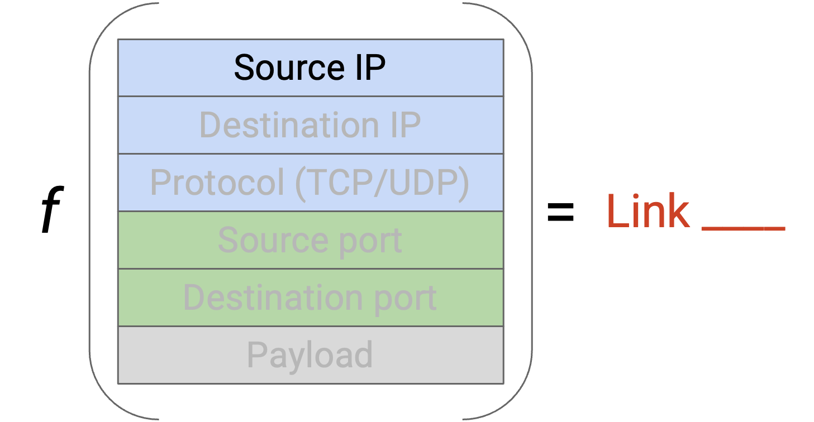
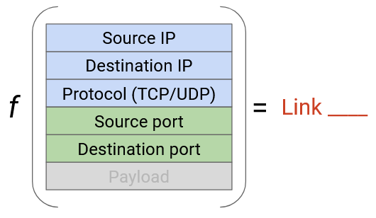
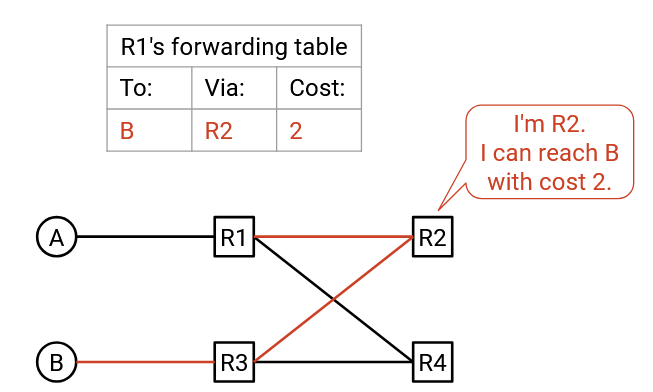
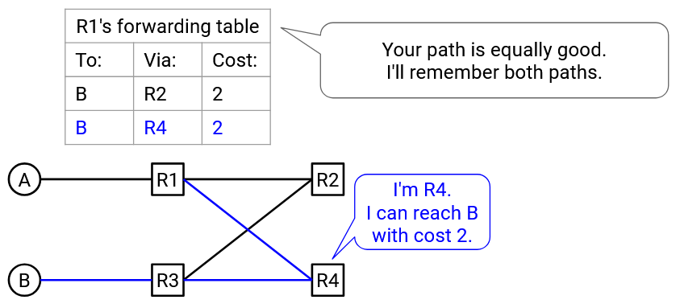

# **Định tuyến trong Datacenter** (Datacenter Routing)

## **Tại sao Datacenter lại khác biệt?** (Why are Datacenters Different?)

Trong phần trước, chúng ta đã thiết kế các mạng **Clos**, tạo ra nhiều đường đi giữa các **server**. Các server có thể giao tiếp đồng thời với băng thông cao bằng cách sử dụng các đường đi khác nhau trong mạng.

Vậy sẽ có vấn đề gì nếu áp dụng các **routing algorithm** (thuật toán định tuyến) tiêu chuẩn vào các **network topology** (kiến trúc mạng) này?

Cho đến nay, các **routing protocol** (giao thức định tuyến) của chúng ta chọn một đường duy nhất giữa **source** (nguồn) và **destination** (đích). Nếu toàn bộ lưu lượng đều đi cùng một đường, chúng ta không tận dụng được tất cả các liên kết bổ sung trong mạng Clos. Lý tưởng nhất, chúng ta muốn chỉnh sửa giao thức định tuyến để một **packet** có thể sử dụng nhiều đường khác nhau giữa cùng một cặp điểm cuối.

Giả sử A và B có băng thông uplink 200 Gbps, và các liên kết giữa switch với switch có băng thông 100 Gbps. Nếu toàn bộ lưu lượng giữa A và B bị buộc đi theo đường màu xanh lá, chúng ta đang bỏ phí đường màu đỏ. Chúng ta có thể truyền dữ liệu ở tốc độ tối đa nếu cho phép packet đi theo các đường khác nhau.

Ngoài ra, nếu có nhiều kết nối đồng thời, chúng ta muốn các kết nối đó sử dụng các đường khác nhau để tối đa hóa băng thông.

Giả sử tất cả các liên kết đều có băng thông 100 Gbps. Trong ví dụ này, nhiều kết nối đang cạnh tranh băng thông. Nếu kết nối A-B và C-D đều chọn cùng một đường, các liên kết R1-R2 và R2-R4 sẽ bị quá tải (200 Gbps trên dung lượng 100 Gbps). Chúng ta có thể truyền dữ liệu ở tốc độ tối đa nếu A-B và C-D dùng các đường khác nhau.

## **Equal Cost Multi-Path (ECMP) Routing** (Định tuyến đa đường có chi phí bằng nhau)

Trong **equal cost multi-path** routing, mục tiêu là tìm tất cả các đường ngắn nhất (có chi phí bằng nhau) và **load-balance** (cân bằng tải) packet qua các đường này.

Nếu một packet đến **router**, nhưng có nhiều liên kết đầu ra đều là đường ngắn nhất hợp lệ, router sẽ chọn liên kết nào? Router cần một **function** (hàm – có thể hình dung như một đoạn mã) nhận packet và xuất ra lựa chọn liên kết. Hàm này phải cân bằng tải đúng cách giữa các đường có chi phí bằng nhau.

Một chiến lược khả thi là **round-robin**. Nếu có hai liên kết đầu ra ngắn nhất, hàm có thể quy định: gửi tất cả packet lẻ qua Link 1 và packet chẵn qua Link 2.

Vấn đề của cách này là: đường có chi phí bằng nhau không nhất thiết có **latency** (độ trễ) bằng nhau. (Nhớ rằng chi phí được operator định nghĩa theo tiêu chí tùy ý.) Nếu gửi tất cả packet lẻ qua đường chậm và packet chẵn qua đường nhanh, **TCP recipient** (bên nhận TCP) có thể nhận tất cả packet chẵn trước packet lẻ. TCP quan tâm đến việc sắp xếp lại packet, nên bên nhận sẽ phải **buffer** (đệm) packet chẵn cho đến khi nhận đủ packet lẻ, gây giảm hiệu năng.

Một chiến lược thông minh hơn là xem xét một số trường trong **packet header** và dùng chúng để đưa ra lựa chọn liên kết một cách **deterministic** (xác định). Có thể xem xét những trường nào?

- Nếu dùng **destination IP** để chọn giữa các đường ngắn nhất: vấn đề là nếu nhiều nguồn gửi packet đến cùng một đích, tất cả packet có cùng destination IP sẽ bị ánh xạ vào cùng một liên kết ngắn nhất → không cân bằng tải.

- Nếu dùng **source IP**: tương tự, nếu một nguồn gửi packet đến nhiều đích, tất cả packet có cùng source IP sẽ bị ánh xạ vào cùng một liên kết ngắn nhất.

Giải pháp: dùng cả **source IP** và **destination IP**. Để cân bằng tải, ta có thể **hash** (băm) cặp địa chỉ này và ánh xạ kết quả băm tới một liên kết (tương tự như **hash table**). Cặp địa chỉ này chứa đủ **entropy** (độ ngẫu nhiên) để tránh vấn đề trước đó.

Vẫn còn một vấn đề: nếu có nhiều kết nối lớn giữa cùng một source và destination, ta không muốn tất cả chúng vào cùng một liên kết. Giải pháp: xem thêm **source port** và **destination port** trong **TCP** hoặc **UDP header**.

Nói chung, mọi vấn đề đã nêu (sắp xếp lại packet trong kết nối TCP, quá nhiều kết nối trên một liên kết) đều có thể giải quyết nếu đặt mỗi kết nối trên một liên kết riêng. Để định danh duy nhất một kết nối, cần **5-tuple** gồm: (source IP, destination IP, protocol, source port, destination port). Cần protocol để phân biệt giữa kết nối TCP và UDP dùng cùng IP/port. Hai packet thuộc cùng một kết nối khi và chỉ khi chúng có cùng 5-tuple.

Bằng cách băm cả 5 giá trị, ta đảm bảo packet trong cùng một kết nối đi cùng một đường (tránh sắp xếp lại), đồng thời cân bằng tải kết nối qua các đường khác nhau. Cách này gọi là **per-flow load balancing** (cân bằng tải theo luồng). Các router thương mại hiện đại thường hỗ trợ đọc 5 giá trị này.

Per-flow load balancing đảm bảo mỗi liên kết được dùng bởi số lượng kết nối xấp xỉ nhau, dù không tính đến kích thước kết nối. Việc tính đến kích thước kết nối là khả thi về mặt kỹ thuật nhưng tốn kém (router phải xử lý nhiều hơn) và lợi ích không đáng kể (per-flow đã cân bằng khá tốt), nên không áp dụng trong thực tế.

## **Multi-Path Distance-Vector Protocols** (Giao thức vectơ khoảng cách đa đường)

Để tối đa hóa băng thông, ta nên gửi packet qua các đường khác nhau, ngay cả khi chúng đến cùng một đích (ví dụ: nếu packet thuộc các kết nối khác nhau). Điều này nghĩa là phải chỉnh sửa routing protocol để router học tất cả các đường ngắn nhất, không chỉ một.

Trong **distance-vector protocol** tiêu chuẩn, nếu nhận được quảng bá về một đường mới có chi phí bằng chi phí tốt nhất hiện tại, ta sẽ bỏ qua đường mới. Nhưng để nhớ tất cả các đường có chi phí tối thiểu, ta nên chấp nhận cả đường bằng chi phí và lưu cả hai vào **forwarding table**. Khi đó, một đích có thể ánh xạ tới nhiều **next hop** miễn là chúng có cùng chi phí tối thiểu.

Ví dụ: R1 nhận quảng bá từ cả R4 và R3, đều cho biết có thể đến B trong 2 hop. Forwarding table lưu cả R4 và R3 là next hop khả thi, cùng chi phí tối thiểu là 3.

Khi chuyển tiếp packet, router sẽ băm 5-tuple để gửi khoảng một nửa kết nối qua R3 và nửa còn lại qua R2.

## **Multi-Path Link-State Protocols** (Giao thức trạng thái liên kết đa đường)

Trong **link-state protocol**, ta flood quảng bá để mọi nút có bức tranh đầy đủ về mạng. Thông thường, mỗi nút tính một đường ngắn nhất đến mỗi đích để điền vào forwarding table. Để hỗ trợ nhiều đường, mỗi nút cần tính **tất cả** các đường ngắn nhất đến mỗi đích.

Giống như trong distance-vector đã chỉnh sửa, forwarding table giờ có thể chứa nhiều next hop cho một đích nhất định.

