# **Host Networking** (Mạng tại máy chủ)

## **Host Networking là gì?** (What is Host Networking?)

Truyền thống trước đây, **bottleneck** (nút thắt cổ chai) của mạng nằm bên trong **network infrastructure** (hạ tầng mạng), chứ không phải ở **end host** (máy chủ đầu cuối). Tuy nhiên, trong các **datacenter** (trung tâm dữ liệu) hiệu năng cao hiện đại, khi nhu cầu hiệu năng mạng tiếp tục tăng, các end host đang gặp khó khăn để đáp ứng.

Cụ thể, **CPU** chạy các **network protocol** (giao thức mạng) như **TCP** không còn đủ khả năng cung cấp hiệu năng cao mà datacenter cần. CPU đắt đỏ, và để đạt hiệu năng cao, CPU phải dành toàn bộ thời gian chạy các giao thức mạng, khiến ít tài nguyên hơn được phân bổ cho việc chạy ứng dụng thực tế.

Ngoài ra, các giao thức mà chúng ta đang sử dụng, như **IP** và **TCP**, không còn đáp ứng được yêu cầu hiệu năng cao hiện đại.

Để giải quyết hai vấn đề này, chúng ta chuyển sang **host networking** – bao gồm các tối ưu hóa tại end host (trái ngược với tối ưu hóa bên trong mạng).

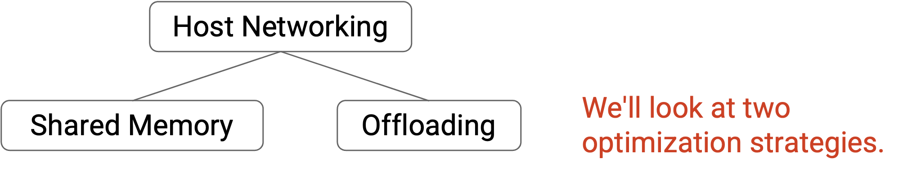

## **Tối ưu hóa: Shared Memory trong User Space** (Optimization: Shared Memory in User Space)

Nhớ rằng tại end host:  
- **Layer 1** và **Layer 2** được triển khai bằng phần cứng tại **Network Interface Card (NIC)**.  
- **Layer 3** và **Layer 4** được triển khai bằng phần mềm trong **Operating System (OS)** (trên CPU).  
- **Layer 7** là chính ứng dụng.

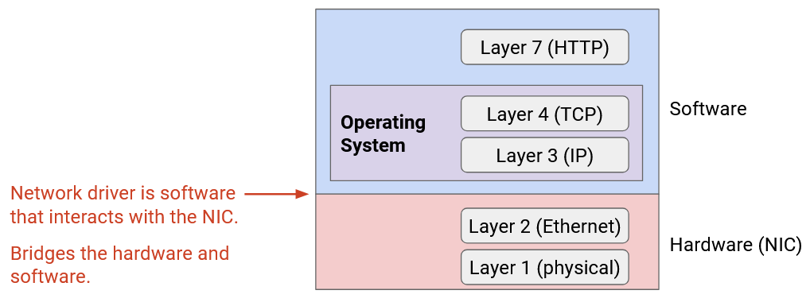

Từ các môn học nền tảng (ví dụ: CS 61C tại UC Berkeley), chúng ta biết rằng máy tính hiện đại được thiết kế với **virtual memory** (bộ nhớ ảo), để mỗi ứng dụng có **address space** (không gian địa chỉ) riêng, tách biệt với ứng dụng khác. Cụ thể, mỗi ứng dụng Layer 7 có không gian địa chỉ riêng trong **user space**. Ngược lại, hệ điều hành chạy trong **kernel space** – vùng bộ nhớ đặc biệt mà ứng dụng trong user space không thể truy cập.

Mô hình quản lý bộ nhớ này có nghĩa là khi truyền packet xuống stack để gửi dữ liệu, chúng ta liên tục **copy** dữ liệu từ user space sang kernel space. Khi nhận dữ liệu, packet được truyền lên stack từ kernel space sang user space, cũng cần copy. Việc copy bit qua lại giữa kernel space và user space vừa tốn kém vừa không cần thiết.

Một vấn đề khác là lập trình trong kernel space rất khó. Nếu muốn chỉnh sửa TCP để tối ưu cho mục đích riêng, chúng ta phải can thiệp sâu vào hệ điều hành và lập trình ở mức rất thấp. Việc triển khai và kiểm thử trong kernel space khó khăn và chậm hơn so với user space.

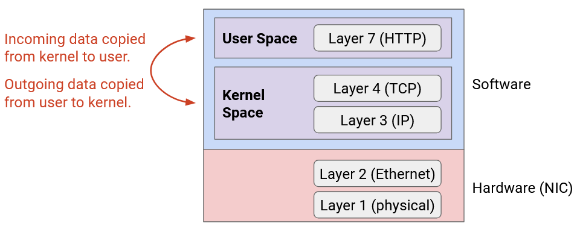

Để giải quyết hai vấn đề này, chúng ta có thể di chuyển **networking stack** (ví dụ: các giao thức Layer 3 và Layer 4) ra khỏi kernel space và đưa vào user space. Khi đó, Layer 3, 4 và 7 có thể truy cập cùng một không gian địa chỉ, không cần copy qua lại. Ngoài ra, việc phát triển và đổi mới trong user space cũng dễ dàng hơn.

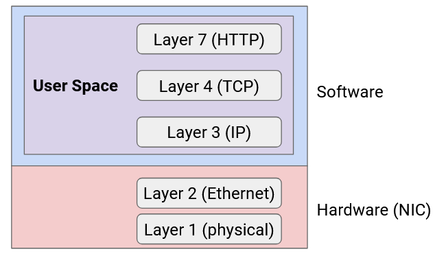

Việc sử dụng **shared memory** trong user space giúp loại bỏ một số công việc thừa như copy dữ liệu qua lại, nhưng vẫn chưa đủ để giúp host đáp ứng yêu cầu hiệu năng hiện đại.

## **Tối ưu hóa: Offloading sang NIC** (Optimization: Offloading to NIC)

CPU không đủ nhanh để chạy các giao thức mạng (ví dụ: IP, TCP) ở tốc độ hiệu năng hiện đại. Ngoài ra, dùng CPU để chạy giao thức mạng sẽ làm giảm tài nguyên CPU dành cho ứng dụng.

Để giải quyết, chúng ta có thể **offload** (chuyển tải) networking stack ra khỏi CPU (phần mềm) và đưa vào NIC (phần cứng).

NIC là nơi tự nhiên để thực hiện offload. Mọi packet đều phải đi qua NIC, nên NIC có thể xử lý thêm và giảm tải cho CPU.

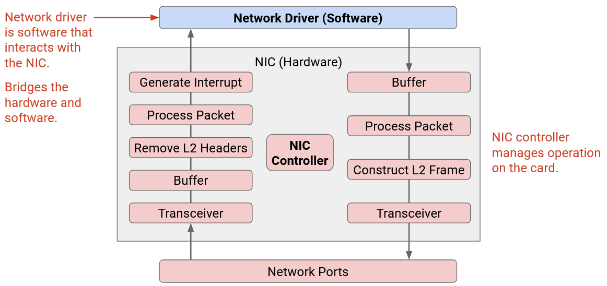

**Network driver** là phần mềm trong OS dùng để lập trình và quản lý NIC. Driver cung cấp **API** cho phép các chương trình cấp cao hơn trong OS tương tác với NIC. Có thể coi driver là cầu nối giữa phần cứng và phần mềm.

**Lợi ích của offloading**:  
- Giải phóng tài nguyên CPU cho ứng dụng.  
- Xử lý chuyên biệt bằng phần cứng có thể hiệu quả hơn CPU đa dụng (về tốc độ và tiêu thụ điện).  
- Thực thi trong phần cứng không chỉ giảm latency mà còn giúp latency ổn định và dự đoán được.  

Khi chạy ứng dụng trong phần mềm, CPU phải **schedule** (lập lịch) nhiều tiến trình, có thể gây trễ không đoán trước. Ví dụ: nếu có packet cần xử lý, CPU có thể phải hoàn thành tác vụ hiện tại trước khi xử lý packet đó.

## **Lược sử Offloading: Epoch 0** (Brief History of Offloading: Epoch 0)

Việc offload tác vụ từ OS (phần mềm) sang NIC (phần cứng) là một lĩnh vực nghiên cứu đang diễn ra. Có ba **epoch** (giai đoạn) phát triển, trong đó các tác vụ ngày càng phức tạp được offload sang NIC.

**Epoch 0**: Trước khi có offloading, hãy xem NIC làm gì trong networking stack tiêu chuẩn.

NIC có một **central controller processor** (bộ xử lý điều khiển trung tâm) quản lý hoạt động trên card.

- **Packet đến**: **Transceiver** chuyển tín hiệu điện thành tín hiệu số (1 và 0) và đưa vào **buffer**. NIC đọc bit từ buffer, phân tích thành **Ethernet frame**, xử lý frame (ví dụ: kiểm tra **checksum**), và loại bỏ **Layer 2 header**. Cuối cùng, NIC tạo **interrupt** để báo CPU dừng việc đang làm và lấy packet Layer 3 để xử lý tiếp.

- **Packet đi**: Packet từ network driver được đặt vào buffer. NIC đọc bit từ buffer, xử lý để tạo Ethernet frame, sau đó đưa frame tới transceiver để chuyển bit số thành tín hiệu điện.

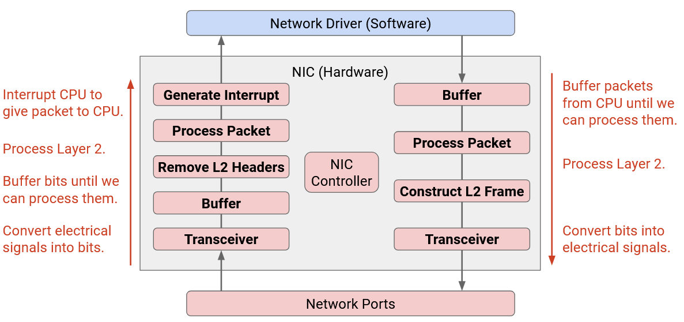

Trong networking stack tiêu chuẩn, có thể coi NIC như một “tấm thảm chùi chân” – chỉ chuyển packet đến OS và gửi packet ra ngoài cho OS, nhưng xử lý rất tối thiểu trên các packet đó.

## **Lược sử Offloading: Epoch 1** (Brief History of Offloading: Epoch 1)

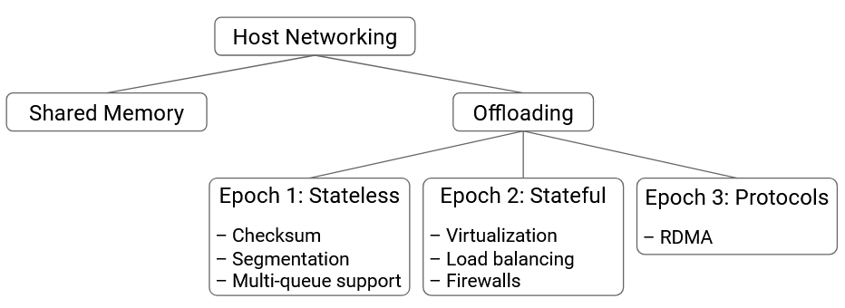

Những tác vụ đầu tiên mà chúng ta thử **offload** (chuyển tải) sang **NIC** (Network Interface Card – card giao tiếp mạng) là các tác vụ **stateless** (không trạng thái) đơn giản. Các tác vụ này có thể được thực hiện độc lập trên từng **packet** (gói tin), và NIC không cần ghi nhớ trạng thái giữa nhiều packet.

Một tác vụ stateless có thể offload là **checksum computation** (tính toán tổng kiểm tra), không chỉ ở **Layer 2** mà còn ở **Layer 3** và **Layer 4**. NIC có thể xác thực checksum (cho packet đến) và tính checksum (cho packet đi), để CPU không phải làm việc này.

Một tác vụ stateless khác có thể offload là **segmentation** (phân mảnh). Trong mô hình tiêu chuẩn, nếu ứng dụng có một tệp lớn để gửi, **OS** (Operating System – hệ điều hành) chịu trách nhiệm chia tệp thành các packet nhỏ. Ở phía nhận, OS chịu trách nhiệm ghép lại các packet này. Như một tối ưu hóa, chúng ta có thể để NIC xử lý việc chia nhỏ và ghép lại packet. Khi đó, OS không còn phải xử lý số lượng lớn packet nhỏ, mà chỉ xử lý một số packet lớn hơn, hiệu quả hơn (ví dụ: ít header hơn để xử lý).

Với segmentation, có sự đánh đổi giữa kết nối mượt mà và hiệu quả CPU:  
- Nếu ứng dụng gửi packet lớn cho NIC → CPU ít việc hơn, nhưng NIC nhận các đợt dữ liệu lớn, kết nối trở nên **bursty** (bùng nổ).  
- Nếu ứng dụng gửi packet nhỏ cho NIC → CPU nhiều việc hơn, nhưng NIC nhận luồng dữ liệu đều hơn, kết nối mượt hơn.

Một số thách thức khi **aggregate** (gộp) packet nhỏ:  
- Nếu một packet trung gian bị mất → NIC có thể phải chuyển lên nhiều packet nhỏ và không thể gộp thành packet lớn.  
- Nếu một số packet có **flag** (cờ) được bật (ví dụ: **ECN** cho tắc nghẽn) và số khác không → packet gộp cuối cùng có nên bật cờ hay không?

Tác vụ stateless thứ ba là **multi-queue support** (hỗ trợ đa hàng đợi). Trong mô hình tiêu chuẩn, NIC có một hàng đợi cho packet đi và một hàng đợi cho packet đến, tất cả ứng dụng dùng chung. **Network driver** (trình điều khiển mạng – phần mềm) chịu trách nhiệm **load balancing** (cân bằng tải) nếu nhiều ứng dụng hoặc nhiều CPU gửi/nhận dữ liệu.

Chúng ta có thể offload công việc cân bằng tải này sang NIC. NIC sẽ có nhiều **transmit queue** (hàng đợi gửi) và nhiều **receive queue** (hàng đợi nhận). Ví dụ: trong hệ thống đa xử lý, mỗi CPU có hàng đợi gửi/nhận riêng. NIC duy trì các hàng đợi song song, đảm bảo cách ly và cân bằng tải giữa các CPU. NIC cũng có thể ưu tiên một số hàng đợi hơn hàng đợi khác.

Dù NIC có nhiều hàng đợi, cuối cùng vẫn phải gửi tất cả packet qua một dây. Do đó, NIC cần một **packet scheduler** (bộ lập lịch gói tin) để quyết định gửi từ hàng đợi nào tiếp theo. Bộ lập lịch có thể lập trình để đạt hành vi cân bằng tải mong muốn (ví dụ: ưu tiên một hàng đợi hơn hàng khác).

Một thách thức với multi-queue là ánh xạ packet vào hàng đợi. Khi CPU có dữ liệu để gửi, nó dùng hàng đợi nào? Đặc biệt, cần đảm bảo tất cả packet trong cùng một **flow** (luồng) vào cùng một hàng đợi (không bị phân tán), để đảm bảo packet trong flow được gửi **in-order** (đúng thứ tự). Nhớ rằng trong TCP, gửi packet sai thứ tự vẫn hoạt động nhưng giảm hiệu năng (bên nhận phải buffer packet sai thứ tự).

Khi xử lý packet đến từ nhiều receive queue, NIC có thể **hash** packet để quyết định CPU nào xử lý packet đó. Sau đó, NIC **interrupt** CPU đó để xử lý. Hành vi dựa trên hash này tương tự **ECMP** (Equal-Cost Multi-Path Routing) và giúp đảm bảo tất cả packet trong cùng một flow được xử lý theo thứ tự bởi cùng một CPU.

## **Lược sử Offloading: Epoch 2** (Brief History of Offloading: Epoch 2)

Sau đó, chúng ta bắt đầu offload các tác vụ **stateful** (có trạng thái) phức tạp hơn sang NIC.

Sự phát triển của Epoch 2 được thúc đẩy bởi **virtualization** (ảo hóa) trong datacenter, nơi nhiều **virtual machine (VM)** chạy trên cùng một **physical server**. Ví dụ: trong ảo hóa, chúng ta cần một **virtual switch** để chuyển tiếp packet đến đúng VM. Virtual switch có thể chạy bằng phần mềm, nhưng cũng có thể triển khai bằng phần cứng.

**Firewall** (tường lửa) và **bandwidth management** (quản lý băng thông) là ví dụ khác của stateful offload. Trong phần mềm, ta có thể triển khai firewall để thực thi **security policy** (chính sách bảo mật) – ví dụ: drop tất cả packet đến từ IP độc hại. Ta cũng có thể áp dụng chính sách quản lý băng thông giữa người dùng – ví dụ: User A chỉ được gửi 100 packet/phút, vượt quá sẽ bị drop. Các chính sách này có thể được kiểm tra bởi phần cứng.

Để triển khai các tác vụ stateful này, ta có thể dùng **match-action pair table** (bảng cặp điều kiện-hành động), tương tự bảng **OpenFlow** (trong phần SDN). API này cho phép phần mềm lập trình các chính sách lên phần cứng, để phần cứng xử lý packet theo chính sách. **Match** có thể dựa trên 5-tuple hoặc các trường header khác. **Action** có thể là drop packet, forward packet tới **next-hop** cụ thể, hoặc sửa header.

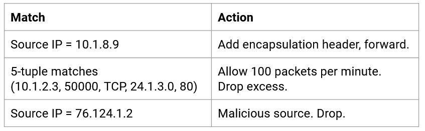

## **Lược sử Offloading: Epoch 3** (Brief History of Offloading: Epoch 3)

Đây là kỷ nguyên hiện tại của offloading. Có nhiều nỗ lực offload toàn bộ **protocol** (giao thức) như TCP ra khỏi OS và đưa vào NIC. Epoch này được thúc đẩy bởi nhu cầu hiệu năng cao hơn nữa, đặc biệt với các ứng dụng **AI/ML** (Artificial Intelligence / Machine Learning) yêu cầu hiệu năng lớn.

Lý tưởng nhất, chúng ta muốn ứng dụng gửi dữ liệu trực tiếp cho phần cứng, và phần cứng thực hiện toàn bộ xử lý mạng ở Layer 4, 3, 2, 1. OS hoàn toàn không tham gia, và tất cả giao thức mạng được triển khai trực tiếp trong phần cứng.

Dù đã có thử nghiệm offload các giao thức mạng tiêu chuẩn như TCP vào NIC, nhưng chưa triển khai ở quy mô lớn. Thay vào đó, chúng ta thiết kế các giao thức mới như **RDMA** (Remote Direct Memory Access), được thiết kế đặc biệt để triển khai trực tiếp trong phần cứng.

## **RDMA: Remote Direct Memory Access** (Truy cập bộ nhớ từ xa trực tiếp)

**RDMA** cung cấp một **abstraction** (mô hình trừu tượng) cho phép **Server A** truy cập trực tiếp bộ nhớ của **Server B** mà không cần sự tham gia của **OS** (Operating System – hệ điều hành) hoặc **CPU** của bất kỳ server nào. RDMA có thể được triển khai trực tiếp trong phần cứng, thay thế **TCP/IP software networking stack** (ngăn xếp mạng phần mềm TCP/IP) tiêu chuẩn.

Giả sử Server A muốn gửi một tệp 10 GB cho Server B. Trong networking stack tiêu chuẩn, CPU đọc tệp từ bộ nhớ, xử lý nó (ví dụ: TCP/IP), và chuyển các **packet** (gói tin) kết quả cho **NIC** (Network Interface Card – card giao tiếp mạng). Ở phía nhận, NIC chuyển packet cho CPU, CPU xử lý packet và ghi **payload** (dữ liệu tải) của tệp vào bộ nhớ. Lưu ý rằng CPU tham gia xử lý từng packet của tệp 10 GB.

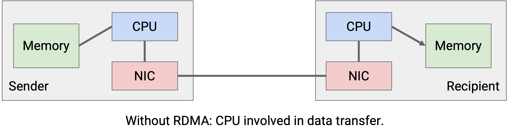

Trong abstraction RDMA, NIC đọc tệp từ bộ nhớ và gửi đi, **không cần CPU tham gia**. Ở phía nhận, NIC xử lý các byte đến và ghi vào bộ nhớ, cũng không cần CPU tham gia. Lưu ý rằng CPU vẫn cần ở giai đoạn đầu để thiết lập quá trình truyền và ở giai đoạn cuối để hoàn tất. Nhưng phần lớn quá trình truyền tệp 10 GB được thực hiện mà không cần CPU.

Để sử dụng RDMA, lập trình viên không còn dùng **socket abstraction** nữa. Thay vào đó, mô hình trừu tượng chính được sử dụng là **queue pair** (cặp hàng đợi). **Send work queue** (hàng đợi công việc gửi) chứa tất cả các tác vụ đang chờ, nơi dữ liệu cần được truyền từ tôi tới một máy khác. **Receive work queue** (hàng đợi công việc nhận) chứa tất cả các tác vụ đang chờ, nơi tôi cần nhận dữ liệu từ máy khác. Một NIC có thể có nhiều queue pair, mỗi cặp cung cấp dịch vụ khác nhau cho lập trình viên. Ví dụ: một cặp có thể cung cấp dịch vụ truyền tin cậy, đúng thứ tự (**reliable, in-order delivery**), trong khi một cặp khác có thể cung cấp dịch vụ không tin cậy (**unreliable delivery**). Một queue pair được cấu hình để truyền tin cậy và đúng thứ tự là gần giống nhất với một kết nối TCP truyền thống.

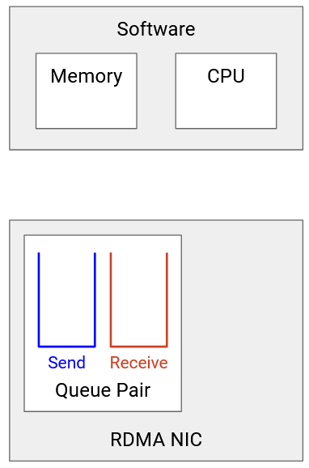

Mỗi phần tử trong queue được gọi là **Work Queue Element (WQE)** (phần tử hàng đợi công việc). Một WQE cho phép ứng dụng mô tả công việc cần thực hiện. Ví dụ, WQE trong receive queue có thể nói: “Lấy 100 MB bắt đầu từ địa chỉ *0xffff1234* trên server từ xa, và ghi chúng vào địa chỉ *0xffff7890* trong bộ nhớ cục bộ của tôi.” Trong mã nguồn, WQE là một **struct** chứa các chỉ dẫn này, ví dụ: một **pointer** (con trỏ) tới nơi sẽ ghi dữ liệu nhận được.

Lưu ý rằng abstraction WQE cung cấp cho giao thức RDMA một cái nhìn ở mức cao hơn về ứng dụng. Trong TCP/IP stack, mạng chỉ thấy một **bytestream** (luồng byte), nhưng trong RDMA, WQE cho phép ứng dụng mô tả công việc chi tiết hơn (ví dụ: chỉ định điểm bắt đầu và kết thúc của một khối dữ liệu được truyền).

Khi một tác vụ hoàn tất, WQE được gỡ khỏi queue, và NIC tạo một **Completion Queue Element (CQE)** (phần tử hàng đợi hoàn tất) mới, mô tả điều gì đã xảy ra với tác vụ (ví dụ: thành công hoặc thất bại). CQE này được lưu trong **Completion Queue** và chờ cho đến khi ứng dụng sẵn sàng đọc CQE để biết kết quả của tác vụ.

Lưu ý rằng RDMA hoạt động **asynchronous** (bất đồng bộ). Ứng dụng có thể thêm tác vụ (WQE) vào queue pair bất cứ lúc nào, và NIC sẽ xử lý các tác vụ theo thứ tự. Tương tự, khi tác vụ hoàn tất, một CQE được đặt vào completion queue, và ứng dụng có thể đọc CQE bất cứ lúc nào. (So sánh với TCP/IP stack, nơi dữ liệu đến sẽ kích hoạt một **interrupt** cho CPU để xử lý dữ liệu đó.)

## **Ví dụ RDMA** (RDMA Example)

**RDMA** (Remote Direct Memory Access – truy cập bộ nhớ từ xa trực tiếp) có thể được sử dụng cho nhiều loại thao tác khác nhau giữa các **server**. Mỗi thao tác có các thông số hiệu năng riêng (ví dụ: **latency** – độ trễ – khác nhau) và **semantics** (ngữ nghĩa) khác nhau (ví dụ: thông báo lỗi khác nhau). Ví dụ dưới đây minh họa một thao tác **RDMA send**, trong đó **Server A** đọc một tệp từ bộ nhớ của mình, truyền dữ liệu đó, và **Server B** ghi tệp này vào bộ nhớ của nó.

1. Mỗi server chỉ định một vùng bộ nhớ để **NIC** (Network Interface Card – card giao tiếp mạng) có thể truy cập cho các phiên truyền RDMA. Server A chỉ định vùng bộ nhớ chứa tệp là **NIC-readable** (NIC có thể đọc). Server B chỉ định một **blank buffer** (bộ đệm trống) nơi nó sẽ nhận tệp là NIC-readable.

    

2. Mỗi server thiết lập các **queue** (hàng đợi). Cả hai NIC hiện có **send queue** (hàng đợi gửi), **receive queue** (hàng đợi nhận) và **completion queue** (hàng đợi hoàn tất). Lưu ý: bước này có thể thực hiện **out-of-band** (ngoài băng), sử dụng một giao thức truyền thống như **TCP** để phối hợp giữa hai server.

    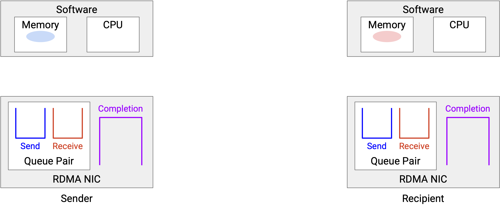

3. Server A tạo một **WQE** (Work Queue Element – phần tử hàng đợi công việc) trong send queue. WQE này chứa **pointer** (con trỏ) tới tệp, chỉ định dữ liệu cần gửi. Ở phía bên kia, Server B tạo một WQE trong receive queue. WQE này chứa con trỏ tới blank buffer, chỉ định nơi dữ liệu nhận được sẽ được ghi vào.

    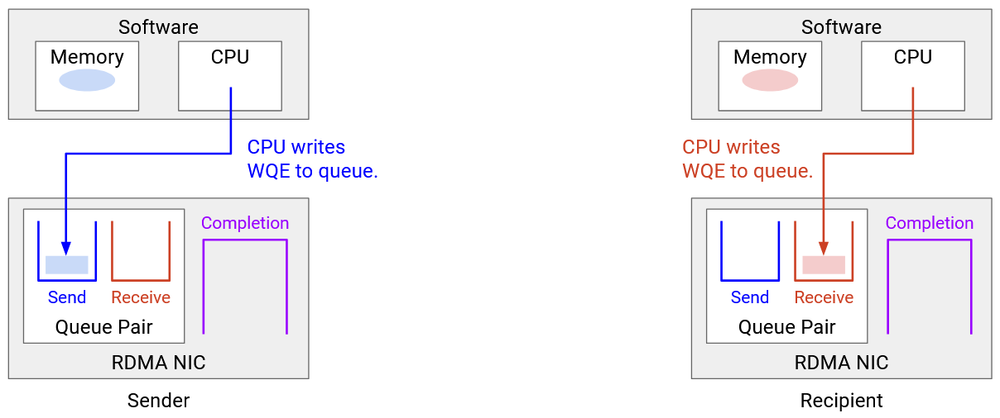

    

4. Khi việc truyền đã được xếp hàng ở cả hai phía, quá trình truyền dữ liệu có thể diễn ra mà không cần phần mềm tham gia. NIC xử lý mọi thứ, bao gồm **reliability** (độ tin cậy), **congestion control** (kiểm soát tắc nghẽn), v.v.

    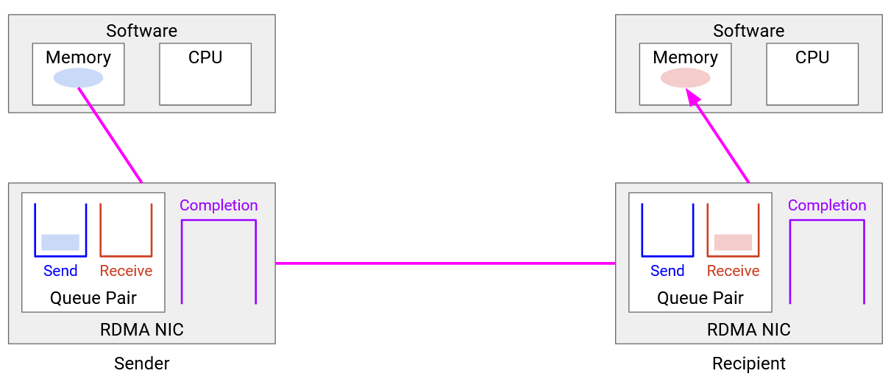

5. Khi truyền xong, các WQE được gỡ khỏi queue. Cả hai NIC tạo một **CQE** (Completion Queue Element – phần tử hàng đợi hoàn tất), cho biết quá trình truyền đã hoàn tất và kèm theo các thông báo trạng thái liên quan (ví dụ: thông báo lỗi). CQE của Server A cho biết dữ liệu đã được gửi thành công, và CQE của Server B cho biết dữ liệu đã được nhận thành công.

    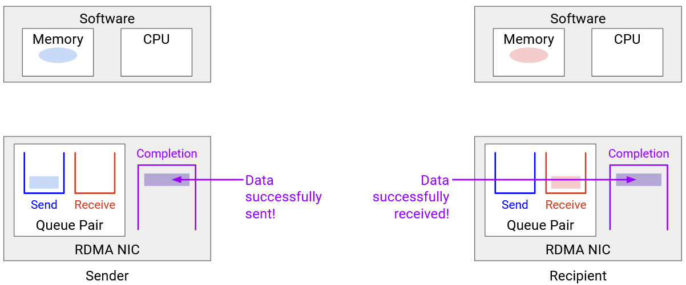

6. Cuối cùng, ứng dụng đọc CQE để biết điều gì đã xảy ra với quá trình truyền.

    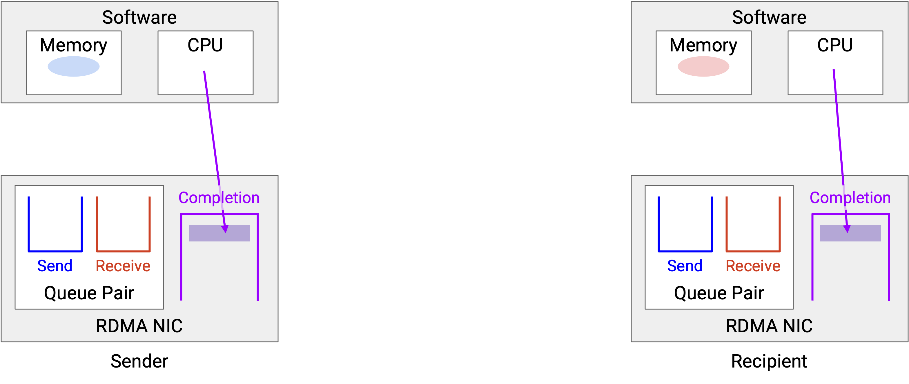

## **Ưu, nhược điểm và ứng dụng của RDMA** (RDMA Pros, Cons, Applications)

RDMA mang lại khả năng truyền dữ liệu hiệu năng cao (**low latency** – độ trễ thấp, **high bandwidth** – băng thông cao) và giải phóng CPU cho ứng dụng. Tuy nhiên, RDMA không miễn phí: nó yêu cầu phần cứng và phần mềm chuyên dụng, và thường phức tạp hơn **networking stack** (ngăn xếp mạng) truyền thống. Hãy nhớ rằng RDMA thay thế **TCP/IP stack**, nên nó phải triển khai toàn bộ chức năng của TCP/IP như reliability và congestion control, tất cả trực tiếp trong phần cứng.

RDMA cũng có một số hạn chế, và thường hoạt động tốt nhất trong datacenter khi hai server ở gần nhau về mặt vật lý. Nếu hai server ở xa, độ trễ chủ yếu đến từ việc truyền dữ liệu qua mạng, và lợi ích thời gian từ RDMA là không đáng kể. Ngược lại, nếu hai server ở gần, thời gian xử lý packet tại host có thể là nguyên nhân chính gây trễ, nên RDMA mang lại lợi ích đáng kể.

RDMA đã được áp dụng trong nhiều bối cảnh yêu cầu tính toán hiệu năng cao, độ trễ thấp, ví dụ: nghiên cứu khoa học, mô hình tài chính, dự báo thời tiết, **machine learning** (học máy) và truy vấn tìm kiếm. Trong **cloud computing** (điện toán đám mây), RDMA có thể dùng để di chuyển một **VM** (Virtual Machine – máy ảo) lớn từ server vật lý này sang server khác, giải phóng CPU cho khách hàng. Trong huấn luyện AI/ML, RDMA không chỉ giải phóng CPU và giảm độ trễ, mà còn mang lại độ trễ **predictable** (dự đoán được), điều này quan trọng khi nhiều server cần phối hợp để huấn luyện mô hình AI/ML.

## **Triển khai RDMA** (Implementing RDMA)

Hãy nhớ rằng RDMA thay thế TCP/IP networking stack, nên RDMA chịu trách nhiệm cho reliability, congestion control, v.v. Có hai triết lý chính để triển khai:

- **Cách 1:** Triển khai các tính năng này trong chính mạng, ví dụ: đảm bảo reliability tại **switch**. Đây là ý tưởng đằng sau **Nvidia's InfiniBand**.
- **Cách 2:** Triển khai các tính năng này trong NIC, bên dưới **queue-pair abstraction** (mô hình trừu tượng cặp hàng đợi). Đây là hướng tiếp cận hiện đang được Google theo đuổi.

Trong cả hai trường hợp, ứng dụng và OS ở tầng phần mềm đều có **ảo giác** về việc truyền tin cậy, đúng thứ tự thông qua queue pair abstraction. Sự khác biệt nằm ở cách RDMA thực sự triển khai các đảm bảo dịch vụ đó.

