# Datacenter Topology (Cấu trúc liên kết mạng của Trung tâm dữ liệu)

## Datacenter là gì?

Cho đến nay, trong mô hình Internet của chúng ta, chúng ta đã thấy các *end hosts* (thiết bị đầu cuối) gửi các gói tin cho nhau. *End host* có thể là một *client machine* (máy khách) (ví dụ: máy tính cá nhân của bạn), hoặc một *server* (máy chủ) (ví dụ: YouTube). Nhưng, liệu YouTube có thực sự là một cỗ máy duy nhất trên Internet phục vụ video cho toàn thế giới không?

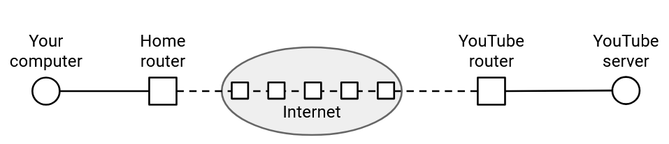

Thực tế, YouTube là cả một tòa nhà gồm các máy móc được kết nối với nhau, hoạt động cùng nhau để phục vụ video cho người dùng. Tất cả những cỗ máy này đều nằm trong cùng một *local network* (mạng cục bộ) và có thể giao tiếp với nhau để hoàn thành các yêu cầu (ví dụ: nếu video bạn yêu cầu được lưu trữ trên nhiều máy khác nhau).

Hãy nhớ lại rằng trong mô hình mạng-của-các-mạng của Internet, mỗi nhà khai thác đều có quyền tự do quản lý *local network* của mình theo cách họ muốn. Trong phần này, chúng ta sẽ tập trung vào các *local networks* dành riêng cho việc kết nối các *servers* bên trong một *Datacenter* (Trung tâm dữ liệu) (trái ngược với việc kết nối người dùng như máy tính cá nhân của bạn). Chúng ta sẽ nói về những thách thức riêng biệt của các *local networks* này, và các giải pháp chuyên biệt cho các vấn đề mạng (ví dụ: *congestion control* (kiểm soát tắc nghẽn) và *routing* (định tuyến)) được thiết kế đặc biệt để hoạt động tốt trong bối cảnh *Datacenter*.

Trong thực tế, một *Datacenter* được đặt tại một địa điểm vật lý, thường là trên các khu đất chuyên dụng. Ngoài cơ sở hạ tầng tính toán (ví dụ: *servers*), *Datacenters* còn cần cơ sở hạ tầng hỗ trợ như hệ thống làm mát và nguồn điện, mặc dù chúng ta sẽ chỉ tập trung vào *local network* kết nối các *servers*.

*Datacenters* phục vụ các ứng dụng (ví dụ: video YouTube, kết quả tìm kiếm Google, v.v.). Đây là cơ sở hạ tầng cho các *end hosts* mà bạn có thể muốn kết nối. Lưu ý rằng điều này khác với cơ sở hạ tầng Internet mà chúng ta đã thấy trước đây. Trước đó, chúng ta đã thấy *carrier hotels* (khách sạn viễn thông, nơi các mạng kết nối với nhau), những tòa nhà nơi rất nhiều mạng (thuộc sở hữu của các công ty khác nhau) kết nối với nhau bằng các *routers* (bộ định tuyến) hạng nặng. Đây là cơ sở hạ tầng cho các *routers* chuyển tiếp các gói tin của bạn đến nhiều đích khác nhau, nhưng các ứng dụng thường không được lưu trữ tại *carrier hotels*.

Một *Datacenter* thường thuộc sở hữu của một tổ chức duy nhất (ví dụ: Google, Amazon), và tổ chức đó có thể lưu trữ nhiều ứng dụng khác nhau (ví dụ: Gmail, YouTube, v.v.) trong một *Datacenter* duy nhất. Điều này có nghĩa là tổ chức đó có toàn quyền kiểm soát cơ sở hạ tầng mạng bên trong *local network* của *Datacenter*.

Trọng tâm của chúng ta là các *Datacenters* siêu quy mô hiện đại, được vận hành bởi các gã khổng lồ công nghệ như Google và Amazon. Quy mô lớn mang lại một số thách thức độc đáo, nhưng các khái niệm chúng ta sẽ tìm hiểu cũng hoạt động ở quy mô nhỏ hơn.

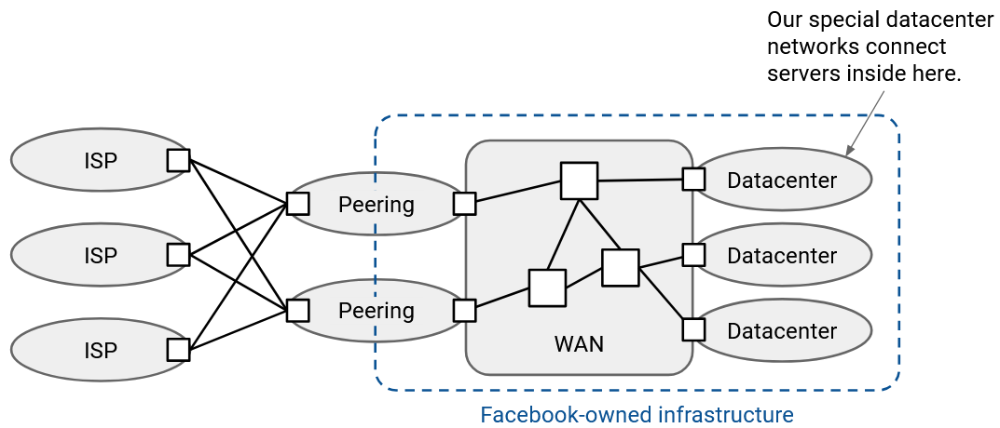

Bản đồ này cho thấy *wide area network (WAN)* (mạng diện rộng) của tất cả các mạng do một gã khổng lồ công nghệ như Google sở hữu.

Các *peering locations* (địa điểm ngang hàng) kết nối Google với phần còn lại của Internet. Chúng chủ yếu bao gồm các *routers* do Google vận hành kết nối với các *autonomous systems* (hệ thống tự trị) khác.

Ngoài các *peering locations*, Google cũng vận hành nhiều *Datacenters*. Các ứng dụng trong *Datacenters* có thể giao tiếp với phần còn lại của Internet thông qua các *peering locations*. Các *Datacenters* và *peering locations* đều được kết nối thông qua các *routers* và *links* (liên kết) do Google quản lý trong *WAN* của Google.

*Datacenters* và *peering locations* tối ưu hóa cho các mục tiêu hiệu suất khác nhau, vì vậy chúng thường được đặt ở những vị trí vật lý khác nhau.

*Peering locations* quan tâm đến việc ở gần các công ty và mạng lưới khác về mặt vật lý. Do đó, *carrier hotels* thường được đặt tại các thành phố để gần gũi hơn với khách hàng và các công ty khác.

Ngược lại, *Datacenters* ít quan tâm hơn đến việc ở gần các công ty khác, và thay vào đó ưu tiên các yêu cầu như không gian vật lý, điện năng và làm mát. Do đó, *Datacenters* thường được đặt ở những khu vực ít dân cư hơn, đôi khi gần một con sông (để làm mát) hoặc một trạm điện (*Datacenters* có thể cần lượng điện năng gấp hàng trăm lần so với *peering locations*).

## Tại sao Datacenter lại khác biệt?

Điều gì làm cho *local network* của một *Datacenter* khác biệt so với các mạng đa dụng (mạng diện rộng) trên phần còn lại của Internet?

Mạng *Datacenter* được điều hành bởi một tổ chức duy nhất, điều này cho phép chúng ta kiểm soát nhiều hơn đối với mạng và các *hosts* (máy chủ/thiết bị). Không giống như trên Internet đa dụng, chúng ta có thể chạy phần cứng hoặc phần mềm tùy chỉnh của riêng mình, và chúng ta có thể thực thi rằng mọi máy đều tuân theo cùng một giao thức tùy chỉnh.

*Datacenters* thường đồng nhất, nơi mọi *server* và *switch* (bộ chuyển mạch) đều được xây dựng và vận hành hoàn toàn giống nhau. Không giống như trên Internet đa dụng, chúng ta không phải xem xét một số *links* là không dây, và một số khác là có dây. Trên Internet đa dụng, một số máy tính có thể mới hơn những máy khác, nhưng trong một *Datacenter*, mọi máy tính thường thuộc cùng một thế hệ, và toàn bộ *Datacenter* được nâng cấp cùng một lúc.

Mạng *Datacenter* tồn tại ở một địa điểm vật lý duy nhất, vì vậy chúng ta không cần phải nghĩ về các *links* đường dài như cáp ngầm dưới biển. Trong một địa điểm duy nhất đó, chúng ta phải hỗ trợ *bandwidth* (băng thông) cực kỳ cao.

## Các Mẫu Lưu lượng trong Datacenter

Khi bạn gửi một yêu cầu đến một ứng dụng trong *Datacenter*, gói tin của bạn di chuyển qua các *routers* trên Internet đa dụng, cuối cùng đến được *router* do Google vận hành. *Router* đó chuyển tiếp gói tin của bạn đến một trong các *edge routers* (router biên) của *Datacenter*, sau đó *edge router* này sẽ chuyển tiếp gói tin của bạn đến một *server* riêng lẻ nào đó trong *Datacenter*.

Một *server* này có lẽ không có đủ tất cả thông tin để xử lý yêu cầu của bạn. Ví dụ, nếu bạn yêu cầu một bảng tin Facebook, các *servers* khác nhau có thể cần phải làm việc cùng nhau để kết hợp quảng cáo, hình ảnh, bài đăng, v.v. Sẽ không thực tế nếu mọi *server* đều phải biết mọi thứ về Facebook để tự mình xử lý yêu cầu của bạn.

Để các *servers* khác nhau có thể phối hợp, *server* đầu tiên sẽ kích hoạt nhiều yêu cầu backend để thu thập tất cả thông tin cần thiết cho yêu cầu của bạn. Một yêu cầu duy nhất của người dùng có thể kích hoạt hàng trăm yêu cầu backend (trung bình là 521, theo một bài báo của Facebook năm 2013) trước khi phản hồi có thể được gửi lại cho người dùng. Nhìn chung, lưu lượng backend giữa các *servers* lớn hơn đáng kể, và lưu lượng bên ngoài với người dùng rất nhỏ khi so sánh.

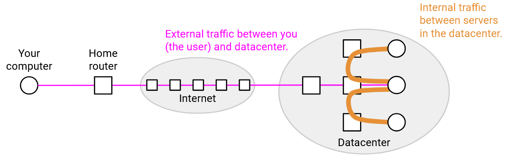

Hầu hết các ứng dụng hiện đại đều bị chi phối bởi lưu lượng nội bộ giữa các máy. Ví dụ, nếu bạn chạy một chương trình phân tán như mapreduce, các *servers* khác nhau cần phải giao tiếp với nhau để cùng giải quyết truy vấn lớn của bạn. Một số ứng dụng thậm chí có thể không có lưu lượng mạng hướng tới người dùng nào cả. Ví dụ, Google có thể chạy các bản sao lưu định kỳ, đòi hỏi các *servers* phải giao tiếp với nhau, nhưng không tạo ra kết quả nào có thể thấy được cho người dùng cuối.

Các kết nối đi ra ngoài mạng (ví dụ: đến người dùng cuối hoặc các *Datacenters* khác) được mô tả là *north-south traffic* (lưu lượng bắc-nam). Ngược lại, các kết nối giữa các máy bên trong mạng được mô tả là *east-west traffic* (lưu lượng đông-tây). *East-west traffic* lớn hơn *north-south traffic* vài bậc độ lớn, và khối lượng của *east-west traffic* đang tăng lên trong những năm gần đây (ví dụ: với sự phát triển của học máy).

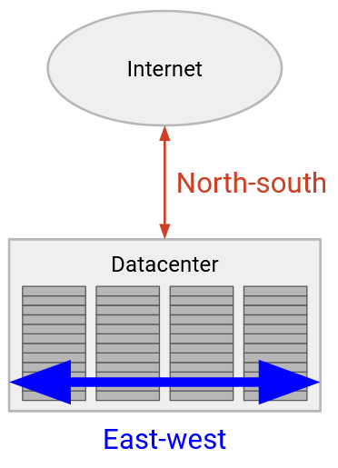

## Racks (Giá đỡ)

Về cơ bản, một *Datacenter* bao gồm rất nhiều *servers*. Các *servers* được tổ chức trong các *racks* (giá đỡ) vật lý, mỗi *rack* có 40-48 đơn vị rack (khe cắm), và mỗi đơn vị rack có thể chứa 1-2 *servers*.

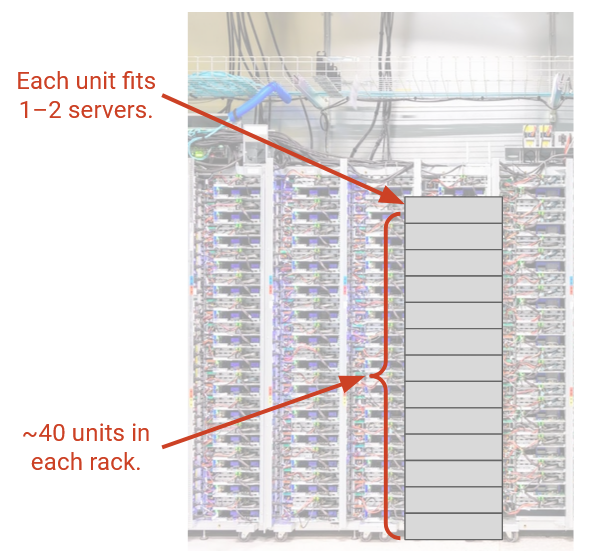

Chúng ta muốn tất cả các *servers* trong *Datacenter* có thể giao tiếp với nhau, vì vậy chúng ta cần xây dựng một mạng lưới để kết nối tất cả chúng lại. Mạng lưới này trông như thế nào? Làm thế nào để chúng ta lắp đặt các *links* và *switches* một cách hiệu quả để đáp ứng các yêu cầu của mình?

Đầu tiên, chúng ta có thể kết nối tất cả các *servers* trong cùng một *rack*. Mỗi *rack* có một *switch* duy nhất được gọi là *top-of-rack (TOR) switch* (switch đỉnh giá), và mọi *server* trong *rack* đều có một *link* (được gọi là *access link* (liên kết truy cập) hoặc *uplink* (đường lên)) kết nối đến *switch* đó. *TOR* là một *router* tương đối nhỏ, với một chip chuyển tiếp duy nhất, và các cổng vật lý kết nối với tất cả các *servers* trên *rack*. Mỗi *uplink* của *server* thường có dung lượng khoảng 100 Gbps.

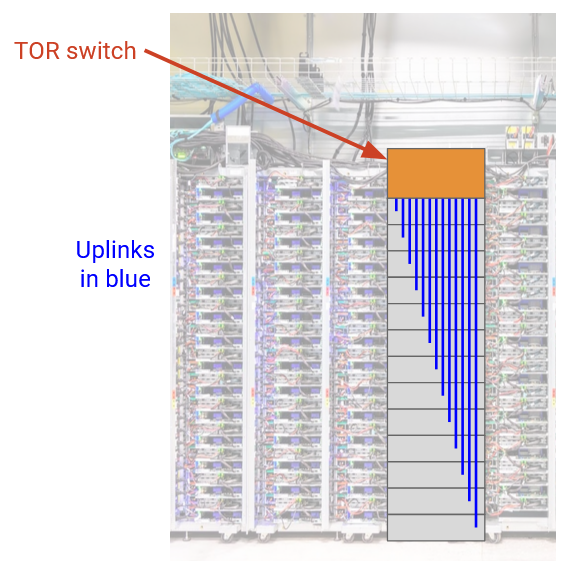

Tiếp theo, chúng ta phải suy nghĩ về cách kết nối các *racks* với nhau. Lý tưởng nhất, chúng ta muốn mọi *server* có thể nói chuyện với mọi *server* khác ở *line rate* (tốc độ tối đa của đường truyền) của chúng (tức là sử dụng toàn bộ *bandwidth* của *uplink*).

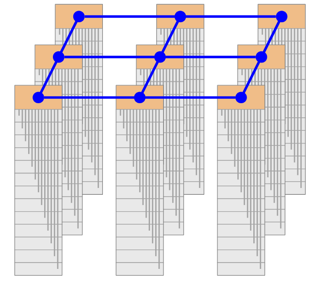

## Bisection Bandwidth (Băng thông chia đôi)

Trước khi nghĩ về cách kết nối các *racks*, hãy phát triển một thước đo về mức độ kết nối của một tập hợp các máy tính.

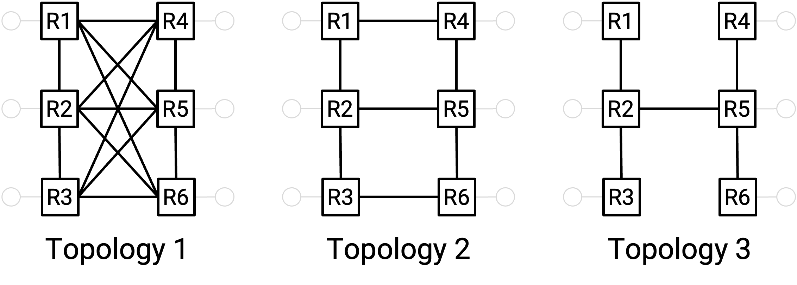

Một cách trực quan, mặc dù cả ba mạng đều được kết nối đầy đủ, mạng bên trái là kết nối tốt nhất, mạng ở giữa kém kết nối hơn, và mạng bên phải là kém kết nối nhất. Ví dụ, mạng bên trái và giữa có thể hỗ trợ các node 1-4 và 3-6 giao tiếp đồng thời ở *line rate*, trong khi mạng bên phải thì không.

Một cách để lập luận rằng mạng bên trái kết nối tốt hơn là nói: Chúng ta phải cắt nhiều *links* hơn để ngắt kết nối mạng. Điều này cho thấy có rất nhiều *links* dự phòng, cho phép chúng ta chạy nhiều kết nối *bandwidth* cao đồng thời. Tương tự, một cách để lập luận rằng mạng bên phải kém kết nối hơn là nói: Chúng ta chỉ cần cắt *link* 2-5 để ngắt kết nối mạng, điều này cho thấy sự tồn tại của một điểm nghẽn ngăn cản các kết nối *bandwidth* cao đồng thời.

*Bisection bandwidth* (băng thông chia đôi) là một cách để định lượng mức độ kết nối của một mạng. Để tính *bisection bandwidth*, chúng ta tính số lượng *links* cần loại bỏ để phân chia mạng thành hai nửa không kết nối có kích thước bằng nhau. *Bisection bandwidth* là tổng của *bandwidths* trên các *links* mà chúng ta đã cắt.

Trong cấu trúc ngoài cùng bên phải, chúng ta chỉ cần loại bỏ một *link* để phân chia mạng, vì vậy *bisection bandwidth* chỉ là *bandwidth* của *link* đó. Ngược lại, trong cấu trúc ngoài cùng bên trái, chúng ta cần loại bỏ 9 *links* để phân chia mạng, vì vậy *bisection bandwidth* là *bandwidth* kết hợp của tất cả 9 *links* đó.

Một cách định nghĩa tương đương của *bisection bandwidth* là: Chúng ta chia mạng thành hai nửa, và mỗi nút ở một nửa muốn đồng thời gửi dữ liệu đến một nút tương ứng ở nửa còn lại. Trong tất cả các cách phân chia các nút có thể, *bandwidth* tối thiểu mà các nút có thể gửi đi chung là bao nhiêu? Việc xem xét trường hợp xấu nhất (*bandwidth* tối thiểu) buộc chúng ta phải nghĩ về các điểm nghẽn.

Mạng được kết nối tốt nhất có *bisection bandwidth* đầy đủ. Điều này có nghĩa là không có điểm nghẽn, và dù bạn phân chia các nút vào các phân vùng như thế nào, tất cả các nút trong một phân vùng đều có thể giao tiếp đồng thời với tất cả các nút trong phân vùng kia ở tốc độ tối đa. Nếu có N nút, và tất cả N/2 nút trong phân vùng bên trái đang gửi dữ liệu ở tốc độ tối đa R, thì *bisection bandwidth* đầy đủ là N/2 nhân R.

*Oversubscription* (tỷ lệ quá tải băng thông) là một thước đo về mức độ chúng ta còn cách xa *bisection bandwidth* đầy đủ, hoặc tương đương, mức độ quá tải của phần nghẽn của mạng. Đó là tỷ lệ của *bisection bandwidth* so với *bisection bandwidth* đầy đủ (*bandwidth* nếu tất cả các *hosts* đều gửi ở tốc độ tối đa).

Trong ví dụ ngoài cùng bên phải, giả sử tất cả các *links* là 1 Gbps, thì *bisection bandwidth* là 2 Gbps (để tách bốn *hosts* bên trái với bốn *hosts* bên phải). *Bisection bandwidth* đầy đủ, đạt được khi tất cả bốn *hosts* bên trái đồng thời gửi dữ liệu, là 4 Gbps. Do đó, tỷ lệ 2/4 cho chúng ta biết rằng các *hosts* chỉ có thể gửi ở 50% tốc độ tối đa của chúng. Nói cách khác, mạng của chúng ta bị *oversubscribed* gấp 2 lần, bởi vì nếu tất cả các *hosts* đều gửi ở tốc độ tối đa, các *links* nghẽn sẽ bị quá tải gấp 2 lần (4 Gbps trên các *links* 2 Gbps).

## Datacenter Topology (Cấu trúc liên kết mạng của Trung tâm dữ liệu)

Bây giờ chúng ta đã định nghĩa *bisection bandwidth*, một thước đo về khả năng kết nối phụ thuộc vào *topology* (cấu trúc liên kết mạng, hay topo mạng) của mạng. Trong một *Datacenter*, chúng ta có thể chọn *topology* của mình (ví dụ: chọn nơi lắp đặt cáp). Chúng ta nên xây dựng *topology* nào để tối đa hóa *bisection bandwidth*?

Một cách tiếp cận có thể là kết nối mọi *rack* với một *cross-bar switch* (switch chuyển mạch chéo) khổng lồ. Tất cả các *racks* ở phía bên trái có thể đồng thời gửi dữ liệu ở tốc độ tối đa vào *switch*, *switch* này sẽ chuyển tiếp tất cả dữ liệu đó đến phía bên phải ở tốc độ tối đa. Điều này sẽ cho phép chúng ta đạt được *bisection bandwidth* đầy đủ.

Một số vấn đề với cách tiếp cận này là gì? *Switch* sẽ cần một cổng vật lý cho mỗi *rack* (có thể lên đến 2500 cổng). Chúng ta đôi khi gọi số lượng cổng bên ngoài là *radix* (số lượng cổng) của *switch*, vì vậy *switch* này sẽ cần một *radix* lớn. Ngoài ra, *switch* này sẽ cần có dung lượng cực lớn (có thể là petabit mỗi giây) để hỗ trợ tất cả các *racks*. Không có gì ngạc nhiên khi *switch* này không thực tế để xây dựng (ngay cả khi chúng ta có thể, nó sẽ cực kỳ đắt đỏ).

Thông tin thú vị: Vào những năm 2000, Google đã thử yêu cầu các nhà cung cấp *switch* xây dựng một *switch* 10.000 cổng. Các nhà cung cấp đã từ chối, nói rằng không thể xây dựng thứ này, và ngay cả khi có thể, không ai yêu cầu nó ngoại trừ bạn (vì vậy không có lợi nhuận để xây dựng nó).

Một vấn đề khác là *switch* này là một điểm lỗi duy nhất, và toàn bộ mạng *Datacenter* sẽ ngừng hoạt động nếu *switch* này bị hỏng.

Một cách tiếp cận khác có thể là sắp xếp các *switches* theo *tree topology* (topo mạng hình cây). Điều này có thể giúp chúng ta giảm *radix* và *bandwidth* của mỗi *link*.

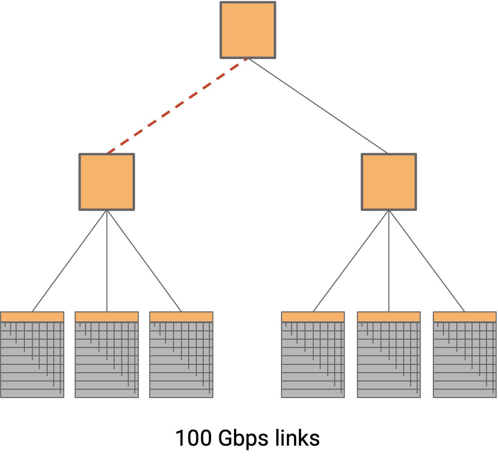

Một số vấn đề với cách tiếp cận này là gì? *Bisection bandwidth* thấp hơn. Một *link* duy nhất là điểm nghẽn giữa hai nửa của cây.

Để tăng *bisection bandwidth*, chúng ta có thể lắp đặt các *links* có *bandwidth* cao hơn ở các lớp cao hơn.

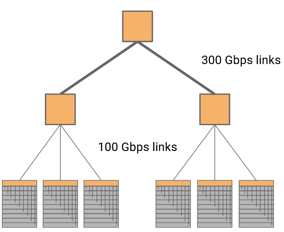

Trong trường hợp này, nếu bốn *links* dưới là 100 Gbps, và hai *links* trên là 300 Gbps, thì chúng ta đã loại bỏ được điểm nghẽn và khôi phục *bisection bandwidth* đầy đủ.

*Topology* này có thể được sử dụng, mặc dù chúng ta vẫn chưa giải quyết được vấn đề *switch* ở đỉnh rất đắt và khả năng mở rộng kém.

## Clos Networks (Mạng Clos)

Cho đến nay, chúng ta đã thử xây dựng các mạng sử dụng các *switches* được chế tạo tùy chỉnh, có thể với *bandwidth* hoặc *radix* rất cao. Những *switches* này vẫn rất tốn kém để xây dựng. Liệu chúng ta có thể thiết kế một *topology* cho *bisection bandwidth* cao, sử dụng các thành phần hàng hóa giá rẻ không? Cụ thể, chúng ta muốn sử dụng một số lượng lớn các *switches* thương mại giá rẻ, trong đó tất cả các *switches* đều có cùng số cổng, mỗi *switch* có số lượng cổng thấp, và tất cả tốc độ *link* đều như nhau.

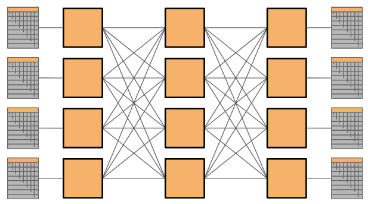

Một *Clos network* (mạng Clos) đạt được *bandwidth* cao với các bộ phận thương mại bằng cách tạo ra một số lượng lớn các đường đi giữa các nút trong mạng. Bởi vì có rất nhiều *links* và đường đi qua mạng, chúng ta có thể đạt được *bisection bandwidth* cao bằng cách cho mỗi nút gửi dữ liệu theo một đường đi khác nhau.

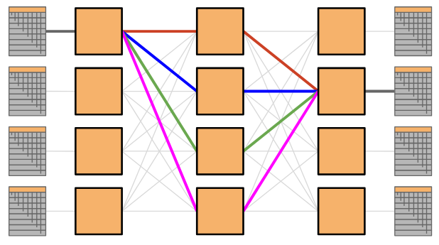

Không giống như các *switches* được chế tạo tùy chỉnh, nơi chúng ta mở rộng quy mô mạng bằng cách xây dựng một *switch* lớn hơn, chúng ta có thể mở rộng quy mô *Clos networks* bằng cách chỉ cần thêm nhiều *switches* giống nhau. Giải pháp này hiệu quả về chi phí và có khả năng mở rộng\!

*Clos networks* cũng đã được sử dụng trong các ứng dụng khác, và được đặt theo tên của nhà phát minh ra chúng (Charles Clos, 1952).

Trong một *Clos network* cổ điển, chúng ta sẽ có tất cả các *racks* ở bên trái gửi dữ liệu đến các *racks* ở bên phải. Trong *Datacenters*, các *racks* có thể vừa gửi vừa nhận dữ liệu, vì vậy thay vì có một lớp người gửi và người nhận riêng biệt, chúng ta có thể có một lớp duy nhất với tất cả các *racks* (đóng vai trò là người gửi hoặc người nhận). Sau đó, dữ liệu di chuyển theo một trong nhiều đường đi sâu hơn vào mạng, và sau đó quay trở ra để đến người nhận. Kết quả này được gọi là *folded Clos network* (mạng Clos gập), bởi vì chúng ta đã "gập" các lớp người gửi và người nhận lại thành một.

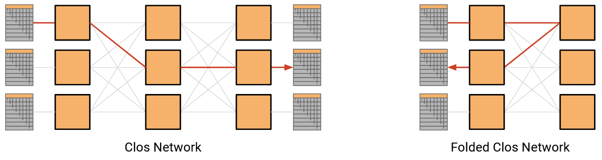

## Fat-Tree Clos Topology (Topo Clos Cây Béo)

*Fat-tree topology* (topo cây béo) có *radix* thấp trên mỗi *switch*, và đạt được *bisection bandwidth* đầy đủ. Tuy nhiên, *switch* ở đỉnh cây rất đắt, khả năng mở rộng kém, và vẫn là một điểm lỗi duy nhất.

*Clos topology* cho phép chúng ta sử dụng các *switches* thương mại để mở rộng quy mô mạng của mình. Nếu chúng ta kết hợp *Clos topology* với *fat-tree topology*, chúng ta có thể xây dựng một *topology* có khả năng mở rộng từ các *switches* thương mại\!

*Topology* được trình bày ở đây đã được giới thiệu trong một bài báo SIGCOMM năm 2008 có tựa đề "A Scalable, Commodity Data Center Network Architecture" (Mohammad Al-Fares, Alexander Loukissas, Amin Vahdat).

Trong một *k-ary fat tree* (cây béo k-nhánh), chúng ta tạo ra k *pods* (cụm). Mỗi *pod* có k *switches*.

Trong một *pod*, k/2 *switches* nằm ở *aggregation layer* (lớp tổng hợp) trên, và k/2 *switches* còn lại nằm ở *edge layer* (lớp biên) dưới.

(Lưu ý: *Topology* này được định nghĩa cho k là số chẵn, để chúng ta có thể chia đều các *switches* giữa *aggregation layer* và *edge layer*).

Mỗi *switch* trong *pod* có k *links*. Một nửa số *links* (k/2) kết nối lên trên, và nửa còn lại (k/2) kết nối xuống dưới.

Hãy xem xét một *switch* trong *aggregation layer* trên. Một nửa (k/2) số *links* của nó kết nối lên *core layer* (lớp lõi) (lớp này kết nối các *pods*, sẽ được thảo luận thêm bên dưới). Nửa còn lại (k/2) số *links* của nó kết nối xuống k/2 *switches* trong *edge layer*.

Tương tự, hãy xem xét một *switch* trong *edge layer* dưới. Một nửa (k/2) số *links* của nó kết nối lên k/2 *switches* trong *aggregation layer*. Nửa còn lại (k/2) số *links* của nó kết nối xuống k/2 *hosts* trong *pod* này.

Tiếp theo, hãy xem *core layer*, lớp kết nối các *pods* lại với nhau. Mỗi *core switch* có k *links*, kết nối đến mỗi trong số k *pods*.

Có $$(k/2)^2$$*core switches*. Chúng ta đã suy ra con số này như thế nào? Có k *pods*, và mỗi *pod* có k/2 *switches* trong *aggregation layer* trên, tổng cộng là$$k^2/2$$*switches* trong *aggregation layer*. Mỗi *switch* ở lớp *aggregation* có k/2 *links* hướng lên trên, tổng cộng là$$k^2/2 \times k/2 = k^3/4$$*links* hướng lên trên. Điều này có nghĩa là *core layer* sẽ cần có tổng cộng$$k^3/4$$ *links* hướng xuống dưới, để khớp với số lượng *links* hướng lên từ *aggregation layer*.

Mỗi *switch* ở *core layer* có k *links* hướng xuống dưới, vì vậy chúng ta cần $$k^2/4$$*switches* ở *core layer* (mỗi *switch* có k *links*) để tạo ra$$k^3/4$$ *links* hướng về phía dưới. Điều này cho phép số lượng *links* lên từ *aggregation layer* khớp với số lượng *links* xuống từ *core layer*.

Chúng ta cũng có thể tính toán rằng có $$(k/2)^2$$*hosts* trên mỗi *pod* trong *topology* này. Chúng ta đã suy ra con số này như thế nào? Có k/2 *switches* ở *edge layer* của mỗi *pod*. Mỗi *switch* ở *edge layer* có k/2 *links* hướng xuống *hosts*, tổng cộng là$$k/2 \times k/2 = (k/2)^2$$*hosts* trên mỗi *pod*. Lưu ý rằng mỗi *host* chỉ được kết nối với một *switch* ở *edge layer* (một *host* không được kết nối với nhiều *switches* trong *topology* này). Vì có tổng cộng k *pods*, chúng ta cũng có thể suy ra rằng có tổng cộng$$(k/2)^2 \times k$$ *hosts* trong *topology* này.

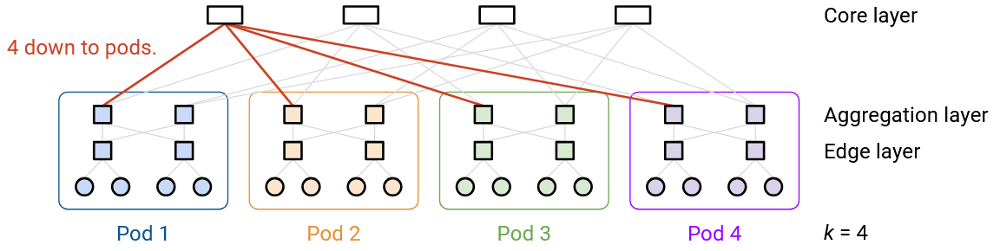

k = 4, ví dụ nhỏ nhất, thật không may lại hơi khó hiểu vì một số con số tình cờ giống nhau (ví dụ: $$(k/2)^2 = k = 4$$). Để có một ví dụ rõ ràng hơn, chúng ta có thể xem xét k = 6.

Mỗi *pod* có k = 6 *switches*. k/2 = 3 *switches* nằm ở *aggregation layer* trên, và k/2 = 3 *switches* nằm ở *edge layer* dưới.

Một *switch* ở *edge layer* có k/2 = 3 *links* hướng xuống 3 *hosts*, và k/2 = 3 *links* hướng lên 3 *switches* *aggregation* trong cùng một *pod*.

Một *switch* ở *aggregation layer* có k/2 = 3 *links* hướng lên *core layer* (cụ thể là đến 3 *switches* khác nhau ở *core layer*), và k/2 = 3 *links* hướng xuống 3 *switches* *edge layer* trong cùng một *pod*.

Mỗi *pod* có k/2 = 3 *edge switches*, mỗi *switch* kết nối với k/2 = 3 *hosts*, vì vậy mỗi *pod* có tổng cộng $$(k/2)^2 = 9$$*hosts*. *Topology* có tổng cộng k *pods*, cho tổng số$$k \times (k/2)^2 = 54$$ *hosts*.

Tại *core layer*, chúng ta có $$(k/2)^2 = 9$$ *core switches*. Mỗi *switch* có k = 6 *links*, kết nối xuống mỗi trong số k = 6 *pods*.

Tổng cộng, *core layer* có $$(k/2)^2 \times k$$*links* hướng xuống (số lượng *core switches*, nhân với số lượng *links* trên mỗi *switch*). *Aggregation layer* có$$k \times (k/2) \times (k/2)$$ *links* hướng lên (số lượng *pods*, nhân với số lượng *aggregation switches* trên mỗi *pod*, nhân với số lượng *links* hướng lên trên mỗi *aggregation switch*). Hai biểu thức này khớp nhau (và cho kết quả là 54 với k = 6), cho phép *core layer* được kết nối đầy đủ với *aggregation layer*.

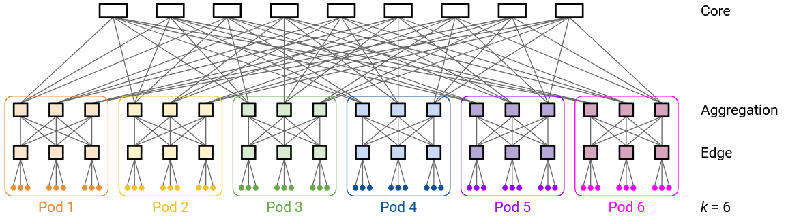

*Topology* này đạt được *bisection bandwidth* đầy đủ. Nếu bạn chia các *pods* thành hai nửa (ví dụ: nửa bên trái và nửa bên phải), thì mọi *host* ở nửa bên trái đều có một đường đi riêng đến một *host* tương ứng ở nửa bên phải. Điều này cho phép tất cả các *hosts* ghép cặp (một ở nửa bên trái, một ở nửa bên phải), và cho mỗi cặp giao tiếp dọc theo một đường đi riêng, không có điểm nghẽn.

Ngoài ra, hãy để ý rằng *topology* này có thể được xây dựng từ các *switches* thương mại. Mọi *switch* đều có *radix* là k *links*, bất kể *switch* đó ở lớp nào. Ngoài ra, mọi *link* đều có thể có cùng *bandwidth* (ví dụ: 1 Gbps), và khả năng mở rộng đến từ việc chúng ta đã tạo ra một đường đi riêng giữa bất kỳ cặp *hosts* nào.

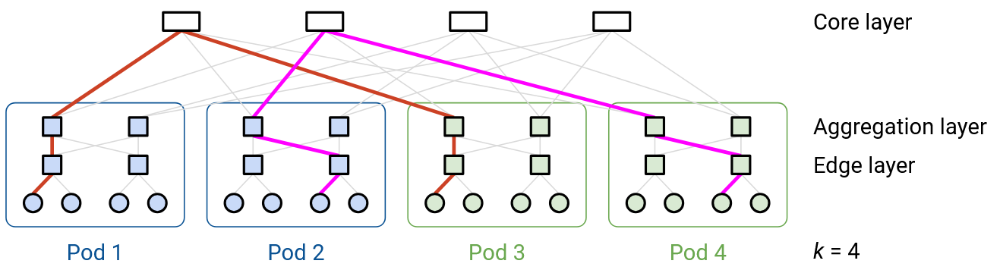

Một cách khác để thấy *bisection bandwidth* đầy đủ là xóa các *links* cho đến khi mạng được phân chia thành hai nửa (các *pods* ở nửa bên trái, và các *pods* ở nửa bên phải).

Mỗi *switch* ở *core layer* có k *links*, một *link* đến mỗi *pod*. Điều này cũng có nghĩa là mỗi *switch* ở *core layer* có k/2 *links* đến phía bên trái, và k/2 *links* đến phía bên phải.

Để cô lập hoàn toàn một bên (ví dụ: cô lập hoàn toàn phía bên trái), thì đối với mỗi *core switch*, chúng ta sẽ phải cắt k/2 *links* đến phía bên trái. Có $$(k/2)^2$$*core switches*, và chúng ta phải cắt k/2 *links* trên mỗi *switch*, tổng cộng là$$(k/2)^3$$*links* bị cắt. Điều này có nghĩa là *bisection bandwidth* của chúng ta là$$(k/2)^3$$ *links* (giả sử mọi *link* đều có *bandwidth* giống hệt nhau).

Có $$(k/2)^2$$*hosts* trên mỗi *pod*, và k/2 *pods* ở phía bên trái, tổng cộng là$$(k/2)^3$$*hosts* ở phía bên trái. Tương tự, có$$(k/2)^3$$*hosts* ở phía bên phải. Nếu mọi *host* ở phía bên trái muốn giao tiếp với mọi *host* ở phía bên phải, thì sẽ cần đến *bandwidth* tương đương với$$(k/2)^3$$ *links*. *Bisection bandwidth* của chúng ta khớp với con số này, có nghĩa là *bisection bandwidth* đầy đủ đã đạt được.

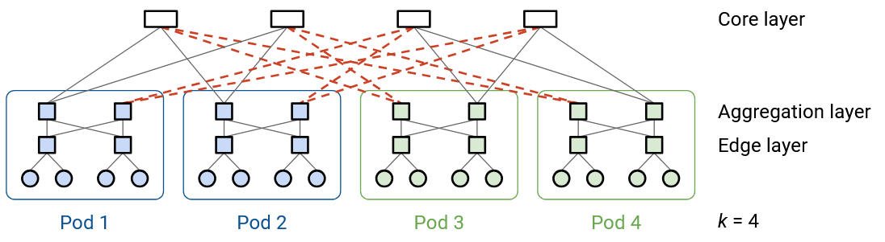

*Clos fat-tree topology* này liên quan như thế nào đến ý tưởng về *racks* và *top-of-rack switches* từ trước đó?

Đối với các giá trị k đẹp cụ thể, chúng ta có thể sắp xếp các *hosts* và *switches* bên trong một *pod* vào các *racks* riêng biệt, và kết nối các *racks* với nhau.

Ví dụ, hãy xem xét k = 48, giá trị ví dụ được sử dụng trong bài báo gốc. Điều này có nghĩa là bên trong một *pod*, có k/2 = 24 *aggregation layer switches*, k/2 = 24 *edge layer switches*, và $$(k/2)^2$$ = 576 *hosts* trên mỗi *pod*.

Chúng ta có thể sắp xếp các *switches* và *hosts* sao cho tất cả 48 *switches* nằm trong một *rack* mà chúng ta đặt ở giữa. Sau đó, chúng ta có thể bao quanh *rack* *switches* đó bằng 12 *racks*, mỗi *rack* chứa 48 *hosts*. Điều này giúp chúng ta xếp tất cả các *switches* và *hosts* vào các *racks* có kích thước giống hệt nhau (48 máy trên mỗi *rack*). Đặt các *switches* vào *rack* ở giữa cũng giúp giảm lượng dây cáp vật lý cần thiết để xây dựng *topology* này.

*Rack* ở giữa có k = 48 *switches*. Mỗi *switch* có k = 48 *ports* (cổng), tổng cộng là $$48^2 = 2304$$ *ports* trong *rack* này.

Trong số $$k^2 = 2304$$*ports* này, một nửa trong số chúng ($$k^2/2 = 1152$$) kết nối các *switches* bên trong *rack* với nhau. Chúng ta đã suy ra$$k^2/2$$như thế nào? Có thể sẽ hữu ích khi xem một số sơ đồ khái niệm từ trước. Mỗi trong số k/2 *aggregation layer switches* có k/2 *links* hướng xuống, tổng cộng là$$(k/2)^2$$*ports* được sử dụng. Tương tự, mỗi trong số k/2 *edge layer switches* có k/2 *links* hướng lên, tổng cộng là$$(k/2)^2$$*ports* được sử dụng. Điều này cho tổng cộng$$2 \times (k/2)^2 = k^2/2$$ *ports* được sử dụng.

Lưu ý rằng các *links* giữa các *switches* *aggregation* và *edge* đang kết nối các *switches* trong cùng một *rack*. Do đó, cần hai *ports* cho mỗi *link* (một từ *aggregation switch*, và một từ *edge switch*), và đó là lý do tại sao chúng ta nhân đôi giá trị $$(k/2)^2$$ (hoặc tương đương, tính giá trị đó hai lần ở cả lớp *aggregation* và *edge*).

Trong số $$k^2 = 2304$$*ports*, một phần tư khác trong số chúng ($$k^2/4 = 576$$) kết nối các *switches* với các *hosts* bên trong cùng một *pod*. Chúng ta đã suy ra con số này như thế nào? Hãy nhớ rằng có$$(k/2)^2$$*hosts* trong một *pod*, và mỗi *host* được kết nối với đúng một *switch*. Do đó, chúng ta cần$$(k/2)^2 = k^2/4$$ *ports* trên các *switches* để kết nối với các *hosts*.

Cuối cùng, trong số $$k^2 = 2304$$*ports*, một phần tư còn lại ($$k^2/4 = 576$$) kết nối *pod* với *core layer*. Chúng ta đã suy ra con số này như thế nào? Hãy nhớ rằng có$$(k/2)^2$$*core switches*, và mỗi *core switch* có một *link* đến mỗi *pod*. Nói cách khác, một *pod* có một *link* duy nhất đến mỗi trong số$$(k/2)^2$$*core switches*. Do đó, chúng ta cần$$(k/2)^2 = k^2/4$$ *ports* trên các *switches* để kết nối với các *core switches*.

Tóm lại: Trong tổng số $$k^2$$ *ports*, một nửa trong số chúng được sử dụng để kết nối các *switches* *aggregation*/*edge* trong cùng một lớp (các kết nối hoàn toàn diễn ra bên trong *rack* ở giữa). Một phần tư khác được sử dụng để kết nối các *edge switches* với các *hosts* trong *pod* (kết nối giữa *rack* ở giữa và 12 *racks* xung quanh chứa *hosts*). Phần tư cuối cùng được sử dụng để kết nối các *aggregation switches* với *core layer* (kết nối giữa *rack* ở giữa và các *racks* *core-layer* khác).

## Real-World Topologies (Các Topo trong thế giới thực)

Trong ví dụ này (2008), có nhiều đường đi khác nhau giữa bất kỳ hai *end hosts* nào.

Trong bài báo này (2015), nhiều *topologies* khác nhau đã được khám phá.

Nhiều biến thể cụ thể tồn tại (2009, 2015), nhưng tất cả chúng đều có chung mục tiêu là đạt được *bandwidth* cao giữa bất kỳ hai *servers* nào.