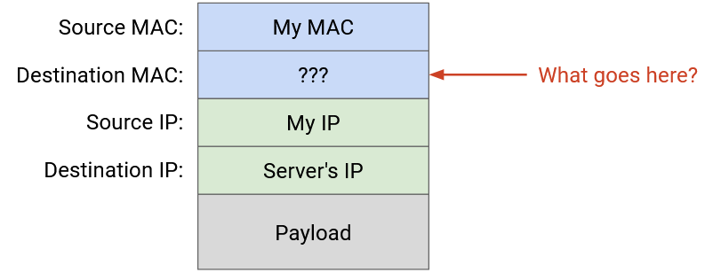
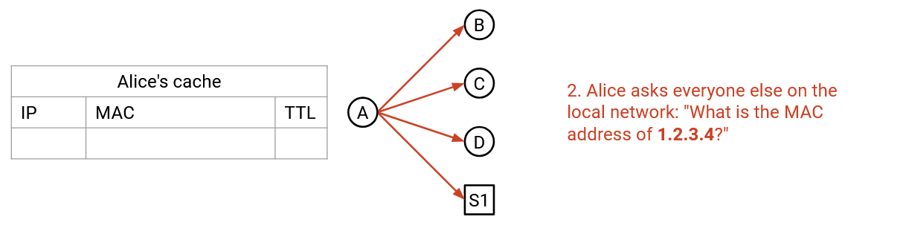
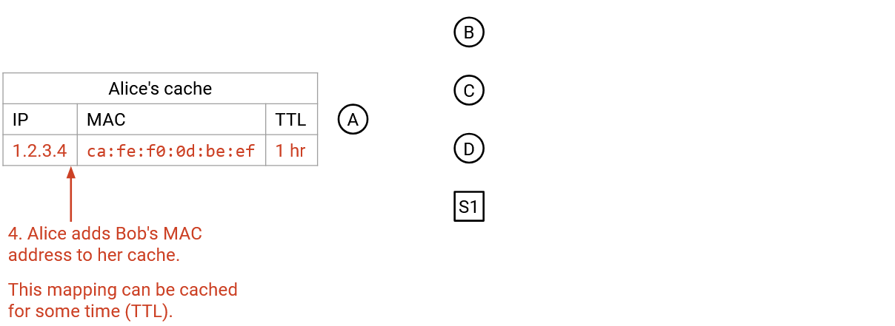
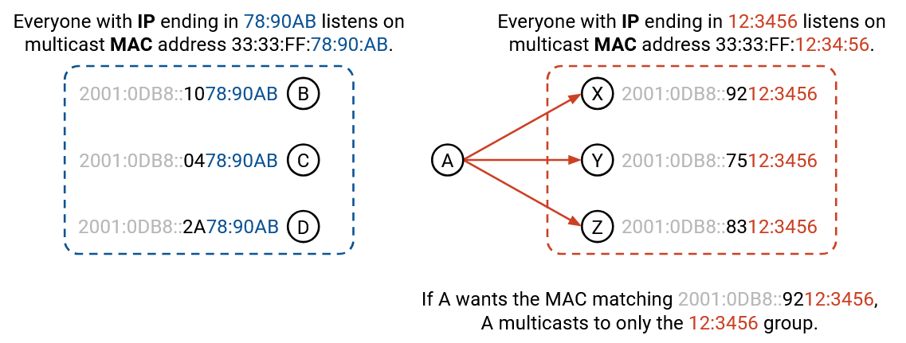

Chắc chắn rồi. Tôi sẽ tiếp tục dịch phần tiếp theo của giáo trình bạn đã cung cấp, tuân thủ nghiêm ngặt các quy tắc đã được thiết lập. Dưới đây là bản dịch cho tệp *arp.md*.

-----

# ARP: Kết nối Lớp 2 và Lớp 3

## Kết nối Lớp 2 và Lớp 3

Hãy nhớ lại rằng các *packets* (gói tin) được bọc thêm các *headers* (phần đầu) khi chúng di chuyển xuống chồng giao thức, đến các lớp thấp hơn. Để gửi một *IP packet* (gói tin IP), trước tiên chúng ta điền địa chỉ IP đích của nó ở *Layer 3* (Lớp 3). Sau đó, chúng ta chuyển *packet* đó xuống *Layer 2* (Lớp 2), nơi chúng ta phải thêm một *MAC address* (địa chỉ MAC) để gửi *packet* đi dọc theo *link*. Chúng ta sẽ thêm *MAC address* nào?

Đầu tiên, chúng ta cần kiểm tra xem IP đích có phải là một ai đó trong *local network* của chúng ta, hay là một ai đó trong một *local network* khác. Để xác định điều này, *forwarding table* (bảng chuyển tiếp) của người gửi sẽ có một mục nhập chỉ ra dải địa chỉ IP cục bộ, đôi khi được gọi là *subnet* (mạng con) của chúng ta. Ví dụ, mục nhập có thể nói rằng 192.0.2.0/24 là *direct* (trực tiếp), có nghĩa là tất cả các địa chỉ từ 192.0.2.0 đến 192.0.2.255 đều nằm trên cùng một *local network*. Bảng này cũng có một *default route* (tuyến mặc định), cho biết rằng tất cả các đích khác không thuộc mạng cục bộ sẽ được chuyển tiếp đến *router*.

Nếu IP đích nằm trong *subnet* của chúng ta, chúng ta cần một cách nào đó để dịch giữa địa chỉ IP đích và *MAC address* tương ứng của máy đó. Nếu đích nằm ngoài *subnet* của chúng ta, chúng ta cần một cách nào đó để dịch địa chỉ IP của *router* (từ *forwarding table*) sang *MAC address* tương ứng của nó, để chúng ta có thể gửi *packet* đến *router*.

Một giải pháp ngây thơ là *broadcast* (quảng bá) mọi *packet*, để đích hoặc *router* chắc chắn sẽ nhận và xử lý nó. Tuy nhiên, điều này không hiệu quả. Nó buộc mọi người phải phân tích cú pháp mọi *packet* (ví dụ: đọc các *headers* *Layer 3*) để kiểm tra xem *packet* có dành cho họ hay không. Ngoài ra, nếu mạng *Layer 2* có nhiều hơn một *link*, các *switches* ở *Layer 2* phải *flood* (tràn ngập) *packet* trên tất cả các *links*.

Một cách tiếp cận tốt hơn là dịch địa chỉ IP đích sang *MAC address* tương ứng của nó (nếu là cục bộ) hoặc *MAC address* của *router* (nếu không phải cục bộ), và *unicast* (truyền đơn hướng) *packet* ở *Layer 2*.

## ARP: Address Resolution Protocol

**ARP (Address Resolution Protocol - Giao thức phân giải địa chỉ)** cho phép các máy dịch một địa chỉ IP thành *MAC address* tương ứng của nó.

Để yêu cầu một bản dịch, một máy có thể *broadcast* một thông điệp yêu cầu: "Tôi có *MAC address* *f8:ff:c2:2b:36:16*. *MAC address* của máy có IP 192.0.2.1 là gì?"

Tất cả các máy không có địa chỉ IP này sẽ bỏ qua thông điệp. Người dùng có địa chỉ IP này sẽ *unicast* một phản hồi đến *MAC address* của người gửi, nói rằng "Tôi là 192.0.2.1, và *MAC address* của tôi là *a2:ff:28:02:f2:10*."

Các máy cũng có thể *broadcast* ánh xạ IP-tới-MAC của chính chúng cho mọi người, ngay cả khi không ai hỏi.

Khi bạn nhận được một ánh xạ IP-tới-MAC, bạn có thể thêm nó vào *ARP Table* (Bảng ARP) cục bộ của mình, bảng này lưu trữ các ánh xạ này để sử dụng trong tương lai. Bảng này cũng bao gồm ngày hết hạn cho mỗi mục nhập, vì địa chỉ IP không được gán vĩnh viễn cho một máy tính. Một máy tính khác có thể được gán cùng một địa chỉ IP, hoặc cùng một máy tính có thể thay đổi địa chỉ IP. (TODO: interfaces?)

Bước 1:

Bước 2:

Bước 3:

Bước 4:

Lưu ý rằng *ARP* chạy trực tiếp trên *Layer 2*, vì vậy tất cả các *packets* được gửi và nhận qua *Ethernet*, không phải *IP*.

## Kết nối Bảng ARP và Bảng Chuyển tiếp

Hãy nhớ lại rằng trong *forwarding table* của một *router*, đôi khi chúng ta sẽ bao gồm một mục nhập chỉ ra rằng một *host* được kết nối trực tiếp với *router*.

Trong thực tế, *forwarding table* của *router* chứa một mục nhập duy nhất, ánh xạ toàn bộ dải địa chỉ IP của *subnet* là *direct*. Nếu *router* nhận được một *packet* có đích nằm trong dải cục bộ này, *router* sẽ chạy *ARP* để tìm *MAC address* tương ứng, và sử dụng *Layer 2* để gửi *packet* đến đúng *host* trên *link*.

Điều này cũng giúp chúng ta trong trường hợp nhiều *hosts* được kết nối trên cùng một *link*. Trong hình ảnh khái niệm của chúng ta, chúng ta sẽ nói rằng *Host* A được kết nối trực tiếp trên Cổng 1. Nhiều *hosts* có thể nằm trên *link* đó, vì vậy bằng cách sử dụng *ARP*, chúng ta có thể tạo ra một *packet* *Layer 2* được *unicast* chỉ đến *Host* A, chứ không phải các máy tính khác trên *link*.

Với một mục nhập chuyển tiếp ánh xạ một *subnet* như 192.0.2.0/24 là *direct*, làm thế nào chúng ta có thể xác định xem một địa chỉ IP đã cho có nằm trong dải đó hay không? Đây là lúc việc viết các dải địa chỉ bằng *netmask* (mặt nạ mạng) thay vì *slash notation* (ký hiệu gạch chéo) trở nên hữu ích. Hãy nhớ lại rằng để viết dải này dưới dạng *netmask*, chúng ta đặt tất cả các bit cố định thành 1 và tất cả các bit không cố định thành 0, để có được 255.255.255.0. Sau đó, dải được biểu thị là 192.0.2.0 với *netmask* 255.255.255.0.

Bây giờ, để kiểm tra xem một địa chỉ có nằm trong dải hay không, chúng ta thực hiện phép toán AND bit của địa chỉ và *netmask*. Điều này làm cho tất cả các bit thấp không cố định bị đưa về 0, chỉ giữ lại các bit cao cố định. Sau đó, chúng ta kiểm tra xem kết quả có khớp với 192.0.2.0 (địa chỉ đầu tiên trong dải, nơi tất cả các bit không cố định là 0) hay không.

Lưu ý rằng khi các *packets* được chuyển tiếp qua các *hops* (chặng), đích *Layer 2* sẽ thay đổi thành *MAC address* của *hop* tiếp theo, để các *packets* có thể di chuyển qua các *links*. Tuy nhiên, đích *Layer 3* vẫn giữ nguyên qua mỗi *hop*.

## Neighbor Discovery trong IPv6

*ARP* dịch địa chỉ IPv4 sang *MAC addresses*. Để dịch địa chỉ IPv6 sang *MAC addresses*, chúng ta sử dụng một giao thức tương tự gọi là **neighbor discovery** (khám phá lân cận).

Thay vì *broadcast* yêu cầu dịch IP-tới-MAC, *neighbor discovery* thay vào đó *multicasts* (truyền đa hướng) yêu cầu đến một nhóm cụ thể, và mỗi máy tính lắng nghe trên một nhóm cụ thể dựa trên địa chỉ IP của nó. Ví dụ, tất cả mọi người có địa chỉ IP kết thúc bằng 12:3456 có thể lắng nghe trên nhóm *MAC address* 33:33:FF:12:34:56, trong khi tất cả mọi người có địa chỉ IP kết thúc bằng 78:90AB có thể lắng nghe trên nhóm *MAC address* 33:33:FF:78:90:AB.

Nếu tôi muốn *MAC address* tương ứng với người dùng có địa chỉ IPv6 kết thúc bằng 12:3456, tôi có thể cắm các bit IPv6 đó vào *MAC address* nhóm để có được 33:33:FF:12:34:56, và tôi biết rằng người dùng có địa chỉ IP đó phải đang lắng nghe *MAC address* nhóm này.

Một số thuật ngữ: Trong giao thức *neighbor discovery*, yêu cầu ánh xạ được gọi là *Neighbor Solicitation* (Yêu cầu thông tin lân cận), và phản hồi chứa ánh xạ được gọi là *Neighbor Advertisement* (Quảng cáo thông tin lân cận).