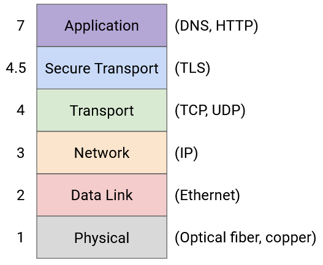
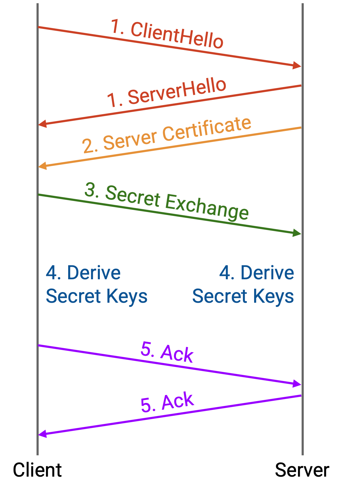

# TLS: Luồng byte an toàn (*Secure Bytestreams*)

## Luồng byte an toàn (*Secure Bytestreams*)

*TCP* (*Transmission Control Protocol* – Giao thức điều khiển truyền) tự thân nó không an toàn trước các kẻ tấn công trên mạng. Một ai đó trong mạng (ví dụ: một *router* độc hại, hoặc kẻ tấn công nghe lén gói tin trên đường truyền) có thể đọc hoặc thậm chí sửa đổi các gói tin *TCP* của bạn khi chúng đang được truyền.

Ngoài ra, với *TCP*, bạn có thể kết nối tới kẻ tấn công thay vì máy chủ thật. Giả sử bạn muốn kết nối tới trang web ngân hàng, và bạn thực hiện tra cứu *DNS* (*Domain Name System* – Hệ thống tên miền) cho *www.bank.com*. Kẻ tấn công (ví dụ: ai đó đã xâm nhập vào bộ phân giải *DNS resolver* hoặc một *router*) thay đổi phản hồi *DNS* để ánh xạ *www.bank.com* tới địa chỉ IP của kẻ tấn công, 6.6.6.6. Bây giờ, khi bạn thiết lập kết nối *TCP* tới trang web ngân hàng, bạn thực chất đang nói chuyện với kẻ tấn công. Bạn có thể sẽ gửi mật khẩu ngân hàng của mình cho hắn!

Để giải quyết các vấn đề bảo mật này, chúng ta thêm một giao thức mới, **Transport Layer Security (TLS)** (Bảo mật tầng vận chuyển), chạy trên *TCP*.

*TLS* có thể được xem như một giao thức tầng 4.5, nằm giữa *TCP* và các giao thức ứng dụng như *HTTP*. (Chúng ta dùng số “lạ” 4.5 vì các tầng 5 và 6 đã lỗi thời và không liên quan đến bảo mật.) *TLS* dựa trên trừu tượng hóa luồng byte (*bytestream abstraction*) của *TCP*, nên nó không quan tâm đến từng gói tin riêng lẻ hoặc việc mất/sắp xếp lại gói tin. *TLS* cung cấp cho ứng dụng cùng một trừu tượng hóa luồng byte như *TCP*, nhưng luồng byte này giờ đã an toàn trước các kẻ tấn công mạng. Đây là lý do tại sao *HTTP* và *HTTPS* về mặt ngữ nghĩa là các giao thức giống hệt nhau. Điểm khác biệt duy nhất là *HTTPS* chạy trên luồng byte an toàn của *TLS-over-TCP*, trong khi *HTTP* chạy trên *TCP* thuần túy không có *TLS*.

Để phân biệt giữa *HTTPS* và *HTTP*, chúng ta dùng Port 80 cho kết nối *HTTP*, và Port 443 cho kết nối *HTTPS*. Máy chủ có thể buộc người dùng sử dụng *HTTPS* bằng cách trả lời tất cả yêu cầu ở Port 80 bằng một lệnh chuyển hướng (*redirect*) sang Port 443.

## Bắt tay TLS (*TLS Handshake*)

Ở mức khái quát, *TLS* sử dụng mật mã học (*cryptography*) để mã hóa các thông điệp được gửi qua luồng byte. *TLS* cũng sử dụng các giao thức mật mã khác (*message authentication codes* – mã xác thực thông điệp) để ngăn kẻ tấn công thay đổi thông điệp khi chúng được gửi qua mạng.

Để mã hóa lưu lượng, *TLS* phải bắt đầu bằng một quá trình bắt tay bổ sung (*handshake*) để trao đổi khóa và xác minh danh tính của máy chủ (ví dụ: ngân hàng thật, chứ không phải kẻ giả mạo ngân hàng).

Vì *TLS* được xây dựng trên *TCP*, nên quá trình bắt tay ba bước của *TCP* (*TCP three-way handshake*) diễn ra trước như bình thường. Điều này tạo ra một luồng byte (chưa an toàn), cho phép tất cả các thông điệp tiếp theo, bao gồm cả bắt tay *TLS*, được truyền mà không cần quan tâm đến từng gói tin riêng lẻ.

Quá trình bắt tay *TLS* diễn ra như sau:

1. **Client** và **server** trao đổi thông điệp *hello*. Các thông điệp *hello* chứa các số ngẫu nhiên, đảm bảo rằng mỗi lần bắt tay sẽ tạo ra các khóa bí mật khác nhau. (Sẽ rất nguy hiểm nếu chúng ta dùng cùng một khóa mỗi lần, và kẻ tấn công đánh cắp được khóa đó.) Các thông điệp *hello* cũng cho phép *client* và *server* thống nhất về các giao thức mật mã cụ thể sẽ sử dụng. *Client hello* liệt kê tất cả các thuật toán mật mã mà *client* hỗ trợ, và *server hello* chọn một thuật toán để sử dụng.

2. **Server** gửi một chứng chỉ xác thực (*certificate of authenticity*). Điều này cho phép *client* xác minh rằng nó đang giao tiếp với máy chủ thật, chứ không phải kẻ giả mạo. Cách *client* thực sự xác minh chứng chỉ này có một số chi tiết phức tạp, nhưng chúng ta sẽ không bàn sâu ở đây.

3. **Client** và **server** tạo ra một bí mật (*secret*) mà chỉ hai bên biết. Vì luồng byte ở thời điểm này vẫn chưa an toàn, họ cần một giao thức mật mã cho phép chia sẻ bí mật qua kênh không an toàn. Chúng ta sẽ không đi sâu vào chi tiết, nhưng nếu bạn quen với mã hóa khóa công khai *RSA* (ví dụ: từ môn CS 70 tại UC Berkeley), thì đây là một thuật toán mật mã có thể dùng. *Client* mã hóa bí mật bằng khóa công khai của *server* và gửi nó cho *server*. Chỉ *server* mới biết khóa riêng tương ứng và có thể giải mã thông điệp để biết bí mật.

4. **Client** và **server** tạo ra các khóa bí mật (*secret keys*) dựa trên bí mật đã chia sẻ và các giá trị ngẫu nhiên từ thông điệp *hello*. Việc sử dụng bí mật đảm bảo rằng kẻ tấn công không thể biết được các khóa bí mật. Việc sử dụng giá trị ngẫu nhiên đảm bảo rằng mỗi lần bắt tay sẽ tạo ra một khóa khác nhau. Quá trình tạo khóa này được thực hiện cục bộ và độc lập bởi cả *client* và *server*. Các khóa bí mật này không bao giờ được gửi qua mạng, nên kẻ tấn công không có cơ hội biết được chúng.

5. **Client** và **server** trao đổi một số thông điệp xác nhận (*acknowledgements*) để đảm bảo rằng họ đã tạo ra cùng một bí mật, và không ai đã can thiệp vào các thông điệp được gửi qua mạng cho đến thời điểm này (vì luồng byte vẫn chưa an toàn).

Tại thời điểm này, quá trình bắt tay đã hoàn tất, và tất cả các thông điệp sau đó sẽ được mã hóa bằng khóa bí mật (các mã xác thực thông điệp cũng được sử dụng để ngăn việc giả mạo). Chúng ta đã thiết lập một luồng byte an toàn trên kết nối *TCP*, và các ứng dụng có thể trao đổi dữ liệu trên luồng byte an toàn này.