# **Kiến trúc mạng** (Network Architecture)

## **Các mô hình thiết kế** (Design Paradigms)

Cho đến nay, chúng ta đã xem Internet từ góc nhìn **bottom-up** (từ dưới lên), bắt đầu từ các thành phần cơ bản để xây dựng bức tranh tổng thể. Trong phần này, chúng ta sẽ nhìn Internet từ góc nhìn **top-down** (từ trên xuống) và phân tích các lựa chọn kiến trúc tổng thể trong thiết kế.

Các **Internet design paradigms** (mô hình thiết kế Internet) này ảnh hưởng đến lý do tại sao Internet hoạt động như hiện nay, và cũng ảnh hưởng đến các ứng dụng mà chúng ta xây dựng trên nền tảng Internet. Những mô hình này là một sự thay đổi lớn so với cách các hệ thống từng được xây dựng trong lịch sử.

Những thiết kế này chỉ là một trong nhiều khả năng, và nhiều quyết định thiết kế đã được đưa ra từ nhiều năm trước, khi Internet chưa phát triển đến quy mô hiện tại. Các thiết kế khác vẫn tồn tại, và các cuộc tranh luận về thiết kế tối ưu vẫn tiếp diễn.

Ví dụ: Internet được xây dựng theo mô hình **federated** (liên kết liên bang – các nhà vận hành độc lập hợp tác với nhau), nhưng trong những năm gần đây, **Software-Defined Networking (SDN)** xuất hiện như một cách tiếp cận tập trung hơn để quản lý mạng.

Trong Internet ban đầu, các **switch** được thiết kế cố ý để “ngu” – chỉ chuyển tiếp dữ liệu mà không phân tích nội dung. Tuy nhiên, trong Internet hiện đại, kẻ tấn công có thể cố gắng làm quá tải switch bằng cách **flood** (phát tràn) dữ liệu vô nghĩa, và switch có thể cần cơ chế phát hiện điều này. Các nhà thiết kế Internet thời kỳ đầu, khi đưa ra mô hình hạ tầng “ngu”, đã không tính đến hệ quả bảo mật này.

## **Narrow Waist** (Eo hẹp)

Có thể tồn tại nhiều giao thức ở cùng một tầng. Ví dụ: ở **Layer 7**, chúng ta có thể dùng **HTTP** để phục vụ website, hoặc **NTP** để đồng bộ đồng hồ hệ thống, cả hai đều chạy trên cùng hạ tầng Internet. Hoặc ở **Layer 2**, chúng ta có thể dùng **Ethernet** cho mạng có dây, hoặc **Wi-Fi** cho mạng không dây.

Lưu ý rằng mặc dù có nhiều giao thức ở một tầng, bạn có thể chọn một **stack** (ngăn xếp) giao thức cụ thể cho ứng dụng của mình. Ví dụ: bạn có thể chọn **HTTP over TCP over IP**, và không cần dùng các giao thức Layer 7 hoặc Layer 4 khác. Khi đó, tất cả người dùng ứng dụng của bạn sẽ dùng cùng một stack.

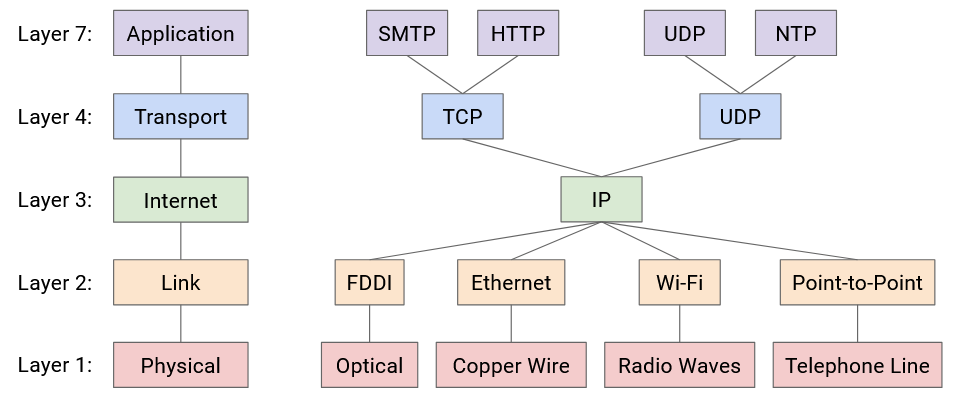

Nếu nhìn vào sơ đồ này, bạn sẽ thấy chỉ có **một giao thức ở Layer 3**. Đây chính là “**narrow waist**” (eo hẹp) cho phép kết nối Internet. Cuối cùng, mọi người trên Internet phải đồng ý sử dụng **IP** để các gói tin có thể được gửi đi khắp Internet.

## **Demultiplexing** (Phân kênh)

*(Phần này trong bản gốc chưa được viết đầy đủ – TODO)*

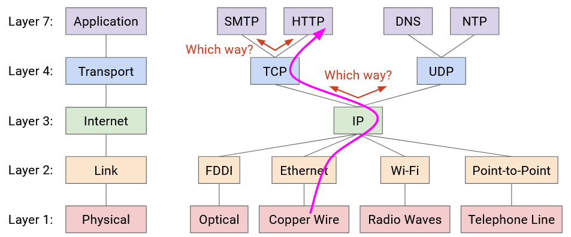

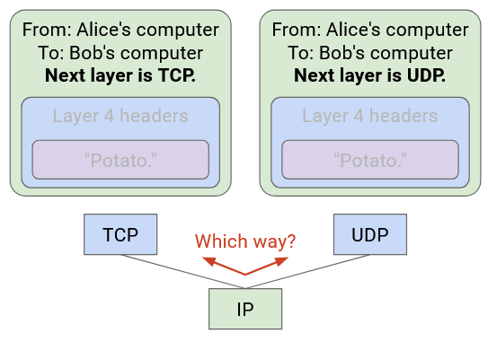

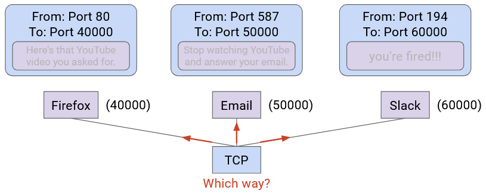

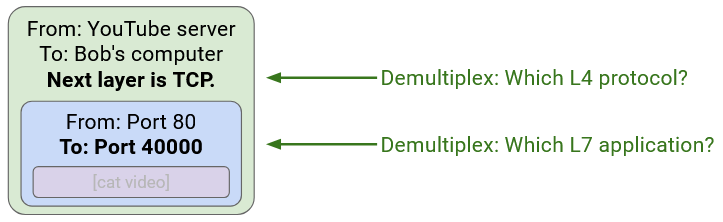

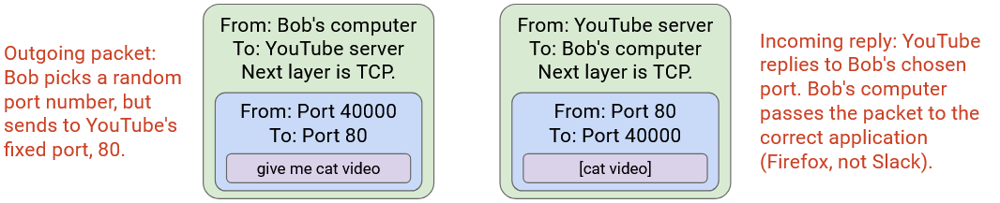

Cần cẩn thận với thuật ngữ. Trong mạng máy tính, **port** có thể chỉ hai khái niệm khác nhau:  
- **Physical port** (cổng vật lý): vị trí thực tế để cắm dây mạng vào switch.  
- **Logical port** (cổng logic): một số trong **Layer 4 header** để phân biệt gói tin thuộc về ứng dụng nào.

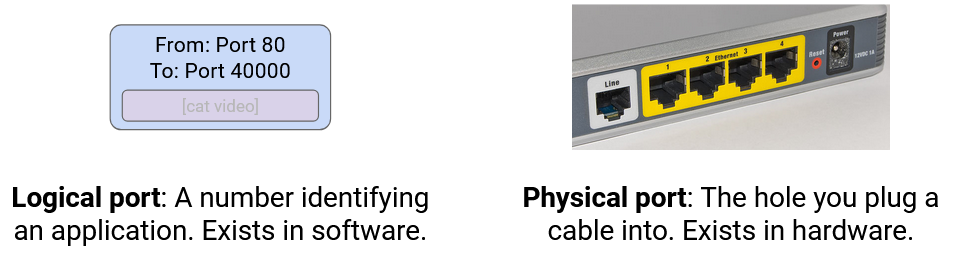

**Lưu ý:** Thuật ngữ **socket** chỉ cơ chế của hệ điều hành (OS) để kết nối một ứng dụng với **networking stack** (ngăn xếp mạng) trong OS. Khi một ứng dụng mở một socket, socket đó được gán với một số cổng logic. Khi OS nhận một gói tin, nó dùng số cổng để chuyển gói tin tới socket tương ứng.

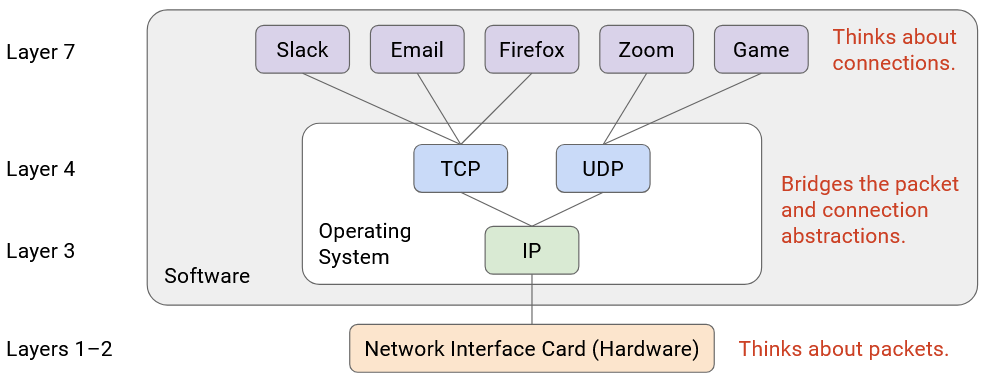

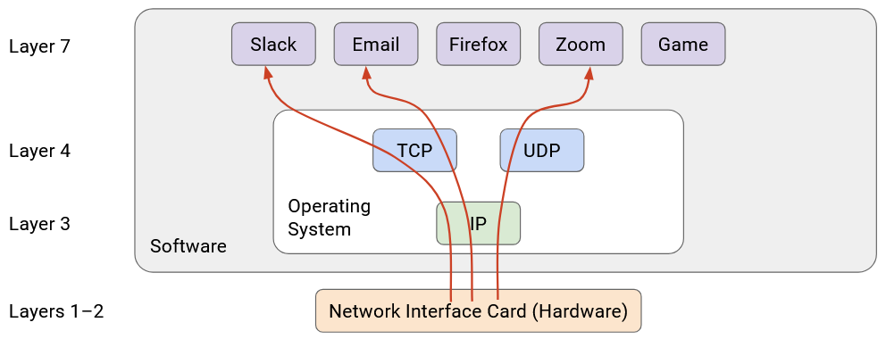

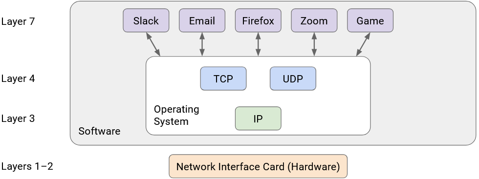

## **Nguyên tắc End-to-End** (End-to-End Principle)

Tại sao chúng ta thiết kế Internet với cấu trúc phân tầng như hiện nay? Tại sao chỉ các **host** hiểu **Layer 4** và **Layer 7**, còn các **router** thì không?

**End-to-end principle** (nguyên tắc đầu-cuối) đưa ra định hướng và triết lý cho việc thiết kế Internet. **David D. Clark**, nhà khoa học tại MIT và thành viên **Internet Architecture Board**, là người đóng góp lớn cho nguyên tắc này. Hai bài báo của ông, *"End-to-End Arguments in System Design"* (1981) và *"The Design Philosophy of the DARPA Internet Protocols"* (1988), có ảnh hưởng sâu rộng đến triết lý thiết kế Internet.

Nguyên tắc end-to-end định hướng tranh luận về việc chức năng nào nên và không nên được triển khai trong mạng. Nguyên tắc này khá rộng và có nhiều ứng dụng, nhưng ở đây chúng ta tập trung vào câu hỏi: **Có nên triển khai tính tin cậy (Layer 4) trong mạng, hay chỉ ở các end host?**

Giả sử một giao thức đơn giản để đảm bảo tin cậy: Host A muốn gửi 10 gói tin tới Host B, đánh số từ 1 đến 10. Mục tiêu là B nhận đủ tất cả gói, hoặc phát hiện thiếu gói và báo lỗi (bỏ qua việc khôi phục lỗi).

**Nếu triển khai tính tin cậy trong mạng:** Mỗi router phải hiểu Layer 4 ngoài Layer 1–3. Router trung gian phải đảm bảo gửi tin cậy tới **next hop** (bước nhảy tiếp theo), và nếu mất gói, router phải gửi lại. Host không kiểm tra, mà tin tưởng mạng đảm bảo tất cả gói được nhận.

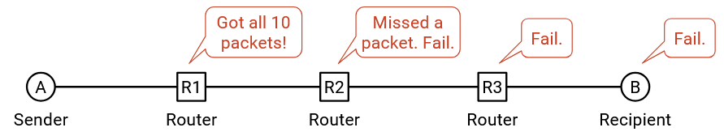

Nhược điểm: Host phải **trust** (tin tưởng) mạng. Nếu một router bị lỗi và làm mất gói, host không thể làm gì.

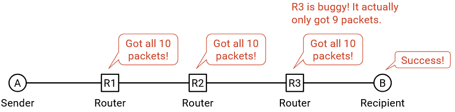

**Nếu triển khai tính tin cậy ở end host (end-to-end approach):** Mạng có thể làm mất gói, và host sẽ tự kiểm tra, xác nhận và xử lý.

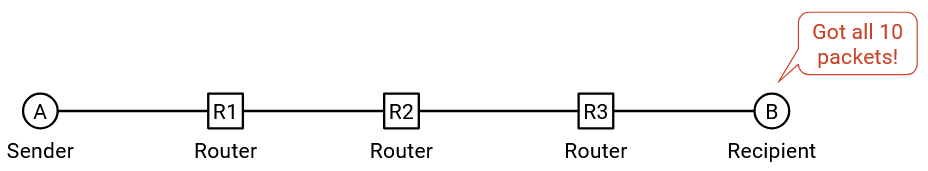

Ưu điểm: Quyền kiểm soát nằm ở host. Nếu host bị lỗi, họ có thể tự sửa. Nói chung, khi lập trình, tốt hơn là bạn tự kiểm soát tính đúng đắn thay vì phụ thuộc vào người khác (và không thể sửa lỗi của họ).

So sánh hai cách: Nếu dựa vào mạng, ta không thể đảm bảo tin cậy tuyệt đối nếu mạng bị lỗi. Cuối cùng, host vẫn phải làm kiểm tra end-to-end.

Trong Internet cũ, mỗi liên kết đều triển khai tính tin cậy. Nhưng Internet hiện đại chỉ cung cấp **best-effort** (nỗ lực tối đa, không đảm bảo), và buộc end host triển khai tính tin cậy – phù hợp với nguyên tắc end-to-end.

**Tóm lại:** Một số yêu cầu ứng dụng phải được triển khai end-to-end để đảm bảo tính đúng đắn. Việc triển khai end-to-end là đủ, không cần hỗ trợ thêm từ mạng. Thêm chức năng vào mạng sẽ làm tăng độ phức tạp và chi phí mà không cải thiện kết quả.

Lưu ý rằng **end-to-end principle** (nguyên tắc đầu-cuối) không phải là một định lý hay một chứng minh luôn đúng. Đây là một nguyên tắc định hướng và một lập luận mang tính triết lý, và các nhà thiết kế khác nhau có thể đưa ra những lập luận ủng hộ hoặc phản đối nguyên tắc này.

Dưới đây là một ví dụ cho thấy nguyên tắc end-to-end không phải là một quy tắc tuyệt đối. Mặc dù nguyên tắc này nói rằng chỉ nên triển khai **reliability** (tính tin cậy) ở **end host** (máy đầu cuối), chúng ta vẫn có thể bổ sung thêm một chút tính tin cậy trong mạng, bên cạnh việc kiểm tra end-to-end. Điều này có thể hữu ích nếu chúng ta có các liên kết kém ổn định. Giả sử có 10 liên kết giữa A và B, và mỗi liên kết có xác suất lỗi 10%. Khi đó, mỗi lần gửi gói tin, xác suất bị mất gói là 65%. Tuy nhiên, nếu mỗi **router** được chỉnh sửa để gửi hai bản sao của gói tin nhằm tăng độ tin cậy, thì mỗi liên kết chỉ còn xác suất lỗi 0,1%, và gói tin chỉ còn 1% khả năng bị mất. Các liên kết **wireless** (không dây) đôi khi cũng triển khai cơ chế tin cậy để giảm tỷ lệ lỗi và cải thiện hiệu năng cho end host.

Nguyên tắc end-to-end cũng mở rộng sang các lĩnh vực khác. Ví dụ, trong bảo mật, nguyên tắc này có thể nói rằng hai end host khi giao tiếp nên **encrypt** (mã hóa) thông điệp của mình ngay tại end host, thay vì tại các điểm trung gian trong mạng.

Lập luận end-to-end theo lời của Clark:  
> “Chức năng đang được xét chỉ có thể được triển khai đầy đủ và chính xác với sự hiểu biết và hỗ trợ của ứng dụng tại các điểm cuối. Do đó, việc cung cấp chức năng đó như một tính năng của chính hệ thống truyền thông là không khả thi. Đôi khi, một phiên bản chưa hoàn chỉnh của chức năng được cung cấp bởi hệ thống truyền thông có thể hữu ích như một cách cải thiện hiệu năng.”
