# **Links** (Liên kết)

## **Properties of Links** (Các đặc tính của liên kết)

Bây giờ khi chúng ta đã có bức tranh tổng thể về cách các tầng của Internet được xây dựng, hãy tập trung vào cách một **packet** (gói tin) được gửi qua một **link** (liên kết).

Có ba đặc tính mà chúng ta có thể dùng để đo hiệu năng của một liên kết:

- **Bandwidth** (băng thông) của một liên kết cho biết số bit có thể gửi qua liên kết trong một đơn vị thời gian. Hiểu một cách trực quan, đây là “tốc độ” của liên kết. Nếu coi liên kết như một ống dẫn nước, băng thông chính là độ rộng của ống. Ống càng rộng thì mỗi giây càng có thể dẫn nhiều nước hơn. Băng thông thường được đo bằng **bit per second** (bit mỗi giây), ví dụ: 5 Gbps = 5 tỷ bit mỗi giây.

- **Propagation delay** (độ trễ lan truyền) của một liên kết cho biết thời gian để một bit di chuyển hết chiều dài liên kết. Trong phép so sánh ống nước, đây là chiều dài của ống. Ống càng ngắn thì nước càng mất ít thời gian để đến đầu bên kia. Độ trễ lan truyền được đo bằng đơn vị thời gian (ví dụ: nanosecond, millisecond).

- Nếu nhân băng thông với độ trễ lan truyền, ta được **Bandwidth-Delay Product (BDP)**. Hiểu đơn giản, đây là **capacity** (dung lượng) của liên kết, tức là số bit tồn tại trên liên kết tại một thời điểm. Trong phép so sánh ống nước, nếu ta làm đầy ống và “đóng băng” thời gian, dung lượng của ống chính là lượng nước có trong ống tại thời điểm đó.

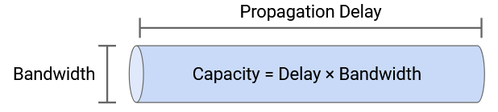

**Lưu ý:** Đôi khi bạn sẽ thấy thuật ngữ **latency** (độ trễ). Trong ngữ cảnh của một liên kết, latency chính là propagation delay, mặc dù từ này cũng được dùng trong các ngữ cảnh khác (ví dụ: độ trễ từ end host đến end host qua nhiều liên kết). Latency không có định nghĩa chính thức duy nhất và phụ thuộc vào ngữ cảnh.

## **Timing Diagram** (Biểu đồ thời gian)

Giả sử chúng ta có một liên kết với băng thông 1 Mbps = 1 triệu bit mỗi giây, và độ trễ lan truyền 1 ms = 0,001 giây.

Chúng ta muốn gửi một packet 100 byte = 800 bit qua liên kết này. Mất bao lâu để gửi xong packet, tính từ lúc bit đầu tiên được gửi đến lúc bit cuối cùng được nhận?

Để trả lời, ta có thể vẽ một **timing diagram**. Cột bên trái là **sender** (bên gửi), cột bên phải là **recipient** (bên nhận). Thời gian bắt đầu từ 0 và tăng dần khi ta di chuyển xuống biểu đồ.

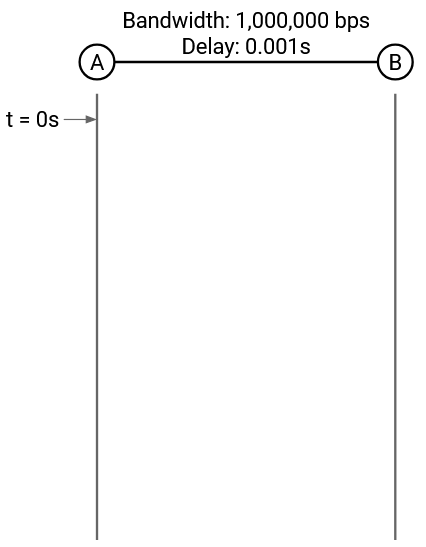

Xét bit đầu tiên: Với băng thông 1.000.000 bit/giây, mất 1/1.000.000 = 0,000001 giây để đặt một bit lên liên kết. Tại thời điểm 0,000001 giây, liên kết có một bit ở đầu bên gửi.

Bit này mất 0,001 giây để di chuyển hết liên kết (propagation delay), nên tại thời điểm 0,000001 + 0,001 giây, bit đầu tiên đến được bên nhận.

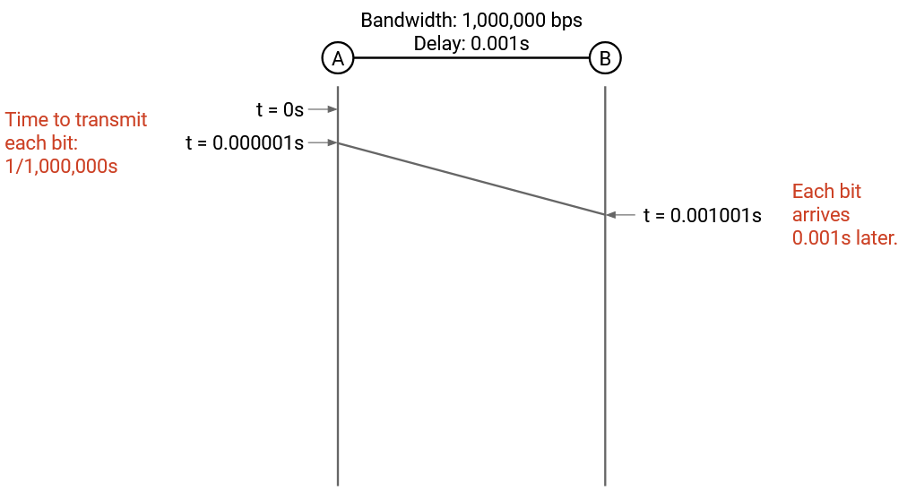

Xét bit cuối cùng: Như trên, mất 0,000001 giây để đặt một bit lên liên kết. Có 800 bit cần gửi, nên bit cuối cùng được đặt lên liên kết tại thời điểm:

$$800 \cdot 0,000001 = 0,0008 \ \text{giây}$$

Bit này cũng mất 0,001 giây để truyền, nên tại thời điểm 0,0008 + 0,001 giây, bit cuối cùng đến bên nhận. Đây là lúc ta nói packet đã đến nơi.

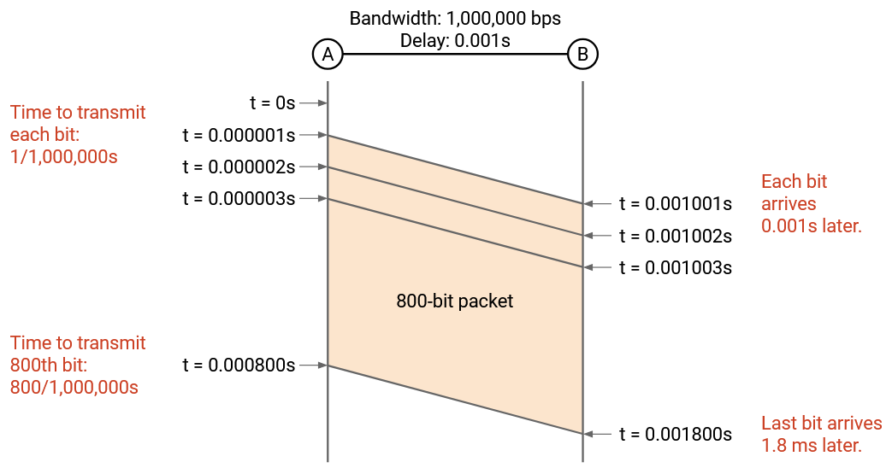

## **Packet Delay** (Độ trễ gói tin)

Tổng quát hơn, **packet delay** là thời gian để gửi toàn bộ một packet, tính từ lúc bit đầu tiên được đặt lên dây đến lúc bit cuối cùng được nhận ở đầu bên kia. Độ trễ này bằng tổng của **transmission delay** (độ trễ truyền) và **propagation delay**.

- **Transmission delay**: thời gian để đặt tất cả bit của packet lên dây. Trong ví dụ, giá trị này là:

$$800 \cdot \frac{1}{1{,}000{,}000}$$

Nói chung, transmission delay = kích thước packet / băng thông liên kết.

Vì transmission delay phụ thuộc vào băng thông, ta có thể tính packet delay dựa trên hai đặc tính của liên kết: bandwidth và propagation delay.

## **Bandwidth và Propagation Delay: Sự đánh đổi** (Trade-offs)

Xét hai liên kết:

- **Link 1**: bandwidth 10 Mbps, propagation delay 10 ms.  
- **Link 2**: bandwidth 1 Mbps, propagation delay 1 ms.

Liên kết nào tốt hơn? Câu trả lời phụ thuộc vào packet bạn gửi.

- Nếu gửi một packet 10 byte: thời gian đặt packet lên dây là không đáng kể, propagation delay là yếu tố chính. Link 2 có propagation delay ngắn hơn, nên tốt hơn.
- Nếu gửi một packet 10.000 byte: transmission delay là yếu tố chính, và ta chọn Link 1 vì băng thông cao hơn. Tính toán cho thấy: Link 1 mất khoảng 18 ms, Link 2 mất khoảng 81 ms.

Ví dụ thực tế:  
- Nếu chất lượng video call kém → có thể do bandwidth không đủ (giảm propagation delay không giúp).  
- Nếu có độ trễ giữa lúc bạn nói và lúc người kia trả lời → có thể do propagation delay quá dài (tăng bandwidth không giúp).

## **Pipe Diagram** (Biểu đồ ống)

Trước giờ, chúng ta vẽ timing diagram để biểu diễn thời điểm các sự kiện mạng xảy ra (ví dụ: khi bên nhận nhận được packet).

Một cách khác để hình dung packet được gửi qua mạng là vẽ các bit trên liên kết tại một thời điểm “đóng băng”. Cả hai cách đều truyền tải cùng thông tin, nhưng tùy ngữ cảnh, một cách có thể hữu ích hơn.

Để vẽ liên kết, ta tưởng tượng liên kết là một ống (giống phép so sánh nước) và vẽ ống dưới dạng hình chữ nhật:  
- **Chiều rộng** = propagation delay.  
- **Chiều cao** = bandwidth.  
- **Diện tích** = capacity của liên kết.

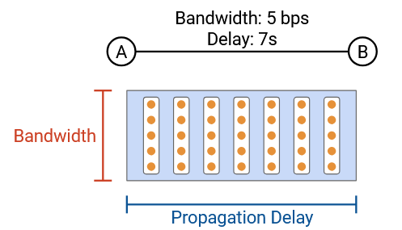

Giả sử ta muốn gửi một packet 50 byte qua liên kết. Trong biểu đồ ống, ta có thể minh họa một thời điểm đóng băng khi packet đang được gửi.

Packet được biểu diễn dưới dạng hình chữ nhật, trong đó chiều cao cho biết số byte được đặt lên dây trong một đơn vị thời gian. Mỗi bước thời gian, packet trượt sang phải trong ống. Cuối cùng, packet bắt đầu thoát ra khỏi ống, và ở mỗi bước thời gian, một cột của hình chữ nhật rời khỏi ống.

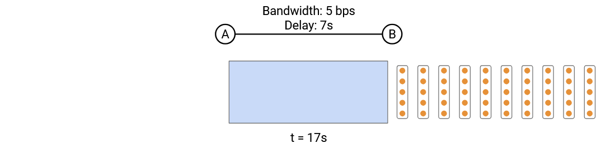

Một sự thật không hiển nhiên: **Packet transmission delay** (độ trễ truyền gói tin) trong **timing diagram** (biểu đồ thời gian) tương ứng với **chiều rộng** của hình chữ nhật.

Để thấy tại sao, giả sử chúng ta có một **link** (liên kết) có thể gửi 5 bit mỗi giây, và chúng ta có một packet 20 bit. Trong timing diagram, có 11 giây giữa thời điểm bit đầu tiên và bit cuối cùng được gửi.

Trong **pipe diagram** (biểu đồ ống), mỗi giây, một cột gồm 5 bit “bước” vào ống. Chúng ta cần 4 cột để đưa toàn bộ packet vào ống, mất 4 giây. Điều này có nghĩa là chiều rộng của packet trong ống là 4 cột = 4 giây.

Pipe diagram cho phép chúng ta quan sát **thời gian truyền packet** trên cùng một trục với **propagation delay** (độ trễ lan truyền) và so sánh hai giá trị này.

Pipe diagram cũng hữu ích khi so sánh các liên kết khác nhau. Hãy xem cùng một packet di chuyển qua ba liên kết khác nhau.

Nếu chúng ta rút ngắn propagation delay, **chiều rộng** của ống ngắn lại. **Chiều cao** của ống giữ nguyên, và hình dạng của mỗi packet hình chữ nhật cũng giữ nguyên. (Hãy nhớ: chiều cao của packet = số bit được đưa vào ống mỗi đơn vị thời gian; chiều rộng của packet = thời gian để đưa toàn bộ bit vào ống.)

Quan sát khác: Chiều rộng packet giữ nguyên nghĩa là **transmission delay** (độ trễ truyền) không thay đổi. Ngoài ra, diện tích của liên kết giảm, cho thấy **capacity** (dung lượng) của liên kết giảm.

Khi tăng **bandwidth** (băng thông), chiều cao của ống tăng, cho thấy chúng ta có thể đưa nhiều bit vào ống hơn mỗi đơn vị thời gian.

Lúc này, hình dạng packet cũng thay đổi: packet cao hơn vì mỗi đơn vị thời gian có thể đưa nhiều bit hơn vào ống. Kết quả là chúng ta hoàn tất việc đưa packet vào ống nhanh hơn, nên **chiều rộng** của packet (transmission delay) giảm.

## **Overloaded Links** (Liên kết quá tải)

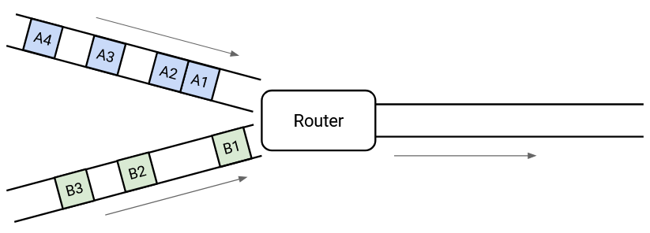

Xem hình minh họa packet đến một **switch** (bộ chuyển mạch). Switch cần chuyển tiếp tất cả packet qua **outgoing link** (liên kết đầu ra). Trong trường hợp này, không có vấn đề gì vì switch có đủ khả năng xử lý mọi packet khi chúng đến.

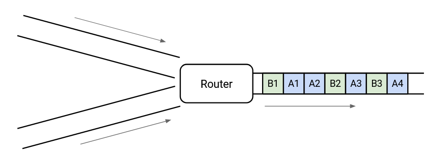

Còn trong hình này thì sao?

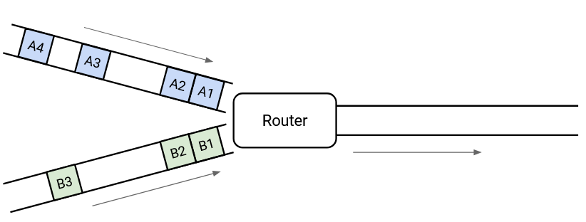

Về lâu dài, chúng ta có đủ khả năng để gửi tất cả packet ra ngoài, nhưng tại một thời điểm cụ thể, có hai packet đến cùng lúc, và chúng ta chỉ có thể gửi một. Đây được gọi là **transient overload** (quá tải tạm thời), và nó cực kỳ phổ biến ở các switch trên Internet.

Để xử lý quá tải tạm thời, switch duy trì một **queue** (hàng đợi) packet. Nếu hai packet đến cùng lúc, switch sẽ đưa một packet vào hàng đợi và gửi packet còn lại.

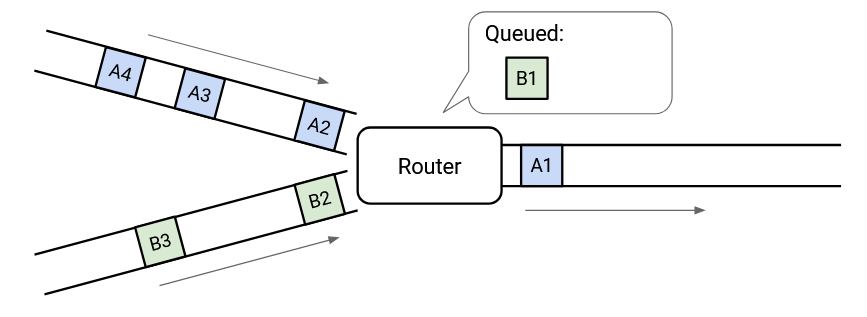

Tại bất kỳ thời điểm nào, switch có thể chọn gửi một packet từ một trong các **incoming link** (liên kết đầu vào), hoặc gửi một packet từ hàng đợi. Lựa chọn này được xác định bởi một **packet scheduling algorithm** (thuật toán lập lịch gói tin), và có rất nhiều thiết kế khác nhau mà chúng ta sẽ tìm hiểu.

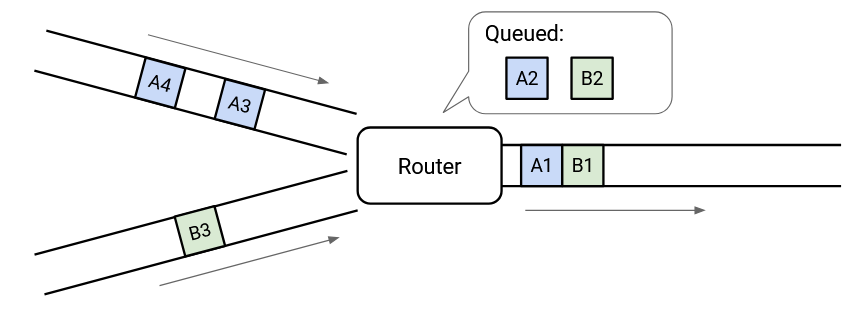

Khi không có packet đến, switch có thể **drain** (xả) hàng đợi và gửi các packet đang chờ.

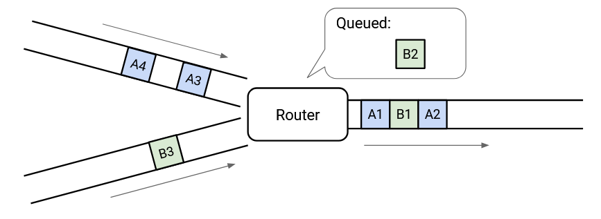

Điều này cho phép hàng đợi giúp hấp thụ các đợt bùng nổ tạm thời.

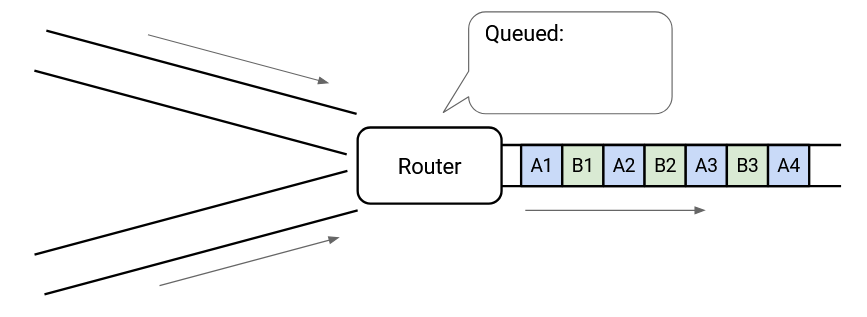

Nhưng nếu các liên kết đầu vào trông như thế này thì sao?

Lúc này, chúng ta có **persistent overload** (quá tải kéo dài). Đơn giản là không đủ dung lượng trên liên kết đầu ra để đáp ứng mức lưu lượng đầu vào.

Chúng ta có thể làm đầy hàng đợi, nhưng điều đó vẫn không đủ để xử lý tải đầu vào. Dù thế nào, switch cũng sẽ phải **drop** (loại bỏ) packet.

Làm thế nào để xử lý quá tải kéo dài? **Operator** (nhà vận hành) cần cấu hình hợp lý các liên kết và switch. Nếu họ nhận thấy một switch thường xuyên quá tải, họ có thể quyết định nâng cấp liên kết (có thể cần thao tác thủ công).

Một giải pháp khả thi là để **router** thông báo cho bên gửi giảm tốc độ gửi (chúng ta sẽ học khi tìm hiểu **congestion control** – kiểm soát tắc nghẽn). Tuy nhiên, nhìn chung, không có nhiều cách để giải quyết hoàn toàn quá tải, và đó là lý do Internet được thiết kế chỉ cung cấp dịch vụ **best-effort**.

Bây giờ khi đã có khái niệm về **queuing** (xếp hàng), chúng ta cần cập nhật công thức tính **packet delay**:  
**Packet delay** = Transmission delay + Propagation delay + Queuing delay.

