# **Thiết kế chia sẻ tài nguyên** (Designing Resource Sharing)

## **Chia sẻ tài nguyên: Statistical Multiplexing** (Ghép kênh thống kê)

Các **link** (liên kết) và **switch** (bộ chuyển mạch) trên Internet đều có **finite capacity** (dung lượng hữu hạn). Một vấn đề thiết kế quan trọng cần giải quyết là: **Làm thế nào để chia sẻ các tài nguyên này giữa những người dùng Internet khác nhau?**

Hãy mô hình hóa vấn đề rõ hơn. Nhớ rằng một **flow** (luồng) là một chuỗi **packet** (gói tin) được trao đổi giữa hai **end host** (máy đầu cuối), ví dụ: một cuộc gọi video giữa bạn và bạn bè. Internet cần hỗ trợ nhiều flow đồng thời, mặc dù dung lượng có hạn.

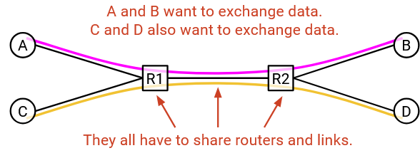

Chúng ta thường nói rằng tài nguyên mạng được **statistically multiplexed** (ghép kênh thống kê), nghĩa là chúng ta sẽ phân bổ tài nguyên cho người dùng một cách **dynamic** (động) dựa trên nhu cầu của họ, thay vì chia cố định một phần tài nguyên cho mỗi người dùng.

Ví dụ tương tự: máy tính cá nhân của bạn không chia sẵn một nửa CPU cho Firefox và một nửa cho Zoom, rồi chỉ cho mỗi ứng dụng dùng phần của mình. Thay vào đó, máy tính phân bổ tài nguyên động cho các ứng dụng tùy theo nhu cầu.

Ghép kênh thống kê hiện diện ở khắp nơi trong khoa học máy tính. Ví dụ: trong **cloud computing** (điện toán đám mây), các công ty khác nhau có thể chia sẻ tài nguyên trong một **datacenter** (trung tâm dữ liệu) một cách động.

Ghép kênh thống kê là một cách hiệu quả để chia sẻ tài nguyên mạng, vì nhu cầu của người dùng thay đổi theo thời gian. Bạn có thể không dùng liên tục 10 Mbps băng thông mỗi giây, 24 giờ/ngày. Bạn có thể dùng nhiều hơn khi thức và ít hơn khi ngủ.

Tiền đề giúp ghép kênh thống kê hoạt động là: **Trên thực tế, đỉnh của tổng nhu cầu nhỏ hơn nhiều so với tổng của các đỉnh nhu cầu riêng lẻ.**

Giả sử có hai người dùng A và B. Chúng ta vẽ đồ thị nhu cầu của từng người theo thời gian.

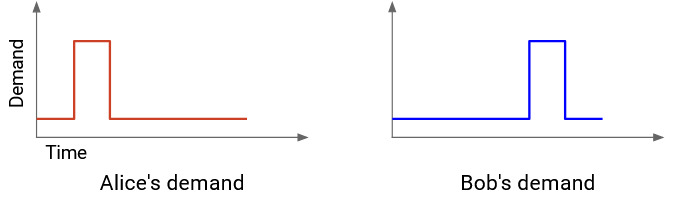

**Chiến lược kém hiệu quả** (không ghép kênh thống kê) là cộng đỉnh nhu cầu của từng người. Ta lấy đỉnh nhu cầu của A và B, rồi cộng lại.

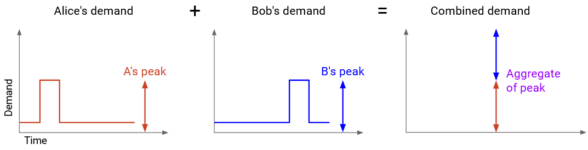

Nếu phân bổ dung lượng bằng tổng này, chắc chắn đáp ứng được nhu cầu. Ví dụ: đỉnh nhu cầu của A là X, ta cấp X cho A; đỉnh của B là Y, ta cấp Y cho B. Nhưng cách này lãng phí, vì đỉnh của A và B không xảy ra cùng lúc.

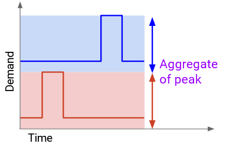

**Chiến lược tốt hơn** (ghép kênh thống kê) là tính **aggregate demand** (tổng nhu cầu) bằng cách cộng nhu cầu của A và B tại từng thời điểm. Ví dụ: nhu cầu lúc 10h sáng = nhu cầu của A lúc 10h + nhu cầu của B lúc 10h. Sau đó, ta tìm đỉnh của tổng nhu cầu này.

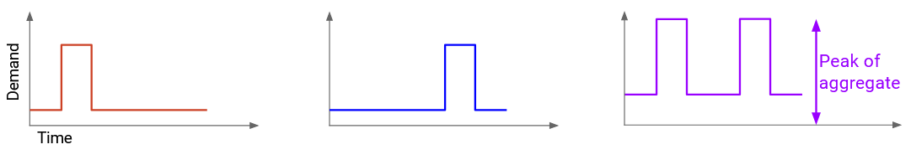

Nếu phân bổ dung lượng bằng đỉnh của tổng nhu cầu, ta không thể chia cố định cho từng người. Nhưng bằng cách thay đổi động lượng cấp cho mỗi người theo thời gian, ta vẫn đáp ứng được nhu cầu, dù tổng dung lượng ít hơn.

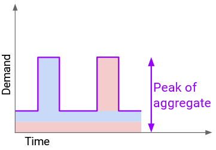

Cách tiếp cận này cho phép hỗ trợ cùng số người dùng với dung lượng ít hơn (tiết kiệm chi phí, sử dụng tài nguyên hiệu quả hơn). Với nhiều phân phối, đỉnh của tổng nhu cầu gần bằng tổng nhu cầu trung bình, nhỏ hơn nhiều so với tổng các đỉnh riêng lẻ.

Trong thực tế, mạng không được thiết kế để đáp ứng **worst case** (trường hợp xấu nhất) khi tất cả cùng đạt đỉnh. Thay vào đó, ta chia sẻ tài nguyên động và hy vọng các đỉnh không trùng nhau. Nếu đỉnh trùng nhau, packet có thể bị trễ hoặc bị drop (rớt) — nhớ lại hàng đợi ở liên kết. Dù vậy, chúng ta chọn ghép kênh thống kê để dùng tài nguyên hiệu quả hơn, chấp nhận hệ quả là đôi khi có đỉnh trùng.

Cuối cùng, ghép kênh thống kê là một lựa chọn thiết kế có **trade-off** (đánh đổi), và người dùng khác nhau có thể chọn khác nhau. Ví dụ: các sàn giao dịch tài chính đôi khi xây mạng riêng để đáp ứng nhu cầu đỉnh, vì họ ưu tiên đảm bảo kết nối trong giờ cao điểm và có thể chi trả chi phí.

## **Chia sẻ tài nguyên: Circuit Switching vs. Packet Switching**

Chúng ta đã biết có thể dùng ghép kênh thống kê để quyết định dung lượng cần xây dựng. Câu hỏi tiếp theo: **Làm thế nào để phân bổ tài nguyên động giữa người dùng?**

Ví dụ tương tự: một nhà hàng đông khách và số bàn có hạn. Có hai cách phân bổ bàn: đặt chỗ trước hoặc phục vụ theo thứ tự đến trước.

Hai cách chia sẻ tài nguyên mạng cũng tương tự:

- **Best-effort**: Mọi người gửi dữ liệu vào mạng mà không đặt chỗ, và hy vọng mọi thứ ổn. Không có gì đảm bảo băng thông đủ cho nhu cầu.
- Thiết kế chuẩn cho best-effort là **packet switching** (chuyển mạch gói). Switch xử lý từng packet độc lập và chuyển nó gần hơn tới đích. Các switch không quan tâm đến flow hay đặt chỗ.

Ngoài việc packet độc lập với nhau, các switch cũng độc lập với nhau. Khi packet đi qua nhiều switch, mỗi switch xử lý nó riêng, không phối hợp.

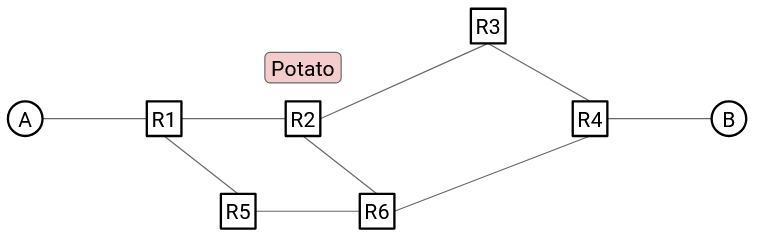

- **Reservations** (đặt chỗ): Khi bắt đầu một flow, người dùng yêu cầu và đặt trước băng thông cần thiết. Sau khi gửi xong dữ liệu, tài nguyên được giải phóng cho người khác.

Thiết kế chuẩn cho reservations, được nghiên cứu và áp dụng trong công nghiệp, là **circuit switching** (chuyển mạch kênh).

Khi bắt đầu một flow, end host xác định một đường đi (chuỗi switch và link) qua mạng, dùng một **routing algorithm** (thuật toán định tuyến). (Chúng ta sẽ học định tuyến sau, tạm coi là “ma thuật” ở đây.)

Sau đó, nguồn gửi một **reservation request message** (thông điệp yêu cầu đặt chỗ) tới đích. Trên đường đi, mỗi switch nhận yêu cầu này. Nếu tất cả switch chấp nhận, đặt chỗ được thiết lập, và một **circuit** (kênh) giữa nguồn và đích được hình thành.

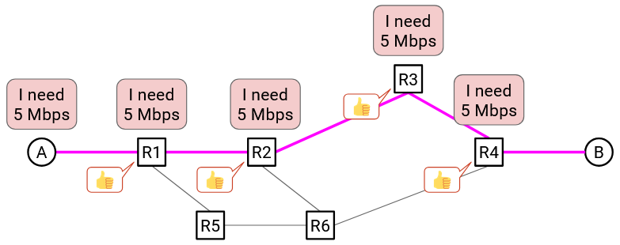

Khi tất cả switch xác nhận, dữ liệu có thể được gửi. Khi flow kết thúc, nguồn gửi một **teardown message** (thông điệp hủy kênh) tới đích. Trên đường đi, mỗi switch nhận thông điệp và giải phóng dung lượng.

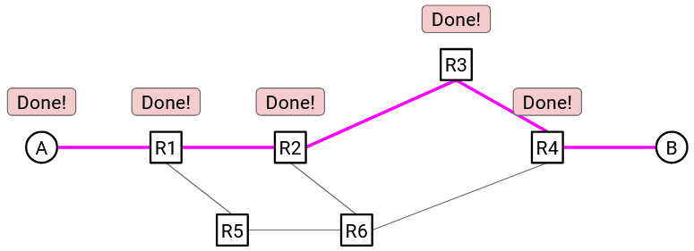

**Lưu ý:** Từ “circuit” xuất phát từ mạng điện thoại, nơi hai người gọi cho nhau bằng cách thiết lập một kênh như vậy.

Nhớ rằng, cả circuit switching và packet switching đều áp dụng ghép kênh thống kê. Khác biệt chính là **granularity** (độ chi tiết) khi phân bổ tài nguyên:  
- Circuit switching: theo flow, có đặt chỗ.  
- Packet switching: theo packet, best-effort.

Ngay cả trong circuit switching, chúng ta vẫn phân bổ tài nguyên động dựa trên đặt chỗ, chứ không đặt trước cho mọi flow có thể xảy ra.

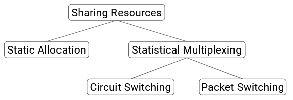

## **Circuit Switching vs. Packet Switching: Các yếu tố đánh đổi** (Trade-offs)

Chúng ta hiện có hai cách tiếp cận để chia sẻ tài nguyên trên Internet. Cách nào tốt hơn? Điều đó phụ thuộc vào tiêu chí mà chúng ta dùng để đánh giá.

Có bốn khía cạnh chính để so sánh hai cách tiếp cận này:

**1. Đây có phải là một abstraction (hoặc API) tốt để mạng cung cấp cho lập trình viên ứng dụng không?**

**Circuit switching** cung cấp một abstraction hữu ích hơn cho lập trình viên, vì nó đảm bảo **reserved bandwidth** (băng thông được đặt trước). Điều này giúp lập trình viên dự đoán và hiểu rõ hành vi của hệ thống hơn (giả sử mọi thứ diễn ra suôn sẻ). Ví dụ tương tự: đặt trước một máy chủ trên **cloud** để chạy tác vụ. Lập trình viên dễ dàng ước lượng hiệu năng hơn nếu biết cấu hình máy mình nhận được. Nếu không biết, tác vụ vẫn có thể chạy, nhưng hiệu năng sẽ khó dự đoán.

Circuit switching cũng hữu ích nếu bạn là **network operator** (nhà vận hành mạng) cần phân bổ tài nguyên cho người dùng. Bạn biết chính xác mỗi người dùng yêu cầu bao nhiêu băng thông và có thể tính phí phù hợp. Nếu không có đảm bảo, việc xây dựng mô hình kinh doanh trực quan sẽ khó hơn.

**2. Cách tiếp cận này có hiệu quả ở quy mô lớn không? Có tận dụng hết băng thông khả dụng hay lãng phí?**

**Packet switching** thường hiệu quả hơn. Mức độ hơn bao nhiêu phụ thuộc vào **burstiness** (mức độ bùng nổ) của nguồn lưu lượng.

- Nếu mỗi bên gửi dữ liệu với tốc độ **constant rate** (ổn định) theo thời gian, cả circuit switching và packet switching đều tận dụng hết dung lượng.

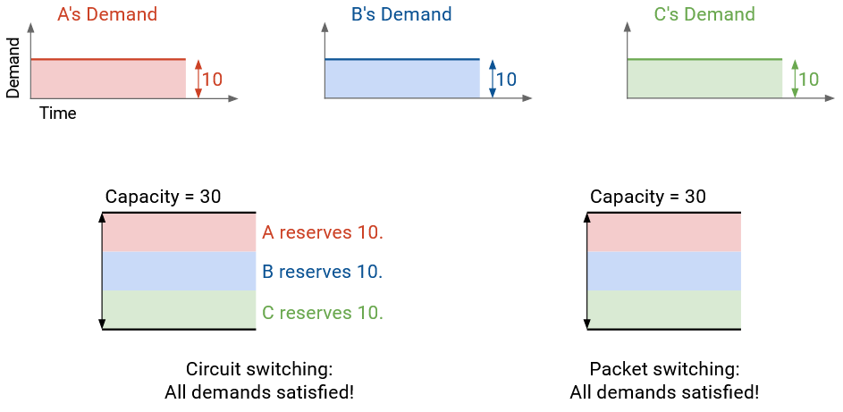

- Ngược lại, nếu tốc độ gửi thay đổi theo thời gian, packet switching tận dụng băng thông tốt hơn.

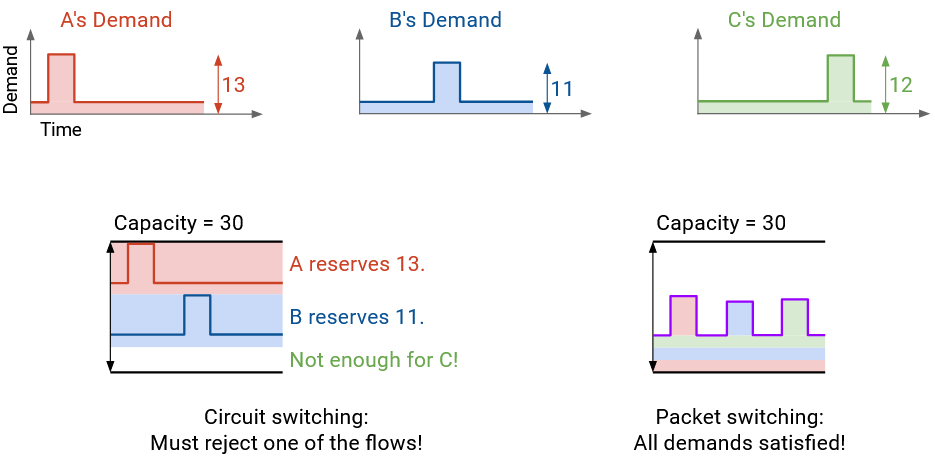

Ví dụ: với **reservations** (đặt chỗ), ba flow phải đặt lần lượt 12, 11 và 13 Mbps. Một yêu cầu sẽ bị từ chối vì tổng chỉ có 30 Mbps. Cách này lãng phí băng thông ở hai điểm:  
1. Flow đặt 12 Mbps không dùng hết phần lớn thời gian.  
2. Nếu flow 12 Mbps và 11 Mbps được chấp nhận, còn dư 7 Mbps không ai dùng.

Ngược lại, với packet switching (gửi packet khi đến), tổng băng thông dùng tại mọi thời điểm không vượt quá 30 Mbps, và ta có thể hỗ trợ tất cả flow.

**Burstiness** được định nghĩa là tỉ lệ giữa **peak rate** (tốc độ đỉnh) và **average rate** (tốc độ trung bình). Không có ngưỡng rõ ràng để phân loại smooth hay bursty — đây là các thuật ngữ mô tả.

- **Voice call**: thường có tỉ lệ mượt hơn, khoảng 3:1 → phù hợp với circuit switching (điện thoại cố định).  
- **Web browsing**: thường bursty hơn, khoảng 100:1.

Một lý do khác packet switching hiệu quả hơn: circuit switching tốn thời gian **setup** và **teardown** kênh, đặc biệt lãng phí với flow rất ngắn (ví dụ: tải một file nhỏ).

**3. Khả năng xử lý sự cố ở quy mô lớn**

**Packet switching** xử lý sự cố tốt hơn. Nếu một **router** hỏng, ta chỉ cần gửi packet theo đường khác (routing algorithm sẽ xử lý). **End host** không cần thay đổi gì.

Ngược lại, với circuit switching, nếu router trên đường đi hỏng, mạng vẫn phải tìm đường mới, nhưng end host phải làm nhiều việc hơn: phát hiện sự cố, gửi lại yêu cầu đặt chỗ, giải phóng kênh cũ. Nếu yêu cầu mới bị từ chối thì sao?

Cách này **scale** kém: nếu một router hỏng và hàng triệu flow đi qua nó, hàng triệu yêu cầu đặt chỗ phải được thiết lập lại cùng lúc.

**4. Độ phức tạp khi triển khai ở quy mô lớn**

Thiết kế circuit switching kéo theo nhiều câu hỏi phức tạp:

- Làm sao router biết đặt chỗ thành công? Khi router 2 đồng ý, làm sao biết router 3 và 4 cũng đồng ý? (Giải pháp: gửi **confirmation** ngược lại để xác nhận.)
- Nếu **reservation request** bị mất giữa đường? (Giải pháp: đặt **timer**, nếu không xác nhận kịp thì xóa đặt chỗ, end host thử lại.)
- Nếu yêu cầu được chấp nhận nhưng **confirmation** bị mất trên đường về?  
- Nếu bị từ chối, end host nên thử lại với băng thông nhỏ hơn, hay chờ rồi thử lại? Router có nên gợi ý mức băng thông khả dụng?

Vấn đề cốt lõi khiến circuit switching phức tạp là **state consensus** (đồng thuận trạng thái). Tất cả router phải lưu trạng thái bổ sung và đồng ý về trạng thái đó.

Bạn có thể đã nghe về **Paxos protocol** — thuật toán đồng thuận phức tạp, thường chỉ chạy trên 4–5 server. Circuit switching yêu cầu chạy điều này ở quy mô Internet, với hàng triệu router và flow.

**Tóm lại:**  
- **Circuit switching**: hiệu năng tốt hơn cho ứng dụng nhờ băng thông đặt trước, hành vi dễ dự đoán.  
- **Packet switching**: chia sẻ băng thông hiệu quả hơn, không tốn thời gian khởi tạo, phục hồi sự cố dễ hơn, triển khai đơn giản hơn.

## **Circuit Switching vs. Packet Switching trong thực tế**

Trên Internet hiện đại, **packet switching** là mặc định.

**Circuit switching** chỉ dùng trong một số trường hợp hạn chế:  
- **RSVP (Resource Reservation Protocol)** trong mạng cục bộ nhỏ, cho phép router (không phải end host) đặt băng thông giữa nhau.  
- **Dedicated circuits** (ví dụ: MPLS circuits, leased lines): doanh nghiệp mua băng thông Internet (có thể kèm hạ tầng vật lý) dành riêng cho mình. Chi phí cao hơn nhiều so với kết nối Internet tiêu chuẩn.

Các dedicated circuits này triển khai ở quy mô nhỏ hơn nhiều so với ý tưởng circuit switching toàn Internet. Thường được thiết lập thủ công, tồn tại lâu dài (nhiều năm), và ở cấp độ công ty, không phải từng flow.

**Lịch sử ngắn gọn:**  
- 1970–1980: Internet được thiết kế dưới dạng packet switching, phục vụ nghiên cứu do chính phủ tài trợ.  
- 1990: Khi Internet thương mại hóa, nhiều người nghĩ cần chuyển sang circuit switching, dự đoán ứng dụng chính sẽ là thoại và truyền hình trực tiếp (nhu cầu băng thông mượt, phù hợp circuit switching). ISP cũng nghĩ circuit switching dễ xây dựng mô hình kinh doanh hơn.

Nhiều nghiên cứu và tiêu chuẩn đã được đề xuất, nhưng thất bại vì các lý do đã nêu. Thêm vào đó, ứng dụng thúc đẩy Internet lại là email và web, không phải thoại và TV.

**Hệ quả thú vị:** Người dùng và lập trình viên đã thích nghi với packet switching. Ví dụ: khi xem video mà kết nối kém, ứng dụng sẽ tự giảm chất lượng video — điều mà truyền hình quảng bá không làm. Đây là minh chứng cho việc công nghệ có thể thay đổi hành vi người dùng.

