# Mô hình cho Định tuyến Liên miền

## Định tuyến Liên miền

Như đã đề cập trước đó, việc định tuyến được thực hiện trong một mạng của các mạng. Chúng ta đã tìm hiểu về các giao thức *distance-vector* (véc-tơ khoảng cách) và *link-state* (trạng thái liên kết) có thể được sử dụng để triển khai *intra-domain routing* (định tuyến nội miền), cho phép các gói tin được gửi trong một mạng cục bộ.

Trong phần này, chúng ta sẽ xây dựng một mô hình cho phép định nghĩa các giao thức *inter-domain routing* (định tuyến liên miền), có thể gửi gói tin giữa các mạng cục bộ khác nhau. Chúng ta cũng sẽ thấy cách các giao thức *inter-domain routing* và *intra-domain routing* kết hợp với nhau để cho phép các gói tin được gửi đến bất kỳ máy chủ nào trong bất kỳ mạng nào.

## Định nghĩa các Hệ thống Tự trị

Chúng ta có thể chính thức hóa khái niệm về một mạng cục bộ bằng cách định nghĩa một ***autonomous system (AS)*** (hệ thống tự trị), là một hoặc nhiều mạng cục bộ được vận hành bởi cùng một nhà điều hành. Ví dụ, trong một công ty như Google, có thể có một mạng cục bộ cho máy tính của nhân viên và một mạng cục bộ khác cho các trung tâm dữ liệu, nhưng cả hai mạng này đều do cùng một công ty kiểm soát. Nhà điều hành có thể triển khai một giao thức *intra-domain routing* duy nhất để gửi tin nhắn giữa các máy trên bất kỳ mạng cục bộ nào trong số đó. Đôi khi, thuật ngữ ***domain*** (miền) được sử dụng một cách không chính thức để chỉ một *AS*, mặc dù thuật ngữ này cũng được sử dụng trong các giao thức khác, vì vậy chúng ta sẽ dùng *AS* khi có thể.

Để hình dung về việc định tuyến các gói tin giữa các *autonomous system*, chúng ta có thể trừu tượng hóa tất cả các *router* và máy chủ riêng lẻ trong *AS*, và coi *AS* như một thực thể duy nhất. Sau đó, chúng ta có thể vẽ một đồ thị trong đó mỗi nút đại diện cho một *AS*, và các cạnh giữa hai *AS* biểu thị một kết nối giữa chúng. Đồ thị này đôi khi được gọi là ***inter-domain topology*** (tô-pô liên miền) hoặc ***AS graph*** (đồ thị AS).

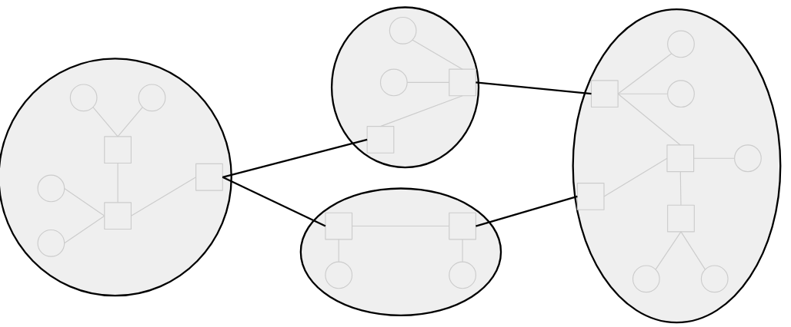

## Lịch sử Tóm tắt của các Hệ thống Tự trị

Trong thực tế, một tổ chức có tên là *Internet Assigned Numbers Authority (IANA)* (Tổ chức cấp phát số hiệu Internet) quản lý một danh sách toàn cầu của tất cả các *autonomous system* tồn tại trên Internet. Để trở thành một *AS*, bạn phải đăng ký với tổ chức này và nhận một *autonomous system number (ASN)* (số hiệu hệ thống tự trị) duy nhất.

Một sự thật thú vị: Trong những ngày đầu, *IANA* được quản lý thủ công bởi một người duy nhất, Jon Postel. Điều này có nghĩa là bất kỳ ai trên thế giới muốn đăng ký một *AS* mới đều phải xin sự chấp thuận của ông.

Ngày nay, có hơn 90.000 *autonomous system*, trong đó Hoa Kỳ là quốc gia có nhiều *AS* nhất.

Một sự thật thú vị khác: UC Berkeley có *ASN* 25, một con số thấp đáng kể khi có rất nhiều *ASN*. Điều này phản ánh sự thật rằng UC Berkeley đã nhận được *ASN* của mình từ rất sớm trong lịch sử Internet (vào những năm 1980).

## Các loại AS

Hãy nhớ lại rằng khi mô hình hóa mạng cho *intra-domain routing*, chúng ta đã phân biệt giữa *end hosts* (máy chủ đầu cuối) và *routers* (bộ định tuyến). Chúng ta cũng sẽ có một sự phân biệt tương tự cho *inter-domain routing* bằng cách định nghĩa hai loại *AS*.

Một ***stub autonomous system*** (hệ thống tự trị cụt) chỉ tồn tại để cung cấp kết nối Internet cho các máy chủ trong các mạng cục bộ của nó. Một *stub AS* chỉ gửi và nhận các gói tin thay mặt cho các máy chủ bên trong *AS* đó, và không chuyển tiếp các gói tin giữa các *AS* khác nhau. Chúng tương tự như các *end hosts* trong mô hình *intra-domain routing* của chúng ta, vốn chỉ gửi và nhận các gói tin của riêng mình và không chuyển tiếp gói tin của người khác.

Các ví dụ thực tế về *stub AS* bao gồm các công ty không chuyên về Internet (ví dụ: một ngân hàng cung cấp kết nối cho nhân viên của mình) hoặc các trường đại học (ví dụ: UC Berkeley cung cấp kết nối cho sinh viên và nhân viên). Các tổ chức này không chịu trách nhiệm vận chuyển lưu lượng Internet từ các tổ chức khác. Đại đa số các *AS* trên thế giới là *stub AS*.

Ngược lại, một ***transit autonomous system*** (hệ thống tự trị chuyển tiếp) chuyển tiếp các gói tin thay mặt cho các *AS* khác. Một *transit AS* có thể vận chuyển một gói tin giữa hai *AS* khác nhau bằng cách nhận và chuyển tiếp gói tin đó.

*Transit AS* tương ứng với các công ty trong thực tế có hoạt động kinh doanh bao gồm việc bán kết nối Internet cho các tổ chức khác. Các ví dụ thực tế về *transit AS* bao gồm AT&T và Verizon, là những công ty mà bạn có thể trả tiền để họ cung cấp kết nối Internet cho bạn. Một số *transit AS* như AT&T có quy mô toàn cầu, với cơ sở hạ tầng trên khắp thế giới. Những *AS* khác có thể chỉ hoạt động trong một khu vực cụ thể, như Sonic, một nhà cung cấp dịch vụ Internet chỉ chuyển tiếp lưu lượng đến và đi từ California.

Lưu ý rằng một *transit AS* vẫn có thể chứa các *end hosts* gửi và nhận các gói tin của riêng mình. Tuy nhiên, một *transit AS* tương tự như các *routers* trong mô hình *intra-domain routing* của chúng ta, vốn nhận các gói tin của người dùng khác và chuyển tiếp chúng thay mặt cho người dùng.

Mô hình về *stub AS* và *transit AS* này là những gì chúng ta sẽ sử dụng trong tài liệu này, mặc dù đôi khi, sự phân loại trong thực tế có thể không rõ ràng như vậy. Ví dụ, các công ty công nghệ lớn như Google, Microsoft và Amazon kiểm soát các *AS* khổng lồ vận chuyển lưu lượng nhiều như các *transit AS* (và thậm chí có thể nhiều hơn). Bởi vì vai trò chính của họ là vận chuyển lưu lượng đến và đi từ các dịch vụ của họ (ví dụ: nhận yêu cầu tìm kiếm Google và gửi kết quả tìm kiếm), họ có thể được phân loại là *stub AS*. Tuy nhiên, trong những năm gần đây, các công ty này cũng đã đề nghị vận chuyển lưu lượng giữa các *AS*, vì vậy họ cũng có thể được phân loại là *transit AS*.

## Tô-pô Liên miền được Định nghĩa bởi các Mối quan hệ Kinh doanh

Trong *inter-domain topology* của chúng ta, chúng ta vẽ một cạnh giữa hai *AS* nếu chúng trao đổi lưu lượng với nhau. Điều gì khiến hai tổ chức trong đời thực, chẳng hạn như một ngân hàng địa phương và Verizon, đồng ý trao đổi lưu lượng? Các cạnh trong *AS* được định nghĩa bởi các mối quan hệ kinh doanh thực tế giữa các *AS*.

Có hai cách khả dĩ mà một cặp *AS* có thể liên quan đến nhau.

Một cặp *AS* có thể có *customer-provider relationship* (mối quan hệ khách hàng-nhà cung cấp). Trong đời thực, ***customer*** (khách hàng) trả tiền cho dịch vụ, và ***provider*** (nhà cung cấp) cung cấp kết nối để đổi lấy tiền. Ví dụ, *AS* của ngân hàng địa phương có thể là *customer*, trả tiền cho *provider* là Verizon để sử dụng dịch vụ Internet.

Một cặp *AS* cũng có thể có mối quan hệ ***peer*** (ngang hàng). Hai *AS* ngang hàng thường gửi cho nhau một lượng lưu lượng xấp xỉ bằng nhau. Trong đời thực, hai *AS* có thể đồng ý trở thành *peer* bằng cách ký một hợp đồng pháp lý giữa các công ty. Thông thường, hai *peer* đồng ý không trả tiền cho nhau cho các dịch vụ kết nối, miễn là lưu lượng gửi theo cả hai hướng là tương đối bằng nhau.

## Đồ thị AS với các Mối quan hệ Kinh doanh

Chúng ta có thể vẽ các mối quan hệ này vào *AS graph* bằng cách thêm các mũi tên vào đồ thị. Một cạnh có hướng chỉ từ *provider* đến *customer*. Một cạnh không có hướng nối hai *peer*. Lưu ý rằng đồ thị có thể chứa cả cạnh có hướng và không có hướng (không phải tất cả các cạnh đều cần có mũi tên).

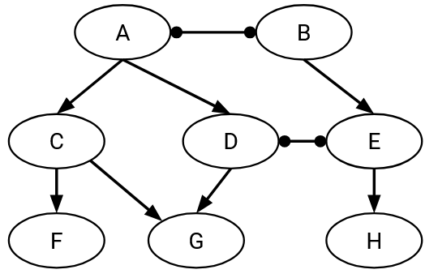

Các *stub AS* trong đồ thị chỉ là *customer*. Chúng có các cạnh đi vào, cho thấy ai cung cấp kết nối cho chúng. Tuy nhiên, chúng không có bất kỳ cạnh đi ra nào, bởi vì chúng không cung cấp kết nối cho người khác.

Ngược lại, các *transit AS* trong đồ thị là các *provider*. Các mũi tên đi ra của chúng cho thấy rằng chúng đang bán kết nối cho các tổ chức khác.

Lưu ý rằng hướng của mũi tên không cho chúng ta biết gì về hướng mà các gói tin đang được gửi. Trên thực tế, các gói tin có thể được gửi theo cả hai hướng ngay cả trên một cạnh có hướng. *Customer* thường trả tiền cho *provider* để có khả năng gửi và nhận gói tin đến và từ phần còn lại của Internet.

## Đồ thị AS là Phi chu trình (Acyclic)

Đồ thị của các mối quan hệ *customer-provider* là phi chu trình. Đồ thị không chứa bất kỳ chu trình nào bao gồm các cạnh có hướng.

Thuộc tính phi chu trình này tồn tại do những hệ quả trong thế giới thực của việc có một chu trình. Trong đời thực, một chu trình có nghĩa là A trả tiền cho B, B trả tiền cho C, và sau đó C trả tiền cho A, và việc tiền chảy từ một người quay trở lại chính họ là không hợp lý. Ngoài ra, chu trình này cũng có nghĩa là A cung cấp dịch vụ cho C, C cung cấp dịch vụ cho B, và B cung cấp dịch vụ cho A. Việc một người tự cung cấp kết nối cho chính mình cũng không hợp lý.

Để dùng một phép loại suy, hãy tưởng tượng nếu bạn trả học phí cho UC Berkeley để học các lớp, sau đó UC Berkeley trả tiền cho hệ thống UC để học các lớp, và rồi hệ thống UC lại trả tiền cho bạn để học các lớp. Mối quan hệ kinh doanh này hoàn toàn vô lý!

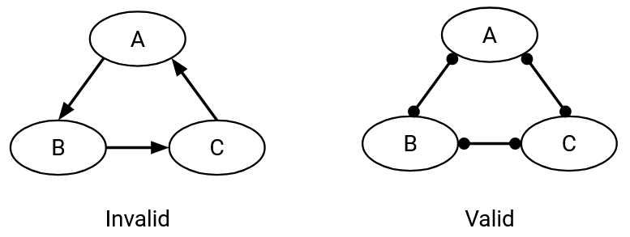

Lưu ý rằng thuộc tính phi chu trình chỉ áp dụng cho các mối quan hệ *customer-provider*. Sẽ không có vấn đề gì nếu các mối quan hệ *peer* tạo thành một chu trình. Ví dụ, không sao nếu A-B, B-C, và C-A đều là *peer*. Không ai trong số họ gửi tiền cho nhau, vì vậy chúng ta không có một mối quan hệ kinh doanh được định nghĩa sai.

## Hệ thống phân cấp Provider và các AS Cấp 1 (Tier 1)

Một hệ quả của việc đồ thị là phi chu trình là chúng ta có thể hình thành một hệ thống phân cấp các *provider*. Nói cách khác, chúng ta có thể sắp xếp các nút sao cho tất cả các mũi tên đều chỉ xuống dưới. Các *stub AS* ở dưới cùng, các *provider* ở trên cùng. Dịch vụ chảy từ các nút cao hơn xuống các nút thấp hơn. Các nút thấp hơn trả tiền lên cho các nút cao hơn.

Ở đỉnh cao nhất của hệ thống phân cấp là các ***Tier 1 autonomous systems*** (các hệ thống tự trị Cấp 1), không có *provider* nào (không có cạnh đi vào). Mọi *Tier 1 AS* đều có mối quan hệ *peer* với mọi *Tier 1 AS* khác.

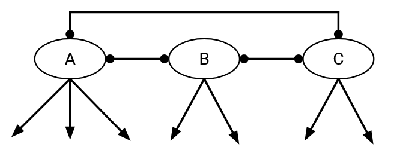

Một hệ quả của hệ thống phân cấp này là: Mọi *AS* không phải *Tier 1* đều có ít nhất một *provider* (cạnh đi vào). Điều này hợp lý trong thực tế, vì bạn phải trả tiền cho ai đó để cung cấp kết nối cho bạn.

Trong hệ thống phân cấp này, bắt đầu từ bất kỳ *AS* nào và đi theo chuỗi các *provider* lên trên, luôn luôn dẫn đến một *Tier 1 AS*. Điều này cũng hợp lý trong thực tế. Việc tất cả các *Tier 1 AS* đều có quan hệ *peer* với nhau là lý do tại sao toàn bộ Internet được kết nối (thay vì, chẳng hạn, hai đồ thị con không kết nối đại diện cho hai Internet riêng biệt nơi bạn chỉ có thể nói chuyện với các máy chủ trong nửa của mình). Để đảm bảo có một đường dẫn đến mọi *AS* khác trong đồ thị, mọi *AS* phải có một đường dẫn đi lên mà cuối cùng sẽ dẫn đến một *Tier 1 AS*.

TODO-diagram

Một số ví dụ thực tế về các *Tier 1 AS* là AT&T và Verizon (trụ sở tại Mỹ), France Telecom và Telecom Italia (trụ sở tại châu Âu), và NTT Communications (trụ sở tại Nhật Bản). Có khoảng 20 *AS* là *Tier 1* hoặc gần như *Tier 1* trong thực tế. Các *Tier 1 AS* này thường sở hữu cơ sở hạ tầng trải dài trên nhiều lục địa (ví dụ: cáp ngầm dưới biển).

Cấu trúc phân cấp của *AS graph* được định nghĩa bởi các động cơ kinh doanh và chính trị trong thế giới thực. Về lý thuyết, có thể vẽ một *AS graph* trông giống như một cây, với một *Tier 1 AS* duy nhất ở gốc cung cấp dịch vụ cho mọi *stub AS*. Tuy nhiên, điều này có nghĩa là một thực thể duy nhất trong đời thực kiểm soát toàn bộ quyền truy cập Internet của thế giới, điều này có thể không mong muốn vì lý do chính trị.

## Định tuyến Dựa trên Chính sách

Hãy nhớ lại rằng trong *intra-domain routing*, mục tiêu của chúng ta là tìm các đường dẫn hợp lệ (không có vòng lặp và không có ngõ cụt) và tốt (chi phí thấp nhất).

Trong *inter-domain routing*, chúng ta vẫn muốn các đường dẫn phải hợp lệ. Tuy nhiên, không giống như trong *intra-domain routing*, nơi không có gì đặc biệt về một *router* này so với *router* khác, mỗi *autonomous system* có các mục tiêu kinh doanh và mối quan hệ riêng với các *AS* khác (ví dụ: *customer*, *provider*, *peer*). Do đó, chúng ta sẽ cần định nghĩa lại "tốt" để phản ánh các mục tiêu và sở thích kinh doanh trong thế giới thực của các *AS*.

Để cho phép mỗi *AS* vận chuyển lưu lượng theo cách tương thích với các mục tiêu thực tế của mình, giao thức định tuyến của chúng ta sẽ cho phép mỗi *AS* đặt *policy* (chính sách) riêng. Sau đó, các đường dẫn được tính toán bởi giao thức phải tôn trọng đúng *policy* của mỗi *AS*.

Về lý thuyết, các *AS* có thể đặt bất kỳ loại *policy* nào mà họ thích, mặc dù các quy ước tiêu chuẩn vẫn tồn tại (chúng ta sẽ thảo luận tiếp theo). Dưới đây là một số ví dụ về các *policy* mà một *AS* có thể đặt:

- "Tôi không muốn vận chuyển lưu lượng của AS#2046 qua mạng của mình." (Xác định cách tôi sẽ xử lý lưu lượng từ các *AS* khác.)
- "Tôi ưu tiên lưu lượng của mình được vận chuyển bởi AS#10 thay vì AS#4." (Xác định cách các *AS* khác nên xử lý lưu lượng của tôi.)
- "Đừng gửi lưu lượng của tôi qua AS#54 trừ khi thực sự cần thiết."
- "Tôi ưu tiên AS#12 vào các ngày trong tuần và AS#13 vào cuối tuần." (*Policy* có thể thay đổi theo thời gian!)

Giao thức định tuyến không quan tâm tại sao *AS* có những sở thích này. Có thể tôi từ chối vận chuyển lưu lượng từ AS#2046 vì đó là một công ty đối thủ, nhưng giao thức không cần biết điều đó.

Các giao thức định tuyến chi phí thấp nhất của chúng ta cho đến nay không có cách nào hỗ trợ các *policy* này. Chi phí thấp nhất là một bài toán tối ưu hóa toàn cục, nơi mọi *router* đều cố gắng giải quyết cùng một vấn đề. Ngược lại, trong *Policy-Based Routing* (Định tuyến dựa trên chính sách), mỗi *AS* chỉ quan tâm đến *policy* của riêng mình, và không có một bài toán toàn cục nào mà mọi người cùng hợp tác để giải quyết.

## Các quy tắc Gao-Rexford cho Chính sách Định tuyến

Mặc dù giao thức định tuyến của chúng ta cho phép mỗi *AS* đặt bất kỳ *policy* tùy ý nào họ thích, trong thực tế, hầu hết các *AS* đặt *policy* của họ theo một số quy ước tiêu chuẩn, được gọi là ***Gao-Rexford rules*** (các quy tắc Gao-Rexford). Các quy ước này dựa trên giả định rằng các tổ chức trong thế giới thực thích kiếm tiền và không thích mất tiền.

Có hai quy tắc lớn mà các *AS* thường tuân theo. Đầu tiên, khi một *AS* có nhiều lựa chọn tuyến đường, *AS* đó ưu tiên chuyển tiếp gói tin đến chặng kế tiếp có lợi nhuận cao nhất. Cụ thể, *AS* ưu tiên một tuyến đường với chặng kế tiếp là một *customer*. Nếu không có tuyến đường nào như vậy, *AS* ưu tiên một tuyến đường với chặng kế tiếp là một *peer*. *AS* sẽ chỉ chọn một tuyến đường với chặng kế tiếp là một *provider* nếu buộc phải làm vậy, vì không có tuyến đường nào tốt hơn.

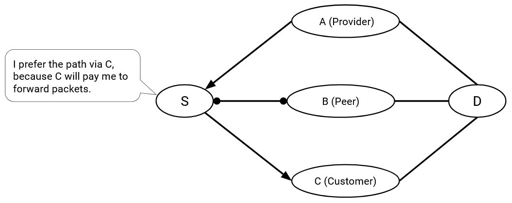

Nguyên tắc này quyết định các tuyến đường mà *AS* lựa chọn. Bạn có thể coi nguyên tắc này như một phiên bản dựa trên sở thích của việc lựa chọn đường đi trong giao thức *distance-vector*. Thay vì chọn tuyến đường ngắn nhất mà tôi biết, tôi chọn tuyến đường mà chặng kế tiếp giúp tôi kiếm tiền (*customer* là tốt nhất), hoặc tiết kiệm tiền cho tôi (nếu không có *customer* thì là *peer*), và tránh mất tiền (nếu không có *customer* hoặc *peer* thì là *provider*).

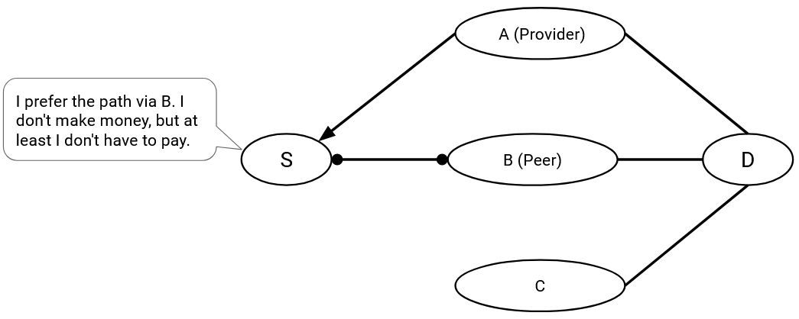

Thứ hai, các *AS* chỉ vận chuyển lưu lượng nếu họ được trả tiền cho việc đó. Không có động cơ nào để các *AS* làm việc miễn phí. Nguyên tắc này quyết định các đường dẫn mà *AS* sẵn sàng tham gia. Bạn có thể coi nguyên tắc này như một phiên bản hạn chế hơn của việc thông báo đường đi trong giao thức *distance-vector*. Thay vì quảng bá một tuyến đường đến mọi hàng xóm, cho phép bất kỳ ai chuyển tiếp gói tin qua tôi, tôi chỉ quảng bá các tuyến đường mà tôi được trả tiền để chuyển tiếp gói tin.

Một hệ quả của nguyên tắc thứ hai này là: Với tư cách là một *AS*, lưu lượng tôi vận chuyển phải đến từ một *customer*, hoặc đi đến một *customer*. Nói cách khác, đối với bất kỳ tuyến đường nào đi qua tôi, một trong những hàng xóm của tôi phải là một *customer*.

Hãy xem xét tất cả các trường hợp cụ thể.

Các tuyến đường mà cả hai hàng xóm của tôi đều là *customer* là tốt, bởi vì tôi đang được hai *customer* trả tiền để chuyển tiếp gói tin.

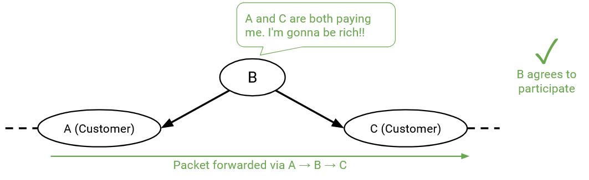

Tương tự, các tuyến đường mà một trong những hàng xóm của tôi là *customer* và một hàng xóm là *peer* là tốt, bởi vì mặc dù *peer* không trả tiền cho tôi, nhưng *customer* thì có.

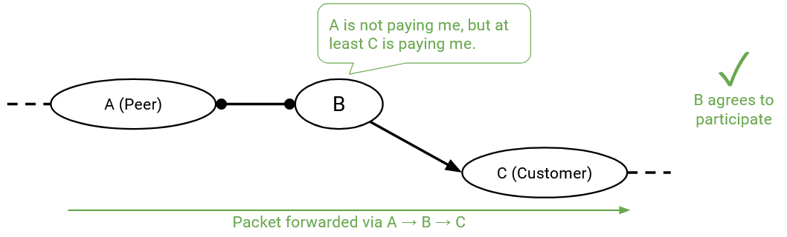

Các tuyến đường mà một trong những hàng xóm của tôi là *customer*, và hàng xóm còn lại là *provider* là tốt. Thoạt nhìn, có vẻ như đường đi này không tốt, bởi vì *customer* đang trả tiền cho tôi, và sau đó tôi lại trả tiền cho *provider*. Liệu có khả năng tôi không kiếm được đồng nào, hoặc thậm chí lỗ vốn từ giao dịch này không? Điều đó có thể đúng, nhưng nếu chúng ta không tham gia vào các tuyến đường này, chúng ta sẽ trở thành một *AS* vô dụng không có *customer*. Công việc của một *AS* là cung cấp kết nối cho người dùng của mình, và việc tham gia vào các tuyến đường *customer-AS-provider* này sẽ mở ra nhiều tuyến đường hơn đến phần còn lại của Internet.

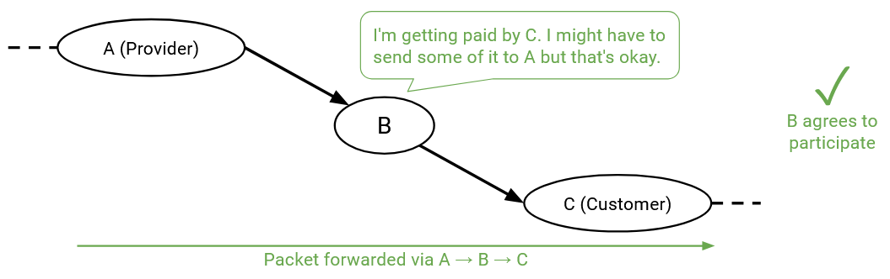

Các tuyến đường mà cả hai hàng xóm của tôi đều là *peer* là không tốt, bởi vì không bên nào trả tiền cho tôi để chuyển tiếp gói tin.

Nói chung, các *peer* không cung cấp dịch vụ chuyển tiếp giữa các *peer* khác. Xét theo cấu trúc phân cấp, một đường dẫn không nên đi ngang ở một cấp độ nhất định qua nhiều chặng.

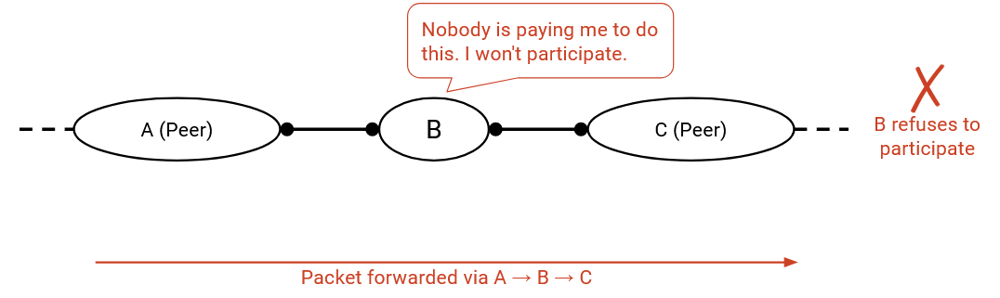

Các tuyến đường mà một trong những hàng xóm của tôi là *peer* và hàng xóm còn lại là *provider* cũng không tốt, bởi vì một lần nữa, không bên nào trả tiền cho tôi để chuyển tiếp gói tin.

Nói chung, nếu một *AS* có một liên kết *peer*, liên kết đó sẽ chỉ vận chuyển lưu lượng đến/từ các *customer* của chính nó. Nói cách khác, khi các gói tin đến B qua liên kết *peer* đó, lựa chọn có lợi nhuận duy nhất của B là chuyển tiếp gói tin đến một *customer* (không phải *provider*, và không phải một *peer* khác). Tương tự, các gói tin từ *customer* có thể được chuyển tiếp qua liên kết *peer* (*customer* trả tiền), nhưng các gói tin từ *provider* và *peer* không thể được chuyển tiếp qua liên kết *peer* (không ai trả tiền).

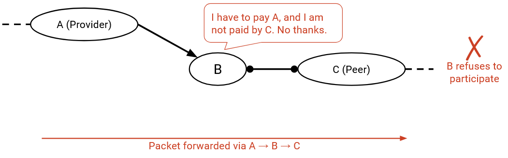

Tương tự, các tuyến đường mà cả hai hàng xóm của tôi đều là *provider* là không tốt, bởi vì tôi phải trả tiền cho cả hai bên để chuyển tiếp gói tin, và không ai trả tiền cho tôi để làm việc này.

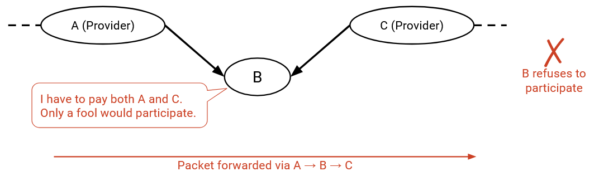

## Ví dụ về các quy tắc Gao-Rexford

*Policy* để chọn tuyến đường (*customer* tốt nhất, *provider* tệ nhất), và *policy* để thông báo tuyến đường (chỉ thông báo và tham gia vào các tuyến đường mà một trong những hàng xóm của tôi là *customer*) sẽ được sử dụng trong giao thức đã sửa đổi của chúng ta để tính toán các tuyến đường tôn trọng *policy* của mỗi *AS*. Chúng ta chưa nói về cách tính toán tuyến đường, nhưng với một tuyến đường cho trước, chúng ta có thể kiểm tra xem nó có thỏa mãn hai *policy* này không.

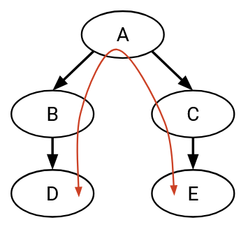

Trong ví dụ này, giả sử một máy tính trong D (một *stub AS*) muốn nói chuyện với một máy tính trong E (một *stub AS* khác). D và E có thể muốn trao đổi tin nhắn (hãy nhớ, mũi tên đại diện cho mối quan hệ *customer/provider*, không phải hướng của gói tin).

Một đường dẫn khả dĩ cho lưu lượng là D, B, A, C, E (và ngược lại cho các tin nhắn từ E đến D).

Ai đang trả tiền cho ai trong đường dẫn này? Vì lưu lượng đang được gửi dọc theo liên kết D-B, *customer* (D) phải trả tiền cho *provider* (B). Tương tự, E phải trả tiền cho C, và cả B và C đều phải trả tiền cho A.

Liệu các *transit AS* A, B, và C có đồng ý thông báo và tham gia vào tuyến đường này không? Hãy kiểm tra từng hàng xóm của chúng.

Các hàng xóm của A dọc theo đường dẫn này đều là *customer*, vì vậy A đang kiếm tiền và cho rằng đường dẫn này tốt.

Các hàng xóm của B là một *customer* (D) và một *provider* (A). B đang kiếm tiền từ *customer* (D), và cho rằng đường dẫn này tốt. (Hãy nhớ rằng, các đường dẫn có một hàng xóm là *customer* và một hàng xóm là *provider* là tốt, ngay cả khi *AS* có lợi nhuận ròng bằng 0, bởi vì chúng cho phép kết nối rộng hơn.)

Tương tự, C có ít nhất một hàng xóm là *customer* (E), vì vậy nó cũng cho rằng tuyến đường này tốt.

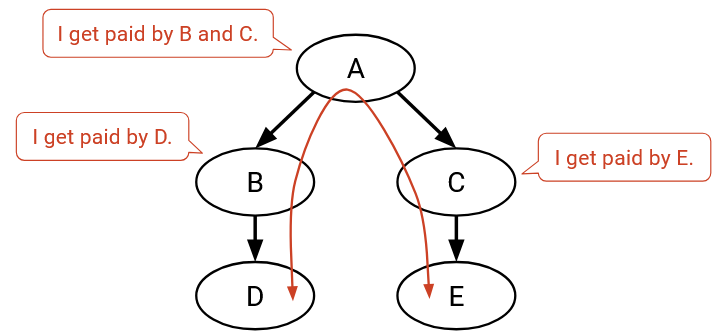

Thay vì cả B và C đều trả tiền cho A, có lẽ họ chọn thiết lập một mối quan hệ *peer*, điều này làm thay đổi *AS graph*:

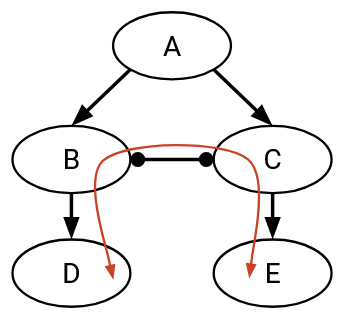

Bây giờ, một đường dẫn khả dĩ khác cho lưu lượng là D, B, C, E. Lúc này, D vẫn cần trả tiền cho B, và E vẫn phải trả tiền cho C. Tuy nhiên, B và C không còn cần trả tiền cho A, và họ không trả tiền cho nhau (mối quan hệ *peer*).

Một lần nữa, chúng ta có thể kiểm tra xem các *transit AS* trên đường dẫn này, cụ thể là B và C, có đồng ý thông báo và tham gia vào tuyến đường này không. Các hàng xóm của B là một *customer* (D) và một *provider* (C). B đang kiếm tiền từ *customer* (D), và cho rằng đường dẫn này tốt. Tương tự, C có ít nhất một hàng xóm là *customer* (E), vì vậy C cũng cho rằng tuyến đường này tốt.

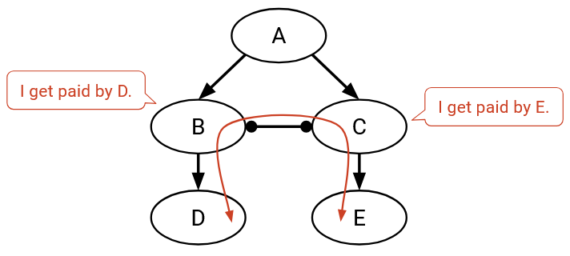

Chúng ta vừa lý giải rằng có hai đường dẫn tốt có thể được sử dụng để gửi tin nhắn từ D đến E. Bây giờ, B phải quyết định chuyển tiếp qua đường dẫn B-A-C-E, hoặc đường dẫn B-C-E. B nên chọn đường dẫn nào? Theo nguyên tắc đầu tiên của chúng ta, B ưu tiên đường dẫn có lợi nhuận cao nhất (không phải đường dẫn ngắn nhất). Trong B-A-C-E, chặng kế tiếp là *provider* A (người mà chúng ta phải trả tiền), và trong B-C-E, chặng kế tiếp là *peer* C (không cần thanh toán). Do đó, B sẽ chọn đường dẫn qua C, cho ra đường dẫn cuối cùng là D-B-C-E.

Lưu ý: Dường như B và C đang tiết kiệm tiền với mối quan hệ *peer* bổ sung, vậy tại sao không phải mọi *AS* đều thiết lập mối quan hệ *peer* để tiết kiệm tiền? Trong thực tế, việc thiết lập một liên kết cũng đòi hỏi phải lắp đặt cơ sở hạ tầng vật lý (ví dụ: đặt cáp ngầm), vì vậy có một sự đánh đổi về chi phí khi thiết lập các mối quan hệ mới giữa các *AS*, để đổi lấy các tuyến đường rẻ hơn.

## Các tuyến đường không có dạng Thung lũng (Valley-Free)

Nói chung, các đường dẫn trong *AS graph* luôn ***valley-free*** (không có dạng thung lũng).

Xét theo cấu trúc phân cấp, nếu một đường dẫn bao gồm một chặng đi ngang qua một liên kết *peer*, chặng kế tiếp ngay lập tức cần phải đi xuống dốc đến một *customer*. Chặng kế tiếp không thể lại đi ngang (cả hai hàng xóm đều là *peer*), và chặng kế tiếp không thể đi lên dốc đến một *provider* (hàng xóm là *peer* và *provider*).

Xét theo cấu trúc phân cấp, nếu một đường dẫn bao gồm một chặng đi xuống dốc từ *provider* đến *customer*, chặng kế tiếp ngay lập tức phải tiếp tục đi xuống dốc đến một trong những *customer* của nó. Chặng kế tiếp không thể lại đi ngang (các hàng xóm là *provider* và *peer*), và chặng kế tiếp không thể đi lên dốc (cả hai hàng xóm đều là *provider*).

Nếu một liên kết đi xuống phải được theo sau bởi một liên kết đi xuống khác, thì chúng ta có thể kết luận rằng ngay khi bạn có một liên kết đi xuống trong một đường dẫn, tất cả các liên kết tiếp theo cũng phải đi xuống. Một thung lũng là một đường dẫn đi xuống, và sau đó quay đầu để bắt đầu đi lên. Các đường dẫn không thể chứa thung lũng, bởi vì một khi bạn bắt đầu đi xuống, bạn phải tiếp tục đi xuống cho đến tận đích.

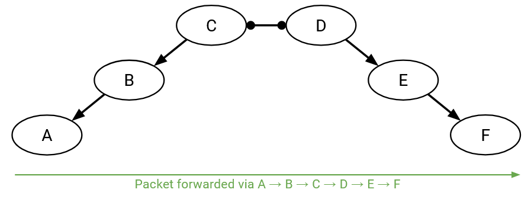

Tóm lại, đây là các quy tắc chúng ta đã rút ra (mặc dù tốt hơn là nên hiểu chúng dưới góc độ tôn trọng sở thích về tiền bạc của *AS*, thay vì học thuộc lòng):

- Một liên kết đi lên có thể được theo sau bởi một liên kết *peer*, một liên kết đi xuống, hoặc một liên kết đi lên khác. (Nếu chặng trước trả tiền cho tôi, tôi sẵn lòng chuyển tiếp gói tin cho bất kỳ ai.)
- Một liên kết *peer* chỉ có thể được theo sau bởi một liên kết đi xuống. (Nếu chặng trước không trả tiền cho tôi, tôi cần chặng kế tiếp là một *customer* trả tiền cho tôi.)
- Một liên kết đi xuống chỉ có thể được theo sau bởi một liên kết đi xuống. (Nếu chặng trước là một *provider* mà tôi đang trả tiền, tôi cần chặng kế tiếp là một *customer* trả tiền cho tôi.)

Những quy tắc này có nghĩa là các tuyến đường luôn *valley-free* và có một đỉnh duy nhất. Một tuyến đường có thể bắt đầu bằng 0 hoặc nhiều liên kết đi lên. Cuối cùng, nó sẽ đạt đến một đỉnh duy nhất, và đi qua 0 hoặc 1 liên kết *peer*. Sau đó, tuyến đường phải bắt đầu đi xuống cho đến tận đích (không còn di chuyển ngang hoặc lên nữa).

Các đường dẫn không thể có thung lũng (đi xuống rồi quay đầu đi lên). Ngoài ra, các đường dẫn không thể có các bước di chuyển ngang ở bất kỳ đâu ngoại trừ đỉnh. Ngay khi bạn thực hiện một bước di chuyển ngang, bạn phải quay đầu và đi xuống. Bạn không thể tiếp tục di chuyển ngang hoặc đi lên.

## Các AS muốn Quyền tự chủ và Quyền riêng tư

Khi thiết kế một giao thức để tính toán các tuyến đường liên miền, giao thức của chúng ta nên tôn trọng *autonomy* (quyền tự chủ) và *privacy* (quyền riêng tư) của mỗi *AS*.

Các *AS* muốn ***autonomy***, sự tự do lựa chọn các *policy* tùy ý của riêng mình, mà không cần phối hợp với các *AS* khác, hoặc lo lắng về những *policy* mà giao thức cho phép. Trong thực tế, các *policy* thường tuân theo các nguyên tắc dựa trên tiền bạc mà chúng ta đã mô tả, nhưng giao thức không nên buộc *AS* phải tuân theo bất kỳ *policy* cụ thể nào.

Các *AS* cũng muốn ***privacy***. Các *AS* không muốn phải nói rõ cho những người khác trong mạng về sở thích và *policy* của họ. Ví dụ, một *AS* không nên cần phải công khai cho mọi người biết về việc các hàng xóm của nó là *peer*, *customer*, hay *provider*. Điều này phản ánh các chiến lược kinh doanh trong thế giới thực. Với tư cách là một công ty, bạn có thể không muốn tiết lộ thông tin về *customer* và *provider* của mình cho các đối thủ.

Lưu ý rằng định nghĩa của chúng ta về *privacy* nói rằng các *AS* không cần phải tiết lộ *một cách rõ ràng* các *policy* của họ. Trong thực tế, các *AS* vẫn cần phối hợp với phần còn lại của mạng để thống nhất về các đường dẫn qua mạng, vì vậy một lượng thông tin bị rò rỉ là không thể tránh khỏi. Các kỹ thuật đảo ngược (reverse-engineering) tồn tại để theo dõi các tuyến đường mà gói tin đang đi qua mạng.

Ví dụ, việc những người khác trên mạng có thể khám phá ra một gói tin đang đi theo tuyến đường nào là không thể tránh khỏi. Tuy nhiên, giao thức của chúng ta không nên buộc một *AS* phải nói với thế giới rằng "Tôi thích đường dẫn này hơn đường dẫn kia." Chúng ta cũng không nên buộc một *AS* phải tiết lộ ai là *provider*, *peer*, và *customer* của họ.