# Triển khai (Implementation) và các vấn đề của BGP

## Router Biên và Router Nội bộ

Đến thời điểm này, chúng ta đã có một hình dung trực quan về cách *BGP* (Giao thức Cổng Biên giới - Border Gateway Protocol) hoạt động giữa các *AS* (Hệ tự trị - Autonomous System). Trong phần này, chúng ta sẽ xem cách *BGP* thực sự được triển khai ở cấp độ *Router*. Khi làm như vậy, chúng ta cũng sẽ chỉ ra cách *BGP* tương tác với các *routing protocol* nội miền đã học trước đó.

Cho đến nay, mô hình định tuyến liên miền của chúng ta đã coi toàn bộ một *AS* như một thực thể duy nhất, nhập và xuất các đường đi.

Tuy nhiên, trên thực tế, *AS* chứa nhiều *Router* (và các máy chủ) được kết nối bởi các liên kết.

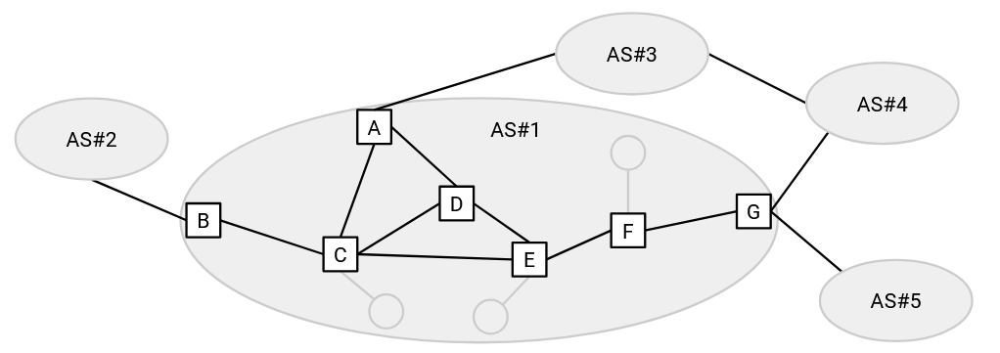

Để thực sự triển khai *BGP*, chúng ta cần tất cả các *Router* bên trong *AS* hoạt động hợp tác để đóng vai trò như một nút duy nhất.

Trong một *AS*, chúng ta sẽ phân loại tất cả các *Router* thành hai loại. ***Border routers* (Router biên)** có ít nhất một liên kết đến một *Router* trong một *AS* khác. ***Interior routers* (Router nội bộ)** chỉ có liên kết đến các *Router* khác trong cùng một *AS*.

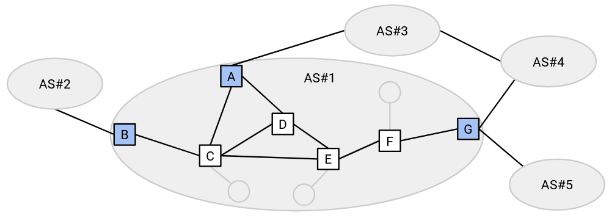

Chỉ có *border routers* cần quảng bá các tuyến đường đến các *AS* khác. Đôi khi, chúng ta gọi các *Router* quảng bá các tuyến *BGP* là ***BGP speakers* (các bộ phát BGP)**. Các *BGP speakers* cần hiểu ngữ nghĩa và cú pháp của giao thức *BGP* (cách đọc và tạo một thông báo *BGP*, phải làm gì khi nhận được một thông báo, v.v.).

## Các phiên BGP Ngoài và BGP Nội bộ

Một ***BGP session* (phiên BGP)** bao gồm hai *Router* trao đổi thông tin với nhau.

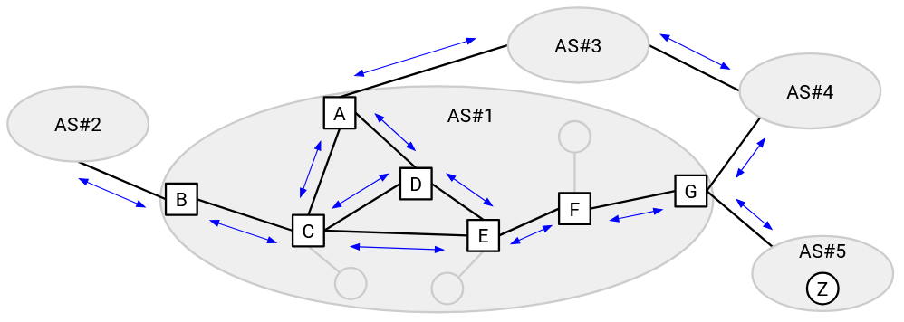

Một ***external BGP (eBGP) session* (phiên BGP ngoại)** là giữa hai *Router* từ các *AS* khác nhau. Các *eBGP session* có thể được sử dụng để trao đổi các thông báo giữa các *AS* khác nhau và tìm hiểu về các tuyến đường đến các *AS* khác. Chỉ có *border routers* tham gia vào các *eBGP session* (vì *eBGP* yêu cầu giao tiếp với một *AS* khác).

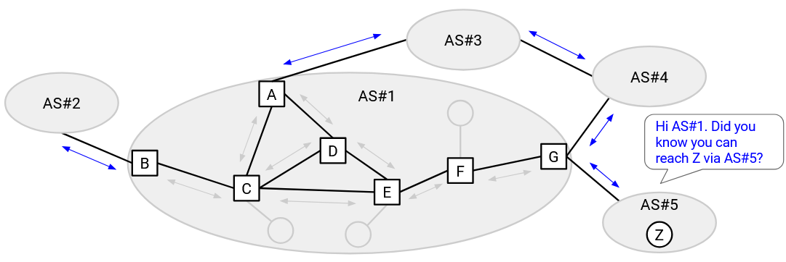

Ngược lại, một ***internal BGP (iBGP) session* (phiên BGP nội)** là giữa hai *Router* trong cùng một *AS* (không nhất thiết phải kết nối trực tiếp bằng một liên kết). Cụ thể hơn, nếu một *border router* biết về một tuyến đường mới, nó có thể sử dụng *iBGP* để phân phối tuyến đường mới đó đến các *Router* khác trong *AS*. Điều này cho phép tất cả các *Router* trong *AS* phối hợp và hoạt động cùng nhau như một thực thể. Cả *border router* và *internal router* đều tham gia vào các *iBGP session*.

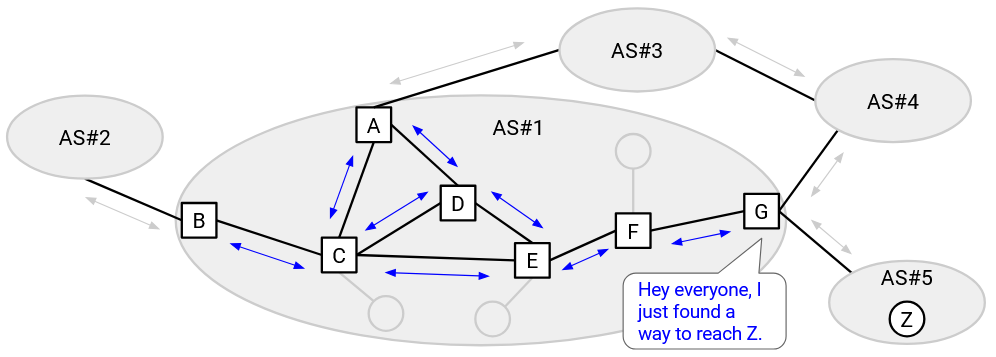

Các *eBGP session* và *iBGP session* khác với ***interior gateway protocols (IGP)* (các giao thức cổng nội bộ)**. Đây là các *routing protocol* nội miền (ví dụ: *distance-vector*, *link-state*) được triển khai trong một *AS* để định tuyến các *packet* bên trong *AS*.

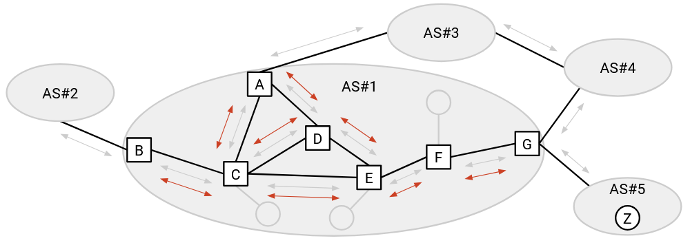

Rất dễ nhầm lẫn giữa *iBGP* và *IGP*. Cả hai đều trao đổi thông điệp trong cùng một *AS*. Tuy nhiên, *iBGP* là một phần của giao thức liên miền, giúp các *Router* tìm hiểu về các đường đi đến các *AS* khác. *IGP* là một giao thức nội miền, giúp các *Router* tìm hiểu về các đường đi đến các đích trong cùng một *AS*.

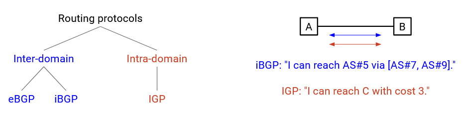

*eBGP*, *iBGP*, và *IGP* làm việc cùng nhau để thiết lập các tuyến đường từ bất kỳ *Router* nào đến bất kỳ *Router* nào khác trên Internet (ngay cả khi các *Router* ở trong các *AS* khác nhau).

Đầu tiên, mỗi *AS* chạy *IGP* để tìm hiểu các đường đi có chi phí thấp nhất giữa hai *Router* bất kỳ bên trong cùng một *AS*.

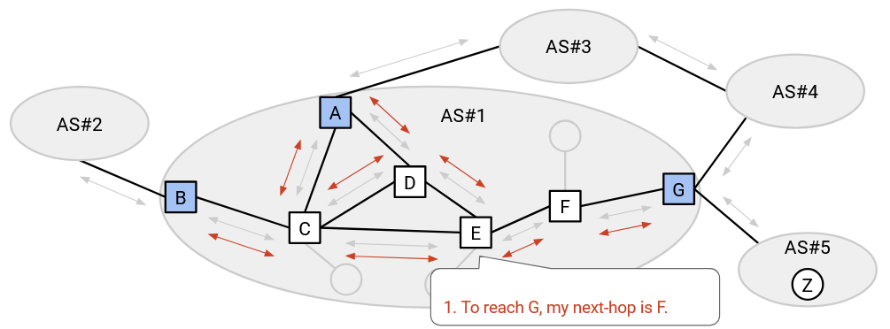

Tiếp theo, các *AS* chạy *eBGP*, quảng bá các tuyến đường cho nhau để tìm hiểu về các tuyến đường đến các *AS* khác.

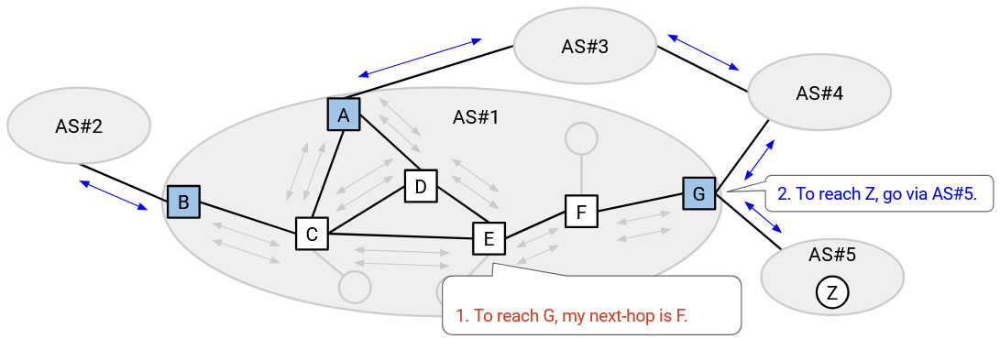

Cuối cùng, các *AS* chạy *iBGP*, để một *Router* đã biết về một tuyến đường bên ngoài có thể phân phối tuyến đường đó đến tất cả các *Router* khác trong cùng *AS*.

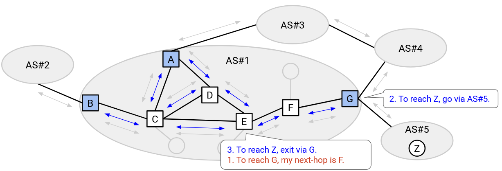

Các tuyến đường học được từ *eBGP*, *iBGP*, và *IGP* có thể được sử dụng để gửi *packet* đến bất kỳ đâu trên Internet. Nếu đích nằm trong cùng một *AS* (cùng tiền tố IP), chúng ta có thể sử dụng các tuyến đường học được từ *IGP* để chuyển tiếp *packet*. Nếu đích ở một *AS* khác (tiền tố IP khác), chúng ta có thể nghĩ lại về *iBGP*, thứ đã cho chúng ta biết về bất kỳ tuyến đường bên ngoài nào được phát hiện bởi bất kỳ ai trong *AS* của tôi. Sử dụng kết quả của *iBGP*, chúng ta có thể tìm ra *border router* nào nằm trên tuyến đường bên ngoài đó. Sau đó, chúng ta có thể sử dụng *IGP* để chuyển tiếp *packet* đến đúng *border router* (sau đó nó sẽ chuyển tiếp *packet* đến *AS* tiếp theo).

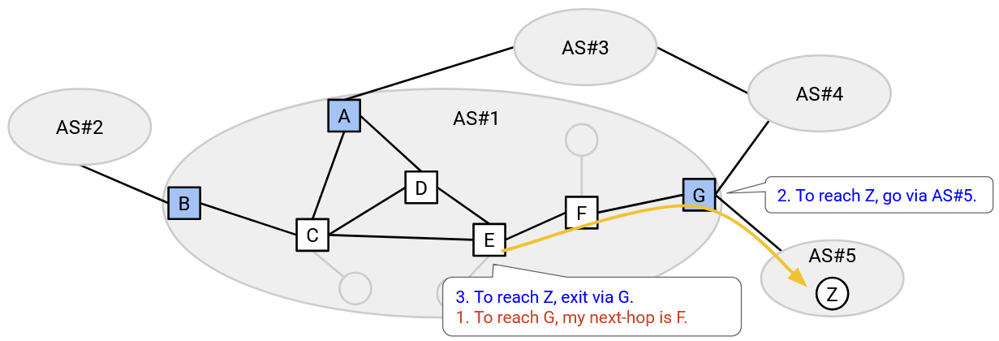

Ví dụ cụ thể, giả sử E muốn gửi *packet* đến Z. Đầu tiên, mọi *Router* trong *AS* của E chạy *IGP*, học tất cả các tuyến đường nội bộ. Tiếp theo, một *Router* nào đó trong AS#5 quảng bá một tuyến đường đến Z bằng *eBGP*. Tại thời điểm này, chỉ có G biết rằng nó có thể đến được Z. Cuối cùng, G thông báo cho tất cả các *Router* trong *AS* của mình rằng nó có thể đến được Z, bằng cách sử dụng *iBGP*.

E đã nghe từ *iBGP* rằng G, một *Router* trong cùng *AS*, có thể đến được Z. Sử dụng các tuyến đường *IGP*, E có thể gửi *packet* đến G (chuyển tiếp đến F trước). Sau đó, G có thể sử dụng tuyến đường đã học trong *eBGP* để gửi *packet* đến Z.

*border router* quảng bá một tuyến đường đến một đích bên ngoài đôi khi được gọi là ***egress router* (router đầu ra)** cho đích đó. Đây là *Router* có thể giúp *packet* của bạn thoát khỏi mạng cục bộ và di chuyển đến các mạng khác gần đích hơn. Trong ví dụ trên, G là *egress router* cho đích Z.

Một hệ quả của các giao thức này là mọi *Router* đều có hai *forwarding table*. Một bảng là ánh xạ tất cả các đích nội bộ (cùng *AS*) tới một chặng tiếp theo, được điền thông tin từ *IGP*. Bảng còn lại là ánh xạ tất cả các đích bên ngoài tới một *egress router* (nơi biết một tuyến đường đến đích bên ngoài), được điền thông tin từ *eBGP*.

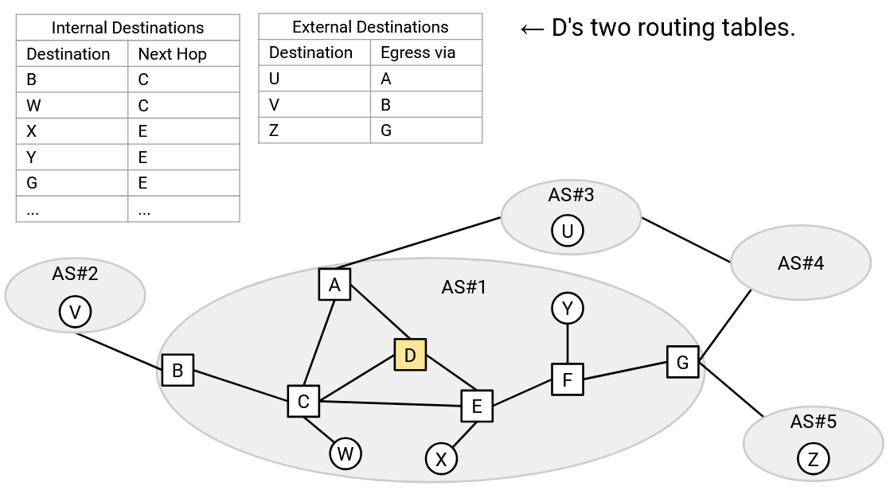

Lưu ý rằng trong bảng *eBGP*, *egress router* không nhất thiết là một chặng tiếp theo. *egress router* có thể cách xa vài chặng cục bộ, nhưng chúng ta sử dụng *IGP* để đến được *egress router* đó.

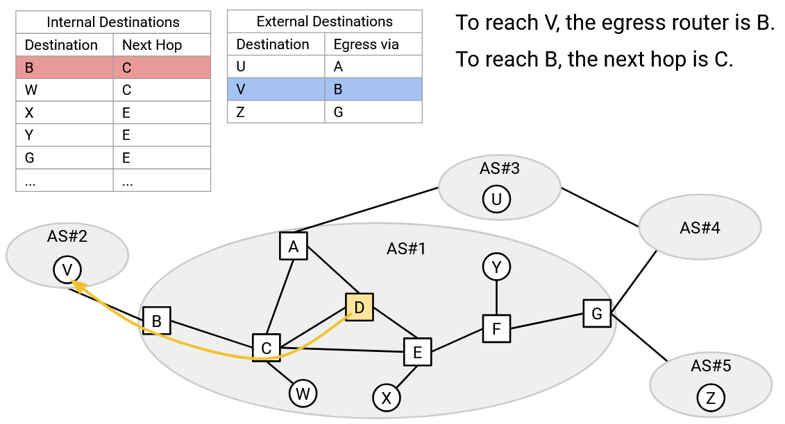

Chúng ta đã thấy cách *eBGP* (path-vector, quảng bá tuyến đường) và *IGP* (distance-vector hoặc link-state) được triển khai dưới dạng thuật toán. *iBGP* được triển khai như thế nào? Khi một *border router* cài đặt một tuyến đường mới đến một đích, nó phải thông báo cho các *Router* khác trong *AS*. Một giải pháp đơn giản là để *border router* trực tiếp thông báo cho mọi *Router* khác trong *AS*.

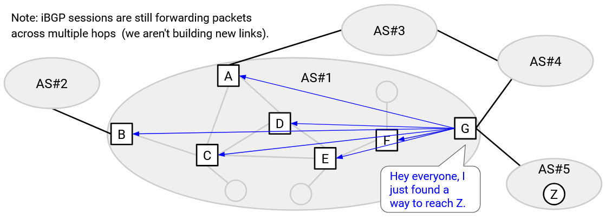

Giải pháp này tương đối đơn giản, mặc dù nó yêu cầu mọi *border router* phải có một *iBGP session* với mọi *Router* khác. Trong một mạng có B *border router* và tổng cộng N *Router*, giao thức này sẽ yêu cầu BN kết nối *iBGP*, và có thể không mở rộng tốt khi các mạng cục bộ lớn hơn.

Lưu ý: Trong thực tế, có những cách khác để kết hợp các *router* liên miền và nội miền. Bạn có thể tìm hiểu về "route reflectors" nếu bạn quan tâm, mặc dù chúng sẽ không được đề cập trong lớp học này.

## Nhiều liên kết giữa các AS: Định tuyến Khoai tây nóng

Cho đến nay, trong biểu đồ *AS* của chúng ta, chúng ta đã thể hiện hai *AS* có một liên kết (cạnh) duy nhất giữa chúng nếu chúng được kết nối. Trong thực tế, vì một *AS* thực sự bao gồm nhiều *Router*, hai *AS* có thể được kết nối bởi nhiều liên kết.

Trong thực tế, việc có nhiều liên kết giữa các *AS* lớn có thể hữu ích. Ví dụ, Verizon và AT&T là những *AS* rất lớn với cơ sở hạ tầng trên toàn nước Mỹ. Giả sử chỉ có một liên kết giữa hai *AS* ở bờ Tây. Nếu một *Router* của Verizon ở bờ Đông và một *Router* của AT&T ở bờ Đông muốn liên lạc, *packet* sẽ phải đi xuyên quốc gia trên mạng của Verizon, đi qua liên kết vào mạng của AT&T, và sau đó đi ngược lại xuyên quốc gia đến đích.

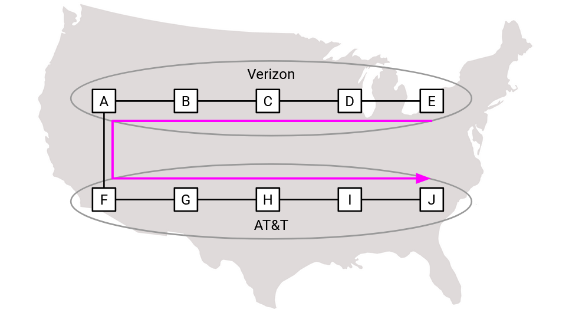

Nhiều liên kết giữa hai *AS* cũng có nghĩa là có thể có nhiều đường đi giữa hai *Router* đi qua cùng các *AS*. Ở cấp độ *AS*, cả hai đường đi này đều đi qua cùng các *AS*, và mô hình trước đó của chúng ta không phân biệt giữa chúng. Tuy nhiên, trong mô hình chi tiết hơn của chúng ta, cả hai đường đi cần được xuất ra, và một tuyến đường ưu tiên phải được nhập vào.

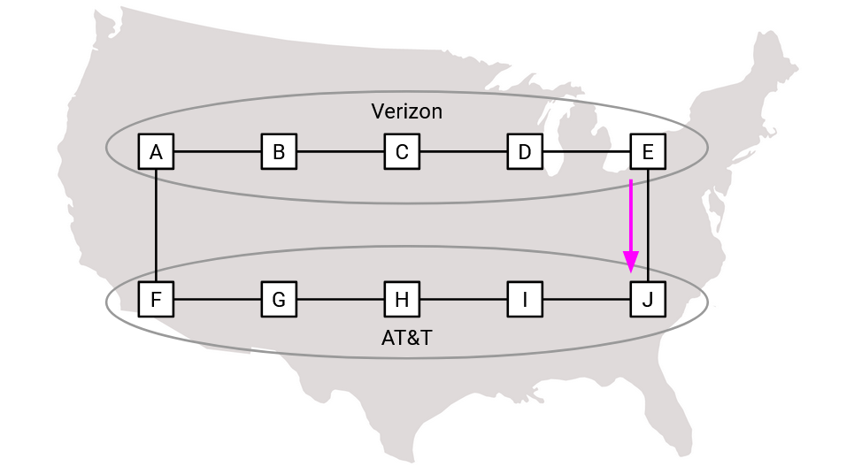

Nếu có hai tuyến đường, *AS* nhập sẽ ưu tiên tuyến đường nào?

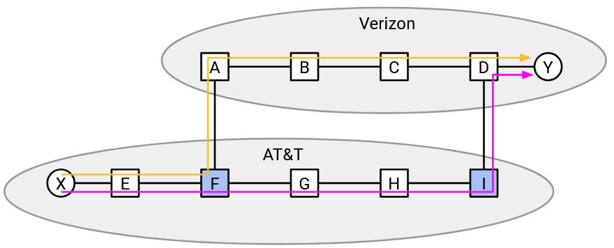

*Bandwidth* tốn tiền, vì vậy tôi sẽ ưu tiên nếu lưu lượng này đi càng xa càng tốt trên cơ sở hạ tầng do người khác sở hữu và chi trả, và đi càng ít càng tốt trên cơ sở hạ tầng của riêng tôi. Do đó, đường màu cam được ưu tiên.

Chính thức hơn, *AS* nhập nhận được hai thông báo: một từ *router* phía Tây, và một từ *router* phía Đông.

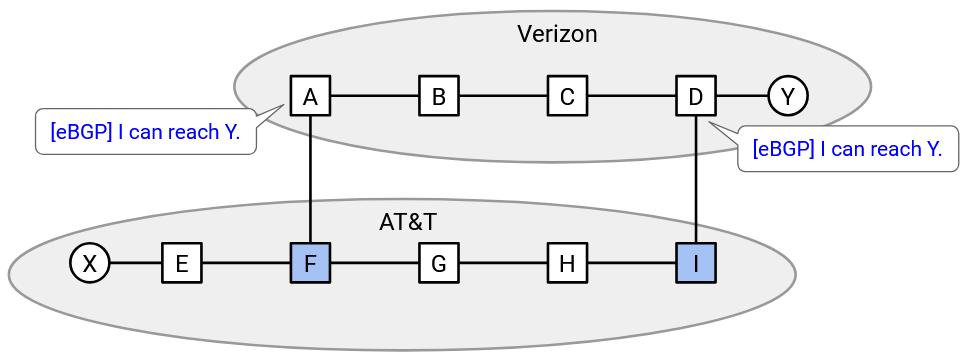

Sử dụng *iBGP*, mọi *Router* bên trong *AS* đều thấy cả hai thông báo. Một thông báo nói rằng, *egress router* là *router* phía Tây, và thông báo còn lại nói rằng, *egress router* là *router* phía Đông. Mọi *Router* phải quyết định nên nhập thông báo nào.

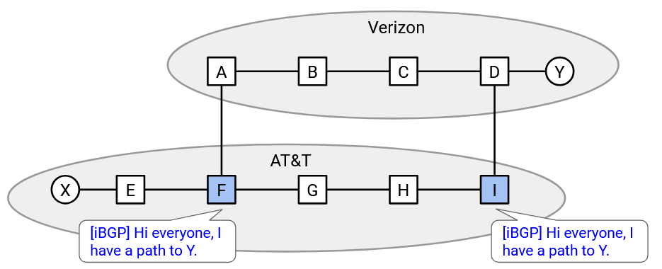

Hãy tập trung vào *Router* E. Sử dụng *IGP*, *Router* này có thể tìm ra khoảng cách đến *egress router* phía Tây (F), và khoảng cách đến *egress router* phía Đông (I). Vì *egress router* phía Tây (F) gần hơn, việc định tuyến *packet* qua *egress router* phía Tây (F) sẽ sử dụng ít *bandwidth* của *AS* này hơn. Do đó, *Router* này sẽ nhập đường đi qua *egress router* phía Tây (F). Một *Router* khác, chẳng hạn như một *Router* gần *egress router* phía Đông (I) hơn, có thể quyết định nhập một đường đi khác.

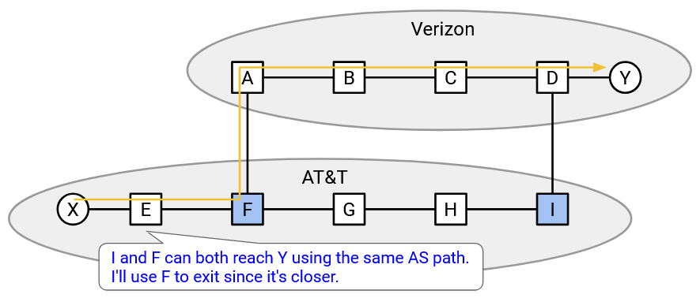

Chiến lược chọn *egress router* gần nhất này đôi khi được gọi là ***hot potato routing* (định tuyến khoai tây nóng)**. Chúng ta muốn *packet* rời khỏi *AS* của mình càng sớm càng tốt, và bắt đầu di chuyển trên các liên kết của người khác càng sớm càng tốt.

## Nhiều liên kết giữa các Router: MED

Điều gì sẽ xảy ra nếu một *Router* cách đều cả hai *egress router* có thể có?

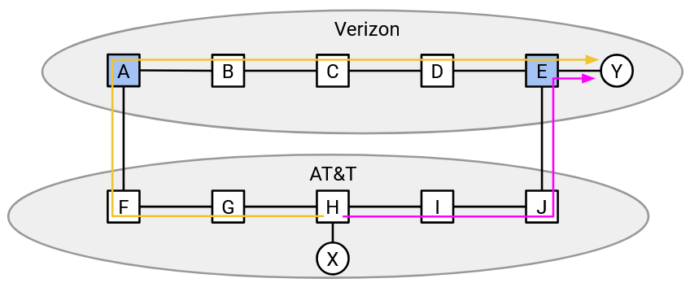

Để phá vỡ thế cân bằng, *AS* xuất có thể thông báo ưu tiên cho một tuyến đường hơn tuyến đường kia.

*AS* xuất ưu tiên tuyến đường nào? Một lần nữa, vì *bandwidth* tốn tiền, *AS* xuất ưu tiên đường màu hồng, vì nó sử dụng ít *bandwidth* của mình hơn. Trong thông báo của đường màu hồng, *AS* xuất có thể nói thêm "Tôi ưu tiên nếu bạn sử dụng đường này," và trong thông báo của đường màu cam, *AS* xuất có thể nói thêm "Tôi ưu tiên nếu bạn tránh đường này."

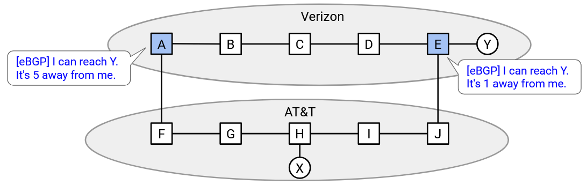

Bây giờ, *Router* cách đều cả hai *egress router* có thể thấy thông tin bổ sung này trong thông báo *iBGP*.

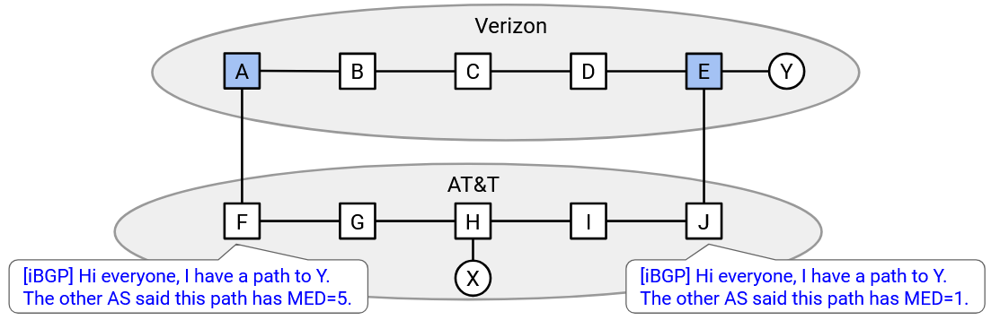

Sử dụng thông tin bổ sung này, *Router* có thể chọn *egress router* trên đường màu hồng, vì *AS* xuất đã ưu tiên đường này.

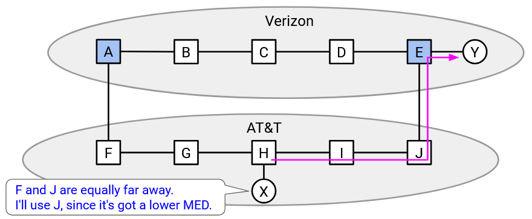

Thông tin bổ sung này trong thông báo xuất được gọi là ***Multi-Exit Discriminator (MED)* (Bộ phân biệt đa lối ra)**. Từ góc độ của bên xuất, nó chỉ ra *Router* ưu tiên của tôi để vào mạng của tôi. Từ góc độ của bên nhập, nó chỉ ra *Router* ưu tiên của *AS* khác để thoát khỏi mạng của tôi và vào mạng của *AS* kia.

Một cách khác để diễn giải *MED* là, khoảng cách đến đích, thông qua *Router* này. Bên xuất có thể nói, " *router* bờ Tây cách đích 3 chặng," và " *router* bờ Đông cách đích 12 chặng." Các số *MED* thấp hơn được ưu tiên, vì bên xuất muốn sử dụng càng ít *bandwidth* của mình càng tốt. Bên xuất thà sử dụng 3 liên kết của mình, thay vì 12 liên kết của mình.

## Ưu tiên Chính sách Nhập

Mô hình chi tiết hơn của chúng ta, nơi hai *AS* có thể được kết nối bằng nhiều liên kết, có nghĩa là bây giờ chúng ta có thêm các quy tắc chính sách nhập, ngoài các quy tắc Gao-Rexford. Khi bạn nhận được nhiều thông báo cho cùng một đích, hãy chọn một đường đi dựa trên các quy tắc phá vỡ thế cân bằng này, theo thứ tự sau:

1.  Sử dụng ***Gao-Rexford rules* (các quy tắc Gao-Rexford)**. Chọn đường đi được quảng bá bởi một khách hàng, hơn đường đi được quảng bá bởi một đối tác ngang hàng, hơn đường đi được quảng bá bởi một nhà cung cấp.
2.  Nếu nhiều đường đi có cùng mức độ ưu tiên Gao-Rexford (ví dụ: hai đường đi từ khách hàng), hãy chọn **đường đi ngắn hơn** (đường đi qua ít *AS* hơn).
3.  Nếu nhiều đường đi có cùng độ dài, hãy chọn đường đi có ***egress router* gần hơn** (sử dụng *IGP* để tìm khoảng cách đến mỗi *egress router*).
4.  Nếu nhiều đường đi có cùng khoảng cách đến *egress router*, hãy chọn đường đi có ***MED* thấp hơn** (trong đó *MED* được bao gồm trong quảng bá).
5.  Nếu nhiều đường đi có cùng *MED*, **phá vỡ thế cân bằng một cách tùy ý** (ví dụ: chọn *Router* có địa chỉ IP thấp hơn).

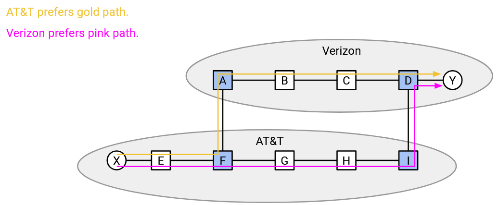

Lưu ý rằng *egress router* gần nhất (*hot potato routing*) và *MED* thường mâu thuẫn với nhau. Mọi *AS* đều muốn giảm thiểu việc sử dụng *bandwidth* của mình, và muốn *packet* được vận chuyển trên *bandwidth* của các *AS* khác.

Với tư cách là *AS* xuất, tôi muốn *packet* vào *AS* của mình càng gần đích càng tốt. Điều này có nghĩa là tôi muốn *AS* nhập mang *packet* đi rất xa (đường dài đến *egress router*).

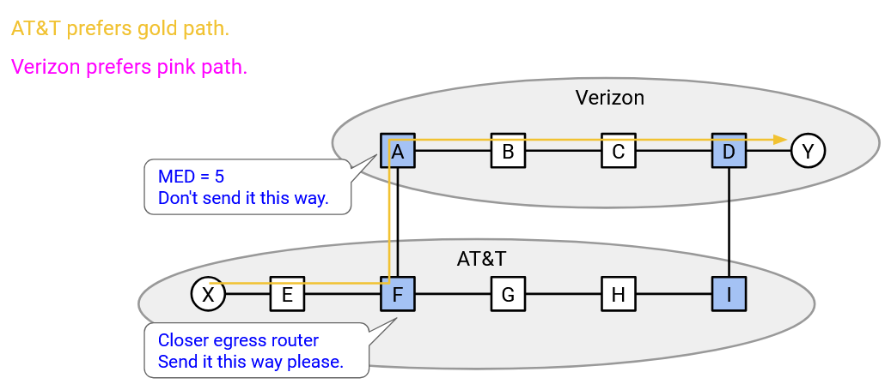

Ngược lại, với tư cách là *AS* nhập, tôi muốn mang *packet* đi càng ít càng tốt (đường ngắn đến *egress router*). Điều này có nghĩa là tôi muốn *packet* vào *AS* kia càng xa đích càng tốt (buộc *AS* kia phải làm tất cả công việc).

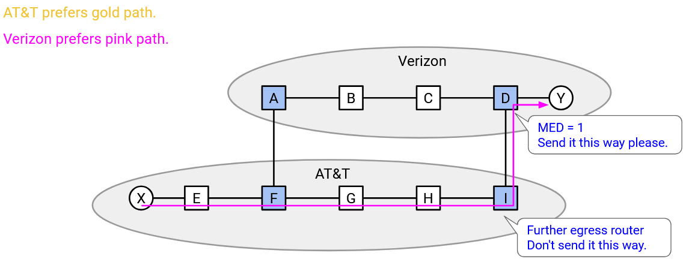

Một hệ quả của sự mâu thuẫn này là các đường đi qua Internet thường không đối xứng. Nếu hai máy chủ đang gửi *packet* qua lại, đường đi theo một hướng có thể khác với đường đi theo hướng ngược lại.

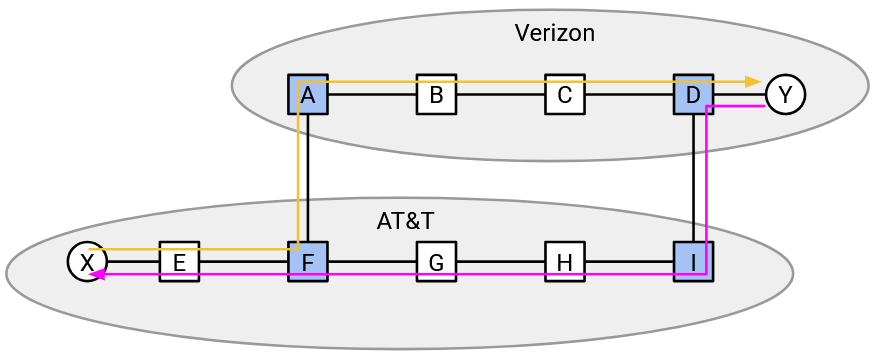

Trong ví dụ này, đối với các *packet* đi về phía Đông, A chọn *egress router* phía Tây và buộc B phải mang lưu lượng đi gần hết quãng đường. Ở chiều ngược lại (về phía Tây), B chọn *egress router* phía Đông, và buộc A phải mang lưu lượng đi gần hết quãng đường.

Về cơ bản, *BGP* cho phép hành vi này vì mọi *AS* đều được cấp quyền tự chủ để đặt chính sách của riêng mình (ở đây, chính sách đó là *hot potato routing*).

Trong thực tế, đôi khi các *AS* sẽ cố gắng thực hiện các chiến lược thông minh hơn để lừa các *AS* khác mang *packet* đi xa hơn. Hoặc, một *AS* có *bandwidth* tốt hơn có thể đồng ý mang lưu lượng của bạn đi xa hơn, nếu bạn trả một khoản phí cao cấp.

## Các loại thông điệp BGP và Thuộc tính tuyến đường

Hãy nhớ lại rằng một giao thức phải xác định cú pháp và ngữ nghĩa. Cụ thể, *BGP* phải xác định cấu trúc của các thông điệp được gửi và nhận. *BGP* cũng phải xác định một *Router* nên làm gì khi nhận được một thông điệp.

Có bốn loại thông điệp *BGP* khác nhau. Thông điệp Open có thể được sử dụng để bắt đầu một phiên giữa hai *Router* để giao tiếp với nhau. Thông điệp KeepAlive có thể được sử dụng để xác nhận rằng một phiên vẫn đang mở, ngay cả khi các thông điệp không được gửi gần đây. Thông điệp Notification có thể được sử dụng để xử lý lỗi. Chúng ta sẽ không mô tả ba loại thông điệp đầu tiên này một cách chi tiết hơn.

Chúng ta sẽ tập trung vào loại thông điệp thứ tư và thú vị nhất, Update. Các thông điệp này được sử dụng để thông báo các tuyến đường mới, thay đổi các tuyến đường hiện có, hoặc xóa các tuyến đường không còn hoạt động.

Thông điệp Update chứa một đích, được biểu thị bằng một tiền tố IP. Thông điệp cũng chứa ***route attributes* (thuộc tính tuyến đường)**, có thể được sử dụng để mã hóa bất kỳ thông tin hữu ích nào tương ứng với tiền tố IP đó. Các *route attributes* là một tập hợp các cặp tên-giá trị, trong đó tên cho biết loại thuộc tính, và giá trị cho biết giá trị của thuộc tính đó. Một ví dụ về các thuộc tính không liên quan đến mạng có thể là: color=red, shape=triangle. Tên thuộc tính là color và shape, và chúng tương ứng với các giá trị red và triangle.

Một số thuộc tính là cục bộ cho một *AS*, và chỉ được trao đổi trong các thông điệp *iBGP*. Các thuộc tính khác là toàn cục, và có thể được gửi trong các quảng bá *eBGP*.

Có nhiều thuộc tính *BGP*, nhưng chúng ta sẽ tập trung vào ba thuộc tính quan trọng, được sử dụng để mã hóa các quy tắc phá vỡ thế cân bằng khác nhau để nhập đường đi.

Thuộc tính ***LOCAL PREFERENCE* (Ưu tiên Cục bộ)** mã hóa các quy tắc nhập Gao-Rexford (quy tắc phá vỡ thế cân bằng ưu tiên hàng đầu) bên trong một *AS* cụ thể. Một *AS* có thể gán một giá trị cao hơn cho các tuyến đường được ưu tiên hơn (ví dụ: từ khách hàng), và một giá trị thấp hơn cho các tuyến đường ít được ưu tiên hơn (ví dụ: từ các nhà cung cấp). Thuộc tính này là cục bộ, và chỉ được mang trong các thông điệp *iBGP*. Thuộc tính này không được gửi đến các *AS* khác trong các thông báo *eBGP*, vì các *AS* khác không cần biết về các ưu tiên của *AS* này.

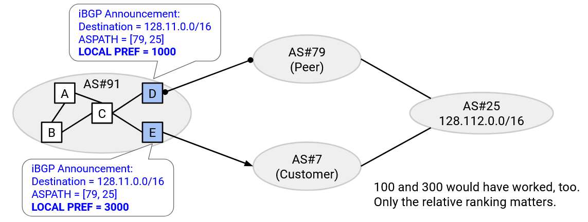

Ví dụ, giả sử *Router* E nhận được một thông báo *eBGP* từ AS#7, và *Router* A biết rằng AS#7 là một khách hàng. Sau đó, trong thông điệp *iBGP*, *Router* E có thể đặt giá trị *local preference* là 3000 (số cao). Bây giờ, mọi *Router* khác trong cùng *AS* đều biết rằng *Router* E có thể đến được đích mà nó đang thông báo, thông qua đường đi trong thuộc tính *ASPATH*, với *local preference* là 3000.

Ngược lại, nếu *Router* D nhận được một thông báo *eBGP* từ AS#79, và *AS* này là một đối tác ngang hàng, thì trong thông điệp *iBGP*, *Router* D có thể đặt giá trị *local preference* thấp hơn là 1000 và sau đó phân phối đường đi này (với *local preference* thấp hơn) đến các *Router* khác trong *AS*.

Các số *local preference* là tùy ý, và chỉ có thứ hạng tương đối của chúng là quan trọng. Trong ví dụ trên, các số có thể là 300 và 100 thay vì 3000 và 1000, và hành vi sẽ giống nhau. Các số *local preference* thường được các nhà khai thác đặt thủ công.

Thuộc tính ***ASPATH* (Đường đi AS)** chứa một danh sách các *AS* dọc theo tuyến đường đang được quảng bá (theo thứ tự ngược lại). Thuộc tính này là toàn cục, và có thể được gửi trong các thông báo *eBGP*.

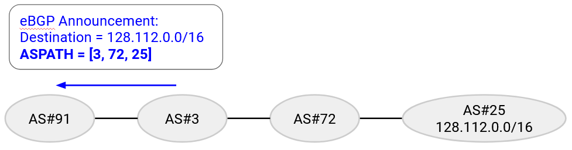

Ví dụ, một thông báo sẽ có tiền tố IP của đích (128.112.0.0/16), và một thuộc tính *ASPATH* là.

*ASPATH* là quy tắc phá vỡ thế cân bằng ưu tiên thứ hai khi nhập đường đi. Nếu hai thông báo có cùng *local preference* (ví dụ: cả hai đều từ khách hàng), thì chúng ta sẽ chọn đường đi ngắn hơn. *ASPATH* cho chúng ta biết độ dài của mỗi đường đi, được đo bằng số lượng *AS* mà đường đi đó đi qua.

Nếu *local preference* và độ dài đường đi bằng nhau, quy tắc phá vỡ thế cân bằng ưu tiên thứ ba là chi phí *IGP* đến *egress router*. Chi phí này được lưu trữ trong *forwarding table* cục bộ của *Router* (ví dụ: một giao thức distance-vector cục bộ sẽ lưu trữ chi phí đến mọi *Router* khác trong cùng *AS*).

Thuộc tính ***MED*** mã hóa các ưu tiên của *AS* xuất. Tương đương, thuộc tính này đại diện cho khoảng cách từ *Router* xuất đến đích (số thấp hơn được ưu tiên).

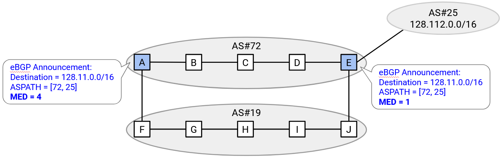

Ví dụ, nếu có hai liên kết giữa hai *AS* này, cả hai *border router* từ *AS* xuất sẽ thông báo một đường đi. *ASPATH* và đích là giống nhau, vì đường đi của các *AS* đến đích là giống nhau trong cả hai trường hợp. Tuy nhiên, *router* phía Tây sẽ bao gồm một số thuộc tính *MED* thấp hơn, so với *router* phía Đông. Điều này nói rằng: khi có thể, vui lòng định tuyến các *packet* cho đích thông qua *router* phía Tây của tôi (số thấp hơn), vì *router* này gần đích hơn.

Nếu *local preference*, độ dài đường đi, và khoảng cách đến *egress router* đều bằng nhau, quy tắc phá vỡ thế cân bằng ưu tiên thứ tư là số *MED* bên trong mỗi thông báo.

## Các vấn đề với BGP

*BGP* không có đảm bảo bảo mật tích hợp. Một *AS* độc hại có thể nói dối và quảng bá một tuyến đường đến một đích, ngay cả khi *AS* đó không thể đến được đích đó. Một *AS* độc hại cũng có thể quảng bá một tuyến đường rất rẻ đến một đích, ngay cả khi tuyến đường rẻ đó thực sự không tồn tại. Điều này có thể khuyến khích các *AS* khác định tuyến *packet* qua *AS* độc hại, nơi kẻ tấn công có thể xóa hoặc sửa đổi các *packet* đi qua *AS* độc hại. Các cuộc tấn công này được gọi là ***prefix hijacking* (chiếm đoạt tiền tố)**. Hiện có nghiên cứu tích cực về việc sử dụng mật mã để bảo mật *BGP*, mặc dù các giao thức như vậy chưa được triển khai rộng rãi.

*BGP* ưu tiên chính sách hơn là chi phí thấp nhất khi chọn đường đi. Ngoài ra, vì *BGP* đo độ dài đường đi bằng số lượng *AS*, độ dài đường đi có thể gây hiểu nhầm (ví dụ: một *AS* có thể chứa 2 *Router* hoặc 200 *Router* dọc theo đường đi đang được quảng bá). Điều này có thể dẫn đến các vấn đề trong đó các *packet* không phải lúc nào cũng đi theo đường có chi phí thấp nhất, và rất khó để lý giải về hiệu suất trên Internet. Một số người có thể phân loại đây là các vấn đề, mặc dù chúng có thể là một sự đánh đổi thiết kế có chủ ý. Các nhà thiết kế *BGP* đã đưa ra một lựa chọn thiết kế có ý thức để ưu tiên chính sách và che giấu cấu trúc liên kết nội bộ của một *AS*, đổi lại là hiệu suất.

*BGP* phức tạp để triển khai. Có nhiều chi tiết triển khai tinh vi mà chúng ta không đề cập đến. Ngay cả trong các chủ đề chúng ta đã đề cập, một số cấu hình nhất định như *local preference* hoặc số *MED* phải được nhà khai thác đặt thủ công, và các cấu hình không chính xác có thể dẫn đến các đường đi không chính xác lan truyền qua mạng. Cấu hình sai *BGP* thường có thể dẫn đến sự cố mất mạng Internet, và có nghiên cứu tích cực về các công cụ để xác minh rằng *BGP* được cấu hình đúng.

*BGP* yêu cầu một số giả định nhất định (mọi người đều tuân theo các quy tắc Gao-Rexford, biểu đồ *AS* tạo thành một hệ thống phân cấp, không có chu trình nhà cung cấp-khách hàng) để đảm bảo khả năng tiếp cận và hội tụ. Nếu các giả định này không được đáp ứng (ví dụ: một *AS* chọn chính sách riêng vi phạm Gao-Rexford), *BGP* có thể tạo ra hành vi không ổn định, trong đó các tuyến đường không bao giờ hội tụ, hoặc các chu trình và ngõ cụt xuất hiện.
 END OF TRANSLATED FILE ---