# Border Gateway Protocol (BGP)

## Lược sử BGP

Các *routing protocol* *least-cost routing* (định tuyến chi phí thấp nhất) có liên quan chặt chẽ đến bài toán đường đi ngắn nhất trong lý thuyết đồ thị, vốn đã được nghiên cứu trong khoa học máy tính ngay cả trước khi Internet tồn tại. Thuật toán của Dijkstra ra đời năm 1956, và thuật toán Bellman-Ford ra đời năm 1958. Khi phát triển các *routing protocol* sơ khai, các nhà thiết kế có thể áp dụng các ý tưởng từ những thuật toán này.

Trong những ngày đầu, Internet là một dự án do chính phủ tài trợ, nơi mạng lưới được kiểm soát tập trung bởi Bộ Quốc phòng Hoa Kỳ. Khái niệm về *AS* (hệ tự trị) chưa tồn tại, và các thuật toán *least-cost routing* có thể được mở rộng quy mô để phù hợp với kích thước nhỏ của Internet thời kỳ đầu. Dần dần, khi Internet phát triển, chính phủ đã chuyển giao quyền kiểm soát cho các thực thể thương mại khác nhau, những người đã phải phát triển các giao thức *inter-domain routing* (định tuyến liên miền) một cách nhanh chóng.

Không giống như các *routing protocol* *least-cost routing* sơ khai, khái niệm về các *AS* có *policy* (chính sách) riêng của mình không có tiền lệ trong khoa học máy tính. Các ý tưởng đằng sau các giao thức *inter-domain routing* phải được phát triển một cách nhanh chóng để đáp ứng nhu cầu của các công ty Internet mới này.

*BGP* được tạo ra vào những năm 1989-1995, và quá trình phát triển đặc thù của nó có nghĩa là giao thức này không hoàn hảo. Nếu chúng ta có thể viết lại giao thức từ đầu ngày hôm nay, kết quả có thể sẽ khác. Tuy nhiên, giao thức này đã chứng tỏ được hiệu quả và khả năng phục hồi, và vẫn là *routing protocol* liên miền được sử dụng cho đến ngày nay. (Hãy nhớ rằng, mọi người đều phải đồng ý sử dụng cùng một *routing protocol* liên miền, vì vậy chỉ có một.)

## BGP dựa trên Distance-Vector

Hãy nhớ lại rằng chúng ta đã thấy hai lớp thuật toán định tuyến nội miền: thuật toán *distance-vector* (vector khoảng cách) và thuật toán *link-state* (trạng thái liên kết). Khi thiết kế *BGP*, lớp thuật toán nào sẽ là điểm khởi đầu tốt hơn cho thiết kế của chúng ta?

Hãy nhớ rằng trong *BGP*, chúng ta cần tôn trọng quyền riêng tư của từng *AS*. Nếu chúng ta sử dụng một giao thức *link-state*, thì mọi *AS* phải thông báo cho toàn bộ mạng về các *policy* của mình, để mọi người có đầy đủ kiến thức để tự tính toán các tuyến đường.

Ngoài ra, trong *BGP*, chúng ta cần tôn trọng quyền tự chủ và cho phép mỗi *AS* đưa ra quyết định *policy* của riêng mình. Tuy nhiên, một giao thức *link-state* yêu cầu mọi người phải tính toán các tuyến đường theo một cách nhất quán nào đó (ví dụ: mọi người đồng ý sử dụng các đường đi có chi phí thấp nhất).

Thuật toán *link-state* không tôn trọng quyền riêng tư hay quyền tự chủ của các *AS*, vì vậy *link-state* sẽ là một lựa chọn tồi để thiết kế *BGP*. Ngược lại, *distance-vector* sẽ cho phép mỗi *AS* riêng lẻ đưa ra quyết định của riêng mình về việc chấp nhận/từ chối tuyến đường nào, và quảng bá tuyến đường nào. Ngoài ra, vì *distance-vector* không phải là một giao thức toàn cục, mỗi *AS* không cần biết về *policy* của mọi người khác để tính toán các tuyến đường hợp lệ.

Nhiều ý tưởng cốt lõi trong các giao thức *distance-vector* vẫn sẽ được áp dụng trong *BGP*. Các thông điệp quảng bá mà chúng ta gửi và nhận vẫn sẽ dành riêng cho một đích. Giống như trong các phần trước, chúng ta sẽ nghĩ về các quảng bá và tuyến đường cho một đích duy nhất, nhưng hãy biết rằng giao thức đang được chạy cho nhiều đích đồng thời.

Trong cả giao thức *distance-vector* và *BGP*, mỗi *AS* tính toán các tuyến đường chỉ sử dụng thông tin từ các quảng bá mà nó nhận được, mà không thấy được bức tranh toàn cục về cấu trúc liên kết mạng. Ngoài ra, trong cả hai loại giao thức, *AS* sẽ gửi và nhận các quảng bá vô thời hạn, cho đến khi mọi người đã *convergence* (hội tụ) trên một tập hợp các tuyến đường.

*BGP* tuân theo cùng một ý tưởng cốt lõi như các giao thức *distance-vector*, nhưng có một chút thay đổi về thuật ngữ. Thay vì nói rằng mỗi *AS* thông báo hoặc quảng bá các tuyến đường, chúng ta nói rằng *AS* đang ***exporting* (xuất)** các tuyến đường. Sau đó, mỗi *AS* lắng nghe các quảng bá và chọn tuyến đường ưa thích của mình, chúng ta sẽ gọi là ***importing* (nhập)** các tuyến đường.

*Distance-vector* là một điểm khởi đầu tốt, nhưng còn thiếu gì?

Các giao thức *distance-vector* được thiết kế để tìm các tuyến đường *least-cost*, nhưng trong *BGP*, chúng ta muốn các tuyến đường được quyết định dựa trên các *policy* riêng của mỗi *AS*.

## Nhập và Xuất dựa trên Chính sách

Ở cấp độ cao, để hỗ trợ các *policy*, chúng ta sẽ thay đổi các quy tắc để *importing* và *exporting* các tuyến đường. Mỗi *AS* sẽ chỉ *export* (quảng bá) các tuyến đường mà *AS* đó thích (theo *policy* của nó). Ngoài ra, khi *importing* (lựa chọn) các tuyến đường, *AS* sẽ chọn tuyến đường tốt nhất theo *policy*, chứ không phải khoảng cách.

Khi một *AS* nhận được nhiều quảng bá cho cùng một đích, thay vì chọn tuyến đường ngắn nhất, *AS* giờ đây sẽ chọn (*import*) một tuyến đường dựa trên *policy*.

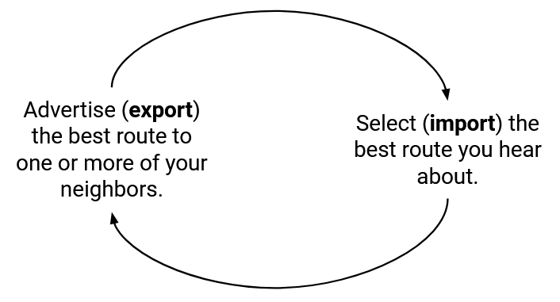

Hãy nhớ rằng các quảng bá lan truyền ra ngoài từ đích, và các thông điệp được chuyển tiếp đến gần đích hơn (hướng ngược lại với các quảng bá). Quyết định *import* quyết định nơi một *AS* sẽ gửi lưu lượng đi ra ngoài của mình. Ví dụ, nếu S nghe các quảng bá từ A, B, và C về cùng một đích, quyết định *import* của S (A hoặc B hoặc C) sẽ xác định nơi các *packet* cho đích đó sẽ được chuyển tiếp.

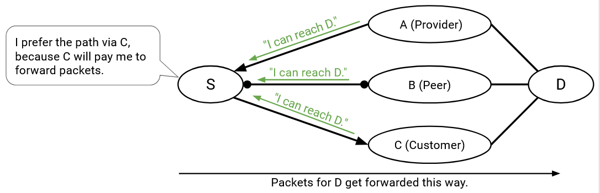

Trong giao thức *distance-vector*, khi tôi nhận được một thông báo và cài đặt một tuyến đường mới, tôi luôn thông báo tuyến đường mới này cho tất cả các hàng xóm của mình.

Bây giờ các *AS* có *policy* riêng, chúng có thể chọn có muốn tham gia vào một tuyến đường hay không. Nếu một *AS* có một tuyến đường mà nó có thể không thích, nó có thể chọn không *export* tuyến đường đó cho một số hàng xóm nhất định.

Ví dụ, giả sử *policy* của tôi là tôi không muốn mang lưu lượng của C. Điều này có thể là do lý do tiền tệ, hoặc có thể là một quyết định *policy* khác của tôi. Khi tôi chấp nhận một quảng bá và cài đặt một tuyến đường, sẽ không sao nếu tôi không quảng bá tuyến đường đó cho C.

Một lần nữa, hãy nhớ rằng dữ liệu chảy theo hướng ngược lại với các quảng bá. Quyết định *export* quyết định lưu lượng đến mà một *AS* sẵn sàng mang theo. Nếu tôi *export* một tuyến đường, tôi đang đồng ý tham gia vào tuyến đường này và để người khác chuyển tiếp các *packet* đến tôi dọc theo tuyến đường này.

Một hệ quả của quy tắc này là, ngay cả khi đồ thị cơ bản được kết nối (tồn tại một đường đi giữa hai nút bất kỳ), không có gì đảm bảo rằng mọi *AS* đều có thể đến được mọi *AS* khác. Trong thực tế, chúng ta sẽ có thể đảm bảo *reachability* (khả năng kết nối) bằng cách thiết lập một số quy ước về *policy* của các *AS* và cấu trúc của đồ thị *AS*.

## Triển khai các quy tắc Gao-Rexford

Nói chung, *BGP* hỗ trợ các *policy* tùy ý, nhưng các *policy* tùy ý không cho chúng ta bất kỳ đảm bảo nào rằng Internet được kết nối đầy đủ (*packet* có thể đi từ bất kỳ nguồn nào đến bất kỳ đích nào).

Hãy nhớ lại rằng ***Gao-Rexford rules* (các quy tắc Gao-Rexford)** thực thi một bộ *policy* hạn chế hơn, dựa trên các *policy* *import* và *export* phổ biến dựa trên tiền tệ. Không ai bắt buộc một *AS* phải tuân theo các quy tắc này. Tuy nhiên, nếu các *AS* đồng ý tuân theo các quy tắc này, chúng ta có thể đưa ra các giả định mạnh mẽ hơn về khả năng kết nối Internet.

Lược sử ngắn gọn: Các quy tắc được đặt theo tên của Lixin Gao và Jennifer Rexford tại AT&T vào những năm 1990. Thời đó, mỗi *AS* tự đặt ra các *policy* của riêng mình một cách nhanh chóng. Gao và Rexford đã khảo sát các *AS* về *policy* của họ để đưa ra các quy tắc này, và sử dụng chúng để chứng minh các đảm bảo về Internet.

Khi *importing* các tuyến đường, *Gao-Rexford rules* nói rằng *AS* ưu tiên *import* một tuyến đường được quảng bá bởi một *customer* (khách hàng), hơn một tuyến đường được quảng bá bởi một *peer* (đối tác ngang hàng), hơn một tuyến đường được quảng bá bởi một *provider* (nhà cung cấp).

Trong thực tế, các *AS* cũng triển khai thêm các quy tắc phá vỡ thế cân bằng ngoài *Gao-Rexford rules*. Ví dụ, nếu tôi nhận được quảng bá từ hai *customer*, tôi cần một số quy tắc phá vỡ thế cân bằng bổ sung để ưu tiên một trong số họ. Hiệu suất là một quy tắc phá vỡ thế cân bằng phổ biến, trong đó chúng ta chọn các tuyến đường có *bandwidth* cao hơn hoặc đường đi ngắn hơn.

Dựa trên *Gao-Rexford rules*, chúng ta nên *export* các đường đi như thế nào? Hãy nhớ lại rằng một *AS* đồng ý tham gia vào một tuyến đường nếu ít nhất một hàng xóm là một *customer*. Do đó, *AS* chỉ nên quảng bá các tuyến đường nếu tuyến đường kết quả, nếu được chấp nhận, có một hàng xóm ở một phía.

Hãy xem xét tất cả các trường hợp cụ thể.

Tôi nhận và cài đặt một tuyến đường từ một *customer*. Điều này có nghĩa là chặng tiếp theo trên tuyến đường này là *customer* đó. Tôi nên *export* tuyến đường này cho ai? Tôi đã đảm bảo rằng có một *customer* ở một phía đang trả tiền cho tôi, vì vậy tôi có thể *export* tuyến đường này cho mọi người (*customer*, *provider*, và *peer*).

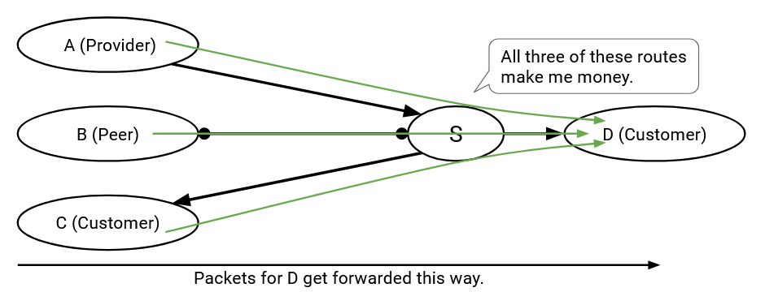

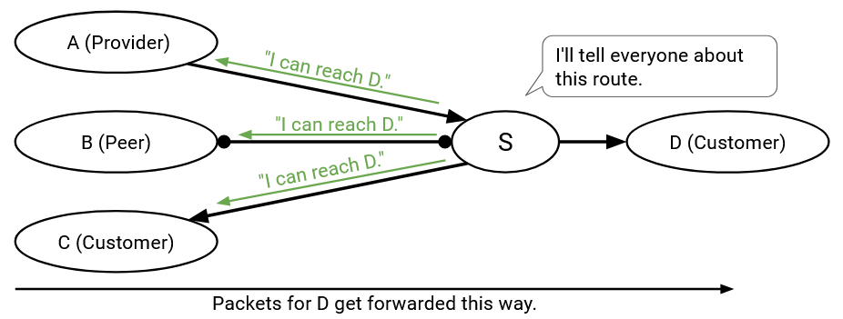

Tôi nhận và cài đặt một tuyến đường từ một *peer* (chặng tiếp theo là một *peer*). Tôi nên *export* tuyến đường này cho ai? Chưa có ai trả tiền cho tôi, vì vậy tôi chỉ nên *export* tuyến đường này cho *customer*. Nếu tôi *export* tuyến đường này cho một *peer* hoặc *provider* chấp nhận, thì tôi đã tạo ra một tuyến đường mà không có bên nào trả tiền cho tôi.

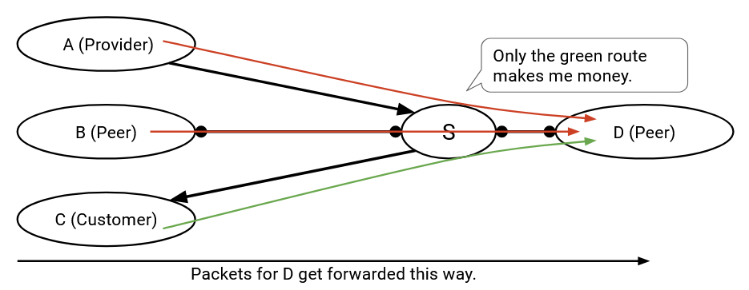

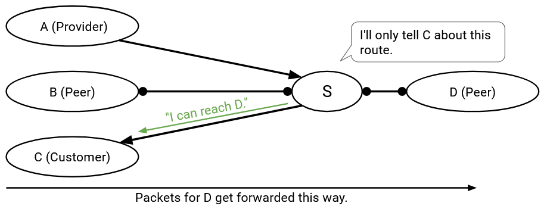

Tương tự, nếu tôi nhận và cài đặt một tuyến đường từ một *provider*, tôi chỉ nên *export* tuyến đường này cho *customer*, vì tôi cần ít nhất một bên trả tiền cho tôi, và *provider* không trả tiền.

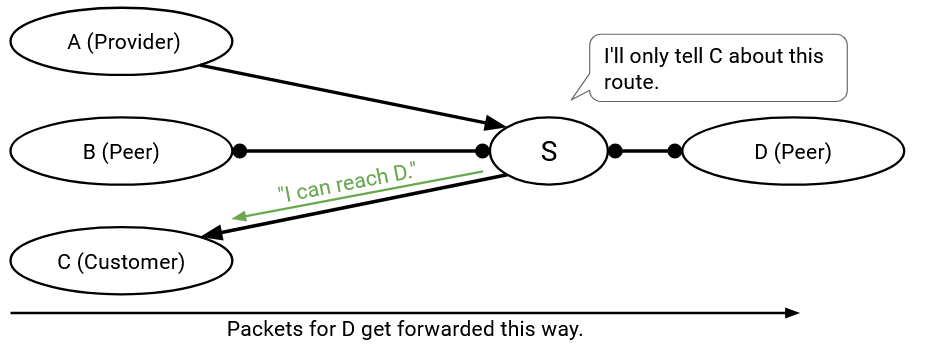

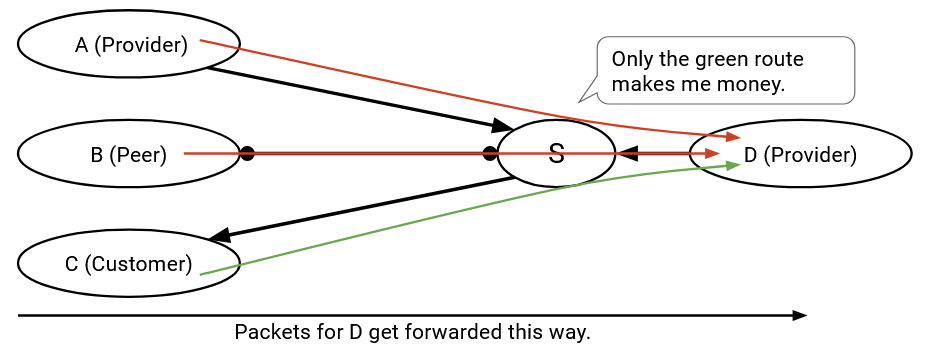

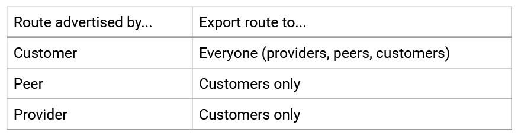

*Gao-Rexford rules* cho phép chúng ta chứng minh được rằng mệnh đề này là đúng: Giả sử rằng đồ thị *AS* có cấu trúc phân cấp và không có chu trình, và tất cả các *AS* tuân theo *Gao-Rexford rules*, thì chúng ta có thể đảm bảo *reachability* và *convergence* ở trạng thái ổn định.

Phân tích các thuật ngữ cụ thể trong mệnh đề: *Reachability* có nghĩa là hai *AS* bất kỳ trong đồ thị có thể giao tiếp với nhau. *Convergence* có nghĩa là tất cả các *AS* cuối cùng sẽ ngừng cập nhật đường đi của chúng, và mạng sẽ đạt đến trạng thái ổn định với các đường đi hợp lệ giữa hai *AS* bất kỳ. "Ở trạng thái ổn định" có nghĩa là nếu cấu trúc liên kết mạng thay đổi, các đường đi có thể mất một thời gian để thay đổi và đạt lại trạng thái ổn định.

Hãy nhớ lại rằng phân cấp có nghĩa là bắt đầu từ bất kỳ *AS* nào, đi lên trong hệ thống phân cấp (từ *customer* đến *provider*) sẽ dẫn đến một *AS* Cấp 1. Không có chu trình có nghĩa là không có chu trình trong các mối quan hệ *customer*-*provider* (các cạnh có hướng).

Việc chứng minh mệnh đề này yêu cầu mọi người phải tuân theo *Gao-Rexford rules*. Nếu các *AS* chạy *policy* tùy ý của riêng mình, các đảm bảo sẽ không còn đúng nữa.

## Sửa đổi: BGP tổng hợp các đích

Có hai sửa đổi nữa chúng ta cần thực hiện đối với giao thức *distance-vector*.

Trong các giao thức *distance-vector*, chúng ta đã chỉ ra rằng mỗi đích có một địa chỉ duy nhất, và *forwarding table* ánh xạ mỗi đích đến một chặng tiếp theo và khoảng cách.

Trong *BGP*, mỗi *AS* được định danh bằng một *prefix* (tiền tố), chỉ ra rằng tất cả các máy bên trong *AS* đó đều chia sẻ cùng một *prefix*.

Các *forwarding table* này có thể trở nên rất lớn (hãy tưởng tượng nếu một *provider* có hàng trăm *customer*), và mỗi đích duy nhất sẽ cần được mô tả trong một quảng bá riêng biệt. Có cách nào chúng ta có thể thể hiện *forwarding table* này một cách ngắn gọn hơn không?

Để cải thiện khả năng mở rộng, *BGP* cho phép các *AS* ***aggregate* (tổng hợp)** nhiều đích thành một mục *forwarding table* duy nhất, và quảng bá một *prefix* chung hơn bao gồm tất cả các đích được kết hợp.

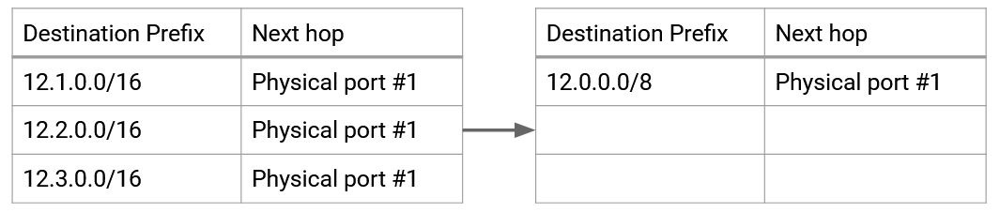

Lưu ý rằng trong thực tế, *BGP* có các quy ước về kích thước của các *prefix* được quảng bá. Ví dụ, các *AS* sẽ không tạo một quảng bá cho một địa chỉ IP riêng lẻ. Các *prefix* 24-bit (các khối 256 địa chỉ) thường là đơn vị địa chỉ nhỏ nhất được quảng bá.

## Sửa đổi: Giao thức Path-Vector

Trong các giao thức *least-cost* như *distance vector*, chúng ta không phải lo lắng về các vòng lặp. Mọi *Router* đều cố gắng tìm các tuyến đường *least-cost*, và theo định nghĩa, tuyến đường *least-cost* sẽ không chứa vòng lặp.

Bây giờ mỗi *AS* đang chọn các tuyến đường dựa trên sở thích của riêng mình, chúng ta đã mất đi sự đảm bảo không có vòng lặp. Ví dụ, giả sử B thích các đường đi qua C, và C thích các đường đi qua B. Chúng ta đã tạo ra một vòng lặp định tuyến!

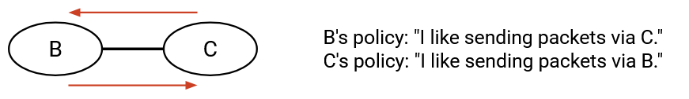

Để khắc phục vấn đề này, thay vì khoảng cách đến đích, các quảng bá *BGP* sẽ bao gồm toàn bộ đường đi *AS* đến đích. Điều này thay đổi giao thức từ một giao thức *distance-vector* thành một giao thức ***path-vector* (vector đường đi)**.

Ví dụ, trong một giao thức *distance-vector*, A sẽ quảng bá: "Tôi có thể đến đích với chi phí 1." Sau đó, B sẽ quảng bá: "Tôi có thể đến đích với chi phí 2."

Trong một giao thức *path-vector*, A sẽ quảng bá: "Tôi có thể đến đích với đường đi [A]." Sau đó, B sẽ quảng bá: "Tôi có thể đến đích với đường đi [B, A]."

Với sửa đổi này, các *AS* có thể xác định xem một đường đi được quảng bá có chứa vòng lặp hay không bằng cách theo dõi qua đường đi trong quảng bá. Cụ thể, nếu tôi nhận được một quảng bá, tôi chỉ cần kiểm tra xem đường đi có bao gồm chính tôi hay không. Điều đó sẽ khiến *packet* được gửi lại cho tôi, tạo ra một vòng lặp, vì vậy tôi sẽ bỏ qua quảng bá đó và không chấp nhận hoặc quảng bá tuyến đường có vòng lặp.

Lưu ý: Nếu mọi người đồng ý loại bỏ các tuyến đường có vòng lặp, điều này đảm bảo rằng các quảng bá sẽ không chứa vòng lặp. Cách duy nhất mà một tuyến đường được quảng bá có thể tạo ra vòng lặp là nếu tôi thấy một tuyến đường đã bao gồm chính tôi, và việc thêm chính tôi vào là điều tạo ra vòng lặp.

Sự thay đổi từ *distance-vector* sang *path-vector* cũng cho phép các *AS* triển khai các *policy* tùy ý. Trong một giao thức *distance-vector*, tôi có thể có một *policy* như "tránh AS#2063 khi có thể." Nếu tôi nhận được một quảng bá "Tôi có thể đến đích với chi phí 12," tôi không biết liệu đường đi được quảng bá có đi qua AS#2063 hay không. Thay vào đó, nếu quảng bá chứa toàn bộ đường đi, tôi có thể kiểm tra xem đường đi có đi qua AS#2063 hay không trước khi quyết định chấp nhận hay từ chối nó.

Lưu ý: *policy* *import* *BGP* thông thường mà chúng ta đã thấy trước đó (ưu tiên chọn các tuyến đường đi đến *customer*, hơn *peer*, hơn *provider*) chỉ phụ thuộc vào chặng tiếp theo, không phải toàn bộ đường đi. Tuy nhiên, sự thay đổi sang *path-vector* rất hữu ích cho việc phát hiện vòng lặp, và cho phép chúng ta tổng quát hóa giao thức cho các *policy* tùy ý.

## Stub AS sử dụng Default Route

Một số *AS* không cần chạy *BGP* để xác định cách chuyển tiếp *packet* qua mạng. Cụ thể, nếu một *stub AS* (AS nhánh) chỉ được kết nối với một *provider* duy nhất, thì mọi *packet* hướng đến các *AS* khác nên được gửi đến *provider* đó. *stub AS* có thể cài đặt một ***default route* (tuyến đường mặc định)** được mã hóa cứng duy nhất cho tất cả các đích ở các *AS* khác.

Vậy còn các *AS* khác cố gắng gửi *packet* đến *stub AS* thì sao? *stub AS* có thể yêu cầu *provider* cài đặt một ***static route* (tuyến đường tĩnh)**, cho *provider* biết cách gửi *packet* đến *stub AS*. Bây giờ, *provider* có thể chạy *BGP* và quảng bá *static route* này cho phần còn lại của Internet. *stub AS* có thể yêu cầu *provider* mã hóa cứng *static route*, và *stub AS* không bao giờ phải chạy *BGP*, vì *provider* đang quảng bá các tuyến đường đến *stub AS* thay mặt cho *stub AS*.

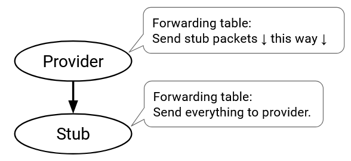

Hầu hết các *AS* nhỏ trên Internet là các *stub AS* sử dụng *default route* và *static route*.

Các *stub AS* tương tự như các *end host* trong định tuyến nội miền. Chúng gửi và nhận *packet* cho *AS* của riêng mình, nhưng không chuyển tiếp *packet* của người khác và không tham gia vào quá trình định tuyến. Giống như trong định tuyến nội miền, chúng ta thường sẽ bỏ qua các *stub AS* và chỉ xem xét các *AS* chuyển tiếp thực sự tham gia vào *BGP*.