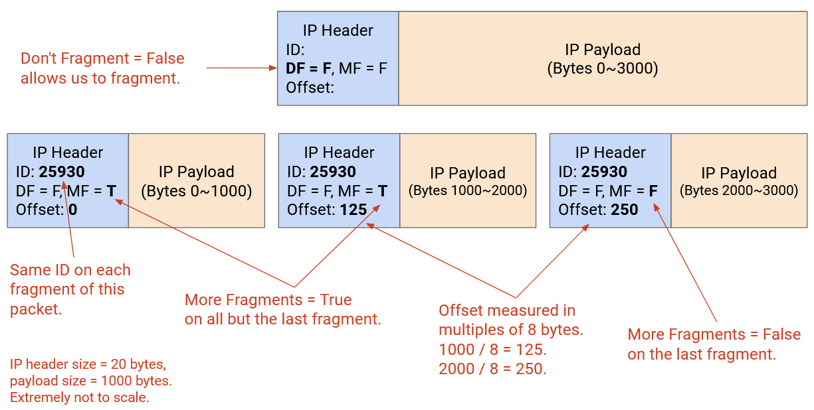
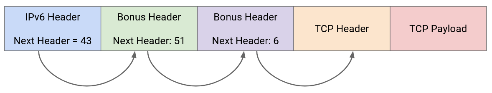
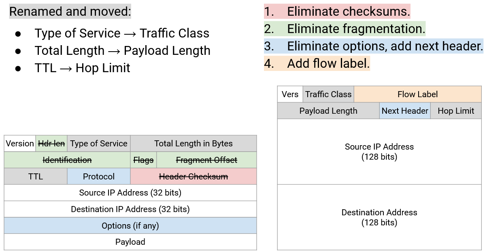
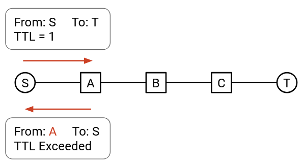
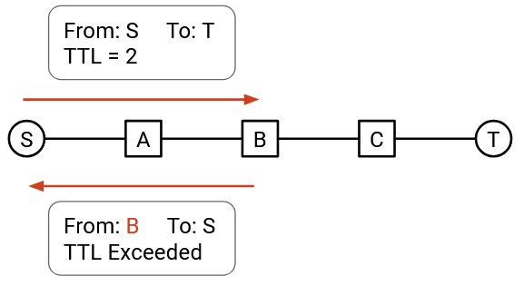
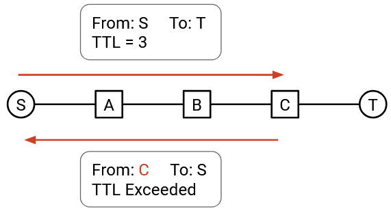
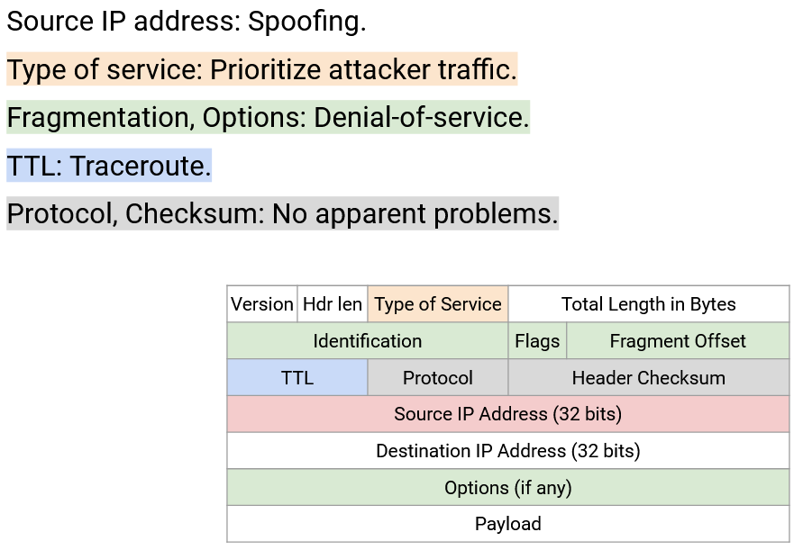

# IP Header

## Mục tiêu thiết kế IP Header

Hãy nhớ lại rằng một giao thức như *IP* (Giao thức Internet) bao gồm *syntax* (cú pháp) và *semantics* (ngữ nghĩa). *syntax* xác định các trường có trong *IP header* (phần đầu IP), và *semantics* xác định cách các trường đó được xử lý.

Cũng hãy nhớ lại rằng *packet* *IP* bao gồm một *header* (phần đầu) và *payload* (phần dữ liệu). *header* chứa siêu dữ liệu liên quan mà giao thức *IP* có thể xử lý. *payload* chứa bất kỳ dữ liệu nào sẽ được chuyển lên các giao thức lớp cao hơn, và không được giao thức *IP* phân tích.

Cuối cùng, hãy nhớ lại rằng các *header* được thêm vào khi chúng ta đi xuống chồng giao thức, và được bóc đi khi chúng ta chuyển các *packet* lên trên chồng giao thức. *IP header* được xử lý ở cả các *end hosts* (máy chủ đầu cuối) và ở mọi *Router* trung gian.

*IP header* nên càng nhỏ càng tốt. Mỗi *packet* được gửi qua Internet đều cần đính kèm *IP header*, vì vậy việc tăng kích thước *IP header*, dù chỉ một byte, sẽ làm tăng đáng kể tổng lượng *bandwidth* trên toàn Internet.

*IP header* nên càng đơn giản càng tốt. Mọi *Router* và *end host* đều phải xử lý các *packet* *IP* khi chúng được gửi và nhận, vì vậy một *header* phức tạp để xử lý sẽ làm chậm toàn bộ Internet. Lý tưởng nhất, chúng ta muốn *header* được xử lý hoàn toàn bằng phần cứng, vì vậy chúng ta không thể giả định rằng chúng ta có quyền truy cập vào các hoạt động *CPU* đa dụng khi xử lý *header* này.

## Các trường của IP Header

Một giao thức *IP* cần phải làm bốn việc:

Mọi người (các *end host*, *Router*) cần có khả năng **phân tích** *packet* và hiểu các bit có ý nghĩa gì. Để hỗ trợ điều này, *header* sẽ bao gồm ***IP version* (phiên bản IP)** (giá trị 4-bit), ***header length* (độ dài phần đầu)** (giá trị 4-bit, được đo bằng các từ 4-byte, cần thiết vì độ dài *IP header* không cố định), và ***packet length* (độ dài gói tin)** (giá trị 16-bit, được đo bằng byte).

Các *Router* (không phải *end host*) cần **chuyển tiếp** *packet* đến *Router* tiếp theo. Để hỗ trợ điều này, *header* sẽ bao gồm ***destination IP address* (địa chỉ IP đích)** (giá trị 32-bit).

Các *end host* (không phải *Router*) cần **chuyển *packet* lên** các lớp cao hơn. Để hỗ trợ điều này, *header* sẽ bao gồm một ***protocol number* (số hiệu giao thức)** (giá trị 8-bit), cho chúng ta biết giao thức Lớp 4 nào (*TCP* (Giao thức Điều khiển Truyền vận) hoặc *UDP* (Giao thức Gói Dữ liệu Người dùng)) nên được sử dụng để xử lý *payload*. Ví dụ, *protocol number* là 6 có nghĩa là sử dụng giao thức *TCP* để đọc *payload* còn lại (đọc các bit đầu tiên của *payload* là *header* *TCP*, v.v.). *protocol number* là 17 tương ứng với giao thức *UDP*.

Các *end host* và *Router* cần có khả năng **gửi các gói tin trả lời** lại cho nguồn. Để hỗ trợ điều này, *header* sẽ bao gồm ***source IP address* (địa chỉ IP nguồn)** (giá trị 32-bit).

## Xử lý lỗi IP

Các *end host* và *Router* cũng cần có khả năng **chỉ định các vấn đề hoặc các trường hợp đặc biệt** trong trường hợp một *packet* cần xử lý bổ sung.

Các *packet* *IP* có thể bị kẹt trong các vòng lặp (ví dụ: nếu *routing protocol* chưa hội tụ). Một lựa chọn khả dĩ là để *packet* lặp vô hạn cho đến khi các tuyến đường hội tụ, nhưng việc chuyển tiếp *packet* diễn ra ở quy mô nano giây, và sự hội tụ định tuyến diễn ra ở quy mô mili giây hoặc giây. Việc để *packet* lặp cho đến khi các tuyến đường hội tụ có thể mất nhiều thời gian và lãng phí rất nhiều *bandwidth*. Để ngăn chặn vòng lặp vô hạn, *IP header* có một ***time to live (TTL)*** (giá trị 8-bit), được giảm đi ở mỗi chặng. Nếu *TTL* về 0, *packet* sẽ bị loại bỏ, và một thông báo lỗi được gửi lại cho nguồn. (Thông báo lỗi là yêu cầu của đặc tả *IP*, mặc dù không phải lúc nào cũng được gửi trong thực tế.)

Các *packet* *IP* có thể bị hỏng (ví dụ: các bit trên đường truyền có thể bị hỏng do các quá trình điện). Để phát hiện lỗi, *IP header* chứa một ***checksum* (tổng kiểm tra)** (giá trị 16-bit), và loại bỏ các *packet* nếu *checksum* không chính xác.

Lưu ý rằng *IP checksum* chỉ được tính toán trên *IP header*. *checksum* chỉ có thể phát hiện lỗi trong *IP header*, không phải lỗi trong *IP payload*. Điều này phản ánh ***end-to-end principle* (nguyên tắc đầu cuối-đầu cuối)**, trong đó chúng ta bắt buộc rằng *payload* được kiểm tra bởi *end host*, chứ không phải bởi các *Router* trung gian.

*IP checksum* được cập nhật tại mỗi *Router*, vì *TTL* thay đổi, và *checksum* phải được tính toán lại. Một thiết kế thay thế khả thi là loại trừ *TTL* trong *checksum*, để tiết kiệm cho các *Router* công việc bổ sung.

Các *packet* *IP* có thể quá lớn đối với một liên kết cụ thể. Mỗi liên kết có một ***maximum transmission unit (MTU)* (đơn vị truyền tải tối đa)**, chỉ ra kích thước *packet* lớn nhất (tính bằng byte) mà liên kết đó có thể mang theo như một đơn vị. Ví dụ, liên kết có thể có bộ nhớ hạn chế để ghi nhớ một *packet* trong khi nó gửi các bit đi trên đường truyền.

*end host* không biết liên kết nào sẽ mang *packet*, vì vậy *end host* có thể gửi một *packet* quá lớn đối với một trong các liên kết. Để giải quyết vấn đề này, một *Router* có thể thực hiện ***fragmentation* (phân mảnh)**, chia *packet* thành nhiều mảnh nhỏ, mà *Router* ở đầu kia của liên kết phải tập hợp lại để phục hồi *packet* ban đầu. Các trường *identification* (định danh) (16-bit), *flags* (cờ) (3-bit), và *offset* (độ lệch) (13-bit) trong *header* được sử dụng để triển khai *fragmentation*.

*Fragmentation* có thể thực hiện được trong phần cứng (ví dụ: một *Router* có thể nhanh chóng phân mảnh các *packet* mà không cần "punt" *packet* để xử lý đặc biệt), nhưng nó gây ra thêm chi phí. Internet hiện đại tránh *fragmentation* bất cứ khi nào có thể. Ví dụ, chúng ta cố gắng chuẩn hóa *MTU* càng nhiều càng tốt (một tiêu chuẩn hiện đại là 1500 byte).

Các nhà thiết kế ban đầu của *IP* đã không hoàn toàn đi theo thiết kế nỗ lực tối đa (best-effort), và nghĩ rằng có thể hữu ích nếu cho phép các ứng dụng gửi các loại *packet* khác nhau dựa trên nhu cầu của ứng dụng. Để thực hiện điều này, *IP header* có các bit ***Type of Service (ToS)* (Loại dịch vụ)** (giá trị 8-bit), có thể được sử dụng để yêu cầu các hình thức phân phối *packet* khác nhau. Ví dụ, một số *packet* có thể được đánh dấu là nhạy cảm với độ trễ hoặc ưu tiên cao. Qua nhiều năm, các bit này đã được định nghĩa lại để đại diện cho các giao thức khác nhau, và *ToS* không còn tồn tại ở dạng ban đầu. Thay vào đó, các bit này bây giờ đại diện cho một khái niệm nào đó về mức độ ưu tiên. Ví dụ về các giao thức sử dụng các bit này là *Differentiated Services Code Point (DSCP)* (Điểm mã Dịch vụ Phân biệt), định nghĩa các loại lưu lượng nhất định, và *Explicit Congestion Notification (ECN)* (Thông báo Tắc nghẽn Tường minh), sẽ giúp xử lý tắc nghẽn lưu lượng (sẽ được thảo luận sau).

Trong thiết kế *IP* ban đầu, các ***option bits* (các bit tùy chọn)** bổ sung có thể được thêm vào *IP header* để yêu cầu xử lý nâng cao hơn trên *packet*. Ví dụ, người gửi có thể yêu cầu các *Router* ghi lại tuyến đường mà *packet* đang đi (ví dụ: để chẩn đoán). Người gửi có thể bao gồm một tuyến đường nguồn trong *header* của *packet* và buộc *packet* phải đi theo một tuyến đường nhất định. *header* của *packet* cũng có thể bao gồm một dấu thời gian. Trong các triển khai hiện đại, các tùy chọn này hầu như luôn bị vô hiệu hóa, vì chúng dẫn đến các triển khai phức tạp không cần thiết làm tăng chi phí xử lý *packet*. Ví dụ, các tùy chọn này buộc *IP header* phải có độ dài thay đổi, điều này khó xử lý hơn một *header* có độ dài cố định.

## Các thay đổi trong Header IPv6

*IPv6* (Giao thức Internet phiên bản 6) được thúc đẩy bởi lo ngại rằng cuối cùng chúng ta sẽ hết địa chỉ *IPv4* (Giao thức Internet phiên bản 4) 32-bit. *IPv6* **mở rộng địa chỉ** để địa chỉ dài 128 bit. Số lượng địa chỉ *IPv6* khả dụng là cực lớn (hãy nghĩ đến: số lượng nguyên tử trong vũ trụ), vì vậy chúng ta gần như chắc chắn sẽ không bao giờ hết địa chỉ *IPv6*.

Các nhà thiết kế *IPv6* đã nhân cơ hội này để dọn dẹp và hiện đại hóa *IP header*, loại bỏ và cập nhật các trường đã lỗi thời. Ban đầu, *IPv6* được dự định là một giao thức tham vọng hơn với nhiều tính năng địa chỉ mới, nhưng hầu hết các tính năng này chưa bao giờ được hiện thực hóa. Trong thực tế, ngoài việc "dọn dẹp mùa xuân" loại bỏ các tính năng lỗi thời này, không có nhiều thay đổi đáng kể đối với giao thức so với *IPv4*, vì vậy kết quả là một giao thức *IP* thanh lịch hơn, không có nhiều thay đổi tham vọng.

Lưu ý: Trong trường hợp bạn tò mò, *IPv5* (Giao thức Internet phiên bản 5) đã được công bố vào năm 1990 (trước *IPv6* vào năm 1998). Nó là một giao thức thử nghiệm chưa bao giờ được triển khai rộng rãi.

*IPv6* **loại bỏ *checksum*** trong *header* của *packet* *IP*. Lập luận ủng hộ việc bao gồm *checksum* là: nếu một *packet* bị hỏng và không được phát hiện, *packet* hỏng đó tiếp tục được gửi đi, lãng phí *bandwidth*. Việc bao gồm *checksum* đảm bảo rằng *packet* bị loại bỏ và *bandwidth* không bị lãng phí cho một *packet* bị hỏng. Trong thời hiện đại, *bandwidth* ít bị tắc nghẽn hơn, vì vậy *checksum* không còn cần thiết nữa, và không ảnh hưởng lớn đến hiệu suất nếu một số *packet* bị hỏng được gửi đi hết mạng.

*IPv6* **loại bỏ *fragmentation***. Nếu một *packet* *IPv6* quá lớn đối với một liên kết cụ thể, *Router* sẽ loại bỏ *packet* và gửi một thông báo lỗi trở lại nguồn với kích thước *packet* tối đa cho phép (*MTU*). Người gửi ban đầu chịu trách nhiệm chia dữ liệu thành các *packet* nhỏ hơn và gửi lại các *packet* nhỏ hơn đó. Các *end host* (ví dụ: máy tính cá nhân của bạn) xử lý ít *packet* hơn các *Router* (ví dụ: trong các trung tâm dữ liệu), vì vậy việc chuyển khối lượng công việc *fragmentation* từ các *Router* sang các *end host* cải thiện khả năng mở rộng tổng thể của Internet.

*IPv6* thay thế phần tùy chọn có độ dài thay đổi bằng một triển khai đã được sửa đổi của trường giao thức. Trong *IPv4*, các tùy chọn có vấn đề vì chúng tạo ra các *header* có độ dài thay đổi, khó phân tích hơn. Trong *IPv6*, *header* có độ dài cố định. Điều này cũng có nghĩa là trường ***header length*** có thể được loại bỏ.

Để tiếp tục hỗ trợ các tùy chọn, *IPv6* tổng quát hóa trường giao thức để cho phép *packet* *IP* được chuyển lên để xử lý đặc biệt trước khi đến Lớp 4. (Hãy nhớ lại, *header* giao thức trong *IPv4* được đặt thành 7 hoặc 19, để chỉ ra giao thức Lớp 4 nào sẽ xử lý *packet* tiếp theo.) Trường này được đổi tên từ protocol thành ***next header* (phần đầu tiếp theo)** trong *IPv6*.

Nếu bạn muốn một giao thức bổ sung xử lý *packet* *IP*, bạn có thể đặt số tương ứng của giao thức đó vào trường *next header*. Các nhà thiết kế và người dùng của các giao thức bổ sung này cần phải đồng ý về việc số nào tương ứng với giao thức nào, và một tổ chức tiêu chuẩn cần quản lý các số này. Sau đó, *payload* có thể được chuyển đến giao thức bổ sung, giao thức này có thể đọc một *header* bổ sung (sau *header* *IPv6* Lớp 3, nhưng trước *header* Lớp 4) và thực hiện xử lý bổ sung, trước khi chuyển *payload* còn lại đến Lớp 4.

Nếu *packet* không có tùy chọn bổ sung nào, thì trường *next header* giống như trường protocol cũ, cho phép *packet* *IP* được chuyển trực tiếp lên một giao thức Lớp 4 mà không cần xử lý thêm.

Ý tưởng về các *next header* có thể được tổng quát hóa để cho phép nhiều giao thức xử lý *packet* sau *IPv6*, nhưng trước Lớp 4. Ví dụ, *IPv6* có thể có một *next header* để xử lý đặc biệt. Sau đó, *header* của giao thức xử lý đặc biệt cũng có thể chứa một trường *next header*, chỉ định một giao thức Lớp 4, hoặc một giao thức xử lý đặc biệt khác nữa. Cách tiếp cận này có khả năng tương thích với tương lai, vì nó hỗ trợ các giao thức trong tương lai chưa được phát minh. Các giao thức trong tương lai đó có thể được thêm vào theo cách tiếp cận *next-header* này, mà không làm hỏng *IPv6* hoặc yêu cầu cập nhật *IPv6*.

*IPv6* thêm một trường ***flow label* (nhãn luồng)** vào *header*. Ở lớp 3, các *packet* được gửi độc lập (cách một *packet* được gửi không ảnh hưởng đến các *packet* khác), nhưng trong thực tế, thường có nhiều *packet* liên quan đến nhau theo một cách nào đó. Ví dụ, trong một luồng video giữa hai máy chủ, có thể có nhiều *packet* được gửi giữa hai ứng dụng giống nhau. Lớp 3 được cho là sẽ xử lý các *packet* này một cách riêng biệt, nhưng trong thực tế, các *Router* đã thêm các hệ thống tiên tiến hơn gọi là ***middleboxes* (các hộp trung gian)** (ví dụ: *firewalls* (tường lửa), *intrusion detection systems* (hệ thống phát hiện xâm nhập)) có thể quan tâm đến việc các *packet* này là một phần của cùng một luồng, hoặc kết nối. Ví dụ, một *firewall* có thể cần đọc nhiều *packet* từ một kết nối để quyết định xem kết nối đó có nên được cho phép hay chặn. Khi tất cả các *packet* được gửi độc lập, các *middlebox* này phải đoán xem hai *packet* có liên quan đến nhau hay không (ví dụ: nó nhận thấy các *packet* có cùng địa chỉ IP nguồn/đích). *IPv6* thêm một cách tường minh để biểu thị rằng nhiều *packet* có liên quan đến nhau.

Số phiên bản không thay đổi giữa *IPv4* và *IPv6*. Độ dài *packet* không thay đổi (mặc dù được đổi tên từ Total Length thành Payload Length). *TTL* được đổi tên thành *Hop Limit* (Giới hạn Chặng), mặc dù chức năng không thay đổi.

Các bit *Type of Service* được đổi tên thành *Traffic Class* (Lớp Lưu lượng), và vẫn có thể được sử dụng để thực hiện một số khái niệm về ưu tiên *packet*.

Nói chung, *IPv6* đi theo *end-to-end principle* và yêu cầu *end host* thực hiện công việc (phân mảnh, xác minh *checksum* và gửi lại các *packet* bị hỏng) khi có thể. Một số trường, như *hop limit* hoặc *TTL*, về cơ bản là một vấn đề ở cấp độ *IP*, và không thể được thực hiện bởi các *end host*. (*end host* sẽ giúp xử lý một *packet* đang lặp trong mạng như thế nào?)

*IPv6* cũng cố gắng đơn giản hóa *header* (loại bỏ các tùy chọn có độ dài thay đổi), trong khi vẫn cho phép khả năng mở rộng cho các cải tiến trong tương lai (cách tiếp cận *next-header*, *flow label*).

## Bảo mật IP Header

*IP* không có bất kỳ cơ chế bảo mật tích hợp nào để chống lại những kẻ tấn công. Kẻ tấn công có thể gửi một *packet* với địa chỉ IP nguồn không chính xác, cho phép kẻ tấn công mạo danh người khác. Điều này có thể khiến máy chủ bị mạo danh bị đổ lỗi oan cho một *packet*. Hoặc, nếu kẻ tấn công gửi một *packet* giả mạo, gói tin trả lời có thể được gửi đến máy chủ bị mạo danh. Việc nói dối về địa chỉ nguồn được gọi là ***IP spoofing* (giả mạo IP)**.

*IP spoofing* có thể được sử dụng cho các cuộc ***denial-of-service (DoS) attacks* (tấn công từ chối dịch vụ)**. Một cuộc tấn công DoS có thể được sử dụng để làm quá tải một máy chủ và khiến nó bị sập bằng cách làm ngập máy chủ với các *packet*. Nếu tất cả các *packet* đến từ cùng một người gửi, máy chủ có thể ngăn chặn cuộc tấn công bằng cách bỏ qua các *packet* từ địa chỉ IP của kẻ tấn công. Tuy nhiên, nếu kẻ tấn công nói dối về địa chỉ IP nguồn, máy chủ sẽ khó phân biệt hơn giữa lưu lượng của kẻ tấn công và lưu lượng hợp pháp.

Các cuộc tấn công tinh vi hơn liên quan đến giả mạo tồn tại, mặc dù chúng ta sẽ không đề cập chi tiết trong lớp học này (xem ghi chú của CS 161 tại UC Berkeley để biết thêm chi tiết).

Trường *ToS* trong *IP header* cho phép người gửi đặt mức độ ưu tiên cho các *packet* của họ. Nếu chúng ta cho phép mọi người tự đặt mức độ ưu tiên, những người dùng độc hại có thể đặt mức độ ưu tiên cao hơn và lừa mạng ưu tiên lưu lượng của kẻ tấn công.

Nếu mạng tính phí bổ sung cho lưu lượng ưu tiên cao, kẻ tấn công có thể gửi một *packet* ưu tiên cao giả mạo, và máy chủ bị mạo danh sẽ phải trả tiền cho lưu lượng của kẻ tấn công.

Thiết kế Internet ban đầu không ngăn chặn các cuộc tấn công này, mặc dù các *ISP* (nhà cung cấp dịch vụ Internet) hiện đại đã triển khai các biện pháp bảo mật bổ sung để giảm thiểu các cuộc tấn công ở lớp *IP*. Trong Internet hiện đại, các *ISP* không cho phép các *end host* đặt trường *ToS*, và nhiều *ISP* có các công cụ để phát hiện và chặn các *packet* giả mạo.

Trong *IPv4*, kẻ tấn công có thể cố tình gửi các *packet* lớn, buộc các *Router* phải thực hiện thêm công việc phân mảnh các *packet* đó. Hoặc, kẻ tấn công có thể cố tình thêm các tùy chọn bổ sung, buộc các *Router* phải xử lý các tùy chọn bổ sung đó. Điều này có thể được sử dụng để thực hiện các cuộc tấn công DoS và làm quá tải khả năng xử lý của một *Router*.

Trường *TTL* có thể bị khai thác để tìm hiểu về cấu trúc liên kết mạng. Bạn có thể gửi một *packet* với *TTL* là 1. *packet* sẽ hết hạn ở chặng đầu tiên, và *Router* đầu tiên sẽ gửi cho bạn một thông báo lỗi, cho phép bạn biết được danh tính của *Router* đầu tiên.

Sau đó, bạn có thể gửi một *packet* với *TTL* là 2, nó sẽ hết hạn ở chặng thứ hai. *Router* thứ hai sẽ gửi cho bạn một thông báo lỗi, cho phép bạn cũng khám phá ra *Router* thứ hai.

Bằng cách lặp lại điều này với *TTL* là 3, *TTL* là 4, v.v., bạn có thể khám phá tất cả các *Router* trên đường đi của mình. Cuộc tấn công này được gọi là ***traceroute* (công cụ theo dõi đường đi)**, mặc dù những người khác cho rằng nó không phải là một cuộc tấn công và hữu ích cho việc chẩn đoán.

Việc lặp lại cuộc tấn công này trên các nguồn và đích khác nhau cho phép bạn tìm hiểu thêm về cấu trúc liên kết mạng. Một số *Router* không gửi thông báo lỗi khi *TTL* bị vượt quá, điều này có thể hạn chế việc khai thác này.

Về mặt lý thuyết, kẻ tấn công có thể giả mạo trường giao thức hoặc *checksum*, nhưng điều này có khả năng khiến *packet* bị loại bỏ vì giao thức hoặc *checksum* không hợp lệ, vì vậy các cuộc tấn công thực tế với hai trường này không thực sự tồn tại.

