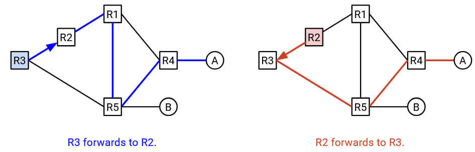
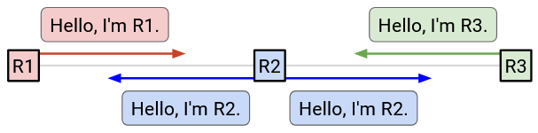
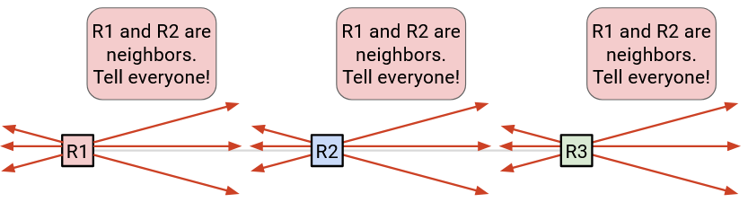
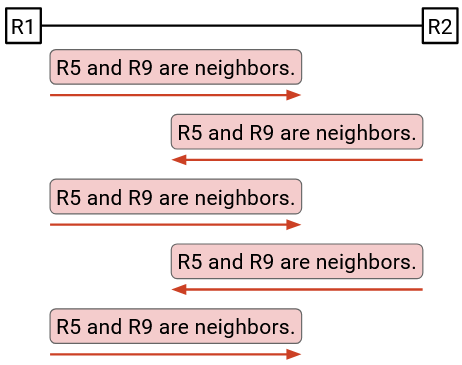
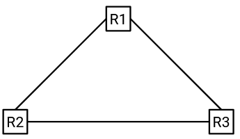
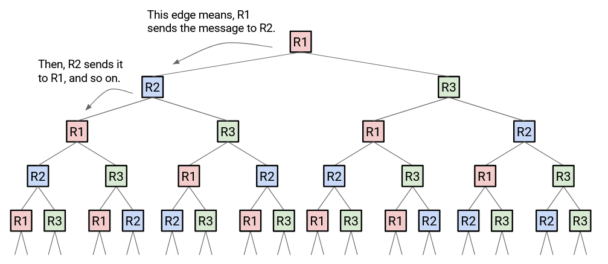
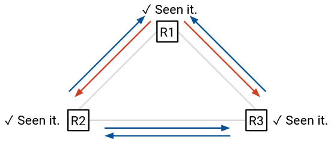
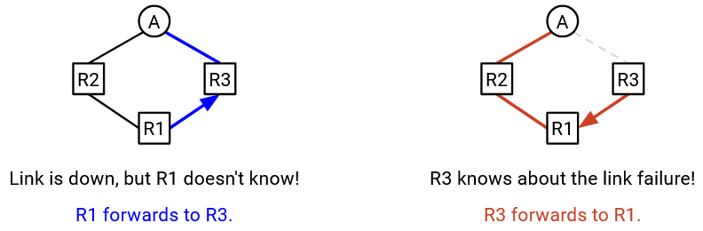

# Giao thức Trạng thái Liên kết (Link-State Protocols)

## Giới thiệu về Giao thức Link-State

Hãy nhớ lại rằng có nhiều lớp *routing protocol* khác nhau, tùy thuộc vào thuật toán cơ bản của chúng. Trong phần trước, chúng ta đã tìm hiểu về lớp giao thức *distance-vector*. Trong phần này, chúng ta sẽ thảo luận về ***link-state*** (trạng thái liên kết), một lớp giao thức chính khác.

Cũng hãy nhớ lại rằng các giao thức cũng có thể được phân loại thành *exterior gateway protocols* (giao thức cổng ngoại vi) (hoạt động giữa các mạng) và *interior gateway protocols* (giao thức cổng nội vi) (hoạt động bên trong các mạng). Giống như *distance-vector*, các giao thức *link-state* thường là *interior gateway protocols*.

*IS-IS* (Intermediate System to Intermediate System - Hệ thống trung gian đến Hệ thống trung gian) và *OSPF* (Open Shortest Path First - Ưu tiên đường đi ngắn nhất) là hai ví dụ chính về các giao thức *link-state*. Cả hai đều được triển khai rộng rãi ngày nay.

## Tổng quan về Link-State

*Distance-vector* thực hiện một phép tính phân tán, hợp tác. Mỗi nút tự tính toán phần giải pháp của riêng mình, dựa trên kết quả được tính toán bởi các láng giềng của nó. Phép tính trên tất cả các nút cùng nhau tạo thành giải pháp đầy đủ. Mỗi nút chỉ cần thông tin cục bộ từ các láng giềng của nó trong phép tính (các nút không biết toàn bộ *network graph* (đồ thị mạng)).

Ngược lại, các giao thức *link-state* thực hiện một phép tính cục bộ. Mỗi nút tự tính toán giải pháp đầy đủ một cách độc lập và từ đầu, mà không sử dụng bất kỳ kết quả tính toán nào từ các láng giềng. Tuy nhiên, để làm được điều này, mỗi nút cần thông tin toàn cục từ tất cả các phần của mạng.

Giao thức *link-state* trong một câu: Mọi *router* tìm hiểu toàn bộ *network graph*, và sau đó chạy thuật toán tìm *shortest-paths* (đường đi ngắn nhất) trên đồ thị để điền vào *forwarding table*.

Có hai bước chính mà chúng ta phải thực hiện. Đầu tiên, *router* cần bằng cách nào đó tìm hiểu toàn bộ *network graph*, bao gồm trạng thái của mọi liên kết (hoạt động hay không), chi phí của mọi liên kết, và vị trí của mọi đích đến.

Sau đó, *router* cần chạy một thuật toán nào đó trên đồ thị đó để tìm hiểu cách *forwarding* các gói tin đến mọi đích đến.

Chúng ta sẽ suy nghĩ về bước thứ hai trước (*shortest-paths*), sau đó suy nghĩ về bước thứ nhất (tìm hiểu đồ thị).

## Tính toán Đường đi (Computing Paths)

Một khi *router* có cái nhìn toàn cục về mạng, nó có thể dễ dàng tính toán các đường đi qua mạng bằng một số *shortest-path algorithm* (thuật toán tìm đường đi ngắn nhất).

Cụ thể, *router* nên tính toán đường đi ngắn nhất đến mọi đích. Sau đó, đối với mỗi đích, *router* ghi lại *next hop* dọc theo đường đi ngắn nhất, giống như trong các giao thức *distance-vector*. Phần còn lại của đường đi không cần thiết trong quá trình *forwarding*.

Nhiều *shortest-path algorithm* từ một nguồn duy nhất có thể được sử dụng trong bước này. Ví dụ, *Bellman-Ford algorithm* (thuật toán Bellman-Ford) (phiên bản tuần tự, không có các thay đổi của *distance-vector*) và *Dijkstra's algorithm* (thuật toán Dijkstra) đều tính toán hiệu quả đường đi ngắn nhất từ một nguồn duy nhất đến tất cả các đích. Chúng ta cũng có thể xem xét các giải pháp thay thế như *breadth-first search* (tìm kiếm theo chiều rộng), hoặc các thuật toán có thể chạy song song.

Một điều chúng ta phải cẩn thận là sự không nhất quán giữa các *router*.

Hãy nhớ rằng, mọi *router* đều tính toán các đường đi ngắn nhất một cách độc lập, và quyết định một *next hop* tương ứng. Mỗi *router* chỉ kiểm soát *next hop* của chính nó, và không thể ảnh hưởng đến những gì *next hop* sẽ làm.

Ví dụ, giả sử R3 tính toán đường đi ngắn nhất này đến A, và quyết định *forwarding* các gói tin đến R2. Sau đó, R2 tính toán đường đi ngắn nhất này đến A, và quyết định *forwarding* các gói tin đến R3. Cả hai *router* đều tính toán các đường đi ngắn nhất hợp lệ, nhưng quyết định của chúng đã dẫn đến một *routing loop* (vòng lặp định tuyến).

Để tránh vấn đề này, chúng ta phải đảm bảo rằng tất cả các *router* đang đưa ra các quyết định *forwarding* tương thích với nhau. Các yêu cầu để tất cả các *router* đưa ra các quyết định tương thích là gì?

1. Tất cả các *router* phải đồng ý về *network topology* (cấu trúc liên kết mạng). Giả sử một liên kết bị lỗi, nhưng chỉ có một *router* biết về nó. Khi đó, các *router* khác nhau đang tính toán các đường đi trên các đồ thị hoàn toàn khác nhau, và có thể tạo ra các kết quả không nhất quán.

2. Tất cả các *router* đang tìm các đường đi chi phí thấp nhất qua đường đi. Nếu một *router* ưu tiên các đường đi đắt hơn vì một lý do nào đó, chúng ta sẽ nhận được kết quả không nhất quán.

3. Tất cả các chi phí đều là số dương. Chi phí âm có thể tạo ra các chu trình có trọng số âm.

4. Tất cả các *router* sử dụng cùng một quy tắc phá vỡ thế hòa (tiebreaking rules). Nếu chúng ta giả định rằng các đường đi ngắn nhất là duy nhất, thì hai điều kiện trước đó là đủ để đảm bảo mọi người đều chọn cùng một đường đi. Điều kiện này còn đảm bảo thêm rằng nếu có nhiều đường đi có cùng chi phí ngắn nhất, mọi người đều chọn cùng một đường.

Với bốn điều kiện này, các *router* có thể sử dụng các *shortest-path algorithm* khác nhau, và chúng vẫn sẽ cùng tính toán ra các đường đi giống nhau và đưa ra các quyết định tương thích. Tuy nhiên, trên thực tế, các *router* thường sử dụng cùng một thuật toán để đơn giản.

## Tìm hiểu về Cấu trúc Liên kết Đồ thị (Learning About Graph Topology)

Làm thế nào các *router* tìm hiểu về toàn bộ *network graph*? Đầu tiên, chúng ta cần tìm hiểu ai là láng giềng của mình (cả *router* và đích đến). Sau đó, chúng ta cần phân phối thông tin đó ra toàn bộ mạng. Chúng ta cũng cần các *router* ghép nối tất cả thông tin mà nó nhận được thành một *network topology*.

Để khám phá các láng giềng, mọi *router* gửi một *hello message* (tin nhắn hello) đến tất cả các láng giềng của nó.

Ví dụ, trong mạng này, R2 gửi đến cả hai láng giềng của nó: "Xin chào, tôi là R2." Bây giờ, R1 biết rằng nó được kết nối với R2, và R3 cũng biết rằng nó được kết nối với R2. Tương tự, R1 gửi lời chào đến R2, vì vậy bây giờ R2 biết về R1. Tương tự, R3 gửi lời chào đến R2, vì vậy R2 cũng biết về R3.

Kết quả là, mọi người bây giờ đều biết ai là láng giềng ngay cạnh mình. Lưu ý rằng R1 không biết về R3, vì R1 và R3 không phải là láng giềng.

Chúng ta cũng muốn biết nếu các liên kết bị hỏng. Để hỗ trợ điều này, chúng ta sẽ định kỳ gửi lại *hello message*. Nếu một láng giềng ngừng gửi lời chào (ví dụ: bỏ lỡ một số lần gửi hello), chúng ta giả định rằng họ đã biến mất.

Bây giờ chúng ta đã biết về các láng giềng của mình, chúng ta nên thông báo sự thật đó cho mọi người. Để đưa ra một thông báo toàn cục, chúng ta gửi thông báo đến tất cả các láng giềng của mình. Ngoài ra, nếu chúng ta nhận được một thông báo, chúng ta cũng nên gửi nó đến tất cả các láng giềng của mình. Điều này đảm bảo rằng mọi tin nhắn được lan truyền khắp mạng. Điều này được gọi là ***flooding*** (quảng bá) thông tin trên toàn mạng. Nếu có bất kỳ thông tin nào thay đổi (ví dụ: một láng giềng biến mất), chúng ta cũng nên *flooding* thông tin đó.

Chúng ta cũng cần đảm bảo rằng các tin nhắn không bị mất. Nếu không, các *router* khác có thể bỏ lỡ một bản cập nhật và tính toán các đường đi trên đồ thị sai. Để khắc phục vấn đề này, chúng ta sử dụng cùng một thủ thuật mà chúng ta đã sử dụng trong *distance-vector*, và định kỳ gửi lại tin nhắn. Miễn là liên kết hoạt động, tin nhắn của chúng ta sẽ được gửi đi sau đủ số lần thử.

## Tránh Quảng bá Vô hạn (Avoiding Infinite Flooding)

Chúng ta phải cẩn thận về cách chúng ta *flooding* các thông báo qua mạng.

R2 biết được một số thông tin và thông báo cho láng giềng R3 của nó. Khi R3 nhận được thông tin này, nó lại thông báo cho láng giềng R2 của mình. Khi R2 nhận được thông tin này, nó lại thông báo cho láng giềng R3 của mình. Hai *router* này bị kẹt trong việc thông báo cho nhau, lãng phí *bandwidth*, mặc dù không có thông tin mới nào.

Lưu ý rằng điều này không giống như việc gửi lại tin nhắn định kỳ để đảm bảo độ tin cậy. Để đảm bảo độ tin cậy, chúng ta có thể gửi lại một tin nhắn 5 giây một lần. Trong vòng lặp vô hạn này, các *router* đang nhận và gửi lại các thông báo trùng lặp với tốc độ tối đa (ví dụ: hàng triệu lần mỗi giây).

Vấn đề còn tồi tệ hơn nếu mạng của chúng ta chứa một *loop*:

Bước thời gian 1: R1 quảng bá đến R2 và R3.

Bước thời gian 2: R2 quảng bá đến R1 và R3. R3 quảng bá đến R1 và R2.

Bước thời gian 3: R1, R1, R2, và R3 tất cả đều thực hiện quảng bá đến (R2, R3), (R2, R3), (R1, R3), và (R1, R2) tương ứng. Lưu ý rằng R1 đã nhận được hai tin nhắn ở bước thời gian 2, vì vậy nó thực hiện hai lần quảng bá.

Bước thời gian 4: R1, R1, R2, R2, R2, R3, R3, R3 tất cả đều thực hiện quảng bá đến (R2, R3), (R2, R3), (R1, R3), (R1, R3), (R1, R3), (R1, R2), (R1, R2), (R1, R2), tương ứng.

Bước thời gian 5: R1 thực hiện 6 lần quảng bá, R2 thực hiện 5 lần quảng bá, R3 thực hiện 5 lần quảng bá.

Tất cả thông tin mới đã được biết đến ở bước thời gian 1. Nhưng, mọi người vẫn tiếp tục gửi lại cùng một thông tin, và các thông báo trùng lặp nhân lên theo cấp số nhân và cuối cùng làm quá tải mạng.

Để khắc phục vấn đề này, chúng ta cần đảm bảo rằng các *router* không gửi cùng một thông tin hai lần.

Khi chúng ta thấy một tin nhắn lần đầu tiên, hãy gửi tin nhắn đó đến tất cả các láng giềng, và ghi lại rằng chúng ta đã thấy tin nhắn đó. (Dù sao chúng ta cũng phải ghi lại tin nhắn này, vì chúng ta đang cố gắng sử dụng thông tin này để xây dựng *network graph*.) Sau đó, nếu chúng ta thấy lại cùng một tin nhắn đó, đừng gửi nó lần thứ hai.

Để xác định duy nhất một tin nhắn, chúng ta có thể giới thiệu một *timestamp* (dấu thời gian) (hoặc một bộ đếm nào đó khác là duy nhất cho mỗi tin nhắn).

Bây giờ, nếu chúng ta quay lại ví dụ từ trước:

Bước thời gian 1: R1 quảng bá đến R2 và R3.

Bước thời gian 2: R2 quảng bá đến R1 và R3. R3 quảng bá đến R1 và R2.

Bước thời gian 3: Tại thời điểm này, R1, R2, và R3 đều đã thấy tin nhắn này trước đó, vì vậy chúng không gửi lại nó. Không có thêm tin nhắn trùng lặp nào được gửi đi.

Lưu ý rằng các tin nhắn trùng lặp đôi khi vẫn được gửi với sự sửa đổi này, nhưng chúng ta đã tránh được việc các tin nhắn trùng lặp được gửi đi vô hạn.

## Sự hội tụ (Convergence)

*Link-state* *converges* (hội tụ) về một *routing state* *least-cost* hợp lệ sau khi mọi *router* tìm hiểu toàn bộ *network topology* và tính toán *forwarding table* của nó tương ứng. *Convergence* dựa trên việc mọi nút sử dụng cùng một đồ thị. Sau khi *convergence*, *routing state* vẫn hợp lệ miễn là *network topology* không thay đổi.

Ngay khi *network topology* thay đổi, có thể mất một khoảng thời gian để mạng *converge* trở lại. Chúng ta phải đợi cho sự thay đổi được phát hiện (ví dụ: một liên kết bị lỗi). Sau đó, chúng ta phải đợi thông tin mới được lan truyền qua mạng, và để các *router* tính toán lại các mục trong *forwarding table*. Trong khi mạng đang *converging*, chúng ta có thể ở trong một *routing state* không hợp lệ, bởi vì một số *router* đang sử dụng đồ thị cũ, trong khi những *router* khác đang sử dụng đồ thị đã được cập nhật. *Routing state* có thể có các *dead-ends*, *loops*, hoặc các đường đi không phải là *least-cost*.

Ví dụ, giả sử liên kết R3-A đã bị lỗi. R3 biết về điều này, nhưng các *router* khác thì không. R3 sẽ *forwarding* các gói tin đến R1. Tuy nhiên, R1 vẫn sẽ *forwarding* các gói tin đến R3.

Phần lớn sự phức tạp trong các giao thức *link-state* nằm ở những chi tiết nhỏ. Để đảm bảo *convergence* nhanh hơn và tránh *routing* không hợp lệ càng nhiều càng tốt, chúng ta có thể thực hiện các tối ưu hóa và điều chỉnh nhỏ trong giao thức.

## Link-State so với Distance-Vector

Một số ưu và nhược điểm của các giao thức *link-state* so với các giao thức *distance-vector* là gì?

Trong *distance-vector*, khi chúng ta nhận được một thông báo, chúng ta không nhất thiết biết tất cả các chi tiết về đường đi mà chúng ta đang chấp nhận. Chúng ta phải tin vào bất cứ điều gì mà láng giềng của chúng ta tuyên bố trong thông báo. Ngược lại, trong *link-state*, chúng ta biết toàn bộ *topology* của đồ thị, vì vậy chúng ta biết nhiều hơn về các đường đi mà các gói tin đang đi.

Tùy thuộc vào việc triển khai, *distance-vector* có thể chậm hơn để *converge*. Nếu mạng thay đổi, chúng ta phải đợi láng giềng của mình tính toán lại và quảng cáo lại một đường đi, trước khi chúng ta có thể cập nhật *forwarding table* của mình. Sau đó, tất cả các láng giềng của chúng ta phải đợi chúng ta, và cứ thế tiếp tục. Ngược lại, trong *link-state*, mọi người có thể nhanh chóng *flooding* thông tin mới và tính toán lại cùng một lúc.

Các giao thức *link-state* tốt cho các mạng cục bộ nhỏ, nhưng không mở rộng tốt cho Internet toàn cầu. Cụ thể, *link-state* yêu cầu mọi *router* phải biết về toàn bộ mạng. Trên Internet toàn cầu, các nhà khai thác có thể không muốn tiết lộ *network topology* của họ (ví dụ: vị trí của các *router* của họ, *bandwidth* của các liên kết của họ) cho các đối thủ cạnh tranh.

Trên thực tế, hầu hết các mạng đều triển khai một sự kết hợp của các giao thức *distance-vector* và *link-state*.