# **Core-Based Trees (CBT)** – Cây dựa trên lõi

## **Định nghĩa CBT (CBT Definition)**

Mục tiêu của **multicast routing** (định tuyến quảng bá nhóm) vẫn giống như trước: Chúng ta có một gói tin mà đích đến là một nhóm, và các **router** (bộ định tuyến) cần phối hợp để chuyển tiếp gói tin này tới tất cả các thành viên của nhóm.

Tuy nhiên, bây giờ chúng ta sẽ thử một cách tiếp cận khác, hoàn toàn khác với **DVMRP (Distance Vector Multicast Routing Protocol)**.

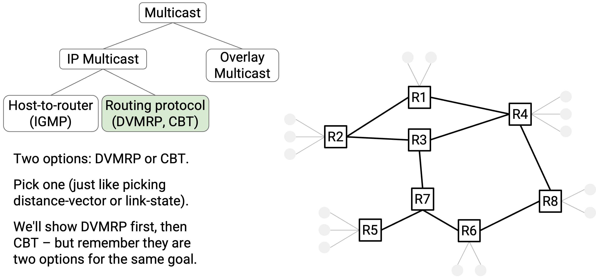

Trong phương pháp **Core-Based Tree (CBT)**, mỗi nhóm đích sẽ có một cây riêng. CBT cho một nhóm đích đơn giản là một cây kết nối tới mọi thành viên của nhóm đó.

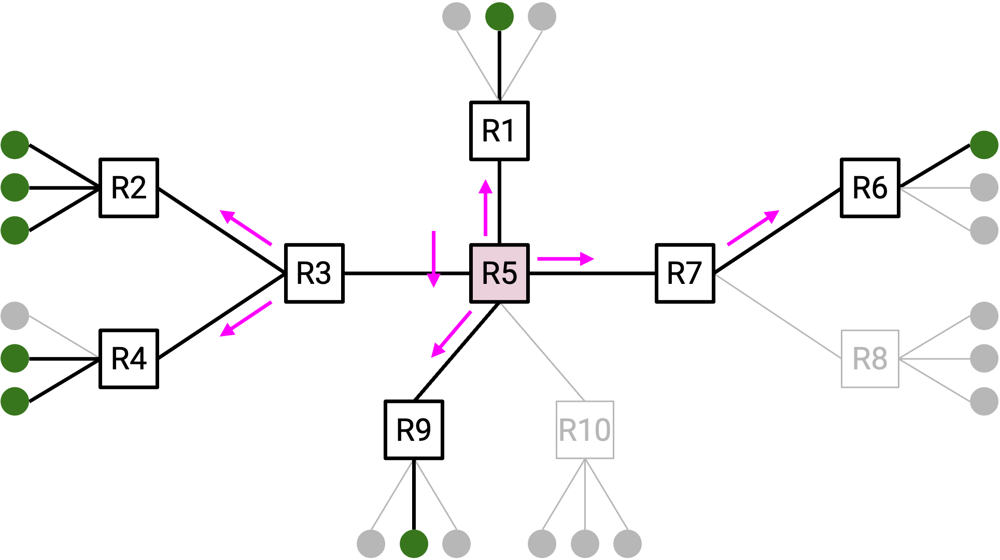

Có thể gây nhầm lẫn khi nghĩ về cây CBT và cây DVMRP cùng lúc. Tạm thời, bạn có thể coi chúng là hai loại cây hoàn toàn khác nhau, không có điểm chung.

## **Xây dựng CBT (Building CBTs)**

Để xây dựng một **core-based tree**, cây cần một gốc, gọi là **core** (lõi). Core là một router bất kỳ trong mạng, được chọn trước.

Bây giờ, chúng ta sẽ xây dựng một cây kết nối tới mọi thành viên của nhóm, với core là gốc.

Nếu một thành viên muốn tham gia nhóm, thành viên đó sẽ **unicast** (gửi đơn hướng) một thông điệp **join** (tham gia) tới core. Gói tin này sẽ đi qua nhiều router để tới core. Tất cả các router trên đường đi này cũng sẽ tham gia vào cây, để cây có đường từ core tới thành viên mới.

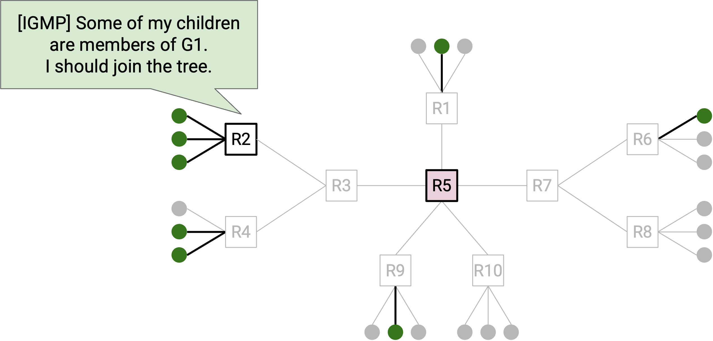

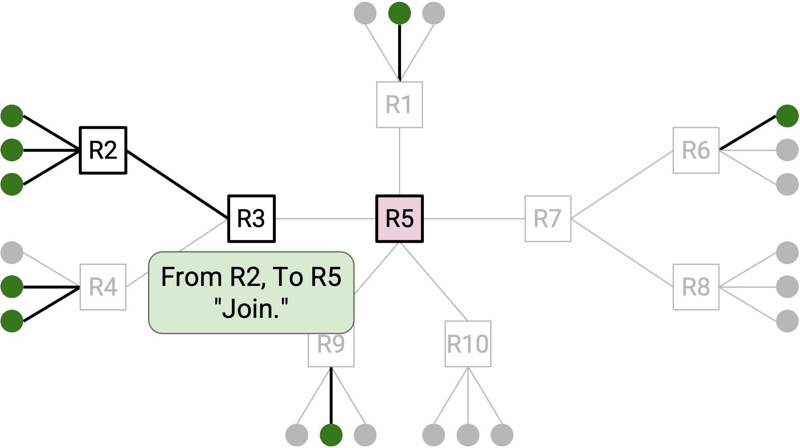

Cụ thể hơn, nếu bạn là một router và nhận được thông điệp join cho một nhóm cụ thể, bạn biết rằng mình hiện là một phần của cây nhóm đó. **Incoming link** (liên kết đầu vào) của thông điệp join là **child** (nhánh con) của bạn – liên kết hướng ra xa gốc. **Outgoing link** (liên kết đầu ra – bước nhảy tiếp theo tới gốc) là **parent** (nhánh cha) của bạn – liên kết hướng về gốc. Bạn có thể ghi lại thông tin về parent và các child của mình để nhớ vị trí của mình trong cây. Không có một thực thể trung tâm nào ghi nhớ toàn bộ cây; mỗi router trên cây tự chịu trách nhiệm ghi nhớ parent và child của mình.

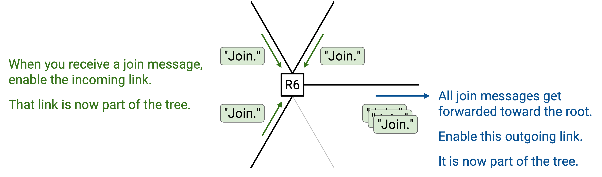

Nếu một thành viên muốn rời nhóm, thành viên đó có thể unicast một thông điệp **quit** (rời nhóm) tới **parent** trực tiếp của mình trên cây. Nếu tất cả các child của bạn trên cây đã gửi thông điệp quit, điều đó có nghĩa là bạn cũng có thể rời cây, và gửi thông điệp quit tới parent trực tiếp của mình. Thông điệp quit chỉ được gửi tới parent trực tiếp và không được chuyển tiếp xa hơn.

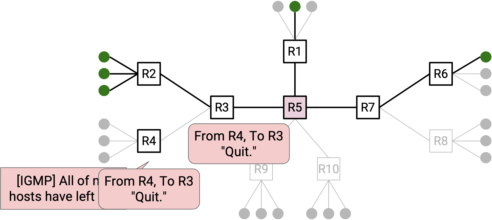

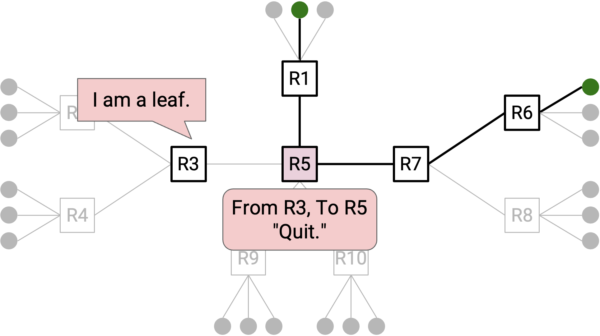

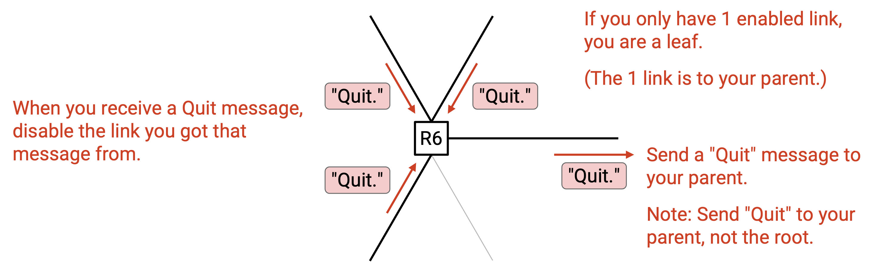

Hãy nhớ rằng chúng ta xây dựng **một cây cho mỗi nhóm**. Điều này có nghĩa là các router phải ghi nhớ parent và child của mình cho từng cây mà chúng tham gia. Đồng thời, các thông điệp join và leave phải gắn với nhóm cụ thể, ví dụ: “Tôi muốn tham gia nhóm G2.”

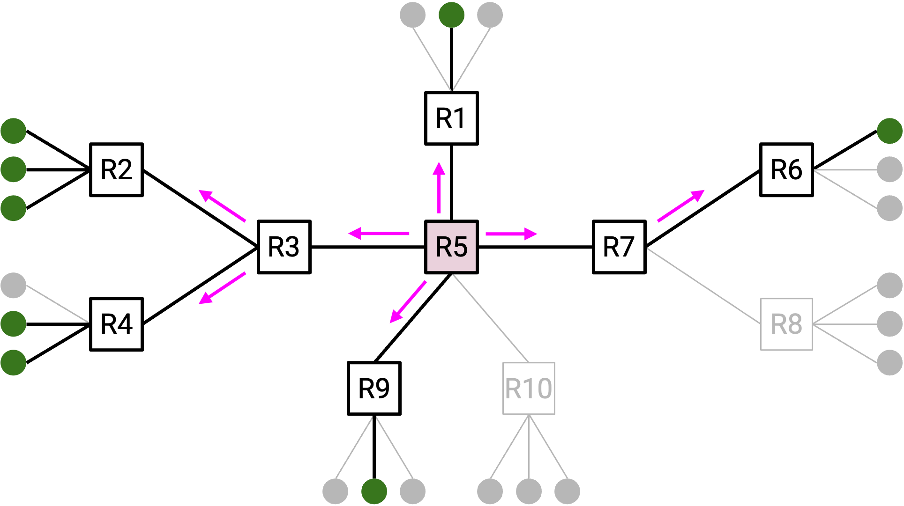

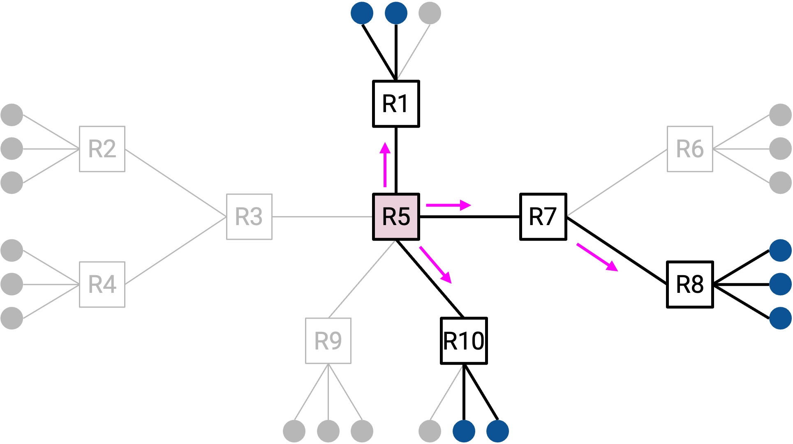

**Một số lưu ý về core** (không phải là trực giác chính của giao thức):  
- Vì core là một router, nó có địa chỉ IP unicast, và mọi người đều có thể gửi gói tin unicast tới core.  
- Chúng ta xây dựng một cây cho mỗi nhóm. Các nhóm khác nhau có thể dùng các core khác nhau.  
- Giả định rằng mọi người đều biết ánh xạ từ nhóm tới core, ví dụ: “Nhóm G1 dùng R2 làm core.” Ánh xạ này có thể được công bố qua một cơ chế như DNS (nhớ rằng DNS hữu ích để phân phối các cặp khóa–giá trị).  
- Core không phải là thành viên nhóm. Trong mô hình này, chúng ta giả định rằng host có thể tham gia/rời nhóm, không phải router. Core là router, nên nó không tham gia nhóm multicast.

**Một số lưu ý về thông điệp join và quit**:  
- Thông điệp join và quit về mặt kỹ thuật được gửi bởi **first-hop router** (router đầu tiên). Router này dùng **IGMP (Internet Group Management Protocol)** để phát hiện một host kết nối trực tiếp đã tham gia hoặc rời nhóm, và first-hop router sẽ gửi thông điệp join hoặc quit.  
- Thực tế, một thông điệp **JOIN-ACK** được gửi để phản hồi join, và router ghi lại parent/child khi JOIN-ACK được gửi. Tương tự, một thông điệp **QUIT-ACK** được gửi để phản hồi quit. Trong phạm vi bài học này, chúng ta sẽ bỏ qua chi tiết này.

## **Sử dụng CBT (Using CBTs)**

Sau khi đã xây dựng CBT cho một nhóm, làm thế nào để sử dụng nó để gửi thông điệp tới nhóm đó?

**Trường hợp 1:** Nếu bạn là thành viên nhóm, nghĩa là bạn đã nằm trên cây. Do đó, bạn chỉ cần **broadcast** (phát quảng bá) thông điệp tới tất cả mọi người trên cây.

Cụ thể hơn, bạn bắt đầu bằng cách chuyển tiếp gói tin tới parent của mình trên cây. Sau đó, mỗi router trên cây nhận gói tin và **flood** (lan truyền) gói tin tới tất cả các liên kết cây của nó (cả liên kết parent và child).

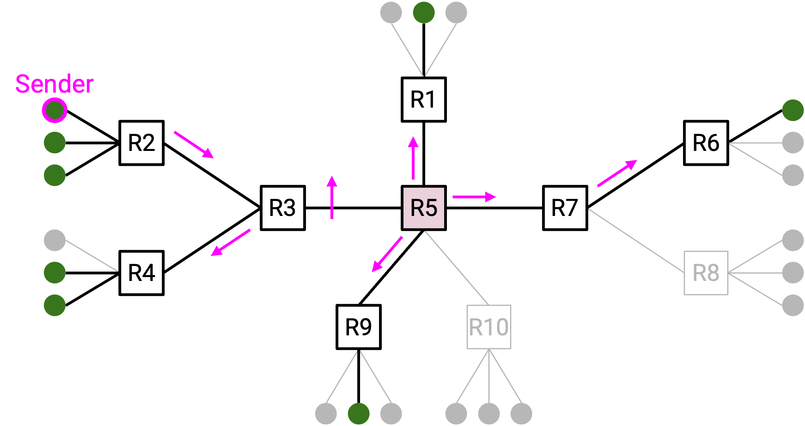

**Trường hợp 2:** Nếu bạn không phải là thành viên nhóm, bạn không nằm trên cây, nên chiến lược ở Trường hợp 1 sẽ không hiệu quả. Thay vào đó, bạn có thể unicast gói tin tới core. Sau đó, core sẽ broadcast thông điệp tới tất cả mọi người trên cây.

Cụ thể hơn, khi bạn unicast gói tin tới core, bạn cần **encapsulate** (đóng gói) gói tin. **Outer header** (tiêu đề ngoài) chứa thông tin unicast để tới core. **Inner header** (tiêu đề trong) chứa thông tin multicast.

Khi core nhận gói tin, nó gỡ bỏ outer header và thấy gói tin multicast bên trong. Core sau đó có thể broadcast gói tin này dọc theo cây. Giống như Trường hợp 1, mỗi router trên cây nhận gói tin và flood gói tin tới tất cả các liên kết cây của nó (cả parent và child).

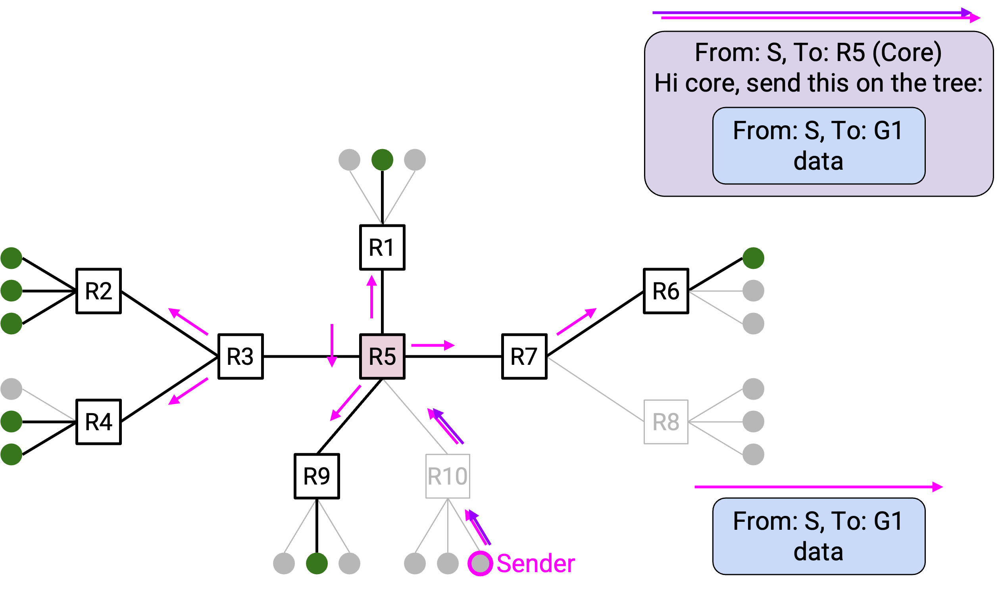

## **Lợi ích: Khả năng mở rộng tốt hơn** (Benefit: Better Scaling)

Hãy nhớ rằng DVMRP mở rộng kém vì các router phải duy trì một cây cho mỗi **source** (nguồn) và mỗi nhóm đích. Mỗi cây thể hiện đường đi ngắn nhất từ một nguồn tới tất cả thành viên của một nhóm đích.

Trong phương pháp CBT, CBT cho một nhóm đích đơn giản là một cây kết nối tới mọi thành viên của nhóm đó.

Lưu ý rằng CBT giống nhau cho tất cả các nguồn. Không giống DVMRP (một cây cho mỗi nguồn và mỗi nhóm đích), giờ đây chúng ta chỉ cần một cây cho mỗi nhóm đích.

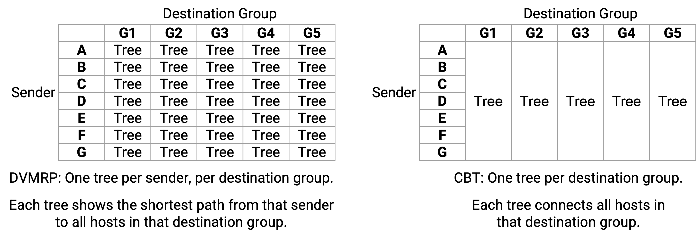

Việc so sánh cây DVMRP và cây CBT giúp thấy rõ khả năng mở rộng của các giao thức, nhưng ngoài điều đó, các cây trong mỗi giao thức có ý nghĩa hoàn toàn khác nhau. Nếu bạn thấy khó hiểu, hãy coi chúng như hai khái niệm hoàn toàn tách biệt.

Hãy nhớ rằng một vấn đề khác về khả năng mở rộng của DVMRP là trạng thái **pruning** (cắt tỉa) được xóa định kỳ, và khi điều đó xảy ra, gói tin sẽ được broadcast tới tất cả mọi người trên mạng (bao gồm cả các thiết bị không thuộc nhóm). CBT cũng giải quyết vấn đề này, vì chẳng có lý do gì để sử dụng CBT khi gói tin phải được phát sóng đến tất cả các thiết bị. Tree cho biết vị trí của các thành viên trong nhóm, do đó đảm bảo rằng các thiết bị không thuộc nhóm sẽ không bao giờ nhận được gói tin.

## **Phân tích hiệu suất** (Efficiency Analysis)

Hãy nhớ rằng **DVMRP (Distance Vector Multicast Routing Protocol)** xây dựng các cây **least-cost** (chi phí thấp nhất) từ **sender** (nguồn gửi) tới tất cả các thành viên của nhóm. Bằng cách chuyển tiếp các gói tin dọc theo các cây này, chúng ta đảm bảo rằng các gói tin sẽ được chuyển tiếp theo các đường đi có chi phí thấp nhất tới tất cả các thành viên nhóm.

Ngược lại, các cây **CBT (Core-Based Tree)** không liên quan đến sender, vì vậy không còn đảm bảo tính tối ưu. Các đường đi từ sender tới tất cả các thành viên nhóm không nhất thiết là các đường đi có chi phí thấp nhất.

CBT đánh đổi giữa khả năng mở rộng (**scalability**) và hiệu suất (**efficiency**). CBT có khả năng mở rộng tốt hơn vì cần xây dựng ít cây hơn (tức là các router lưu trữ ít trạng thái hơn), nhưng đổi lại, các gói tin có thể được chuyển tiếp theo các đường đi không tối ưu.

Hiệu suất của CBT phụ thuộc rất nhiều vào việc router nào được chọn làm **core**. Ví dụ, hãy xem xét cấu trúc mạng dưới đây với các lựa chọn core khác nhau.

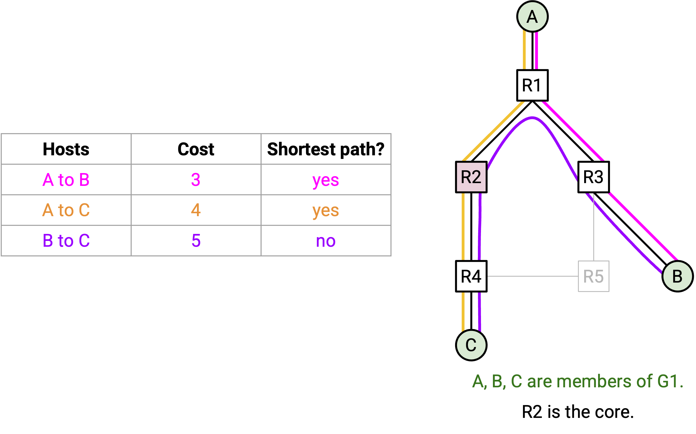

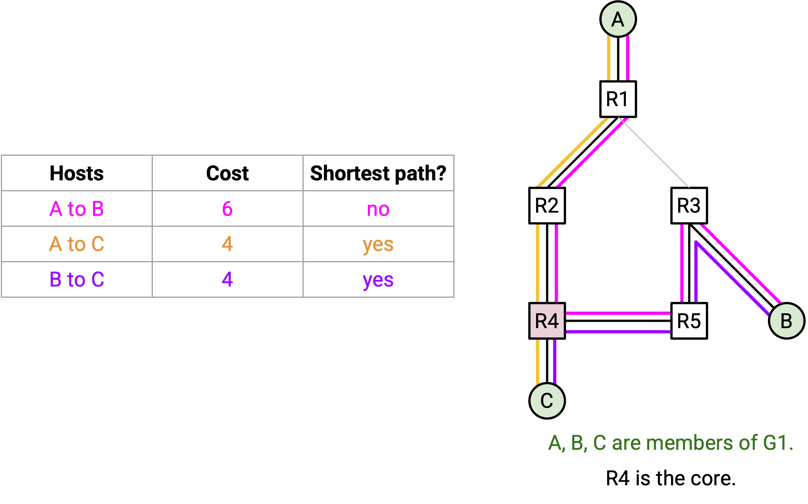

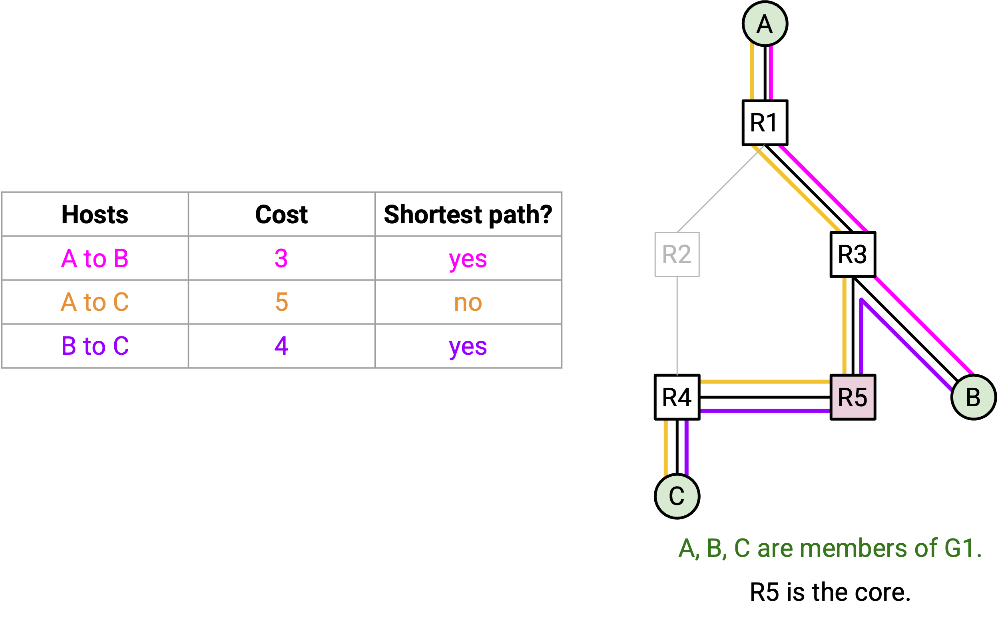

Trong mọi lựa chọn core, luôn có ít nhất một cặp router được kết nối bằng một đường đi không tối ưu. Chúng ta không còn có một cây đường đi ngắn nhất được đảm bảo từ một nguồn tới tất cả các thành viên nhóm.

Ví dụ, nếu A dự định gửi nhiều gói tin tới nhóm, R2 có thể là một lựa chọn core tốt, vì nó tình cờ kết nối A với B và C theo các đường đi ngắn nhất. Tuy nhiên, nếu B muốn gửi gói tin tới nhóm, các gói tin sẽ phải đi theo một đường không tối ưu tới C.

Việc tìm core tối ưu là không khả thi, đặc biệt vì các thành viên có thể tham gia hoặc rời nhóm bất kỳ lúc nào. Trên thực tế, các nhà vận hành thường chọn core thủ công.

## **Các ưu và nhược điểm khác của CBT** (Other CBT Pros and Cons)

CBT tạo ra một **single point of failure** (điểm lỗi đơn) tại gốc. Để bổ sung khả năng chịu lỗi (**fault-tolerance**), chúng ta cần cây có nhiều core. Điều này có thể thực hiện được, nhưng sẽ làm tăng độ phức tạp. Chúng ta sẽ không bàn sâu về cây đa-core, nhưng bạn có thể tham khảo bài báo liên kết bên dưới nếu quan tâm.

Hãy nhớ rằng DVMRP được xây dựng như một phần mở rộng của **distance-vector**, dẫn đến việc giao thức multicast (DVMRP) và giao thức unicast (distance-vector) bị ràng buộc chặt chẽ. Thay đổi một giao thức sẽ yêu cầu cập nhật cả giao thức còn lại. Ngược lại, CBT được tách rời (**decoupled**) khỏi giao thức định tuyến unicast. CBT có sử dụng bảng chuyển tiếp unicast (ví dụ: để chuyển tiếp thông điệp join tới gốc), nhưng không quan trọng các bảng này được tạo ra bằng cách nào (distance-vector, link-state, cấu hình cố định, v.v.). Do đó, CBT không phụ thuộc vào bất kỳ giao thức unicast cụ thể nào và có thể hoạt động với mọi giao thức unicast.

Tài liệu tham khảo thêm về CBT: [https://people.eecs.berkeley.edu/~sylvia/cs268-2019/papers/cbt.pdf](https://people.eecs.berkeley.edu/~sylvia/cs268-2019/papers/cbt.pdf)

**DVMRP hay CBT tốt hơn?** Như chúng ta đã thấy, có những sự đánh đổi giữa hai giao thức này.

- Nếu bạn có **một nguồn** gửi dữ liệu tới **một nhóm lớn**, thì DVMRP có thể là giải pháp tốt hơn, vì nó đảm bảo tất cả dữ liệu này đi theo các đường tối ưu trong mạng. Khi lượng dữ liệu gửi lớn (tới nhiều thành viên nhóm), việc sử dụng đường tối ưu sẽ tiết kiệm đáng kể băng thông. Ngoài ra, nếu nhóm lớn (ví dụ: bao gồm hầu hết mọi người trong mạng), thì việc DVMRP thỉnh thoảng **flooding** (phát tràn) cũng không phải là vấn đề lớn.

- Ngược lại, nếu bạn có **một nhóm nhỏ** với các thành viên phân tán trên một mạng lớn, thì CBT có thể là giải pháp tốt hơn. CBT sẽ tránh việc flooding gói tin tới các nút không phải thành viên, điều này sẽ lãng phí nhiều băng thông (vì hầu hết các nút không thuộc nhóm).

Trên thực tế, cả DVMRP và CBT đều đang được sử dụng ngày nay. DVMRP đôi khi được gọi là **PIM-DM (Protocol Independent Multicast – Dense Mode)**, phản ánh việc DVMRP phù hợp cho các nhóm lớn. CBT đôi khi được gọi là **PIM-SM (Protocol Independent Multicast – Sparse Mode)**, phản ánh việc CBT phù hợp cho các nhóm nhỏ hơn.

