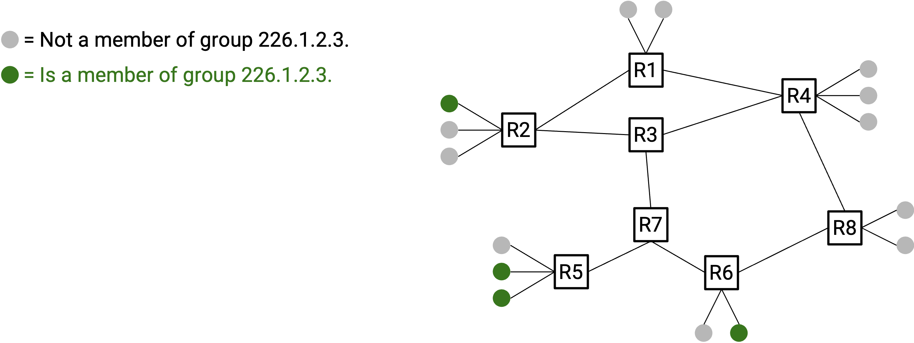
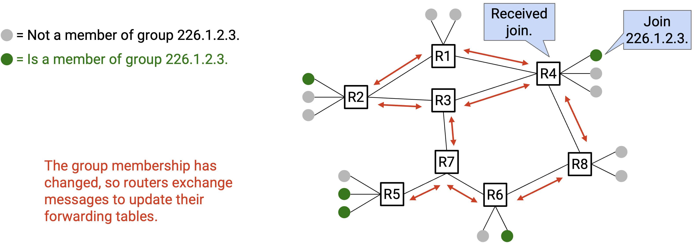
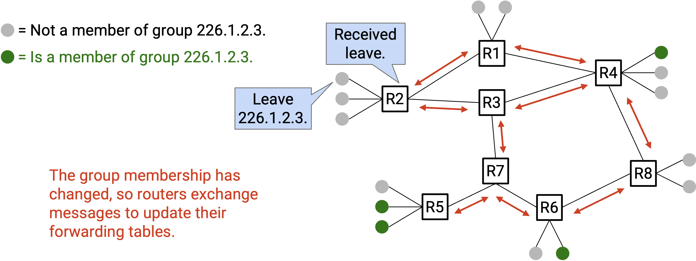
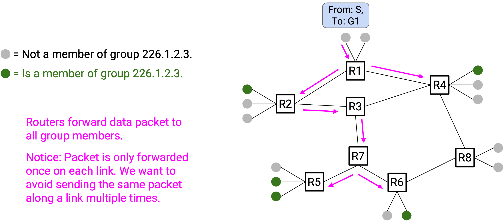
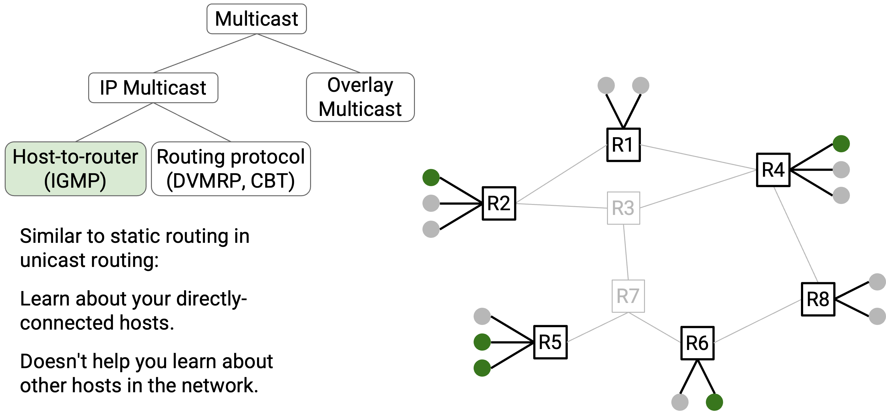
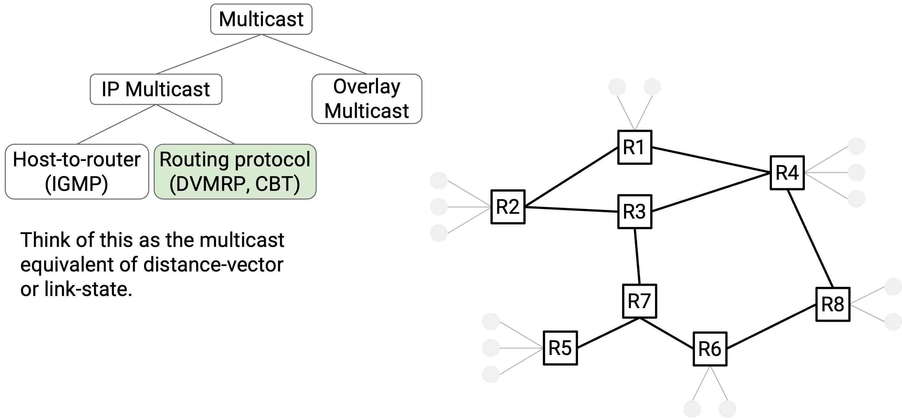
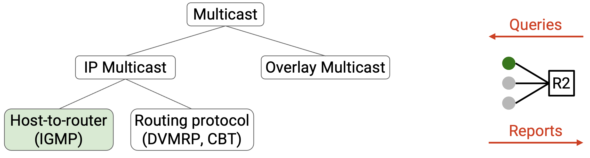

# **IP Multicast**

## **Lược sử IP Multicast** (Brief History of IP Multicast)

**IP multicast** đã được nghiên cứu và phát triển mạnh mẽ trong những năm 1990 và 2000. Động lực phát triển xuất phát từ kỳ vọng rằng ứng dụng “sát thủ” (**killer application**) của Internet sẽ là truyền hình hoặc phát thanh trực tiếp qua mạng. (Thông tin thú vị: Một trong những buổi hòa nhạc được phát trực tiếp sớm nhất là của Rolling Stones vào năm 1994.)

Nhìn lại, các giao thức IP multicast được phát triển trong thập niên 1990 và 2000 có mức độ thành công hỗn hợp về mặt triển khai thực tế. Các **router** hiện đại có hỗ trợ các giao thức IP multicast mà chúng ta sẽ tìm hiểu, nhưng các nhà vận hành mạng không phải lúc nào cũng kích hoạt chúng trên router. (Vô hiệu hóa giao thức trên router đồng nghĩa với việc router đó không hiểu hoặc không hỗ trợ giao thức này.)

Các giao thức IP multicast đôi khi được sử dụng trong phạm vi một miền (ví dụ: bên trong mạng **datacenter**). Tuy nhiên, IP multicast hiếm khi hoặc gần như không bao giờ được triển khai xuyên qua nhiều miền khác nhau. Điều này có nghĩa là người dùng không thể kỳ vọng sử dụng IP multicast ở quy mô toàn cầu, ví dụ: nếu một nhóm người dùng trên khắp thế giới cùng tham gia một **multicast group**, thì Internet hiện đại sẽ không tự động hỗ trợ gửi multicast tới nhóm đó.

Mặc dù các giao thức này không được triển khai toàn cầu, nhưng các kỹ thuật được sử dụng trong chúng có thể áp dụng để giải quyết các vấn đề mạng khác. Đặc biệt, các kỹ thuật này đang trở nên phù hợp trở lại để giải quyết các vấn đề liên quan đến huấn luyện AI (chúng ta sẽ nghiên cứu khi bàn về **collectives**).

## **Mô hình dịch vụ IP Multicast** (IP Multicast Service Model)

Làm thế nào để định nghĩa một nhóm? Mỗi **multicast group** được định nghĩa bởi một địa chỉ IP. Các địa chỉ từ *224.0.0.0* đến *239.255.255.255* là địa chỉ multicast, và mọi người đều biết rằng các địa chỉ trong dải cố định này là địa chỉ multicast.

Để tham gia một nhóm, bạn sẽ thông báo địa chỉ multicast của nhóm mà bạn muốn tham gia. Ít nhất một router phải nhận được thông báo này (ví dụ: router gia đình của bạn), sau đó các router sẽ phối hợp với nhau để lan truyền thông tin này (ví dụ: thông qua một giao thức định tuyến). Cuối cùng, tất cả các router sẽ biết rằng bạn là thành viên của nhóm đó.

Tương tự, bạn có thể thông báo rằng mình rời nhóm, và bạn cũng sử dụng địa chỉ multicast để xác định nhóm mà bạn đang đề cập.

Để gửi một gói tin tới nhóm, tất cả những gì bạn cần làm là điền địa chỉ multicast của nhóm vào trường **IP destination**. Sau đó, các router sẽ sử dụng địa chỉ nhóm này để chuyển tiếp gói tin tới tất cả các thành viên của nhóm. Lưu ý rằng với tư cách là bên gửi, bạn không cần quan tâm ai thuộc nhóm, vì các router sẽ tự xác định điều đó.

Tóm lại, mô hình dịch vụ IP multicast định nghĩa ba thao tác cho **end host** (máy đầu cuối):  
- Bạn có thể gửi gói tin tới một nhóm (ngay cả khi bạn không phải là thành viên của nhóm đó).  
- Bạn có thể thông báo rằng mình tham gia một nhóm.  
- Bạn có thể thông báo rằng mình rời một nhóm.  

Trong cả ba thao tác, nhiệm vụ của bạn chỉ là gửi gói tin. Các router sẽ xử lý các gói tin này, phối hợp với nhau (ví dụ: chạy một giao thức định tuyến), và quyết định cách định tuyến gói multicast tương ứng.

Bây giờ, khi đã biết cách các host tương tác với IP multicast (gửi, tham gia và rời nhóm), chúng ta có thể nghĩ về cách các router phân phối gói multicast.

Trong mô hình unicast, một router nhận gói tin và chuyển tiếp nó qua một **next-hop** duy nhất. Trong mô hình IP multicast, khi một router nhận gói multicast (tức là đích là địa chỉ multicast group), router sẽ chuyển tiếp gói tin qua 0, 1 hoặc nhiều liên kết đầu ra, để gói tin đến được tất cả các thành viên nhóm.

Để triển khai multicast, router cần một số **state** (trạng thái) bổ sung để theo dõi thành viên nhóm, nhằm chỉ chuyển tiếp gói tin tới các next-hop dẫn tới thành viên nhóm. Nếu một next-hop không dẫn tới thành viên nào, không cần gửi gói tin qua đó. Khi người dùng tham gia hoặc rời nhóm, các next-hop của router cho nhóm đó có thể thay đổi.

## **Triển khai Multicast** (Implementing Multicast)

Với mô hình dịch vụ đã được định nghĩa, chúng ta sẵn sàng triển khai IP multicast trên các router. Hãy nhớ mục tiêu cuối cùng: Người dùng tương tác với mạng bằng cách gửi gói tin, thông báo tham gia và rời nhóm. Các router phải lấy thông tin này và sử dụng nó để chuyển tiếp chính xác gói multicast tới tất cả thành viên của nhóm (được xác định bởi địa chỉ multicast).

Chúng ta có thể chia vấn đề này thành hai phần:

1. **Làm thế nào để router biết các nhóm mà các host kết nối trực tiếp thuộc về?** Chúng ta sẽ sử dụng một giao thức gọi là **IGMP (Internet Group Management Protocol)** để giải quyết.

    

2. **Làm thế nào để router chuyển tiếp gói tin qua mạng để đến các thành viên nhóm đích?** Chúng ta sẽ xem xét hai giao thức để giải quyết: **DVMRP** và **CBT**. Cả hai giao thức đều đạt cùng mục tiêu, vì vậy bạn có thể chọn một trong hai để triển khai (giống như bạn có thể chọn **distance-vector** hoặc **link-state**, nhưng không dùng cả hai).

    

## **IGMP: Các host kết nối trực tiếp** (IGMP: Directly-Connected Hosts)

Trước khi giải quyết vấn đề lớn hơn là định tuyến multicast, hãy bắt đầu với một vấn đề nhỏ hơn. Giả sử một router được kết nối trực tiếp với nhiều host. Router cần một cách để biết mỗi host thuộc nhóm nào. Chúng ta sẽ sử dụng giao thức **IGMP** để thực hiện điều này.

Ở mức khái quát, router và các host trao đổi thông điệp để router biết được thành viên nhóm của tất cả host. Một số loại thông điệp có thể được trao đổi:

- **Queries:** Router định kỳ gửi **Query** tới các host. Các thông điệp này hỏi: “Bạn thuộc nhóm nào?”  
- **Reports:** Để trả lời, host gửi **Report** về cho router. Report trả lời câu hỏi: “Đây là (các) nhóm mà tôi thuộc về.” Host cũng có thể gửi **unsolicited Report** (tức là không cần chờ Query).

Bằng cách định kỳ trao đổi Query và Report, router luôn được cập nhật thông tin thành viên nhóm mới nhất. Nếu router không nhận được Report về một thành viên trong thời gian dài, router sẽ giả định rằng thành viên đó đã hết hiệu lực và xóa bỏ.

IGMP giúp router biết về các host kết nối trực tiếp. Tuy nhiên, router vẫn không biết gì về các host ở nơi khác trong mạng, vì vậy chúng ta sẽ cần các thuật toán định tuyến cho phần đó.

So sánh với định tuyến **distance-vector**, bạn có thể coi IGMP như phiên bản multicast của **static routing**, nơi router chỉ biết về các host kết nối trực tiếp (nhưng không biết về các host ở nơi khác trong mạng).

