# Software-Defined Networking (Mạng định nghĩa bằng phần mềm)

## Tại sao lại cần Software-Defined Networking?

Trước đây, chúng ta đã thấy cách các *routing protocols* (giao thức định tuyến) có thể được điều chỉnh để hoạt động trong bối cảnh *datacenter* (trung tâm dữ liệu) (ví dụ: *equal-cost multi-path* (đa đường chi phí bằng nhau)). Sẽ ra sao nếu chúng ta muốn tối ưu hóa các *routing protocols* của mình hơn nữa cho các ràng buộc và trường hợp sử dụng cụ thể của *network* (mạng) của chúng ta? Các *routing protocols* tiêu chuẩn có thể sẽ không còn hoạt động hiệu quả.

Trong phần này, chúng ta sẽ khám phá ***software-defined networking***, một mô hình hoàn toàn mới để suy nghĩ về định tuyến và quản lý mạng. Trong bối cảnh định tuyến, *SDN architecture* (kiến trúc SDN) bao gồm việc có một trung tâm điều khiển tập trung để tính toán các tuyến đường và phân phối chúng đến từng *routers* (bộ định tuyến) riêng lẻ. Chúng ta sẽ xem *SDN* hoạt động như thế nào trong bối cảnh *datacenter* và *wide-area network* (mạng diện rộng), đồng thời thảo luận về các lợi ích và hạn chế của phương pháp tiếp cận mới này.

## Lược sử của Software-Defined Networking

Mặc dù chúng ta sẽ xem xét *SDN* như một phương pháp tiếp cận mới cho các *routing protocols* chuyên biệt, mô hình *SDN* ban đầu được thiết kế để giải quyết các vấn đề nhức nhối ở *management plane* (mặt phẳng quản lý).

Hãy nhớ lại rằng *management plane* rất quan trọng cho hoạt động của mạng. Các *routers* không thể làm gì trừ khi có người cấu hình chúng (ví dụ: gán chi phí cho các *links* (liên kết)) và chỉ dẫn chúng phải làm gì (ví dụ: chạy *routing protocol* nào). Ngoài ra, chúng ta cần các *routers* báo cáo lỗi để giữ cho mạng luôn hoạt động. Rất nhiều công việc quản lý này trong lịch sử đã được thực hiện thủ công.

Mặc dù *management plane* rất quan trọng, nhưng lại có tương đối ít sự tập trung vào việc đổi mới nó. Tại *control plane* (mặt phẳng điều khiển), chúng ta đã thấy rất nhiều *routing protocols* khác nhau, nhưng cách chúng ta cấu hình và điều khiển các *routers* lại phát triển chậm hơn.

Trong suốt lịch sử của Internet, đã có một sự phát triển chậm rãi theo hướng sử dụng các kịch bản (scripts) để tương tác với mạng một cách có lập trình. Các kịch bản này đảm nhận những công việc mà người vận hành sẽ làm thủ công và thực hiện chúng bằng mã lệnh (không có nhiều trí thông minh). Ví dụ, các kịch bản cho phép tự động hóa quá trình thêm *routers* và *links* vào mạng. Một kịch bản để sửa chữa mạng có thể nói: nếu một *router* bị lỗi, hãy kiểm tra xem nó có thực sự bị lỗi không, khởi động lại nó, và nếu vẫn không khắc phục được, hãy báo cáo cho người vận hành.

Bất chấp những tiến bộ, các hệ thống quản lý này đã là nút thắt cổ chai cho hoạt động mạng trong một thời gian dài. Chúng ta vẫn có thể phải chờ đợi sự can thiệp của con người mỗi khi một *router* mới được thêm vào.

Năm 2005, một bài báo của Albert Greenberg và cộng sự đã mô tả vấn đề này bằng cách nói: "Các mạng dữ liệu ngày nay rất mong manh và khó quản lý một cách đáng ngạc nhiên. Chúng tôi cho rằng gốc rễ của những vấn đề này nằm ở sự phức tạp của *control plane* và *management plane*."

Để đối phó với những vấn đề này, các nhà nghiên cứu bắt đầu suy nghĩ về những cách khác nhau để vận hành một hệ thống mạng. Điều này đã dẫn đến những đề xuất cấp tiến hơn, tái định hình lại thiết kế cơ bản của *routers*.

Các khái niệm chúng ta sẽ thấy lần đầu tiên được xem xét vào năm 2003, mặc dù chúng không nhận được nhiều sự chú ý vào thời điểm đó. Sự thất vọng với việc quản lý mạng đã thúc đẩy sự phát triển của các mô hình quản lý mới. Đến năm 2008, đã có nhiều động lực hơn, dẫn đến giao diện *switch* (bộ chuyển mạch) *OpenFlow* (chúng ta sẽ sớm thấy).

Đến năm 2011, rõ ràng là ngành công nghiệp đang đi theo hướng mới này, và *Open Networking Foundation (ONF)* đã được thành lập bởi các nhà khai thác mạng lớn (Google, Yahoo, Verizon, Microsoft, Facebook) và các *vendors* (nhà cung cấp) (Cisco, Juniper, HP, Dell). Nicira, công ty khởi nghiệp tập trung vào *SDN* đã phát triển giao diện *OpenFlow*, là một công ty khởi nghiệp trị giá 40 triệu đô la vào năm 2012.

## Routers được Tích hợp theo chiều dọc và Tiêu chuẩn hóa

Nếu chúng ta muốn tái định hình thiết kế của *routers*, điều đó sẽ được thực hiện trong thực tế như thế nào? Các công nghệ trên *routers* thay đổi theo thời gian ra sao?

Nếu mạng của bạn cần một *router*, bạn có thể sẽ mua một cái từ một *vendor* thiết bị lớn như Cisco hoặc Juniper. Để đảm bảo rằng các *routers* tương thích với nhau, tất cả các *vendors* thiết bị lớn đều xây dựng *routers* của họ theo một số tiêu chuẩn được xác định trước.

Mô hình kinh doanh này có thể gây khó khăn cho sự đổi mới và thử nghiệm các phương pháp tiếp cận mới. Giả sử bạn có một ý tưởng mới cho một *routing protocol*. Bạn sẽ cần phải được một *standards body* (tổ chức tiêu chuẩn) phê duyệt giao thức đó, việc này có thể mất nhiều năm. Sau đó, bạn sẽ phải chờ các *vendors* nâng cấp quy trình sản xuất của họ để tuân thủ tiêu chuẩn mới.

Tiêu chuẩn hóa cũng làm cho *routers* kém linh hoạt hơn đối với người dùng triển khai các giải pháp tùy chỉnh. Nếu bạn có một vấn đề cụ thể cho mạng của mình, nhưng không ai khác gặp vấn đề này, giải pháp của bạn có thể sẽ không được *standards body* chấp nhận. Các *vendors* muốn tạo ra những *routers* đáp ứng nhu cầu của mọi người, và họ sẽ không nhất thiết phải triển khai một giải pháp hoàn hảo cho bạn, nếu không ai khác muốn nó.

Mặt khác, tiêu chuẩn hóa cũng có nghĩa là nếu người khác có một vấn đề mà bạn không có, *router* có thể đi kèm với một giải pháp cho vấn đề của họ, ngay cả khi bạn không cần nó. Điều này có thể làm cho *routers* trở nên phức tạp một cách không cần thiết cho các mục đích của mạng cụ thể của bạn.

Tiêu chuẩn hóa cũng gây khó khăn cho việc thử nghiệm và nghiên cứu. Nếu bạn muốn thử một ý tưởng mới để xem nó có hoạt động hay không, bạn có thể không mua được *routers* có thể triển khai ý tưởng mới của mình. Các *vendors* không muốn xây dựng các sản phẩm thử nghiệm, dành cho một khách hàng cụ thể, mà có thể thậm chí không hoạt động.

Một trở ngại lớn khác cho sự đổi mới và thử nghiệm là các *routers* được ***vertically integrated* (tích hợp theo chiều dọc)**. *Router* bạn mua đã có sẵn chức năng cho cả ba mặt phẳng được tích hợp trên các con chip. Không có tính mô-đun nào cho phép bạn thay thế chỉ riêng *control plane*.

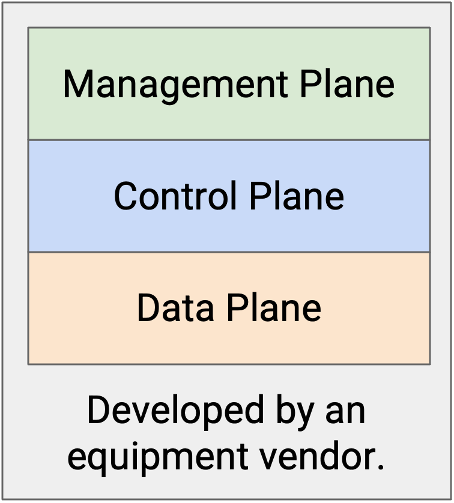

## Đổi mới Routers

Nếu chúng ta muốn đổi mới *routers*, chúng ta có thể đổi mới những gì ở mỗi mặt phẳng, và chúng ta sẽ làm việc với những loại tiêu chuẩn có sẵn nào?

*Data plane* (mặt phẳng dữ liệu) được tiêu chuẩn hóa bởi *IEEE* (nhóm kỹ thuật điện) và yêu cầu mọi người tuân thủ nghiêm ngặt các tiêu chuẩn. Nếu hai *routers* từ các *vendors* khác nhau được kết nối, chúng ta phải đảm bảo cả hai bên đều gửi các bit dọc theo dây vật lý theo cùng một định dạng nhất quán.

Sự đổi mới ở *data plane* thường được thúc đẩy bởi nhu cầu về các *routers* có băng thông cao hơn, và các tính năng mới không thường xuyên được giới thiệu. Sự phát triển này diễn ra khá chậm, trong khoảng 2-3 năm, bởi vì chúng ta phải giải quyết các vấn đề về phần cứng vật lý và thiết kế chip để tăng băng thông. Vì các tính năng cốt lõi của *data plane* tương đối ổn định, sự đổi mới *router* không thực sự tập trung vào *data plane*, và việc chu kỳ phát triển chậm cũng không sao.

*Control plane* được tiêu chuẩn hóa bởi *IETF* (nhóm mạng đứng sau các RFC). Các *vendors* đôi khi thêm các phần mở rộng của riêng họ, mặc dù các tính năng cốt lõi hầu hết đều được tiêu chuẩn hóa. Ví dụ, chúng ta giả định rằng mọi *router* (ngay cả khi chúng đến từ các *vendors* khác nhau) đều tuân theo cùng một *routing protocol*.

Sự đổi mới ở *control plane* (ví dụ: *routing protocols* mới) có thể mất vài năm để được áp dụng. Bạn có thể phải gửi một bản dự thảo đề xuất RFC, và cộng đồng có thể dành thời gian thảo luận về đề xuất trước khi đồng ý về các điều khoản của nó.

*Management plane* cũng được tiêu chuẩn hóa bởi *IETF*, mặc dù nó ít được tiêu chuẩn hóa hơn nhiều. Các nhà khai thác khác nhau có thể sử dụng phần mềm khác nhau để cấu hình *routers* của họ, và chúng ta không thực sự cần các *vendors* khác nhau phải đồng ý về một phần mềm được tiêu chuẩn hóa nào đó. Bởi vì mặt phẳng này chỉ được tiêu chuẩn hóa một cách lỏng lẻo, nhiều phương pháp tiếp cận khác nhau với các tính năng khác nhau tồn tại.

Tóm lại: *Data plane* được tiêu chuẩn hóa (nhưng chúng ta không thực sự có tính năng mới nào trong đầu), *control plane* được tiêu chuẩn hóa (nhưng chúng ta muốn thử các giải pháp mới), và *management plane* không thực sự được tiêu chuẩn hóa.

## Ý tưởng cấp tiến: Tách rời Routers

Tiêu chuẩn hóa và tích hợp theo chiều dọc đã gây khó khăn cho việc đổi mới và thử nghiệm. Điều này đã dẫn đến ý tưởng cấp tiến là tách rời các *routers* bằng cách chia các mặt phẳng thành các lớp trừu tượng khác nhau. Thay vì mua một *router* duy nhất với cả ba mặt phẳng, giờ đây chúng ta có thể mua riêng chức năng của *data plane* và *control plane*. Điều này cho phép chúng ta thay đổi các lớp một cách độc lập với nhau.

Để kết nối ba lớp, chúng ta cần một *API* (Giao diện lập trình ứng dụng) giữa các lớp trừu tượng. Trong một *router* được ghép nối theo chiều dọc, chúng ta không quan tâm *data plane* và *control plane* nói chuyện với nhau như thế nào. Tuy nhiên, nếu chúng ta mua *data plane* riêng và muốn thiết kế *control plane* tùy chỉnh của riêng mình trên đó, chúng ta cần một giao diện để tương tác với *data plane*.

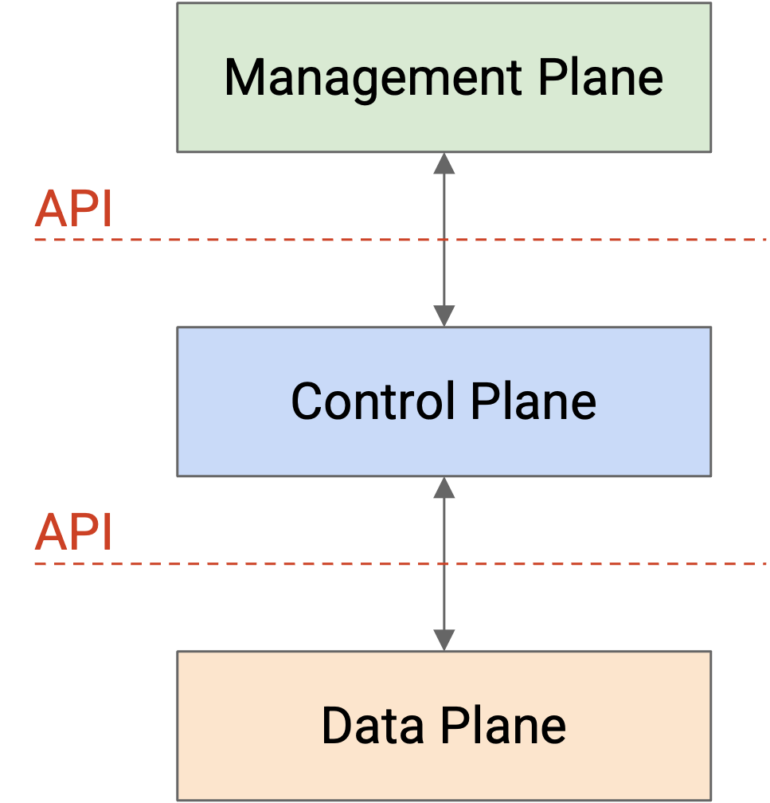

Một ý tưởng cấp tiến hơn nữa là ngừng suy nghĩ về ba mặt phẳng chỉ theo thuật ngữ của *router*, và thay vào đó thiết kế một kiến trúc hệ thống mới tự nhiên tách biệt *data plane* và *control plane*.

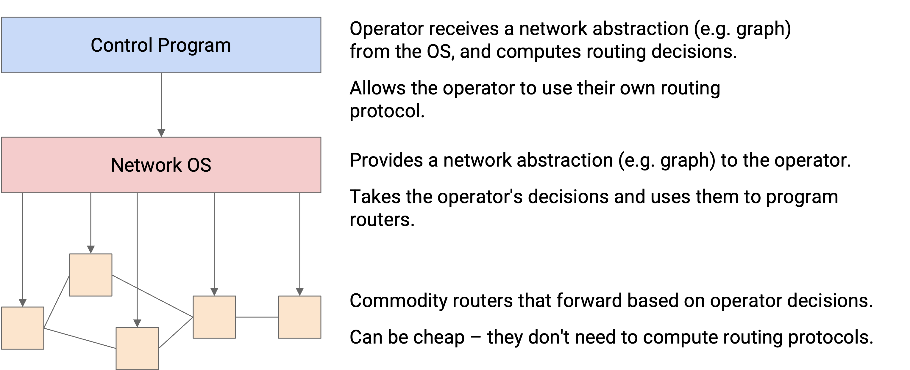

Ở dưới cùng, chúng ta có các *commodity network devices* (thiết bị mạng phổ thông). Bạn có thể coi chúng như việc chỉ mua riêng *data plane*. Các *routers* này nhận chỉ thị từ *control program* (chương trình điều khiển) thông qua *network OS* (hệ điều hành mạng), và chỉ đơn giản là chuyển tiếp các gói tin theo những chỉ thị đó. Các *routers* này hoàn toàn không cần phải suy nghĩ về *routing protocols*, vì vậy chúng có thể rẻ hơn.

Ở giữa, chúng ta có *network OS*. Bạn có thể coi đây là *API* kết nối các *routers* ở *data plane* và *control program* ở *control plane*. *Network OS* cung cấp một sự trừu tượng hóa của các *routers* (ví dụ: dưới dạng một đồ thị) có thể được truyền lên cho *control program*. Sau đó, *control program* có thể gửi các chỉ thị định tuyến đến *network OS*, mà không cần lo lắng về cách lập trình cho các *routers* cụ thể. *Network OS* có thể lấy những chỉ thị đó và lập trình chúng vào từng *routers* riêng lẻ.

Ở trên cùng, chúng ta có *control program*. Bạn có thể coi đây là việc mua hoặc tự triển khai *control plane*. Ở đây, người vận hành nhận được một sự trừu tượng hóa của mạng (ví dụ: đồ thị) từ *network OS*, và có thể sử dụng nó để viết *routing protocol* tùy chỉnh của riêng mình. Sau đó, các tuyến đường kết quả có thể được chuyển đến *network OS*, nơi sẽ lập trình chúng vào các *routers*.

## Định dạng API OpenFlow

***OpenFlow*** là một *API* để tương tác với *data plane* của một *router*. Người vận hành viết mã lệnh phức tạp của riêng họ, tách biệt khỏi *router*, để tính toán các tuyến đường trong mạng. Sau đó, những tuyến đường đó có thể được lập trình vào *forwarding chip* (chip chuyển tiếp).

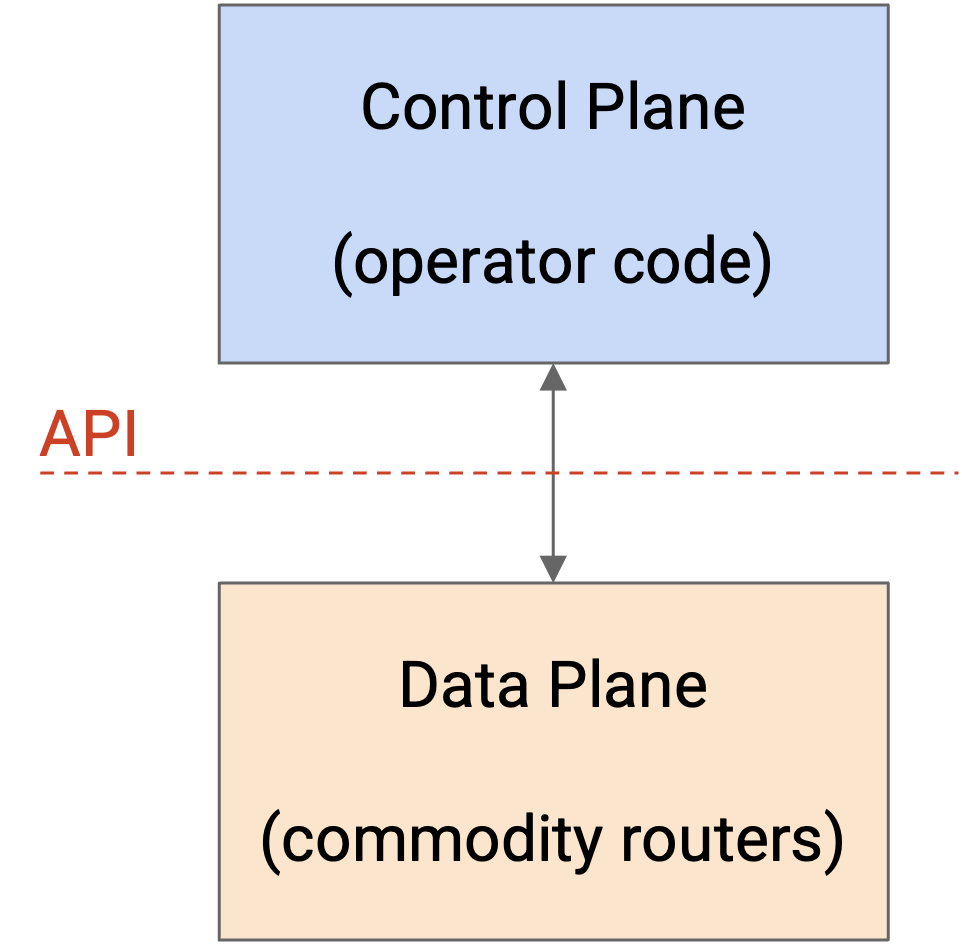

Mô hình *OpenFlow* khác với các *routers* truyền thống, nơi *control plane* được triển khai trong *router*, và không có một *API* rõ ràng nào để lập trình các tuyến đường tùy chỉnh vào *forwarding chip*.

*API* *OpenFlow* định nghĩa một sự trừu tượng hóa là ***flow table* (bảng luồng)** để mô tả các tuyến đường và quy tắc chuyển tiếp. Mã lệnh của người vận hành có thể xuất ra bất kỳ quy tắc và tuyến đường nào mà nó muốn, và cài đặt chúng trên *router*, miễn là chúng ở định dạng *flow table*.

Thành phần cơ bản của *API* là một *flow table*, bạn có thể coi nó như một phiên bản tổng quát của một *forwarding table* (bảng chuyển tiếp). Mỗi *flow table* bao gồm các cặp khóa-giá trị, giống như một *forwarding table*. Khóa chỉ định điều kiện để ***match* (đối sánh)** với gói tin. Điều này có thể là một *destination prefix* (tiền tố đích), một đích chính xác, một *5-tuple* (bộ 5 thông tin gồm IP nguồn, IP đích, cổng nguồn, cổng đích, và giao thức), hoặc các phép *match* tương đối đơn giản khác. Giá trị tương ứng chỉ định ***action* (hành động)** sẽ được thiết lập khi một gói tin khớp. *Action* có thể là gửi gói tin đến một chặng kế tiếp (giống như một *forwarding table*), nhưng cũng có thể chỉ định các *action* phức tạp hơn như thêm một *header* (tiêu đề) bổ sung.

Định dạng đầu ra là một chuỗi gồm một hoặc nhiều *flow tables* được đánh số, trong đó mỗi bảng có các mục *match-action* khác nhau. Những *flow tables* này sau đó có thể được lập trình vào *forwarding chip*.

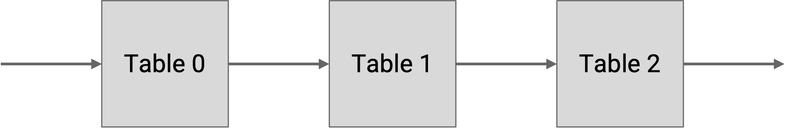

Khi một gói tin đến một *router*, nó được kiểm tra với từng bảng theo thứ tự (ví dụ: Bảng 0, Bảng 1, Bảng 2, v.v.), và khi có một sự *match*, chúng ta ghi lại *action* tương ứng (mà chưa thực thi nó). Cuối cùng, một khi gói tin được kiểm tra với bảng cuối cùng, bất kỳ *action* nào chúng ta đã ghi lại sẽ được áp dụng cho gói tin.

Cũng có các *action* đặc biệt để bỏ qua đến các bảng sau, mà chúng ta có thể sử dụng trong các quy tắc như: Nếu cổng nguồn khớp với số này, hãy bỏ qua đến bảng 5 để thiết lập các *action* bổ sung.

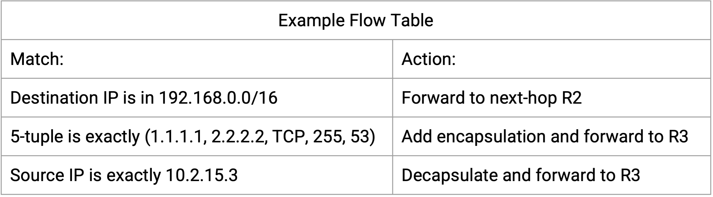

Người vận hành có thể chạy bất kỳ mã lệnh nào họ muốn để tạo ra các *flow tables*, và các *flow tables* có thể tổng quát hơn một *forwarding table* đích/chặng-kế-tiếp. Tuy nhiên, các quy tắc (*match/action* pairs) mà chúng ta tạo ra vẫn bị giới hạn bởi phần cứng của *forwarding chip* chuyên dụng. *Forwarding chip* được tối ưu hóa cho tốc độ, và có lẽ không thể xử lý các quy tắc *match* phức tạp như "nếu phần tải tin (payload) của TCP là tiếng Anh, hãy đặt *action* này."

Kết quả là, các *flow tables* chúng ta thấy trong thực tế cuối cùng trông khá giống với các bảng chúng ta đã thấy. Các quy tắc *match* phổ biến bao gồm *longest prefix matching* (khớp tiền tố dài nhất) trên đích IP, *5-tuples* để xác định các luồng, và khớp chính xác trên các *encapsulation headers* (tiêu đề đóng gói) (ví dụ: *MPLS*).

Nếu các quy tắc chuyển tiếp không khác biệt nhiều, tại sao lại sử dụng *OpenFlow*? Hãy nhớ rằng, lợi thế chính là nó cho phép người vận hành hoàn toàn tự do ở *control plane*. Chúng ta không còn bị giới hạn bởi các giao thức *distance-vector* (vector khoảng cách) hay *link-state* (trạng thái liên kết) nữa.

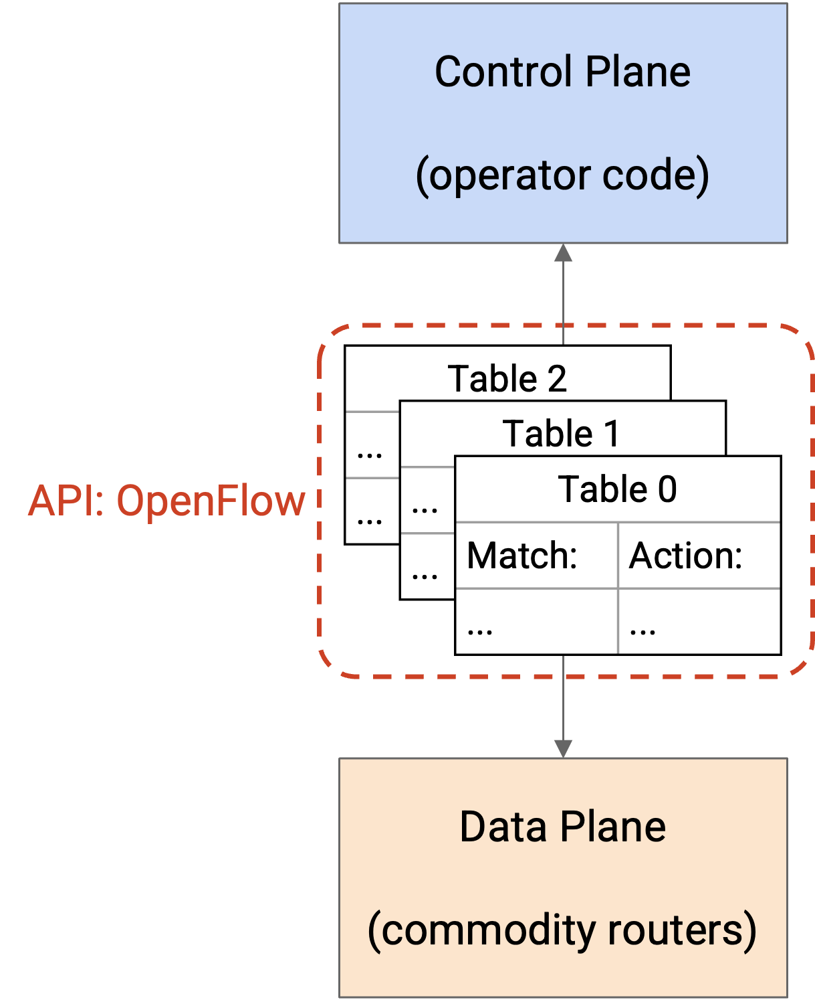

## Lợi ích của một Control Plane linh hoạt

Kiến trúc mới của chúng ta mang lại cho người vận hành sự linh hoạt để triển khai *routing protocol* mới của họ tại *control plane*. Một số lợi ích của phương pháp này là gì?

Người vận hành có thể triển khai các *routing protocols* tùy chỉnh phù hợp nhất với nhu cầu cụ thể của họ. Người vận hành không còn bị ràng buộc bởi các *standards bodies* và *vendors*.

Sự linh hoạt cũng cho chúng ta cơ hội để đơn giản hóa. Ví dụ, nếu giao thức được tiêu chuẩn hóa bao gồm các tính năng chúng ta không cần, chúng ta không phải triển khai chúng trong giải pháp tùy chỉnh của mình. Các giao thức đơn giản hơn có thể có ít mã lệnh hơn và mã lệnh đơn giản hơn, điều này có thể cho phép phát triển và bảo trì giao thức đó dễ dàng hơn.

Cuối cùng, một *control plane* linh hoạt cho phép tính toán các tuyến đường một cách tập trung tại *control program*, thay vì phân tán trên nhiều *routers*. Sự tập trung hóa cũng đi kèm với một số lợi ích.

Sự tập trung hóa có thể dẫn đến các quyết định định tuyến thông minh hơn, mang lại hiệu suất xuất sắc. Trong một báo cáo năm 2013 từ Google, các kỹ sư đã triển khai một *SDN architecture* đã ghi nhận rằng "*traffic engineering* (kỹ thuật lưu lượng) tập trung giúp các *links* đạt gần 100% hiệu suất sử dụng, trong khi phân chia các luồng ứng dụng trên nhiều đường đi để cân bằng dung lượng với mức độ ưu tiên/yêu cầu của ứng dụng." Một bài báo năm 2013 của Microsoft mô tả việc sử dụng một bộ điều khiển *OpenFlow* để "đạt được hiệu suất sử dụng cao với WAN điều khiển bằng phần mềm."

Các quyết định định tuyến thông minh hơn có thể giúp tối ưu hóa các tiêu chí khác ngoài hiệu suất, mà một *routing protocol* tiêu chuẩn không thể dễ dàng tối ưu hóa. Ví dụ, một mạng của chính phủ Hoa Kỳ có thể triển khai một quy tắc khoanh vùng địa lý (geofencing) rằng, không gửi lưu lượng qua các *links* ở Canada. Hoặc, một mạng truyền hình quảng bá có thể muốn tối ưu hóa cho sự đa dạng của đường đi để tăng độ tin cậy. Chúng ta có thể thực thi rằng hai luồng di chuyển qua các đường đi không chia sẻ bất kỳ *links* nào, để nếu một *link* bị hỏng, chỉ một trong hai luồng bị ảnh hưởng. Hai đường đi có thể đóng vai trò dự phòng cho nhau.

Sự tập trung hóa cũng có thể giúp các *routing protocols* hội tụ dễ dàng hơn. Trong một giao thức phân tán, nếu mạng thay đổi, các *routers* phải phối hợp để hội tụ về một trạng thái định tuyến mới. Trong mô hình tập trung này, nếu một *link* bị lỗi, *router* đó có thể báo cho "sếp", và "sếp" có thể tính toán lại các tuyến đường và cài đặt các tuyến đường mới trên các *routers*.

## Traffic Engineering

Một *control plane* linh hoạt cho phép chúng ta thực hiện ***traffic engineering***, có nghĩa là chúng ta có thể định tuyến lưu lượng một cách thông minh và hiệu quả hơn so với một *routing protocol* phân tán tiêu chuẩn.

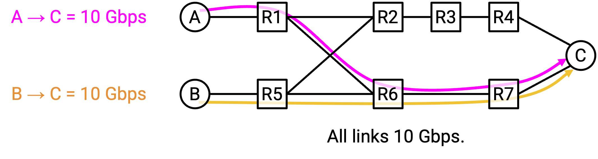

Giả sử có hai kết nối, S1-D ở tốc độ 10 Gbps và S2-D ở tốc độ 10 Gbps. Nếu chúng ta chỉ chạy *least-cost routing* (định tuyến chi phí thấp nhất) tiêu chuẩn, cả hai luồng sẽ gửi lưu lượng dọc theo đường đi phía dưới. Đường đi phía dưới sẽ bị tắc nghẽn (20 Gbps trên *link* 10 Gbps), trong khi *bandwidth* (băng thông) của đường đi phía trên không được sử dụng.

Với một cơ chế định tuyến thông minh hơn, chúng ta có thể gửi lưu lượng S1-D dọc theo đường đi phía trên, và lưu lượng S2-D dọc theo đường đi phía dưới. Bằng cách sử dụng *traffic engineering*, chúng ta đã buộc một số gói tin phải đi một con đường dài hơn, để tận dụng tốt hơn *bandwidth* trong mạng.

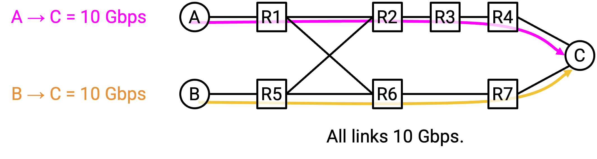

Để tính toán các tuyến đường này, chúng ta có thể sửa đổi *least-cost routing*, và thay vào đó thực thi rằng lưu lượng nên đi trên con đường ngắn nhất có đủ dung lượng. Chúng ta cũng có thể thực thi các ràng buộc khác thay vì dung lượng, chẳng hạn như *latency* (độ trễ). Thuật toán kết quả được gọi là ***constrained Shortest Path First (cSPF)***.

Bây giờ, giả sử S1-D cần 12 Gbps, và S2-D cần 8 Gbps. *cSPF* sẽ gửi các luồng đi theo các đường khác nhau để tối đa hóa *bandwidth*, nhưng S1-D đang gửi 12 Gbps qua một *link* 10 Gbps.

Để khắc phục điều này, *traffic engineering* của chúng ta có thể còn thông minh hơn nữa, và chia lưu lượng trong một luồng qua các đường đi khác nhau. S1-D có thể gửi 10 Gbps lưu lượng của mình dọc theo đường đi phía trên, và 2 Gbps còn lại dọc theo đường đi phía dưới.

Một lần nữa, *traffic engineering* của chúng ta đã cho phép chúng ta triển khai logic tùy chỉnh mang lại hiệu quả sử dụng dung lượng mạng tốt hơn.

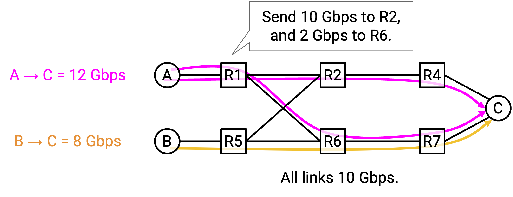

Làm thế nào để chúng ta thực sự triển khai các đường đi được phân chia trong mạng, sử dụng *API OpenFlow* từ trước? Hãy nhớ rằng, các quyết định định tuyến của chúng ta vẫn nên tuân theo các quy tắc đơn giản mà các *forwarding tables* có thể hiểu được.

Một cách tiếp cận là sử dụng *encapsulation* (sự đóng gói). Tại bên gửi, chúng ta có thể thêm các quy tắc để thêm một *header* bổ sung, trong đó một số gói tin nhận nhãn 0, và phần còn lại nhận nhãn 1. Nhãn này cho chúng ta biết nên gửi lưu lượng theo đường nào.

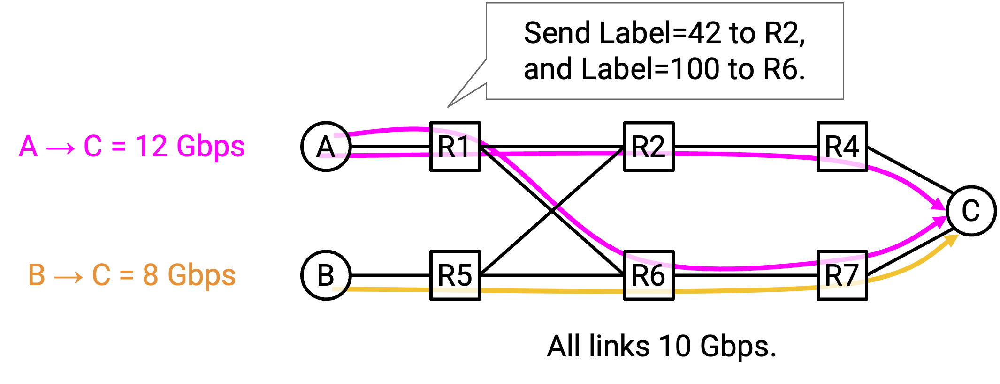

Bây giờ, tại R1, chúng ta có thể thêm các quy tắc đơn giản để định tuyến các gói tin có nhãn 0 lên R2, và các gói tin có nhãn 1 xuống R3. Ý tưởng này có thể được áp dụng ngoài các quy tắc khác mà chúng ta đã có cho *constrained least-cost routing* (ví dụ: các *flow tables* có thể có các mục khác cho các đích khác hoặc các luồng khác).

## Traffic Engineering tập trung và các quyết định tối ưu toàn cục

Một khác biệt lớn trong mô hình *SDN* của các *routing protocols* tùy chỉnh là sự tập trung hóa. Trong mô hình ban đầu, mỗi *router* đều chạy *routing protocol* của riêng mình. Bây giờ, chúng ta có thể có một máy tính duy nhất bên ngoài các *routers* tính toán tất cả các tuyến đường, và sau đó sử dụng *API flow table* để cài đặt những tuyến đường đó lên các *routers*.

Sự tập trung hóa cho phép chúng ta đưa ra các ***globally optimal decisions* (quyết định tối ưu toàn cục)**. Trong một giao thức phân tán, mỗi *router* đang đưa ra quyết định tốt nhất cho chính nó, nhưng đó có thể không phải là quyết định tốt nhất cho các *routers* khác. Trong mô hình tập trung, "sếp" có thể sử dụng cái nhìn toàn cục về mạng để quyết định điều gì là tốt nhất cho mọi người, và yêu cầu các *routers* tuân theo quyết định đó.

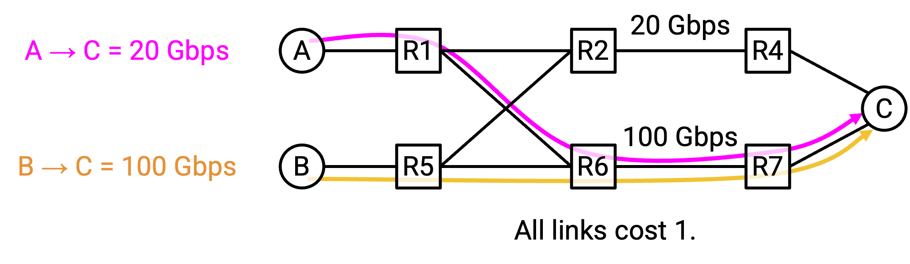

Hãy xem xét mạng này với hai luồng, S1-D ở tốc độ 20 Gbps, và S2-D ở tốc độ 100 Gbps. Giả sử chúng ta chưa triển khai hỗ trợ cho việc chia một luồng ra nhiều đường đi.

Giả sử luồng 20 Gbps S1-D bắt đầu trước. Sử dụng *constrained shortest path first*, S1 có thể chọn sử dụng đường đi phía dưới. Từ góc độ của S1, đây là một quyết định tối ưu cục bộ (đường đi trên và dưới đều tốt như nhau).

Sau đó, luồng 100 Gbps S2-D bắt đầu. Bây giờ, sử dụng *constrained shortest path first*, S2-D không có bất kỳ đường đi đơn lẻ nào đáp ứng được yêu cầu của nó. Cả đường đi phía trên (20 Gbps) và đường đi phía dưới (80 Gbps) đều không đủ dung lượng.

Vấn đề chính ở đây là, mỗi *router* riêng lẻ đã tự đưa ra quyết định của mình một cách độc lập, không có sự phối hợp.

Bằng cách giới thiệu một bộ điều khiển tập trung, bộ điều khiển có thể nhìn vào cấu trúc tổng thể của mạng và nhu cầu của mỗi luồng, và gán các đường đi cho mỗi luồng một cách thông minh hơn. Quyết định kết quả là tối ưu toàn cục, và tăng hiệu quả mạng.

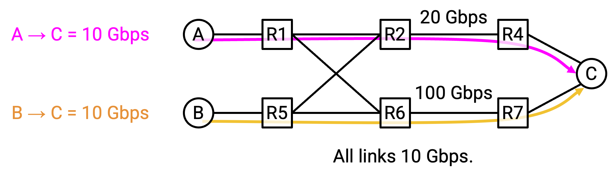

*Traffic engineering* tập trung có thể đưa ra các quyết định định tuyến thông minh hơn nữa, tùy thuộc vào những gì người vận hành muốn tối ưu hóa. Ví dụ, chúng ta có thể phân loại các luồng thành luồng ưu tiên cao hoặc ưu tiên thấp, và đưa ra các quyết định tối ưu hóa cả việc sử dụng mạng và nhu cầu của các ứng dụng khác nhau.

## SDN trong Datacenter Overlay

Trong phần trước, chúng ta đã thấy rằng các *virtual switches* (bộ chuyển mạch ảo) có thể áp dụng *encapsulation* để kết nối mạng *overlay* (lớp phủ) và *underlay* (lớp nền). Với một *virtual address* (địa chỉ ảo), chúng ta có thể thêm một *header* với *physical address* (địa chỉ vật lý) tương ứng, cho phép gói tin được gửi đi trên mạng *underlay*. Nhưng, làm thế nào để chúng ta biết được sự ánh xạ giữa *virtual addresses* và *physical addresses*?

Chúng ta cũng đã thấy rằng *encapsulation* có thể được sử dụng để hỗ trợ nhiều *tenants* (người thuê) trong một *datacenter* duy nhất, mỗi *tenant* chạy mạng riêng của mình. Các *switches* có thể thêm các *headers* với một *virtual network ID* (mã định danh mạng ảo). Nhưng, làm thế nào để chúng ta biết nên sử dụng *virtual network ID* nào?

Một bộ điều khiển *SDN* tập trung có thể được sử dụng trong *datacenter* để giải quyết những vấn đề này. Mỗi *tenant* có thể vận hành bộ điều khiển của riêng mình. Khi một *VM* (Máy ảo) mới được tạo, *SDN* sẽ biết được *virtual address* và *physical address* của nó. Sau đó, *SDN* có thể cập nhật các *forwarding tables* trong các *virtual switches* khác, thêm các quy tắc *encapsulation* với ánh xạ địa chỉ ảo/vật lý mới.

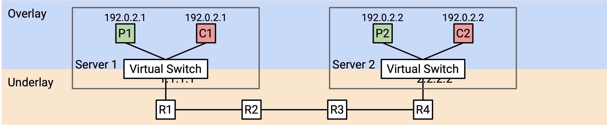

Ví dụ, giả sử Coke *VM* 2 được tạo với *virtual IP* (IP ảo) là 192.0.2.1 và *physical IP* (IP vật lý) là 2.2.2.2. *SDN* biết rằng Coke *VM* 1 đang ở trên *physical server* (máy chủ vật lý) 1.1.1.1, vì vậy nó có thể đến *virtual switch* trên 1.1.1.1 và thêm một quy tắc *encapsulation* cho Coke *VM* 2 mới.

*Flow table* tại 1.1.1.1 có thể nói: Nếu bạn nhận được một gói tin có đích là 192.0.2.1, hãy thêm một *header* với *virtual network ID* của Coke là 42. Đồng thời, thêm một *header* với *physical address* tương ứng là 2.2.2.2. Sau đó, gửi gói tin đi trên mạng *underlay*.

## Lợi ích của SDN trong Datacenter Overlay

Tại sao chúng ta lại sử dụng kiến trúc *SDN* tập trung để hỗ trợ ảo hóa và *multi-tenancy* (đa người thuê) trong *datacenter*, thay vì một *routing protocol* tiêu chuẩn hơn?

Kiến trúc *SDN* tập trung cho phép chúng ta tách biệt rõ ràng mạng *overlay* và *underlay* thành hai lớp có khả năng mở rộng. Trong một kiến trúc truyền thống, các *routers* trong mạng *underlay* sẽ phải xử lý các *encapsulation headers* tùy chỉnh (ví dụ: *virtual network IDs*). *SDN* cho phép mạng *underlay* vẫn đơn giản, mà không cần phải suy nghĩ về ảo hóa hay *multi-tenancy*.

Sự tập trung hóa cho chúng ta một cách đơn giản để triển khai *control plane* tại các *end hosts* (máy chủ đầu cuối), mà không cần bất kỳ *routing protocols* phức tạp nào. Bộ điều khiển biết về một máy chủ mới và cập nhật các máy chủ khác tương ứng. Nếu không có bộ điều khiển tập trung, chúng ta có thể cần một cơ chế phân tán phức tạp nào đó để tìm ra nên thêm *encapsulation headers* nào.

Kiến trúc *SDN* này cũng cho chúng ta thấy tại sao các mạng *overlay* có thể mở rộng tốt. Bộ điều khiển *SDN* cho một *tenant* chỉ cần biết về các *VMs* thuộc về *tenant* cụ thể đó. Ngược lại, nếu chúng ta sử dụng kiến trúc truyền thống, một *VM* Coke mới có thể phải được quảng bá đến tất cả các *VMs* khác, ngay cả các *VMs* của Pepsi.

## SDN trong Datacenter Underlay

*Datacenter underlay* là một mạng vật lý, giống như bất kỳ mạng nào khác, mặc dù có một topo đặc biệt. Nhiều thách thức mạng thông thường, như đạt được hiệu suất sử dụng cao của các *links*, cũng áp dụng cho các mạng *datacenter underlay*. Điều đó có nghĩa là chúng ta cũng có thể áp dụng *SDN* cho mạng *underlay*.

*SDN* tại mạng *underlay* có thể giúp chúng ta định tuyến các gói tin qua *datacenter* một cách hiệu quả. Ví dụ, người vận hành có thể muốn gửi các *mice flows* (luồng chuột - các luồng dữ liệu nhỏ và ngắn) dọc theo các *links* có độ trễ nhỏ, và các *elephant flows* (luồng voi - các luồng dữ liệu lớn và kéo dài) dọc theo các *links* có *bandwidth* cao.

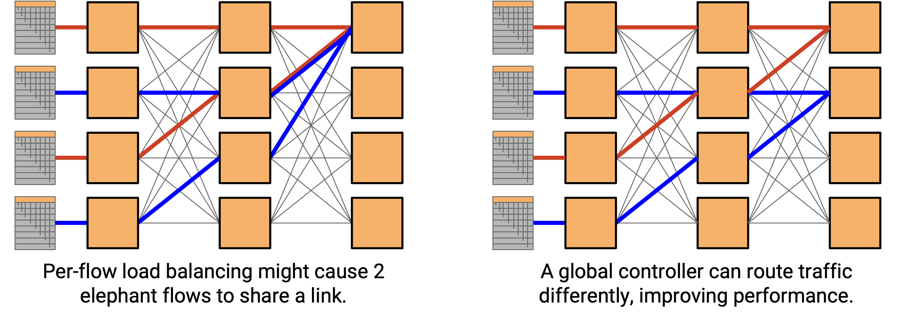

Trong *Clos network* (mạng Clos) *underlay* của chúng ta, *per-flow load balancing* (cân bằng tải trên từng luồng) (sử dụng *hash 5-tuple* (hàm băm bộ 5 thông tin) để chọn đường đi) vẫn có thể gửi nhiều *elephant flows* đi cùng một đường. Ngay cả khi hai *elephant flows* sử dụng các đường đi khác nhau, các đường đi đó có thể chia sẻ các *links*, và những *links* đó có thể bị tắc nghẽn. Một bộ điều khiển *SDN* có thể giải quyết vấn đề này bằng cách phối hợp các luồng và đặt chúng vào các đường đi không chồng chéo.

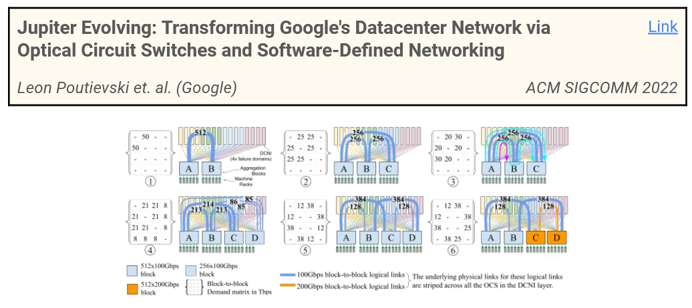

Bài báo năm 2022 này của Google mô tả việc loại bỏ các lớp trong *Clos network* (ít *links* hơn, *datacenter* rẻ hơn) bằng cách sử dụng *SDN* để định tuyến lưu lượng một cách thông minh hơn.

Các *Hyperscale datacenters* (trung tâm dữ liệu siêu quy mô) thường sử dụng *SDN* trong cả mạng *overlay* và *underlay*. Chúng thường được triển khai như các hệ thống tách rời. Có một *SDN* suy nghĩ về *underlay*, và một *SDN* riêng biệt suy nghĩ về *overlay*.

## SDN trong Wide Area Networks

Ngoài các *datacenter*, *SDN* có thể hữu ích trong các *Wide Area Networks* (WAN) nói chung, đặc biệt khi việc sử dụng *bandwidth* hiệu quả là rất quan trọng. Ví dụ, trong ví dụ về *traffic engineering* từ trước, hãy tưởng tượng nếu các *links* 10 Gbps của chúng ta là *undersea cables* (cáp ngầm dưới biển). Không có cách nào rẻ tiền để thêm *bandwidth* bổ sung, vì vậy các tối ưu hóa phải tập trung vào việc sử dụng hiệu quả *bandwidth* mà chúng ta có.

## Hạn chế của điều khiển tập trung

Sự tập trung hóa không phải là miễn phí và có một số hạn chế.

Một hạn chế là độ tin cậy. Trong một mạng truyền thống, nếu một *router* bị lỗi, *routing protocol* sẽ hội tụ xung quanh sự cố đó. Các *routers* khác có thể định tuyến lại lưu lượng dọc theo các đường đi khác. Ngược lại, nếu bộ điều khiển trung tâm bị lỗi, chúng ta không còn cách nào để cập nhật mạng nữa, và các *routers* không biết cách điều chỉnh theo những thay đổi.

Lưu ý: Chúng ta đã vẽ bộ điều khiển tập trung như một thực thể duy nhất, nhưng nó không cần phải chạy trên một máy chủ duy nhất. Việc tính toán ở *control plane* có thể diễn ra trên nhiều máy chủ, nơi các máy chủ đó phối hợp để hoạt động một cách tập trung về mặt logic. Điều này khác với mô hình ban đầu, nơi các *routers* phối hợp nhưng vẫn tự đưa ra các quyết định phân tán của riêng mình. Điều này giúp tránh có một *single point of failure* (điểm lỗi duy nhất) trong phần cứng, mặc dù bộ điều khiển với tư cách là một đơn vị logic vẫn có thể bị lỗi (ví dụ: lỗi trong mã lệnh).

Sự tập trung hóa cũng gây ra các vấn đề về *scalability* (khả năng mở rộng). Bộ điều khiển phải đưa ra quyết định cho tất cả mọi người, điều này có thể trở nên tốn kém đối với các mạng lớn. Ngược lại, trong một mạng truyền thống, mỗi *router* chỉ phải thực hiện các phép tính cho chính nó.

Sự tập trung hóa cũng có thể gây ra các loại phức tạp khác. Trong một mạng truyền thống, chúng ta có thể mua một *router* và kết nối nó, và nó gần như bắt đầu hoạt động ngay lập tức. Với một bộ điều khiển trung tâm, chúng ta có thêm những thách thức về cơ sở hạ tầng. Chúng ta nên đặt bộ điều khiển này ở đâu? Làm thế nào để kết nối nó với các *routers* riêng lẻ một cách đáng tin cậy?

Đây là một lĩnh vực nghiên cứu tích cực, bao gồm một dự án của Sylvia Ratnasamy và Rob Shakir (giảng viên khóa học Berkeley CS 168).

## SDN trong Management Plane và Data Plane

Chúng ta đã thấy *SDN* như một cách mới để triển khai *control plane*. Nhưng, sự thất vọng ban đầu dẫn đến sự phát triển của *SDN* là ở *management plane*.

Hóa ra, nhiều mô hình thiết kế mà *SDN* đã sử dụng ở *control plane* cũng có thể áp dụng cho *management plane*. Ví dụ, chúng ta đã thấy rằng *SDN* dựa trên các *APIs* được định nghĩa rõ ràng, có thể lập trình được (ví dụ: *OpenFlow*).

TODO ran out of time in SP24.