# Virtualization and Encapsulation (Ảo hóa và Đóng gói)

## Hạn chế của Datacenter vật lý

Các *Datacenters* (trung tâm dữ liệu) được tổ chức một cách cố định và có cấu trúc. Các *servers* (máy chủ) giống hệt nhau được tổ chức thành các *racks* (giá đỡ), và các *racks* được sắp xếp theo một *topology* (topo) cố định nào đó. Cách tiếp cận này có một số lợi ích. Ví dụ, nó cho chúng ta một cách tự nhiên để gán *hierarchical addresses* (địa chỉ phân cấp).

Tuy nhiên, khi chúng ta xem xét cách các ứng dụng được lưu trữ trên *datacenters*, việc tổ chức cố định của *datacenters* có một số nhược điểm. Giả sử Google giới thiệu một dịch vụ mới mà họ muốn lưu trữ trong một *datacenter* hiện có. Nếu chúng ta đặt ứng dụng đó trực tiếp lên một *physical server* (máy chủ vật lý), ai đó sẽ phải cài đặt vật lý một *server* mới, với *IP address* (địa chỉ IP) riêng, cho ứng dụng này. Nếu dịch vụ mở rộng, có thể cần phải cài đặt thêm nhiều *servers* hơn. Nếu *server* bị hỏng, chúng ta sẽ phải đợi ai đó sửa chữa nó. Vấn đề chính ở đây là việc thay đổi cơ sở hạ tầng vật lý rất khó khăn, nhưng chúng ta thường muốn thêm các *hosts* (máy chủ) mới, mở rộng quy mô các *hosts* hiện có, và di chuyển *hosts* một cách nhanh chóng và thường xuyên.

Việc đặt các ứng dụng trên các *physical servers* cũng gây ra các vấn đề về khả năng mở rộng. Giả sử dịch vụ mới của Google rất nhẹ, nhưng cần một *server* chuyên dụng (ví dụ: vì lý do bảo mật). Chúng ta sẽ phải gán toàn bộ một *physical server* cho dịch vụ nhẹ này, và hầu hết năng lực tính toán của *server* sẽ không được sử dụng.

Cách tiếp cận này cũng có các vấn đề về định tuyến. Giả sử chúng ta muốn di chuyển dịch vụ đến một phần khác của tòa nhà *datacenter* (ví dụ: vì một phần của tòa nhà đang được bảo trì). Đầu tiên, ai đó sẽ phải di chuyển vật lý *server* trong tòa nhà. Ngoài ra, trong mô hình *hierarchical address* của chúng ta, chúng ta sẽ cần gán cho dịch vụ này một *IP address* mới tương ứng với vị trí vật lý mới của nó. Lý tưởng nhất, ứng dụng sẽ muốn giữ nguyên địa chỉ, bất kể vị trí của nó trong *datacenter*.

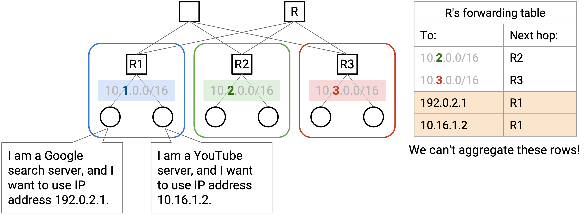

## Virtualization (Ảo hóa)

Chúng ta có thể sử dụng *virtualization* để giải quyết những vấn đề này và mang lại cho các ứng dụng sự linh hoạt hơn, trong khi vẫn duy trì cấu trúc vật lý cứng nhắc của *datacenter*. ***Virtualization*** cho phép chúng ta chạy một hoặc nhiều *virtual servers* (máy chủ ảo) bên trong một *physical server*.

*Virtual server* mang lại cho các ứng dụng ảo giác rằng chúng đang chạy trên một máy vật lý chuyên dụng. Tuy nhiên, trên thực tế, nhiều *virtual servers* có thể đang chạy trên cùng một máy. Khi ứng dụng cố gắng tương tác với phần cứng (ví dụ: đĩa, *network card* (card mạng)), nó thực sự đang tương tác với một ***hypervisor* (trình quản lý máy ảo)** trong phần mềm. *Hypervisor* cung cấp cho mỗi ứng dụng ảo cùng một giao diện mà phần cứng thực sự sẽ có. Bản thân *hypervisor* chạy trên phần cứng vật lý thực tế, và có thể chuyển tiếp các yêu cầu của ứng dụng (ví dụ: ghi đĩa, gửi gói tin mạng) đến cấp độ phần cứng.

Với *virtualization*, nếu chúng ta có một ứng dụng mới, chúng ta có thể yêu cầu một *hypervisor* khởi động một *virtual machine* (máy ảo) mới cho ứng dụng này. *Hypervisor* chạy trong phần mềm, vì vậy không cần phải cài đặt bất kỳ *server* mới nào trong *datacenter* vật lý. Tương tự, chúng ta có thể di chuyển *hosts* đến một máy vật lý khác, hoàn toàn bằng phần mềm.

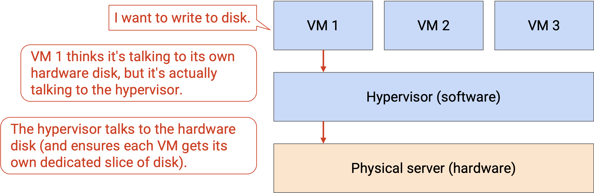

*Virtualization* cho phép nhiều ứng dụng chia sẻ một *physical server*. Các ứng dụng có thể được tách biệt với nhau, và có thể được quản lý bởi những người khác nhau. Điều này cho phép chúng ta sử dụng các tài nguyên tính toán trong *datacenter* hiệu quả hơn. Điều này cũng cho phép chúng ta có nhiều *hosts* hơn trong *datacenter*. Ví dụ, một *rack* duy nhất với 40 *servers* có thể có nhiều hơn 40 *end hosts* (máy chủ đầu cuối).

## Virtual Switches (Bộ chuyển mạch ảo)

*Physical server* có một *network card* và một *IP address* duy nhất, nhưng chúng ta cần mang lại cho mỗi *virtual machine* ảo giác rằng nó có *network card* và địa chỉ chuyên dụng của riêng mình. Ngoài ra, các *switches* (bộ chuyển mạch) giờ đây có thể có nhiều *virtual machines* kết nối với một *port* (cổng) vật lý duy nhất.

Để quản lý nhiều kết nối mạng trên cùng một máy vật lý, *server* cần một ***virtual switch***. *Virtual switch* này chạy trong phần mềm trên *server* (nó không phải là một *router* vật lý), và thực hiện các hoạt động tương tự như một *switch* thực sự (ví dụ: chuyển tiếp gói tin). Mỗi *virtual machine* được kết nối với *virtual switch*, và *virtual switch* được kết nối với phần còn lại của mạng.

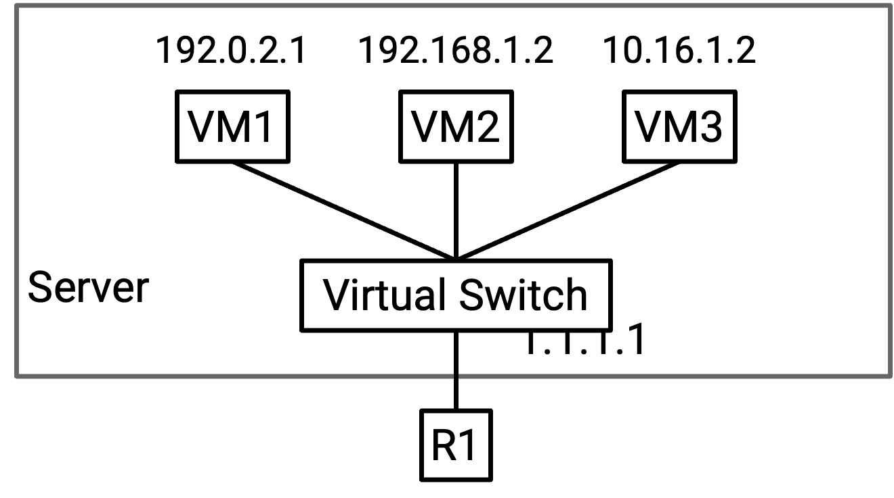

Lưu ý: Các *switches* thường chạy trên phần cứng chuyên dụng để tối đa hóa hiệu quả. Các *virtual switches* có thể chạy trong phần mềm trên một *CPU* (đơn vị xử lý trung tâm) đa dụng vì chúng chỉ cần hỗ trợ một vài *virtual machines* (dung lượng thấp hơn so với những gì các *switches* thường xử lý).

## Underlay and Overlay Network (Mạng lớp nền và Mạng lớp phủ)

Với *virtualization*, chúng ta giờ đây có các *virtual hosts* (máy chủ ảo) chạy trên các *physical servers*. Không giống như *physical servers*, *virtual hosts* có thể được tạo, tắt và thay đổi nhanh chóng.

Các *virtual machines* không nhất thiết phải sử dụng cùng một sơ đồ địa chỉ như các *physical servers*. Các *IP addresses* của *physical server* được xác định bởi *topo* *datacenter* vật lý (ví dụ: pods, racks). Ngược lại, các *IP addresses* của *virtual machine* thường được xác định bởi một hệ thống phân cấp thực tế nào đó (ví dụ: quốc gia, tổ chức). Đặc biệt, các *virtual hosts* trên một *physical server* duy nhất không nhất thiết phải có cùng *IP prefixes* (tiền tố IP), vì vậy chúng ta không thể sử dụng các thủ thuật tổng hợp tương tự để mở rộng quy mô.

Nếu chúng ta cố gắng mở rộng một cách ngây thơ các sơ đồ định tuyến của mình để hỗ trợ các *virtual machines*, các *forwarding tables* (bảng chuyển tiếp) của chúng ta sẽ trở nên rất lớn, rất nhanh. Trước đây, chúng ta có thể tổng hợp bằng cách nói: "tất cả các *servers* trong pod màu xanh có cùng *IP prefix*, và tất cả chúng đều có *next hop* (chặng kế tiếp) là R2." Bây giờ, các *servers* trong pod màu xanh đó có thể chứa hàng trăm *virtual hosts*, tất cả đều có các *IP addresses* khác nhau (không có tiền tố chung). Chúng ta sẽ cần một mục chuyển tiếp riêng cho mỗi *virtual host*. Ngoài ra, nếu một *virtual host* di chuyển đến một máy vật lý khác (giữ nguyên *IP address*), giao thức định tuyến sẽ phải khám phá lại các đường đi đến *virtual host* này. Liệu chúng ta có thể tìm ra cách để tránh việc mở rộng *datacenter* để hỗ trợ mọi địa chỉ *VM* không?

Vấn đề chính ở đây là chúng ta hiện có hai hệ thống địa chỉ khác nhau, một cho *virtual hosts*, và một cho *physical hosts*. Cả hai sơ đồ địa chỉ đều hoạt động ở *IP layer* (lớp IP), nhưng trong *IP layer*, hiện có hai lớp con trừu tượng mà chúng ta cần phải suy nghĩ đến.

***Underlay network* (mạng lớp nền)** xử lý việc định tuyến giữa các máy vật lý. *Underlay network* chứa cơ sở hạ tầng *datacenter* như *top-of-rack switches* (bộ chuyển mạch đỉnh giá) và *spine switches* (bộ chuyển mạch trục). *Underlay network* có khả năng mở rộng tốt vì chúng ta xác định các *hierarchical addresses* sử dụng *topo* *datacenter* vật lý.

***Overlay network* (mạng lớp phủ)** tồn tại trên *topo* vật lý (*underlay*), và nó chỉ suy nghĩ về việc định tuyến giữa các *virtual machines*. Trên thực tế, mỗi *virtual machine* thường chỉ cần giao tiếp với một vài *virtual machines* khác trong mạng. Do đó, *overlay network* có khả năng mở rộng tốt vì một *virtual machine* không cần phải biết về mọi *virtual machine* khác.

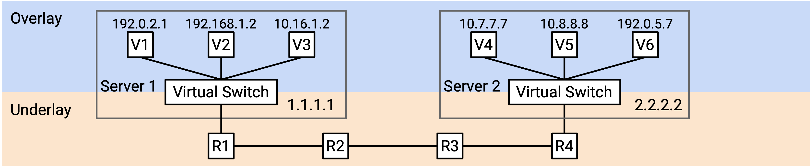

Lý tưởng nhất, chúng ta muốn hai lớp này suy nghĩ về việc đánh địa chỉ một cách riêng biệt. *Underlay network* không cần phải biết về các địa chỉ *virtual host* (nếu không, nó sẽ mở rộng kém). Tương tự, *overlay network* không cần phải biết về mọi *physical server* trong *datacenter* (mỗi *VM* chỉ cần biết về một vài *VMs* khác).

Nếu chúng ta không cho *underlay network* biết về các địa chỉ *virtual host*, thì nếu một *datacenter switch* nhận được một *packet* (gói tin) với một IP ảo làm đích, nó sẽ tìm trong *forwarding table* của mình, không tìm thấy IP ảo nào, và loại bỏ *packet* này. Chúng ta cần một cách nào đó để kết nối khoảng cách giữa *overlay* (suy nghĩ theo hướng ảo) và *underlay* (suy nghĩ theo hướng vật lý).

## Encapsulation (Đóng gói)

Để hợp nhất các lớp *overlay* và *underlay*, chúng ta có thể sử dụng các chiến lược tương tự với phân lớp và các *headers* (tiêu đề) mà chúng ta đã sử dụng khi thiết kế Internet\!

Cho đến nay, chúng ta đã coi IP là một lớp duy nhất, và mỗi *packet* có một *IP header* duy nhất, hiểu hệ thống địa chỉ IP.

Bây giờ chúng ta có hai lớp con IP với hai hệ thống địa chỉ IP khác nhau, chúng ta có thể giới thiệu một *header* bổ sung vào *packet*. Ví dụ, chúng ta có thể có hai *IP headers*, trong đó một *header* hiểu *overlay network*, và *header* kia hiểu *underlay network*. Hoặc, chúng ta có thể sử dụng *IP header* ban đầu cho *underlay network*, và giới thiệu một loại *header* mới (khác với IP) cho *overlay network*.

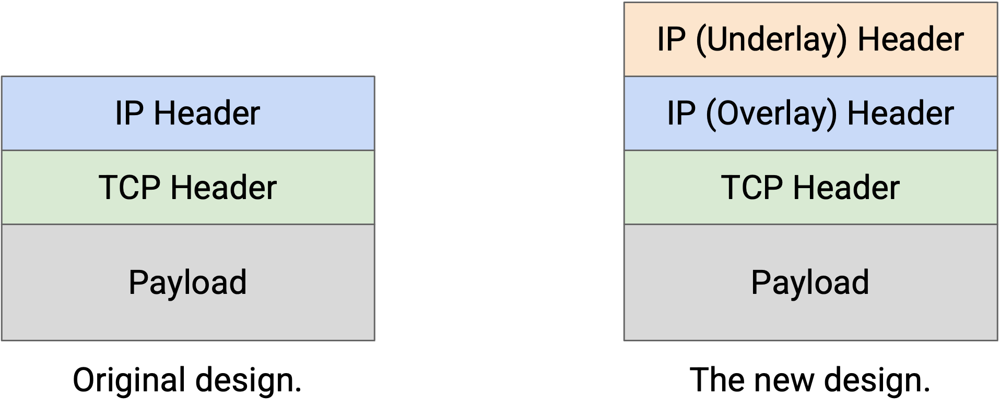

Bây giờ, chiến lược của chúng ta để định tuyến các *packets* có thể kết hợp *overlay* và *underlay networks*. Giả sử VM A muốn gửi một *packet* đến VM B.

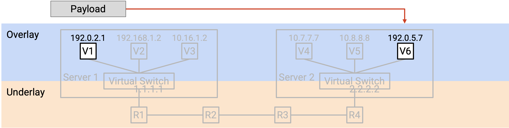

1.  VM A tạo một *packet* với một *IP header* duy nhất, chứa địa chỉ IP ảo của B. (Hãy nhớ rằng, A đang suy nghĩ theo thuật ngữ của *overlay*, và không biết về các địa chỉ IP vật lý của *underlay*.) VM A chuyển tiếp *packet* này đến *virtual switch* (trên *physical server* của A).

    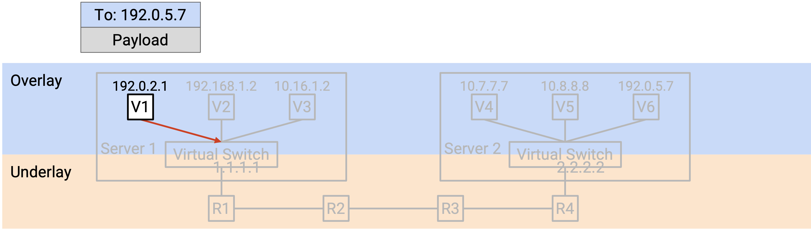

2.  *Virtual switch* đọc *header* để biết địa chỉ IP ảo của B. Sau đó, *virtual switch* tra cứu địa chỉ *physical server* tương ứng với địa chỉ IP ảo của B. (Chúng ta chưa mô tả cách thực hiện điều này.)

    *Virtual switch* thêm một *outer header* (tiêu đề bên ngoài) bổ sung chứa địa chỉ *physical server* của B. Việc thêm *header* đôi khi được gọi là ***encapsulation***.

    Tại thời điểm này, *packet* có hai *headers*. *Inner header* (tiêu đề bên trong) (lớp cao hơn, *overlay*, được thêm bởi VM A) chứa địa chỉ IP ảo của B, và *outer header* (lớp thấp hơn, *underlay*, được thêm bởi *virtual switch*) chứa địa chỉ *physical server* của B.

    *Virtual switch* chuyển tiếp *packet* này đến *switch* *next hop*, dựa trên địa chỉ *physical server*.

    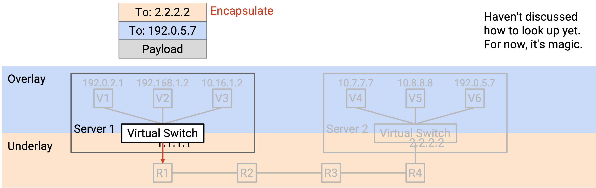

3.  *Packet* được gửi qua *underlay network*. Mỗi *switch* trong *datacenter* chỉ nhìn vào *outer header* (lớp nền, địa chỉ *physical server*) để quyết định cách chuyển tiếp *packet*. (Hãy nhớ rằng, các *datacenter switches* suy nghĩ theo thuật ngữ của *underlay*, và không biết về địa chỉ IP ảo của *overlay*.)

    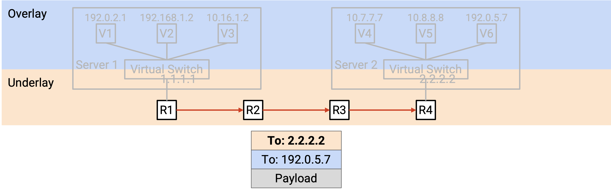

    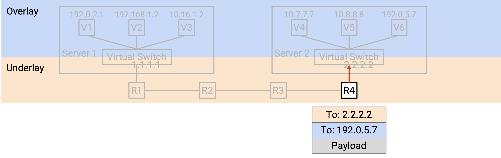

4.  Cuối cùng, *packet* đến *virtual switch* của *physical server* đích. *Virtual switch* nhìn vào *outer header* (*underlay*) và nhận thấy rằng địa chỉ *physical server* đích là chính nó.

    *Virtual switch* loại bỏ *outer header*, để lộ *inner header* bên trong. Việc loại bỏ *outer header* đôi khi được gọi là ***decapsulation* (giải đóng gói)**.

    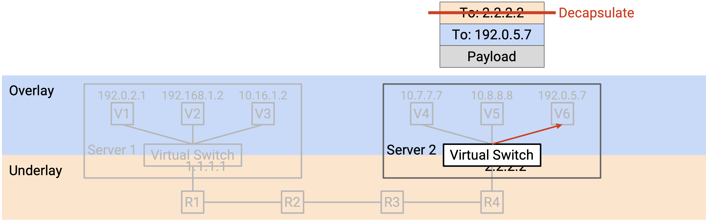

Cuối cùng, *virtual switch* đọc *inner header* (*overlay*). Điều này cho *virtual switch* biết *packet* nên được chuyển tiếp đến *VM* nào trên *physical server*.

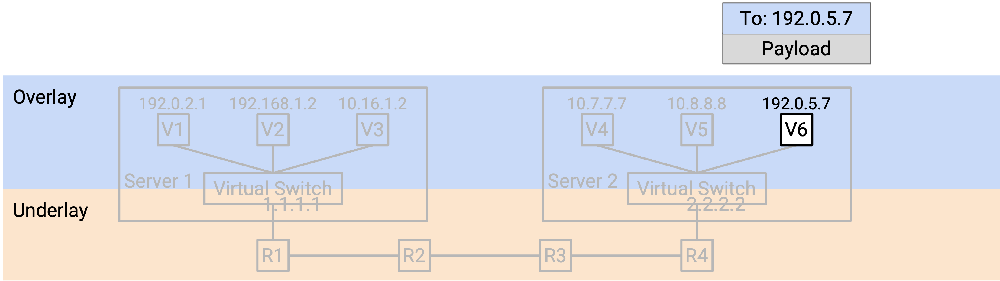

Trong quá trình này, ***encapsulation*** cho phép chúng ta suy nghĩ về việc định tuyến ở hai lớp khác nhau. *Underlay* có thể định tuyến các *packets* bằng cách sử dụng địa chỉ *physical server*, mà không cần suy nghĩ về *overlay*. Tương tự, *VM* trong *overlay* có thể gửi và nhận các *packets* mà không cần suy nghĩ về cách chuyển tiếp các *packets* trong *underlay*. Các *virtual switches* đã kết nối hai lớp bằng cách dịch địa chỉ *virtual machine* thành địa chỉ *physical server*, và thêm và bớt *header* *underlay* bổ sung.

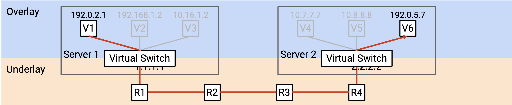

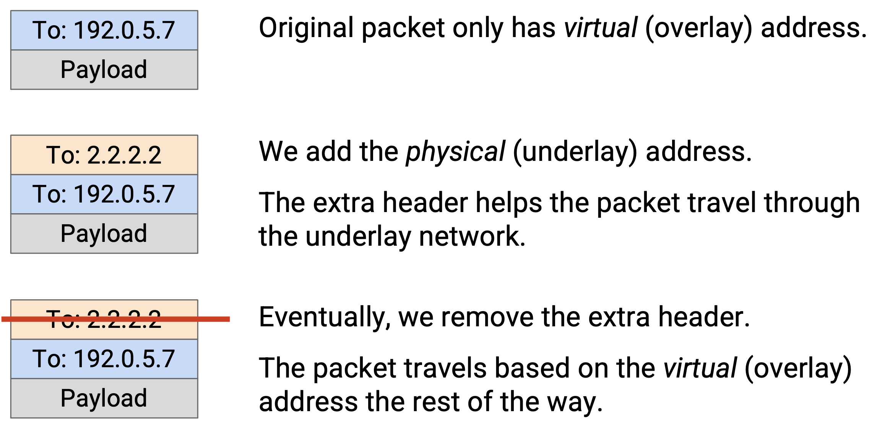

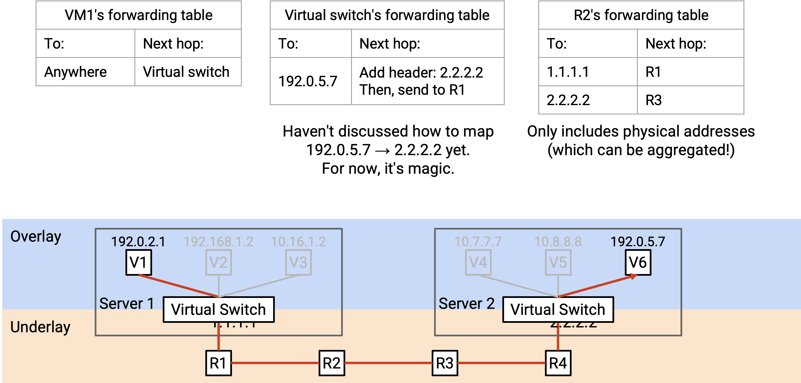

## Forwarding Tables với Encapsulation

Chúng ta nên cài đặt những mục nào trong các *forwarding tables* để hỗ trợ định tuyến với *encapsulation*?

Các *virtual machines* nên cài đặt một *default route* (tuyến đường mặc định) để chuyển tiếp mọi *packet* đến *virtual switch* trên máy vật lý.

Các *virtual switches* cần triển khai thêm một số chức năng để kết nối hai lớp. Cụ thể, khi bạn thấy một địa chỉ ảo, bạn nên áp dụng *encapsulation* (thêm một lớp ngoài) với địa chỉ vật lý tương ứng. *Forwarding table* có các mục cho mọi *VM* đích mà bất kỳ *VM* nào trên *server* này có thể muốn nói chuyện. Chúng ta có thể hỗ trợ quy mô này vì chúng ta giả định các *VMs* sẽ không cần nói chuyện với mọi *VM* khác trong *datacenter*. Không giống như các thuật toán định tuyến tiêu chuẩn, chúng ta không cần định tuyến any-to-any (chúng ta không cần đường đi đến mọi *VM* khác).

Các *virtual switches* cũng cần một quy tắc bổ sung để *decapsulating* các *packets*. Nếu đích của *packet* ngoài (*underlay*) là chính *switch* đó, bạn nên *decapsulate* (loại bỏ *outer header*) và chuyển *packet* đến địa chỉ *VM* trong *inner header*. Quy tắc này mở rộng theo số lượng *VMs* trên *server*, thường đủ nhỏ để có thể quản lý được.

Việc thêm chức năng này có khó không? May mắn thay, các *virtual switches* được triển khai trong phần mềm, vì vậy việc thêm chức năng này chỉ cần viết mã lệnh (không cần thêm phần cứng). Tuy nhiên, trên thực tế, *encapsulation* phổ biến đến mức đôi khi nó vẫn được triển khai trong phần cứng.

Các *switches* trong *datacenter* hoạt động giống hệt như trước khi chúng ta giới thiệu *virtualization*. Các *forwarding tables* chỉ chứa địa chỉ *physical server*, và chúng ta biết rằng chúng có thể được mở rộng quy mô bằng các thủ thuật tổng hợp dựa trên *topo* vật lý.

## Multi-Tenancy (Đa người thuê) và Private Networks (Mạng riêng)

Các *Datacenters* được quản lý bởi một nhà khai thác duy nhất, nhưng các tổ chức khác nhau có thể đang chạy các ứng dụng bên trong *datacenter* đó. Ví dụ, một *datacenter* do Google điều hành có thể có một số *virtual servers* do Gmail chạy, và những *servers* khác do Google Maps chạy. Cách tiếp cận lưu trữ nhiều dịch vụ trong một *datacenter* này được gọi là ***multi-tenancy***.

Các *Cloud providers* (nhà cung cấp đám mây) cũng sử dụng các *datacenters* để cung cấp *virtual machines* cho khách hàng. Ví dụ, *Amazon Web Services (AWS)* và *Google Cloud Platform (GCP)* cho phép người dùng khởi động một *virtual machine* trong một *datacenter*, làm bất cứ điều gì họ muốn, và phá hủy *virtual machine* khi họ hoàn thành.

Một vấn đề với *multi-tenancy* là, chúng ta không phải lúc nào cũng muốn các *tenants* (người thuê) khác nhau có thể giao tiếp với nhau. Ví dụ, nếu một khách hàng yêu cầu một *VM*, họ có lẽ không nên có thể kết nối với mọi *VM* khác trong *datacenter*.

Một vấn đề khác là, các *tenants* trong một *datacenter* không phối hợp với nhau khi chọn địa chỉ. Ví dụ, giả sử *datacenter* của chúng ta có hai *tenants*, Pepsi và Coke. Mỗi *tenant* tạo ra *private network* của riêng mình, nơi họ gán các *IP addresses* nội bộ cho các *virtual machines*. *Private network* chỉ dành cho các *hosts* bên trong *datacenter* giao tiếp với nhau, và các *hosts* này sẽ không bao giờ được liên lạc từ Internet công cộng. Vì các mạng là riêng tư, hai *tenants* đều có thể sử dụng các địa chỉ trong cùng một dải địa chỉ riêng được phân bổ đặc biệt (*RFC 1918 addresses* - các dải địa chỉ dành riêng cho mạng nội bộ). *Private network* của Pepsi có thể có một *VM* với *IP address* 192.0.2.2, và *private network* của Coke có thể có một *VM* khác với *IP address* 192.0.2.2. (Trên thực tế, chúng ta sử dụng các dải địa chỉ riêng để tái sử dụng các *IPv4 addresses* (địa chỉ IPv4), vì chúng ta đang cạn kiệt chúng.)

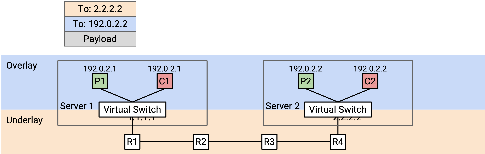

Từ góc độ của mỗi *tenant*, đây không phải là vấn đề. 192.0.2.2 của Pepsi sẽ không bao giờ giao tiếp với 192.0.2.2 của Coke, và cả hai *host* đều không thể truy cập từ Internet toàn cầu. Tuy nhiên, đây là một vấn đề đối với *datacenter*. Nếu chúng ta sử dụng *destination-based forwarding* (chuyển tiếp dựa trên đích), và chúng ta thấy một *packet* có đích là 192.0.2.2, chúng ta không biết địa chỉ này đang đề cập đến *VM* nào.

Các *IP addresses* trùng lặp xảy ra trong thực tế vì hai lý do. Thứ nhất, các *datacenters* thường không có quyền kiểm soát các địa chỉ mà các *tenants* đang gán cho các *VMs* của họ. Thứ hai, trong IP, thông lệ tiêu chuẩn là sử dụng các dải cụ thể cho các *private networks*, điều này thường dẫn đến các địa chỉ trùng lặp.

## Encapsulation cho Multi-Tenancy

Chúng ta có thể sử dụng lại ý tưởng *encapsulation* để giải quyết vấn đề này. Chúng ta có thể thêm một *header* mới chứa một ***virtual network ID* (mã định danh mạng ảo)** để xác định một *tenant* cụ thể (ví dụ: Pepsi có ID 1, Coke có ID 2). *Header* mới này không chứa thông tin để chuyển tiếp và định tuyến, nhưng nó cung cấp thêm ngữ cảnh. Bây giờ, nếu một *physical server* có các *VMs* cho nhiều *tenants*, nó có thể chuyển *packet* lên đúng mạng ảo.

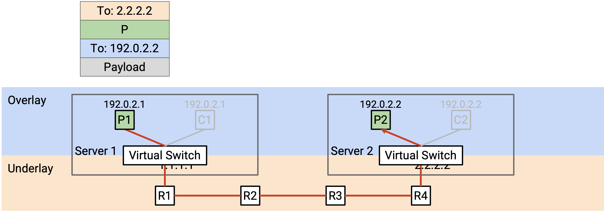

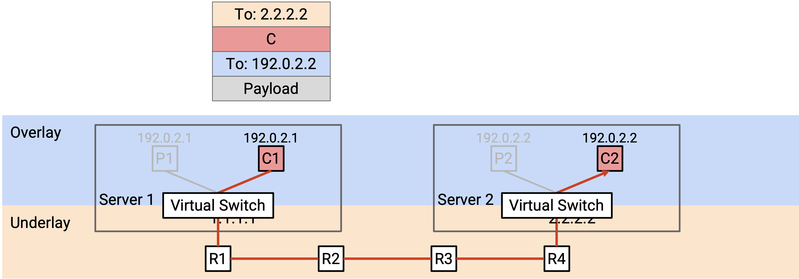

Khi một *virtual switch* nhận được một *packet* và mở *outer header* (*underlay*), nó sẽ nhìn vào *header* mới của chúng ta để quyết định *packet* dành cho *tenant* nào. Sau đó, nó nhìn vào *overlay header* để chuyển tiếp *packet* đến một *VM* cụ thể thuộc về *tenant* chính xác.

## Xếp chồng các Encapsulation

Chúng ta có thể sử dụng ý tưởng *encapsulation* nhiều lần, thêm nhiều *headers* mới để hỗ trợ cả *virtualization* và *multi-tenancy*.

Để bắt đầu, *virtual machine* tạo ra một *packet* *TCP/IP* tiêu chuẩn, với một đích IP ảo.

Trong bước *encapsulation* đầu tiên, chúng ta thêm một *virtual network header*, cho chúng ta biết *tenant* nào đã gửi *packet* này. Điều này giúp chúng ta phân biệt hai *tenants* sử dụng cùng một địa chỉ, và cũng ngăn chặn các *packets* được gửi đến một *tenant* khác.

Trong bước *encapsulation* thứ hai, chúng ta thêm một *underlay network header*, cho chúng ta biết địa chỉ *physical server* tương ứng với đích IP ảo.

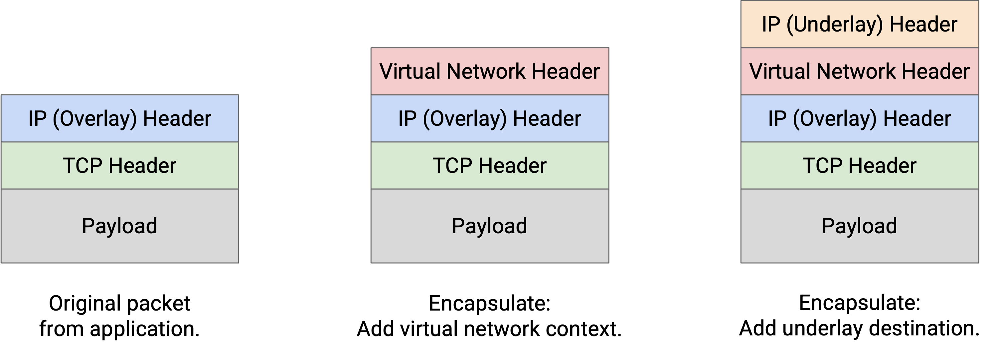

Các lớp trừu tượng vẫn giữ nguyên khi chúng ta xếp chồng các *encapsulations*. *Underlay network* không cần biết rằng nhiều *tenants* đang ở trong cùng một *datacenter*. *Underlay network* chỉ nhìn vào *header* ngoài cùng nhất để tìm địa chỉ *physical server*, và chuyển tiếp *packet* tương ứng.

Bước *decapsulation* hoạt động theo thứ tự ngược lại. *Virtual switch* trên *server* đích nhận được một *packet* có hai *headers* bổ sung.

Trong bước *decapsulation* đầu tiên, chúng ta loại bỏ *outer underlay header*. Điều này không còn cần thiết vì *packet* đã đến *physical server* đích.

Trong bước *decapsulation* thứ hai, chúng ta sử dụng *virtual network header* để quyết định chúng ta nên xem xét tập hợp *VMs* nào. *Physical server* có thể có các *VMs* cho nhiều *tenants*, và điều này giúp thu hẹp xuống một *tenant* duy nhất.

Cuối cùng, chúng ta sử dụng *IP header* trong cùng nhất để gửi *packet* đến đúng *VM* trong đúng mạng ảo.

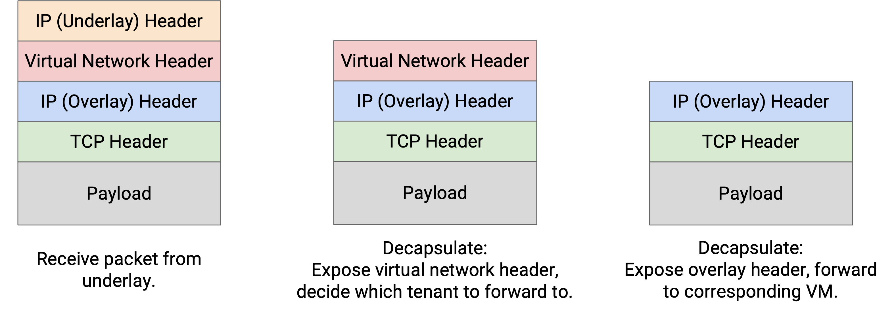

Lưu ý: Với *encapsulation*, chúng ta phải cẩn thận khi đọc *5-tuple* (bộ 5 thông tin: IP nguồn, IP đích, cổng nguồn, cổng đích, và giao thức) để *load-balancing* (cân bằng tải) các *packets* trên nhiều đường đi. May mắn thay, phần cứng *router* hiện đại rất giỏi trong việc phân tích các *packets* để hiểu vị trí của các *headers* liên quan trong *packet*, ngay cả khi có thêm các *headers* được chèn vào.

Trên thực tế, có nhiều giao thức khác nhau tồn tại cho *encapsulation*. Chúng ta có thể sử dụng *IP-in-IP* để hỗ trợ hai *IP headers* (một cho *overlay*, một cho *underlay*).

*MPLS* là một *header* đơn giản để thêm một nhãn xác định một dịch vụ (ví dụ: một mạng ảo, một *tenant*). Điều này có thể được sử dụng để thêm *encapsulation* cho *multi-tenancy*.

Khi các *datacenters* trở nên phổ biến hơn, nhiều giao thức khác như *GRE*, *VXLAN*, và *GENEVE* đã được phát triển. Hầu hết chúng hoạt động trên IP, vì vậy các giao thức tùy chỉnh này là *inner overlay header*, và IP thông thường là *outer underlay header*.