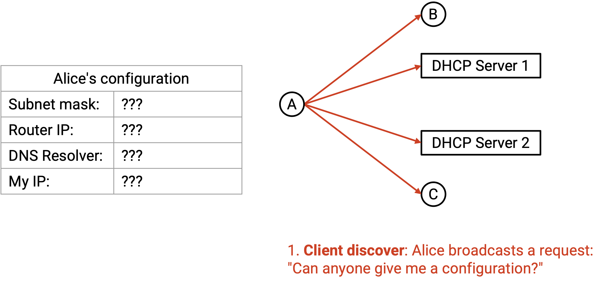
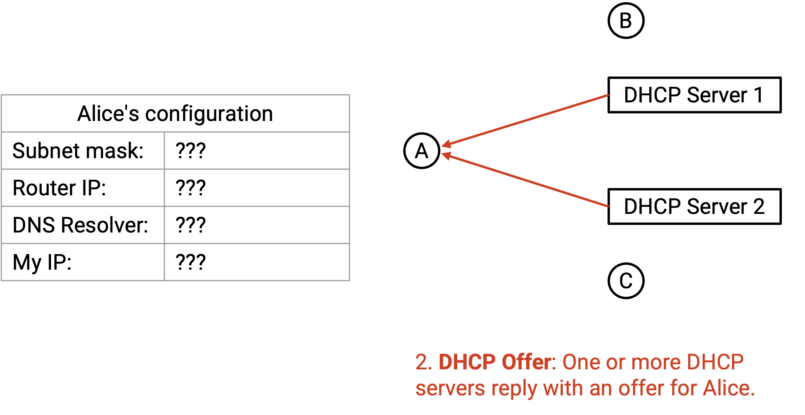
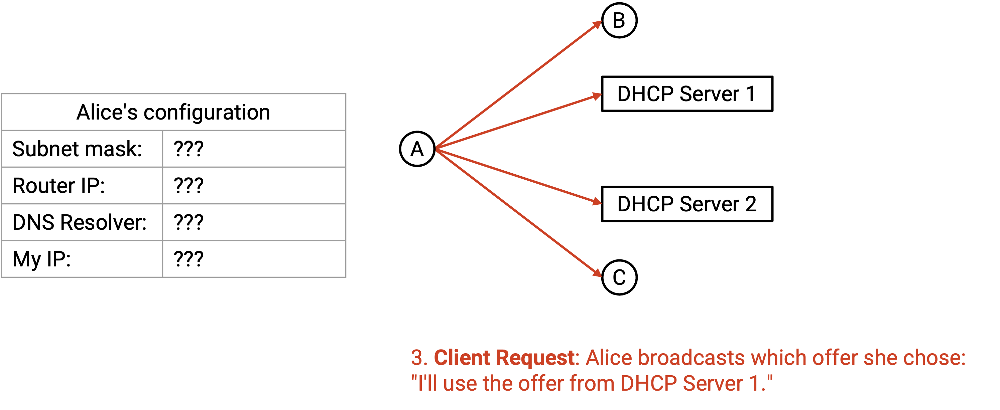
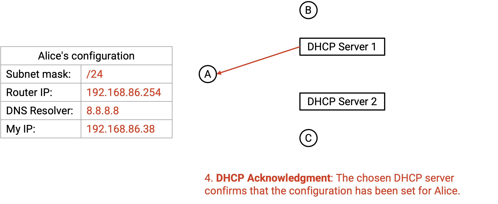
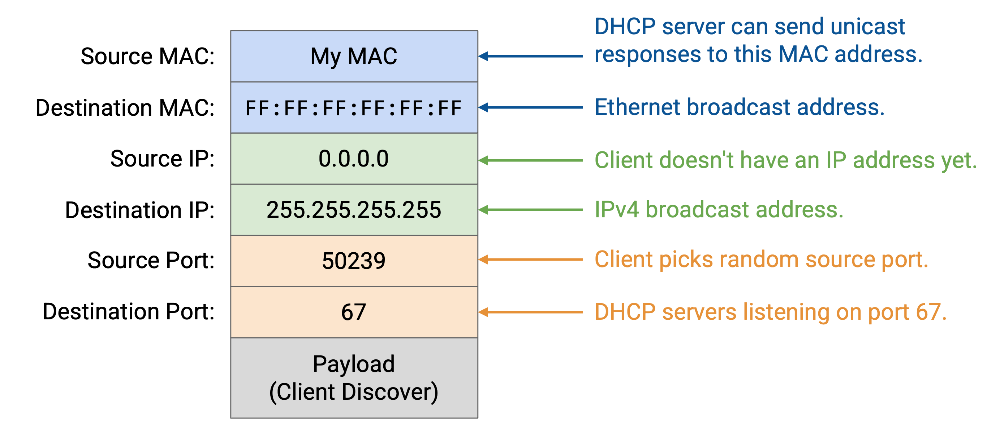
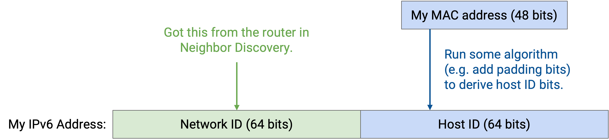

# DHCP: Gia nhập Mạng

## Gia nhập Mạng

Khi một máy tính lần đầu tiên gia nhập mạng, nó cần những thông tin gì để kết nối với Internet?

Chúng ta luôn biết *MAC address* (địa chỉ MAC) của chính mình, vì nó được ghi cứng vào phần cứng.

Chúng ta cần được cấp phát một *IP address* để có thể gửi và nhận các *packets*. Nhớ lại rằng, các *IP addresses* được phân bổ theo vị trí địa lý, vì vậy khi chúng ta kết nối với một mạng mới, ai đó phải cấp cho chúng ta một *IP address* để sử dụng.

Chúng ta cần biết *subnet mask* (mặt nạ mạng con) để có thể biết được dải địa chỉ IP cục bộ. Với *subnet mask* (các bit cố định đều là một, các bit không cố định đều là không), chúng ta có thể thực hiện phép toán AND bit với *IP address* của chính mình để biết được *IP prefix* cục bộ.

Chúng ta cần biết *router* trên mạng cục bộ là ai, để có thể gửi bất kỳ *packets* nào không thuộc mạng cục bộ đến *router*. Đôi khi chúng ta gọi *router* này là ***default gateway* (cổng vào mặc định)**.

Chúng ta cũng có thể cần biết *DNS recursive resolver* (bộ phân giải đệ quy DNS) của mạng này nằm ở đâu.

Người dùng có thể cấu hình thủ công các giá trị này khi họ lần đầu tiên tham gia mạng. Việc này tốn thời gian, đặc biệt là vì chúng ta phải cấu hình lại các giá trị này mỗi khi tham gia một mạng khác. Ngoài ra, người dùng Internet trung bình có lẽ không biết cách cấu hình các giá trị này theo cách thủ công. Tuy nhiên, việc cấu hình thủ công đôi khi vẫn có hiệu quả đối với các máy như *routers*, vốn không thường xuyên di chuyển.

Chúng ta cần một giao thức cho phép các *hosts* mới tự động tìm hiểu các giá trị này (và có thể cả các thông tin hữu ích khác).

## DHCP: Dynamic Host Configuration Protocol (Giao thức Cấu hình Máy chủ Động)

*DHCP* có bốn bước:

1.  Client mới *broadcasts* (quảng bá) một ***Discover message* (thông điệp Khám phá)**, yêu cầu thông tin cấu hình.

    

2.  Bất kỳ ***DHCP server* (máy chủ DHCP)** nào có thể giúp đỡ sẽ *unicast* (truyền đơn hướng) một ***Offer* (Chào giá)** đến client, với một cấu hình mà client có thể sử dụng (ví dụ: *IP address*, địa chỉ *gateway*, địa chỉ *DNS*).

    

3.  Client sẽ *broadcast* một ***Request message* (thông điệp Yêu cầu)**, cho biết họ đã chấp nhận *offer* nào. Thông điệp này được *broadcast* vì client có thể nhận được nhiều *offers*. Bằng cách thông báo cho mọi người biết mình chấp nhận *offer* nào, client cho phép các *offers* bị từ chối được giải phóng cho các client trong tương lai.

    

4.  *Server* gửi một ***acknowledgement* (thông điệp xác nhận)** để xác nhận rằng yêu cầu đã được chấp thuận.

    

## Các DHCP Server

Ở bước 2, ai có thể cung cấp cấu hình? Các *DHCP servers* được thêm vào mạng, và mục tiêu của chúng là cung cấp thông tin này cho các *hosts* mới. Trên các mạng nhỏ hơn như mạng gia đình của bạn, chính *home router* (router gia đình) thường đóng vai trò là *DHCP server*. Trong các mạng lớn hơn, có thể có một máy riêng biệt đóng vai trò là *DHCP server*.

Các *DHCP servers* cần phải ở trong cùng một mạng cục bộ với client, vì giao thức hoạt động bên trong mạng cục bộ. Trong các mạng lớn hơn, chúng ta có thể không muốn chạy mã *DHCP server* bên trong mọi *router*, vì vậy các *routers* cục bộ có thể chuyển tiếp các yêu cầu đến một *DHCP server* trung tâm từ xa, nơi thực sự chạy giao thức.

Các *DHCP servers* lắng nghe trên một cổng cố định, cổng *UDP* 67, để nhận các yêu cầu từ các máy mới. Các *servers* được cấu hình với tất cả các thông tin cần thiết: Chúng biết về *gateway* và các *DNS servers*, và chúng có một nhóm các *IP addresses* có thể sử dụng mà chúng có thể phân bổ cho người dùng mới.

Lưu ý rằng các *IP addresses* chỉ được *lease* (thuê) tạm thời cho các *hosts*. Việc *lease* chỉ có hiệu lực trong một khoảng thời gian giới hạn (ví dụ: cỡ giờ hoặc ngày). Nếu *host* muốn tiếp tục sử dụng địa chỉ, nó phải gia hạn *lease*. Nếu một *IP address* hiện đang được *lease* cho một *host*, *DHCP server* không thể cung cấp cùng một địa chỉ cho các client khác.

## Triển khai DHCP

Lưu ý rằng *DHCP* là một giao thức ứng dụng *Layer 7* (Lớp 7), và nó chạy trên *UDP*, bản thân *UDP* lại chạy trên IP.

Ở bước 1, làm thế nào client *broadcast* một thông điệp qua IP? Nó gửi một *packet* với IP đích là 255.255.255.255 (toàn bit một), đây là *IPv4 broadcast address* (địa chỉ quảng bá IPv4). Khi *packet* này được chuyển xuống *Layer 2* (Lớp 2), thay vì dịch *IP address* này bằng *ARP*, *IPv4 broadcast address* được ánh xạ tới *Ethernet broadcast address* (địa chỉ quảng bá Ethernet) là FF:FF:FF:FF:FF:FF (toàn bit một). Sau đó, *packet* có thể được *broadcast* trên toàn mạng ở *Layer 2*.

Còn IP nguồn thì sao? Client không có IP nguồn khi bắt đầu giao thức, vì vậy nó đặt IP nguồn là 0.0.0.0.

Với IP nguồn được mã hóa cứng là 0.0.0.0 và IP đích là 255.255.255.255, client không cần biết bất cứ điều gì về mạng cục bộ để bắt đầu chạy giao thức này.

Nếu không có IP nguồn, làm thế nào các *DHCP servers* biết cách *unicast* các *offers*? Các *DHCP servers* có thể *broadcast* các *offers*, hoặc sử dụng *MAC address* của client để *unicast* các *offers*.

## Tự động cấu hình trong IPv6

*DHCP* cũng tồn tại trong các mạng *IPv6*. Tuy nhiên, vì các địa chỉ *IPv6* dài hơn, hóa ra chúng ta có thể tự cấp cho mình một địa chỉ *IPv6* duy nhất được đảm bảo mà không cần ai khác quản lý một nhóm địa chỉ và cho thuê chúng. Giao thức này được gọi là ***Stateless Address Autoconfiguration (SLAAC)* (Tự động cấu hình địa chỉ không trạng thái)**.

Thủ thuật ở đây là sử dụng *MAC address*, mà chúng ta biết là duy nhất cho mỗi máy. Như trước đây, chúng ta yêu cầu thông tin mạng cục bộ, bao gồm địa chỉ *gateway*, địa chỉ *DNS*, và đáng chú ý là *prefix* cho mạng cục bộ. *Prefix* này thường dài 64 bit. Sau đó, chúng ta sao chép các bit *MAC address* của chính mình vào các bit *host* của địa chỉ *IPv6*. Chúng ta có thể tự tin rằng không ai khác có địa chỉ *IPv6* này: người dùng trong các mạng khác sẽ có một *prefix* khác, và không ai khác trong mạng (hoặc bất kỳ nơi nào khác) sẽ có cùng các bit *MAC address*.

Để có được thông tin mạng cục bộ, chúng ta có thể mở rộng *Neighbor Discovery protocol* (giao thức Khám phá Láng giềng) (phiên bản *IPv6* của *ARP*). *Router Solicitation message* (thông điệp Yêu cầu Router) cho phép người dùng *broadcast* một yêu cầu thông tin mạng cục bộ, và *Router Advertisement message* (thông điệp Quảng bá Router) cho phép các *routers* trả lời bằng thông tin đó.

*SLAAC* có thêm các cơ chế để phát hiện các địa chỉ trùng lặp, phòng trường hợp cần thiết.