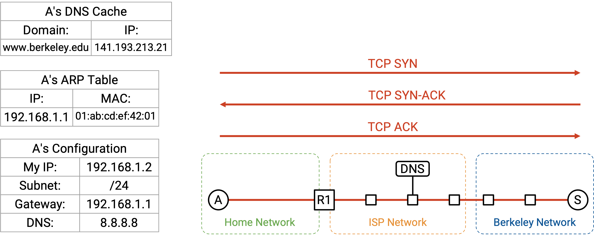

# Kết nối End-to-End

## Động lực

Trong phần này, chúng ta sẽ đi qua từng bước về những gì xảy ra khi chúng ta bật máy tính, cắm nó vào mạng *Ethernet*, và gõ *www.berkeley.edu* vào trình duyệt web. Trong quá trình đó, chúng ta sẽ thấy cách tất cả các thành phần khác nhau của mạng làm việc cùng nhau để xử lý yêu cầu của người dùng.

Chúng ta sẽ giả định rằng chúng ta không cần phải khởi động Internet từ đầu. Ví dụ, các *routers* đã và đang chạy các giao thức định tuyến và đã điền vào *forwarding tables* của chúng một cách tương ứng.

## Bước 1: DHCP

Chúng ta bật máy tính và cắm nó vào một mạng *Ethernet*. Chúng ta chưa có bất kỳ thông tin nào về mạng, vì vậy chúng ta *broadcast* một yêu cầu *DHCP* (Giao thức Cấu hình Máy chủ Động).

Chúng ta sẽ giả định *router* gia đình là *DHCP server* (máy chủ DHCP), điều này phổ biến trong các mạng gia đình. *Router*/*server* sẽ *unicast* một gói tin đề nghị (offer) trở lại cho chúng ta. Gói tin đề nghị này chứa thông tin về mạng: *subnet mask* (mặt nạ mạng con), địa chỉ IP của *default gateway* (cổng mặc định), và địa chỉ IP của *DNS server* (máy chủ DNS). Gói tin đề nghị cũng cấp cho chúng ta một địa chỉ IP mà chúng ta có thể sử dụng.

Để hoàn tất giao thức *DHCP*, chúng ta gửi một thông điệp yêu cầu (request) xác nhận rằng chúng ta muốn sử dụng cấu hình đã được đề nghị, và *router*/*server* phản hồi bằng một thông điệp xác nhận (acknowledgement).

## Bước 2: Tìm Router ở Lớp 2

Từ *DHCP*, chúng ta đã biết được địa chỉ IP của *router*, và *forwarding table* của chúng ta bây giờ cho biết rằng tất cả các *packets* không thuộc *local network* sẽ được chuyển tiếp đến *router* này. Chúng ta sắp sửa gửi một số *packets* đến *DNS server* (để tra cứu địa chỉ IP của *www.berkeley.edu*), và đến chính *server* Berkeley, cả hai đều có thể không thuộc *local network*.

Tuy nhiên, trước khi chúng ta có thể chuyển tiếp các *IP packets* đến *router*, chúng ta cần tìm ra *MAC address* *Layer 2* của *router*, để chúng ta có thể gửi *packet* đến *router* bên trong *local network*.

Đầu tiên, chúng ta có thể xác minh rằng địa chỉ IP của *router*, 192.168.1.1, thuộc về *subnet* cục bộ, 192.168.1.2/24. Điều này cho chúng ta biết rằng *router* nằm trong *local network*, và bằng cách gửi một *packet* *Ethernet* đến *MAC address* của *router*, chúng ta sẽ đến được *router*.

Để tìm *MAC address* của *router*, chúng ta *broadcast* một yêu cầu *ARP*, hỏi *MAC address* của 192.168.1.1 (địa chỉ IP của *router*). *Router* nghe thấy yêu cầu này và trả lời, "Tôi là 192.168.1.1, và *MAC address* của tôi là 01:ab:cd:ef:42:01."

Bây giờ chúng ta có thể lưu trữ ánh xạ IP-tới-MAC này, và chúng ta đã biết *MAC address* của *router*. Miễn là mục nhập này còn trong bộ đệm, chúng ta sẽ không phải thực hiện lại cùng một yêu cầu *ARP*. Tất cả các yêu cầu trong tương lai ra Internet bên ngoài đều có thể được chuyển tiếp đến *MAC address* của *router*.

## Bước 3: Tra cứu DNS

Tiếp theo, chúng ta cần tra cứu địa chỉ IP của *www.berkeley.edu*. Tất cả điều này được thực hiện trong hệ điều hành, sau khi mã của trình duyệt gọi một hàm như *getaddrinfo* để kích hoạt việc tra cứu *DNS* (Hệ thống Tên miền).

Từ *DHCP*, chúng ta đã biết địa chỉ IP của *DNS server*, 8.8.8.8. Chúng ta cũng biết rằng chúng ta đang ở trong *subnet* 192.168.1.2/24. *DNS server* không nằm trong *local network* của chúng ta, vì vậy chúng ta cần chuyển tiếp *DNS packet* (gói tin DNS) đến *router*.

Bây giờ chúng ta có thể xây dựng *DNS packet* yêu cầu của mình, từ trên xuống dưới.

*Layer 7* (Lớp 7): Trong phần Question, chúng ta thêm một *DNS record* (bản ghi DNS) yêu cầu *A record* (bản ghi A) với địa chỉ IP của *www.berkeley.edu*. Chúng ta thêm *header* *DNS* với ID, số lượng bản ghi, v.v.

*Layer 4* (Lớp 4): *DNS* chạy trên *UDP* (Giao thức Gói dữ liệu Người dùng). Chúng ta chọn một *source port* (cổng nguồn) ngẫu nhiên bất kỳ, vì chúng ta là client. Chúng ta chọn *Port* 53 cho *destination port* (cổng đích), vì đây là nơi các *resolvers* và *name servers* lắng nghe các truy vấn *DNS*.

*Layer 3*: *Source IP* là IP của chính chúng ta, được gán bởi *DHCP*. *Destination IP* là 8.8.8.8, địa chỉ IP của *DNS server*, mà chúng ta đã biết từ *DHCP*.

*Layer 2*: *Source MAC* là *MAC address* của chúng ta, được ghi sẵn trong phần cứng. *Destination MAC* là *MAC address* của *router* (*hop* tiếp theo), mà chúng ta đã biết từ *ARP*.

Với *packet* được xây dựng hoàn chỉnh, chúng ta có thể gửi các bit đi trên dây (Lớp 1 - *Layer 1*).

Khi *packet* đến *router*, nếu mạng đang sử dụng *NAT* (Network Address Translation - Biên dịch Địa chỉ Mạng), *router* có thể viết lại các *headers* *UDP*/*IP* để dịch địa chỉ IP riêng của chúng ta thành địa chỉ IP công cộng. Tuy nhiên, với tư cách là *end host*, chúng ta không cần phải lo lắng về *NAT*. *Router* sẽ thực hiện tất cả việc biên dịch cho chúng ta, tạo cho chúng ta ảo giác rằng chúng ta có thể sử dụng địa chỉ IP của riêng mình (từ *DHCP*).

Khi *packet* của chúng ta đến *recursive resolver* (bộ phân giải đệ quy) tại 8.8.8.8, nếu *resolver* chưa có câu trả lời của chúng ta trong bộ đệm, nó có thể cần thực hiện một số tra cứu bổ sung và hỏi các *authoritative name servers* (máy chủ tên miền có thẩm quyền) để lấy các bản ghi. Cuối cùng, *recursive resolver* tìm thấy câu trả lời và gửi *A record* trở lại cho chúng ta. Bây giờ chúng ta đã có địa chỉ IP của *www.berkeley.edu*.

## Bước 4: Kết nối đến Trang web

Bây giờ chúng ta đã có địa chỉ IP của *www.berkeley.edu*, chúng ta có thể gửi *packets* đến Berkeley. Chúng ta đang sử dụng trình duyệt web, vì vậy mục tiêu của chúng ta là thực hiện một yêu cầu *HTTP* (Giao thức Truyền tải Siêu văn bản) đến *server* này.

*HTTP* chạy trên *TCP* (Giao thức Điều khiển Truyền vận), vì vậy trước tiên chúng ta phải thực hiện một *TCP handshake* (bắt tay TCP) để mở một kết nối với *server* Berkeley. Trình duyệt sẽ gọi một hàm như *connect* trên một *socket* (giao diện lập trình mạng) cụ thể để mở kết nối này, và hệ điều hành (nơi *TCP* đang chạy) sẽ thực hiện *handshake* và chuyển *packets* đến và đi từ trình duyệt.

*TCP handshake* được thực hiện: Chúng ta gửi một gói *SYN*, Berkeley gửi một gói *SYN-ACK*, và chúng ta gửi một gói *ACK*. Bây giờ chúng ta có một *bytestream* (luồng byte) giữa máy tính của chúng ta và *server* Berkeley.

Bây giờ, chúng ta có thể xây dựng *packet* *HTTP* của mình, từ trên xuống dưới.

*Layer 7*: Phương thức *HTTP* là GET. Tài nguyên chúng ta muốn là */* (trang chủ). Phiên bản là HTTP/1.1.

*Layer 4*: *HTTP* chạy trên *TCP*. Trình duyệt có thể chọn bất kỳ *source port* nào, vì nó là client. Nhìn chung, *port* này có thể được ứng dụng chỉ định thủ công, hoặc ứng dụng có thể chỉ định "Port 0," là cách viết tắt để yêu cầu hệ điều hành chọn một *ephemeral port* (cổng tạm thời) ngẫu nhiên hiện không được sử dụng. (Ngoài lề, nghĩ lại về *NAT*, việc cho phép các ứng dụng chỉ định *ports* thủ công là lý do tại sao hai người dùng có thể chọn cùng một *source port*.) *Destination port* là 80, số *port* cố định cho *HTTP*.

*Layer 3*: *Source IP* là IP của chính chúng ta, được gán bởi *DHCP*. *Destination IP* là 141.193.213.21, địa chỉ IP của *www.berkeley.edu* đã được trả về từ truy vấn *DNS* của chúng ta trước đó.

*Layer 2*: Điều này giống như *DNS packet* của chúng ta trước đó. *Source MAC* là của chúng ta (được ghi sẵn trong phần cứng), và *destination MAC* là của *router* (được phát hiện và lưu trong bộ đệm từ *ARP*).

*HTTP response* (phản hồi HTTP) trả về với *status code* (mã trạng thái) 200 OK, và nội dung của phản hồi có mã *HTML* (Ngôn ngữ Đánh dấu Siêu văn bản) của trang web. Trình duyệt gọi hàm *read* trên *socket* để lấy các byte của *HTTP* *payload* (phần dữ liệu), cùng với *status code* và phản hồi, và xử lý chúng một cách tương ứng.

Trong *bytestream*, *HTTP* có thể thêm một số dấu phân cách như ký tự xuống dòng để biểu thị sự kết thúc của một yêu cầu hoặc phản hồi. Ngoài ra, các *header* *HTTP* như Content-Length có thể chỉ định độ dài của *payload*. Điều này cũng cho phép trình duyệt cấp phát đủ bộ nhớ để nhận phản hồi.

*HTTP response* trả về có thể kích hoạt thêm các yêu cầu khác. Nếu *HTML* trong phản hồi có cú pháp như **, điều này báo cho trình duyệt thực hiện một yêu cầu *HTTP* khác để lấy tài nguyên */logo.png*. Hoặc, người dùng có thể nhấp vào một liên kết trên trang web như *www.berkeley.edu/about.html*, điều này cũng sẽ kích hoạt một yêu cầu *HTTP* khác đến cùng một *server*.

Hãy nhớ lại rằng nhiều yêu cầu *HTTP* đến cùng một *server* có thể được *pipelined* (truyền theo đường ống) qua cùng một kết nối *TCP* để tăng hiệu quả, vì vậy chúng ta có thể giữ kết nối *TCP* mở và tiếp tục sử dụng nó cho các yêu cầu và phản hồi *HTTP* tiếp theo.

Cuối cùng, sau một vài lần *pipelining*, client hoặc *server* chọn đóng kết nối. Quá trình *handshake* ngắt kết nối thông thường xảy ra, trong đó mỗi bên gửi một gói *FIN*, và cả hai *packets* *FIN* đều được xác nhận (acked). Chúng ta đã hoàn tất\!

Lưu ý rằng các yêu cầu/phản hồi *HTTP* không nhất thiết phải chứa trong một *packet* duy nhất. *HTTP* được xây dựng trên *TCP bytestream*, vì vậy một yêu cầu hoặc phản hồi *HTTP* duy nhất có thể bị chia thành nhiều *packets* *TCP*/*IP*, trong đó mỗi *packet* có cùng các *headers* ở *Layers 1-3*, và các *headers* *Layer 4* khác nhau ở số thứ tự. Chỉ có một *header* duy nhất cho toàn bộ yêu cầu/phản hồi *HTTP*, ngay cả khi yêu cầu/phản hồi đó được chia trên nhiều *packets*. Với *HTTP*, không còn mối tương quan một-một từ một yêu cầu/phản hồi đến một *packet*.

## Sockets

Nếu bạn là người dùng truy cập một trang web trong trình duyệt, bạn không cần phải viết bất kỳ mã nào để chạy ứng dụng (*HTTP*) qua Internet. Tuy nhiên, nếu bạn là một lập trình viên viết ứng dụng của riêng mình, bạn có thể cần phải viết một số mã để tương tác với mạng.

Khái niệm trừu tượng **socket** cung cấp cho các lập trình viên một cách thuận tiện để tương tác với mạng. Khái niệm trừu tượng *socket* hoàn toàn tồn tại trong phần mềm, và có năm hoạt động cơ bản mà các lập trình viên có thể thực hiện:

Chúng ta có thể **create** (tạo) một *socket* mới, tương ứng với một kết nối mới. Trong một ngôn ngữ hướng đối tượng như Java, đây có thể là một lệnh gọi hàm tạo (constructor call).

Chúng ta có thể gọi **connect** (kết nối), để khởi tạo một kết nối *TCP* đến một máy ở xa. Điều này hữu ích nếu chúng ta là client trong một kết nối client-server.

Chúng ta có thể gọi **listen** (lắng nghe) trên một *port* cụ thể. Điều này không bắt đầu một kết nối, nhưng cho phép những người khác khởi tạo một kết nối với chúng ta trên *port* đã chỉ định.

Khi kết nối đã mở, chúng ta có thể gọi **write** (ghi) để gửi một số byte trên kết nối. Chúng ta cũng có thể gọi **read** (đọc), nhận một đối số N, để đọc N byte từ kết nối.

Khái niệm trừu tượng *socket* này cung cấp cho các lập trình viên một cách để viết các ứng dụng mà không cần suy nghĩ về các khái niệm trừu tượng ở cấp thấp hơn như *TCP*, *IP*, hay *Ethernet*.

Từ góc độ hệ điều hành, mỗi *socket* được liên kết với một số *port* *Layer 4*. Tất cả các *packets* đến và đi từ một *socket* duy nhất đều có cùng một số *port*, và hệ điều hành có thể sử dụng số *port* để phân kênh và gửi *packets* đến đúng *socket*.

## Các Lớp trong Hệ điều hành

Trong phần cứng, *Layers 1* và *2* được triển khai trên *Network Interface Card (NIC)* (Card Giao diện Mạng) của máy tính bạn. *Layers 3* và *4* được triển khai trong chồng giao thức mạng (networking stack) trong hệ điều hành. Các ứng dụng *Layer 7* được triển khai trong phần mềm. Lợi ích của việc đặt *Layers 3* và *4* trong HĐH là các ứng dụng không phải lo lắng về việc triển khai lại chúng mỗi lần.

Với sự phân công lao động này, ứng dụng chỉ cần nghĩ về dữ liệu. *NIC* chỉ cần nghĩ về các *packets*. Chồng giao thức mạng trong HĐH dịch giữa các kết nối và các *packets*.

## Xem các Gói tin

Các công cụ như tshark và wireshark tồn tại nếu bạn muốn xem các *packets* được gửi qua mạng. Những công cụ này hữu ích khi gỡ lỗi phần mạng trong mã của bạn.

Trong trình duyệt, bạn cũng có thể sử dụng tab Network của bảng điều khiển inspect element để xem dữ liệu được gửi và nhận.

Nếu bạn thực sự xem các *packets* thô được gửi qua mạng, bạn sẽ thấy một số phức tạp trong thế giới thực mà chúng ta đã không đề cập trong phần hướng dẫn đầu cuối-đến-đầu cuối của mình. Ví dụ, các *packets* có thể được mã hóa và gửi qua *TLS* (Transport Layer Security - An ninh Tầng Giao vận). Ngoài ra, nếu chúng ta đang sử dụng HTTP/3.0, các *packets* có thể được gửi qua *QUIC* (biến thể *UDP* được tối ưu hóa cho *HTTP*) thay vì *TCP*.

## Nhìn lại về Phân tầng

Bức tranh đầu cuối-đến-đầu cuối đầy đủ cho phép chúng ta thấy tại sao phân tầng là một nguyên tắc hữu ích để xây dựng mạng. Chúng ta đã có thể giải quyết các vấn đề cụ thể ở một lớp duy nhất, mà không cần suy nghĩ về tất cả các lớp cùng một lúc.

Thực tế, chúng ta hoàn toàn không thảo luận về *Layer 1* trong lớp học này. Chúng ta đã không nói về kỹ thuật điện hay vật lý cần thiết để gửi tín hiệu qua một sợi dây. Tuy nhiên, chúng ta vẫn có thể xây dựng các lớp khác trên *Layer 1*, mà không cần biết chính xác *Layer 1* hoạt động như thế nào.

Trong lớp học này, chúng ta đã thảo luận *HTTP* là giao thức *Layer 7* chủ yếu, nhưng *HTTP* là một giao thức tương đối đơn giản. Có thể nhiều ứng dụng muốn xây dựng cùng một chức năng phức tạp trên *HTTP*, nhưng họ không muốn mỗi người phải tự viết mã cho chức năng đó một cách độc lập. Để hỗ trợ điều này, chúng ta thực sự có thể xây dựng thêm các giao thức trên *HTTP*, để các lập trình viên không phải lúc nào cũng bắt đầu từ đầu với *HTTP*.

Một ví dụ về một giao thức trên *Layer 7* là một thư viện *remote procedure call (RPC)* (gọi thủ tục từ xa). Điều này cho phép một lập trình viên viết một số mã, trong đó một số hàm thực sự thực thi trên một máy tính khác ở nơi khác trong mạng. Sẽ rất phiền phức nếu mọi người phải tự viết *RPC* trên *HTTP* từ đầu, vì vậy thay vào đó, các thư viện như Apache Thrift và gRPC tồn tại để trừu tượng hóa thêm nhiều chi tiết hơn nữa khỏi lập trình viên.

Đây là một ví dụ về một số mã mạng mà một lập trình viên có thể viết. Nó lập trình một client để nói xin chào với một *server* ở xa.

Lưu ý rằng tất cả các giao thức mạng mà chúng ta đã thảo luận đều hoàn toàn bị ẩn đằng sau hai dòng lệnh gọi đến các thư viện mạng. Lập trình viên không cần phải suy nghĩ về *HTTP*, *TCP*, *IP*, *Ethernet*, *ARP*, *DHCP*, hoặc bất kỳ giao thức cấp thấp nào khác. Vẫn rất hữu ích khi biết về các giao lức này nếu chúng gặp sự cố, và việc hiểu các giao thức có thể giúp bạn tối ưu hóa mã của mình cho các giao thức cụ thể, nhưng cuối cùng, phân tầng là một công cụ trừu tượng hóa rất mạnh mẽ.