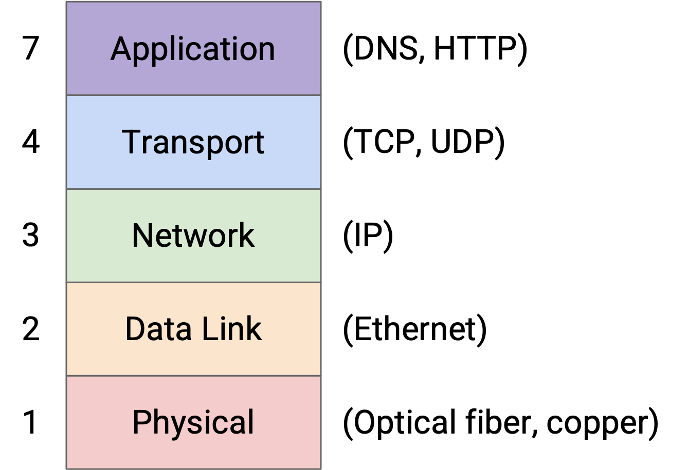
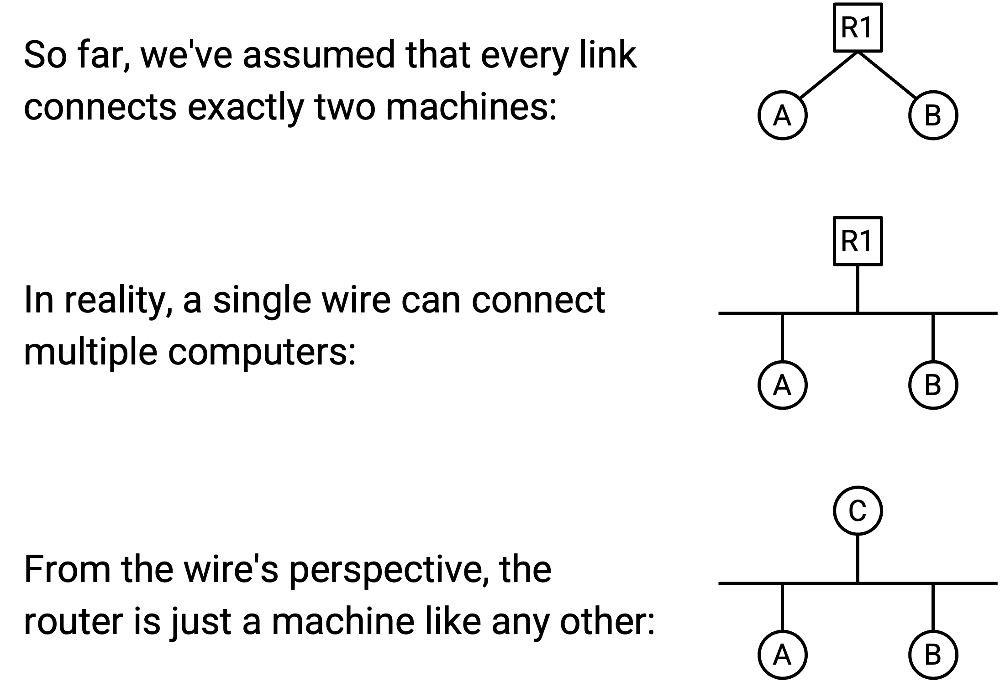
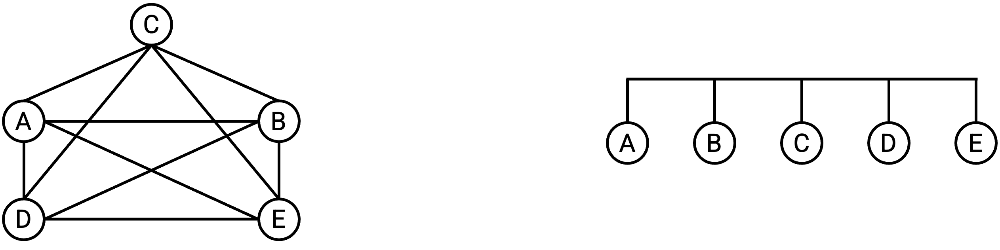
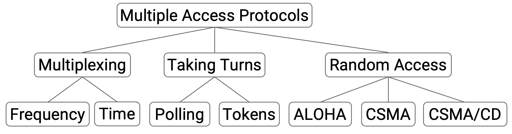
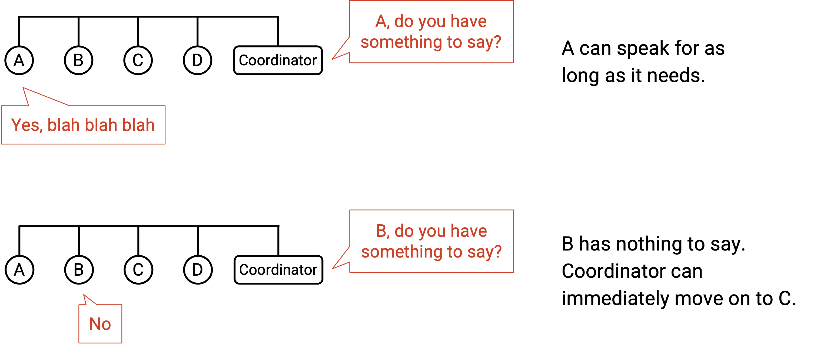
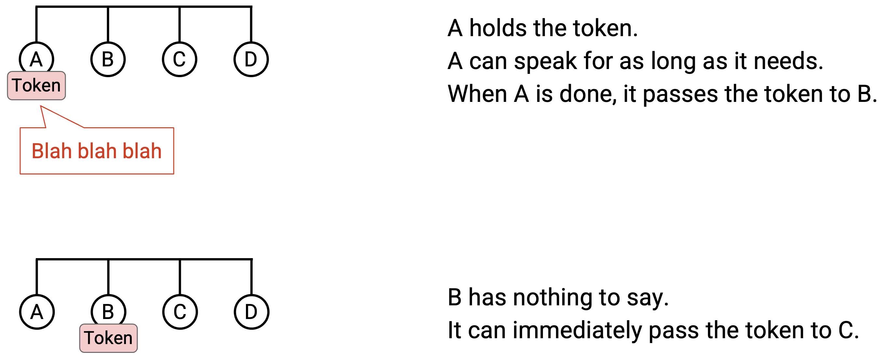
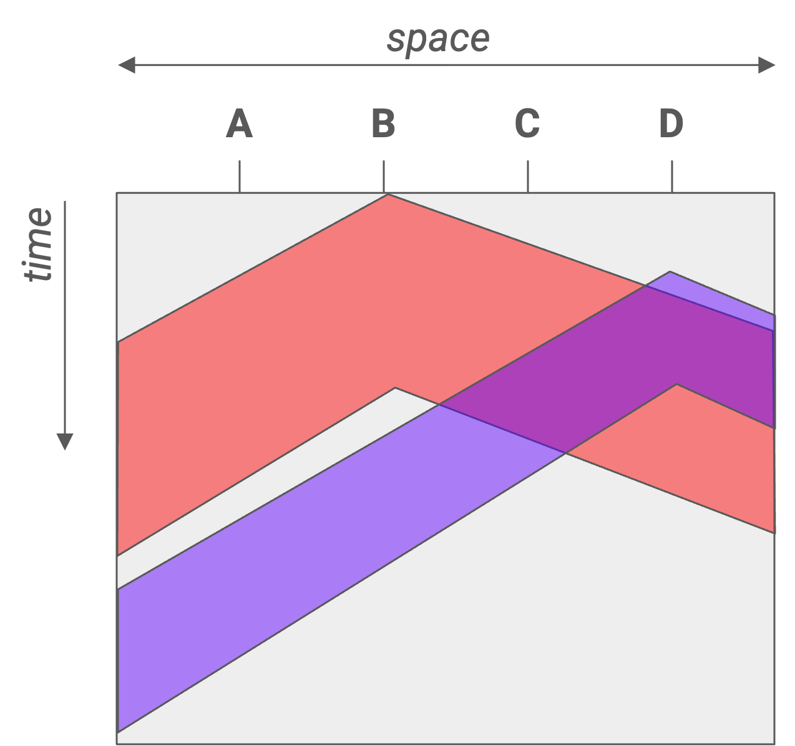
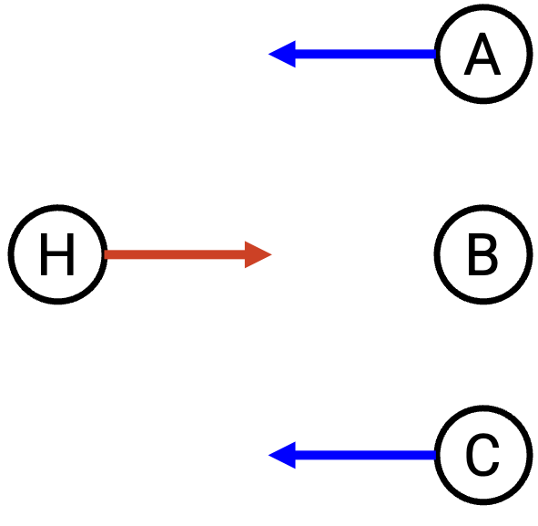
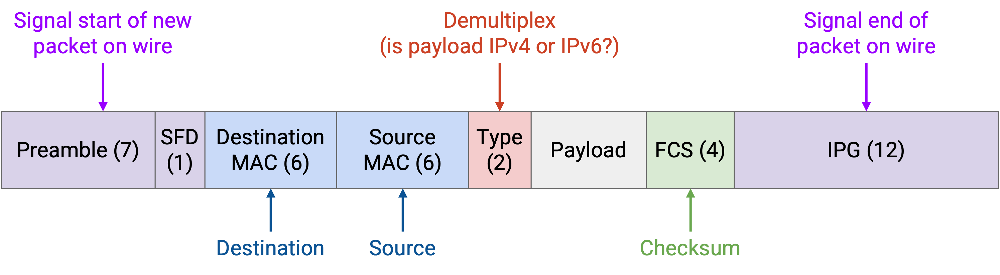

# Ethernet

## Mạng Cục bộ

Trong phần này, chúng ta sẽ tập trung vào những gì xảy ra bên trong một *local area network (mạng cục bộ)*, chẳng hạn như mạng trong nhà bạn với máy tính và *router (bộ định tuyến)* của bạn. Điều này trái ngược với các *wide-area networks (mạng diện rộng)* mà chúng ta đã tìm hiểu cho đến nay, vốn trải dài trên những khoảng cách lớn hơn.

Cụ thể, chúng ta sẽ xem xét việc *forwarding (chuyển tiếp)* và *addressing (đánh địa chỉ)* ở *Layer 2 (Lớp 2)*. Chúng ta sẽ phải định nghĩa cách các *packet (gói tin)* được chuyển tiếp từ một *host (máy trạm)* cục bộ đến một *router*. Chúng ta cũng sẽ thấy cách các *host* trong cùng một mạng cục bộ có thể trao đổi thông điệp ở *Layer 2*, mà không cần liên hệ với *router* ở các lớp cao hơn. Giao thức chiếm ưu thế ở *Layer 2* là *Ethernet*.

## Kết nối các Host Cục bộ

Cho đến nay, chúng ta đã vẽ các liên kết kết nối chính xác hai máy. Trong mạng cục bộ, chúng ta đã vẽ một đường nối mỗi *host* với *router*.

Thực tế, một sợi dây duy nhất có thể được sử dụng để kết nối nhiều máy. Trong mạng cục bộ, các *host* và *router* đều có thể nằm trên cùng một dây. Chúng ta có thể trừu tượng hóa hơn nữa và lưu ý rằng ở *Layer 2*, *router* thực sự chỉ là một máy như bất kỳ máy nào khác (chỉ là nó chạy các giao thức định tuyến ở các lớp cao hơn). Cuối cùng, sợi dây không thực sự quan tâm các máy được kết nối đang làm gì với dữ liệu chúng trao đổi.

Cách tốt nhất để nối dây các máy tính trong một mạng cục bộ là gì? Trước đây, khi lần đầu giới thiệu về định tuyến, chúng ta đã nghĩ đến việc sử dụng *mesh topology (cấu trúc liên kết lưới)* để kết nối tất cả các cặp máy tính trên thế giới. Chúng ta cũng đã xem xét việc sử dụng một sợi dây duy nhất để kết nối tất cả các máy tính. Cuối cùng, chúng ta quyết định rằng đối với một mạng toàn cầu, cả hai cách tiếp cận đều không thực tế, và chúng ta cần giới thiệu các *router*.

Chúng ta có thể xem xét lại các cấu trúc liên kết này trong mạng cục bộ. Một *mesh topology* vẫn khá không thực tế. Nếu một *host* mới tham gia, chúng ta sẽ phải thêm một dây nối nó với mọi *host* khác. Tuy nhiên, một *bus topology (cấu trúc liên kết bus)*, nơi chúng ta kết nối tất cả các máy tính dọc theo một sợi dây duy nhất, lại khá phổ biến và thực tế trong một mạng cục bộ.

*Bus topology* một dây giới thiệu khái niệm về *shared media (môi trường truyền dẫn chia sẻ)*. Khi chúng ta vẽ các liên kết nối hai máy, chỉ có hai máy tính đó sử dụng liên kết đó để giao tiếp. Bây giờ, một *packet* từ A đến C, và một *packet* từ B đến D, có thể ở trên dây cùng một lúc, và tín hiệu điện trên dây đó không thể chứa cả hai *packet* đồng thời.

Để tương tự, hãy xem xét nhiều người trong một cuộc gọi nhóm, chia sẻ một đường dây điện thoại duy nhất: Bất kỳ hai người nào cũng có thể nói chuyện với nhau, nhưng bạn không thể có hai cuộc trò chuyện đồng thời, nếu không không ai hiểu được điều gì đang được nói.

Chúng ta đã vẽ các liên kết như những sợi dây có tín hiệu điện trên đó cho đơn giản, nhưng thực tế, công nghệ liên kết có thể sử dụng các *shared media* khác. Ví dụ, trong một công nghệ liên kết không dây, tất cả các *host* được kết nối bởi liên kết đều chia sẻ cùng một phần của phổ điện từ.

## Giao tiếp qua Môi trường Truyền dẫn Chia sẻ: Các phương pháp Phối hợp

Trong một mạng có môi trường truyền dẫn chia sẻ, có nguy cơ các lần truyền từ các nút khác nhau có thể gây nhiễu hoặc *collision (xung đột)* với nhau. Nếu hai máy tính cố gắng truyền dữ liệu đồng thời, tín hiệu của chúng sẽ chồng chéo và gây nhiễu. Bên nhận có thể không giải mã được tín hiệu, và họ không thể biết ai đã gửi tín hiệu. Để giải quyết vấn đề này, chúng ta cần một *multiple access protocol (giao thức đa truy cập)* để đảm bảo rằng nhiều máy tính có thể chia sẻ liên kết và truyền qua nó.

Một loại phương pháp khả thi là phân bổ một phần tài nguyên cố định cho mỗi nút trên liên kết. Có hai cách chúng ta có thể xem xét để phân chia tài nguyên. Trong *frequency-division multiplexing (ghép kênh phân chia theo tần số)*, chúng ta phân bổ một dải tần số khác nhau cho mỗi máy tính. (Hãy xem xét đài AM/FM hoặc truyền hình quảng bá, chúng chia tần số thành các kênh.) Trong *time-division multiplexing (ghép kênh phân chia theo thời gian)*, chúng ta chia thời gian thành các khe cố định và phân bổ một khe cho mỗi nút được kết nối.

Việc phân bổ tài nguyên cố định có một số nhược điểm. Chỉ có một lượng tần số/thời gian hạn chế để phân phối. Ngoài ra, không phải ai cũng có điều gì đó để nói mọi lúc, vì vậy tần số/thời gian chúng ta phân bổ có thể không được sử dụng trong phần lớn thời gian. Cách tiếp cận này lãng phí, bởi vì nó giới hạn các máy tính vào dải được phân bổ cụ thể của chúng, ngay cả khi các dải khác có thể không được sử dụng.

Thay vì phân bổ cố định, một loại phương pháp khác dựa trên việc các nút thay phiên nhau, không có bất kỳ sự phân bổ cố định nào. Trong loại này, chúng ta đang phân vùng động theo thời gian, để các nút chỉ sử dụng thời gian chúng cần trong lượt của mình, không có thời gian lãng phí. Có hai cách chúng ta có thể xem xét để các nút thay phiên nhau.

Trong một *polling protocol (giao thức thăm dò)*, một điều phối viên tập trung quyết định khi nào mỗi nút được kết nối được phép nói. Điều phối viên đi đến từng nút một và hỏi xem nút đó có điều gì muốn nói không. Nếu nút nói có, điều phối viên cho phép nút nói trong một khoảng thời gian. Nếu nút nói không, điều phối viên ngay lập tức chuyển sang nút tiếp theo, và nút đó không lãng phí bất kỳ tài nguyên nào. Bluetooth là một giao thức trong thế giới thực sử dụng ý tưởng này.

Cách khác để cho các nút thay phiên là *token passing*. Thay vì có một điều phối viên tập trung, chúng ta có một thẻ bài ảo có thể được truyền giữa các nút, và chỉ nút có thẻ bài mới được phép nói. Nếu một nút có điều gì muốn nói, nó sẽ giữ thẻ bài trong khi truyền, sau đó chuyển nó cho nút tiếp theo. Nếu một nút không có gì để nói vào lúc đó, nó ngay lập tức chuyển thẻ bài cho nút tiếp theo. IBM Token Ring và FDDI là những ví dụ thực tế về các giao thức sử dụng ý tưởng này.

Một nhược điểm của các phương pháp dựa trên lượt này là sự phức tạp. Chúng ta phải triển khai một số hình thức giao tiếp giữa các nút, điều này có thể trở nên phức tạp. Trong *token passing*, chúng ta có thể cần một kênh tần số chuyên dụng để các nút có thể truyền thẻ bài một cách đáng tin cậy cho nhau. Chúng ta cũng có thể phải đối phó với các phức tạp như hai nút cùng nghĩ rằng chúng có thẻ bài và gây ra một *collision*. Trong một *polling protocol*, chúng ta cần chỉ định một điều phối viên trung tâm để giao tiếp với các nút, và triển khai một cách để điều phối viên nói chuyện với các nút. Trong Bluetooth, điện thoại thông minh của bạn có thể là điều phối viên trung tâm nói chuyện với các thiết bị phụ, nhưng trong các mạng khác, có thể không rõ ai là điều phối viên.

## Giao tiếp qua Môi trường Truyền dẫn Chia sẻ: Các phương pháp Truy cập Ngẫu nhiên

Một loại phương pháp thứ ba, bên cạnh phân bổ cố định hoặc thay phiên nhau, là *random access (truy cập ngẫu nhiên)*. Trong phương pháp này, chúng ta chỉ cho phép các nút nói bất cứ khi nào chúng có điều gì muốn nói, và giải quyết các *collision* khi chúng xảy ra. Các nút không phối hợp với nhau, và chỉ gửi dữ liệu bất cứ khi nào chúng có gì đó để gửi.

Một lợi ích lớn của các giao thức *random access* là sự đơn giản. Không giống như các phương pháp dựa trên lượt, chúng ta không cần triển khai giao tiếp giữa các nút.

Khi bên nhận nhận được một *packet*, nó sẽ trả lời bằng một *ack (gói tin xác nhận)*. Nếu hai nút gửi dữ liệu đồng thời, *collision* sẽ làm hỏng các *packet* của chúng, vì vậy không có *ack* nào được gửi. Nếu bên gửi không thấy *ack*, nó sẽ đợi một khoảng thời gian ngẫu nhiên và gửi lại. Việc đợi một khoảng thời gian ngẫu nhiên, thay vì gửi lại ngay lập tức, giúp chúng ta tránh được các *collision* khi các *packet* được gửi lại.

Giao thức *random access* ngây thơ là "thô lỗ" vì các nút bắt đầu nói bất cứ khi nào chúng muốn, và giải quyết *collision* sau đó. Một biến thể "lịch sự" hơn của giao thức này được gọi là *Carrier Sense Multiple Access (CSMA) (Đa truy cập nhận biết sóng mang)*. Các nút lắng nghe *shared media* trước để xem có ai đang nói không, và chỉ bắt đầu nói khi nó yên tĩnh. Ở đây, "lắng nghe" đề cập đến việc cảm nhận một tín hiệu trên dây.

Lưu ý rằng *CSMA* không giúp chúng ta tránh được tất cả các *collision*. Nếu tín hiệu lan truyền tức thời dọc theo toàn bộ chiều dài của dây, sẽ không có *collision* trong *CSMA*. Tuy nhiên, *propagation delay (độ trễ lan truyền)* có thể gây ra các vấn đề. Giả sử nút A ở một đầu của dây nghe thấy sự im lặng và bắt đầu truyền. Tín hiệu có thể chưa lan truyền đến nút B, ở đầu kia của dây. Nút B nghe thấy sự im lặng và cũng bắt đầu truyền, gây ra một *collision*.

Sơ đồ 2D này minh họa cách *propagation delay* có thể gây ra xung đột. Một mặt cắt ngang cho thấy sợi dây tại một thời điểm, và cho chúng ta thấy tín hiệu đã lan truyền được bao xa trên dây tại thời điểm đó. Một mặt cắt dọc cho thấy một vị trí duy nhất trên dây theo thời gian, và cho chúng ta thấy khi nào vị trí đó nhìn thấy các bit đầu tiên và cuối cùng của việc truyền. Cả H2 và H4 đều nghe thấy sự im lặng trước khi chúng bắt đầu truyền, nhưng tín hiệu của chúng vẫn xung đột.

Để giảm thiểu vấn đề này, chúng ta có thể sử dụng *CSMA/CD* (Carrier Sense Multiple Access with *Collision Detection (Phát hiện xung đột)*), mở rộng ý tưởng của *CSMA*. Ngoài việc lắng nghe trước khi nói, chúng ta cũng lắng nghe trong khi nói. Nếu bạn bắt đầu nghe thấy điều gì đó trong khi bạn đang truyền, bạn dừng lại ngay lập tức. Lưu ý rằng *CSMA/CD* vẫn không khắc phục được vấn đề *collision*, nhưng nó cho phép chúng ta phát hiện *collision* sớm hơn.

Nếu chỉ có một người nói, sẽ không có bất kỳ *collision* nào, và tất cả các lược đồ *random access* của chúng ta đều hoạt động tốt. Nếu chỉ có một vài người nói, có thể có những *collision* không thường xuyên, nhưng tất cả các lược đồ của chúng ta đều có thể giải quyết chúng. Tuy nhiên, nếu nhiều người gửi muốn nói đồng thời, chúng ta có thể gặp vấn đề với các *collision* lặp đi lặp lại, và việc đợi một khoảng thời gian ngẫu nhiên để gửi lại sẽ không giúp ích.

Để đối phó với các *collision* lặp đi lặp lại, *CSMA/CD* sử dụng *binary exponential backoff (lùi số mũ nhị phân)*. Mỗi lần chúng ta phát hiện một *collision* trong một lần thử gửi lại, chúng ta đợi một khoảng thời gian dài gấp đôi trước lần gửi lại tiếp theo. Lưu ý rằng chúng ta vẫn chọn ngẫu nhiên thời gian gửi lại, nhưng mỗi lần chúng ta phát hiện một *collision*, chúng ta chọn số ngẫu nhiên từ một phạm vi có giới hạn cao gấp đôi. Ví dụ, nếu chúng ta chọn một thời gian ngẫu nhiên trong khoảng [0, 4] và phát hiện một *collision*, thời gian ngẫu nhiên tiếp theo chúng ta chọn là trong khoảng [0, 8].

*Binary exponential backoff* hoạt động tốt trong cả hai kịch bản. Khi có ít nút nói, các *collision* lặp lại không phổ biến, vì vậy chúng ta có thể gửi lại sau một thời gian chờ ngắn. Khi có nhiều nút nói, có nhiều *collision* lặp lại, vì vậy độ trễ tăng theo cấp số nhân cho đến khi không có *collision* nào (ví dụ: đủ số nút đã bị trì hoãn rất xa trong tương lai, và có ít nút cạnh tranh hơn ngay bây giờ). Cách tiếp cận này đảm bảo chúng ta chỉ giảm tốc độ khi nhiều nút muốn nói, và duy trì tốc độ truyền nhanh khi ít nút muốn nói.

## Lược sử Layer 2: ALOHANet

Năm 1968, Norman Abramson gặp một vấn đề tại Đại học Hawaii. Có một máy tính trung tâm tại Đại học Hawaii, và ông cần một cách để các máy tính trên các hòn đảo khác có thể truy cập vào máy tính trung tâm này. Thiết kế kết quả đã có ảnh hưởng rất lớn đến các thiết kế giao thức *Layer 2* hiện đại.

Giao thức kết quả được gọi là *ALOHANet* (Additive Links On-line Hawaii Area), cho phép giao tiếp không dây từ các hòn đảo khác đến máy tính trung tâm. *ALOHANet* là không dây và sử dụng một *shared media*, nơi mọi người đều gửi dữ liệu qua cùng một liên kết.

*ALOHANet* đã sử dụng một sự kết hợp của phân bổ cố định và *random access*, do thiết lập bất đối xứng của nó. Máy tính trung tâm (hub) sử dụng tần số chuyên dụng của riêng mình để truyền các thông điệp đi, và tất cả các nút từ xa đều lắng nghe trên tần số này để nhận thông điệp. Với chỉ một người gửi trên một tần số chuyên dụng, không có nguy cơ *collision*.

Ngược lại, tất cả các nút từ xa đều truyền trên một tần số chia sẻ riêng biệt, và hub lắng nghe trên tần số này. Hub sẽ không xung đột với các nút từ xa, vì chúng sử dụng các tần số khác nhau, nhưng các nút từ xa có thể xung đột với nhau.

Thiết kế bất đối xứng này hoạt động tốt cho *ALOHANet* vì hub có lẽ có nhiều thứ để gửi hơn các nút từ xa.

*ALOHANet* là một trong những hệ thống đầu tiên sử dụng một *random access protocol* để xử lý các *collision*, và cách tiếp cận này sau này sẽ được sử dụng trong *Ethernet*. *ALOHANet* đã sử dụng cách tiếp cận *random access* ngây thơ và thô lỗ. Các giao thức sau này như *Ethernet* đã sử dụng cách tiếp cận lịch sự hơn của *CSMA/CD*, nơi chúng ta lắng nghe các *collision* trước và trong khi truyền, và chúng ta lùi theo cấp số nhân khi có *collision*.

## Giao tiếp LAN: Địa chỉ MAC

Bởi vì nhiều máy tính có thể được kết nối dọc theo cùng một liên kết *Ethernet*, chúng ta thực sự có thể sử dụng các giao thức *Layer 2* để gửi thông điệp giữa các máy tính cục bộ trên cùng một liên kết, mà không cần sử dụng bất kỳ giao thức *Layer 3 (Lớp 3)* nào cả (ví dụ: không có *router* chuyển tiếp *packet*). Trong phép tương tự về hệ thống bưu chính, hai người trong cùng một phòng có thể chuyền thư cho nhau, mà không cần gửi thư đến bưu điện.

Một vấn đề khi gửi thông điệp qua *shared media* là: Khi chúng ta truyền thông điệp, mọi người trên liên kết đều nhận được thông điệp, không chỉ người nhận dự định. Để gửi một thông điệp chỉ cho một người, chúng ta cần một hệ thống *addressing* ở *Layer 2* để có thể xác định máy nào là đích của thông điệp. Trong phép tương tự về hệ thống bưu chính, nếu tôi nói trong một căn phòng, mọi người đều nhận được thông điệp. Để nói chuyện với một người cụ thể, tôi cần gọi tên họ.

Ở *Layer 2*, mỗi máy tính có một *MAC address (Địa chỉ Kiểm soát Truy cập Phương tiện)*. *MAC address* dài 48 bit, và thường được viết dưới dạng thập lục phân với dấu hai chấm ngăn cách mỗi 2 chữ số hex (8 bit), ví dụ: *f8:ff:c2:2b:36:16*. *MAC address* đôi khi được gọi là địa chỉ ether hoặc địa chỉ liên kết.

*MAC address* thường được mã hóa cứng vĩnh viễn ("burned in") trên một thiết bị (ví dụ: NIC trong máy tính của bạn). Hầu hết các hệ điều hành sẽ cho phép bạn ghi đè *MAC address* bằng phần mềm, nhưng mỗi thiết bị đã đi kèm với một *MAC address* được cài đặt sẵn. *MAC address* được phân bổ theo nhà sản xuất tạo ra phần cứng. Hai bit đầu tiên là cờ, sau đó 22 bit tiếp theo xác định nhà sản xuất, rồi 24 bit cuối cùng xác định máy cụ thể trong không gian địa chỉ của nhà sản xuất đó.

Tại sao không chỉ sử dụng *IP addressing (việc đánh địa chỉ IP)*? Các *host* trên một liên kết có thể muốn trao đổi thông điệp, mà không cần kết nối với Internet (tức là chúng hoàn toàn không có địa chỉ IP).

Lược đồ *addressing* vĩnh viễn này khác với IP, nơi bạn nhận được một địa chỉ khi lần đầu tham gia mạng, và địa chỉ đó phụ thuộc vào vị trí địa lý của bạn. *MAC address* thường được cho là duy nhất trên toàn cầu, bởi vì bạn có thể cắm máy tính của mình vào bất kỳ mạng cục bộ nào, và sẽ rất tệ nếu hai máy tính trên một liên kết có cùng một *MAC address*.

## Các loại Giao tiếp LAN, Cấu trúc Gói tin Ethernet

Có các loại đích đến khác nhau trong một *packet* *Layer 2*. Trong *unicast (truyền tin đơn hướng)*, *packet* được dành cho một người nhận duy nhất. Trong *broadcast (truyền tin quảng bá)*, *packet* được dành cho tất cả các máy trên mạng cục bộ. Trong *multicast (truyền tin đa hướng)*, *packet* được dành cho tất cả các máy trong mạng cục bộ thuộc về một nhóm cụ thể. Các máy có thể chọn tham gia các nhóm nhất định để nhận các *packet* dành cho nhóm đó. *Ethernet* hỗ trợ *unicast*, *multicast*, và *broadcast*.

Lưu ý rằng *broadcast* đôi khi được coi là một trường hợp đặc biệt của *multicast*, nơi mọi người tự động là một phần của nhóm quảng bá.

Mô hình *unicast/broadcast/multicast* này cũng mở rộng đến các lớp khác. Ví dụ, chúng ta đã thấy *anycast (truyền tin tới một trong nhóm)* ở *Layer 3*, với mục tiêu là gửi đến bất kỳ một thành viên nào của một nhóm (bất kỳ máy chủ nào có cùng địa chỉ IP).

## Cấu trúc Gói tin Ethernet

Một *packet* dữ liệu trong *Ethernet* được gọi là một *frame (khung dữ liệu)*. Nhiều trường trông tương tự như các trường tiêu đề IP, mặc dù có một số khác biệt.

*Packet* *Ethernet* bắt đầu bằng một *preamble (phần mở đầu)* 7 byte, chỉ ra sự bắt đầu của một *packet*. Điều này giúp tách biệt các *packet* khi chúng được truyền tín hiệu qua dây.

Sau đó, chúng ta có địa chỉ MAC đích và nguồn, tương tự như các trường đích và nguồn trong tiêu đề IP. Chúng ta có một trường loại 2 byte, cho phép chúng ta phân kênh giữa IPv4 hoặc IPv6, và chuyển tải trọng *packet* đến giao thức tiếp theo chính xác. Điều này tương tự như trường giao thức trong tiêu đề IP, hoặc trường cổng trong tiêu đề TCP/UDP. Chúng ta cũng có một *checksum (tổng kiểm)*, mặc dù không giống như IP, *checksum* là trên toàn bộ *packet*, để chúng ta không phải dựa vào các lớp cao hơn (ví dụ: *packet* có thể hoàn toàn không phải là TCP/IP).

Để *unicast* một thông điệp, chúng ta đặt địa chỉ MAC đích thành *MAC address* của một máy cụ thể. Mọi người trên *shared media* đều nhận được *packet*, vì vậy mọi người cần kiểm tra MAC đích để xem *packet* có dành cho mình không. Nếu địa chỉ MAC đích không khớp với địa chỉ của bạn, bạn nên bỏ qua *packet*.

Để *broadcast* một thông điệp, chúng ta đặt MAC đích thành địa chỉ đặc biệt *FF:FF:FF:FF:FF:FF* (toàn bit 1). Giống như trong *unicast*, mọi người trên *shared media* đều nhận được *packet*, nhưng lần này, vì địa chỉ MAC đích là địa chỉ *broadcast*, mọi người đều biết để đọc *packet*. Lưu ý rằng địa chỉ *broadcast* toàn bit 1 này là giống nhau trong mọi mạng *Ethernet*.

Để *multicast* một thông điệp, chúng ta đặt MAC đích thành địa chỉ của nhóm đó. Nhớ lại rằng hai bit đầu tiên của *MAC address* là cờ. Các địa chỉ bình thường được phân bổ cho các máy luôn đặt bit đầu tiên thành 0, và các địa chỉ cho các nhóm luôn đặt bit đầu tiên thành 1. Giống như trong *unicast* và *broadcast*, mọi người vẫn nhận được thông điệp. Bất kỳ ai là thành viên của một nhóm cần đảm bảo rằng họ đang lắng nghe trên địa chỉ của nhóm đó để nhận các *packet* *multicast* đến nhóm đó. Các giao thức bổ sung là cần thiết để kiểm soát ai thuộc về nhóm nào, và chúng ta sẽ không thảo luận thêm về chúng.

## Mạng Layer 2 với Ethernet

Cho đến nay, chúng ta đã trình bày các giao thức *Layer 2* hoạt động trên một liên kết duy nhất với nhiều máy tính được gắn vào nó, nhưng chúng ta có thể giới thiệu nhiều liên kết và xây dựng một mạng hoàn toàn bằng *Layer 2*. Các *packet* có thể được chuyển tiếp, và các máy thậm chí có thể chạy các giao thức định tuyến, tất cả đều sử dụng độc quyền các *MAC address* *Layer 2*.

Các giao thức định tuyến chúng ta chạy ở lớp IP cũng có thể hoạt động ở *Layer 2*, mặc dù một nhược điểm là chúng ta không thể tổng hợp các *MAC address*. Địa chỉ IP được phân bổ dựa trên địa lý, nhưng *MAC address* được phân bổ dựa trên nhà sản xuất, vì vậy không có cách nào rõ ràng để tổng hợp chúng. Nhược điểm này là lý do tại sao chúng ta không thể xây dựng Internet toàn cầu chỉ bằng *Layer 2*.

Nếu có nhiều liên kết trong một mạng cục bộ duy nhất, chúng ta sẽ phải đảm bảo rằng nếu ai đó *broadcast* một thông điệp, bất kỳ *switch (thiết bị chuyển mạch)* nào ở *Layer 2* cũng sẽ chuyển tiếp *packet* ra khỏi tất cả các cổng đi.

*Multicast* trở nên phức tạp hơn trong một mạng *Layer 2* với nhiều liên kết. Cần có các giao thức bổ sung, mặc dù chúng ta sẽ không thảo luận thêm.

Một ví dụ về *multicast* hữu ích trên mạng LAN là *Bonjour/mDNS*, một giao thức do Apple phát triển. Trong giao thức này, tất cả các thiết bị của Apple (ví dụ: iPhone, iPad, Apple TV) được mã hóa cứng để tham gia một nhóm đặc biệt trên mạng cục bộ. Nếu iPhone của bạn muốn tìm các thiết bị gần đó để phát nhạc (ví dụ: Apple TV, loa Apple hoặc HomePod hay bất cứ tên gọi nào của chúng), iPhone có thể *multicast* một thông điệp đến nhóm, hỏi xem có ai có thể phát nhạc không. Các thiết bị trong nhóm cũng có thể *multicast* phản hồi, nói rằng "Tôi là một Apple TV và tôi có thể phát nhạc." Điều thú vị là giao thức này thực sự cũng sử dụng DNS trong nhóm *multicast* để gửi *SRV records (bản ghi SRV)*, ánh xạ mỗi máy với các khả năng của nó.

Lưu ý lịch sử: Trong Internet hiện đại, chúng ta đã nói rằng các thuật ngữ "router" và "switch" có thể thay thế cho nhau. Bây giờ chúng ta đã có khái niệm về mạng *Layer 2*, chúng ta có thể nói rằng một *switch* chỉ hoạt động ở Lớp 1 và 2, trong khi một *router* hoạt động ở Lớp 1, 2 và 3.

Nếu bạn quay lại hình ảnh của chúng ta về việc đóng gói và mở gói các tiêu đề, chúng ta đã giả định rằng mọi *router* đều phân tích *packet* lên đến *Layer 3*, và chuyển tiếp *packet* đến *router* tiếp theo qua IP. Tuy nhiên, nếu chúng ta có một mạng *Layer 2* với nhiều liên kết, một *switch* chỉ cần chuyển *packet* lên đến *Layer 2* và chuyển tiếp *packet* đến *switch* tiếp theo qua *Ethernet*.

Ngày nay, hầu như tất cả các *switch* cũng triển khai *Layer 3*, đó là lý do tại sao chúng ta sử dụng các thuật ngữ này thay thế cho nhau. Về mặt lịch sử, *Ethernet* có trước Internet, đó là lý do tại sao có sự phân biệt giữa *switch* và *router*.