# NAT: *Network Address Translation* (Chuyển đổi địa chỉ mạng)

## Động cơ: Cạn kiệt địa chỉ *IPv4*

Hãy nhớ rằng chúng ta chỉ có $$2^{32}$$ địa chỉ *IPv4* khác nhau, con số này không đủ để gán cho mọi *host* (máy chủ/máy trạm) trên Internet. Chúng ta đã thấy rằng *IPv6* là một giải pháp mạnh mẽ cho vấn đề cạn kiệt địa chỉ *IPv4*, nhưng việc triển khai *IPv6* diễn ra khá chậm.

Trong thời gian chờ đợi, để tiết kiệm địa chỉ, *IANA* đã phân bổ các dải địa chỉ IP riêng (*private IP addresses*) theo chuẩn RFC 1918, có thể được sử dụng bởi bất kỳ mạng nào không yêu cầu địa chỉ Internet công cộng: 192.168.0.0/16, 10.0.0.0/8 và 172.16.0.0/12. Thực tế, các địa chỉ này thường được dùng trong mạng gia đình, giúp thiết bị cá nhân của bạn không cần một địa chỉ IP công cộng duy nhất. Tuy nhiên, bạn vẫn cần truy cập Internet, vậy làm thế nào để sử dụng địa chỉ IP riêng?

## NAT: Khái niệm

Trong *NAT*, mục tiêu là sử dụng một địa chỉ IP công cộng duy nhất để đại diện cho nhiều *host* trong mạng nội bộ. Mấu chốt là *gateway router* (bộ định tuyến cổng) sẽ chuyển đổi địa chỉ IP riêng thành địa chỉ công cộng trước khi gửi gói tin ra ngoài. Sau đó, *router* sẽ chuyển đổi địa chỉ công cộng trở lại thành địa chỉ riêng cho các gói tin phản hồi đi vào.

Alice, Bob và Chuck cùng làm việc tại tiệm lốp xe của Joe. Họ có các địa chỉ IP riêng A, B và C, vốn không thể sử dụng trực tiếp trên Internet vì không duy nhất. Thay vào đó, tất cả mọi người trong tiệm phải chia sẻ một địa chỉ IP công cộng duy nhất – đây là địa chỉ duy nhất và hợp lệ trên Internet mà họ có.

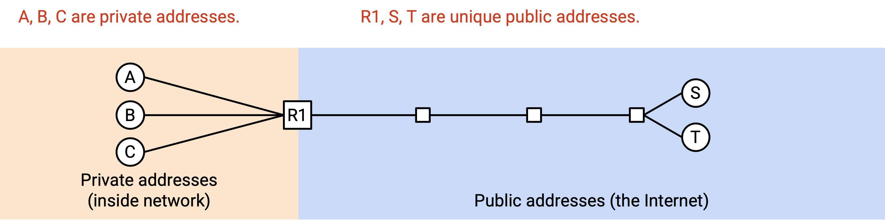

Alice muốn gửi một thông điệp đến máy chủ công cộng bên ngoài có địa chỉ IP công cộng S. Cô gửi một *packet* (gói tin) với thông tin: "From: A, To: S". Nếu gửi gói tin này trực tiếp, S sẽ không thể phản hồi vì A là địa chỉ IP riêng.

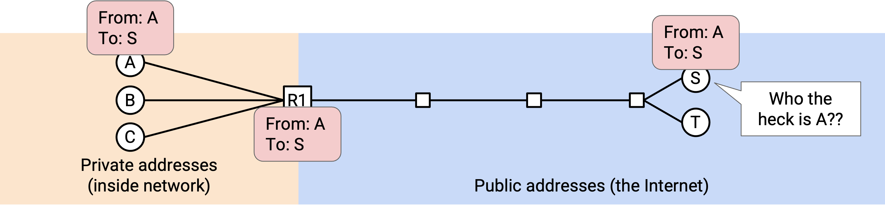

Thay vào đó, khi gói tin đến *gateway router*, nó sẽ ghi lại tiêu đề thành "From: R1, To: S". *Router* cũng ghi chú: Nếu nhận được phản hồi từ S, hãy gửi cho A.

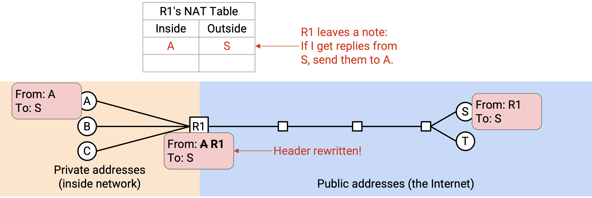

Khi S nhận được gói tin, nó sẽ phản hồi đến địa chỉ công cộng R1: "From: S, To: R1". Khi R1 nhận được phản hồi, nó kiểm tra ghi chú và sửa tiêu đề thành "From: S, To: A", rồi gửi gói tin về cho A.

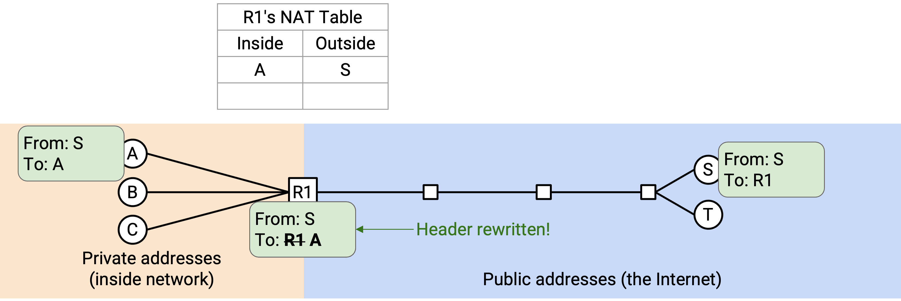

Nhờ vậy, Alice, Bob và Chuck đều có thể gửi gói tin ra ngoài. Khi *router* nhận gói tin, nó phải ghi nhớ ánh xạ giữa đích bên ngoài và nguồn bên trong ("B vừa gửi gói tin đến N, nên mọi phản hồi từ N phải gửi lại cho B").

Vấn đề phát sinh nếu Alice và Bob cùng muốn giao tiếp với S.

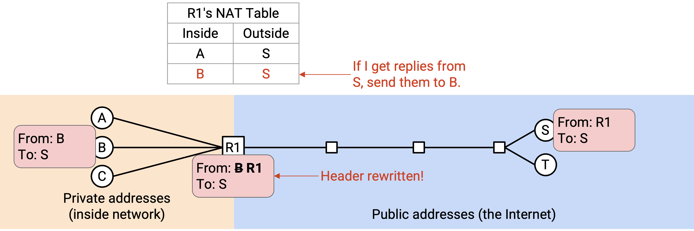

Khi phản hồi từ S đến, *router* sẽ không biết nên gửi cho A hay B.

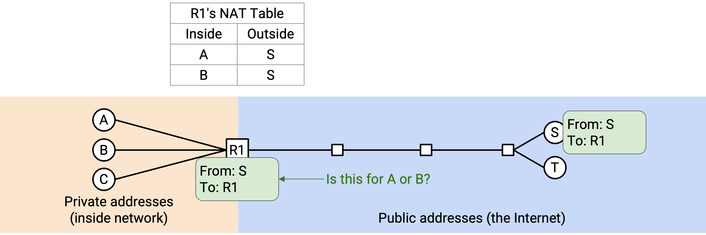

Chúng ta có thể giải quyết bằng cách sử dụng *logical ports* (cổng logic) từ *Layer 4*. Kết nối của Alice: "From: A, Port 50000, To: S, Port 80". *Router* chuyển thành "From: R1, Port 50000, To: S, Port 80" và ghi chú: nếu nhận phản hồi từ S, Port 80, đến R1, Port 50000 thì gửi cho A.

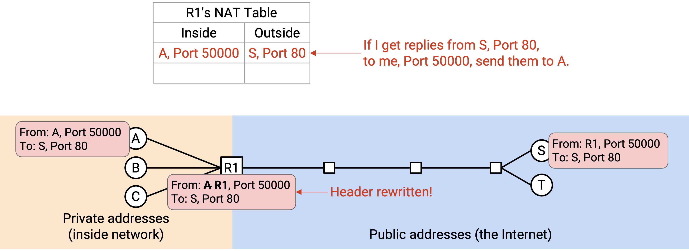

Bob có thể tạo kết nối riêng: "From: B, Port 60000, To: S, Port 80". *Router* chuyển thành "From: R1, Port 60000, To: S, Port 80" và ghi chú: nếu nhận phản hồi từ S, Port 80, đến R1, Port 60000 thì gửi cho B.

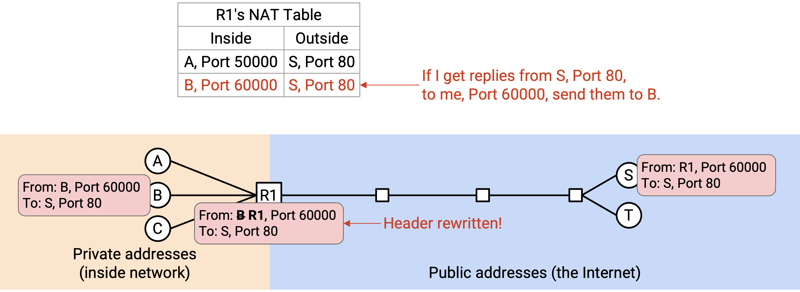

Nói chung, *router* sẽ theo dõi kết nối bằng bộ 5 thông tin (*5-tuple*): địa chỉ IP nguồn, địa chỉ IP đích, giao thức, *source port* (cổng nguồn) và *destination port* (cổng đích). Khi nhận gói tin đi ra, *router* đổi IP nguồn riêng thành IP nguồn công cộng và lưu bộ 5-tuple. Khi nhận gói tin đi vào, *router* tra bảng để tìm kết nối tương ứng và gửi đến *client* phù hợp (với IP riêng của họ).

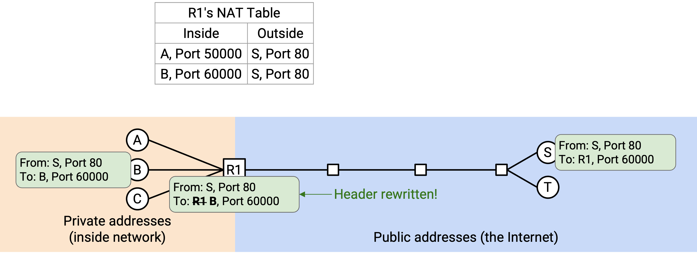

## Thay đổi số cổng của *Client*

Vấn đề cuối cùng: nếu Alice và Bob cùng chọn cùng một số cổng (ví dụ Port 50000)?

Khi đó, *router* sẽ lưu hai kết nối: (A Port 50000 → S Port 80) và (B Port 50000 → S Port 80). Nếu nhận gói tin "From: S, Port 80, To: R1, Port 50000", sẽ không rõ gói tin thuộc kết nối của A hay B.

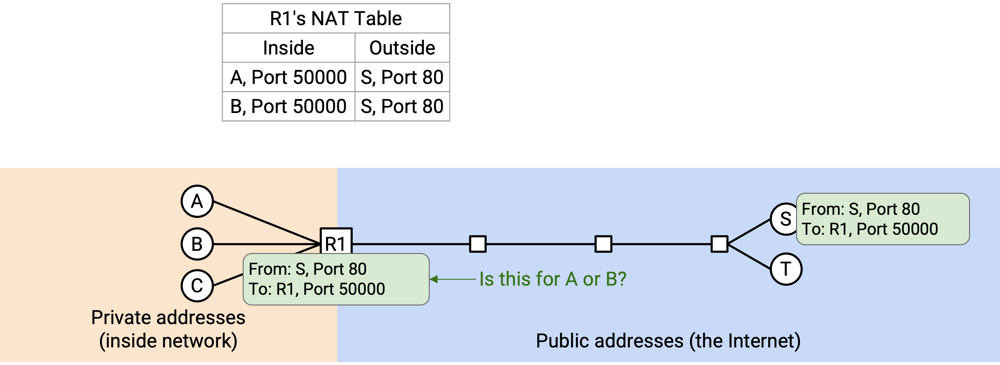

Giải pháp là cho phép *router* thay đổi cả số cổng. Khi Bob gửi "From: B, Port 50000, To: S, Port 80", *router* nhận thấy Port 50000 đã được dùng cho kết nối đến S Port 80, nên tạo một *fake port* (cổng giả) cho Bob, ví dụ 60000, và chuyển thành "From: R1, Port 60000, To: S, Port 80".

*Router* lưu: (B Port 50000, giả thành 60000, → S Port 80).

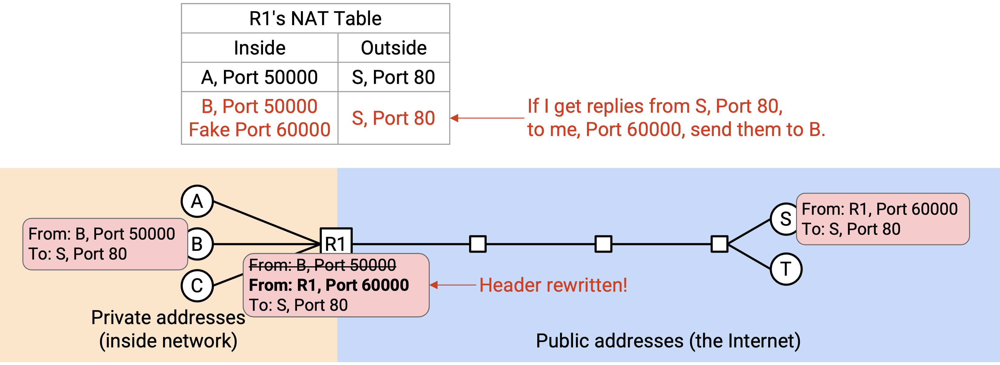

Khi nhận gói tin "From: S, Port 80, To: R1, Port 50000" → của Alice; còn "From: S, Port 80, To: R1, Port 60000" → của Bob.

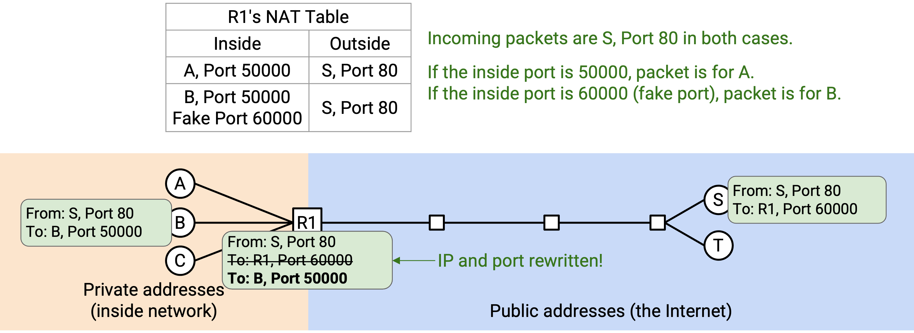

Bob không hề biết *router* đã đổi số cổng. Khi *router* gửi lại gói tin cho Bob, nó đổi cổng giả về cổng gốc.

## NAT: Triển khai

Khi *home router* (router gia đình) kết nối *ISP* lần đầu, nó có thể chạy *DHCP* để nhận địa chỉ IP công cộng. *ISP* cấp một địa chỉ IP duy nhất cho *home router*, và tất cả thiết bị trong mạng gia đình sẽ chia sẻ địa chỉ này.

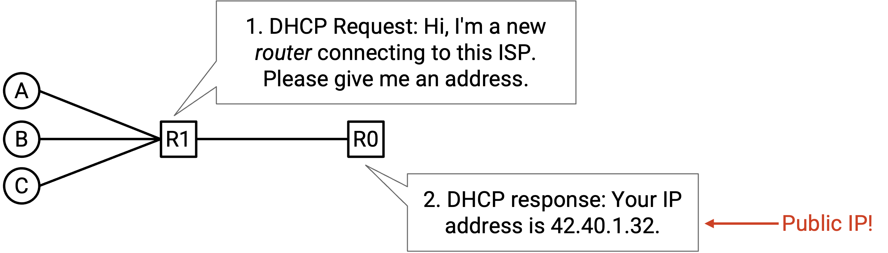

Chế độ NAT vừa mô tả gọi là **Port Address Translation (PAT)** – cho phép tạo *fake port*. PAT yêu cầu *router* hiểu *Layer 4* để phân tích gói tin, theo dõi kết nối và sửa tiêu đề.

PAT là chế độ NAT phức tạp và phổ biến nhất, nhưng cũng có chế độ NAT đơn giản hơn cho ánh xạ một-một. Ví dụ: 10.0.0.1 (riêng) ↔ 42.0.2.1 (công cộng).

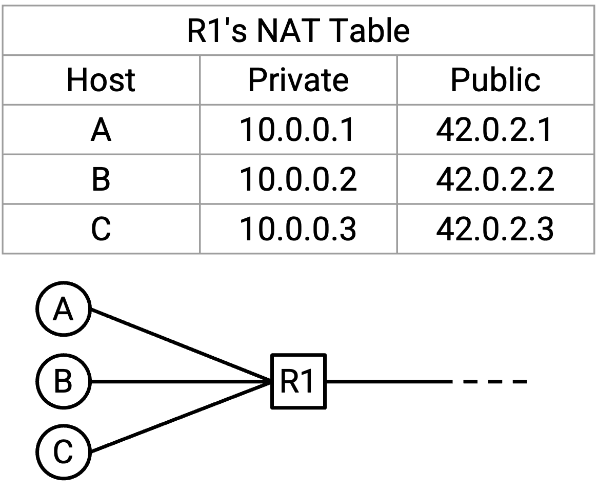

## NAT được dùng ở đâu?

NAT làm tăng độ phức tạp của *packet forwarding* (chuyển tiếp gói tin) vì *router* phải phân tích cả tiêu đề *Layer 4*, sửa tiêu đề *Layer 3* và *Layer 4*, và duy trì bảng trạng thái kết nối. Điều này tiêu tốn CPU và bộ nhớ.

Vì vậy, NAT thường được triển khai ở rìa mạng (*edge*), ví dụ trên *home router* (router gia đình), để giới hạn số lượng luồng (*flow*) đi qua router. Chạy NAT trên router gia đình là hợp lý vì thường không có quá nhiều thiết bị trong nhà gửi kết nối ra ngoài. Ngược lại, chạy NAT trên các *datacenter router* (router trung tâm dữ liệu) hiệu năng cao sẽ là ý tưởng tồi.

Trong thực tế, NAT quy mô nhỏ được sử dụng trong hầu hết các mạng cá nhân (gia đình/văn phòng) cho *IPv4*, ngay cả ngày nay. Khi địa chỉ *IPv4* cạn kiệt, các *ISP* (nhà cung cấp dịch vụ Internet) không thể cấp một địa chỉ công cộng cho mỗi khách hàng (tức mỗi router gia đình). Kết quả là, chính mạng của ISP cũng phải chạy một phiên bản NAT phức tạp hơn gọi là **Carrier Grade NAT (CGNAT)**. Phiên bản này được triển khai sâu hơn trong mạng và yêu cầu router theo dõi nhiều kết nối hơn rất nhiều.

Lưu ý rằng chúng ta thường không dùng NAT cho *IPv6*, vì *IPv6* có đủ địa chỉ để gán một địa chỉ công cộng duy nhất cho mọi máy tính trên thế giới.

## Kết nối đến (*Inbound Connections*)

Cho đến giờ, chúng ta giả định rằng các kết nối luôn được khởi tạo từ phía *client* (máy khách) có địa chỉ IP riêng. Nói cách khác, gói tin đầu tiên luôn đi ra ngoài, từ *client* đến *server*. Điều này phù hợp với cách hầu hết các mạng gia đình hoạt động: khi bạn tải một trang web, bạn là bên khởi tạo kết nối. Thông thường, không ai từ bên ngoài cố gắng kết nối đến bạn.

Nhưng nếu bạn đang chạy một *server* và muốn người bên ngoài có thể khởi tạo kết nối đến *server* này thì sao? Người dùng bên ngoài không thể gửi gói tin trực tiếp đến địa chỉ IP riêng. Họ có thể gửi đến địa chỉ IP công cộng của router, nhưng nếu router nhận được gói tin như "From: outside user, To: R1, Port 28", router sẽ không biết phải chuyển tiếp đến *client* riêng nào. Đây là gói tin đầu tiên của một kết nối mới, nên bảng NAT của router chưa có thông tin về kết nối này.

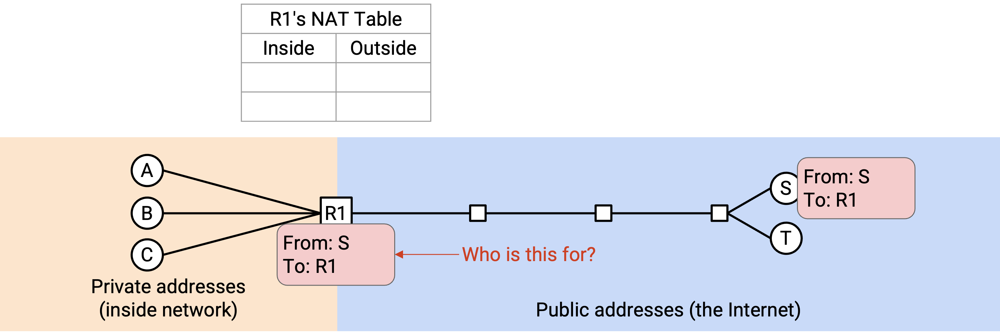

Để cho phép kết nối đến, router chạy NAT cần có **port mapping table** (bảng ánh xạ cổng). Ví dụ, Alice (bên trong mạng, chỉ có IP riêng) thông báo cho router: "Tôi sẽ chạy một *server* mới và lắng nghe trên Port 28". Khi đó, nếu router thấy gói tin từ bên ngoài gửi đến R1, Port 28, nó sẽ biết cần chuyển tiếp gói tin này cho Alice.

Các mục trong bảng ánh xạ cổng có thể cần cấu hình thủ công (ví dụ: Alice cấu hình router bằng tay). Các giao thức động như *UPnP* (*Universal Plug-n-Play*) và *NAT-PMP* (*NAT Port Mapping Protocol*) cho phép cấu hình cổng mở một cách tự động. Các giao thức này đôi khi được dùng bởi ứng dụng như trò chơi trực tuyến, nơi cần kết nối đến từ bên ngoài.

## Tác động bảo mật của NAT (*Security Implications of NAT*)

NAT phá vỡ *End-to-end Principle* (nguyên tắc đầu-cuối). Trước đây, với *Layer 3*, bất kỳ ai trên Internet cũng có thể kết nối đến bất kỳ ai khác. Tuy nhiên, vì NAT không cho phép kết nối đến theo mặc định, người dùng trong mạng gia đình (chỉ có IP riêng và chia sẻ IP công cộng) sẽ không thể được truy cập trực tiếp. Họ phải cấu hình router trước khi có thể nhận gói tin đến.

NAT có đặc điểm là chặn kết nối đến theo mặc định. Điều này có thể được xem như một tính năng bảo mật, dù thực chất chỉ là hệ quả phụ chứ không phải mục tiêu thiết kế. NAT khiến các kết nối đến bị chặn, điều này có thể hữu ích để ngăn kẻ tấn công kết nối vào các *host* bên trong mạng. Hành vi này khá giống với *firewall* (tường lửa), vốn cũng thường chặn kết nối đến theo mặc định. Tuy nhiên, đây chỉ là sự trùng hợp, nên NAT không thực sự thực thi một chính sách bảo mật có nguyên tắc, và không nên được coi là một biện pháp phòng thủ tuyệt đối.

NAT cũng có tác dụng phụ là giúp bảo vệ quyền riêng tư của *client*. Một lần nữa, đây không phải là tính năng bảo mật được thiết kế chủ đích. Vì router thay đổi địa chỉ IP của *client*, khi *server* nhận gói tin, nó không biết chính xác ai là người gửi ban đầu (có thể là Alice, Bob hoặc Chuck).

Ngược lại, nếu không dùng NAT, *server* có thể biết chính xác danh tính của người gửi. Ngoài ra, nếu không dùng NAT và dùng *IPv6*, *server* thậm chí có thể biết chính xác máy tính mà người gửi đang dùng, vì địa chỉ *IPv6* đôi khi được tự động cấu hình dựa trên địa chỉ MAC (chép một phần địa chỉ MAC vào địa chỉ IP). Nếu dùng *IPv6* và vẫn muốn bảo vệ quyền riêng tư của *client*, có thể dùng các giải pháp khác như *IPv6 temporary/privacy addresses* (địa chỉ tạm thời/riêng tư).
