# Định địa chỉ (Addressing)

## Mở rộng quy mô Định tuyến (Scaling Routing)

Cho đến nay, *forwarding table* (bảng chuyển tiếp) của chúng ta có một mục cho mỗi đích đến. Điều này sẽ không thể mở rộng cho toàn bộ Internet.

Nếu chúng ta chạy giao thức *distance-vector* (vector khoảng cách) trên toàn bộ Internet, chúng ta sẽ phải gửi một thông báo cho mỗi máy chủ trên Internet. Nếu chúng ta chạy giao thức *link-state* (trạng thái liên kết) trên toàn bộ Internet, mỗi *router* (bộ định tuyến) sẽ phải biết toàn bộ đồ thị mạng Internet. Trong cả hai trường hợp, nếu bất kỳ máy chủ nào tham gia hoặc rời khỏi Internet, chúng ta sẽ phải thực hiện lại các phép tính để hội tụ về một trạng thái định tuyến mới.

Bí quyết để mở rộng quy mô định tuyến nằm ở cách chúng ta định địa chỉ cho các máy chủ. Cho đến nay, chúng ta đã gọi mỗi máy chủ và *router* bằng một cái tên nào đó (ví dụ: R1, R2, A, B), nhưng trên thực tế, chúng ta sẽ sử dụng một lược đồ định địa chỉ thông minh hơn.

## Định địa chỉ IP (IP Addressing)

Hãy nhớ lại trong phép ví von về dịch vụ bưu chính, chúng ta đã có các lược đồ định địa chỉ khác nhau cho các bối cảnh khác nhau. Người đưa thư sử dụng địa chỉ đường phố như 2551 Hearst Ave. Người thư ký bên trong tòa nhà sử dụng số phòng như 413 Soda Hall. Địa chỉ được gán theo một cách có cấu trúc nào đó. Ví dụ, tất cả các số phòng ở tầng ba bắt đầu bằng chữ số 3, và tất cả các phòng ở tầng bốn bắt đầu bằng chữ số 4.

Cũng giống như hệ thống bưu chính, Internet sử dụng các lược đồ định địa chỉ khác nhau ở mỗi lớp. Trong phần này, chúng ta sẽ tập trung vào *IP address* (địa chỉ IP), có thể được sử dụng để định tuyến ở Lớp 3.

Mỗi máy chủ trên mạng (ví dụ: máy tính của bạn, máy chủ của Google) được gán một *IP address*. Trong phần này, bạn có thể giả định rằng mỗi máy chủ có một *IP address* duy nhất.

Một ***IP address*** là một con số định danh duy nhất cho một máy chủ. Giống như hệ thống bưu chính, con số này được chọn để chứa một số thông tin về nơi máy chủ được đặt.

Lưu ý rằng *IP address* không nhất thiết phải tĩnh. Trong phép ví von, nếu bạn chuyển đến một ngôi nhà khác, địa chỉ của bạn sẽ thay đổi. Tương tự, nếu máy tính của bạn di chuyển đến một vị trí khác, nó có thể được gán một *IP address* khác khi tham gia vào mạng (và *IP address* cũ của bạn cuối cùng sẽ hết hạn).

Độ dài của một *IP address* phụ thuộc vào phiên bản IP đang được sử dụng. Địa chỉ *IPv4* (Giao thức Internet phiên bản 4) dài 32 bit và địa chỉ *IPv6* (Giao thức Internet phiên bản 6) dài 128 bit. Các khái niệm định tuyến là tương tự cho cả hai phiên bản, nhưng chúng ta sẽ sử dụng *IPv4* khi có thể, vì địa chỉ nhỏ hơn dễ đọc hơn.

## Định địa chỉ Phân cấp (Hierarchical Addressing)

Hãy nhớ lại rằng Internet là một mạng của các mạng. Có nhiều mạng cục bộ, và chúng ta thêm các liên kết giữa các mạng cục bộ để tạo thành Internet rộng lớn hơn. Điều này mang lại cho chúng ta một hệ thống phân cấp tự nhiên mà chúng ta có thể sử dụng để tổ chức lược đồ định địa chỉ của mình.

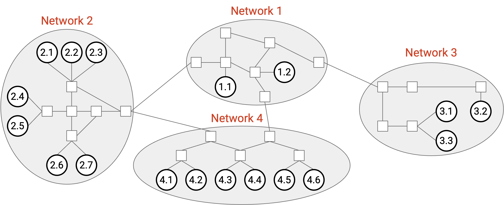

Đây là một hình dung trực quan về việc định địa chỉ. Chúng ta có thể gán một số cho mỗi mạng. Sau đó, trong mạng 3, chúng ta có thể gán các số máy chủ 3.1, 3.2, 3.3, v.v., và tương tự cho các máy chủ trong các mạng khác.

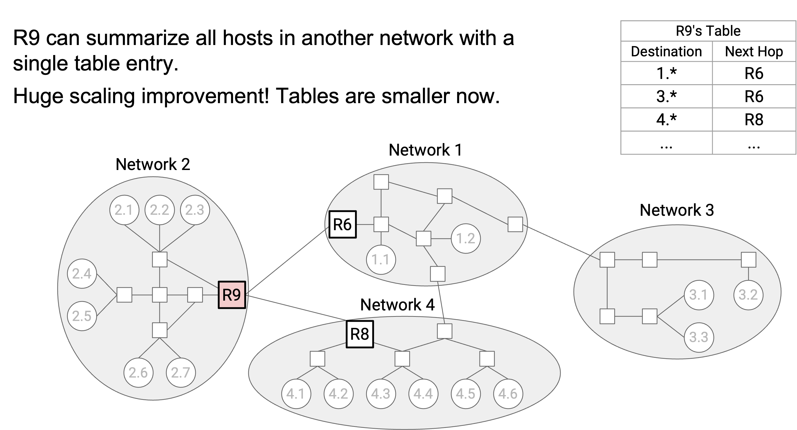

Bây giờ, hãy xem xét *forwarding table* trong *router* R9. Trước đây, chúng ta sẽ có một mục cho mỗi máy chủ trong mạng 1, và tất cả chúng đều có cùng một chặng kế tiếp là R6. Với *hierarchical addressing* (định địa chỉ phân cấp) của chúng ta, thay vào đó, chúng ta có thể có một mục duy nhất cho toàn bộ mạng cục bộ, nói rằng tất cả các địa chỉ 1.* (trong đó * đại diện cho bất kỳ số nào) có chặng kế tiếp là R6. Chúng ta cũng có thể nói rằng tất cả các địa chỉ 2.* có chặng kế tiếp là R8.

Mô hình phân cấp này, nơi chúng ta sử dụng các ký tự đại diện để tóm tắt các tuyến đường, làm cho *forwarding table* của chúng ta nhỏ hơn.

Ngoài ra, mô hình này cũng làm cho các bảng của chúng ta ổn định hơn.

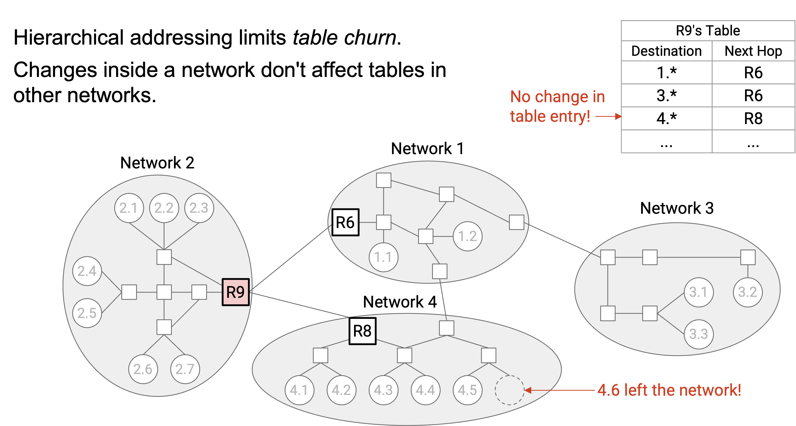

Nếu cấu trúc liên kết bên trong mạng 1 thay đổi, chúng ta không cần cập nhật *forwarding table* của R9 (hoặc bất kỳ bảng nào khác trong các mạng khác). Trên thực tế, những thay đổi trong một mạng cục bộ (ví dụ: máy chủ mới tham gia mạng) xảy ra thường xuyên hơn nhiều so với những thay đổi giữa các mạng (ví dụ: lắp đặt cáp ngầm mới), vì vậy đây là một điều tốt khi các thay đổi cục bộ chỉ ảnh hưởng đến các bảng cục bộ.

Tổng quát hơn, địa chỉ của chúng ta có hai phần: *network ID* (định danh mạng) và *host ID* (định danh máy chủ). Điều này cho phép các giao thức *inter-domain routing* (định tuyến liên miền) tập trung vào *network ID* để tìm các tuyến đường giữa các mạng, và các giao thức *intra-domain routing* (định tuyến nội miền) tập trung vào *host ID* để tìm các tuyến đường bên trong các mạng. Điều này cũng làm cho các giao thức định tuyến của chúng ta ổn định hơn khi mạng thay đổi. Giao thức *inter-domain routing* không quan tâm đến những thay đổi bên trong các mạng, và giao thức *intra-domain routing* không quan tâm đến những thay đổi trong các mạng khác.

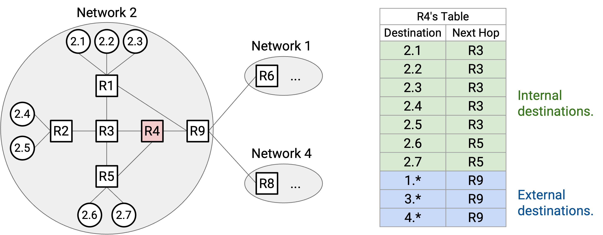

Lưu ý rằng *forwarding table* trong R9 vẫn cần các mục cho từng máy chủ riêng lẻ bên trong mạng của chính nó (tức là mạng 2).

Tương tự, R4, một *router* nội bộ không có kết nối đến các mạng khác, cần cả hai mục cho các máy chủ riêng lẻ bên trong mạng 3 và các mục tổng hợp cho các mạng khác (ví dụ: 2.* có chặng kế tiếp là R9). Quy mô của một *forwarding table* phụ thuộc vào số lượng máy chủ nội bộ trong cùng một mạng, cộng với số lượng các mạng bên ngoài.

## Tuyến đường Mặc định (Default Routes)

Bây giờ chúng ta đã biết rằng các mục của chúng ta có thể đại diện cho toàn bộ dải địa chỉ, thay vì luôn đại diện cho một địa chỉ duy nhất. Chúng ta có thể mở rộng ý tưởng này hơn nữa để cải thiện quy mô.

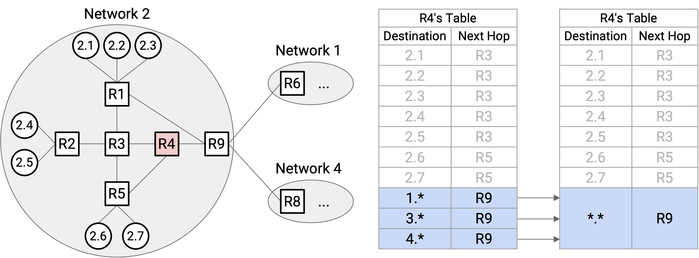

Hãy xem xét R4. Nó có một mục cho mỗi mạng bên ngoài (1.*, 3.*, và 4.*), tất cả đều có cùng một chặng kế tiếp là R9. Chúng ta có thể tổng hợp mọi mạng bên ngoài thành một mục duy nhất. Chúng ta vẫn sẽ có các mục cho mỗi máy chủ nội bộ (2.1, 2.2, v.v.), nhưng cuối cùng, chúng ta sẽ nói: Đối với tất cả các máy chủ khác không có trong *forwarding table*, chặng kế tiếp là R9.

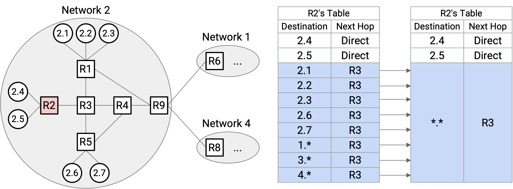

Chúng ta có thể sử dụng sự tổng hợp mạnh mẽ hơn tại R2. Một lần nữa, tất cả các mạng bên ngoài đều có chặng kế tiếp là R3. Nhưng, 2.1, 2.2, 2.3, 2.6, và 2.7 cũng có chặng kế tiếp là R3. Do đó, *forwarding table* chỉ cần các mục tĩnh cho 2.4 và 2.5. Sau đó, chúng ta có thể nói, đối với tất cả các máy chủ khác không có trong *forwarding table* (bao gồm một số máy chủ nội bộ và một số máy chủ bên ngoài), chặng kế tiếp là R3.

Để đại diện cho tất cả các máy chủ không có trong bảng, chúng ta có thể sử dụng ký tự đại diện *.* để khớp với mọi thứ. Khi chuyển tiếp đến một đích nhất định, *router* trước tiên sẽ kiểm tra các máy chủ cụ thể (ví dụ: 3.1) hoặc các dải (ví dụ: 2.*) để tìm kết quả khớp. Nếu *router* không thể tìm thấy bất kỳ kết quả khớp nào, cuối cùng nó sẽ khớp với ký tự đại diện *.*. Đây được gọi là ***default route*** (tuyến đường mặc định).

Hầu hết các máy chủ chỉ có một *default route* được mã hóa cứng duy nhất. Ví dụ, *forwarding table* của máy chủ 2.4 có một mục duy nhất, yêu cầu gửi mọi thứ đến R2. Trên thực tế, máy tính ở nhà của bạn có một mục duy nhất, yêu cầu gửi mọi thứ đến *router* tại nhà của bạn. Đây là lý do tại sao các máy chủ không cần tham gia vào các giao thức định tuyến.

## Gán địa chỉ IP Phân cấp: Thời kỳ đầu của Internet

Để có được định tuyến có khả năng mở rộng tốt hơn, chúng ta cần gán địa chỉ theo một cách phân cấp nào đó. Các địa chỉ cần chứa một số thông tin về vị trí của chúng (ví dụ: các máy chủ gần nhau cần chia sẻ một phần địa chỉ của chúng).

Trong thời kỳ đầu của Internet, địa chỉ *IPv4* có *network ID* 8-bit và *host ID* 24-bit, giống như trong phiên bản trực quan của chúng ta.

Ví dụ, AT&T có *network ID* 12, Apple có *network ID* 17, và Bộ Quốc phòng Hoa Kỳ có 13 *network ID* khác nhau.

*Network ID* 8-bit có nghĩa là chúng ta chỉ có thể gán 256 *network ID* khác nhau, nhưng trong thực tế, có nhiều hơn 256 tổ chức có thể vận hành mạng cục bộ của riêng họ. Ngoài ra, *host ID* 24-bit của chúng ta có nghĩa là mỗi mạng nhận được 2^24 = 16,777,216 địa chỉ. Một mạng nhỏ (ví dụ: một công ty có 10 nhân viên) có lẽ không cần 16 triệu địa chỉ. Khi Internet ngày càng lớn mạnh, một phương pháp định địa chỉ mới đã trở nên cần thiết.

## Gán địa chỉ IP Phân cấp: Định địa chỉ theo lớp (Classful Addressing)

Nỗ lực đầu tiên để khắc phục điều này là ***classful addressing*** (định địa chỉ theo lớp), phương pháp này phân bổ các kích thước mạng khác nhau dựa trên nhu cầu. Trong phương pháp này, có 3 lớp địa chỉ, mỗi lớp có số bit khác nhau được phân bổ cho *network ID* và *host ID*. 1-3 bit đầu tiên xác định lớp nào đang được sử dụng.

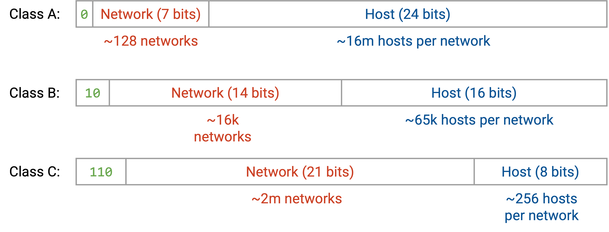

Địa chỉ Lớp A (Class A) bắt đầu bằng bit 0. 7 bit tiếp theo là *network ID* (128 mạng), và 24 bit tiếp theo là *host ID* (16 triệu máy chủ).

Địa chỉ Lớp B (Class B) bắt đầu bằng các bit 10. 14 bit tiếp theo là *network ID* (16,000 mạng), và 16 bit tiếp theo là *host ID* (65,000 máy chủ).

Địa chỉ Lớp C (Class C) bắt đầu bằng các bit 110. 21 bit tiếp theo là *network ID* (2 triệu mạng), và 8 bit tiếp theo là *host ID* (256 máy chủ).

Trong phương pháp này, chúng ta giờ đây có thể có 2 triệu + 16,000 + 128 mạng cục bộ khác nhau. Các tổ chức lớn hơn với nhiều máy chủ hơn có thể nhận được một mạng Lớp A, và các tổ chức nhỏ hơn có thể nhận được một mạng Lớp B hoặc Lớp C. Như trước đây, trong một mạng duy nhất, (các) bit lớp đứng đầu và các bit *network ID* là giống nhau, và mỗi máy chủ nhận được một *host ID* khác nhau.

Một vấn đề lớn với *classful addressing* là kích thước của mỗi lớp. Lớp A (16 triệu máy chủ) quá lớn đối với hầu hết các tổ chức, và Lớp C (256 máy chủ) quá nhỏ đối với hầu hết các tổ chức. Do đó, hầu hết các mạng cần phải thuộc Lớp B.

Thật không may, chỉ có 16,000 *network ID* Lớp B, và đến năm 1994, chúng ta đã cạn kiệt các mạng Lớp B. Một lần nữa, một phương pháp định địa chỉ mới đã trở nên cần thiết.

Lưu ý: *Classful addressing* hiện đã lỗi thời trên Internet hiện đại.

Lưu ý: Về mặt kỹ thuật, số lượng máy chủ trên mỗi mạng bị trừ đi 2, vì địa chỉ toàn số không và địa chỉ toàn số một được dành riêng cho các mục đích đặc biệt. Ví dụ, trong Lớp C, thực sự có 254 máy chủ trên mỗi mạng, không phải 256.

## Gán địa chỉ IP Phân cấp: CIDR

Phương pháp thứ ba của chúng ta để định địa chỉ phân cấp, và là phương pháp vẫn được sử dụng trên Internet hiện đại, là ***CIDR*** (Classless Inter-Domain Routing - Định tuyến liên miền không lớp). Trong *CIDR*, chúng ta vẫn có các *network ID* có độ dài thay đổi, nhưng thay vì chỉ có 3 độ dài *network ID* khác nhau (Lớp A, B, C), chúng ta làm cho số lượng bit cố định trở nên tùy ý.

Ví dụ, hãy xem xét công ty nhỏ với 10 nhân viên từ trước. Trong *classful addressing*, họ sẽ nhận được một mạng Lớp C với 256 địa chỉ máy chủ. Nếu họ chỉ cần 10 địa chỉ máy chủ, chúng ta có thể phân bổ ít địa chỉ hơn bằng cách cho họ một *network ID* dài hơn.

Nếu chúng ta phân bổ một *network ID* 28-bit, *host ID* sẽ dài 4 bit (16 địa chỉ khả dụng). Nếu chúng ta phân bổ một *network ID* 29-bit, *host ID* sẽ dài 3 bit (8 địa chỉ khả dụng). Chúng ta không thể phân bổ chính xác 10 địa chỉ, nhưng một *network ID* 28-bit sẽ đủ cho mục đích của công ty này. Có một chút lãng phí (6 địa chỉ không sử dụng), nhưng điều này vẫn tốt hơn nhiều so với việc phân bổ 256 địa chỉ.

Một ví dụ khác, hãy xem xét một tổ chức cần 450 địa chỉ máy chủ. Trong *classful addressing*, Lớp C (256 địa chỉ) không đủ, vì vậy họ sẽ nhận được một mạng Lớp B với 65,000 địa chỉ máy chủ, và hầu hết các địa chỉ sẽ không được sử dụng. Với các *network ID* có độ dài tùy ý, chúng ta có thể gán một *network ID* 23-bit, điều này cho phép 9 bit để định địa chỉ máy chủ (512 địa chỉ). Điều này đáp ứng nhu cầu của tổ chức và lãng phí ít địa chỉ hơn rất nhiều.

## Gán Phân cấp Đa tầng (Multi-Layered Hierarchical Assignment)

Trong thực tế, hệ thống phân cấp có thể có nhiều tầng. Ví dụ, bên trong một mạng, một tổ chức có thể chọn gán các dải địa chỉ cụ thể cho các tổ chức con cụ thể (ví dụ: các phòng ban trong một công ty hoặc trường đại học).

Trên thực tế, chúng ta khai thác các hệ thống phân cấp về tổ chức và địa lý đa tầng trong đời thực để gán địa chỉ. *ICANN* (Internet Corporation for Names and Numbers - Tập đoàn Internet quản lý tên miền và số hiệu) là tổ chức toàn cầu sở hữu tất cả các địa chỉ IP.

*ICANN* cấp các khối địa chỉ cho *Regional Internet Registries (RIRs)* (Các cơ quan đăng ký Internet khu vực) đại diện cho các quốc gia hoặc châu lục cụ thể. Ví dụ, RIPE nhận tất cả các địa chỉ cho Liên minh Châu Âu, ARIN nhận địa chỉ Bắc Mỹ, APNIC nhận địa chỉ Châu Á/Thái Bình Dương, LACNIC nhận địa chỉ Nam Mỹ, và AFRINIC nhận địa chỉ Châu Phi. Ví dụ: *ICANN* cấp cho ARIN tất cả các địa chỉ bắt đầu bằng 1101.

Mỗi *RIR* sau đó cấp các phần trong dải của họ cho các tổ chức lớn (ví dụ: công ty, trường đại học) hoặc *ISPs* (Internet Service Providers - Nhà cung cấp dịch vụ Internet). Các tổ chức hoặc *ISP* này được gọi là *Local Internet Registries* (Các cơ quan đăng ký Internet địa phương). Ví dụ: ARIN kiểm soát tất cả các địa chỉ bắt đầu bằng 1101, và cấp cho AT&T tất cả các địa chỉ bắt đầu bằng 1101 11001.

Cuối cùng, mỗi cơ quan đăng ký Internet địa phương gán các IP riêng lẻ cho các máy chủ cụ thể. Để có thêm hệ thống phân cấp, các cơ quan đăng ký địa phương cũng có thể gán các dải IP cho các tổ chức nhỏ, và các tổ chức nhỏ này đến lượt mình có thể gán các IP riêng lẻ.

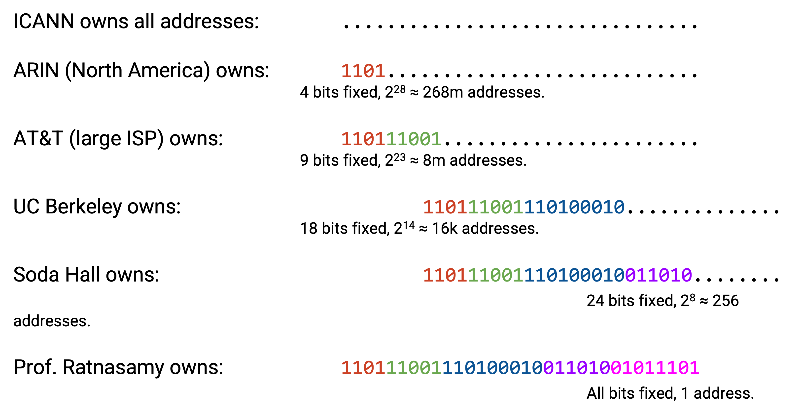

Ở mỗi cấp, số lượng bit cố định bổ sung được xác định bởi số lượng địa chỉ cần được phân bổ. Ví dụ, ARIN có thể muốn cấp cho AT&T 8 triệu địa chỉ, và tính toán rằng việc cố định 9 bit sẽ cho ra 8 triệu địa chỉ máy chủ. ARIN đã có 4 bit được cố định sẵn, vì vậy nó cố định thêm 5 bit nữa và gán cho AT&T tất cả các địa chỉ bắt đầu bằng 9 bit đó. AT&T sau đó có thể cấp tiền tố 1101 11001 110100010 để cung cấp 16,000 địa chỉ cho UC Berkeley. Khi chúng ta phân bổ địa chỉ cho các tổ chức con, nhiều bit hơn được cố định, luôn giữ lại các bit cố định từ các tổ chức mẹ.

## Viết địa chỉ IP (Writing IP Addresses)

Chúng ta có thể viết địa chỉ IP dưới dạng một chuỗi 32-bit gồm các số 1 và 0, hoặc dưới dạng một số nguyên lớn duy nhất. Trên thực tế, để dễ đọc, chúng ta lấy mỗi chuỗi 8 bit và viết nó dưới dạng một số nguyên (từ 0 đến 255). Ví dụ, địa chỉ IP 00010001 00100010 10011110 00000101 có thể được viết là 17.34.158.5. Đôi khi, đây được gọi là biểu diễn *dotted quad* (bộ bốn dấu chấm).

Cho đến nay, chúng ta đã viết các dải địa chỉ dưới dạng bit (ví dụ: tất cả các IP bắt đầu bằng 1101). Để viết một dải địa chỉ, chúng ta có thể sử dụng *slash notation* (ký hiệu gạch chéo). Chúng ta viết tiền tố cố định, sau đó chúng ta viết các số 0 cho tất cả các bit không cố định còn lại, và chúng ta chuyển đổi giá trị 32-bit kết quả thành một địa chỉ IP dạng *dotted quad*. Sau đó, sau dấu gạch chéo, chúng ta viết số lượng bit cố định.

Ví dụ, nếu tiền tố là 11000000, chúng ta thêm các số không cho tất cả các bit không cố định để có được 11000000 00000000 00000000 00000000. Dưới dạng địa chỉ 32-bit, đây là 192.0.0.0. Sau đó, vì có 8 bit được cố định, chúng ta viết dải địa chỉ là 192.0.0.0/8.

Để viết một địa chỉ riêng lẻ dưới dạng một dải, chúng ta có thể viết một cái gì đó như 192.168.1.1/32, điều này chỉ ra rằng tất cả 32 bit đều được cố định. Ngoài ra, *default route* *.* có thể được viết là 0.0.0.0/0.

*Slash notation* đôi khi có thể trông hơi khó hiểu vì chúng ta đang sử dụng các phép chia 8-bit tùy ý và viết các số ở dạng thập phân. Ví dụ, tiền tố 8-bit 11000000 và tiền tố 12-bit 11000000 0000 sẽ được viết là 192.0.0.0/8 và 192.0.0.0/12 (cùng một địa chỉ IP đại diện cho các dải khác nhau). Một ví dụ khác, nếu tôi sở hữu tiền tố 4-bit 1100, tôi có thể gán tiền tố 5-bit 11001. Dưới dạng dải, chúng được viết là 192.0.0.0/4 và 200.0.0.0/5. Thoạt nhìn, không rõ ràng rằng dải thứ hai thực sự là một tập hợp con của dải thứ nhất, và chúng ta sẽ phải viết ra các bit để xác nhận.

Một phương án thay thế cho dấu gạch chéo (ví dụ: /16) trong *slash notation* là *netmask* (mặt nạ mạng). Giống như con số sau dấu gạch chéo, *netmask* cho chúng ta biết những bit nào được cố định. Để viết một *netmask*, chúng ta viết các số 1 cho tất cả các bit cố định và số 0 cho tất cả các bit không cố định, và chuyển đổi kết quả thành dạng *dotted quad*. Ví dụ, nếu chúng ta có dải 192.168.1.0/29, chúng ta có thể viết 29 số một (bit cố định) và 3 số không (bit không cố định). 11111111 11111111 11111111 11111000 dưới dạng *dotted quad* là 255.255.255.248. Dải địa chỉ trong ký hiệu *netmask* là 192.168.1.0, với *netmask* 255.255.255.248 (thay thế dấu gạch chéo bằng một *netmask*).

Trong các ghi chú này, chúng ta sẽ thường sử dụng *slash notation* vì chúng tiện lợi hơn để đọc. Trên thực tế, *netmask* có thể hữu ích vì với một địa chỉ IP cụ thể, nếu bạn thực hiện phép toán AND bit giữa địa chỉ IP và *netmask*, tất cả các bit của máy chủ sẽ bị xóa về không, và chỉ còn lại các bit của mạng.

## Tổng hợp các tuyến đường với CIDR (Aggregating Routes with CIDR)

Trong mô hình ban đầu của chúng ta với *network ID* và *host ID*, chúng ta có thể tổng hợp tất cả các máy chủ trong cùng một mạng thành một tuyến đường duy nhất trong *forwarding table* (ví dụ: 2.* cho mọi thứ trong mạng 2).

*Hierarchical addressing* đa tầng có nghĩa là chúng ta cũng có thể tổng hợp nhiều mạng thành một tuyến đường duy nhất.

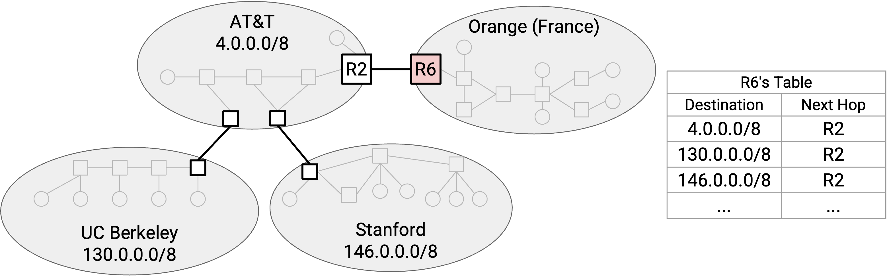

Hãy xem xét sơ đồ mạng này. Trong mô hình ban đầu của chúng ta, R6 cần một mục chuyển tiếp riêng cho AT&T, UCB, và Stanford.

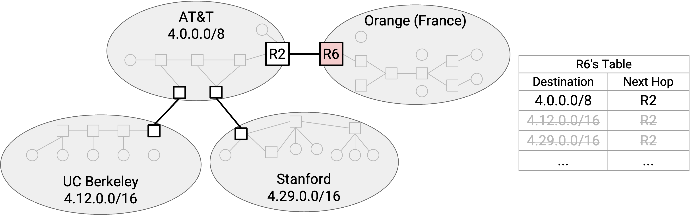

Tuy nhiên, nếu chúng ta sử dụng *hierarchical addressing*, thì dải của UCB (4.12.0.0/16) và dải của Stanford (4.29.0.0/16) đều là tập hợp con của dải của AT&T (4.0.0.0/8). Điều này có thể xảy ra nếu AT&T phân bổ các dải đó cho các khách hàng cấp dưới của mình là UCB và Stanford.

Bây giờ, R6 chỉ cần một mục duy nhất cho AT&T, UCB, và Stanford. Chúng ta đã tổng hợp hai dải nhỏ hơn thành dải rộng hơn mà cả hai đều thuộc về.

## Đa kết nối (Multi-Homing)

Việc tổng hợp các dải không phải lúc nào cũng hoạt động. Giả sử chúng ta thêm một liên kết từ R6 trực tiếp đến Stanford.

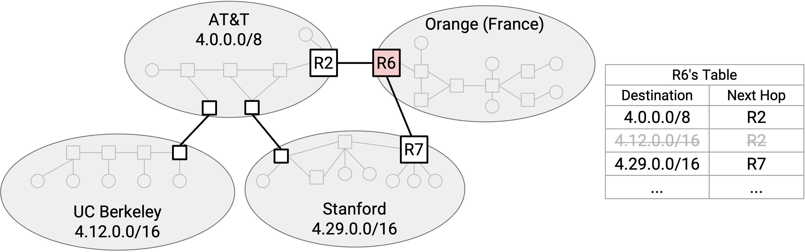

Tuyến đường tổng hợp của chúng ta nói rằng tất cả các gói tin đến AT&T (và các cấp dưới của nó) có chặng kế tiếp là R2. Chúng ta cần thêm một mục bổ sung nói rằng Stanford có chặng kế tiếp là R7.

Lưu ý rằng *forwarding table* của chúng ta bây giờ có các dải chồng chéo lên nhau. Một đích đến có thể khớp với nhiều dải. Để chọn một tuyến đường, chúng ta sẽ chạy ***longest prefix matching*** (khớp tiền tố dài nhất), có nghĩa là chúng ta sẽ sử dụng dải cụ thể nhất khớp với địa chỉ IP đích của chúng ta. Ví dụ, nếu chúng ta có một gói tin đến một máy chủ UCM, chúng ta sẽ sử dụng mục dành riêng cho UCM vì nó có tiền tố 19-bit dài hơn. Mặc dù mục AT&T 9-bit cũng khớp với đích, tiền tố của nó ngắn hơn, vì vậy chúng ta không sử dụng tuyến đường này.

Nếu thay vào đó chúng ta có một gói tin đến một máy chủ UCB, chúng ta không thể sử dụng mục dành riêng cho Stanford, vì tiền tố 16-bit sẽ không khớp với máy chủ UCB. Nhưng chúng ta vẫn có thể sử dụng mục AT&T 8-bit, nó sẽ khớp với đích.

## Lịch sử tóm tắt của IPv6 (Brief History of IPv6)

Địa chỉ *IPv4* dài 32 bit, có nghĩa là chúng ta có khoảng 4 tỷ địa chỉ khả dụng. Điều này có đủ không?

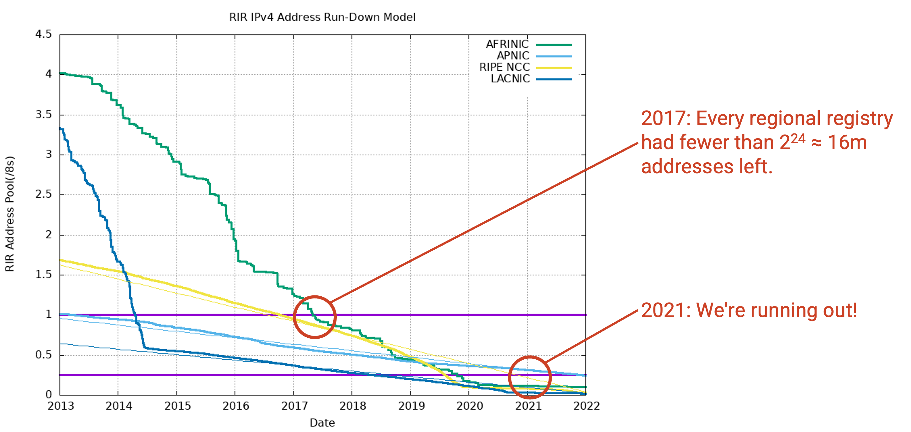

Biểu đồ này thể hiện số lượng địa chỉ IP chưa được phân bổ còn lại (trục y) cho mỗi cơ quan đăng ký khu vực theo thời gian.

Đến năm 2017, tất cả mọi người đều có ít hơn một khối /8 (tức là ít hơn 2^24 = 16 triệu địa chỉ) khả dụng. Mỗi cơ quan đăng ký khu vực giữ lại một khối địa chỉ /8 dự phòng phòng trường hợp cần thiết, nhưng đến năm 2017, tất cả mọi người đã phải bắt đầu sử dụng nguồn cung cấp địa chỉ dự phòng của mình. Đến năm 2021, ngay cả nguồn cung cấp địa chỉ dự phòng cũng sắp cạn kiệt.

Một sự thật thú vị: Vào tháng 2 năm 2011, đã có một buổi lễ trực tiếp khi khối /8 cuối cùng được phân bổ. Thậm chí còn có một giấy chứng nhận đặc biệt được cấp.

Khi Internet phát triển, chúng ta bắt đầu nhận ra rằng cuối cùng chúng ta sẽ hết địa chỉ. May mắn thay, điều này đã được nhận ra từ sớm, và *IPv6* đã được phát triển vào năm 1998 như một giải pháp cho sự cạn kiệt địa chỉ IP.

Về cơ bản, cấu trúc định địa chỉ *IPv6* giống như *IPv4*. Có một số thay đổi nhỏ về triển khai cần thiết cho *IPv6*, mặc dù chúng không liên quan ở đây.

Tính năng mới chính trong *IPv6* là địa chỉ dài hơn. Địa chỉ *IPv6* dài 128 bit, có nghĩa là có khoảng $$3.4 \times 10^{38}$$ địa chỉ khả dụng. Đây là một con số khổng lồ về mặt thiên văn học, vì vậy chúng ta sẽ không bao giờ cạn kiệt. Vũ trụ đã tồn tại $$10^{21}$$ giây, vì vậy chúng ta có thể gán một địa chỉ cho mỗi giây và vẫn chỉ sử dụng 0.000000000000001% tổng số địa chỉ khả dụng.

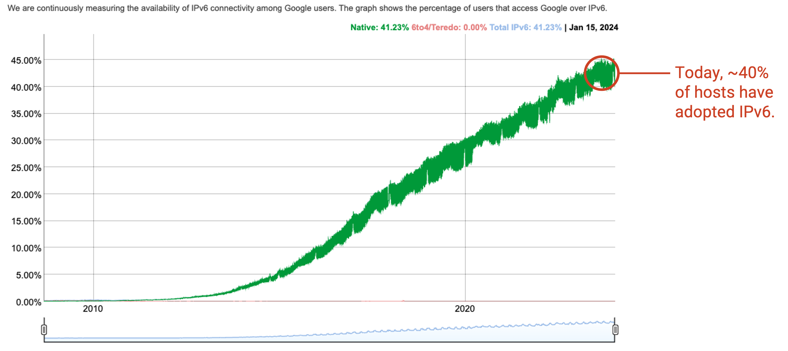

*IPv6* được phát triển vào những năm 1990, nhưng không được tất cả các máy tính chấp nhận ngay lập tức. Ngay cả trong năm 2010, về cơ bản không ai sử dụng *IPv6*. Kể từ năm 2024, *IPv6* được sử dụng bởi khoảng 45% người dùng cuối, và hầu hết những người dùng này đều ở các quốc gia phát triển với việc áp dụng Internet rộng rãi hơn. Lý do chính tại sao *IPv6* đang được áp dụng rộng rãi hơn là vì chúng ta đang cạn kiệt địa chỉ *IPv4*.

Tại sao việc áp dụng *IPv6* lại chậm như vậy? Người dùng, máy chủ, và các nhà khai thác Internet phải nâng cấp phần mềm và phần cứng của họ (ví dụ: *router*, liên kết, trình điều khiển thiết bị trên máy tính) để hỗ trợ *IPv6*. Các *router* giờ đây cần hai *forwarding table*, một với địa chỉ *IPv4* và một với địa chỉ *IPv6*.

Việc nâng cấp *IPv6* phải tương thích ngược. Nếu một máy chủ chỉ có địa chỉ *IPv6*, người dùng trên các máy tính cũ chỉ hỗ trợ *IPv4* không thể sử dụng máy chủ này. *IPv4* và *IPv6* về cơ bản là các hệ thống định địa chỉ riêng biệt, và không có cách nào để chuyển đổi giữa địa chỉ *IPv4* và *IPv6*. Kể từ năm 2024, nhiều máy tính vẫn không hỗ trợ *IPv6*, vì vậy nhiều dịch vụ cần phải hỗ trợ cả *IPv4* và *IPv6*.

Các máy tính hỗ trợ cả *IPv4* và *IPv6* cũng phải suy nghĩ về việc nên sử dụng cái nào. Liệu cái này có tốt hơn cái kia không? Trên thực tế, *IPv6* nhanh hơn, nhưng nhiều chi tiết triển khai khác có thể ảnh hưởng đến sự lựa chọn của bạn.

## Ký hiệu địa chỉ IPv6 (IPv6 Address Notation)

Địa chỉ *IPv6* thường được viết dưới dạng thập lục phân thay vì thập phân. Ví dụ:

2001:0D08:CAFE:BEEF:DEAD:1234:5678:9012

là một địa chỉ *IPv6* (32 chữ số thập lục phân = 128 bit). Chúng ta thêm dấu hai chấm vào giữa mỗi 4 chữ số thập lục phân (16 bit) để dễ đọc.

Để dễ đọc, chúng ta có thể bỏ qua các số không đứng đầu trong một khối 4 chữ số. Ví dụ:

2001:0DB8:0000:0000:0000:0000:0000:0001

có thể được rút ngắn thành 2001:DB8:0:0:0:0:0:1.

Để dễ đọc, chúng ta cũng có thể bỏ qua một chuỗi dài các số không, ví dụ: 2001:DB8::1. Dấu hai chấm kép cho biết hãy điền tất cả các khối 4 chữ số còn thiếu bằng 0000. Điều này chỉ có thể được thực hiện một lần cho mỗi địa chỉ. (Việc bỏ qua hai dải sẽ tạo ra sự mơ hồ, vì chúng ta không biết có bao nhiêu số không trong mỗi dải.)

*Slash notation* vẫn có thể được sử dụng trong *IPv6*. Một địa chỉ riêng lẻ có /128 (tất cả các bit đều cố định). Một tiền tố 32-bit có thể trông giống như 2001:0DB8::/32.

Bởi vì không gian địa chỉ rất lớn, trong *IPv6*, bạn có thể cố định *network ID* là 64 bit và *host ID* là 64 bit, và vẫn không bao giờ hết *network ID* hoặc *host ID*. Trên thực tế, có các giao thức đặc biệt tồn tại nơi các mạng và máy chủ có thể tự chọn *network ID* 64-bit và *host ID* 64-bit của riêng mình (và kiểm tra xem không có ai khác đang sử dụng nó), mà không cần một tổ chức phải phân bổ các ID cụ thể.

Trên thực tế, các cơ quan đăng ký khu vực thường phân bổ các tiền tố 32-bit cho các *ISP*, và các *ISP* thường phân bổ các tiền tố 48-bit cho các tổ chức. Tổ chức sau đó có thể phân bổ các tiền tố 64-bit cho các mạng con nhỏ hơn. Trong *IPv6*, chúng ta thường không thấy các tiền tố dài hơn /64. Ngay cả các mạng con nhỏ nhất bên trong một tổ chức cũng có một tiền tố 64-bit, và 64 bit để định địa chỉ cho các máy chủ cụ thể. Việc sử dụng các kích thước tiền tố được tiêu chuẩn hóa này cho phép các tiền tố cung cấp nhiều thông tin hơn. Ví dụ, trong *IPv4*, không rõ ràng một tiền tố /19 đại diện cho cái gì, nhưng trong *IPv6*, chúng ta biết một tiền tố /32 thường đại diện cho một *ISP*.
