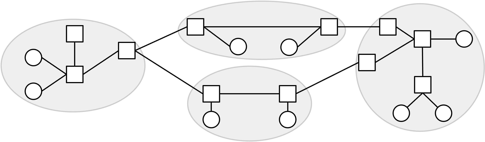

# Giới thiệu về Định tuyến (Routing)

## Định tuyến (Routing) là gì?

Giả sử máy A và máy B đều được kết nối với Internet. Máy A muốn gửi một thông điệp đến máy B, nhưng hai máy này không được kết nối trực tiếp với nhau. Vậy làm thế nào để máy A biết phải gửi thông điệp đến đâu để thông điệp đó cuối cùng sẽ đến được máy B? Thông điệp sẽ đi theo con đường nào trong mạng để đến được đích là máy B? Trong chương này, chúng ta sẽ nghiên cứu về **routing** (*định tuyến*) để trả lời những câu hỏi này.

Trước tiên, chúng ta sẽ xây dựng một mô hình của Internet để có thể đặt bài toán định tuyến một cách rõ ràng. Chúng ta cũng sẽ xem xét các câu trả lời cho bài toán định tuyến trông như thế nào, và điều gì khiến một câu trả lời trở nên hợp lệ và tốt.

Tiếp theo, chúng ta sẽ tìm hiểu một số loại giao thức định tuyến khác nhau có thể được triển khai để tạo ra lời giải cho bài toán định tuyến. Chúng ta cũng sẽ xem cách các giao thức định địa chỉ có thể được sử dụng để giúp giao thức định tuyến mở rộng quy mô ra toàn bộ Internet.

Cuối cùng, chúng ta sẽ điểm qua một số phần cứng thực tế được sử dụng để triển khai các giao thức định tuyến này.

## Định tuyến Liên miền và Nội miền

Một chiến lược khả thi cho việc định tuyến là xây dựng một mô hình Internet bao gồm mọi máy tính trên thế giới, và thiết kế một giao thức định tuyến khổng lồ duy nhất cho phép chúng ta gửi các gói tin (*packet*) đến bất kỳ đâu trên thế giới. Tuy nhiên, điều này không khả thi trong thực tế do quy mô quá lớn của Internet.

Thay vào đó, chúng ta sẽ tận dụng thực tế rằng Internet là một mạng của các mạng (*network of networks*). Nói cách khác, Internet bao gồm nhiều mạng cục bộ. Mỗi mạng cục bộ triển khai giao thức định tuyến riêng của mình, quy định cách gửi các gói tin trong phạm vi mạng cục bộ đó. Sau đó, chúng ta có thể kết nối tất cả các mạng cục bộ này lại với nhau và triển khai một giao thức định tuyến trên toàn bộ các mạng cục bộ, quy định cách gửi các gói tin giữa các mạng cục bộ khác nhau.

Các mạng cục bộ không giống nhau. Ví dụ, chúng có thể khác nhau về kích thước: Một số mạng có thể có nhiều máy hơn các mạng khác. Hoặc, các máy có thể được phân bố trên một khu vực địa lý rộng hơn (ví dụ: toàn bộ khuôn viên Đại học UC Berkeley), hoặc một khu vực nhỏ hơn (ví dụ: nhà bạn). Các mạng cũng có thể khác nhau về băng thông (*bandwidth*) cần hỗ trợ, tỷ lệ lỗi cho phép, số lượng nhân viên kỹ thuật hỗ trợ, độ tuổi của hạ tầng, ngân sách xây dựng và vận hành, v.v.

Vì mỗi mạng có cấu trúc và yêu cầu riêng, các mạng cục bộ khác nhau có thể lựa chọn sử dụng các giao thức định tuyến khác nhau. Một chiến lược định tuyến có thể hiệu quả trên một mạng, nhưng không hiệu quả trên mạng khác.

Với mô hình mạng của các mạng, chúng ta có thể để từng mạng cục bộ lựa chọn chiến lược định tuyến phù hợp cho các gói tin trong mạng của họ. Mỗi nhà vận hành có thể chọn giao thức phù hợp nhất với họ. Các giao thức định tuyến gói tin trong một mạng cục bộ được gọi là **intra-domain** routing protocols (*giao thức định tuyến nội miền*), hay **interior gateway protocols (IGPs)** (*giao thức cổng nội bộ*). Các ví dụ thực tế bao gồm OSPF (*Open Shortest Path First – Tìm đường ngắn nhất mở*) và IS-IS (*Intermediate System to Intermediate System – Hệ thống trung gian đến hệ thống trung gian*).

Ngược lại, các giao thức định tuyến gói tin giữa các mạng khác nhau được gọi là **inter-domain** routing protocols (*giao thức định tuyến liên miền*), hay **exterior gateway protocols (EGPs)** (*giao thức cổng bên ngoài*). Để hỗ trợ việc gửi gói tin giữa các mạng cục bộ khác nhau, mọi mạng cần đồng thuận sử dụng cùng một giao thức để định tuyến gói tin giữa nhau. Nếu các mạng khác nhau sử dụng các giao thức liên miền khác nhau, thì không có gì đảm bảo rằng toàn bộ Internet có thể được kết nối một cách nhất quán. Giả sử một nhà vận hành chỉ triển khai giao thức X, còn nhà vận hành khác chỉ triển khai giao thức Y? Không rõ hai mạng cục bộ này sẽ trao đổi thông điệp như thế nào.

Vì mọi mạng phải đồng thuận sử dụng cùng một giao thức liên miền, nên chỉ có một giao thức được triển khai ở quy mô toàn Internet, đó là BGP (*Border Gateway Protocol – Giao thức cổng biên*).

Mô hình phân chia giữa giao thức cổng nội bộ và cổng bên ngoài này rất thuận tiện để hình dung, nhưng trong thực tế, không phải lúc nào cũng có sự phân biệt rõ ràng giữa chúng. Ví dụ, BGP đôi khi cũng được sử dụng bên trong một mạng cục bộ, ngoài việc sử dụng giữa các mạng khác nhau.

Bất kể giao thức được triển khai nội bộ trong một mạng hay bên ngoài giữa các mạng, chúng ta cũng có thể phân loại giao thức định tuyến bằng cách xem xét thuật toán cơ bản mà nó sử dụng. Cụ thể, chúng ta sẽ nghiên cứu các giao thức kiểu vector khoảng cách (*distance-vector*), trạng thái liên kết (*link-state*), và vector đường đi (*path-vector*) (sẽ tìm hiểu chi tiết từng loại sau).
