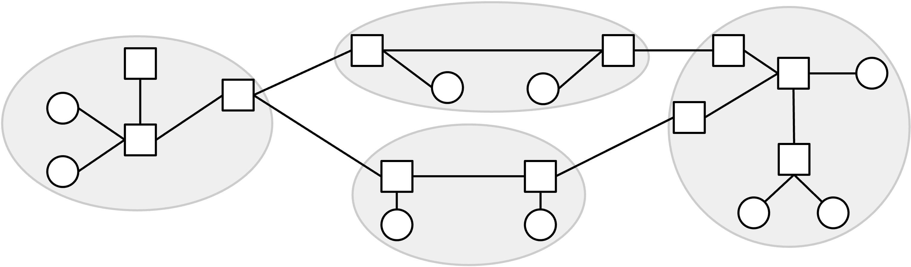
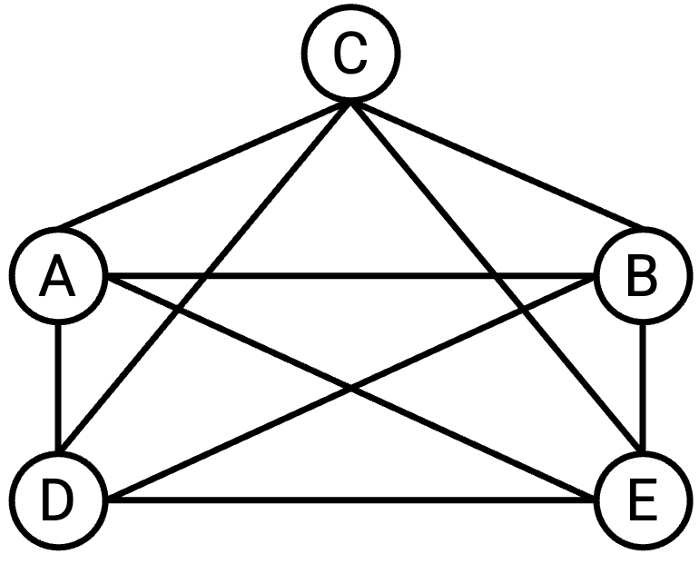
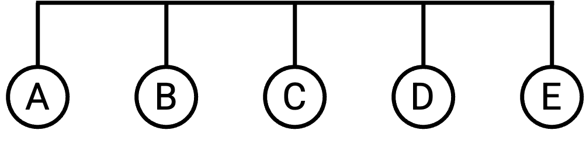
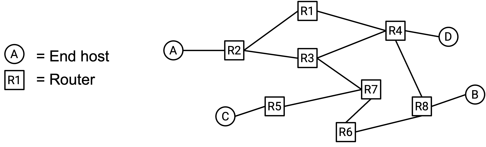
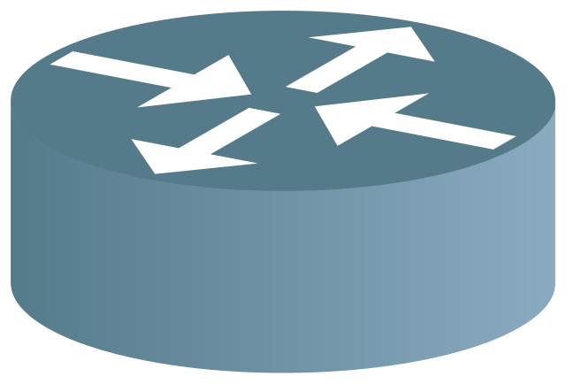
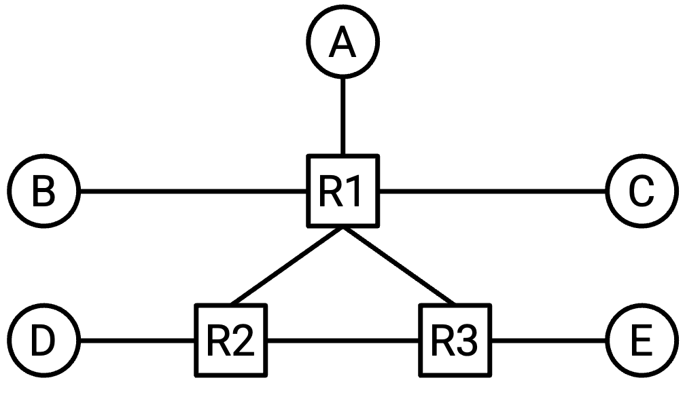
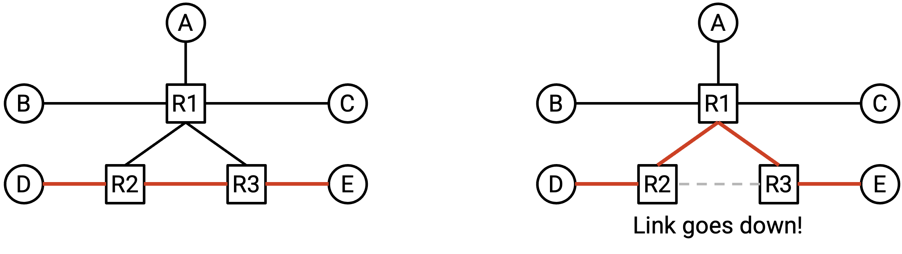
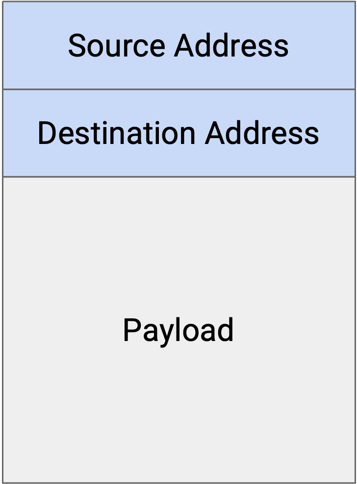
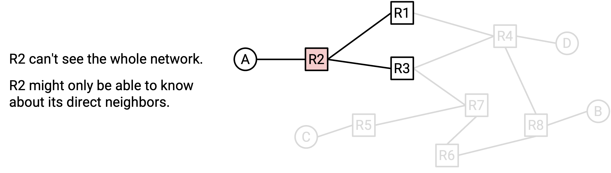

# Mô hình Định tuyến Nội miền (Intra-Domain Routing)

## Mô hình hóa Mạng dưới dạng Đồ thị

Hãy cùng xây dựng một mô hình đơn giản hóa của Internet để giúp chúng ta định nghĩa bài toán định tuyến một cách chính xác.

Nhớ lại từ chương trước rằng chúng ta có thể hình dung Internet như một tập hợp các máy tính, được kết nối với nhau thông qua một tập hợp các liên kết (*link*), trong đó mỗi liên kết kết nối hai máy tính trong mạng.

Chúng ta có thể biểu diễn cấu trúc mạng dưới dạng một đồ thị, trong đó mỗi nút (*node*) đại diện cho một máy tính, và mỗi cạnh (*edge*) giữa hai nút đại diện cho một liên kết giữa hai máy tính.

Trong lịch sử, đôi khi các liên kết có thể kết nối nhiều hơn hai máy tính, nhưng trong các mạng hiện đại, liên kết gần như luôn kết nối chính xác hai máy tính.

## Cấu trúc Mạng Full Mesh

Giả sử chúng ta có hai máy tính, A và B. Nếu hai máy này muốn trao đổi thông điệp, chúng ta có thể thêm một liên kết giữa chúng.

Nhưng nếu chúng ta có năm máy tính thay vì hai thì sao? Một cách tiếp cận khả thi là tạo liên kết giữa mọi cặp máy tính, sao cho mỗi máy được kết nối với tất cả các máy còn lại. Cấu trúc này đôi khi được gọi là **full mesh topology** (*cấu trúc mạng lưới đầy đủ*).

Vậy những hạn chế của cách tiếp cận này là gì?

Cách tiếp cận này không mở rộng tốt. Nếu chúng ta cố gắng mở rộng nó ra quy mô của Internet hiện đại, chúng ta sẽ cần một dây kết nối giữa mọi cặp máy tính trên thế giới. Khi một máy tính mới tham gia mạng, chúng ta sẽ phải tạo các liên kết mới giữa máy đó và mọi máy tính khác trên thế giới.

Mặc dù không thể mở rộng ra toàn bộ Internet, nhưng cấu trúc full mesh vẫn có một số lợi ích trong các môi trường nhỏ hơn. Cụ thể, việc có liên kết giữa mọi cặp máy tính mang lại rất nhiều **bandwidth** (*băng thông*) cho mạng. Mỗi máy có một liên kết riêng đến tất cả các máy khác, và mỗi cặp máy có thể sử dụng toàn bộ băng thông trên liên kết riêng của họ.

Nói chung, không có gì đảm bảo rằng mỗi máy có liên kết trực tiếp đến tất cả các máy khác. Nói cách khác, không có gì đảm bảo rằng đồ thị cơ bản là đồ thị liên thông hoàn toàn.

## Cấu trúc Mạng Một Liên kết

Ngoài cấu trúc full mesh, còn có những cách khác để triển khai liên kết nhằm kết nối nhiều máy tính. Ví dụ, chúng ta có thể sử dụng một liên kết duy nhất để kết nối cả năm máy tính:

(Tại đây, chúng ta tạm thời phá vỡ giả định rằng một liên kết chỉ kết nối hai máy tính, bằng cách xem xét một liên kết kết nối nhiều hơn hai máy.)

Cách tiếp cận này mở rộng tốt hơn so với cấu trúc full mesh. Ví dụ, nếu một máy tính mới tham gia mạng, thay vì tạo năm liên kết mới giữa máy tính mới và năm máy tính hiện có, chúng ta chỉ cần mở rộng dây hiện có đến máy tính mới.

Tuy nhiên, cách tiếp cận này bị giới hạn hơn về lượng băng thông có sẵn cho các máy. Cụ thể, chỉ có một liên kết duy nhất, và cả năm máy phải chia sẻ băng thông trên liên kết này.

Để tạo ra các cấu trúc mạng phức tạp hơn, chúng ta cần giới thiệu khái niệm **router** (*bộ định tuyến*).

## Router và Host

Trong mô hình đơn giản hóa của chúng ta, mỗi máy tính sẽ được phân loại thành một trong hai loại.

**End hosts** (*máy chủ đầu cuối*) là các máy tính kết nối với Internet để gửi và nhận dữ liệu. Ví dụ về end host bao gồm các ứng dụng trên máy tính cá nhân của bạn, như trình duyệt web. Các máy chủ web, chẳng hạn như máy chủ của Google nhận truy vấn tìm kiếm và gửi lại kết quả, cũng là end host. Những máy này gửi các gói tin (*packet*) ra ngoài đến các đích khác, và có thể là đích cuối cùng của các gói tin đến. Tuy nhiên, chúng thường không nhận và chuyển tiếp các gói tin trung gian (tức là các gói tin có đích cuối khác).

**Router**, ngược lại, là các máy tính kết nối với Internet có nhiệm vụ nhận và chuyển tiếp các gói tin trung gian đến gần hơn với đích cuối của chúng. Ví dụ, hãy xem xét router được lắp đặt trong mạng gia đình của bạn, hoặc các router trong một trung tâm dữ liệu nào đó. Những máy này thường không tự tạo và gửi các gói tin mới, và thường không phải là đích cuối của các gói tin. Ví dụ, trong quá trình sử dụng Internet hàng ngày, bạn có thể muốn gửi gói tin đến máy chủ web của Google để thực hiện tìm kiếm, nhưng bạn có lẽ không cần gửi thông điệp trực tiếp đến router gia đình hoặc router trong trung tâm dữ liệu. Những router đó sẽ giúp bạn chuyển tiếp gói tin đến Google, nhưng không phải là đích cuối của gói tin.

Tùy thuộc vào thiết kế mạng, router có thể là đích hợp lệ, nhưng trong chương này, chúng ta sẽ bỏ qua việc coi router là đích. Tuy nhiên, cần lưu ý rằng router vẫn có thể là nguồn và gửi các gói tin mới của riêng mình.

Router đôi khi cũng được gọi là **switch** (*bộ chuyển mạch*). Có sự khác biệt lịch sử giữa router và switch, nhưng ngày nay, hai thuật ngữ này thường được sử dụng thay thế cho nhau. Trong tài liệu này, chúng ta sẽ sử dụng "router" khi có thể.

Trong mô hình đồ thị của Internet, router xuất hiện như các nút trung gian thường được kết nối với nhiều nút lân cận. End host xuất hiện như các nút thường được kết nối với một hoặc nhiều router. Trong thực tế, các giả định này không phải lúc nào cũng đúng.

Trong tài liệu này, khi có thể, chúng ta sẽ luôn vẽ router dưới dạng hình vuông và end host dưới dạng hình tròn. Trong thực tế, đôi khi router được biểu diễn bằng các biểu tượng khác. Ví dụ, đây là một biểu tượng router phổ biến được sử dụng trong sơ đồ mạng:

## Cấu trúc Mạng với Router

Giờ đây, khi chúng ta có thêm router bên cạnh các end host, chúng ta có thể tạo ra các cấu trúc mạng phức tạp hơn như sau:

Cấu trúc này cho phép chúng ta kết hợp các lợi ích của cấu trúc full mesh và cấu trúc một liên kết. Cụ thể, cấu trúc này sử dụng ít liên kết hơn so với cấu trúc full mesh trước đó. Đồng thời, nó có nhiều băng thông hơn so với cấu trúc một liên kết.

Cấu trúc này cũng có khả năng chống lỗi tốt hơn. Nếu một liên kết bị hỏng, gói tin có thể đi theo một đường khác trong mạng và vẫn đến được đích.

## End Host trong Định tuyến

Lưu ý rằng end host thường không tham gia vào các giao thức định tuyến, vì chúng không chuyển tiếp các gói tin trung gian. Thay vào đó, end host thường được kết nối với một router duy nhất thông qua một liên kết duy nhất. Theo mặc định, end host sẽ gửi tất cả thông điệp ra ngoài đến router, và router sẽ xác định cách gửi gói tin đến đích cuối. Chiến lược gửi mọi thứ đến router này đôi khi được gọi là **default route** (*định tuyến mặc định*) của end host.

Khi thiết kế các giao thức định tuyến, chúng ta thường bỏ qua end host, ngoại trừ khi chúng là đích đến (vì router cần biết cách đến các đích khác nhau).

## Gói tin (Packet)

Nhớ lại từ chương trước rằng khi một ứng dụng muốn gửi dữ liệu qua Internet, ứng dụng sẽ tạo ra một **packet** (*gói tin*) chứa dữ liệu. Khi gói tin được chuyển xuống các giao thức tầng thấp hơn, các phần tiêu đề (*header*) bổ sung sẽ được bọc quanh gói tin để cung cấp thông tin metadata giúp gói tin đến được đích.

Trong chương định tuyến này, chúng ta sẽ xem xét một mô hình đơn giản hóa, trong đó mỗi gói tin có một phần tiêu đề chứa metadata, và một phần payload chứa dữ liệu ở tầng ứng dụng. Chúng ta sẽ bỏ qua các tiêu đề lồng nhau và nhiều tầng trong thời điểm này.

Các giao thức định tuyến không quan tâm đến dữ liệu ở tầng ứng dụng. Không quan trọng người dùng đang cố gắng gửi một hình ảnh, một trang HTML, hay một tệp âm thanh; từ góc nhìn của **routing** (*định tuyến*), chúng ta chỉ có một chuỗi các số 1 và 0, và cần một giao thức để gửi những bit đó đến đúng đích.

Trong phần tiêu đề (*header*) của gói tin, trường metadata chính mà chúng ta quan tâm là **địa chỉ đích** (*destination address*). Trường này cho biết đích cuối cùng của gói tin. Khi một **router** (*bộ định tuyến*) nhận được gói tin, nó sẽ đọc trường metadata trong tiêu đề để xác định cách gửi gói tin đến gần hơn với đích cuối. Bài toán xác định nơi cần gửi gói tin chính là vấn đề cốt lõi mà chúng ta cần giải quyết trong định tuyến.

## Định địa chỉ (Addressing)

Làm thế nào để chúng ta ghi lại địa chỉ đích của gói tin trong phần tiêu đề? Chúng ta cần một cách để định địa chỉ cho từng máy trong mạng. Nói cách khác, chúng ta cần một giao thức để gán địa chỉ cho mỗi máy trong mạng.

Ở phần sau của chương này, chúng ta sẽ thảo luận về các cách tiếp cận có khả năng mở rộng để định địa chỉ. Còn hiện tại, hãy gán cho mỗi máy một nhãn duy nhất (ví dụ: chúng ta có thể gán nhãn cho ba router là X, Y và Z), và coi các nhãn đó là địa chỉ của từng router. Cách làm này cho phép chúng ta tách biệt bài toán định tuyến và bài toán định địa chỉ.

Tại thời điểm này, chúng ta có thể định nghĩa bài toán định tuyến: Khi một router nhận được một gói tin, làm thế nào để router biết phải chuyển tiếp gói tin đến đâu để nó cuối cùng đến được đích cuối?

## Cấu trúc Mạng Thay đổi

Tại thời điểm này, chúng ta đã định nghĩa được bài toán định tuyến, nhưng vẫn còn một số yếu tố thực tế khiến bài toán này trở nên phức tạp.

Nếu Internet có thể được vẽ dưới dạng một đồ thị cố định, không thay đổi, thì có lẽ chúng ta có thể giải bài toán định tuyến bằng cách đơn giản là nhìn vào đồ thị và tính toán các đường đi trong đó.

Tuy nhiên, cấu trúc mạng liên tục thay đổi. Ví dụ, các liên kết có thể bị hỏng vào những thời điểm không thể dự đoán. Khi đó, gói tin phải được gửi theo một tuyến đường khác để đến được đích.

Các liên kết mới cũng có thể được thêm vào, tạo ra các đường đi bổ sung có thể được xem xét trong quá trình định tuyến.

Do đó, các giao thức định tuyến mà chúng ta thiết kế cần phải có khả năng chống chịu với sự thay đổi của cấu trúc mạng.

## Giao thức Định tuyến là Giao thức Phân tán

Nếu mạng thay đổi, có lẽ chúng ta có thể giải bài toán định tuyến bằng cách cập nhật đồ thị và tính toán lại các đường đi trong đồ thị mới.

Một vấn đề khác khiến định tuyến trở nên khó khăn là các router không có cái nhìn toàn cục về toàn bộ mạng. Ví dụ, nếu một liên kết ở đâu đó trong mạng bị hỏng, không có cách nào để tất cả các router tự động biết được điều đó. Chúng ta sẽ phải truyền thông tin về cấu trúc mạng mới đến các router như một phần của giao thức định tuyến.

Điều này dẫn đến việc các giao thức định tuyến thường là **distributed protocols** (*giao thức phân tán*). Thay vì có một trung tâm tính toán duy nhất đưa ra tất cả các câu trả lời, mỗi router phải tự tính toán phần của mình (có thể là không có đầy đủ thông tin về toàn bộ mạng). Tập hợp các câu trả lời được tính toán bởi từng router phải tạo thành một lời giải toàn cục cho bài toán định tuyến, cho phép các gói tin đến được đích cuối của chúng.

Tính chất phân tán của các giao thức định tuyến cũng có nghĩa là chúng ta phải tính đến khả năng từng router bị lỗi. Nếu có một máy tính duy nhất giải bài toán, và máy đó bị lỗi và quên mất lời giải, chúng ta có thể đơn giản yêu cầu máy tính đó tính toán lại toàn bộ lời giải từ đầu. Tuy nhiên, trong một giao thức phân tán, nếu một router bị lỗi và quên mất phần lời giải của nó, giao thức của chúng ta cần có cách giúp router đó phục hồi sau lỗi và học lại phần lời giải của mình.

## Liên kết là Nỗ lực Tốt nhất (Best-Effort)

Nhớ lại từ chương trước rằng các giao thức ở tầng 3 trở xuống là **best-effort** (*nỗ lực tốt nhất*). Nói cách khác, khi một gói tin được gửi qua một liên kết, không có gì đảm bảo rằng gói tin sẽ đến được đích. Liên kết có thể làm rơi gói tin.

Khi thiết kế các giao thức định tuyến, chúng ta cũng cần tính đến vấn đề này.
