# Trạng thái Định tuyến (Routing States)

## Các chiến lược Định tuyến Tồi (Bad Routing Strategies)

Cho đến nay, chúng ta đã định nghĩa bài toán định tuyến như sau: Khi một router nhận được một gói tin, làm thế nào để router biết được nơi để chuyển tiếp gói tin đó sao cho nó cuối cùng sẽ đến được đích cuối cùng?

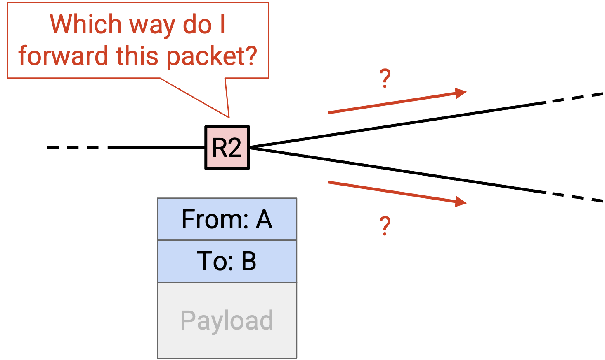

Một khi chúng ta tìm thấy một thuật toán (một routing protocol (giao thức định tuyến)) để giải quyết vấn đề này, chúng ta có thể áp dụng thuật toán đó để tạo ra một câu trả lời, mà chúng ta sẽ gọi là **routing state** (trạng thái định tuyến). Bạn có thể nghĩ về một routing state như một tập hợp các quy tắc mà mỗi router sử dụng để chuyển tiếp các gói tin mà nó nhận được. Một routing state trông như thế nào, và làm thế nào chúng ta có thể kiểm tra xem một routing state cho trước có hợp lệ hay tốt không?

Để bắt đầu, chúng ta có thể xem xét một số chiến lược tồi để tạo ra các routing state. Một chiến lược định tuyến khả thi là: Router chuyển tiếp gói tin đến một láng giềng được chọn ngẫu nhiên. Về mặt trực quan, chúng ta đã có thể thấy rằng các routing state được tạo ra theo cách này có lẽ sẽ không hợp lệ. Nếu chúng ta sử dụng chiến lược này, chúng ta không thể chắc chắn rằng các gói tin sẽ đến được đích cuối cùng của chúng.

Một chiến lược tồi khả thi khác là: Router chuyển tiếp một bản sao của gói tin đến tất cả các láng giềng của nó. Về mặt trực quan, điều này có thể hợp lệ, theo nghĩa là các bản sao của gói tin cuối cùng sẽ lan truyền khắp toàn bộ mạng và có thể đến được đích. Tuy nhiên, chiến lược này không hiệu quả, vì nó lãng phí rất nhiều bandwidth (băng thông) để chuyển tiếp gói tin đến các router không cần thiết để gửi gói tin đến đích cuối cùng của nó.

Chúng ta có thể thấy một cách trực quan rằng hai chiến lược này là tồi, nhưng để phân tích các routing protocol thông minh hơn, chúng ta sẽ cần phải định nghĩa một cách chính thức một routing state trông như thế nào. Sau đó, chúng ta sẽ cần phải chính thức hóa điều gì làm cho một routing state hợp lệ, và điều gì làm cho một routing state tốt.

## Bảng Chuyển tiếp (Forwarding Tables)

Trong mô hình mạng của chúng ta, mỗi router có một số liên kết đi ra kết nối nó với các router và máy chủ liền kề. Nói cách khác, trong đồ thị cơ bản, mỗi nút router có một số láng giềng, được kết nối với router bằng một cạnh.

Khi router nhận được một gói tin, với đích cuối cùng của nó trong siêu dữ liệu, router cần quyết định gói tin nên được chuyển tiếp đến router hoặc máy chủ liền kề nào. Router trung gian tiếp theo mà gói tin sẽ được chuyển tiếp đến được gọi là **next hop** (chặng kế tiếp).

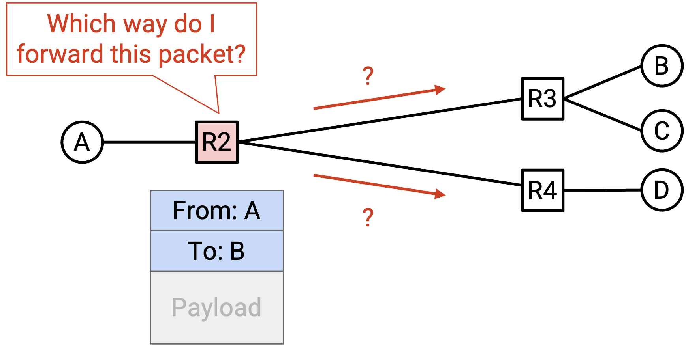

Ví dụ, hãy xem xét mạng này. Nếu R2 nhận được một gói tin có đích cuối cùng là B, next hop tự nhiên tương ứng sẽ là R3. Các lựa chọn next hop có thể là R1, R3 và R4 (ba router liền kề với R2), và R3 là next hop gửi gói tin đến gần B hơn.

Nếu R2 thay vào đó nhận được một gói tin có đích cuối cùng là A, thì next hop tự nhiên tương ứng sẽ là R1.

Đối với mỗi đích cuối cùng có thể, chúng ta có thể viết ra next hop tương ứng để chuyển tiếp gói tin đến gần đích đó hơn. Kết quả được gọi là **forwarding table** (bảng chuyển tiếp).

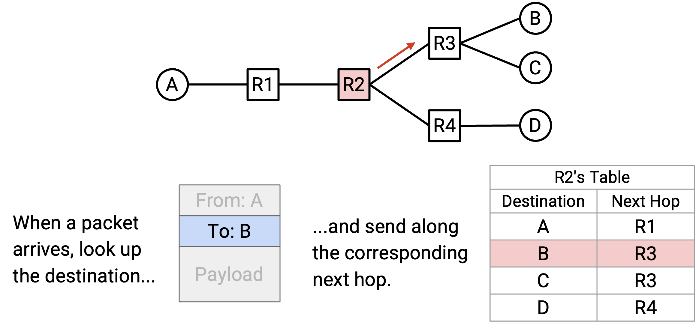

Lưu ý rằng trong việc ánh xạ từ đích đến next hop, một next hop có thể được sử dụng nhiều lần. Ví dụ, trong forwarding table của R2, các gói tin đến B và các gói tin đến C đều sẽ được chuyển tiếp đến R3.

Bằng cách viết ra forwarding table cho mỗi router trung gian, chúng ta hiện có một routing state đầy đủ cho mạng. Nói cách khác, với một gói tin có một đích cuối cùng nào đó, chúng ta biết chính xác cách mỗi router sẽ chuyển tiếp gói tin đó.

Trong thế giới thực, thay vì ánh xạ các đích đến các next hop, các router thường sẽ ánh xạ các đích đến các **physical ports** (cổng vật lý), trong đó mỗi cổng vật lý tương ứng với một liên kết. Trong mô hình đồ thị, bây giờ chúng ta sẽ ánh xạ mỗi đích đến một cạnh, thay vì ánh xạ mỗi đích đến một nút láng giềng. Trong thế giới thực, bạn có thể nghĩ về điều này như một router có nhiều dây đi ra, trong đó mỗi dây được kết nối với một router khác. Thay vì viết ra các router láng giềng trong forwarding table, router thay vào đó viết ra dây nào mà một gói tin nên được gửi đi.

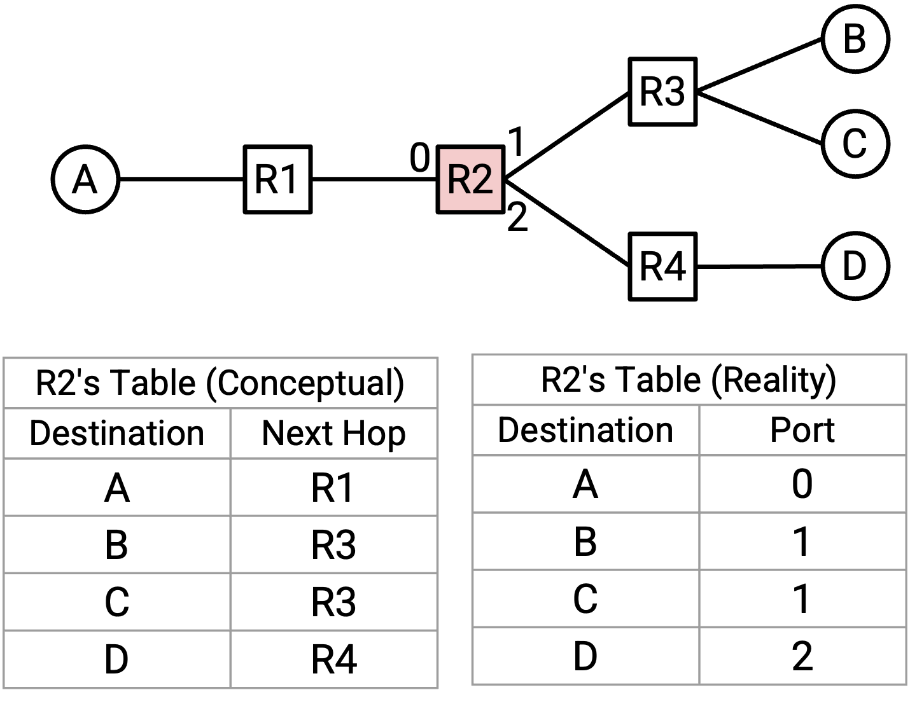

Đây là một sự khác biệt tinh tế, và nó phản ánh thực tế rằng router không thực sự quan tâm đến danh tính của router láng giềng. Quyết định duy nhất mà router cần đưa ra là gửi gói tin đi theo một trong các dây, bất kể dây đó được kết nối với ai. Trong các ghi chú này, chúng ta sẽ vẽ các forwarding table dưới dạng ánh xạ các đích đến các next hop (thay vì các cổng vật lý), để đơn giản.

## Chuyển tiếp Dựa trên Đích đến (Destination-Based Forwarding)

Một hệ quả của việc sử dụng forwarding table là với một gói tin cho trước, quyết định về nơi chuyển tiếp gói tin chỉ phụ thuộc vào trường đích của gói tin. Nói cách khác, nếu một router nhận được nhiều gói tin khác nhau, tất cả đều có cùng một đích, chúng sẽ đều được định tuyến đến cùng một next hop (giả sử forwarding table không thay đổi). Vì mỗi đích chỉ được ánh xạ đến một next hop duy nhất, không có cách nào để hai gói tin có cùng một đích được chuyển tiếp đến các router khác nhau. Cách tiếp cận này được gọi là **destination-based forwarding** (chuyển tiếp dựa trên đích đến) hoặc **destination-based routing** (định tuyến dựa trên đích đến).

Destination-based routing là cách tiếp cận phổ biến nhất để định tuyến, và đó là những gì được sử dụng trong Internet hiện đại. Về lý thuyết, các cách tiếp cận khác có thể tồn tại, nơi siêu dữ liệu bổ sung được sử dụng để đưa ra quyết định chuyển tiếp, nhưng chúng thường chỉ được sử dụng trong các ứng dụng hạn chế (ví dụ: bên trong một mạng cục bộ cụ thể).

Trong các đơn vị sau, khi chúng ta xem xét các cấu trúc liên kết trung tâm dữ liệu, chúng ta có thể xem xét các phương pháp destination-based forwarding nơi có thể có nhiều hơn một next hop cho một đích cụ thể. Trong đơn vị này, chúng ta sẽ giả định rằng mỗi đích chỉ được ánh xạ đến một next hop duy nhất.

## Định tuyến và Chuyển tiếp (Routing vs. Forwarding)

Bây giờ chúng ta đã giới thiệu ý tưởng về forwarding table, chúng ta cần phân biệt giữa quá trình tạo ra forwarding table và quá trình sử dụng forwarding table.

**Routing** (Định tuyến) là quá trình các router giao tiếp với nhau để xác định cách điền vào forwarding table của chúng.

**Forwarding** (Chuyển tiếp) là quá trình nhận một gói tin, tra cứu next hop thích hợp của nó trong bảng, và gửi gói tin đến láng giềng thích hợp.

Forwarding không giống như Routing. Khi Forwarding các gói tin, các router sử dụng forwarding table hiện có, mà không cần biết bảng đó được tạo ra như thế nào.

Forwarding là một quy trình cục bộ. Khi một router đang Forwarding các gói tin, router không cần biết toàn bộ cấu trúc liên kết mạng. Router cũng không quan tâm đến việc gói tin đi đâu sau khi nó đã được chuyển tiếp đến next hop. Router chỉ cần biết về gói tin đến và forwarding table của chính nó.

Ngược lại, Routing là một quy trình toàn cục. Để điền vào các forwarding table, chúng ta sẽ cần tìm hiểu một cái gì đó về cấu trúc liên kết toàn cục của mạng.

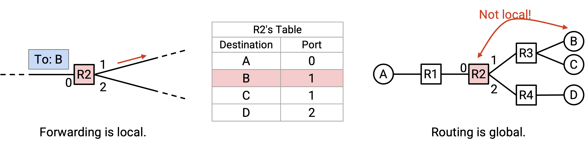

Ví dụ, khi điền vào forwarding table của R2, chúng ta đã phải bằng cách nào đó biết được rằng đích B được liên kết với R3, mặc dù máy chủ B không được kết nối trực tiếp với R2. Trong quá trình Routing, mỗi router cũng sẽ cần biết về các đích không thuộc cục bộ.

## Tính hợp lệ của Trạng thái Định tuyến là Toàn cục (Routing State Validity is Global)

Hãy nhớ lại rằng một routing state bao gồm một forwarding table cho mỗi router, chúng cùng nhau cho chúng ta biết cách các gói tin sẽ di chuyển qua mạng. Với một routing state cho trước, làm thế nào chúng ta có thể biết được routing state đó là đúng hay sai?

Đầu tiên, chúng ta cần định nghĩa chính thức **routing state validity** (tính hợp lệ của trạng thái định tuyến) để xác định xem một routing state có hợp lệ hay không (mặc dù thuật ngữ này có thể không được sử dụng rộng rãi ngoài khóa học CS 168 tại UC Berkeley). Yêu cầu chính đối với tính hợp lệ là: routing state cần tạo ra các quyết định chuyển tiếp đảm bảo rằng các gói tin thực sự đến được đích của chúng.

Lưu ý rằng tính hợp lệ phải được đánh giá trong bối cảnh toàn cục, không phải bối cảnh cục bộ. Việc xem xét routing state cục bộ, chẳng hạn như forwarding table của một router duy nhất, không thể cho chúng ta biết liệu một routing state có hợp lệ hay không. Ví dụ, trong forwarding table cục bộ của router R2, chúng ta có thể thấy rằng next hop cho đích A là router R3, nhưng chúng ta không có cách nào để quyết định xem điều này có hợp lệ hay không. Liệu việc chuyển tiếp các gói tin đến R3 có giúp các gói tin đến được đích A không? Không có cách nào để biết chỉ từ forwarding table.

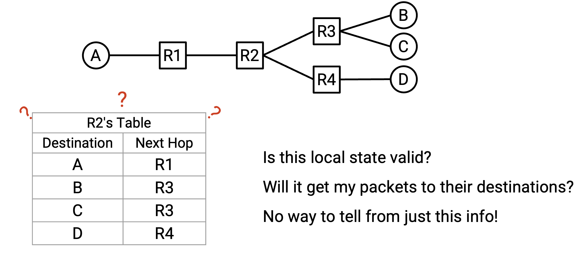

Thay vào đó, chúng ta cần xem xét routing state toàn cục, bao gồm tập hợp tất cả các forwarding table trong tất cả các router.

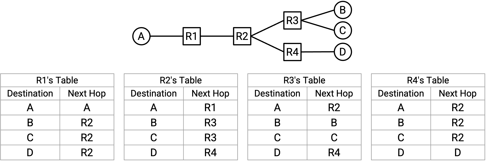

## Định nghĩa Tính hợp lệ của Trạng thái Định tuyến (Routing State Validity Definition)

Bây giờ, chúng ta có thể định nghĩa một điều kiện chính thức mà chúng ta có thể sử dụng để kiểm tra xem các gói tin có đến được đích của chúng hay không đối với một routing state cho trước.

Một routing state toàn cục là hợp lệ khi và chỉ khi, đối với bất kỳ đích nào, các gói tin không bị kẹt trong các ngõ cụt hoặc vòng lặp.

Một **dead end** (ngõ cụt) xảy ra nếu một gói tin đến một router, nhưng router không biết cách chuyển tiếp gói tin đến đích của nó, vì vậy gói tin không được chuyển tiếp. Điều này có thể xảy ra nếu forwarding table của router không chứa một mục cho đích của gói tin.

Lưu ý rằng điều kiện dead end chỉ áp dụng cho các router trung gian, chứ không phải các máy chủ cuối. Khi một gói tin đến máy chủ cuối đích, không cần thiết máy chủ cuối phải chuyển tiếp gói tin đi xa hơn, vì vậy chúng ta sẽ không xem xét các máy chủ cuối trong điều kiện dead end.

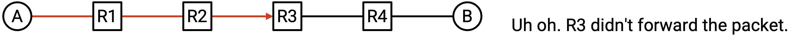

Một **loop** (vòng lặp) xảy ra nếu một gói tin được gửi theo một chu kỳ xung quanh cùng một nhóm các nút. Lưu ý rằng vì chúng ta đang sử dụng destination-based forwarding, nơi next hop chỉ phụ thuộc vào đích, một khi một gói tin đi vào một loop, nó sẽ bị kẹt trong loop đó mãi mãi. Khi gói tin đến router lần đầu tiên, hoặc lần thứ 10, hoặc lần thứ 500, nó sẽ được chuyển tiếp theo cùng một cách chính xác (vì đích cuối cùng là như nhau). Vì điều này áp dụng cho mọi router trên loop, gói tin sẽ bị kẹt trong loop mãi mãi.

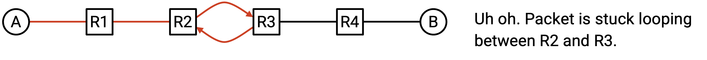

Điều kiện này (không có dead ends, không có loops) là cần và đủ để một tuyến đường là hợp lệ. Hãy kiểm tra cả hai chiều của mệnh đề logic này.

Không có dead ends và không có loops là một điều kiện cần cho tính hợp lệ. Nói cách khác, một trạng thái là hợp lệ chỉ khi không có dead ends và không có loops.

Chứng minh: Nếu có một dead end, gói tin sẽ không đến được đích. Gói tin sẽ đến dead end và không được chuyển tiếp.

Nếu có loops, gói tin sẽ không đến được đích. Gói tin sẽ bị kẹt trong loop mãi mãi (vì destination-based forwarding, được mô tả trước đó). Ngoài ra, lưu ý rằng đích cuối cùng không thể là một phần của loop, vì đích sẽ không chuyển tiếp gói tin. Do đó, một gói tin bị kẹt trong loop sẽ không đến được đích.

Bây giờ, hãy kiểm tra chiều ngược lại. Nếu không có loops và không có dead ends, thì trạng thái đó là hợp lệ.

Chứng minh: Giả sử rằng routing state không có loops hoặc dead ends. Một gói tin sẽ không đến cùng một nút hai lần (vì không có loops). Ngoài ra, gói tin sẽ không dừng lại trước khi đến đích (vì không có dead ends). Do đó, gói tin phải tiếp tục đi qua mạng, đến các nút khác nhau. Chỉ có một số lượng hữu hạn các nút duy nhất để ghé thăm, vì vậy gói tin cuối cùng phải đến được đích. Do đó, routing state phải hợp lệ.

## Cây Phân phối Có hướng (Directed Delivery Trees)

Bây giờ chúng ta đã có một định nghĩa chính thức cho routing state validity, chúng ta có thể hỏi: với một routing state toàn cục cho trước, làm thế nào chúng ta có thể kiểm tra xem nó có hợp lệ không?

Để đơn giản hóa vấn đề, hãy bắt đầu bằng cách chỉ xem xét một máy chủ cuối đích duy nhất, bỏ qua tất cả các máy chủ cuối khác. Trong mỗi router, chúng ta có thể tra cứu đích này để lấy next hop tương ứng, điều này cho chúng ta biết cách mỗi router sẽ chuyển tiếp các gói tin dành cho đích này.

Chúng ta có thể biểu diễn next hop tại mỗi router (cho đích duy nhất này) dưới dạng một mũi tên, cho chúng ta thấy tất cả các đường đi có thể mà gói tin này có thể đi để đến đích duy nhất.

Trong đồ thị kết quả, mỗi nút sẽ chỉ có một mũi tên đi ra. Điều này phản ánh giả định của chúng ta rằng trong forwarding table của mỗi router, chỉ có một next hop tương ứng với một đích.

Lưu ý rằng trong đồ thị kết quả, một khi hai đường đi gặp nhau, chúng không bao giờ tách ra. Nói cách khác, ngay cả khi có nhiều mũi tên (đường đi) đến một nút, vì chỉ có một mũi tên đi ra, các đường đi đó bây giờ sẽ hội tụ thành một đường đi duy nhất. Điều này phản ánh phương pháp destination-based forwarding của chúng ta, bởi vì mỗi router chỉ sử dụng đích cuối cùng để quyết định cách chuyển tiếp một gói tin. Router không quan tâm gói tin đã đến router bằng cách nào ngay từ đầu.

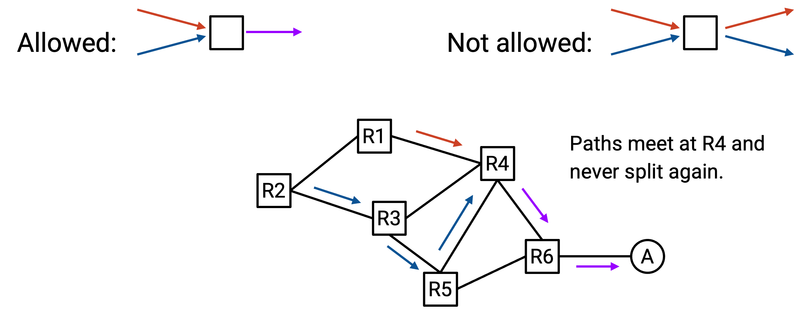

Các mũi tên mà chúng ta đã vẽ tạo thành một tập hợp các đường đi mà một gói tin có thể đi để đến đích duy nhất. Tập hợp các đường đi này được gọi là **directed delivery tree** (cây phân phối có hướng).

Về mặt thuật ngữ đồ thị, các mũi tên trong một directed delivery tree hợp lệ phải tạo thành một **oriented spanning tree** (cây khung có hướng), có gốc tại đích. Hãy nhớ lại rằng một cây khung là một tập hợp các cạnh trong đồ thị chạm vào mọi nút và tạo thành một cây. Chúng ta muốn directed delivery tree là một cây, vì không nên có chu trình (các gói tin không thể đi theo vòng lặp). Chúng ta muốn directed delivery tree là cây khung (chạm vào mọi nút), bởi vì chúng ta muốn có thể đến đích từ mọi nơi. Directed delivery tree có hướng vì các cạnh có mũi tên, cho chúng ta biết hướng để chuyển tiếp gói tin.

Tất cả các cạnh trong một directed delivery tree hợp lệ phải hướng về phía đích. Nói cách khác, bắt đầu từ bất kỳ nút nào, đi theo các mũi tên phải luôn luôn dẫn đến việc đến được đích.

## Xác minh Tính hợp lệ của Trạng thái Định tuyến (Verifying Routing State Validity)

Như trước đây, hãy chỉ xem xét một máy chủ cuối đích duy nhất, bỏ qua tất cả các máy chủ cuối khác.

Ví dụ: Mặc dù có nhiều máy chủ cuối ở đây, hãy chỉ xem xét máy chủ cuối A.

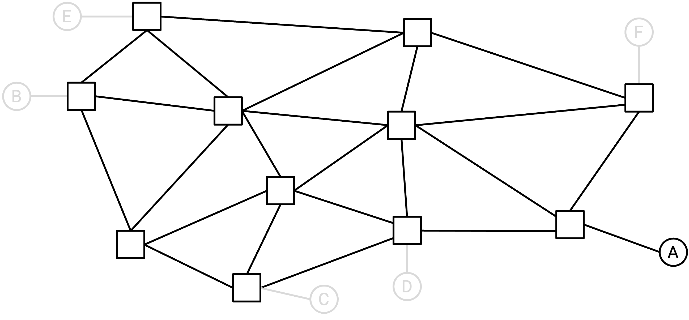

Sử dụng các forwarding table tại mỗi router, chúng ta sẽ vẽ các mũi tên vào mạng để tạo thành directed delivery tree cho đích duy nhất này. Về mặt chính thức, đối với mỗi router (nút trong đồ thị), chúng ta sẽ vẽ một mũi tên đi ra duy nhất từ nút đó.

Ví dụ: Sử dụng các forwarding table (không hiển thị), chúng ta có thể vẽ một mũi tên đi ra cho mỗi router.

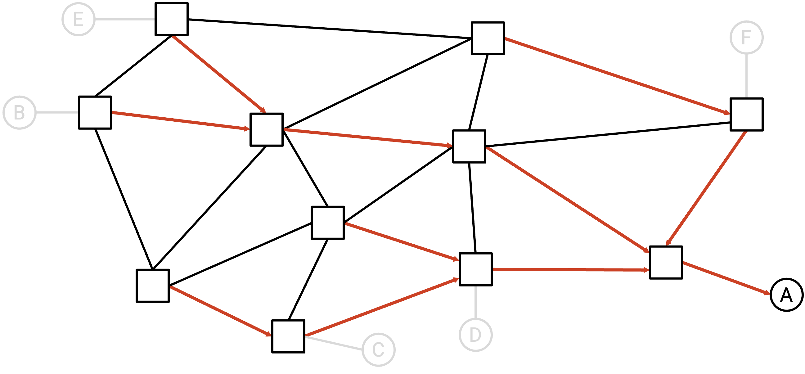

Để đơn giản, tại thời điểm này, chúng ta có thể xóa tất cả các liên kết không có mũi tên trên chúng. Các liên kết không có mũi tên này sẽ không bao giờ được sử dụng để gửi gói tin đến đích duy nhất, vì chúng không nằm trên directed delivery tree.

Ví dụ: Chúng ta có thể xóa tất cả các liên kết không có mũi tên.

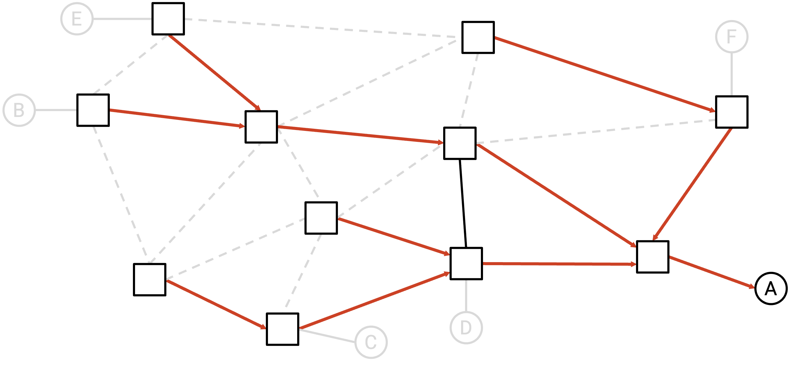

Nếu đồ thị còn lại là một directed delivery tree hợp lệ (cây khung, tất cả các mũi tên đều hướng về đích), thì chúng ta có thể nói rằng routing state là hợp lệ cho đích duy nhất này.

Trong ví dụ trên, đồ thị còn lại thực sự là một cây khung hợp lệ hội tụ tại A, vì vậy chúng ta có thể nói routing state này là hợp lệ cho A.

Dưới đây là một số ví dụ về các routing state không hợp lệ:

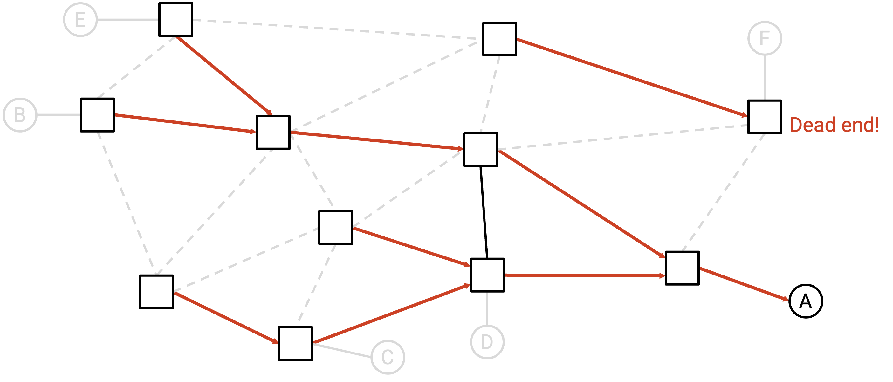

Trạng thái này không hợp lệ. Về mặt trực quan, có một router dead end. Một gói tin hướng đến A có thể được gửi đến router này, và router này sẽ loại bỏ gói tin mà không chuyển tiếp nó. Về mặt chính thức, đồ thị còn lại không phải là một cây khung, bởi vì các cạnh không được kết nối với nhau (có hai thành phần không liên thông, điều này không được phép trong một cây).

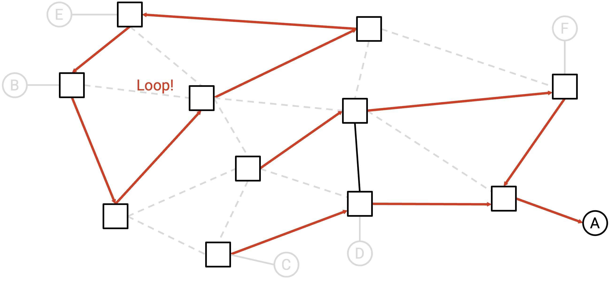

Trạng thái này cũng không hợp lệ. Về mặt trực quan, có một loop mà gói tin có thể bị kẹt trong đó. Về mặt chính thức, đồ thị còn lại không phải là một cây khung, bởi vì các cạnh không liên thông, và có một chu trình.

Chúng ta có thể lặp lại quá trình này, một lần cho mỗi máy chủ cuối khác nhau (cô lập một máy chủ cuối khác nhau mỗi lần). Nếu routing state là hợp lệ cho tất cả các đích, thì chúng ta có thể nói rằng routing state là hợp lệ, và sẽ luôn chuyển giao các gói tin đến đúng đích của chúng.

## Định tuyến Chi phí Thấp nhất (Least-Cost Routing)

Bây giờ chúng ta đã có một định nghĩa về điều gì làm cho một routing state hợp lệ (các tuyến đường không có loops và dead ends), chúng ta có thể định nghĩa thêm điều gì làm cho một routing state tốt. Có thể một mạng có nhiều routing state hợp lệ, và chúng ta muốn có một số liệu có thể giúp chúng ta xác định xem một tuyến đường có tốt hơn tuyến đường khác hay không.

**Least-cost routing** (định tuyến chi phí thấp nhất) là một cách tiếp cận phổ biến để đo lường xem một tuyến đường có tốt hay không. Trong least-cost routing, chúng ta gán một chi phí bằng số cho mọi liên kết, và tìm kiếm các tuyến đường giảm thiểu chi phí. Nói cách khác, chúng ta muốn các tuyến đường dẫn đến việc các gói tin di chuyển dọc theo các đường đi có chi phí thấp nhất đến đích của chúng.

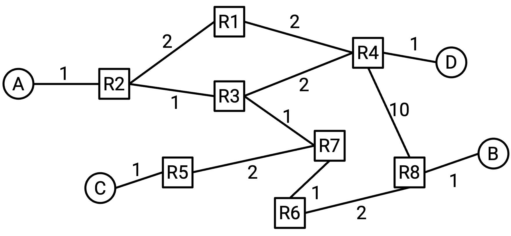

Có nhiều chi phí khác nhau mà chúng ta có thể xem xét gán cho các liên kết. Chi phí có thể phụ thuộc vào giá xây dựng liên kết, độ trễ lan truyền, khoảng cách vật lý của liên kết, độ không tin cậy, bandwidth, cùng nhiều yếu tố khác. Ví dụ, chúng ta có thể gán chi phí dựa trên chất lượng của liên kết (bandwidth và độ trễ lan truyền), sao cho đường đi chi phí thấp nhất ưu tiên các liên kết chất lượng cao hơn.

Bằng cách cho phép các nhà khai thác đặt chi phí liên kết một cách tùy ý, chúng ta trao cho nhà khai thác khả năng tối ưu hóa mạng cho các nhu cầu cụ thể của họ. Chi phí chúng ta gán phụ thuộc vào mục tiêu của nhà khai thác đối với mạng. Nếu chúng ta có một liên kết 400 Gbps với độ trễ lan truyền 20 ms, và một liên kết 10 Gbps với độ trễ lan truyền 5 ms, cái nào có chi phí thấp hơn? Điều đó phụ thuộc vào việc chúng ta đang tối ưu hóa cho bandwidth, độ trễ lan truyền, một sự kết hợp nào đó, hay một thứ gì đó hoàn toàn khác.

Nếu chúng ta gán chi phí là 1 cho mọi liên kết, thì đường đi chi phí thấp nhất là đường đi di chuyển qua ít liên kết nhất. Đôi khi chúng ta gọi đây là việc giảm thiểu **hop count** (số bước nhảy). Trong các ghi chú này, nếu các cạnh của một đồ thị không được dán nhãn với một chi phí, bạn có thể giả định tất cả các cạnh có chi phí là 1.

Nhà khai thác của một mạng có thể quyết định cách gán chi phí cho mỗi liên kết. Nhà khai thác có thể gán chi phí thủ công. Hoặc, nhà khai thác có thể để mạng tự động cấu hình chi phí, mặc dù điều này có thể không hoạt động với một số số liệu không thể đo lường tự động (ví dụ: mạng không biết gì về chi phí tài chính để xây dựng liên kết).

Khi thiết kế một routing protocol, chúng ta có thể trừu tượng hóa cách các chi phí được gán. Từ quan điểm của routing protocol, một ai đó khác (ví dụ: nhà khai thác mạng) đã gán các chi phí, dựa trên một cái gì đó mà họ cho là quan trọng. Thuật toán nhận các chi phí làm đầu vào, và tính toán các đường đi chi phí thấp nhất, bất kể các chi phí thực sự đại diện cho điều gì.

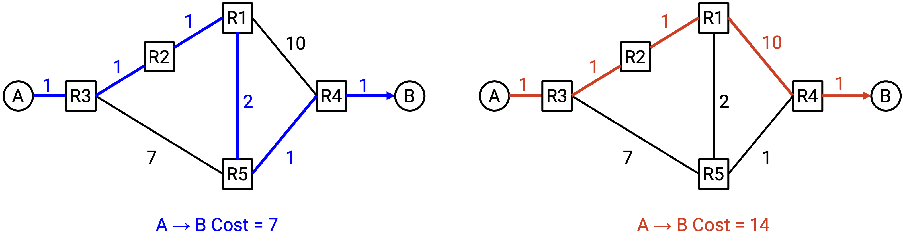

Lưu ý rằng chi phí là cục bộ đối với mỗi router. Một router biết về chi phí của các liên kết đi ra của chính nó, nhưng không có cách nào để router tự động biết chi phí của tất cả các liên kết. Điều này phù hợp với ràng buộc mà chúng ta đã đề cập trước đó, nơi các router không có cái nhìn toàn cục về toàn bộ cấu trúc liên kết của mạng.

Để đơn giản, các routing protocol đưa ra một số giả định về cách các chi phí được định nghĩa.

Chúng ta sẽ giả định rằng chi phí luôn là số nguyên dương. Điều này phù hợp với nhiều số liệu phổ biến trong đời thực, chẳng hạn như chiều dài của một liên kết hoặc chi phí tiền tệ của một liên kết. Nếu chúng ta đang cố gắng giảm thiểu tổng khoảng cách vật lý mà một gói tin di chuyển, một chi phí liên kết âm không có ý nghĩa. Bạn không thể di chuyển dọc theo một liên kết và giảm tổng khoảng cách đã đi. Giả định này sẽ giúp đơn giản hóa các giao thức của chúng ta sau này, vì chúng ta sẽ không phải lo lắng về các trường hợp biên như các vòng lặp có trọng số âm (nơi giải pháp chi phí thấp nhất sẽ là đi vòng quanh vòng lặp mãi mãi).

Chúng ta sẽ giả định rằng chi phí là đối xứng. Chi phí từ A đến B giống như chi phí từ B đến A. Điều này phản ánh các sơ đồ chúng ta sẽ vẽ, trong đó một cạnh được dán nhãn với một chi phí đối xứng duy nhất. Về lý thuyết, có thể có chi phí liên kết bất đối xứng, nhưng điều này không được thực hiện trong thực tế, và sẽ dẫn đến các routing protocol phức tạp hơn.

Với những giả định này, định nghĩa của chúng ta về các tuyến đường tốt (chi phí thấp nhất) phù hợp với định nghĩa của chúng ta về các tuyến đường hợp lệ. Cụ thể, một tuyến đường chi phí thấp nhất sẽ không có bất kỳ loops nào, bởi vì chi phí là dương (việc đi qua loop sẽ chỉ làm tăng chi phí).

## Định tuyến Tĩnh (Static Routing)

Một cách khả thi để tạo ra các tuyến đường là để nhà khai thác mạng điền vào forwarding table một cách thủ công. Điều này được gọi là **static routing** (định tuyến tĩnh).

Bản thân static routing không thực tế (ví dụ: không thể mở rộng, dễ bị lỗi do con người), nhưng ngay cả khi đã triển khai một routing protocol, một số tuyến đường vẫn cần được các nhà khai thác tạo ra thủ công. Bạn có thể nghĩ về những tuyến đường thủ công này như những tuyến đường "tầm thường" hoặc "trường hợp cơ sở", từ đó routing protocol tạo ra các tuyến đường phức tạp hơn.

Nếu chúng ta được kết nối trực tiếp với một máy khác mà chúng ta muốn định tuyến các gói tin đến, chúng ta có thể cấu hình thủ công một tuyến đường để chuyển tiếp các gói tin đến máy đó. Những tuyến đường này được gọi là **direct routes** (tuyến đường trực tiếp) hoặc **connected routes** (tuyến đường kết nối). Ví dụ, router nhà bạn được kết nối với máy tính cá nhân của bạn bằng một liên kết, vì vậy router nhà bạn có thể thêm một mục trong forwarding table tương ứng với máy tính của bạn. Mục này được thêm vào bằng cách thông báo cho router về kết nối, và không được thêm vào từ việc chạy bất kỳ routing protocol nào.

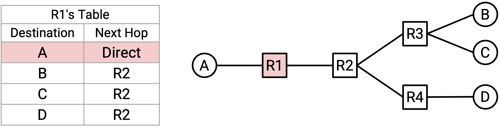

Cũng có thể sử dụng static routing để mã hóa cứng các mục cho các đích trong forwarding table, ngay cả khi chúng ta không được kết nối trực tiếp với đích đó. Điều này có thể hữu ích nếu có một tuyến đường không bao giờ thay đổi, và chúng ta muốn tuyến đường đó luôn ở trong forwarding table của mình, bất kể routing protocol đang làm gì.