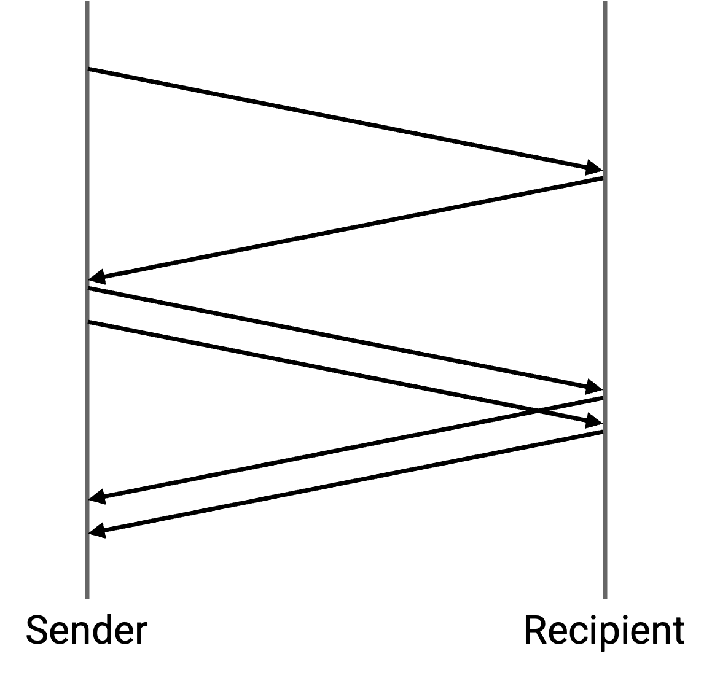
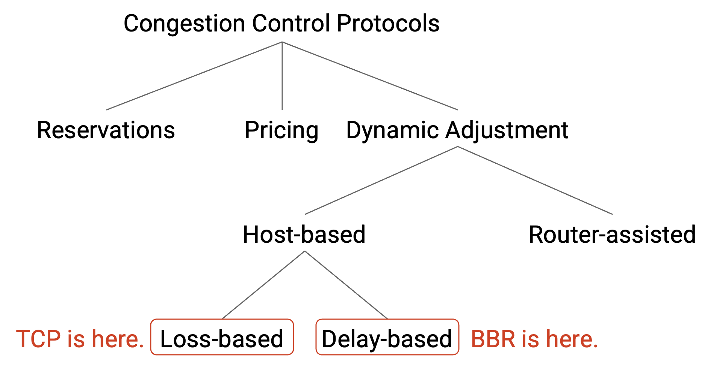
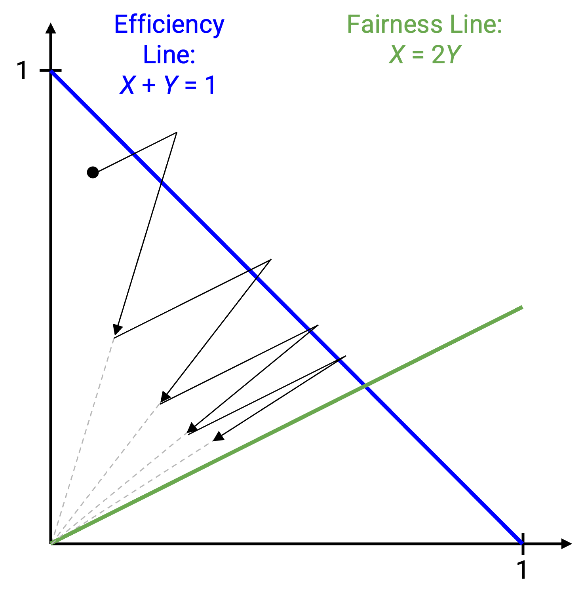

# Các vấn đề trong Điều khiển Tắc nghẽn (Congestion Control)

## Nhầm lẫn giữa Hỏng gói tin (Corruption) và Tắc nghẽn (Congestion)

*TCP* phát hiện tắc nghẽn bằng cách kiểm tra tình trạng mất gói tin (*packet loss*), nhưng tắc nghẽn không phải là lý do duy nhất khiến gói tin bị mất. Gói tin cũng có thể bị mất do hỏng gói tin, và *TCP* không thể phân biệt được mất gói do hỏng hay do tắc nghẽn. Nếu một gói tin bị hỏng, *TCP* vẫn sẽ giảm tốc độ truyền, ngay cả khi mạng không bị tắc nghẽn.

Chúng ta cũng có thể thấy điều này trong phương trình liên hệ giữa *throughput* (thông lượng) và tỷ lệ mất gói (*loss rate*). *Throughput* và *loss rate* tỉ lệ nghịch với nhau, ngay cả đối với các trường hợp mất gói không do tắc nghẽn. Phương trình này hữu ích để ước lượng tác động của một đường truyền kém ổn định (*lossy link*, ví dụ: đường truyền không dây thường xuyên làm hỏng gói tin) đối với *TCP*.

## Kết nối ngắn (Short Connections)

Hầu hết các kết nối *TCP* trong thực tế tồn tại rất ngắn. 50% số kết nối truyền ít hơn 1,5 KB dữ liệu, và 80% số kết nối truyền ít hơn 100 KB. Rất ít gói tin (có thể chỉ một gói) được gửi trong các kết nối này.

Giả sử chúng ta có một kết nối mà phía gửi chỉ có 3 gói tin cần gửi. *TCP congestion control* (điều khiển tắc nghẽn trong TCP) sẽ làm gì? Chúng ta bắt đầu với kích thước cửa sổ (*window size*) là 1 và gửi gói tin đầu tiên. Sau đó, chờ *ack* (thông báo xác nhận), tăng kích thước cửa sổ lên 2, và gửi hai gói tin còn lại. Tiếp theo, chờ thêm hai *ack* nữa, và hoàn tất.

Kết nối này mất hai *RTT* (Round-Trip Time – thời gian khứ hồi) để gửi 3 gói tin, dẫn đến *throughput* cực thấp (1,5 gói tin mỗi *RTT*).

Nói chung, các kết nối ngắn này không bao giờ thoát khỏi giai đoạn *slow-start* (khởi động chậm), và không bao giờ đạt được phần *bandwidth* (băng thông) công bằng của mình. Điều này khiến các kết nối ngắn phải chịu thời gian truyền tải dài không cần thiết.

Một vấn đề khác với kết nối ngắn là xử lý mất gói. Hãy nhớ rằng chúng ta phát hiện mất gói khi có 3 *duplicate acks* (gói xác nhận trùng lặp), nhưng trong một kết nối ngắn, có thể không đủ gói tin để kích hoạt 3 *duplicate acks*. Ví dụ, nếu chúng ta có 4 gói tin cần gửi, và mất gói thứ hai, chúng ta sẽ không bao giờ nhận được 3 *duplicate acks*. Thay vào đó, chúng ta phải chờ *timeout* (hết thời gian chờ) để kích hoạt. Với giá trị *timeout* thực tế khoảng 500ms, điều này cũng khiến kết nối ngắn mất nhiều thời gian hơn cần thiết.

Làm thế nào để khắc phục cả hai vấn đề này? Một giải pháp một phần là bắt đầu với *initial window* (cửa sổ khởi tạo) lớn hơn (ví dụ: 10 gói thay vì 1). Khi đó, các kết nối có 10 gói tin hoặc ít hơn có thể gửi toàn bộ dữ liệu ngay từ đầu kết nối.

## TCP làm đầy hàng đợi (Queues)

*TCP* phát hiện tắc nghẽn bằng cách dựa vào mất gói, và thuật toán *congestion control* cố tình tăng tốc độ truyền cho đến khi gây ra mất gói. Để gây ra mất gói, các hàng đợi (*queues*) phải đầy. Điều này có nghĩa là *TCP* tạo ra độ trễ xếp hàng (*queuing delay*) trên toàn mạng, và độ trễ này ảnh hưởng đến tất cả mọi người trong mạng.

Giả sử chúng ta có một kết nối tải nặng truyền một tệp 10 GB, và sau đó, chúng ta bắt đầu một kết nối nhỏ chỉ truyền một gói tin. Cả hai kết nối chia sẻ cùng một đường truyền nghẽn cổ chai (*bottleneck link*). Kết nối tải nặng sẽ tăng tốc độ cho đến khi hàng đợi tại đường truyền nghẽn cổ chai đầy. Lúc này, khi kết nối nhỏ bắt đầu, nó sẽ phải chờ trong hàng đợi, phía sau các gói tin của kết nối tải nặng.

Vấn đề này trở nên tồi tệ hơn nếu *router* giữ hàng đợi cực lớn. Việc *router* có bộ nhớ quá lớn cho hàng đợi dài được gọi là **bufferbloat**. Một ví dụ về *bufferbloat* xảy ra ở các *home router* (router gia đình), vốn có thể có hàng đợi rất lớn nhưng chỉ có rất ít kết nối (chỉ các kết nối trong nhà bạn) sử dụng hàng đợi đó. Khi đó, bất kỳ kết nối nào bạn tạo ra sẽ gây ra độ trễ xếp hàng lớn cho các kết nối khác.

Để tránh việc hàng đợi bị đầy, chúng ta có thể tìm cách đo lường tắc nghẽn mà không cần cố tình gây mất gói. Cụ thể, chúng ta có thể phát hiện tắc nghẽn khi *RTT* bắt đầu tăng, điều này cho thấy có độ trễ. Đây là ý tưởng đằng sau thuật toán *BBR* của Google (2016). Phía gửi sẽ học được *RTT* tối thiểu của mình, và giảm tốc độ nếu nhận thấy *RTT* vượt quá giá trị tối thiểu.

## Gian lận (Cheating)

Không có gì bắt buộc phía gửi phải tuân theo thuật toán *TCP congestion control*. Phía gửi có thể gian lận để giành được phần *bandwidth* lớn hơn một cách không công bằng.

Ví dụ, một phía gửi có thể tăng kích thước cửa sổ nhanh hơn (ví dụ: +2 mỗi *RTT* thay vì +1). Nếu áp dụng mô hình đồ thị của chúng ta cho một phía gửi gian lận và một phía gửi trung thực, các cập nhật *AIMD* (Additive Increase Multiplicative Decrease – Tăng cộng, giảm nhân) sẽ hội tụ về một đường công bằng xấu, nơi phía gửi gian lận nhận gấp đôi *bandwidth* của phía gửi trung thực.

Có nhiều cách khác để sửa đổi giao thức, chẳng hạn như bắt đầu với *initial congestion window* rất lớn.

Trong thực tế, vì *TCP* được triển khai trong hệ điều hành (*operating system*), để gian lận, phía gửi sẽ phải sửa đổi mã trong hệ điều hành của mình, điều mà phần lớn người dùng Internet không làm.

Nếu chỉ một số ít phía gửi lạm dụng hệ thống, họ sẽ nhận được nhiều *bandwidth* hơn. Nếu một số lượng lớn phía gửi lạm dụng hệ thống (ví dụ: Microsoft phát hành một phiên bản Windows lạm dụng *TCP*), hàng triệu người dùng Windows vẫn sẽ cạnh tranh với nhau, và khó có khả năng ai đó sẽ nhận được nhiều *bandwidth* hơn.

Một cách khác để gian lận, mà không cần sửa đổi *TCP*, là mở nhiều kết nối. *TCP* chỉ đảm bảo rằng mỗi kết nối nhận được phần công bằng. Nếu một phía gửi gian lận mở 10 kết nối và một phía gửi trung thực mở 1 kết nối, phía gian lận sẽ nhận được gấp 10 lần *bandwidth*. Nhiều ứng dụng cố tình mở nhiều kết nối để cải thiện *bandwidth*.

Nếu gian lận là có thể, tại sao Internet chưa gặp lại sự cố sụp đổ tắc nghẽn (*congestion collapse*)? Hóa ra, các nhà nghiên cứu cũng không thực sự biết câu trả lời. Một khả năng là: những kẻ gian lận sửa đổi thuật toán *congestion control* có thể nhận được phần *bandwidth* không công bằng, nhưng nếu họ vẫn tuân theo các nguyên tắc của *congestion control* (ví dụ: giảm tốc độ khi mất gói), thì họ không làm quá tải mạng. Ngược lại, trong sự cố *congestion collapse* những năm 1980, phía gửi liên tục gửi lại gói tin với tốc độ cao, mà không hề điều chỉnh tốc độ.

Nếu gian lận là có thể, thì trên thực tế có bao nhiêu gian lận xảy ra? Một lần nữa, chúng ta không thực sự biết. Rất khó để đo lường gian lận (ví dụ: bạn không biết kích thước *window* mà mỗi phía gửi đang sử dụng).

## Điều khiển tắc nghẽn (Congestion Control) và Độ tin cậy (Reliability) gắn chặt với nhau

Các cơ chế điều khiển tắc nghẽn (*congestion control*) và độ tin cậy (*reliability*) được liên kết chặt chẽ. Như chúng ta đã thấy, *congestion control* được triển khai bằng cách lấy mã của phần đảm bảo *TCP reliability* và chỉnh sửa một vài dòng mã.

Chúng ta cũng có thể thấy sự phụ thuộc này ngay trong thuật toán. *Window* được cập nhật dựa trên *acks* và *timeouts* vì mã của phần *reliability* được viết để phản ứng với các sự kiện đó. Chúng ta phát hiện mất gói bằng *duplicate acks* vì phần triển khai *reliability* sử dụng *cumulative acks* (xác nhận cộng dồn).

Việc kết hợp *reliability* và *congestion control* là một lựa chọn thiết kế. Một lợi ích là *congestion control* chỉ cần một bản vá mã nhỏ và có thể triển khai rộng rãi để ứng phó với sự cố *congestion collapse* (sụp đổ tắc nghẽn) trong những năm 1980. Tuy nhiên, kể từ đó, việc kết hợp hai tính năng này đã làm phức tạp quá trình phát triển các thuật toán. Ví dụ, nếu chúng ta muốn thay đổi điều gì đó trong thuật toán *congestion control*, rất có thể chúng ta cũng phải thay đổi mã của phần *reliability*. Hoặc nếu muốn thay đổi phần triển khai *reliability* (ví dụ: chuyển từ *cumulative acks* sang *full-information acks*), chúng ta cũng phải cập nhật *congestion control*.

Từ góc độ thiết kế, đây là một thất bại về tính mô-đun (*modularity*), chứ không phải về phân lớp (*layering*). *Congestion control* và *reliability* đang hoạt động ở đúng lớp trừu tượng (*transport layer* – tầng vận chuyển). Tuy nhiên, bên trong tầng vận chuyển, chúng ta chưa tách biệt rõ ràng các chức năng khác nhau thành các phần mã riêng biệt.

Bởi vì *congestion control* phụ thuộc vào *reliability*, nên rất khó để đạt được *congestion control* mà không có *reliability*. Một số ứng dụng (ví dụ: *video streaming* – truyền phát video) có thể không muốn *reliability*, nhưng vẫn muốn *congestion control*. Tuy nhiên, hiện không có cách nào để tắt *reliability* và chỉ giữ lại *congestion control*.

Tương tự, cũng khó để đạt được *reliability* mà không có *congestion control*. Ví dụ, nếu chúng ta có một kết nối nhẹ chỉ gửi một gói tin mỗi 10 phút, có lẽ không cần *congestion control* cho kết nối này. Nhưng chúng ta cũng không thể dễ dàng tắt *congestion control* chỉ cho một số kết nối nhất định.