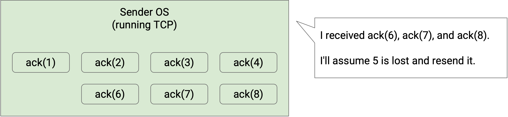

# Thiết kế TCP (TCP Design)

## Gửi một Gói tin Duy nhất một cách Đáng tin cậy (Reliably Delivering a Single Packet)

Thời gian để một gói tin di chuyển từ người gửi đến người nhận là **one-way delay** (độ trễ một chiều). Thời gian để một gói tin di chuyển từ người gửi đến người nhận, cộng với thời gian để một gói tin trả lời di chuyển từ người nhận đến người gửi, là **round-trip time (RTT)** (thời gian trọn vòng).

Hãy xây dựng trực giác bằng cách thiết kế một giao thức đơn giản hóa để gửi một gói tin duy nhất một cách đáng tin cậy.

Người gửi cố gắng gửi một gói tin. Làm thế nào người gửi biết được gói tin đã được nhận thành công hay chưa?

Người nhận có thể gửi một tin nhắn **acknowledgment (ack)** (tin báo nhận), xác nhận rằng gói tin đã được nhận.

Điều gì xảy ra nếu gói tin bị mất?

Chúng ta có thể gửi lại gói tin nếu nó bị mất. Làm thế nào chúng ta biết khi nào cần gửi lại gói tin?

Người gửi có thể duy trì một bộ đếm thời gian. Khi bộ đếm thời gian hết hạn, chúng ta có thể gửi lại gói tin.

Khi người gửi nhận được một ack, người gửi có thể hủy bộ đếm thời gian và không cần phải gửi lại gói tin.

Điều gì xảy ra nếu ack bị mất?

Giao thức vẫn hoạt động mà không cần sửa đổi. Người gửi sẽ hết thời gian chờ (không nhận được ack) và gửi lại gói tin cho đến khi ack được gửi thành công. Trong trường hợp này, đích đến đã nhận được hai bản sao của cùng một gói tin, nhưng điều đó không sao cả. Đích đến có thể nhận thấy bản sao trùng lặp và loại bỏ nó.

Bộ đếm thời gian nên được đặt như thế nào? Nếu bộ đếm thời gian quá dài, gói tin có thể mất nhiều thời gian hơn cần thiết để được gửi đi. Nếu bộ đếm thời gian quá ngắn, gói tin có thể được gửi lại khi không cần thiết. Việc đặt sai bộ đếm thời gian có thể ảnh hưởng đến các mục tiêu hiệu quả của chúng ta.

Một khoảng thời gian tốt cho bộ đếm sẽ là round-trip time. Đây là lúc người gửi mong đợi nhận được ack, vì vậy nếu ack chưa đến vào thời điểm đó, người gửi nên gửi lại gói tin.

Trên thực tế, việc ước tính RTT có thể khó khăn. RTT có thể thay đổi tùy thuộc vào đường đi mà gói tin đi qua mạng, và ngay cả trên một đường đi cụ thể, RTT có thể bị ảnh hưởng bởi tải và tắc nghẽn trên đường đi đó.

Một cách để ước tính RTT là đo thời gian giữa việc gửi một gói tin và nhận được ack cho gói tin đó. Chúng ta có thể nhận được một phép đo RTT ước tính từ mỗi gói tin được gửi, và áp dụng một thuật toán nào đó (ví dụ: trung bình động hàm mũ) để kết hợp các phép đo này thành một ước tính RTT. Thuật toán của chúng ta cũng sẽ phải tính đến việc các tin nhắn được gửi lại (sự biến thiên trong các phép đo).

Trên thực tế, các nhà khai thác thường có xu hướng đặt bộ đếm thời gian dài hơn. Nếu bộ đếm thời gian quá ngắn, và việc hết thời gian chờ liên tục xảy ra, kết nối của bạn có lẽ đang hoạt động kém (liên tục gửi lại các gói tin).

Điều gì sẽ xảy ra nếu các bit bị hỏng?

Chúng ta có thể thêm một checksum (tổng kiểm) trong phần đầu của lớp vận chuyển (khác với checksum của lớp IP). Khi người nhận thấy một gói tin bị hỏng, nó có thể làm hai việc: Hoặc người nhận có thể gửi lại một cách tường minh một **negative acknowledgement (nack)** (tin báo nhận tiêu cực), yêu cầu người gửi gửi lại gói tin.

Hoặc, người nhận có thể bỏ gói tin bị hỏng và không làm gì cả (không gửi ack hay nack). Sau đó, người gửi sẽ hết thời gian chờ và gửi lại gói tin.

Cả hai cách tiếp cận (nack hoặc chờ hết thời gian) đều hoạt động, mặc dù TCP sử dụng cách thứ hai (chờ hết thời gian) và không triển khai nack.

Điều gì sẽ xảy ra nếu các gói tin bị trễ?

Không cần sửa đổi gì. Nếu độ trễ rất dài, người gửi có thể hết thời gian chờ trước khi ack đến. Người gửi sẽ gửi lại gói tin (vì vậy người nhận có thể nhận được hai bản sao), và người gửi có thể nhận được hai ack, nhưng điều đó không sao cả.

Điều gì sẽ xảy ra nếu người gửi gửi một gói tin, nhưng nó bị nhân đôi trong mạng, và người nhận nhận được hai bản sao?

Không cần sửa đổi gì. Người nhận sẽ gửi hai ack, nhưng cả người gửi và người nhận đều có thể xử lý các bản sao một cách an toàn.

Lưu ý: Từ giao thức đơn giản hóa này, chúng ta có thể thấy rằng đôi khi người nhận nhận được hai bản sao của gói tin. Nếu một liên kết cụ thể đang triển khai một giao thức đảm bảo độ tin cậy, phía nhận của liên kết có thể nhận được hai bản sao. Thông thường, bản sao sẽ bị loại bỏ và chỉ một gói tin được chuyển tiếp đến đích. Nhưng, nếu router bị treo và khởi động lại trong khoảng thời gian giữa hai bản sao đến, router có thể chuyển tiếp cả hai bản sao đến đích.

Tóm lại, giao thức đảm bảo độ tin cậy cho một gói tin duy nhất là:

Nếu bạn là người gửi: Gửi gói tin, và đặt một bộ đếm thời gian. Nếu không có ack nào đến trước khi bộ đếm thời gian kết thúc, hãy gửi lại gói tin và đặt lại bộ đếm thời gian. Dừng và hủy bộ đếm thời gian khi ack đến.

Nếu bạn là người nhận: Nếu bạn nhận được gói tin không bị hỏng, hãy gửi một ack. (Bạn có thể gửi nhiều ack nếu bạn nhận được gói tin nhiều lần.)

Các ý tưởng cốt lõi trong ví dụ này cũng sẽ được áp dụng cho các giao thức sau này: checksum (để chống lỗi), acknowledgements, gửi lại gói tin, và hết thời gian chờ.

Lưu ý rằng giao thức này đảm bảo việc gửi ít nhất một lần, vì có thể tồn tại các bản sao.

## Gửi Nhiều Gói tin một cách Đáng tin cậy (Reliably Delivering Multiple Packets)

Giao thức này sẽ được mở rộng cho nhiều gói tin như thế nào?

Chúng ta có thể tuân theo các quy tắc truyền tin tương tự (gửi lại khi hết thời gian chờ) cho mỗi gói tin. Để phân biệt các gói tin, chúng ta có thể đính kèm một **sequence number** (số thứ tự) duy nhất cho mỗi gói tin. Mỗi ack sẽ liên quan đến một gói tin cụ thể. Sequence numbers cũng có thể giúp chúng ta sắp xếp lại các gói tin nếu chúng đến không đúng thứ tự.

Người gửi sẽ gửi mỗi gói tin khi nào? Cách tiếp cận đơn giản nhất là giao thức **stop and wait** (dừng và chờ), trong đó người gửi đợi gói tin i được xác nhận trước khi gửi gói tin i+1. Điều này sẽ cung cấp độ tin cậy một cách chính xác, nhưng rất chậm. Mỗi gói tin mất ít nhất một RTT để được gửi đi (nhiều hơn nếu một gói tin bị mất hoặc bị hỏng).

Giao thức này có thể hoạt động trong các môi trường nhỏ hơn nơi hiệu quả ít được quan tâm hơn, nhưng điều này quá chậm đối với Internet. Làm thế nào chúng ta có thể làm cho nó nhanh hơn?

Chúng ta có thể gửi các gói tin song song. Cụ thể hơn, chúng ta có thể gửi nhiều gói tin hơn trong khi chờ ack đến. Khi một gói tin được gửi đi, nhưng ack tương ứng của nó chưa được nhận, chúng ta gọi gói tin đó là **in flight** (đang trên đường truyền).

Cách tiếp cận đơn giản nhất là gửi tất cả các gói tin ngay lập tức, nhưng điều này có thể làm quá tải mạng (ví dụ: liên kết đến máy tính của bạn có thể có bandwidth hạn chế).

## Thuật toán dựa trên Cửa sổ (Window-Based Algorithms)

Gửi từng gói tin một thì quá chậm, nhưng gửi tất cả các gói tin cùng một lúc sẽ làm quá tải mạng. Để giải quyết vấn đề này, chúng ta sẽ đặt một giới hạn W và nói rằng chỉ có thể có W gói tin in flight tại bất kỳ thời điểm nào. Đây là ý tưởng chính đằng sau **window-based protocols** (các giao thức dựa trên cửa sổ), trong đó W là kích thước của cửa sổ.

Nếu W là số lượng gói tin in flight tối đa, thì người gửi có thể bắt đầu bằng cách gửi W gói tin. Khi một ack đến, chúng ta gửi gói tin tiếp theo trong hàng đợi.

W nên được chọn như thế nào?

Chúng ta muốn sử dụng hết công suất mạng hiện có của mình ("lấp đầy đường ống"). Nếu W quá thấp, chúng ta không sử dụng hết bandwidth có sẵn cho mình.

Tuy nhiên, chúng ta không muốn làm quá tải các liên kết, vì những người khác cũng có thể đang sử dụng liên kết đó (congestion control (kiểm soát tắc nghẽn)). Chúng ta cũng không muốn làm quá tải người nhận, người cần nhận và xử lý tất cả các gói tin từ người gửi (flow control (kiểm soát luồng)).

## Kích thước Cửa sổ: Lấp đầy Đường ống (Window Size: Filling the Pipe)

Hãy tập trung vào RTT đầu tiên, từ thời điểm gói tin đầu tiên được gửi, đến thời điểm ack đầu tiên đến. Giả sử thời gian này là 5 giây (không phải là một con số thực tế, chỉ để làm ví dụ). Cũng giả sử rằng liên kết đi ra cho phép người gửi gửi 10 gói tin mỗi giây (cũng không phải là một con số thực tế). Tổng cộng, trong khoảng thời gian RTT đầu tiên này, người gửi sẽ có thể gửi tổng cộng 50 gói tin. Do đó, 50 sẽ là một kích thước cửa sổ hợp lý, để người gửi luôn gửi các gói tin và không bao giờ ở trạng thái nhàn rỗi.

Nếu chúng ta đặt W thấp hơn 50, thì người gửi sẽ gửi xong tất cả các gói tin ban đầu trước khi ack đầu tiên đến. Sau đó, người gửi sẽ buộc phải ngồi nhàn rỗi trong khi chờ ack đến, và một phần bandwidth của mạng sẽ bị lãng phí. Tổng quát hơn, chúng ta muốn người gửi gửi các gói tin trong toàn bộ RTT.

Trong ví dụ này, W là 4. Nhưng, sau khi gửi 4 gói tin, người gửi đang nhàn rỗi và lãng phí bandwidth trong khi chờ ack đầu tiên đến.

Trong ví dụ này, W được tăng lên để người gửi liên tục gửi các gói tin. Khi ack đầu tiên đến, người gửi sắp đạt đến giới hạn W gói tin in flight, và có thể ngay lập tức tiếp tục gửi các gói tin khi nhiều ack hơn đến.

Đường đi đến đích có thể có nhiều liên kết, với các dung lượng khác nhau. Gọi B là bandwidth của liên kết tối thiểu (bottleneck - nút cổ chai) trên đường đi. Chúng ta không nên gửi các gói tin nhanh hơn B, để tránh làm quá tải liên kết. Chúng ta cũng không muốn gửi các gói tin chậm hơn B (tức là chúng ta muốn sử dụng tốc độ B mọi lúc).

Ngoài ra, giả sử R là round-trip time giữa người gửi và người nhận. Chúng ta có thể nhân R với B để có được tổng số gói tin có thể được gửi trong RTT. (Chúng ta có thể gửi B gói tin mỗi giây, trong R giây.) Điều này cho chúng ta biết kích thước cửa sổ, tính bằng gói tin.

Trong thực tế, B được đo bằng bit trên giây, không phải gói tin trên giây. Khi chúng ta nhân R với B, chúng ta nhận được số bit có thể được gửi trong RTT. (B bit mỗi giây, trong R giây.) Điều này cho chúng ta biết kích thước cửa sổ, tính bằng byte. Tổng cộng, chúng ta có thể viết:

Kích thước cửa sổ W * kích thước gói tin = R * B

Vế bên trái cho chúng ta biết số byte được gửi trong cửa sổ (W gói tin, nhân với số byte mỗi gói tin), và vế bên phải cho chúng ta biết số byte có thể được gửi trong RTT.

Để có một ví dụ cụ thể, chúng ta có thể đặt RTT = 1 giây, và B = 8 Mbits/giây. Khi đó, R nhân B là 8 Mbits, hoặc 1 megabyte, hoặc 1,000,000 byte.

Nếu kích thước gói tin của chúng ta là 100 byte, thì chúng ta muốn W = 10,000 gói tin, để chúng ta sử dụng hết bandwidth và gửi 1,000,000 byte trong RTT.

Chúng ta cũng có thể vẽ kích thước cửa sổ theo chính liên kết đó. Trong hình này, chúng ta đang hiển thị hướng đi ra và hướng đi vào của một liên kết cụ thể. Khi người gửi đẩy các gói tin qua liên kết với công suất tối đa, ack đầu tiên sẽ đến ngay sau khi gói tin thứ 6 được gửi. Do đó, kích thước cửa sổ của chúng ta nên là 6.

Lưu ý rằng kích thước cửa sổ không phải là 3. Khi gói tin 6 được gửi, 3 gói tin đang được gửi, nhưng có thêm 3 gói tin nữa mà ack của chúng chưa đến, vì vậy có tổng cộng 6 gói tin in flight.

Nếu chúng ta đặt kích thước cửa sổ là 3, đường ống đi ra sẽ không được sử dụng trong khi các ack cho 1, 2, 3 đang in flight.

Lưu ý rằng các ack không lấp đầy toàn bộ đường ống đi vào vì các gói tin không chứa bất kỳ dữ liệu thực tế nào ngoài việc xác nhận đã nhận được một gói tin.

## Kích thước Cửa sổ: Kiểm soát Luồng (Window Size: Flow Control)

Hãy xem xét giao thức lớp vận chuyển trong hệ điều hành của người nhận. Người nhận có thể nhận các gói tin không đúng thứ tự, nhưng trừu tượng hóa bytestream (luồng byte) yêu cầu các gói tin phải được giao theo đúng thứ tự. Điều này có nghĩa là việc triển khai lớp vận chuyển phải giữ lại các gói tin không đúng thứ tự bằng cách **buffering** (đệm) chúng (giữ chúng trong bộ nhớ) cho đến khi đến lượt chúng được giao.

Ví dụ, giả sử người nhận đã nhận và xử lý các gói tin 1 và 2. Sau đó, người nhận thấy các gói tin 4 và 5. Việc triển khai lớp vận chuyển chưa thể giao 4 và 5 cho ứng dụng. Thay vào đó, chúng ta phải đợi gói tin 3 đến, và trong thời gian chờ đợi, chúng ta phải giữ các gói tin 4 và 5 được lưu trữ trong bộ nhớ của việc triển khai lớp vận chuyển.

Tuy nhiên, bộ nhớ không phải là vô hạn, và kích thước bộ đệm của người nhận để lưu trữ các gói tin không đúng thứ tự là hữu hạn. Người nhận phải lưu trữ mọi gói tin không đúng thứ tự trong bộ nhớ cho đến khi các gói tin bị thiếu ở giữa đến. Nếu kết nối có nhiều mất mát và sắp xếp lại gói tin, người nhận có thể hết bộ nhớ.

**Flow control** đảm bảo rằng bộ đệm của người nhận không bị hết bộ nhớ. Để đạt được điều này, chúng ta để người nhận thông báo cho người gửi biết còn bao nhiêu dung lượng trống trong bộ đệm. Lượng dung lượng trống còn lại trong bộ đệm của người nhận được gọi là **advertised window** (cửa sổ được quảng bá). Trong acknowledgment, người nhận nói "Tôi đã nhận được các gói tin này, và tôi còn lại X byte dung lượng để chứa các gói tin."

Khi người gửi biết về advertised window, người gửi sẽ điều chỉnh cửa sổ của mình cho phù hợp. Cụ thể, số lượng gói tin in flight không thể vượt quá advertised window của người nhận. Nếu người nhận nói "bộ đệm của tôi có đủ dung lượng cho 5 gói tin," người gửi phải đặt cửa sổ tối đa là 5 gói tin (ngay cả khi bandwidth có thể cho phép nhiều gói tin hơn in flight).

## Kích thước Cửa sổ: Kiểm soát Tắc nghẽn (Window Size: Congestion Control)

Hãy nhớ lại rằng để tận dụng tối đa bandwidth, người gửi đặt kích thước cửa sổ để tiêu thụ hoàn toàn bandwidth của liên kết bottleneck. Ví dụ, nếu liên kết bottleneck có bandwidth là 1Gbps, chúng ta sẽ đặt kích thước cửa sổ sao cho người gửi liên tục gửi dữ liệu ở tốc độ 1Gbps trong toàn bộ RTT (không nhàn rỗi).

Trên thực tế, không có khả năng liên kết 1Gbps chỉ được sử dụng bởi một kết nối duy nhất. Các kết nối khác cũng có thể đang sử dụng dung lượng trên liên kết đó. Thay vì tiêu thụ toàn bộ bandwidth trên liên kết đó, người gửi chỉ nên tiêu thụ phần bandwidth của riêng mình trong dung lượng đó.

Nhưng, phần bandwidth nào sẽ thuộc về mỗi kết nối?

Giả sử chúng ta có hai kết nối đang sử dụng lần lượt là 400MBps và 250MBps. Nếu một kết nối khác sau đó cố gắng sử dụng cùng một liên kết đó, có lẽ phần của người gửi là 350MBps còn lại. Nhưng một lập luận khác là bandwidth không được chia sẻ một cách công bằng, vì vậy có lẽ mọi người nên điều chỉnh để sử dụng 333MBps.

Xác định và tính toán lượng bandwidth chính xác mà mỗi kết nối được phép sử dụng là mục tiêu của congestion control. Các thuật toán cho congestion control là một chủ đề hoàn toàn riêng (sẽ được đề cập trong phần tiếp theo). Bây giờ, chúng ta sẽ trừu tượng hóa congestion control và nói rằng như một phần của lớp vận chuyển, người gửi đang triển khai một thuật toán congestion control, có nhiệm vụ tính toán động phần của người gửi trên liên kết bottleneck của kết nối.

Kết quả của việc chạy thuật toán là congestion window (cwnd) (cửa sổ tắc nghẽn) của người gửi. Bây giờ, tất cả những gì bạn cần biết là thuật toán sẽ đưa ra con số này, đại diện cho một bandwidth tối đa hóa hiệu suất, không làm quá tải một liên kết, trong khi chia sẻ bandwidth một cách công bằng với các kết nối khác.

Bây giờ chúng ta đã biết cách đặt cửa sổ để đạt được ba mục tiêu của mình từ trước. Để tận dụng hết công suất mạng, chúng ta sẽ đặt kích thước cửa sổ theo RTT và bandwidth của liên kết bottleneck.

Để tránh làm quá tải người nhận, chúng ta sẽ giới hạn kích thước cửa sổ theo advertised window của người nhận. Để tránh làm quá tải các liên kết, chúng ta sẽ giới hạn kích thước cửa sổ theo congestion window của người gửi (một con số được đưa ra bởi người gửi chạy một thuật toán congestion control).

Để đáp ứng cả ba mục tiêu, chúng ta sẽ đặt kích thước cửa sổ bằng giá trị nhỏ nhất trong cả ba giá trị. Trên thực tế, lưu ý rằng congestion window (mục tiêu thứ ba) luôn nhỏ hơn hoặc bằng kích thước cửa sổ từ việc sử dụng hết bandwidth (mục tiêu đầu tiên). Nếu không có tắc nghẽn, chúng ta sẽ sử dụng hết bandwidth của bottleneck, vì vậy hai con số sẽ bằng nhau. Trong hầu hết các trường hợp, tắc nghẽn sẽ buộc chúng ta phải sử dụng ít hơn toàn bộ bandwidth của bottleneck, vì vậy con số thứ ba sẽ nhỏ hơn con số đầu tiên. Không có trường hợp nào bandwidth của congestion window lớn hơn bandwidth của bottleneck.

Ngoài ra, trên thực tế, rất khó để khám phá ra bandwidth của bottleneck. Người gửi sẽ phải bằng cách nào đó đi qua network topology và tìm hiểu về bandwidth của mỗi liên kết. Bởi vì con số đầu tiên khó tìm hiểu, và luôn lớn hơn hoặc bằng con số thứ ba, chúng ta có thể đặt kích thước cửa sổ của mình bằng giá trị nhỏ nhất của hai con số sau (bỏ qua con số đầu tiên). Kích thước cửa sổ là giá trị nhỏ nhất của congestion window của người gửi và advertised window của người nhận.

## Các tin báo nhận Thông minh hơn (Smarter Acknowledgments)

Cho đến nay, mỗi gói tin ack tương ứng với một gói tin duy nhất. Chúng ta có thể làm tốt hơn việc xác nhận từng gói tin một không? Một số vấn đề với việc xác nhận từng gói tin một là gì?

Trong ví dụ này, một trong các ack bị mất, mặc dù người nhận đã nhận thành công tất cả 4 gói tin. Điều này sẽ buộc người gửi phải gửi lại gói tin 2, mặc dù việc gửi lại này là không cần thiết.

Thay vì gửi một acknowledgment cho một gói tin cụ thể, mỗi lần chúng ta gửi một acknowledgment, chúng ta thực sự có thể liệt kê mọi gói tin mà chúng ta đã nhận được. Điều này được gọi là **full information ack** (tin báo nhận đầy đủ thông tin).

Trong ví dụ này, các ack bây giờ nói: "Tôi đã nhận 1," và "Tôi đã nhận 1 và 2", và "Tôi đã nhận 1, 2, 3", và "Tôi đã nhận 1, 2, 3, 4."

Mặc dù ack thứ hai đã bị mất, ack thứ ba và thứ tư giúp người gửi xác nhận rằng gói tin 2 đã được nhận, và gói tin 2 không cần phải được gửi lại nữa.

Khi nhiều gói tin hơn được gửi, danh sách tất cả các gói tin đã nhận sẽ trở nên rất dài. Full information acks có thể viết tắt thông tin này bằng cách nói: "Tôi đã nhận tất cả các gói tin cho đến #12. Ngoài ra, tôi đã nhận #14 và #15." Về mặt hình thức, chúng ta cung cấp ack tích lũy cao nhất (tất cả các gói tin nhỏ hơn hoặc bằng số này đã được nhận), cộng với danh sách bất kỳ gói tin bổ sung nào đã nhận được.

Ngay cả với việc viết tắt này, full information acks có thể trở nên dài. Ví dụ, nếu tất cả các gói tin có số thứ tự chẵn bị mất, thì ack tích lũy cao nhất sẽ luôn là 1 (chúng ta chỉ có thể nói tất cả các gói tin cho đến 1 đã được nhận, vì 2 bị mất). Phần còn lại của các gói tin đã nhận sẽ phải nằm trong một danh sách như [1, 3, 5, 7, 9, ...] có thể trở nên rất dài.

Một sự thỏa hiệp giữa các ack riêng lẻ (mỗi lần mất ack buộc phải gửi lại) và full information acks (ack có thể trở nên dài) là **cumulative acks** (tin báo nhận tích lũy), trong đó chúng ta chỉ cung cấp ack tích lũy cao nhất, và loại bỏ danh sách bổ sung. Về mặt hình thức, ack mã hóa sequence number cao nhất mà tất cả các gói tin trước đó đã được nhận.

Trong ví dụ này, nơi các gói tin có số thứ tự chẵn bị mất, mỗi cumulative ack sẽ nói: "Tôi đã nhận tất cả các gói tin cho đến và bao gồm 1." Mặc dù 3 và 5 đã được nhận, cumulative ack sẽ không mã hóa thông tin này, bởi vì nó chỉ xác nhận việc nhận các gói tin liên tiếp bắt đầu từ 1.

Cumulative acks không còn có vấn đề về khả năng mở rộng (chúng ta luôn gửi một số, không phải một danh sách các số). Tuy nhiên, chúng có thể mơ hồ hơn, như trong trường hợp trên. Người gửi thấy ba acknowledgements đều nói "Tôi đã nhận mọi thứ cho đến và bao gồm 1," và có thể suy ra rằng 3 gói tin đã được nhận (gói tin 1, và hai gói tin khác), nhưng không thể suy ra hai gói tin khác đó là gì.

## Phát hiện Mất mát Sớm (Detecting Loss Early)

Chúng ta có thể làm tốt hơn việc chờ hết thời gian chờ, và sử dụng các thông tin khác mà chúng ta nhận được để phát hiện mất mát sớm hơn và gửi lại các gói tin sớm hơn không? Ví dụ, trong mô hình ack riêng lẻ của chúng ta, nếu chúng ta nhận được ack cho các gói tin 1, 3, 4, 5, 6, chúng ta có thể suy ra rằng gói tin 2 bị mất và gửi lại nó, ngay cả trước khi bộ đếm thời gian của gói tin 2 hết hạn.

Một cách chính thức hơn, chúng ta có thể đặt một giá trị K (không liên quan đến cửa sổ), và nói rằng nếu K gói tin tiếp theo được xác nhận sau gói tin bị thiếu, chúng ta sẽ coi gói tin đó là bị mất (ngay cả khi bộ đếm thời gian chưa hết hạn). Ví dụ, nếu K=3, chúng ta đang chờ ack của gói tin 5, và chúng ta nhận được ack cho 6, 7, và 8, thì chúng ta có thể coi gói tin 5 là bị mất.

Trên thực tế, việc phát hiện mất mát từ các ack tiếp theo nhanh hơn nhiều so với việc chờ hết thời gian chờ. Nếu thời gian chờ của chúng ta được tính từ RTT, nó có thể lên đến hàng giây. Mặt khác, bandwidth hiện đại có thể cho phép các ack đến vài micro giây một lần.

Chiến lược phát hiện mất mát này trông khác nhau tùy thuộc vào chiến lược gửi ack của chúng ta. Các ví dụ trên giả định rằng chúng ta đang gửi các ack riêng lẻ, nhưng còn hai mô hình ack kia thì sao?

Nếu chúng ta sử dụng full-information acks, chiến lược khá giống nhau, và các ack thực sự sẽ cho thấy gói tin bị thiếu một cách rõ ràng hơn.

Nếu gói tin 5 bị mất, các ack có thể nói "cho đến 4", sau đó "cho đến 4, cộng với 6", sau đó "cho đến 4, cộng với 6, 7", sau đó "cho đến 4, cộng với 6, 7, 8." Tại thời điểm này, nếu K=3, thì K gói tin sau 5 đã được xác nhận, vì vậy chúng ta có thể tuyên bố rằng gói tin 5 bị mất.

Nếu chúng ta sử dụng cumulative acks, chiến lược này có thể mơ hồ hơn. Nếu gói tin 5 bị mất, thì các ack có thể nói "cho đến 4" (xác nhận 4), "cho đến 4" (xác nhận 6), "cho đến 4" (xác nhận 7), "cho đến 4" (xác nhận 8). Người gửi đang thấy **duplicate acks** (tin báo nhận trùng lặp) vì có khoảng trống trong các gói tin liên tiếp. Nếu K=3, thì chúng ta có thể tuyên bố gói tin 5 bị mất sau khi nhận được 3 gói tin trùng lặp (tương ứng với 3 gói tin nữa được xác nhận sau khoảng trống), tổng cộng là 4 bản sao.

Khi chúng ta có các ack riêng lẻ và full-information, chúng ta có thể thấy rõ gói tin nào cần được gửi lại. Có một gói tin bị thiếu ack (và K ack tiếp theo đến). Tuy nhiên, quyết định gửi lại gói tin nào sẽ mơ hồ hơn với cumulative acks, đặc biệt là khi nhiều gói tin bị mất.

Làm ví dụ, hãy xem xét một người gửi có kích thước cửa sổ W=6, và K=3. Cho đến nay, các gói tin 1 và 2 đã được xác nhận, và các gói tin 3-8 đang in flight. Giả sử các gói tin 3 và 5 đã bị mất. Trước tiên, hãy xem qua ví dụ này với các ACK riêng lẻ.

4 đến, và người nhận gửi một ack cho 4. Người gửi bây giờ có thể gửi 9.

6 đến, và người nhận gửi một ack cho 6. Người gửi bây giờ có thể gửi 10.

7 đến, và người nhận gửi một ack cho 7. Người gửi bây giờ có thể gửi 11.

Tại thời điểm này, người gửi nhận thấy rằng K=3 gói tin sau gói tin 3 (cụ thể là 4, 6, và 7) đã được xác nhận. Người gửi có thể tuyên bố 3 bị mất, và gửi lại 3.

Lưu ý rằng mặc dù người gửi đã gửi lại 3 và gửi 11 để phản hồi ack cho 7, vẫn có tổng cộng 6 gói tin in flight với việc gửi lại này, vì vậy cửa sổ không bị vi phạm. Điều này là do 3 đã là một trong những gói tin in flight khi chúng ta gửi lại nó.

8 đến, và người nhận gửi một ack cho 8. Người gửi bây giờ có thể gửi 12.

Ngoài ra, người gửi nhận thấy rằng K=3 gói tin sau gói tin 5 (cụ thể là 6, 7, và 8) đã được xác nhận, vì vậy người gửi cũng có thể gửi lại 5.

9 đến, và người nhận gửi một ack cho 9. Người gửi bây giờ có thể gửi 13.

Bây giờ, hãy làm lại ví dụ này với các ACK tích lũy.

4 đến, và người nhận gửi một ack cho 4, trong đó nói "ack mọi thứ cho đến 2." Tại thời điểm này, người gửi biết một gói tin phải đã đến, nhưng không biết đó là 4. Tuy nhiên, người gửi vẫn có thể gửi 9 tiếp theo. Lưu ý rằng cửa sổ không bị vi phạm, bởi vì mặc dù người gửi dường như có 7 gói tin chưa được xác nhận, một trong số chúng đã được xác nhận bởi duplicate "ack mọi thứ cho đến 2," vì vậy chỉ có 6 gói tin in flight.

6 đến, và người nhận gửi một ack cho 6, trong đó vẫn nói "ack mọi thứ cho đến 2." Một lần nữa, người gửi suy ra rằng một gói tin khác đã đến, và có thể gửi 10 tiếp theo.

7 đến, và người nhận gửi một ack cho 7, trong đó vẫn nói "ack mọi thứ cho đến 2." Người gửi suy ra rằng một gói tin khác đã đến, và có thể gửi 10.

Tại thời điểm này, người gửi nhận thấy rằng "ack mọi thứ cho đến 2" đã đến 3 lần trùng lặp (ngoài ack ban đầu cho 2). Gói tin chưa được xác nhận tiếp theo là 3, vì vậy người gửi sẽ gửi lại 3.

Đây là lúc mọi thứ trở nên mơ hồ. Khi 8, 9, và 10 đến người nhận, người gửi sẽ nhận được thêm ba bản sao của "ack mọi thứ cho đến 2." (Chúng ta đang giả định người nhận chưa nhận được 3, vì nó được gửi lại sau 9 và 10).

Người gửi bây giờ có thể gửi 12, 13, và 14, vì ba ack nữa đã đến, nhưng gói tin nào nên được gửi lại tiếp theo? Người gửi nên gửi lại 3, 4, 5, hay một cái gì đó khác?

Ví dụ này cho thấy rằng cumulative acks không phải lúc nào cũng chỉ ra chính xác những gói tin nào đã được nhận. Tuy nhiên, số lượng ack (có thể bao gồm cả các bản sao) có thể được sử dụng để xác định có bao nhiêu gói tin đã được nhận (mà không biết chính xác những gói tin nào đã được nhận), điều này cho phép chúng ta tiếp tục gửi theo kích thước cửa sổ. Tuy nhiên, sự mơ hồ phát sinh khi chúng ta nhận được quá nhiều duplicate acks và không thể biết gói tin nào cần gửi lại.
