# Triển khai TCP (TCP Implementation)

## Phân đoạn TCP (TCP Segments)

Cho đến nay, chúng ta đã nói về TCP một cách khái niệm, dưới dạng các gói tin riêng lẻ được gửi đi. Nhưng ứng dụng không cung cấp cho chúng ta các gói tin được tạo sẵn để chúng ta có thể gửi trực tiếp vào mạng Lớp 3. Ứng dụng đang dựa vào một trừu tượng hóa bytestream, và thay vào đó đang gửi cho chúng ta một luồng byte liên tục. Để triển khai đầy đủ TCP, chúng ta sẽ cần phải suy nghĩ lại tất cả các ý tưởng trước đây của mình (ví dụ: sequence numbers, kích thước cửa sổ, v.v.) dưới dạng byte, chứ không phải gói tin. (Tuy nhiên, bạn vẫn nên có khả năng lý giải về các lựa chọn thiết kế dưới cả hai góc độ byte hoặc gói tin.)

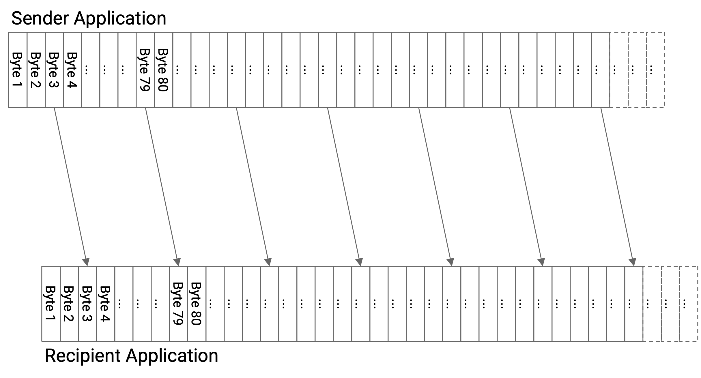

Để tạo thành các gói tin từ các byte trong bytestream, chúng ta sẽ giới thiệu một đơn vị dữ liệu được gọi là **TCP segment** (phân đoạn TCP). Việc triển khai TCP ở phía người gửi sẽ thu thập các byte từ bytestream, từng byte một, và đặt các byte đó vào một TCP segment. Khi TCP segment đầy (đạt đến một kích thước phân đoạn tối đa cố định), chúng ta gửi TCP segment đó, và sau đó bắt đầu một TCP segment mới.

Đôi khi, người gửi muốn gửi ít dữ liệu hơn kích thước phân đoạn tối đa. Trong trường hợp đó, chúng ta sẽ không muốn TCP segment phải chờ đợi mãi mãi để có thêm các byte không bao giờ đến. Để khắc phục điều này, chúng ta sẽ bắt đầu một bộ đếm thời gian mỗi khi chúng ta bắt đầu điền vào một phân đoạn trống mới. Nếu bộ đếm thời gian hết hạn, chúng ta sẽ gửi TCP segment, ngay cả khi nó chưa đầy.

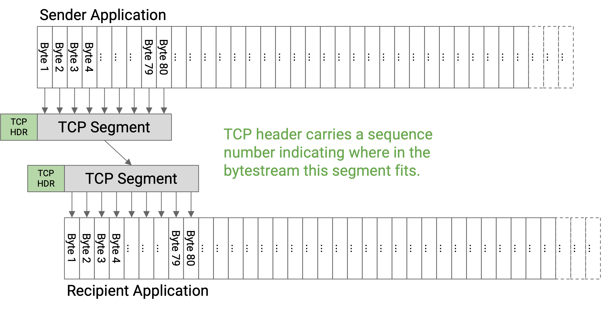

Trước khi gửi dữ liệu trong một TCP segment, việc triển khai TCP của người gửi sẽ thêm một TCP header (phần đầu TCP) với các siêu dữ liệu liên quan (ví dụ: sequence number, số cổng). Sau đó, phân đoạn và phần đầu được chuyển xuống IP layer (lớp IP), lớp này sẽ đính kèm một IP header (phần đầu IP) và gửi gói tin qua mạng.

TCP segment, với một TCP header và IP header ở trên, đôi khi được gọi là **TCP/IP packet** (gói tin TCP/IP). Tương đương, đây là một gói tin IP có phần tải (payload) bao gồm một TCP header và dữ liệu.

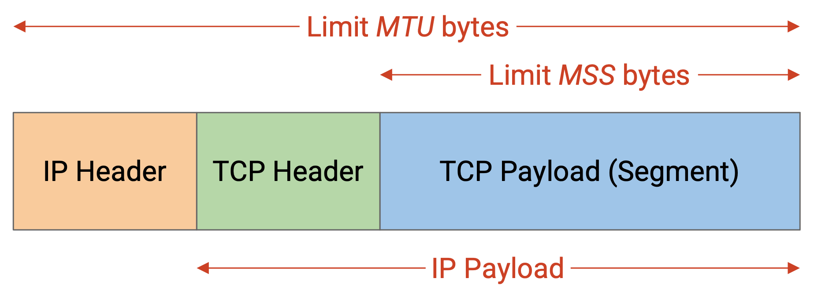

**Maximum segment size (MSS)** (kích thước phân đoạn tối đa) nên được đặt như thế nào? Hãy nhớ lại rằng kích thước của một gói tin IP bị giới hạn bởi maximum transmission unit (MTU) (đơn vị truyền tải tối đa) dọc theo mỗi liên kết. Tuy nhiên, gói tin IP cũng phải chứa IP header và TCP header, vì vậy maximum segment size của TCP sẽ nhỏ hơn một chút so với maximum transmission unit của IP. Cụ thể:

MSS (giới hạn TCP segment) = MTU (giới hạn gói tin IP) - kích thước IP header - kích thước TCP header

## Số Thứ tự (Sequence Numbers)

Cho đến nay, chúng ta đã gán nhãn cho mỗi gói tin bằng một con số, để người nhận có thể nhận các gói tin theo đúng thứ tự.

Trên thực tế, thay vì đánh số các phân đoạn riêng lẻ, chúng ta gán một số cho mỗi byte trong bytestream. TCP header của mỗi phân đoạn sẽ chứa một **sequence number** tương ứng với số của byte đầu tiên trong phân đoạn đó. Người nhận vẫn có thể sử dụng sequence numbers để xác định vị trí của mỗi phân đoạn trong bytestream, và lắp ráp lại các phân đoạn theo đúng thứ tự.

Mỗi bytestream bắt đầu với một **initial sequence number (ISN)** (số thứ tự ban đầu). Người gửi chọn một ISN và gán nhãn cho byte đầu tiên với số ISN+1, byte tiếp theo với số ISN+2, byte tiếp theo với ISN+3, và cứ thế tiếp tục.

Vì bây giờ chúng ta đang đánh số các byte thay vì các gói tin, số acknowledgement bây giờ cũng sẽ được tính theo byte, chứ không phải gói tin. Cụ thể, số acknowledgement cho biết, tôi đã nhận được tất cả các byte cho đến, nhưng không bao gồm, con số này. Tương đương, số acknowledgement đại diện cho byte tiếp theo mà nó mong đợi nhận được (nhưng chưa nhận được). Lưu ý rằng TCP đang sử dụng mô hình cumulative ack (thay vì full-information acks hoặc ack cho từng byte riêng lẻ).

Làm ví dụ, giả sử ISN đã được chọn ngẫu nhiên là 50. Khi đó, một vài byte đầu tiên có các số 51, 52, 53, v.v. Một TCP segment cụ thể có thể chứa các byte từ 140 đến 219, bao gồm cả hai. Sequence number của phân đoạn này là 140 (đại diện cho byte đầu tiên trong phân đoạn). Nếu người nhận đã nhận được mọi thứ cho đến nay, người nhận có thể xác nhận phân đoạn này bằng cách gửi một số ack là 220, là byte tiếp theo chưa được nhận.

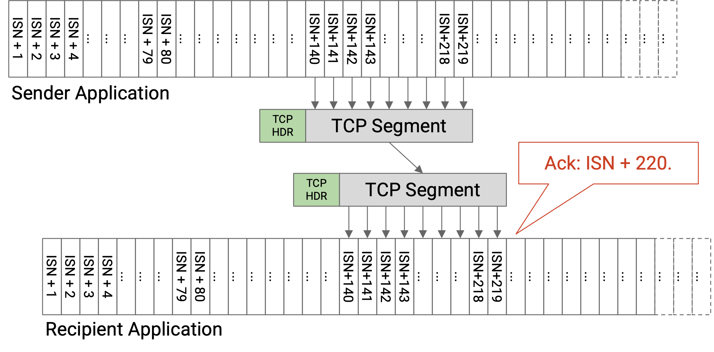

Tổng quát hơn, giả sử chúng ta có một gói tin trong đó byte đầu tiên có sequence number là X, và gói tin có B byte. Gói tin này có các byte X, X+1, X+2, ..., X+B-1. Nếu gói tin này (và tất cả dữ liệu trước đó) được nhận, ack sẽ xác nhận X+B (byte tiếp theo được mong đợi). Nếu gói tin này không được nhận, hoặc gói tin này được nhận nhưng một số gói tin trước đó không được nhận, thì ack sẽ xác nhận một số nhỏ hơn (bởi vì TCP sử dụng cumulative acks).

Tổng quát hơn nữa, giả sử chúng ta có nhiều gói tin, tất cả đều dài B byte. ISN là X, và kích thước cửa sổ là 1 (giao thức stop-and-wait, chỉ có một gói tin hoặc ack được gửi tại một thời điểm). Giả sử không có gói tin nào bị mất. Khi đó, các sequence number và số ack sẽ tiến hành như sau: Gói tin đầu tiên có sequence number X. Ack đầu tiên có số ack là X+B. Gói tin thứ hai có sequence number là X+B. Ack thứ hai có số ack là X+2B. Gói tin thứ ba có sequence number là X+2B, và cứ thế tiếp tục. Cụ thể, lưu ý rằng khi không có mất mát, số ack tương ứng với sequence number của gói tin tiếp theo.

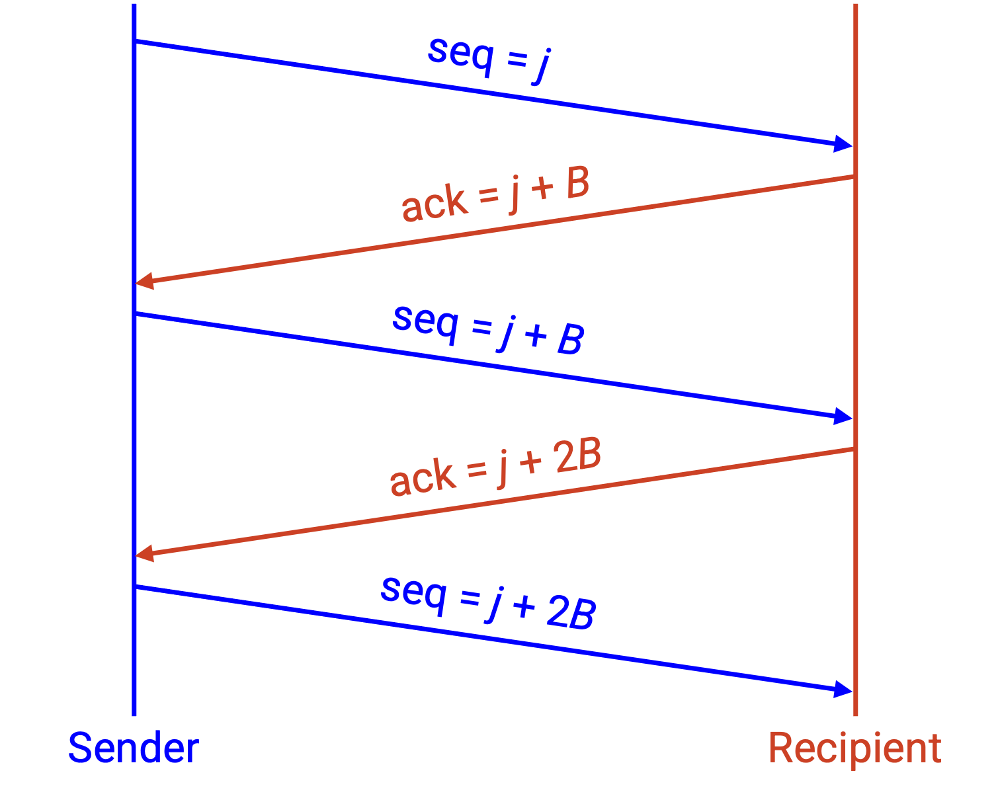

Trong lịch sử, ISN được chọn là ngẫu nhiên vì các nhà thiết kế lo ngại về các sequence number không rõ ràng nếu tất cả các bytestream đều bắt đầu đánh số từ 0. Cụ thể, giả sử một kết nối TCP gửi một số dữ liệu bắt đầu từ ISN 0, và sau đó người gửi bị treo. Nếu người gửi khởi động lại một kết nối mới, và ISN lại bắt đầu từ 0, người nhận có thể bị nhầm lẫn nếu thấy một gói tin có sequence number là 0. Gói tin này là từ kết nối đầu tiên trước khi bị treo, hay kết nối thứ hai sau khi bị treo?

Trên thực tế, ISN được chọn là ngẫu nhiên vì lý do bảo mật. Nếu ISN được chọn một cách có thể dự đoán được, những kẻ tấn công có thể suy ra ISN và gửi các gói tin giả mạo trông giống như chúng đến từ người gửi. Khi ISN được chọn ngẫu nhiên, kẻ tấn công khó suy ra ISN và gửi các gói tin giả mạo hơn.

## Trạng thái của TCP (TCP State)

Trong TCP, cả người gửi và người nhận đều cần duy trì trạng thái. Trạng thái được duy trì tại các máy chủ cuối triển khai TCP, chứ không phải trong mạng.

Người gửi phải nhớ những byte nào đã được gửi nhưng chưa được xác nhận. Người gửi cũng phải theo dõi các bộ đếm thời gian khác nhau, ví dụ: một bộ đếm thời gian cho việc khi nào gửi một phân đoạn chưa đầy, và một bộ đếm thời gian cho việc khi nào gửi lại các byte.

Người nhận phải nhớ các byte không theo thứ tự mà chưa thể được giao cho ứng dụng.

Bởi vì TCP yêu cầu lưu trữ trạng thái, mỗi bytestream được gọi là một **connection** (kết nối) hoặc **session** (phiên), và TCP là một giao thức hướng kết nối. Không giống như Lớp 3, nơi mọi gói tin có thể được xem xét riêng biệt, TCP yêu cầu cả hai bên phải thiết lập một connection và khởi tạo trạng thái trước khi có thể gửi dữ liệu. TCP cũng cần một cơ chế để hủy các connection để giải phóng bộ nhớ được phân bổ cho trạng thái trên cả hai máy chủ cuối.

## TCP là Duplex toàn phần

Cho đến nay, chúng ta đã xem TCP như một bytestream từ một máy chủ cuối (người gửi) đến máy chủ cuối kia (người nhận). Trên thực tế, hai máy chủ cuối thường muốn gửi tin nhắn theo cả hai hướng.

Để hỗ trợ gửi tin nhắn theo cả hai hướng, các connection TCP là **full duplex** (song công toàn phần). Thay vì chỉ định một người gửi và một người nhận, cả hai máy chủ cuối trong connection có thể gửi và nhận dữ liệu đồng thời, trong cùng một connection.

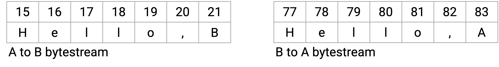

Để hỗ trợ gửi dữ liệu theo cả hai hướng, mỗi connection TCP có hai bytestream: một chứa dữ liệu từ A đến B, và cái còn lại chứa dữ liệu từ B đến A. Mỗi gói tin có thể chứa cả dữ liệu và thông tin acknowledgement. Sequence number sẽ tương ứng với bytestream của người gửi (các byte tôi đang gửi), và số acknowledgement sẽ tương ứng với bytestream của người nhận (các byte tôi đã nhận từ bạn).

## TCP Handshake

Hãy nhớ lại rằng TCP là hướng kết nối, vì vậy các connection phải được tạo và hủy một cách tường minh. Cũng hãy nhớ lại rằng các bytestream bắt đầu tại một initial sequence number (ISN) được chọn ngẫu nhiên, và mỗi connection TCP là full-duplex (hai bytestream, một theo mỗi hướng). Khi chúng ta tạo một connection mới, chúng ta cần cả hai bên đồng ý về hai ISN khởi đầu (một cho mỗi hướng).

Để thiết lập một connection TCP, hai máy chủ thực hiện một **three-way handshake** (bắt tay ba bước) để đồng ý về các ISN ở mỗi hướng.

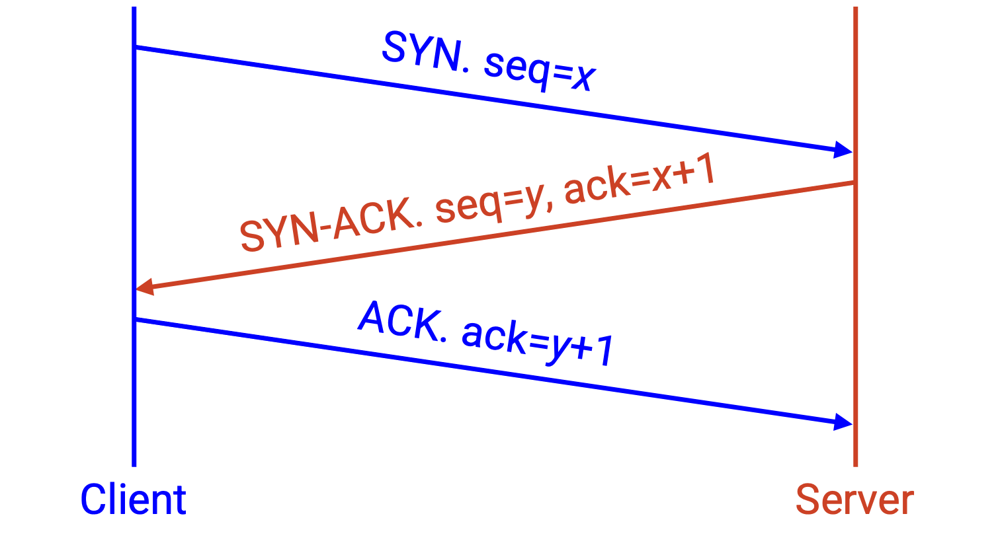

Gói tin đầu tiên (từ A đến B) là tin nhắn **SYN** (tin nhắn SYN). Tin nhắn này chứa ISN của A (dữ liệu từ A đến B sẽ bắt đầu đếm từ ISN này), trong sequence number.

Gói tin thứ hai (từ B đến A) là tin nhắn **SYN-ACK** (tin nhắn SYN-ACK). Tin nhắn này chứa ISN của B (dữ liệu từ B đến A sẽ bắt đầu đếm từ ISN này), trong sequence number. Tin nhắn này cũng xác nhận rằng B đã nhận được ISN của A, trong số ack.

Gói tin thứ ba (lại từ A đến B) là tin nhắn **ACK** (tin nhắn ACK). Tin nhắn này xác nhận rằng A đã nhận được ISN của B, trong số ack.

Cái handshake này là lý do tại sao các bytestream bắt đầu đếm từ ISN+1. Khi tôi gửi một ISN, ack là ISN+1, cho biết rằng ISN đã được nhận, và byte (đầu tiên) tiếp theo được mong đợi là ISN+1.

Sau khi three-way handshake kết thúc, B có thể bắt đầu gửi dữ liệu.

## Kết thúc Kết nối (Ending Connections)

Có hai cách để kết thúc một connection.

Trong trường hợp bình thường, khi tôi gửi xong tin nhắn, tôi có thể gửi một FIN packet (gói tin FIN) đặc biệt, có nội dung: Tôi sẽ không gửi thêm bất kỳ dữ liệu nào nữa, nhưng tôi sẽ tiếp tục nhận dữ liệu nếu bạn còn gì để gửi. Tại thời điểm này, connection được đóng một nửa. Gói tin này sẽ được xác nhận, giống như bất kỳ gói tin nào khác.

Cuối cùng, phía bên kia cũng sẽ gửi xong dữ liệu và gửi một FIN packet. Khi FIN packet này được xác nhận, connection sẽ được đóng.

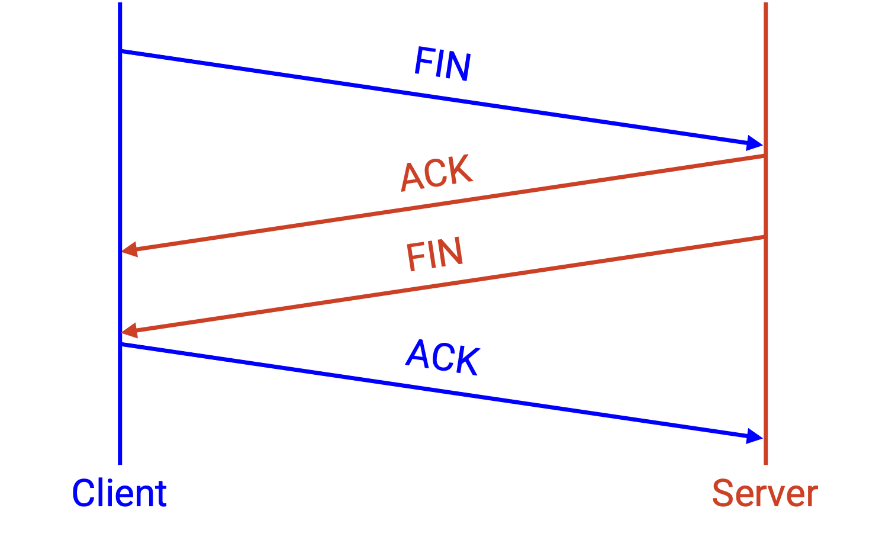

Đôi khi, chúng ta phải chấm dứt một connection một cách đột ngột, mà không có sự đồng ý của phía bên kia. Để đơn phương kết thúc một connection, tôi có thể gửi một RST packet (gói tin RST) đặc biệt, có nội dung: Tôi sẽ không gửi hoặc nhận thêm bất kỳ dữ liệu nào nữa. Gói tin này không cần phải được xác nhận, và tôi có thể hủy connection của mình ngay khi tôi gửi dữ liệu này.

Các RST packet thường được sử dụng khi một máy chủ gặp lỗi và không thể tiếp tục gửi hoặc nhận các gói tin. Lưu ý rằng bất kỳ dữ liệu nào đang in-flight sẽ bị mất nếu một RST xảy ra và máy chủ cuối bị treo và mất trạng thái của nó.

Nếu tôi đã gửi một RST, và ai đó tiếp tục gửi dữ liệu cho tôi, nếu có thể, tôi sẽ tiếp tục gửi các bản sao của RST packet để liên tục cố gắng chấm dứt connection.

Các RST packet cũng có thể được những kẻ tấn công sử dụng để kiểm duyệt các connection. Một kẻ tấn công có thể giả mạo và tiêm một RST packet, điều này khiến toàn bộ connection bị chấm dứt.

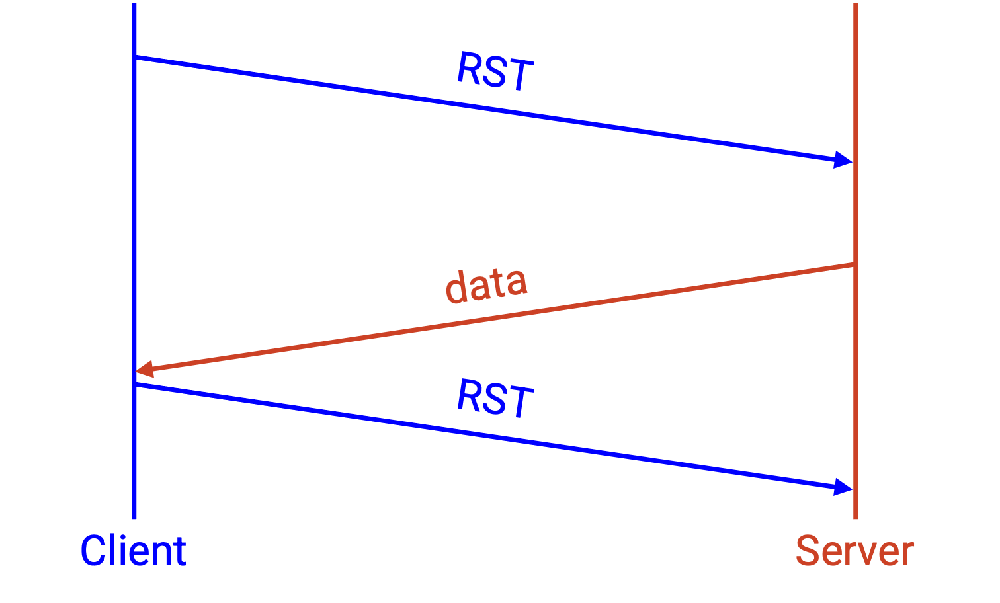

Sơ đồ trạng thái TCP đầy đủ khá phức tạp, với nhiều trạng thái trung gian trong quá trình mở hoặc đóng một connection. Ví dụ về các trạng thái trung gian bao gồm: Tôi đã gửi một SYN, và đang chờ một SYN-ACK. Hoặc, tôi đã nhận một FIN, đã gửi FIN của mình, nhưng đang chờ FIN của mình được xác nhận. Hầu hết các connection TCP dành phần lớn thời gian của chúng ở trạng thái Established (Đã thiết lập), nơi connection đã bắt đầu (nhưng chưa kết thúc), và dữ liệu đang được trao đổi qua lại. Bạn không cần phải hiểu toàn bộ sơ đồ trạng thái này cho các ghi chú này.

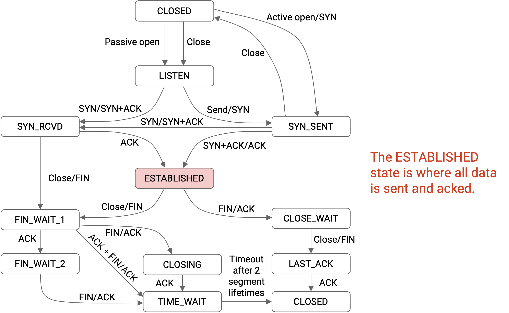

Trong sơ đồ trạng thái đơn giản hóa, chúng ta bắt đầu ở trạng thái đóng (không có connection nào đang diễn ra). Để bắt đầu một connection, chúng ta gửi một SYN. Cuối cùng, chúng ta nhận được một SYN-ACK và trả lời bằng một ACK, chuyển sang một connection đã được thiết lập. Khi chúng ta gửi xong dữ liệu, chúng ta gửi một FIN, và nhận một ACK. Cuối cùng, chúng ta nhận được một FIN, và connection lại được đóng.

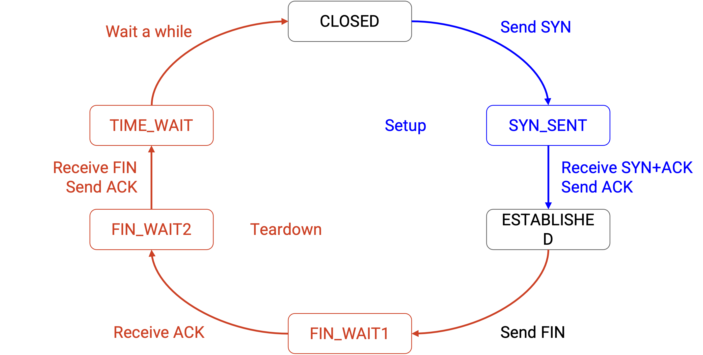

## Gửi ké (Piggybacking)

Bởi vì TCP là full duplex, có thể một gói tin vừa xác nhận một số dữ liệu vừa gửi dữ liệu mới.

Khi người nhận nhận được một gói tin, nếu nó không có dữ liệu để gửi, người nhận có hai lựa chọn. Người nhận có thể gửi ngay ack, mà không có dữ liệu để gửi. Hoặc, người nhận có thể đợi cho đến khi có dữ liệu để gửi, và sau đó gửi ack cùng với dữ liệu mới. Cách tiếp cận thứ hai này được gọi là **piggybacking** (gửi ké).

Trên thực tế, một lý do chúng ta có thể không piggybacking là vì TCP được triển khai trong hệ điều hành, tách biệt với ứng dụng.

Hãy xem xét hệ điều hành, không biết ứng dụng đang làm gì. Khi hệ điều hành nhận được một gói tin, nó không biết khi nào người gửi sẽ có thêm dữ liệu để gửi (hoặc liệu người gửi có bao giờ có thêm dữ liệu để gửi hay không), vì vậy nó có thể bị kẹt trong việc chờ đợi một thời gian dài trước khi có thể piggybacking ack với một số dữ liệu mới.

Ở phía bên kia, hãy xem xét ứng dụng, không biết hệ điều hành đang làm gì. Ứng dụng đang chạy trên trừu tượng hóa bytestream, và hoàn toàn không nghĩ về các gói tin, vì vậy nó không có cách nào để nghĩ về piggybacking.

Piggybacking còn phức tạp hơn bởi thực tế là hệ điều hành không chạy mọi chương trình đồng thời. Nhớ lại một khóa học kiến trúc máy tính (như CS 61C tại UC Berkeley), CPU liên tục chuyển đổi giữa các tiến trình khác nhau trên máy tính của bạn, tùy thuộc vào những gì cần chú ý. Sẽ khá ngớ ngẩn nếu, mỗi khi một gói tin TCP đến, CPU ngắt những gì nó đang làm để chuyển gói tin đó cho ứng dụng, và cho ứng dụng một chút thời gian để phản hồi. Thay vào đó, khi một gói tin TCP đến, hệ điều hành có thể gửi đi ack, trước khi ứng dụng có cơ hội piggybacking dữ liệu mới trên ack.

Một trường hợp mà dữ liệu luôn được piggybacked là gói tin SYN-ACK trong handshake. Ngoài ack, chúng ta đang piggybacking initial sequence number của chính mình. Điều này không có vấn đề đã thảo luận ở trên, vì TCP handshake hoàn toàn được thực hiện bởi hệ điều hành. (Ứng dụng hoàn toàn không nghĩ về các gói tin SYN hoặc SYN-ACK.)

## Sliding Window

Khi chúng ta thảo luận về các gói tin, chúng ta đã định nghĩa cửa sổ là số lượng gói tin có thể in flight tại bất kỳ thời điểm nào. Bây giờ chúng ta đang triển khai TCP dưới dạng byte, chúng ta sẽ định nghĩa **sliding window** (cửa sổ trượt) là số lượng byte liên tục tối đa có thể in flight tại bất kỳ thời điểm nào.

Việc hạn chế các byte in flight phải liên tục là khác so với trước đây. Định nghĩa cửa sổ dựa trên gói tin của chúng ta cho phép các gói tin không liên tục (ví dụ: 5, 7, 8) được in-flight. Tuy nhiên, các byte in flight được yêu cầu phải liên tiếp, không có khoảng trống. Yêu cầu này tạo ra một cửa sổ (phạm vi các byte) trong luồng byte.

Bên trái của cửa sổ là byte đầu tiên chưa được xác nhận (được xác định bởi số ack từ người nhận). Bắt đầu từ byte này, W byte tiếp theo, cho đến bên phải của cửa sổ, có thể in-flight.

Lưu ý rằng ngay cả khi một số byte trung gian trong cửa sổ này đã được xác nhận, chúng ta vẫn không thể gửi thêm byte nào ngoài cửa sổ. Cách duy nhất chúng ta có thể gửi thêm byte là nếu cửa sổ trượt sang phải, tức là khi số ack tăng lên (các byte ở bên trái của cửa sổ được xác nhận).

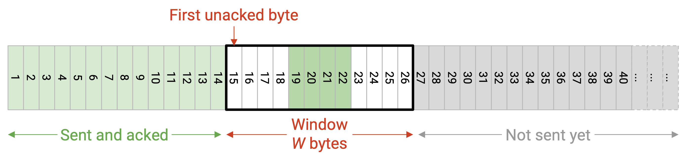

Hãy nhớ lại rằng kích thước cửa sổ (xác định cạnh phải của cửa sổ) bị giới hạn bởi flow control và congestion control. Trong trường hợp flow control, kích thước cửa sổ được quyết định bởi cửa sổ được quảng bá bởi người nhận. Người nhận quyết định advertised window dựa trên lượng không gian bộ đệm có sẵn ở phía người nhận.

## Phát hiện mất mát và hửi lại Dữ liệu (Detecting Loss and Re-Sending Data)

Có hai điều kiện để dữ liệu được gửi lại. Chỉ cần một điều kiện (không phải cả hai) là đúng để kích hoạt việc gửi lại.

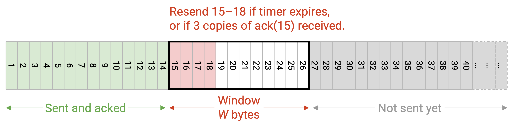

Tác nhân kích hoạt đầu tiên cho việc truyền lại là một bộ đếm thời gian (dữ liệu không được xác nhận sau một khoảng thời gian). Trong TCP dựa trên gói tin, mỗi gói tin có một bộ đếm thời gian, và khi bộ đếm thời gian hết hạn mà gói tin đó chưa được xác nhận, chúng ta sẽ gửi lại gói tin đó.

Trong TCP dựa trên byte, thay vì một bộ đếm thời gian cho mỗi byte hoặc mỗi gói tin, chúng ta sẽ chỉ có một bộ đếm thời gian duy nhất, tương ứng với byte đầu tiên chưa được xác nhận (bên trái của cửa sổ). Nếu bộ đếm thời gian hết hạn, chúng ta sẽ gửi lại phân đoạn chưa được xác nhận ở ngoài cùng bên trái. Hãy nhớ lại rằng độ dài bộ đếm thời gian dựa trên RTT, và RTT được ước tính bằng cách sử dụng các phép đo thời gian giữa việc gửi dữ liệu và nhận ack. Cũng hãy nhớ lại rằng bộ đếm thời gian được đặt lại mỗi khi một ack mới đến (và cửa sổ thay đổi).

Tác nhân kích hoạt thứ hai cho việc truyền lại là giả định rằng dữ liệu bị mất khi chúng ta nhận được ack cho các gói tin tiếp theo. Trong TCP dựa trên gói tin với cumulative acks (là những gì TCP sử dụng), chúng ta sẽ gửi lại một gói tin nếu chúng ta nhận được K duplicate acks (K=3 là phổ biến), điều này cho thấy rằng ba gói tin tiếp theo đã được xác nhận.

Trong TCP dựa trên byte, nếu chúng ta nhận được K duplicate acks, chúng ta sẽ gửi lại phân đoạn chưa được xác nhận ở ngoài cùng bên trái.

## TCP Header

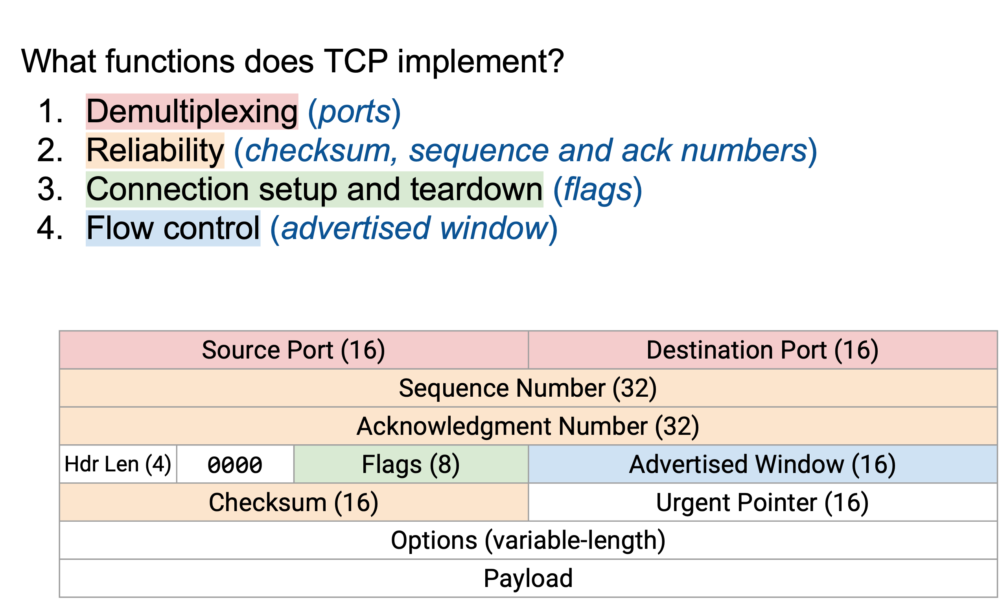

TCP header có các source and destination ports (cổng nguồn và cổng đích) 16-bit.

TCP header có một sequence number 32-bit (độ lệch byte của byte đầu tiên trong gói tin này), và một số acknowledgement 32-bit (số thứ tự liên tục cao nhất đã nhận, cộng một).

TCP header có một checksum trên toàn bộ dữ liệu (không chỉ phần đầu), để phát hiện dữ liệu bị hỏng.

TCP header có advertised window, được sử dụng để hỗ trợ flow control và congestion control.

Header length (độ dài phần đầu) chỉ định số lượng từ 4-byte trong TCP header. Giả sử không có tùy chọn bổ sung nào, độ dài này là 5.

Các flags (cờ) là một chuỗi các bit có thể được đặt thành 1 hoặc 0. Khi một bit được đặt thành 1, cờ tương ứng được bật. Mọi người đều hiểu ngữ nghĩa của phần đầu, vì vậy họ biết bit nào tương ứng với cờ nào. Có bốn cờ liên quan cho các ghi chú này.

Cờ SYN (synchronize - đồng bộ hóa) được bật khi máy chủ đang gửi ISN của nó. Cờ này thường chỉ được bật trong hai tin nhắn đầu tiên của three-way handshake.

Cờ ACK (acknowledge - xác nhận) được bật khi số acknowledgement có liên quan và đang được sử dụng để xác nhận dữ liệu. Nếu tôi muốn gửi dữ liệu, nhưng không nhận được bất kỳ dữ liệu nào cần được xác nhận, tôi có thể tắt cờ này, điều này cho máy chủ khác biết để bỏ qua số ack.

Có 6 bit dành riêng sau header length luôn được đặt thành 0. Bạn có thể bỏ qua chúng một cách an toàn.

Urgent pointer (con trỏ khẩn) có thể được sử dụng để đánh dấu một số byte là khẩn cấp, điều này cho người nhận biết để gửi dữ liệu này đến ứng dụng càng sớm càng tốt. Đây là một trường lịch sử mà chúng ta sẽ không đề cập thêm.

TCP header có thể có các tùy chọn bổ sung được nối vào cuối (điều này sẽ làm cho phần đầu dài hơn), nhưng chúng ta sẽ bỏ qua các tùy chọn cho lớp học này. Ví dụ, nếu bạn muốn triển khai full-information acks, có một tùy chọn gọi là selective acknowledgements (SACK) (tin báo nhận chọn lọc) có thể được thêm vào phần đầu.