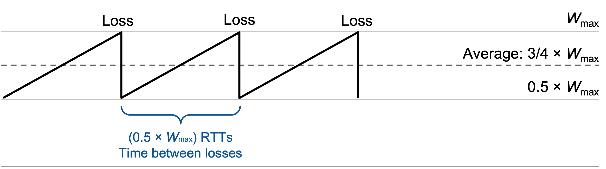
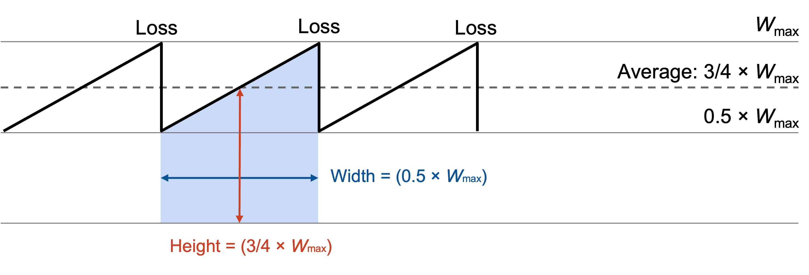
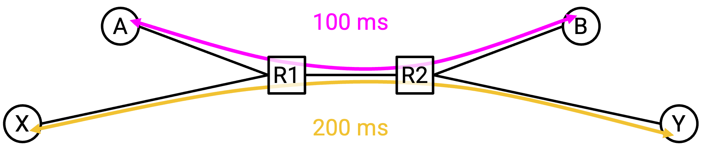

# Mô hình Thông lượng TCP (*TCP Throughput Model*)

## Các giả định mô hình hóa

Trong các phần trước, chúng ta đã xây dựng một thuật toán điều khiển tắc nghẽn (*congestion control*). Thuật toán này cho chúng ta biết cách điều chỉnh tốc độ truyền dữ liệu khi gặp tắc nghẽn, nhưng nó không thực sự cho biết tốc độ đó là bao nhiêu.

Trong phần này, chúng ta sẽ xây dựng một mô hình để ước lượng **throughput** (*thông lượng*) của một kết nối TCP trên một tuyến đường cụ thể. Cụ thể, chúng ta muốn có một phương trình đơn giản thể hiện thông lượng dưới dạng hàm của **RTT** (*Round-Trip Time – thời gian khứ hồi*) và **loss rate** (*tỷ lệ mất gói*). Phương trình này cho phép các nhà vận hành và khách hàng ước lượng tốc độ của một kết nối TCP.

Để đơn giản hóa mô hình, chúng ta sẽ đưa ra một vài giả định: Chỉ có một kết nối TCP duy nhất. Chúng ta bỏ qua giai đoạn khởi động chậm (*slow-start*). Chúng ta giả định RTT là một hằng số cố định.

Khi kích thước cửa sổ truyền đạt đến giới hạn băng thông cổ chai cực đại $$W_\text{max}$$ (một hằng số), chúng ta giả định sẽ xảy ra đúng một lần mất gói. Vì chỉ mất một gói tin, nên việc mất gói sẽ được phát hiện thông qua các **duplicate ACKs** (*ACK trùng lặp*), không phải qua timeout.

## Thông lượng theo Kích thước Cửa sổ

Trong mô hình đơn giản này, chúng ta phát hiện mất gói khi kích thước cửa sổ đạt $$W_\text{max}$$, và sau đó cửa sổ bị giảm xuống còn $$\frac{1}{2} W_\text{max}$$.

Sau đó, với mỗi RTT tiếp theo, kích thước cửa sổ sẽ tăng thêm 1: $$\frac{1}{2} W_\text{max} + 1$$, rồi $$\frac{1}{2} W_\text{max} + 2$$, rồi $$\frac{1}{2} W_\text{max} + 3$$, v.v. Cuối cùng, cửa sổ sẽ đạt lại $$W_\text{max}$$ và bị giảm một nửa, quá trình này sẽ lặp lại.

Bắt đầu từ $$\frac{1}{2} W_\text{max}$$ và tăng lên đến $$W_\text{max}$$ mất $$\frac{1}{2} W_\text{max}$$ RTT (mỗi lần tăng 1, mỗi lần là một RTT). Điều này cũng cho thấy có $$\frac{1}{2} W_\text{max}$$ RTT giữa mỗi lần mất gói.

Trong mỗi RTT, kích thước cửa sổ trung bình là $$\frac{3}{4} W_\text{max}$$ (nằm giữa $$\frac{1}{2} W_\text{max}$$ và $$W_\text{max}$$).

Kích thước cửa sổ được đo bằng số gói tin (vì mỗi lần tăng là thêm 1 gói). Mỗi gói tin có thể chứa $$\text{MSS}$$ byte (*Maximum Segment Size – kích thước đoạn tối đa*), nên kích thước cửa sổ trung bình tính theo byte là $$\frac{3}{4} W_\text{max} \times \text{MSS}$$.

Kích thước cửa sổ cho biết lượng dữ liệu có thể gửi trong mỗi RTT. Do đó, để tính tốc độ truyền, ta chia kích thước cửa sổ (dữ liệu) cho RTT (thời gian), thu được tốc độ trung bình là $$\frac{3}{4} W_\text{max} \times \frac{\text{MSS}}{\text{RTT}}$$.

## Thông lượng theo Tỷ lệ Mất gói

Phương trình thông lượng hiện tại là:  
$$\frac{3}{4} W_\text{max} \times \frac{\text{MSS}}{\text{RTT}}$$.

Nhưng mục tiêu của chúng ta là biểu diễn thông lượng theo RTT và tỷ lệ mất gói $$p$$. Vì vậy, ta cần biểu diễn $$W_\text{max}$$ theo $$p$$.

Từ trước, ta đã suy ra rằng một gói tin bị mất sau mỗi $$\frac{1}{2} W_\text{max}$$ RTT. Đây là thời gian cần thiết để tăng cửa sổ từ $$\frac{1}{2} W_\text{max}$$ lên $$W_\text{max}$$ và gặp lại mất gói.

Vậy để xác định tỷ lệ mất gói, ta cần biết có bao nhiêu gói tin được gửi trong $$\frac{1}{2} W_\text{max}$$ RTT.

Về mặt đồ họa, số gói tin gửi được là diện tích của hình này (tốc độ × thời gian), hay chính là diện tích dưới đường cong (đường cong biểu diễn tốc độ, và ta cần tích phân của tốc độ).

Ta đã biết kích thước cửa sổ trung bình là $$\frac{3}{4} W_\text{max}$$, tức là số gói tin gửi mỗi RTT. Vậy trong $$\frac{1}{2} W_\text{max}$$ RTT, ta gửi được:  
$$(\frac{1}{2} W_\text{max}) \times \frac{3}{4} W_\text{max} = \frac{3}{8} W_\text{max}^2$$ gói tin.

Giờ ta biết số gói tin gửi giữa các lần mất gói, nên tỷ lệ mất gói là một gói bị mất chia cho số gói gửi giữa các lần mất. (Ví dụ: nếu gửi 100 gói giữa các lần mất, thì tỷ lệ mất gói là khoảng 1/100).

Vậy tỷ lệ mất gói là:  
$$p = \frac{1}{\frac{3}{8} W_\text{max}^2} = \frac{8}{3W_\text{max}^2}$$.

Giờ ta có mối quan hệ giữa $$W_\text{max}$$ và $$p$$, ta chỉ cần biến đổi đại số để biểu diễn $$W_\text{max}$$ theo $$p$$:

$$\begin{align*}
    p &= \frac{8}{3W_\text{max}^2} \\
    3W_\text{max}^2 p &= 8 \\
    W_\text{max}^2 &= \frac{8}{3p} \\
    W_\text{max} &= \frac{2\sqrt{2}}{\sqrt{3p}}
\end{align*}$$

Giờ ta thay $$W_\text{max}$$ vào phương trình thông lượng ban đầu:

$$\begin{align*}
    \text{throughput} &= \frac{3}{4} W_\text{max} \times \frac{\text{MSS}}{\text{RTT}} \\
    &= \frac{3}{4} \left(\frac{2\sqrt{2}}{\sqrt{3p}}\right) \times \frac{\text{MSS}}{\text{RTT}} \\
    &= \sqrt{\frac{3}{2}} \times \frac{\text{MSS}}{\text{RTT}\sqrt{p}}
\end{align*}$$

## Ý nghĩa của Phương trình

Giờ ta có phương trình thông lượng biểu diễn theo RTT và tỷ lệ mất gói. Nó cho ta biết điều gì?

Thông lượng tỷ lệ nghịch với căn bậc hai của tỷ lệ mất gói. Trực giác cho thấy nếu tỷ lệ mất gói cao hơn, thì thông lượng thấp hơn. Điều này hợp lý, vì mất nhiều gói hơn khiến cửa sổ bị giảm một nửa thường xuyên hơn.

Thông lượng cũng tỷ lệ nghịch với RTT. Trực giác cho thấy nếu RTT thấp hơn, thì thông lượng cao hơn. Điều này hợp lý, vì cửa sổ tăng mỗi khi nhận được ACK, và RTT thấp giúp nhận ACK nhanh hơn.

Mối quan hệ giữa RTT và thông lượng có thể gây vấn đề nếu có nhiều kết nối với RTT khác nhau.

Kết nối có RTT thấp hơn sẽ nhận ACK nhanh hơn, đồng nghĩa với việc tăng cửa sổ nhanh hơn và gửi gói nhanh hơn. Trong trường hợp này, kết nối có RTT thấp hơn sẽ chiếm gấp đôi băng thông so với kết nối có RTT cao hơn.

Về bản chất, TCP là "không công bằng" khi RTT không đồng đều. RTT ngắn giúp cải thiện thời gian lan truyền, nhưng cũng giúp TCP tăng tốc độ nhanh hơn. Chúng ta chấp nhận điều này như một đặc điểm của TCP, và không có biện pháp xử lý trong thực tế.