# Thiết kế Kiểm soát Tắc nghẽn (CC Design)

## Phác thảo Thuật toán dựa trên Máy chủ

Hầu hết các thuật toán dựa trên máy chủ đều tuân theo cùng một phương pháp chung, và sự khác biệt nảy sinh ở ba điểm lựa chọn chính.

Mỗi nguồn chạy độc lập logic sau đây một cách lặp đi lặp lại trong một vòng lặp: Thử gửi ở một rate (tốc độ) R trong một khoảng thời gian nào đó. Sau đó, tự hỏi: Liệu tôi có gặp phải congestion (sự tắc nghẽn) trong khoảng thời gian này không? Nếu có, thì giảm R. Nếu không, thì tăng R.

Một mảnh ghép còn thiếu là: chúng ta bắt đầu gửi ở rate ban đầu nào? Chúng ta sẽ cần một cách nào đó để chọn rate ban đầu R.

Ba điểm lựa chọn chính là: Làm thế nào để chúng ta chọn rate ban đầu? Làm thế nào để chúng ta phát hiện congestion? Chúng ta nên tăng và giảm bao nhiêu mỗi lần?

## Phát hiện Tắc nghẽn

Làm thế nào người gửi phát hiện ra nếu mạng bị tắc nghẽn? Có hai cách tiếp cận phổ biến.

Người gửi có thể kiểm tra packet loss (mất gói tin). Đây là phương pháp thường được TCP sử dụng. Cách tiếp cận này tốt vì tín hiệu là rõ ràng. Mỗi packet hoặc được đánh dấu là bị mất (timeout (hết thời gian chờ) hoặc duplicate ack (ack trùng lặp)), hoặc không bị mất. Ngoài ra, TCP đã phát hiện các packet bị mất để gửi lại chúng, vì vậy chúng ta không cần phải triển khai lại điều này từ đầu.

Cách tiếp cận này có thể không tốt vì đôi khi, packet loss là do corruption (lỗi dữ liệu) (checksum không hợp lệ), chứ không phải do congestion. Trên thực tế, TCP bị nhầm lẫn và hoạt động kém khi một liên kết không bị tắc nghẽn, nhưng thường xuyên làm hỏng các packet. Ngoài ra, TCP có thể bị nhầm lẫn bởi các packet bị reordered (sắp xếp lại thứ tự). Một packet đến muộn có thể bị coi nhầm là đã mất.

Một nhược điểm quan trọng khác của cách tiếp cận này là, chúng ta phát hiện congestion muộn. Vào thời điểm các packet bắt đầu bị loại bỏ, hàng đợi của router đã đầy và các packet đang bị trễ.

Thay vì kiểm tra packet loss, người gửi có thể phát hiện congestion bằng cách kiểm tra packet delay (độ trễ gói tin). Người gửi có thể đo thời gian giữa việc gửi một packet và nhận được ack cho packet đó. Nếu người gửi nhận thấy rằng độ trễ đang tăng lên, đó có thể là một dấu hiệu của congestion.

Trong lịch sử, việc đo lường độ trễ một cách chính xác được coi là khó khăn. Packet delay có thể thay đổi tùy thuộc vào kích thước hàng đợi và lưu lượng khác. Trong nhiều năm, phương pháp dựa trên độ trễ không được triển khai rộng rãi, mặc dù trong những năm gần đây, giao thức BBR của Google (2016) đã cho thấy rằng các thuật toán dựa trên độ trễ là khả thi, và một số dịch vụ (ví dụ: các dịch vụ của Google) đã áp dụng các thuật toán dựa trên độ trễ.

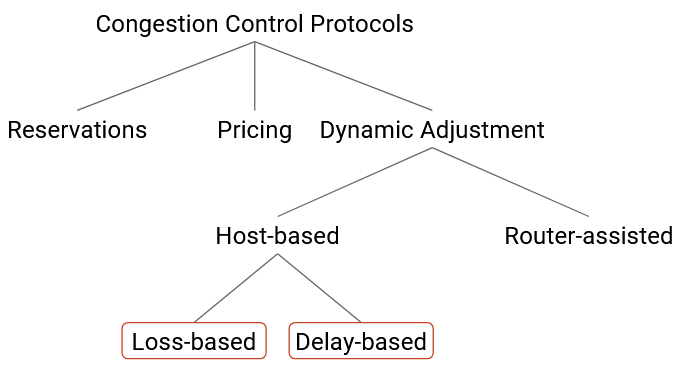

## Khám phá Tốc độ ban đầu

Khi một kết nối mới bắt đầu, chúng ta phải tìm ra một rate ban đầu để gửi các packet. Chúng ta có thể tìm ra một rate ban đầu bằng cách sử dụng một quy trình khám phá, trong đó chúng ta thử một vài rate khác nhau để có được ước tính về bandwidth khả dụng.

Chúng ta muốn quy trình khám phá này phải an toàn, vì vậy chúng ta nên bắt đầu với các rate chậm. Chúng ta không muốn ngay lập tức làm ngập mạng với các packet.

Đồng thời, chúng ta muốn quy trình khám phá nhanh chóng tìm ra bandwidth khả dụng, vì lý do hiệu quả. Để đạt được điều này, chúng ta sẽ nhanh chóng tăng rate trong mỗi lần thử tiếp theo. Nếu quá trình khám phá mất nhiều thời gian, chúng ta đã lãng phí thời gian mà lẽ ra có thể dành để gửi các packet ở rate tối ưu. Ví dụ, giả sử chúng ta cộng thêm 0.5 Mbps vào rate mỗi 100ms, cho đến khi chúng ta phát hiện congestion (mất mát). Nếu bandwidth khả dụng là 1 Mbps, giai đoạn khám phá sẽ mất 2 lần lặp = 200 ms. Tuy nhiên, nếu bandwidth khả dụng là 1 Gbps = 1000 Mbps, thì giai đoạn khám phá sẽ mất 2000 lần lặp = 200 giây trước khi chúng ta tăng tốc đến một rate tốt, điều này quá dài. Internet có rất nhiều tốc độ liên kết khác nhau, vì vậy cả hai khả năng đều có thể xảy ra trong thực tế.

Để hỗ trợ việc bắt đầu chậm nhưng tăng tốc nhanh, chúng ta sẽ tăng bandwidth theo một hệ số nhân mỗi lần (thay vì một hệ số cộng). Giải pháp này được gọi là **slow start (khởi động chậm)**, mặc dù đây có thể là một cái tên không trực quan. Trong slow start, chúng ta bắt đầu với một rate nhỏ mà gần như luôn luôn nhỏ hơn nhiều so với bandwidth thực tế. Sau đó, chúng ta tăng rate theo cấp số nhân (ví dụ: nhân đôi rate mỗi lần) cho đến khi gặp phải packet loss. Một rate an toàn để sử dụng là rate ngay trước khi chúng ta gặp packet loss (chúng ta không muốn sử dụng một rate mà chúng ta đã gặp packet loss). Về mặt hình thức, nếu packet loss xảy ra ở rate R, thì rate an toàn là R/2.

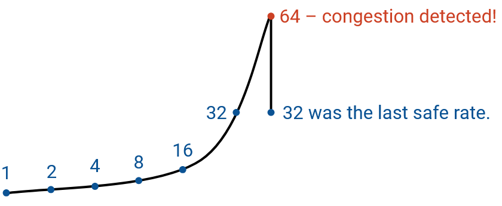

## Điều chỉnh: Phản ứng với Tắc nghẽn

Hãy nhớ lại rằng sau giai đoạn khám phá, chúng ta sẽ liên tục điều chỉnh bandwidth, vì bản thân mạng đang thay đổi, và bandwidth khả dụng không phải là hằng số.

Điểm lựa chọn cuối cùng là quyết định chúng ta nên giảm bandwidth bao nhiêu nếu phát hiện congestion, và tăng bandwidth bao nhiêu nếu không phát hiện congestion.

Quyết định của chúng ta sẽ xác định tốc độ một máy chủ thích ứng với những thay đổi về bandwidth khả dụng, điều này lại quyết định hiệu quả tiêu thụ bandwidth. Nếu chúng ta mất nhiều thời gian để thích ứng với những thay đổi và tìm ra một rate tốt, chúng ta sẽ dành nhiều thời gian hoạt động ở bandwidth dưới mức tối ưu, điều này không hiệu quả. Sự thích ứng chậm cũng có thể dẫn đến các vấn đề về tính công bằng. Ví dụ, nếu tôi đang sử dụng toàn bộ bandwidth của một liên kết, và một kết nối khác được mở, tôi cần phải nhanh chóng thích ứng và giảm bandwidth của mình để chia sẻ liên kết.

Hãy nhớ lại rằng các mục tiêu chính của chúng ta trong một thuật toán kiểm soát tắc nghẽn là efficiency (hiệu quả) (sử dụng tất cả bandwidth khả dụng) và fairness (tính công bằng) (các kết nối chia sẻ bandwidth một cách bình đẳng). Chúng ta sẽ cần chọn các quy tắc tăng và giảm để đạt được cả hai mục tiêu này.

Chúng ta có thể chọn những quy tắc nào? Ở cấp độ cao, chúng ta có thể phản ứng nhanh hoặc chậm. Cụ thể hơn, những thay đổi nhanh là theo cấp số nhân, ví dụ: nhân đôi hoặc chia đôi rate trong mỗi lần lặp. Những thay đổi chậm là theo cấp số cộng, ví dụ: cộng 1 vào rate hoặc trừ 1 khỏi rate trong mỗi lần lặp. Những tùy chọn này tạo ra bốn phương án khả thi:

**AIAD**: additive increase (tăng tuyến tính), additive decrease (giảm tuyến tính)

**AIMD**: additive increase, multiplicative decrease (giảm theo cấp số nhân)

**MIAD**: multiplicative increase (tăng theo cấp số nhân), additive decrease

**MIMD**: multiplicative increase, multiplicative increase

Trong bốn phương án này, hóa ra AIMD (tăng chậm, giảm nhanh) là tốt nhất để đạt được efficiency và fairness.

Về mặt trực quan, AIMD là một lựa chọn hợp lý vì gửi quá nhiều còn tệ hơn gửi quá ít. Khi rate của chúng ta quá cao, chúng ta gây ra congestion, và các packet bị loại bỏ. Khi rate của chúng ta quá thấp, chúng ta không sử dụng hết bandwidth, nhưng ít nhất chúng ta không gây ra congestion.

AIMD dẫn đến hành vi mà chúng ta từ từ tăng rate khi không có congestion, dần dần tiến đến bandwidth tối đa. Sau đó, ngay khi chúng ta vượt quá bandwidth tối đa và phát hiện congestion, chúng ta nhanh chóng giảm xuống. Bằng cách này, chúng ta dành phần lớn thời gian với rate quá thấp (được ưu tiên hơn), và khi rate quá cao (không được ưu tiên), chúng ta nhanh chóng giảm để tránh congestion.

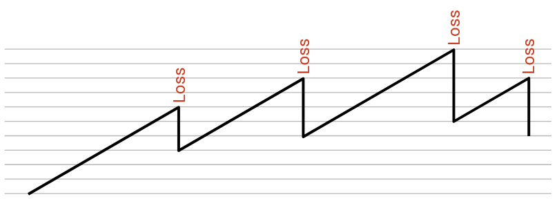

## Điều chỉnh: Mô hình

Tại sao AIMD là lựa chọn tốt nhất để đạt được efficiency và fairness? Hãy thực hiện một phân tích chi tiết hơn.

Đầu tiên, hãy lưu ý rằng cả bốn tùy chọn đều làm khá tốt trong việc đạt được efficiency. Bằng cách tăng khi chúng ta ở dưới rate tối ưu (không bị tắc nghẽn), và giảm khi chúng ta ở trên rate tối ưu (bị tắc nghẽn), rate của chúng ta sẽ luôn dao động quanh rate tối ưu trong dài hạn.

Tuy nhiên, hóa ra trong bốn tùy chọn này, AIMD là tùy chọn duy nhất dẫn đến fairness. Để hiểu tại sao, hãy xem xét một mô hình đơn giản trong đó có hai kết nối đi qua một liên kết duy nhất có capacity (dung lượng) C. Hai kết nối đang gửi ở các rate X1 và X2, tương ứng. Chúng ta biết rằng nếu X1+X2 lớn hơn C, mạng bị tắc nghẽn, và nếu X1+X2 nhỏ hơn C, thì mạng đang bị underloaded (sử dụng dưới tải).

Để đạt được efficiency, chúng ta muốn liên kết được sử dụng hết, tức là X1+X2 = C. Để đạt được fairness, chúng ta muốn X1 = X2, để cả hai kết nối đều chia sẻ capacity một cách bình đẳng.

Để hình dung không gian các khả năng, hãy xem xét một biểu đồ 2D, trong đó trục x là X1 (rate của người dùng 1), và trục y là X2 (rate của người dùng 2). Mỗi điểm trên biểu đồ này đại diện cho một kịch bản khả thi trong đó mỗi người dùng đang gửi ở một rate cụ thể.

Giả sử C=1. Để đạt được efficiency tối đa, chúng ta muốn X1+X2 = 1. Chúng ta có thể vẽ đường thẳng này trên đồ thị. Mọi điểm dọc theo đường thẳng này đều đang sử dụng toàn bộ bandwidth khả dụng.

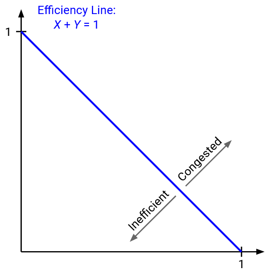

Chúng ta biết rằng mạng bị tắc nghẽn khi X1+X2 lớn hơn 1. Trên biểu đồ, bất đẳng thức này là nửa mặt phẳng phía trên đường thẳng. Chúng ta cũng biết rằng mạng đang được sử dụng dưới mức khi X1+X2 nhỏ hơn 1, được biểu thị bằng nửa mặt phẳng bên dưới đường thẳng. Điều này có nghĩa là tất cả các điểm phía trên đường thẳng đại diện cho trạng thái tắc nghẽn, và tất cả các điểm bên dưới đường thẳng đại diện cho trạng thái sử dụng dưới mức.

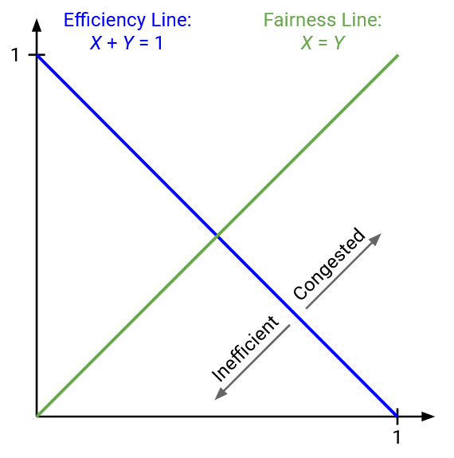

Để đạt được fairness, chúng ta muốn X1 = X2. Chúng ta cũng có thể vẽ đường thẳng này. Mọi điểm dọc theo đường thẳng này đại diện cho một trạng thái công bằng, trong đó cả hai người dùng đang sử dụng cùng một lượng bandwidth. Bất kỳ điểm nào không nằm trên đường này là không công bằng.

Trạng thái lý tưởng xảy ra tại giao điểm của hai đường thẳng, khi X1 = X2 = 0.5. Điểm này nằm trên cả hai đường thẳng, vì vậy nó vừa công bằng vừa hiệu quả.

Điểm (0.2, 0.5) là không hiệu quả, vì chúng ta chỉ đang sử dụng 0.7 bandwidth. Về mặt đồ thị, chúng ta đang ở dưới đường hiệu quả. Điểm (0.7, 0.5) bị tắc nghẽn và do đó ở trên đường hiệu quả. Điểm (0.7, 0.3) là hiệu quả (nằm trên đường hiệu quả), nhưng không công bằng (không nằm trên đường công bằng).

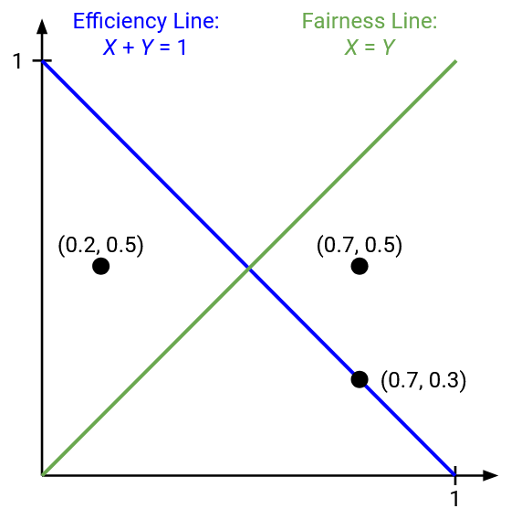

Hãy nhớ lại rằng trong thuật toán điều chỉnh động của chúng ta, mỗi người gửi đều chạy độc lập cùng một thuật toán để xác định rate của riêng mình. Điều này có nghĩa là nếu hai người dùng phát hiện việc sử dụng dưới mức, cả hai sẽ tăng rate của họ theo cùng một cách (cộng hoặc nhân, tùy thuộc vào lựa chọn quy tắc của chúng ta). Tương tự, nếu hai người dùng phát hiện congestion, cả hai sẽ giảm rate của họ theo cùng một cách.

Điều gì xảy ra nếu cả hai người dùng tăng hoặc giảm rate của họ theo phép cộng? Nếu cả hai người dùng tăng rate của họ bằng cách cộng thêm b, trạng thái (x1, x2) sẽ trở thành (x1+b, x2+b). Nếu cả hai người dùng giảm rate của họ bằng cách trừ đi a, trạng thái (x1, x2) sẽ trở thành (x1-a, x2-a).

Trên đồ thị, nếu chúng ta thực hiện một thay đổi cộng, điểm đại diện cho trạng thái của chúng ta sẽ di chuyển dọc theo một đường thẳng có độ dốc là 1.

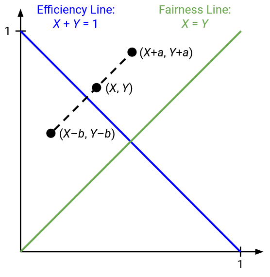

Điều gì xảy ra nếu cả hai người dùng tăng hoặc giảm rate của họ theo phép nhân? Nhân với c biến (x1, x2) thành (cx1, cx2), và chia cho d biến (x1, x2) thành (x1/d, x2/d).

Trên đồ thị, nếu chúng ta thực hiện một thay đổi nhân, điểm đại diện cho trạng thái của chúng ta sẽ di chuyển dọc theo một đường thẳng có độ dốc x2/x1. Tương đương, đây là đường thẳng nối (x1, x2) với gốc tọa độ (0, 0).

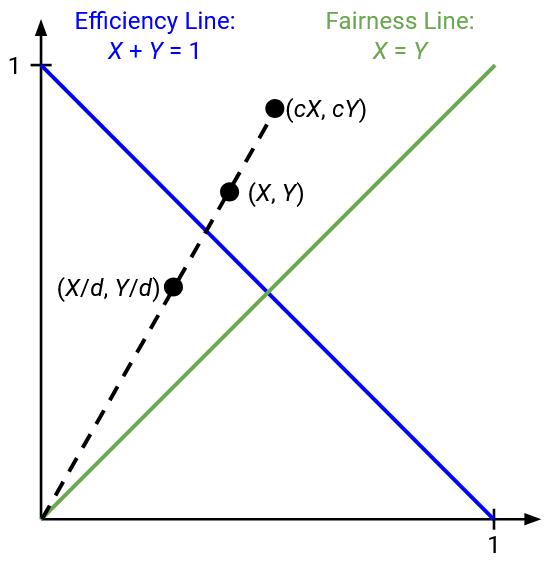

Bây giờ, chúng ta có thể áp dụng mô hình này cho từng tùy chọn tăng/giảm trong bốn tùy chọn, và xem liệu chúng có khiến điểm tiến đến, hay di chuyển ra xa, đường công bằng hay không. Mục tiêu của chúng ta là điểm tiến đến đường công bằng khi chúng ta điều chỉnh rate.

## Điều chỉnh: Động học AIAD

Hãy xem xét việc cộng 1 cho mỗi lần tăng, và trừ 2 cho mỗi lần giảm. Giả sử chúng ta có capacity là C = 5. Thì từ một điểm xuất phát cho trước, điểm của chúng ta sẽ di chuyển như sau:

X1 = 1, X2 = 3 (điểm bắt đầu, 4 nhỏ hơn 5, tăng)

X1 = 2, X2 = 4 (6 lớn hơn 5, giảm)

X1 = 0, X2 = 2 (2 nhỏ hơn 5, tăng)

X1 = 1, X2 = 3

Chúng ta đã quay trở lại nơi chúng ta bắt đầu! Phân bổ ban đầu của chúng ta không công bằng, và sau một vài lần lặp, chúng ta đã quay trở lại cùng một phân bổ không công bằng.

Trên thực tế, nếu chúng ta nhìn vào sự khác biệt giữa X1 và X2 (khoảng cách công bằng là 0), khoảng cách này là như nhau (2) trong mỗi lần lặp. Các lần lặp không làm cho phân bổ của chúng ta công bằng hơn hay kém công bằng hơn.

Chúng ta có thể thấy hành vi này trên đồ thị. Từ một điểm xuất phát cho trước, nếu chúng ta tăng và giảm theo phép cộng, chúng ta sẽ luôn di chuyển dọc theo một đường thẳng có độ dốc là 1, không bao giờ tiến gần hơn đến đường công bằng.

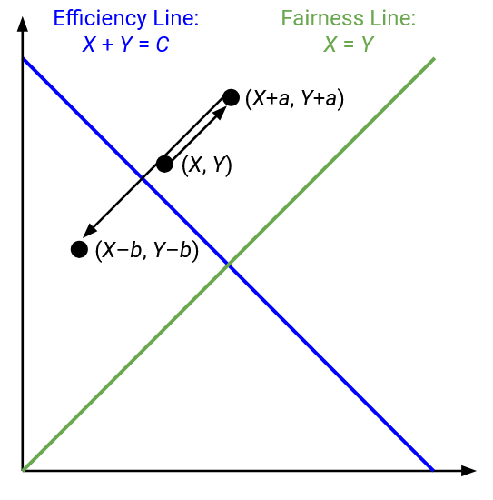

Tuy nhiên, hãy lưu ý rằng điểm của chúng ta dao động quanh đường hiệu quả, như mong muốn. Tất cả bốn tùy chọn sẽ có hành vi này.

Chúng ta cũng có thể thấy hành vi này về mặt đại số. Giả sử X1 và X2 cách nhau 5 đơn vị (phân bổ không công bằng). Nếu chúng ta cộng cùng một số vào X1 và X2, kết quả X1' và X2' vẫn cách nhau 5 đơn vị (cũng không công bằng). Điều tương tự cũng xảy ra nếu chúng ta trừ cùng một số khỏi cả X1 và X2.

Tóm lại, không có cách nào để thu hẹp khoảng cách công bằng trong cách tiếp cận này. Nếu phân bổ ban đầu không công bằng, nó sẽ vẫn không công bằng.

Bạn có thể hỏi: Điều gì sẽ xảy ra nếu chúng ta tăng X1 nhiều hơn (ví dụ: +2), và X2 ít hơn (ví dụ: +1)? Hãy nhớ rằng, cách tiếp cận phi tập trung của chúng ta có nghĩa là mọi người đều đang chạy cùng một thuật toán. Về mặt thực tế, chúng ta cũng không có cách nào để một máy chủ biết nó nên cộng thêm bao nhiêu so với các máy chủ khác.

## Điều chỉnh: Động học MIMD

Hãy xem xét việc tăng bằng cách nhân đôi, và giảm bằng cách chia cho 4. Một lần nữa, capacity là C = 5. Từ một điểm xuất phát cho trước, một vài lần lặp đầu tiên sẽ là:

X1 = 0.5, X2 = 1 (1.5 nhỏ hơn 5, tăng)

X1 = 1, X2 = 2 (3 nhỏ hơn 5, tăng)

X1 = 2, X2 = 4 (6 lớn hơn 5, giảm)

X1 = 0.5, X2 = 1

Một lần nữa, chúng ta đã quay trở lại nơi chúng ta bắt đầu, không có sự cải thiện nào về fairness!

Chúng ta có thể thấy hành vi này trên biểu đồ. Khi chúng ta tăng hoặc giảm rate theo phép nhân, chúng ta đang di chuyển dọc theo đường thẳng giữa điểm đó và gốc tọa độ, và chúng ta không bao giờ tiến gần hơn đến đường công bằng.

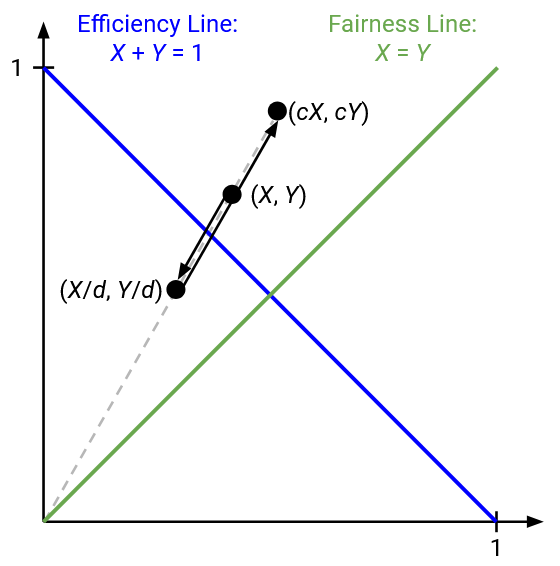

Về mặt đại số, hãy xem xét tỷ lệ giữa X2 và X1, tức là X2/X1 (tỷ lệ công bằng sẽ là 1). Trong ví dụ trên, tỷ lệ luôn là 2, tức là X2 luôn có bandwidth gấp đôi X1. Tỷ lệ này không đổi ngay cả khi chúng ta nhân hoặc chia cả X1 và X2 cho một hệ số không đổi. Các điều chỉnh của chúng ta không đưa chúng ta đến gần hơn với tỷ lệ công bằng là 1.

## Điều chỉnh: Động học MIAD

Cái này phức tạp hơn một chút. Hãy xem xét việc tăng bằng cách nhân đôi, và giảm bằng cách trừ đi 1. Với C = 5, một vài lần lặp đầu tiên là:

X1 = 1, X2 = 3 (4 nhỏ hơn 5, tăng)

X1 = 2, X2 = 6 (8 lớn hơn 5, giảm)

X1 = 1, X2 = 5 (6 lớn hơn 5, giảm)

X1 = 0, X2 = 4 (4 nhỏ hơn 5, tăng)

X1 = 0, X2 = 8

Tại thời điểm này, X1 có bandwidth bằng không. Mỗi lần chúng ta tăng bằng cách nhân đôi, X1 vẫn sẽ có bandwidth bằng không. Chúng ta thực sự đã tạo ra tình huống không công bằng nhất, trong đó X2 có tất cả bandwidth, và X1 không có gì.

Nói chung, nếu bạn bắt đầu với một phân bổ không công bằng, MIAD sẽ làm cho phân bổ đó trở nên không công bằng hơn nữa, cuối cùng đạt đến một điểm mà một người có tất cả bandwidth, và người kia có không.

Để thấy điều này về mặt đại số, hãy xem xét khoảng cách giữa X1 và X2. Khi chúng ta tăng bằng cách nhân đôi, kích thước của khoảng cách cũng tăng gấp đôi, từ (X2 - X1) thành (2 X2 - 2 X1) = 2(X2 - X1). Nhưng, khi chúng ta trừ 1 khỏi cả X1 và X2, khoảng cách vẫn giữ nguyên. Khoảng cách hoặc tăng lên hoặc giữ nguyên, và với đủ các lần lặp tăng và giảm, khoảng cách sẽ đạt đến mức độ không công bằng tối đa (một người có bandwidth bằng không mãi mãi).

## Điều chỉnh: Động học AIMD

Cuối cùng, hãy xem xét việc tăng bằng cách cộng 1, và giảm bằng cách chia đôi. Với C = 5, một vài lần lặp đầu tiên là:

X1 = 1, X2 = 2 (3 nhỏ hơn 5, tăng)

X1 = 2, X2 = 3 (5 không lớn hơn 5, tăng)

X1 = 3, X2 = 4 (7 lớn hơn 5, giảm)

X1 = 1.5, X2 = 2 (3.5 nhỏ hơn 5, tăng)

X1 = 2.5, X2 = 3 (5.5 lớn hơn 5, giảm)

X1 = 1.25, X2 = 1.5 (2.75 nhỏ hơn 5, tăng)

X1 = 2.25, X2 = 2.5 (4.75 nhỏ hơn 5, tăng)

X1 = 3.25, X2 = 3.5 (6.75 lớn hơn 5, giảm)

X1 = 1.625, X2 = 1.75 (nhỏ hơn 5, tăng)

X2 = 2.625, X2 = 2.75

Chúng ta có thể thấy rằng X1 và X2 đang tiến lại gần nhau hơn, và trên thực tế, chúng đang tiến đến phân bổ công bằng X1 = X2 = 2.5.

Về mặt đại số, chúng ta có thể thấy rằng khoảng cách giữa X1 và X2 đang giảm. Cụ thể, khi chúng ta cộng một hằng số vào cả hai số, khoảng cách vẫn giữ nguyên. Nhưng, khi chúng ta chia đôi cả hai số, khoảng cách cũng giảm đi một nửa, từ (X1 - X2) thành (X1 / 2 - X2 / 2) = (X1 - X2) / 2. Khi chúng ta xen kẽ việc tăng và giảm, khoảng cách sẽ tiếp tục giảm đi một nửa và tiến đến 0.

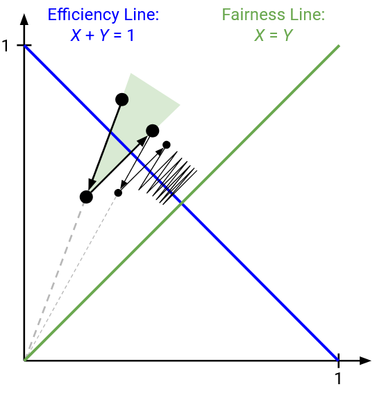

Chúng ta cũng có thể thấy điều này trên đồ thị. Khi chúng ta giảm theo phép nhân, chúng ta đang di chuyển dọc theo đường thẳng qua gốc tọa độ. Đường thẳng này nghiêng về phía đường công bằng, và việc di chuyển xuống dưới dọc theo đường này có nghĩa là chúng ta đang tiến đến đường công bằng. Như trước đây, việc tăng theo phép cộng không đưa chúng ta đến gần đường công bằng hơn, vì chúng ta đang di chuyển dọc theo một đường thẳng có độ dốc là 1 (song song với đường công bằng). Nhưng nhận thức quan trọng là việc cộng không làm chúng ta đi xa hơn. Hai hoạt động duy nhất của chúng ta là tiến lại gần hơn, hoặc không tiến gần hơn hay xa hơn. Sau nhiều lần lặp, điểm của chúng ta sẽ từ từ di chuyển đến gần đường công bằng hơn.

Tóm lại: AIAD và MIMD giữ nguyên sự không công bằng, và không có cải thiện nào về fairness. MIAD làm tăng sự không công bằng, và AIMD hội tụ về fairness.

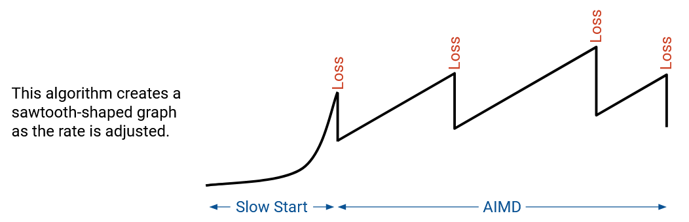