Chắc chắn rồi. Tôi sẽ tiếp tục dịch phần tiếp theo của giáo trình, duy trì sự nhất quán với các thuật ngữ đã được định nghĩa ở các phần trước và chỉ giới thiệu các thuật ngữ mới khi chúng xuất hiện lần đầu tiên.

-----

# Triển khai Kiểm soát Tắc nghẽn

## Tóm tắt lại: Các Cửa sổ TCP

Cho đến nay, chúng ta đã thiết kế một phác thảo khái niệm về một thuật toán điều chỉnh động, dựa trên *host*, nơi mỗi nguồn chạy cùng một thuật toán một cách độc lập để đạt được một phần *bandwidth* hiệu quả và công bằng.

Đầu tiên, sử dụng *slow-start (khởi động chậm)* (bắt đầu ở tốc độ thấp, tăng theo cấp số nhân) để khám phá ra một tốc độ ban đầu. Sau đó, trong mỗi vòng lặp, nếu chúng ta phát hiện tắc nghẽn (phát hiện mất mát), chúng ta giảm R theo cấp số nhân. Nếu chúng ta không phát hiện tắc nghẽn, chúng ta tăng R theo cấp số cộng.

Trong phần này, chúng ta sẽ xem cách *TCP* triển khai thuật toán này. Dù tốt hay xấu, các cơ chế *Congestion Control (Kiểm soát tắc nghẽn)* của *TCP* rất gắn liền với các cơ chế độ tin cậy của *TCP*. (Đây là kết quả của thiết kế ban đầu, nơi *TCP* được vá để tính đến tắc nghẽn.) Trong phần này, chúng ta sẽ xem cách triển khai của *TCP* hoạt động để đạt được cả độ tin cậy và *congestion control* cùng một lúc.

Hãy nhớ lại rằng trong *TCP*, bên gửi duy trì một *sliding window (cửa sổ trượt)* gồm các byte/packet liên tiếp đang trên đường truyền. Kích thước của cửa sổ được quyết định bởi *flow control (kiểm soát luồng)* (do không gian bộ đệm ở bên nhận quyết định) và *congestion control* (tốc độ do bên gửi tính toán).

Cụ thể hơn, trong *flow control*, bên nhận gửi một cửa sổ quảng bá, cho biết có thể gửi thêm bao nhiêu byte nữa mà không làm tràn bộ nhớ của bên nhận. Giá trị cửa sổ quảng bá này đôi khi được viết tắt là ***RWND (cửa sổ phía nhận)***.

Trong *congestion control*, bên gửi duy trì một giá trị, đôi khi được viết tắt là ***CWND (cửa sổ tắc nghẽn)***, biểu thị tốc độ mà bên gửi có thể gửi các *packet* mà không làm quá tải các liên kết. Giá trị này sẽ được đặt và điều chỉnh động bởi thuật toán *congestion control*.

Cửa sổ của bên gửi được tính bằng giá trị nhỏ nhất của *CWND* và *RWND*. Trong bài giảng này, chúng ta sẽ giả định rằng *RWND* lớn hơn *CWND*, do đó nút thắt cổ chai là mạng, chứ không phải bộ nhớ của bên nhận. Điều này thường đúng, nhưng không phải lúc nào cũng đúng trong thực tế.

Hãy nhớ lại rằng chúng ta có thể xem *sliding window* như một khoảng trong luồng byte. Cạnh trái của cửa sổ là byte đầu tiên chưa được xác nhận (mọi thứ bên trái cửa sổ đã được gửi và xác nhận). Cạnh phải của cửa sổ được xác định bởi kích thước cửa sổ. Chỉ các *packet* bên trong cửa sổ này mới được phép đang trên đường truyền.

Khi dữ liệu ở cạnh trái của cửa sổ được xác nhận, cửa sổ trượt sang phải, và dữ liệu bổ sung bây giờ có thể được gửi đi.

Để phát hiện mất mát, chúng ta duy trì một bộ đếm thời gian duy nhất cho *packet* ngoài cùng bên trái trong cửa sổ. Nếu bộ đếm thời gian hết hạn mà *packet* đó chưa được xác nhận, chúng ta sẽ gửi lại *packet* ngoài cùng bên trái trong cửa sổ. Ngoài ra, để phát hiện mất mát, chúng ta đếm số lượng *duplicate acks (ack trùng lặp)*, và gửi lại *packet* ngoài cùng bên trái nếu chúng ta thấy 3 *duplicate acks*. Cách tiếp cận dựa trên *ack* trùng lặp này đôi khi được gọi là ***fast retransmit (truyền lại nhanh)***.

## Cửa sổ và Tốc độ

Làm thế nào để chúng ta điều chỉnh tốc độ cho *congestion control*, và làm thế nào để chúng ta tính toán *congestion window*? Hóa ra hai giá trị này có liên quan trực tiếp, và việc điều chỉnh cửa sổ được thực hiện bằng cách điều chỉnh tốc độ. Kích thước cửa sổ và tốc độ gửi dữ liệu có tương quan với nhau theo phương trình sau: tốc độ nhân với *RTT* = kích thước cửa sổ.

Về mặt trực quan, bạn có thể nghĩ kích thước cửa sổ và tốc độ là cùng một đại lượng, được biểu thị bằng hai "đơn vị đo" khác nhau. Kích thước cửa sổ tăng có nghĩa là chúng ta đang gửi dữ liệu nhanh hơn, và ngược lại.

Để thấy tại sao phương trình này đúng, hãy xem xét *RTT* đầu tiên. Chúng ta có thể gửi [kích thước cửa sổ] *packet* trong *RTT* đầu tiên này (trước khi bất kỳ *ack* nào đến), cho tốc độ là kích thước cửa sổ / *RTT*.

Hãy nhớ lại rằng thiết kế *TCP* khái niệm của chúng ta đo dữ liệu bằng *packet* cho đơn giản, nhưng trong thực tế, *TCP* suy nghĩ theo byte. Trong một triển khai thực tế, kích thước cửa sổ được đo bằng byte, nhưng để đơn giản, chúng ta sẽ xem xét kích thước cửa sổ theo *packet*.

Để chuyển đổi giữa *packet* và byte, hãy nhớ lại rằng chúng ta đã định nghĩa *Maximum Segment Size (MSS) (Kích thước Phân đoạn Tối đa)*, là số byte trên mỗi *packet*. Điều này cho chúng ta biết rằng *MSS* nhân với số lượng *packet* = số lượng byte. Một lần nữa, về mặt trực quan, bạn có thể nghĩ byte và *packet* là hai đơn vị đo khác nhau cho cùng một đại lượng (lượng dữ liệu).

## Cập nhật theo Sự kiện

Trong mô hình khái niệm của chúng ta, mục tiêu là điều chỉnh tốc độ/cửa sổ một lần mỗi "vòng lặp", nhưng chúng ta chưa hình thức hóa cách đo mỗi vòng lặp. Chúng ta có thể định nghĩa sơ bộ mỗi vòng lặp là một *RTT*, nhưng bản thân *RTT* là một giá trị thay đổi động mà chúng ta không thể đo chính xác.

Để cập nhật kích thước cửa sổ một cách dễ dự đoán và đo lường hơn, chúng ta có thể xem xét các sự kiện khác nhau mà việc triển khai *TCP* hiện có phản ứng lại, và cập nhật cửa sổ mỗi khi một trong những sự kiện này xảy ra. Đây được gọi là ***event-driven updates (cập nhật theo sự kiện)***.

Ba sự kiện *TCP* mà chúng ta cần cập nhật kích thước cửa sổ là: *ack* mới, 3 *duplicate acks*, và hết thời gian chờ.

Khi chúng ta thấy một *ack* mới (cho dữ liệu chưa được xác nhận trước đó), đây là một dấu hiệu cho thấy dữ liệu của chúng ta đã đi qua mạng mà không bị mất. Trong mô hình của chúng ta, chúng ta phát hiện tắc nghẽn bằng cách kiểm tra mất mát, vì vậy một *ack* mới là một dấu hiệu cho thấy mạng không bị tắc nghẽn. Do đó, khi chúng ta thấy một *ack* mới, chúng ta có thể tăng kích thước cửa sổ (hoặc trong quá trình khám phá *slow-start*, hoặc điều chỉnh *AIMD*).

Khi chúng ta thấy 3 *duplicate acks*, chúng ta đánh dấu một *packet* bị mất. Đây là một tín hiệu của mất mát đơn lẻ, cho thấy tắc nghẽn nhẹ. Chúng ta đã mất một *packet*, nhưng các *packet* tiếp theo vẫn đang được nhận. Để phản ứng với sự mất mát này, chúng ta sẽ giảm kích thước cửa sổ (trong quá trình điều chỉnh *AIMD*).

Khi chúng ta gặp phải một lần hết thời gian chờ, chúng ta đánh dấu một *packet* bị mất. Việc chúng ta phát hiện mất mát sau khi hết thời gian chờ, chứ không phải *duplicate acks*, là một tín hiệu của việc nhiều *packet* bị mất (tắc nghẽn nặng). Để thấy tại sao, hãy xem xét kích thước cửa sổ là 100 *packet*. Nếu chúng ta gặp phải một lần hết thời gian chờ, điều này có nghĩa là chúng ta không nhận được *ack* cho *packet* ngoài cùng bên trái trong cửa sổ. Nhưng nó cũng có nghĩa là chúng ta đã không nhận được 3 *duplicate acks* cho bất kỳ *packet* nào khác trong cửa sổ trong suốt thời gian của bộ đếm. Một lần hết thời gian chờ có nghĩa là rất ít, nếu có, *packet* đang được nhận, và có điều gì đó tồi tệ đã xảy ra.

Nếu chúng ta phát hiện một lần hết thời gian chờ, có điều gì đó không mong muốn đã xảy ra (ví dụ: mạng đã thay đổi), và chúng ta không nên tin tưởng vào kích thước cửa sổ hiện tại của mình nữa. Để phản ứng, chúng ta nên quay lại giai đoạn *slow-start* và khám phá lại một kích thước cửa sổ tốt. Đây không phải là cách duy nhất để phản ứng với việc hết thời gian chờ, nhưng đây là những gì *TCP* đã quyết định.

## Slow-Start theo Sự kiện

Trong mô hình khái niệm của chúng ta, chúng ta đã triển khai *slow-start* bằng cách chọn một tốc độ chậm, và tăng tốc độ theo cấp số nhân (ví dụ: nhân đôi trong mỗi vòng lặp) cho đến khi chúng ta gặp phải lần mất mát đầu tiên. Bây giờ chúng ta cần một cách theo sự kiện để nhân đôi cửa sổ một lần mỗi *RTT*.

*TCP* bắt đầu với một cửa sổ nhỏ là 1 *packet*. Hãy nhớ, chúng ta có thể chuyển đổi *packet* thành byte với *maximum segment size (MSS)*, và sau đó chuyển đổi byte thành tốc độ bằng cách chia *MSS/RTT*.

Mỗi khi chúng ta nhận được một xác nhận, chúng ta sẽ tăng kích thước cửa sổ thêm 1 *packet*. Trực giác về những gì sẽ xảy ra là:

Ban đầu, kích thước cửa sổ là 1 *packet*. Chúng ta gửi 1 *packet*, và sau một *RTT*, nhận lại 1 *ack*. *Ack* đó cho phép chúng ta tăng cửa sổ lên 2 *packet*.

Bây giờ chúng ta gửi 2 *packet*, và sau một *RTT*, chúng ta nhận lại 2 *ack*. 2 *ack* đó cho phép chúng ta tăng cửa sổ thêm 2 *packet* nữa, cho kích thước cửa sổ mới là 4 *packet*.

Bây giờ chúng ta gửi 4 *packet*, và sau một *RTT*, chúng ta nhận lại 4 *ack*. 4 *ack* đó cho phép chúng ta tăng cửa sổ thêm 4 *packet* nữa, cho kích thước cửa sổ mới là 8 *packet*.

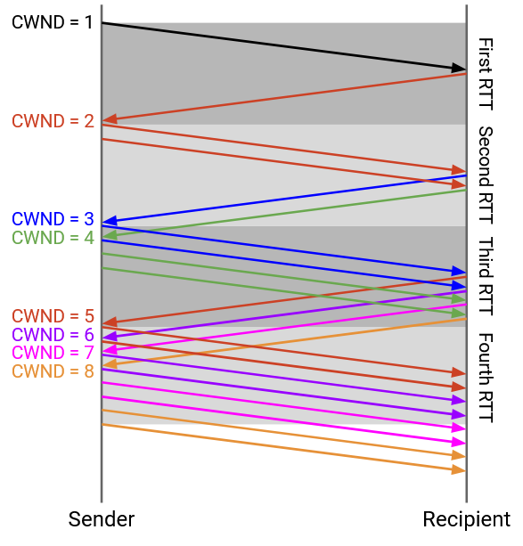

Tuy nhiên, bức tranh trực quan này giả định chúng ta đang gửi tất cả 4 *packet* và nhận tất cả 4 *ack* đồng thời. Trong thực tế, hành vi *sliding window* khiến cửa sổ của chúng ta tăng thêm 1 mỗi khi chúng ta nhận được một *ack*, mặc dù hành vi cuối cùng (nhân đôi cửa sổ mỗi *RTT*) là như nhau.

Như trước đây, chúng ta bắt đầu với kích thước cửa sổ là 1 *packet*. Chúng ta gửi 1 *packet* (A), và sau một *RTT*, nhận lại *ack* cho A. *Ack* đó cho phép chúng ta tăng cửa sổ lên 2 *packet*, và không có *packet* nào đang trên đường truyền.

Tiếp theo, chúng ta có thể gửi ra 2 *packet* (B và C). Khi chúng ta nhận được *ack* cho B, chúng ta tăng cửa sổ lên 3 *packet*. Vẫn còn 1 *packet* đang trên đường truyền (C), vì vậy chúng ta có thể gửi thêm 2 *packet* nữa (D và E).

Khi chúng ta nhận được *ack* cho C, chúng ta có thể tăng cửa sổ lên 4 *packet*. Vẫn còn 2 *packet* đang trên đường truyền (D và E), vì vậy chúng ta có thể gửi thêm 2 *packet* nữa (F và G).

Nói chung, giả sử không có mất mát và không có sắp xếp lại thứ tự, mỗi khi chúng ta nhận được một *ack*, *sliding window* cho phép chúng ta gửi thêm một *packet*, và cửa sổ được tăng lên cho phép chúng ta gửi thêm một *packet* nữa. Bởi vì mỗi *ack* dẫn đến việc 2 *packet* được gửi đi, chúng ta có được hành vi mà cửa sổ nhân đôi mỗi *RTT*. Ví dụ, trong một khoảng *RTT* mà chúng ta nhận được 16 *ack*, mỗi *ack* kích hoạt hai *packet* được gửi đi, tổng cộng là 32 *packet*. Sau đó, trong khoảng *RTT* tiếp theo, 32 *packet* đó sẽ được xác nhận, kích hoạt 64 *packet* được gửi đi.

Cuối cùng, sau một thời gian nhân đôi cửa sổ mỗi *RTT* (tăng cửa sổ thêm 1 cho mỗi *ack*), chúng ta sẽ gặp phải mất mát. Điều này cũng có nghĩa là chúng ta đã học được tốc độ "an toàn" tối đa cho phép để gửi các *packet* mà không gặp phải mất mát. Chúng ta sẽ ghi nhớ tốc độ này trong một tham số mới gọi là *SSTHRESH (ngưỡng khởi động chậm)*. Cụ thể, ngay khi chúng ta gặp phải mất *packet*, chúng ta sẽ đặt *SSTHRESH* bằng một nửa kích thước cửa sổ. Ví dụ, nếu một cửa sổ 16 *packet* không gây ra mất mát, nhưng một cửa sổ 32 *packet* lại gây ra mất mát, thì chúng ta sẽ đặt *SSTHRESH* là 16.

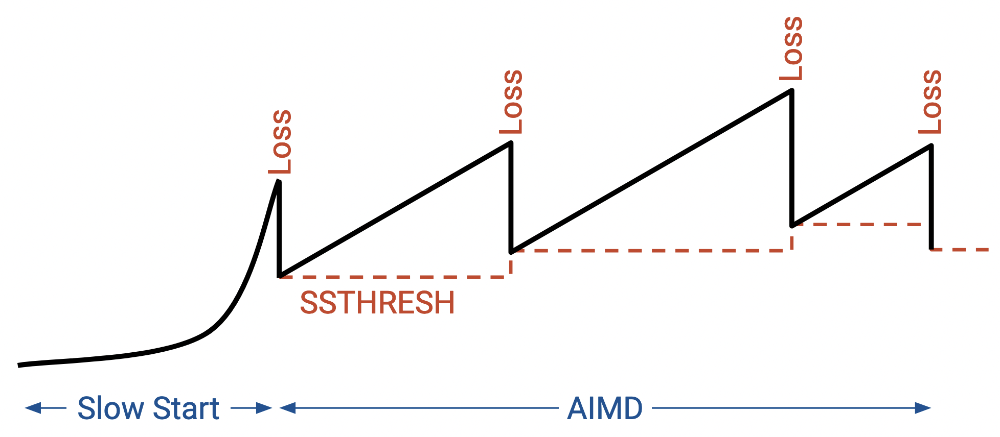

Hãy nhớ lại rằng sau *slow-start*, chúng ta sẽ liên tục điều chỉnh kích thước cửa sổ (*AIMD*). *SSTHRESH* cho phép chúng ta ghi nhớ tốc độ an toàn mà chúng ta đã học được từ *slow-start*, ngay cả khi tốc độ bắt đầu thay đổi sau này.

## Triển khai Tăng Cộng

Trong mô hình khái niệm của chúng ta, sau *slow-start*, chúng ta muốn tăng tốc độ một cách từ từ (cộng tính) khi không có mất mát. Chúng ta cần một cách theo sự kiện để tăng cửa sổ thêm 1 *packet* cho mỗi *RTT*.

Chúng ta không có một con số chính xác cho *RTT*, nhưng chúng ta biết rằng trong một *RTT* duy nhất, chúng ta mong đợi một lượng *packet* bằng kích thước cửa sổ sẽ được xác nhận. Ví dụ, với kích thước cửa sổ là 10, chúng ta nhận được 10 *ack* mỗi *RTT*. Nếu chúng ta tăng cửa sổ thêm 1/10 *packet* cho mỗi *ack*, thì trong suốt một *RTT*, cửa sổ sẽ tăng thêm 1 *packet*, như mong muốn.

Mỗi khi chúng ta nhận được một xác nhận, chúng ta sẽ lấy kích thước cửa sổ hiện tại *CWND* và gán lại nó thành *CWND* + (1/*CWND*). Điều này tăng cửa sổ thêm một phần nhỏ của một *packet* trên mỗi *ack*. Sau một lượng *packet* bằng kích thước cửa sổ (tức là sau một *RTT*), cửa sổ tăng thêm 1 *packet*.

Về mặt hình thức, *TCP* đo cửa sổ bằng byte, không phải *packet*, vì vậy (1/*CWND*) tương đương với *MSS* \* (*MSS*/*CWND*) bằng byte. Trong (1/*CWND*), tử số là 1 *packet* (tổng mức tăng trong một *RTT*), và mẫu số là *CWND* được đo bằng *packet*. Vì mẫu số bây giờ được đo bằng *packet*, chúng ta cũng phải đo tử số bằng *packet*: 1 *packet* = *MSS* byte.

Nhưng phân số 1/*CWND* hoặc *MSS*/*CWND* vẫn là một tỷ lệ (không có thứ nguyên), đại diện cho phần trăm cần tăng trên mỗi *ack*. Tổng mức tăng chúng ta muốn là 1 *packet* = *MSS* byte, vì vậy chúng ta phải nhân phân số này với *MSS* byte.

Ví dụ, giả sử *CWND* của chúng ta là 3 *packet* = 150 byte (giả sử *MSS* = 50 byte). Trong chế độ xem *packet*, chúng ta sẽ thêm 1/3 *packet* vào cửa sổ mỗi lần, cho tổng mức tăng là 1 *packet*.

Trong chế độ xem byte, chúng ta có thể chia *MSS*/*CWND* = 50/150 để có được cùng một tỷ lệ 1/3 mà chúng ta cần để tăng mỗi lần, cho tổng mức tăng là 1. Nhưng chúng ta vẫn cần nhân với *MSS* để tổng mức tăng là *MSS* thay vì 1.

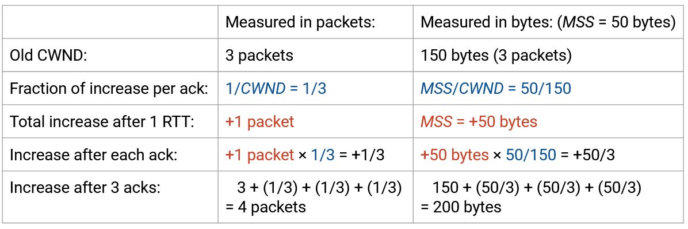

Lưu ý rằng mức tăng không hoàn toàn tuyến tính, nhưng cung cấp một sự xấp xỉ đủ tốt. Ví dụ, bắt đầu với *CWND* = 4, lần cập nhật đầu tiên là 4 + 1/4 = 4.25, và lần tăng thứ hai là 4.25 + 1/4.25 = 4.49. Sau bốn lần cập nhật, kích thước cửa sổ sẽ là 4.92 trong phép xấp xỉ này (chúng ta muốn nó là 5 trong mô hình chính xác).

## Triển khai Giảm Nhân

Nếu chúng ta phát hiện mất mát từ 3 *duplicate acks*, chúng ta chia kích thước cửa sổ cho 2.

Hãy nhớ lại rằng nếu bộ đếm thời gian truyền lại hết hạn, chúng ta hiểu việc hết thời gian chờ là nhiều *packet* bị mất (chúng ta thậm chí không nhận được *duplicate acks*). Chúng ta giả định rằng cửa sổ hiện tại có thể sai lệch rất nhiều, và để thận trọng, chúng ta sẽ khám phá lại một tốc độ tốt từ đầu.

Đầu tiên, chúng ta sẽ ghi nhận rằng tốc độ hiện tại quá cao, và tốc độ an toàn tốt nhất đã biết là một nửa tốc độ hiện tại của chúng ta (theo nguyên tắc giảm nhân). Để ghi lại tốc độ an toàn này, chúng ta sẽ đặt *SSTHRESH* bằng một nửa cửa sổ hiện tại.

Sau đó, chúng ta sẽ đặt lại kích thước cửa sổ về 1 *packet*, và lặp lại quá trình *slow-start* một lần nữa.

Lưu ý rằng khi chúng ta thử lại *slow-start*, chúng ta cần cẩn thận để không quay trở lại tốc độ nguy hiểm với việc hết thời gian chờ từ trước đó. May mắn thay, chúng ta đã đặt *SSTHRESH* ngay dưới tốc độ nguy hiểm. Do đó, trong các lần thử lại *slow-start* tiếp theo (nơi *SSTHRESH* được đặt), ngay khi cửa sổ của chúng ta vượt quá *SSTHRESH*, chúng ta nên chuyển từ tăng nhân sang tăng cộng. Trong lần *slow-start* đầu tiên, *SSTHRESH* không được đặt (hoặc là vô cực).

Tóm lại: Trong *slow-start*, chúng ta tăng cửa sổ thêm 1 *packet* cho mỗi *ack* (dẫn đến nhân đôi tốc độ mỗi *RTT*). Khi ở chế độ *AIMD*, chúng ta tăng cửa sổ thêm một phần nhỏ của kích thước cửa sổ cho mỗi *ack* (dẫn đến tăng thêm 1 cho mỗi lượng dữ liệu bằng kích thước cửa sổ). Chúng ta giảm cửa sổ bằng cách chia đôi nó khi nhận được 3 *duplicate acks*, và thay đổi nó thành 1 khi hết thời gian chờ.

Lưu ý rằng khi giảm, chúng ta không bao giờ giảm kích thước cửa sổ xuống dưới 1 *packet*. Trong trường hợp xấu nhất, chúng ta cần cho phép 1 *packet* được đang trên đường truyền.

## Mô hình Răng cưa TCP

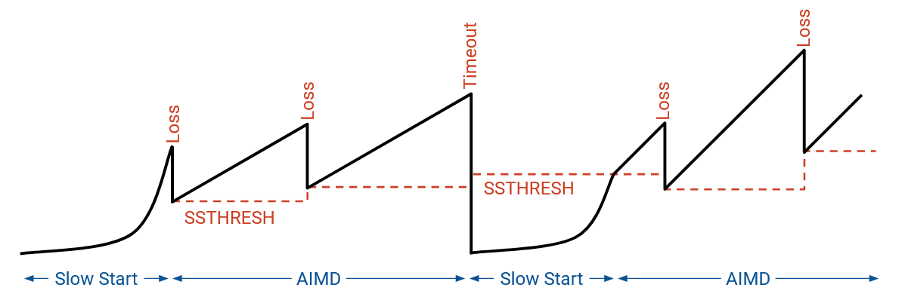

Nếu chúng ta vẽ đồ thị tốc độ theo thời gian, chúng ta sẽ thấy sự tăng trưởng theo cấp số nhân ban đầu (*slow-start*). Ngay khi chúng ta gặp phải mất mát, chúng ta cắt giảm một nửa tốc độ, và chuyển sang chế độ *AIMD*. Bây giờ, chúng ta tăng tuyến tính cho đến khi gặp phải mất mát, và chúng ta giảm một nửa tốc độ mỗi khi gặp phải mất mát.

## Fast Recovery: Ví dụ Thực tế

Còn một vấn đề cuối cùng chúng ta phải giải quyết trong việc triển khai *congestion control* của mình. Khi chúng ta gặp phải một *packet* bị mất đơn lẻ, *congestion window* bị giảm đi một nửa, như dự định. Tuy nhiên, điều này có tác dụng phụ không mong muốn là khiến bên gửi bị đình trệ một thời gian trước khi có thể tiếp tục gửi các *packet*.

Để thấy điều này hoạt động, hãy xem xét một ví dụ thực tế. Chúng ta gửi 10 *packet*, được đánh số từ 101 đến 110. *Packet* đầu tiên (101) bị mất.

Kết quả là, 9 *packet* còn lại, từ 102 đến 110, đều được xác nhận là ack(101), bởi vì byte tiếp theo được mong đợi vẫn là 101.

Sau *duplicate ack*(101) thứ ba (được tạo ra khi nhận 102, 103, và 104), bên gửi sẽ gửi lại 101.

Cuối cùng, *ack* cho *packet* 101 được gửi lại sẽ đến. Nó ghi ack(111), bởi vì các *packet* từ 102 đến 110 đều đã được nhận trước đó, và với việc nhận được 101, byte tiếp theo được mong đợi là 111.

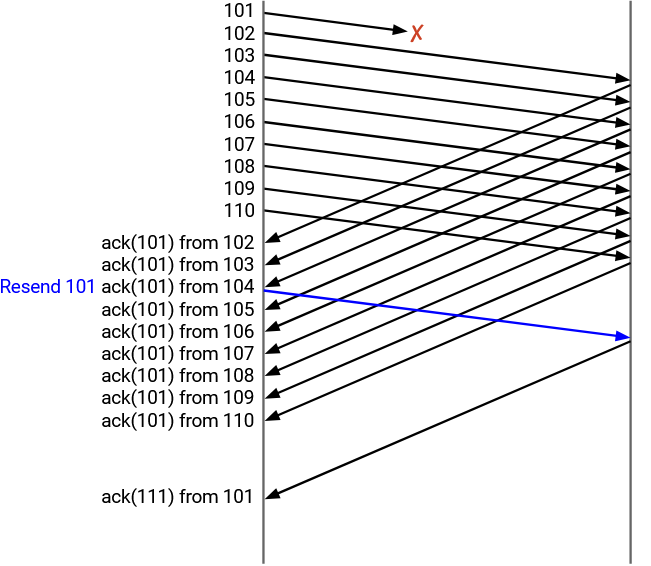

Tóm lại: Ở phía bên gửi, chúng ta gửi từ 101 đến 110, và 101 bị mất. Chúng ta nhận được ack(101) từ 102, ack(101) từ 103, và ack(101) từ 104. Tại thời điểm này, chúng ta gửi lại 101. Sau đó, chúng ta nhận được ack(101) từ 105 đến 110. Cuối cùng, chúng ta nhận được ack(111) từ 101.

Ở phía bên nhận, chúng ta nhận từ 102 đến 110, và gửi lại ack(101) mỗi lần, vì byte chưa nhận tiếp theo vẫn là 101. Cuối cùng, chúng ta nhận được *packet* 101 được gửi lại, và chúng ta gửi lại ack(111) bởi vì byte chưa nhận tiếp theo là 111.

*CWND* trông như thế nào trong ví dụ thực tế này? Hãy nhớ rằng cửa sổ bắt đầu từ byte đầu tiên chưa được xác nhận, và kéo dài cho *CWND* byte liên tiếp. Cách duy nhất để dịch chuyển cửa sổ về phía trước là nhận được byte đầu tiên chưa được xác nhận. Nếu chúng ta nhận được *ack* cho một số byte khác trong cửa sổ, cửa sổ vẫn giữ nguyên, bởi vì cửa sổ được xác định bởi byte đầu tiên chưa được xác nhận.

## Fast Recovery: Vấn đề

Hãy giả sử rằng *CWND* bắt đầu là 10. Các *packet* từ 101 đến 110 được phép đang trên đường truyền. Bên gửi gửi từ 101 đến 110, nhưng 101 bị mất.

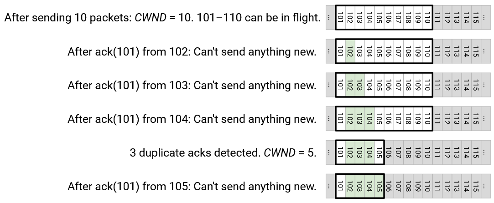

Bên gửi thấy ack(101), được tạo ra từ việc phía bên kia nhận 102. Tại thời điểm này, byte đầu tiên chưa được xác nhận vẫn là 101, vì vậy cửa sổ không thay đổi. Các *packet* duy nhất được phép đang trên đường truyền vẫn là từ 101 đến 110, và bên gửi không thể gửi bất cứ thứ gì mới (ví dụ: 111 không thể được gửi).

Tiếp theo, bên gửi thấy ack(101), được tạo ra từ việc phía bên kia nhận 103. Một lần nữa, byte đầu tiên chưa được xác nhận vẫn là 101, vì vậy cửa sổ không thay đổi. Cửa sổ vẫn bắt đầu từ 101 và kéo dài đến 110, và bên gửi không thể gửi bất cứ thứ gì mới.

Tiếp theo, bên gửi thấy ack(101), được tạo ra từ việc phía bên kia nhận 104. Đây là *duplicate ack* thứ ba, vì vậy chúng ta phải giảm *CWND* xuống 5. Byte đầu tiên chưa được xác nhận vẫn là 101, và *CWND* là 5, vì vậy các *packet* từ 101 đến 105 được phép đang trên đường truyền. Bên gửi vẫn không thể gửi bất cứ thứ gì mới. Chúng ta gửi lại 101 (*packet* ngoài cùng bên trái trong cửa sổ) vì chúng ta đã thấy *duplicate ack* thứ ba.

Tiếp theo, bên gửi thấy ack(101), được tạo ra từ việc phía bên kia nhận 105. Cửa sổ vẫn là 101 (byte đầu tiên chưa được xác nhận) đến 105 (*CWND* byte sau đó), vì vậy chúng ta không thể gửi bất cứ thứ gì mới.

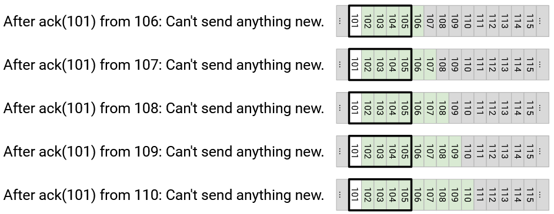

Tiếp theo, bên gửi thấy ack(101), được tạo ra từ việc phía bên kia nhận 106. Một lần nữa, cửa sổ không thay đổi, và chúng ta không thể gửi bất cứ thứ gì mới.

Bên gửi nhận được ack(101), ack(101), ack(101), ack(101) từ việc phía bên kia nhận 107, 108, 109, 110. Trong mọi trường hợp, 101 vẫn là byte đầu tiên chưa được xác nhận, vì vậy cửa sổ vẫn là 101 đến 105, và bên gửi không thể gửi bất cứ thứ gì mới.

Chuyện gì đã xảy ra ở đây? Chỉ có một *packet* duy nhất bị mất, nhưng kết quả là bên gửi đã phải ngừng gửi hoàn toàn trong một thời gian dài.

Cửa sổ được định nghĩa bởi byte đầu tiên chưa được xác nhận, vì vậy cửa sổ không chịu di chuyển về phía trước cho đến khi 101 được gửi lại và xác nhận. Mặc dù tất cả các *packet* khác (từ 102 đến 110) đều đến, cửa sổ vẫn bị kẹt ở 101, và các *packet* sau đó (từ 111 trở đi) không thể được gửi. Bên gửi bị đình trệ\!

Cuối cùng, bên gửi nhận được ack(111) từ *packet* 101 được gửi lại. Điều này khiến cửa sổ nhảy về phía trước và trượt đến *packet* đầu tiên chưa được xác nhận mới, 111. *CWND* vẫn là 5, vì vậy bên gửi bây giờ có thể gửi từ 111 đến 115.

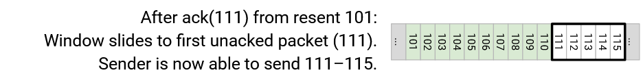

Chuyện gì đã xảy ra ở đây? Bây giờ chúng ta có một vấn đề thứ hai. Bên gửi đã bị đình trệ một thời gian dài, nhưng ngay khi 101 được xác nhận với ack(111), cửa sổ đã nhảy về phía trước đến tận 111-115, và bên gửi đột nhiên phải vội vàng gửi 111-115 cùng một lúc.

Bên gửi đã bị đình trệ một thời gian dài, không gửi gì cả, và sau đó đột nhiên vội vàng gửi 111-115 cùng một lúc. Bây giờ, bên gửi phải đợi thêm một *round-trip* đầy đủ để 111-115 được xác nhận, trước khi có thể gửi 116 và xa hơn nữa.

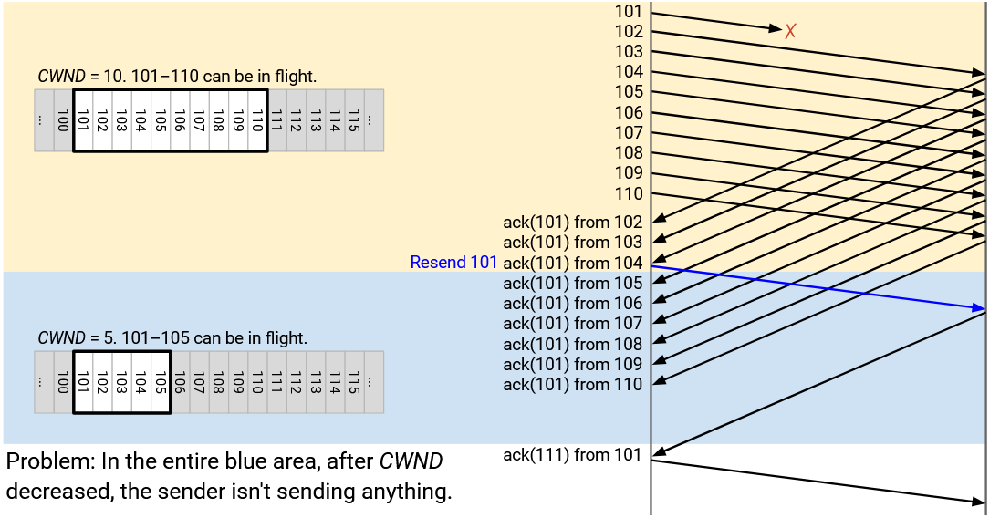

Tóm lại: Việc mất *packet* đơn lẻ đã khiến cửa sổ bị kẹt, điều này khiến bên gửi bị đình trệ và không gửi gì cả. Cuối cùng, khi *packet* đó được gửi lại và xác nhận, cửa sổ nhảy về phía trước, khiến bên gửi phải vội vàng gửi một loạt *packet* mới cùng một lúc. Bên gửi bây giờ phải đợi thêm một *round-trip* nữa để những *packet* mới đó được xác nhận, trước khi có thể tiếp tục hoạt động như bình thường.

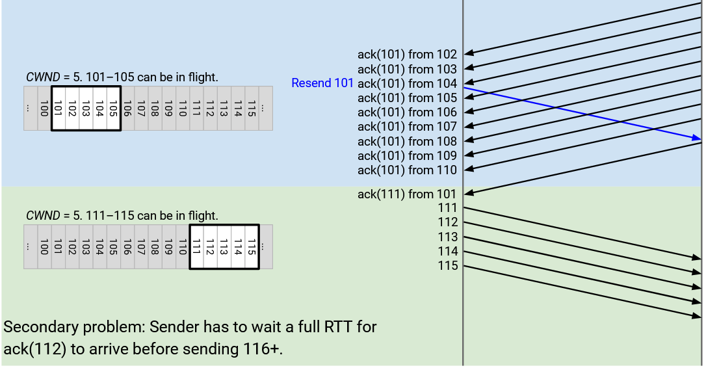

Một vài lưu ý về vấn đề này:

Nếu vấn đề vẫn còn khó hiểu, có thể hữu ích khi lưu ý rằng vấn đề này chủ yếu là do lược đồ *sliding window* của *TCP*, và không thực sự là do lược đồ *congestion control*. *Congestion control* khiến cửa sổ thu nhỏ lại, nhưng ngay cả khi cửa sổ không thu nhỏ, bên gửi vẫn sẽ bị buộc phải đình trệ cho đến khi 101 được nhận và cửa sổ nhảy về phía trước.

Khi chúng ta suy nghĩ về vấn đề này một cách trực quan, việc vẽ các sơ đồ về cửa sổ của bên gửi, đánh dấu các byte đã được xác nhận sẽ hữu ích. Ví dụ, sau ba *duplicate acks*, chúng ta đánh dấu 102, 103, 104 là đã nhận, và cửa sổ cho phép 101 (byte đầu tiên chưa được xác nhận) đến 105 được đang trên đường truyền.

Tuy nhiên, đây không thực sự là những gì bên gửi thấy. Hãy nhớ rằng, bên gửi chỉ thấy các *cumulative acks (xác nhận tích lũy)*, vì vậy nó không thực sự biết rằng 102, 103, và 104 đã được nhận. Bên gửi có thể suy luận rằng 3 *packet* trong cửa sổ (không phải là 101) đã được nhận, nhưng nó không biết chính xác là 3 *packet* nào.

Cuối cùng, lưu ý rằng sau khi chúng ta nhận được 3 thông điệp *duplicate ack*(101), chúng ta gửi lại 101, và chúng ta không bao giờ gửi lại 101 một lần nữa, ngay cả khi có thêm các thông điệp *duplicate ack*(101) đến. Đây chỉ là quy tắc của *TCP* để gửi lại khi có *duplicate acks*.

## Fast Recovery: Ý tưởng

Vậy, làm thế nào để chúng ta giải quyết vấn đề này? Lý tưởng nhất, chúng ta không muốn bên gửi bị đình trệ, và chúng ta muốn bên gửi tiếp tục gửi các *packet* sau đó (từ 111 trở đi), ngay cả khi 101 bị mất.

Lưu ý rằng mặc dù bên gửi không thể suy luận chính xác *packet* nào đến, bên gửi có thể suy luận rằng các *packet* sau đó (không phải 101) đang được nhận.

Khi chúng ta thấy ack(101), được tạo ra từ việc 102 được nhận, chúng ta không thực sự biết rằng 102 đã được nhận, nhưng chúng ta biết một *packet* nào đó (không phải 101) đã được nhận. Do đó, chỉ còn 9 *packet* đang trên đường truyền.

Khi chúng ta thấy một ack(101) khác, được tạo ra từ việc 103 được nhận, chúng ta lại không biết rằng cụ thể là 103 đã được nhận, nhưng chúng ta biết rằng một *packet* khác (không phải 101) đã được nhận. Do đó, chỉ còn 8 *packet* đang trên đường truyền.

Khi chúng ta tiếp tục nhận các thông điệp *duplicate ack*(101), chúng ta có thể suy luận rằng còn ít *packet* hơn đang trên đường truyền:

Sau ack(101) từ 102: 9 *packet* đang trên đường truyền.

Sau ack(101) từ 103: 8 *packet* đang trên đường truyền.

Sau ack(101) từ 104: 7 *packet* đang trên đường truyền.

Sau ack(101) từ 105: 6 *packet* đang trên đường truyền.

Sau ack(101) từ 106: 5 *packet* đang trên đường truyền.

Sau ack(101) từ 107: 4 *packet* đang trên đường truyền.

Sau ack(101) từ 108: 3 *packet* đang trên đường truyền.

Sau ack(101) từ 109: 2 *packet* đang trên đường truyền.

Sau ack(101) từ 110: 1 *packet* đang trên đường truyền.

Cuối cùng, sau khi chúng ta nhận được ack(101) chín lần (từ việc 102 đến 110 được nhận), chúng ta biết rằng chỉ còn 1 *packet* đang trên đường truyền, đó là 101.

Sau khi mất mát đơn lẻ, chúng ta thực sự muốn *CWND* là 5, có nghĩa là chúng ta muốn có 5 *packet* đang trên đường truyền tại bất kỳ thời điểm nào. Đến khi chúng ta nhận được ack(101) từ 107, chúng ta có thể suy luận rằng chỉ còn 4 *packet* đang trên đường truyền. (Thực tế, chúng là 101, 108, 109, 110, mặc dù bên gửi không biết điều đó.)

Tại thời điểm này, chúng ta muốn có thể gửi 111, để có tổng cộng 5 *packet* đang trên đường truyền. Nhưng cửa sổ sẽ không cho phép chúng ta làm điều đó, bởi vì cửa sổ vẫn bị kẹt ở 101 (byte đầu tiên chưa được xác nhận) đến 105 (*CWND* byte sau đó).

Ý tưởng chính sẽ giúp bên gửi không bị đình trệ là: Hãy cấp cho bên gửi tín dụng tạm thời cho mỗi *duplicate ack*.

Khi một *duplicate ack* đến, chúng ta có thể suy luận rằng có ít hơn một *packet* đang trên đường truyền, mặc dù chúng ta không biết là *packet* nào. Để giải quyết điều này, chúng ta sẽ mở rộng cửa sổ một cách nhân tạo thêm 1 *packet*, để cho phép bên gửi gửi thêm một *packet* nữa.

## Fast Recovery: Giải pháp

Hãy lấy ý tưởng mở rộng cửa sổ một cách nhân tạo cho mỗi *duplicate ack*, và áp dụng nó vào ví dụ từ trước.

Như trước đây, cửa sổ bắt đầu từ 101 đến 110, và chúng ta gửi đi 10 *packet*.

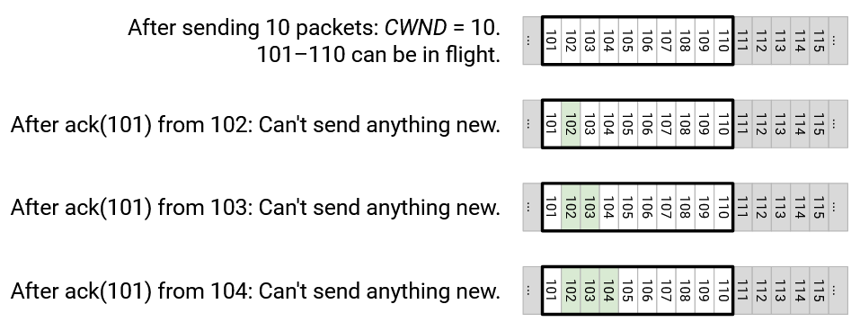

Như trước đây, chúng ta nhận được ack(101) từ 102, cửa sổ không thay đổi, và chúng ta không thể gửi bất cứ thứ gì mới.

Như trước đây, chúng ta nhận được ack(101) từ 103, cửa sổ không thay đổi, và chúng ta không thể gửi bất cứ thứ gì mới.

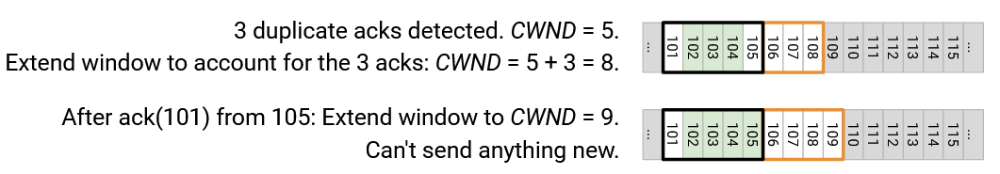

Như trước đây, chúng ta nhận được ack(101) từ 104, cửa sổ không thay đổi, và chúng ta không thể gửi bất cứ thứ gì mới.

*Duplicate ack* thứ ba có nghĩa là chúng ta giảm *CWND* xuống 5, vì vậy cửa sổ bây giờ là 101 đến 105.

Tuy nhiên, chúng ta đã nhận được 3 *ack*, vì vậy chúng ta mở rộng cửa sổ một cách nhân tạo thêm 3 để tính đến những *ack* đó. Do đó, *CWND* thực sự được đặt thành 5 + 3 = 8.

Tiếp theo, chúng ta nhận được ack(101) từ 105. Điều này cho phép chúng ta mở rộng cửa sổ một lần nữa, lên 9. Bây giờ cửa sổ kéo dài từ 101 đến 109, vì vậy chúng ta vẫn không thể gửi các *packet* mới.

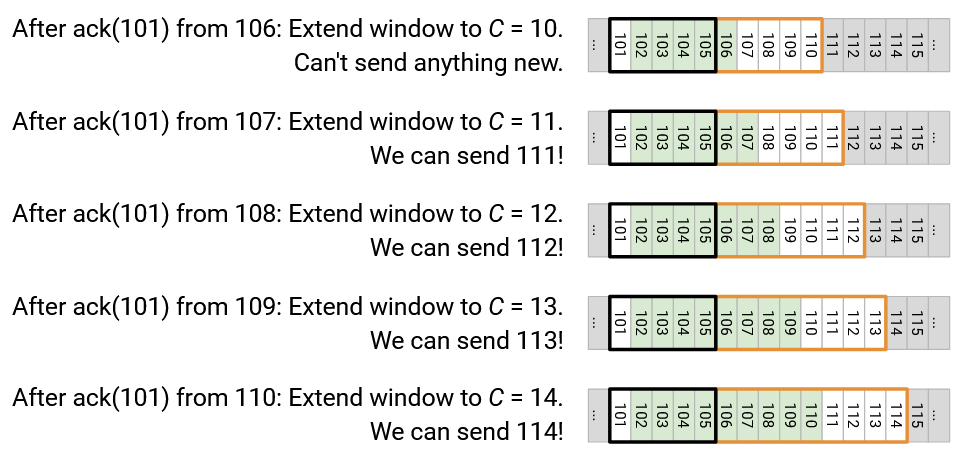

Tiếp theo, chúng ta nhận được ack(101) từ 106. Chúng ta lại mở rộng cửa sổ lên 10, kéo dài từ 101 đến 110, và chúng ta không thể gửi bất cứ thứ gì mới.

Tiếp theo, chúng ta nhận được ack(101) từ 107. Chúng ta lại mở rộng cửa sổ lên 11, kéo dài từ 101 đến 111. Bây giờ chúng ta có thể gửi đi 111\!

Tiếp theo, chúng ta nhận được ack(101) từ 108. Chúng ta lại mở rộng cửa sổ lên 12, kéo dài từ 101 đến 112. Bây giờ chúng ta có thể gửi đi 112\!

Tiếp theo, chúng ta nhận được ack(101) từ 109. Chúng ta lại mở rộng cửa sổ lên 13, kéo dài từ 101 đến 113. Bây giờ chúng ta có thể gửi đi 113\!

Tiếp theo, chúng ta nhận được ack(101) từ 110. Chúng ta lại mở rộng cửa sổ lên 14, kéo dài từ 101 đến 114. Bây giờ chúng ta có thể gửi đi 114\!

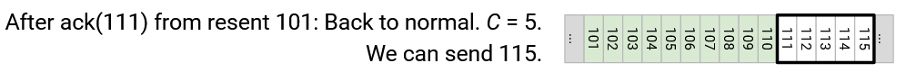

Cuối cùng, chúng ta nhận được ack(111) từ *packet* 101 được gửi lại. Tại thời điểm này, chúng ta có thể đặt lại *CWND* về giá trị dự định ban đầu là 5, để cửa sổ kéo dài từ 111 đến 115. Điều này cho phép chúng ta gửi đi 115\!

Với sửa lỗi này, chúng ta đã giải quyết được vấn đề bên gửi bị đình trệ. Ban đầu, bên gửi phải đợi *packet* 101 được gửi lại được xác nhận trước khi gửi các *packet* mới. Bây giờ, bên gửi có thể tiếp tục gửi các *packet* trước khi *packet* 101 được gửi lại được xác nhận.

Chúng ta cũng đã giải quyết vấn đề thứ hai từ trước đó, nơi cửa sổ nhảy về phía trước và chúng ta gửi một loạt *packet* mới (từ 111 đến 115). Bây giờ, từ 111 đến 114 đã được gửi đi sớm hơn, và khi cửa sổ nhảy về phía trước, chúng ta chỉ phải gửi đi 115.

Nếu không có sửa lỗi này, chúng ta đã phải đình trệ thêm một *round-trip* nữa trong khi chờ đợi loạt *packet* từ 111 đến 115 được xác nhận. Bây giờ, bởi vì chúng ta đã bận rộn hơn và gửi đi từ 111 đến 114, chúng sẽ được xác nhận sớm hơn, và chúng ta có thể tiếp tục gửi 116 và xa hơn nữa mà không cần cả *RTT* đình trệ đó.

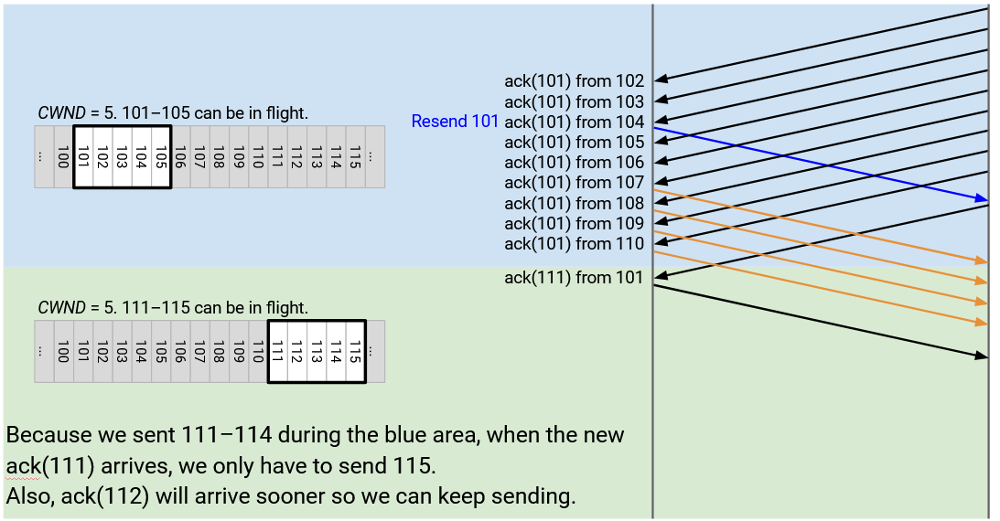

Một cách khác để nhìn vào sửa lỗi này là tập trung vào các *packet* trong cửa sổ được mở rộng nhân tạo.

Khi chúng ta nhận được *duplicate ack* thứ ba, *CWND* thu nhỏ xuống 5, nhưng chúng ta mở rộng nhân tạo cho 3 *duplicate acks* để có *CWND* là 8. Nếu bạn nhìn vào cửa sổ mở rộng này, 3 trong số các *packet* đã được xác nhận (102, 103, 104, mặc dù chúng ta không biết đó là những *packet* này), và 5 *packet* còn lại đang trên đường truyền. Điều này đạt được cửa sổ dự định của chúng ta là 5 *packet* đang trên đường truyền.

Tiếp theo, khi chúng ta nhận được một ack(101) khác từ 105, cửa sổ mở rộng lên 9. Một lần nữa, nếu bạn nhìn vào cửa sổ này, 4 trong số các *packet* đã được xác nhận (chúng ta không biết là *packet* nào), và 5 *packet* còn lại đang trên đường truyền, cho chúng ta cửa sổ dự định là 5 *packet* đang trên đường truyền.

Khi chúng ta nhận được ack(101) từ 106, cửa sổ mở rộng lên 10, bao gồm 5 *packet* đã nhận (từ 5 *duplicate acks*), cộng với 5 *packet* đang trên đường truyền (kích thước cửa sổ dự định).

Ở mỗi bước, trong cửa sổ mở rộng của chúng ta, nếu bạn không tính các *packet* đã được xác nhận, có chính xác 5 *packet* đang trên đường truyền trong cửa sổ. Một lần nữa, chúng ta không biết chính xác *packet* nào trong cửa sổ đã được xác nhận, nhưng chúng ta có thể sử dụng các *duplicate acks* để đếm có bao nhiêu *packet* đã được xác nhận, và sử dụng số đếm đó để giữ 5 *packet* đang trên đường truyền.

Khi chúng ta nhận được ack(101) từ 107, cửa sổ mở rộng lên 11, bao gồm 6 *packet* đã nhận (từ 6 *duplicate acks*). 5 *packet* còn lại trong cửa sổ được phép đang trên đường truyền.

Tại thời điểm này, chúng ta đã gửi 10 *packet* ban đầu, và chúng ta đã nhận được 6 *duplicate acks*, điều này cho chúng ta biết rằng chỉ còn 4 *packet* đang trên đường truyền. Điều này cho phép chúng ta gửi đi 111. Cửa sổ mở rộng nhân tạo nắm bắt được lý luận này, bởi vì nó mở rộng cửa sổ để bao gồm 111.

Khi chúng ta nhận được ack(101) từ 108, chúng ta suy luận rằng bây giờ, có ít hơn một *packet* đang trên đường truyền. Vì vậy, chúng ta lại mở rộng cửa sổ một cách nhân tạo lên 12, cho phép 112 được gửi đi.

## Fast Recovery: Triển khai

Khi chúng ta phát hiện mất *packet* từ các *duplicate acks*, chúng ta tạm thời vào chế độ ***fast recovery (phục hồi nhanh)***, nơi các *duplicate acks* bổ sung sẽ mở rộng cửa sổ một cách nhân tạo để ngăn chặn việc đình trệ.

Chế độ *fast recovery* được kích hoạt khi chúng ta nhận được 3 *duplicate acks*. Thay vì chỉ giảm một nửa *CWND*, như chúng ta đã làm trước đây, bây giờ chúng ta đặt *CWND* thành *CWND*/2 + 3, nơi cửa sổ được mở rộng nhân tạo thêm 3 cho 3 *duplicate acks* mà chúng ta đã nhận. Chúng ta cũng đặt *SSTHRESH* thành *CWND*/2, để chúng ta ghi nhớ tốc độ an toàn mới cho sau này.

Khi ở trong chế độ *fast recovery*, mỗi *duplicate ack* bổ sung khiến *CWND* tăng thêm 1, cho phép cửa sổ mở rộng một cách nhân tạo.

Cuối cùng, khi chúng ta nhận được một *ack* mới, không trùng lặp, chúng ta rời khỏi chế độ *fast recovery* và đặt *CWND* thành *SSTHRESH*. Lưu ý rằng trong khi chúng ta đang mở rộng cửa sổ một cách nhân tạo, *SSTHRESH* luôn giúp chúng ta ghi nhớ tốc độ ban đầu đã giảm đi một nửa mà chúng ta cuối cùng muốn gửi ở đó.

## Máy trạng thái TCP

Cuối cùng, chúng ta đã sẵn sàng để kết hợp tất cả các mảnh ghép lại và triển khai *TCP*, với *congestion control*.

Bên gửi duy trì 5 giá trị:

Số đếm *duplicate ack* giúp chúng ta phát hiện mất mát sớm hơn so với việc hết thời gian chờ. Nó được khởi tạo là 0.

Bộ đếm thời gian được sử dụng để phát hiện mất mát. Chỉ có một bộ đếm thời gian duy nhất.

*RWND* được sử dụng cho *flow control* (không làm quá tải bộ đệm của bên nhận).

*CWND* được sử dụng cho *congestion control*. Nó được khởi tạo là 1 *packet*.

*SSTHRESH* giúp thuật toán *congestion control* ghi nhớ tốc độ an toàn mới nhất. Nó được khởi tạo là vô cực.

Bên nhận duy trì một bộ đệm gồm các *packet* không theo thứ tự.

Bên gửi phản ứng với 3 sự kiện: *Ack* cho dữ liệu mới (chưa được *ack* trước đó), *duplicate ack*, và hết thời gian chờ.

Bên nhận phản ứng với việc nhận một *packet*, bằng cách trả lời bằng một *ack* và một giá trị *RWND*.

Hãy xem cách bên gửi phản ứng với mỗi trong 3 sự kiện.

Khi chúng ta nhận được một *ack* cho dữ liệu mới, chưa được *ack* trước đó: Nếu ở trong chế độ *slow-start*, chúng ta tăng *CWND* thêm 1. Điều này cho phép *CWND* nhân đôi mỗi *RTT*. Nếu chúng ta đang ở trong chế độ *fast-recovery*, chúng ta đặt *CWND* thành *SSTHRESH*, để chúng ta rời khỏi *fast recovery* (vì chúng ta vừa nhận được một *ack* mới). Nếu chúng ta đang ở trong chế độ tránh tắc nghẽn, chúng ta thêm 1/*CWND* vào *CWND*, để *CWND* tăng thêm 1 mỗi *RTT* (tăng cộng). Chúng ta cũng đặt lại bộ đếm thời gian, đặt lại số đếm *duplicate ack*, và, nếu cửa sổ cho phép, gửi dữ liệu mới.

Khi chúng ta nhận được một *duplicate ack*, chúng ta tăng số đếm *duplicate ack*. Nếu số đếm đạt 3, chúng ta gửi lại *packet* ngoài cùng bên trái trong cửa sổ. Điều này đôi khi được gọi là *fast retransmit*. Chúng ta cũng vào chế độ *fast-recovery* bằng cách đặt *SSTHRESH* thành *CWND*/2 (ghi nhớ tốc độ an toàn cuối cùng) và đặt *CWND* thành *CWND*/2 + 3 (thêm 3 để mở rộng cửa sổ một cách nhân tạo cho các *duplicate acks*). Nếu số đếm vượt quá 3, chúng ta ở lại trong chế độ *fast-recovery* và mở rộng *CWND* một cách nhân tạo thêm 1 cho mỗi *duplicate ack* tiếp theo.

Khi bộ đếm thời gian hết hạn, chúng ta gửi lại *packet* ngoài cùng bên trái trong cửa sổ. Chúng ta cũng quay trở lại chế độ *slow-start*, đặt *SSTHRESH* thành *CWND*/2 (ghi nhớ tốc độ an toàn cuối cùng), và đặt lại *CWND* về 1 *packet*.

Máy trạng thái *congestion control* cho thấy 3 chế độ có thể có mà *TCP* có thể ở, và các điều kiện kích hoạt sự chuyển đổi giữa các chế độ.

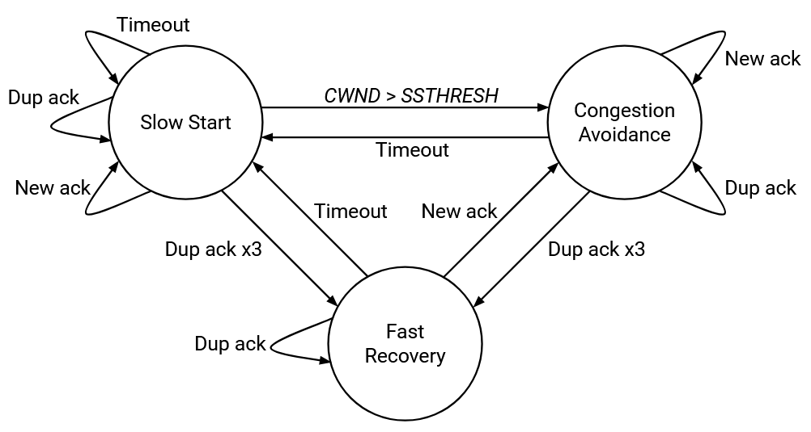

Chúng ta vào chế độ *fast-recovery* nếu chúng ta nhận được 3 *duplicate acks*. Một khi chúng ta ở trong chế độ này, bất kỳ *duplicate acks* nào nữa cũng sẽ giữ chúng ta ở trong chế độ *fast-recovery* (tiếp tục mở rộng cửa sổ một cách nhân tạo). Để rời khỏi chế độ *fast-recovery*, hoặc là một lần hết thời gian chờ sẽ chuyển chúng ta trở lại chế độ *slow-start*, hoặc một *ack* mới cho phép chúng ta quay trở lại chế độ tránh tắc nghẽn.

Một lần hết thời gian chờ sẽ kích hoạt chế độ *slow-start*. Bất kỳ *ack* nào nữa (trùng lặp hoặc mới) cũng sẽ giữ chúng ta ở trong *slow-start*. Cuối cùng, nếu *CWND* vượt quá *SSTHRESH* (tốc độ an toàn), chúng ta sẽ vào chế độ tránh tắc nghẽn. Hoặc, nếu chúng ta phát hiện mất mát, chúng ta sẽ giảm một nửa tốc độ và vào chế độ *fast-recovery* một chút trước khi chuyển sang chế độ tránh tắc nghẽn.

Trong chế độ tránh tắc nghẽn, các *ack* mới sẽ giữ chúng ta ở trong chế độ này (tăng cộng), nhưng các *duplicate acks* sẽ gửi chúng ta đến chế độ *fast-recovery*, và việc hết thời gian chờ sẽ gửi chúng ta đến chế độ *slow-start*.

## Các Biến thể Kiểm soát Tắc nghẽn TCP

Có một số biến thể của thuật toán *congestion control* *TCP*, tất cả đều được triển khai trong hệ điều hành của *host* cuối. Sự thật thú vị: Các tên này liên quan đến hệ điều hành Berkeley Software Distribution (BSD).

Trong *TCP Tahoe*, nếu chúng ta nhận được ba *duplicate acks*, chúng ta đặt lại *CWND* về 1, thay vì giảm một nửa *CWND*.

Trong *TCP Reno*, nếu chúng ta nhận được ba *duplicate acks*, chúng ta giảm một nửa *CWND*. Khi hết thời gian chờ, chúng ta đặt lại *CWND* về 1.

*TCP New Reno* giống như Reno, nhưng thêm *fast recovery*. Đây là những gì chúng ta vừa triển khai.

Các biến thể khác cũng tồn tại. Trong *TCP-SACK*, chúng ta thêm các *selective acknowledgments (xác nhận chọn lọc)* nơi các *ack* chứa nhiều chi tiết hơn (ví dụ: đã nhận tất cả đến 13, và cả 18 nữa).

Làm thế nào mà tất cả các biến thể khác nhau này có thể cùng tồn tại? Tại sao chúng ta không cần một giao thức thống nhất duy nhất mà mọi người đều nói? Hãy nhớ rằng, *congestion control* được triển khai ở các *host* cuối, vì vậy bên gửi có thể làm bất cứ điều gì họ muốn để điều chỉnh tốc độ của mình. Cuối cùng, mạng và các *host* cuối khác chỉ thấy các *packet* *TCP* được gửi ở một tốc độ (hy vọng là hợp lý), và họ không quan tâm tốc độ đang được tính toán như thế nào. Định dạng *packet* *TCP* cơ bản không thay đổi với các thuật toán *congestion control* khác nhau.

Tuy nhiên, không phải tất cả các giao thức đều tương thích. Nếu bạn sử dụng biến thể *TCP-SACK* với các *selective acknowledgements*, và tôi sử dụng *TCP Tahoe*, chúng ta có một vấn đề. Bạn mong đợi các *ack* chọn lọc, nhưng tôi chỉ cung cấp các *cumulative acks*.