# Mạng Di động (Cellular)

## Tại sao nên nghiên cứu về Mạng Di động?

Kết nối di động không dây là tiêu chuẩn hiện đại. Điện thoại của bạn có thể kết nối Internet trong khi bạn đang ở trên một chiếc xe hơi đang di chuyển.

Các mạng Internet truyền thống không thể hỗ trợ điều này. Bạn có thể di chuyển từ phòng ngủ đến nhà bếp và vẫn có quyền truy cập Internet. Trong trường hợp đó, bạn đang ở trong phạm vi phủ sóng của **Router** (Bộ định tuyến) không dây tại nhà, thiết bị này sau đó được kết nối qua dây dẫn đến phần còn lại của Internet. Tuy nhiên, Internet truyền thống không cung cấp các kết nối liền mạch trên các khoảng cách xa (ví dụ: khi di chuyển bằng ô tô).

Có nhiều cách để triển khai kết nối di động không dây, nhưng mạng di động là công nghệ truy cập chiếm ưu thế hiện nay. Hơn một nửa lưu lượng web ngày nay bắt nguồn từ một thiết bị di động!

Mạng di động chỉ là một trong nhiều công nghệ có thể cung cấp kết nối di động không dây. Các công nghệ khác như vệ tinh hoặc quang học không gian tự do cũng tồn tại, mặc dù mạng di động vẫn là phương pháp chủ đạo ngày nay.

Trong tương lai, các ứng dụng hiệu suất cao yêu cầu công nghệ di động không dây, như ô tô tự lái hoặc thực tế ảo, có thể dẫn đến nhiều sự đổi mới hơn. Các mạng di động hiện tại có thể trở nên đắt đỏ một cách cấm đoán khi chúng ta cố gắng mở rộng quy mô để hỗ trợ các ứng dụng trong tương lai. Ngoài ra, các nhà khai thác mạng di động như AT&T và Verizon không có tiếng là đổi mới nhanh chóng. Sự đồng thuận chung là đây là một lĩnh vực chín muồi cho sự đột phá trong tương lai gần và là một lĩnh vực nghiên cứu tích cực.

## Lược sử Mạng Di động

Công nghệ di động bắt nguồn từ hệ thống điện thoại cũ. Các mạng di động lần đầu tiên được phát triển để cho phép người dùng thực hiện các cuộc gọi điện thoại không dây, thay vì trên một đường dây điện thoại cố định có dây. Chiếc điện thoại di động đầu tiên được bán vào năm 1983 với giá $4,000 (cao hơn rất nhiều ngày nay, sau khi tính lạm phát).

Do công nghệ di động bắt nguồn từ mạng điện thoại (chứ không phải Internet), nhiều lựa chọn thiết kế khác với Internet truyền thống. Trong nhiều năm, công nghệ di động (ví dụ: điện thoại di động tiền-smartphone cho các cuộc gọi thoại) và Internet đã phát triển song song, mỗi bên có một bộ lựa chọn kiến trúc khác nhau.

Ví dụ, mạng di động sử dụng cơ chế **resource reservations** (dành riêng tài nguyên), trong khi Internet hiện đại sử dụng **packet switching** (chuyển mạch gói). Các mạng di động thường tư duy theo từng người dùng cá nhân, trong khi Internet chủ yếu tư duy theo từng luồng hoặc gói tin cá nhân. Mô hình kinh doanh của các mạng di động (ví dụ: tính phí người dùng theo phút) khác với Internet, vốn thường không theo dõi việc sử dụng nhiều như vậy.

Trong những năm gần đây, các mạng di động đã trở nên tương thích hơn với Internet truyền thống. Ngày nay, bạn có thể coi mạng di động như một mạng cục bộ Lớp 2 chuyên dụng có thể tương tác với phần còn lại của Internet **TCP/IP** truyền thống.

## Các Tiêu chuẩn Di động

Trong Internet truyền thống, chúng ta đã thấy rằng các cơ quan tiêu chuẩn hóa giúp chúng ta chuẩn hóa các giao thức như **TCP** và **IP**. Mạng di động cũng có nhiều cơ quan tiêu chuẩn hóa hợp tác để tạo ra một tiêu chuẩn.

Ở một số khía cạnh, các cơ quan tiêu chuẩn hóa mạng di động có sự phức tạp chính trị trong đời thực nhiều hơn các cơ quan tiêu chuẩn hóa Internet. Để đạt được khả năng tương tác, tất cả các nhà sản xuất điện thoại di động và tất cả các nhà khai thác mạng (ví dụ: Verizon xây dựng các trạm phát sóng di động) cần phải đồng ý về các giao thức, xuống tận lớp vật lý.

Cơ quan tiêu chuẩn hóa chính trong thế giới di động là **3GPP** (Dự án Đối tác Thế hệ thứ 3). Các nhà cung cấp thiết bị lớn và các công ty viễn thông đều tham gia vào tổ chức này. **3GPP** đề xuất các tiêu chuẩn, sau đó được chuyển đến **ITU** (Liên minh Viễn thông Quốc tế). **ITU** là một phần của Liên Hợp Quốc và mỗi quốc gia có một phiếu bầu, vì vậy cũng có một số yếu tố chính trị liên quan đến các tiêu chuẩn. (Thông tin thú vị: Mỗi quốc gia có một phiếu bầu, vì vậy Mỹ có thể bị Liên minh châu Âu bỏ phiếu áp đảo.)

Thông thường, một thế hệ công nghệ mới được giới thiệu sau mỗi 10 năm. Bây giờ bạn đã biết các con số trong 2G, 3G, 4G và 5G đại diện cho điều gì (các thế hệ công nghệ di động). Mạng 5G được định nghĩa vào khoảng năm 2020, và các nhà khai thác vẫn đang triển khai công nghệ này. Việc lập kế hoạch cho tiêu chuẩn 6G sẽ bắt đầu trong vài năm tới (cuối những năm 2020).

Mỗi thế hệ cố gắng cải tiến so với thế hệ trước trên nhiều phương diện, bao gồm tốc độ dữ liệu lý thuyết cao nhất, tốc độ dữ liệu trung bình mà người dùng trải nghiệm, tính di động (kết nối trong khi người dùng đang di chuyển ở tốc độ cao), mật độ kết nối (số lượng thiết bị trong một khu vực cụ thể), v.v. Mỗi thế hệ thường hoạt động tốt hơn khoảng 10 lần so với thế hệ trước trên tất cả các phương diện này.

Ngoài những cải tiến về hiệu suất, thiết kế kiến trúc cũng đã phát triển qua các thế hệ, để chuyển từ thiết kế mạng điện thoại sang thiết kế Internet. Điện thoại 1G hoàn toàn là analog, được thiết kế cho các cuộc gọi thoại. 2G/3G vẫn chủ yếu là chuyển mạch kênh, tập trung vào lưu lượng thoại (một chút tin nhắn, hầu như không có lưu lượng Internet). Từ 4G trở đi, chúng ta đã chuyển sang kiến trúc **packet-switched**, và thoại giờ đây chỉ là một trong nhiều ứng dụng chạy trên mạng.

Các thông số kỹ thuật di động dài hàng nghìn trang và bao gồm hàng trăm tài liệu, và gần như không ai thực sự đọc hết chúng. Một đặc điểm bất tiện của các tiêu chuẩn này là mọi thứ đều được đổi tên khi chúng ta chuyển từ thế hệ này sang thế hệ tiếp theo. Ví dụ, các trạm phát sóng di động đã được gọi là "base station", "nodeB", "evolved NodeB (eNodeB)", và "next-gen Node B (gNB)", tất cả đều có nghĩa giống nhau. Trong lớp học này, chúng ta sẽ tự đặt ra thuật ngữ riêng để làm cho các tên gọi trở nên trực quan hơn. Nếu bạn xem qua một cuốn sách giáo khoa hoặc một thông số kỹ thuật, bạn có thể thấy các tên gọi khác nhau, nhưng các ý tưởng chúng ta sẽ thấy nhìn chung nên nhất quán về mặt khái niệm với sách giáo khoa và thông số kỹ thuật.

## Thách thức chính: Tính di động (Mobility)

Thách thức chính khiến mạng di động trở nên khó khăn là **mobility** (tính di động). Hãy nhớ rằng, hãy nghĩ về **mobility** như việc điện thoại của bạn đang phát video khi bạn đang di chuyển trên đường cao tốc (tuy nhiên đừng xem video khi đang lái xe). Có bốn thách thức cơ bản mà chúng ta sẽ nghiên cứu:

1.  **Discovery** (Khám phá): Khi tôi đang di chuyển, làm cách nào để biết nên kết nối với trạm phát sóng di động nào?
2.  **Authentication** (Xác thực): Trạm phát sóng của AT&T có thể chỉ muốn cung cấp kết nối cho khách hàng của mình, chứ không phải các khách hàng khác. Làm thế nào trạm phát sóng di động đạt được điều này?
3.  **Seamless communication** (Giao tiếp liền mạch): Nếu tôi di chuyển ra khỏi phạm vi của một trạm phát sóng và vào phạm vi của một trạm phát sóng khác, kết nối của tôi phải liền mạch, không bị gián đoạn.
4.  **Accountability** (Giải trình trách nhiệm): Nếu khách hàng chỉ trả tiền cho 6GB dữ liệu, mạng nên ngừng cung cấp kết nối cho khách hàng (hoặc cung cấp kết nối kém hơn) sau khi khách hàng đã vượt quá giới hạn của họ. Yêu cầu này xuất phát từ mạng di động cũ (trả tiền theo phút gọi thoại), và vẫn tồn tại vì tài nguyên trong mạng di động rất khan hiếm.

## Các thành phần hạ tầng: Trạm phát sóng vô tuyến (Radio Towers)

Các thành phần của một mạng di động là gì? Đầu tiên, có trạm phát sóng vô tuyến.

Trạm phát sóng vô tuyến có một ăng-ten. Bên trong trạm là một bộ thu phát vô tuyến, có chức năng chuyển đổi các bit kỹ thuật số thành tín hiệu analog được gửi qua giao diện không gian.

Cũng bên trong trạm là một bộ điều khiển vô tuyến, quyết định cách phân bổ tài nguyên vô tuyến.

Bạn có thể coi bộ điều khiển như một CPU đang chạy một bộ lập lịch. Bộ điều khiển phân bổ các đoạn tần số và thời gian khác nhau cho các khách hàng khác nhau, tùy thuộc vào nhu cầu và mô hình kinh doanh (ví dụ: khách hàng đang trả bao nhiêu tiền). Đây thực sự là một bài toán lập lịch khá khó, mặc dù chúng ta sẽ không thảo luận thêm ở đây.

Đây là một mô hình đơn giản hóa về việc bộ điều khiển vô tuyến phân bổ tài nguyên. Mỗi hình chữ nhật có màu cho chúng ta thấy rằng một người dùng (được ký hiệu bằng màu) có thể sử dụng tần số cụ thể đó, tại thời điểm cụ thể đó.

Mỗi mặt cắt dọc đại diện cho một khe thời gian, và cho bạn thấy các tần số đã được phân bổ cho người dùng trong mặt cắt đó như thế nào. Ví dụ, trong khe thời gian đầu tiên, người dùng màu xanh lam nhận được 3 khe tần số, người dùng màu cam nhận được 5 khe tần số và người dùng màu xám nhận được 4 khe tần số.

Mỗi mặt cắt ngang đại diện cho một tần số, và cho bạn thấy tần số cụ thể đó được phân bổ cho người dùng theo thời gian như thế nào. Ví dụ, hàng trên cùng cho thấy một tần số được phân bổ cho màu xám, sau đó là màu xanh lá cây, sau đó là màu xanh lam, sau đó là màu đỏ, và cứ thế tiếp tục.

Lưu ý rằng mô hình này đang chia sẻ tài nguyên bằng cách sử dụng **reservations** (cơ chế đặt trước), không phải nỗ lực tối đa. Một người dùng chỉ có thể gửi trong một tần số và thời gian đã được bộ điều khiển phân bổ cho họ.

Các bộ điều khiển vô tuyến trước đây thường được lắp đặt trong trạm phát sóng hoặc gần trạm, tuy nhiên ngày nay, đã có những nỗ lực để chuyển các bộ điều khiển lên đám mây để bảo trì và quản lý dễ dàng hơn.

Mỗi nhà khai thác vận hành nhiều trạm phát sóng di động, được bố trí khắp cả nước, để người dùng có thể kết nối với một trạm dù họ ở bất cứ đâu. Kết quả là một **Radio Access Network (RAN)** (Mạng Truy cập Vô tuyến).

Thông thường, mỗi trạm phát sóng nhận được một bộ tần số riêng mà nó có thể sử dụng, và các tần số được gán sao cho các trạm lân cận nhận được các dải tần số khác nhau. Điều này đảm bảo rằng các trạm lân cận không sử dụng cùng tần số và gây nhiễu cho nhau. Trong hình này, mỗi màu tương ứng với một bộ tần số. Có thể hai trạm cùng sử dụng bộ tần số màu xanh lam, nhưng chúng không nằm cạnh nhau nên sẽ không gây nhiễu. Bất kỳ trạm lân cận nào cũng đang sử dụng các tần số không chồng chéo. Lưu ý rằng các tần số thường được phân bổ theo nhu cầu, do đó một trạm phát sóng di động ở trung tâm thành phố San Francisco sẽ nhận được nhiều tần số hơn một trạm ở giữa một nơi hẻo lánh.

## Các thành phần hạ tầng: Lõi Mạng Di động (Cellular Core)

Một người dùng di động giờ đây có thể gửi dữ liệu đến một trạm phát sóng di động. Trạm phát sóng di động giờ cần gửi dữ liệu đó đến phần còn lại của Internet.

Mỗi trạm phát sóng di động có một kết nối có dây đến **cellular core** (lõi mạng di động). Bạn có thể coi **cellular core** là hạ tầng backend của mạng di động (không phải phần hướng tới người dùng).

**Cellular core** chứa một số thành phần mặt phẳng dữ liệu. Bạn có thể coi chúng như các **router** và **switch** thông thường chuyển tiếp các gói tin giữa người dùng (thông qua các trạm phát sóng) và phần còn lại của mạng. Chúng ta sẽ tập trung vào hai loại **router** đặc biệt trong **cellular core**.

**Radio gateway** (Cổng vô tuyến) là ranh giới giữa **RAN** (các trạm phát sóng di động) và **cellular core**. Một trạm phát sóng di động chuyển tiếp dữ liệu của mình đến một trong những **radio gateway** này. Ở đầu kia của lõi, **packet gateway** (cổng gói tin) là ranh giới giữa mạng di động và phần còn lại của Internet. Dữ liệu từ người dùng cuối cùng sẽ đến **packet gateway** và được gửi ra Internet dưới dạng một gói **TCP/IP** tiêu chuẩn.

**Cellular core** cũng chứa một số thành phần mặt phẳng điều khiển. Chúng ta không có những thành phần này trong Internet truyền thống. Lưu lượng của người dùng không đến các thành phần này. Chúng ta sẽ tập trung vào hai thành phần mặt phẳng điều khiển.

**Database** (Cơ sở dữ liệu) lưu trữ thông tin về khách hàng, chẳng hạn như: Khách hàng sở hữu những thiết bị nào? Khách hàng có gói dữ liệu nào? Thiết bị của khách hàng hiện đang ở đâu (ví dụ: đang kết nối với trạm nào)?

**Mobility manager** (Trình quản lý di động) là một bộ điều khiển (hãy nghĩ nó giống như một CPU) quản lý chức năng mạng. Trình quản lý giúp chúng ta xác thực một người dùng (ví dụ: kiểm tra xem họ có thực sự là khách hàng của Verizon hay không). Trình quản lý cũng giúp chúng ta cập nhật các cấu hình khi người dùng di chuyển.

Để tóm tắt về hạ tầng: Các thiết bị người dùng gửi dữ liệu đến các trạm phát sóng di động trong **RAN**. Trạm phát sóng di động chuyển tiếp dữ liệu đến **radio gateway** (đi vào lõi). Dữ liệu cuối cùng đến **packet gateway** và được chuyển tiếp đến Internet (ra khỏi lõi). Cũng trong lõi là các thành phần điều khiển (**mobility manager**, **database**) để lưu trữ và quản lý thông tin về khách hàng.

## Các Bước Hoạt động ở Mức Cao của Mạng Di động

**Bước 0: Registration (Đăng ký).** Người dùng đăng ký dịch vụ di động. Ví dụ, bạn bước vào một cửa hàng của Verizon, mua một **data plan** (gói dữ liệu) và ký hợp đồng. Nhà khai thác lúc này sẽ lưu trữ thông tin về bạn và gói dịch vụ của bạn trong **database**.

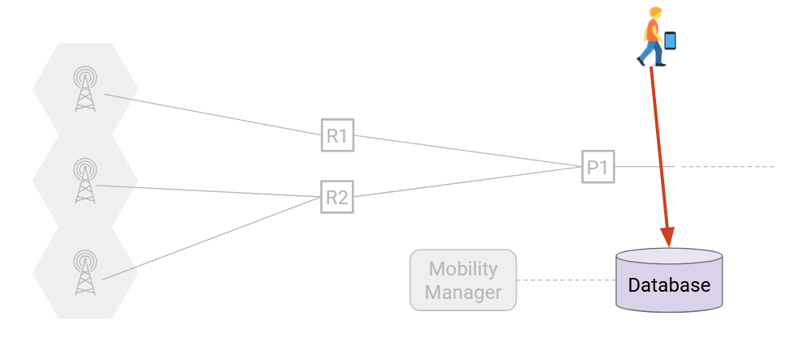
 
**Bước 1: Discovery.** Người dùng bật điện thoại của họ ở một nơi bất kỳ. Điện thoại của họ phải khám phá xem có những trạm phát sóng nào ở gần, và cũng phải chọn một trạm để sử dụng.

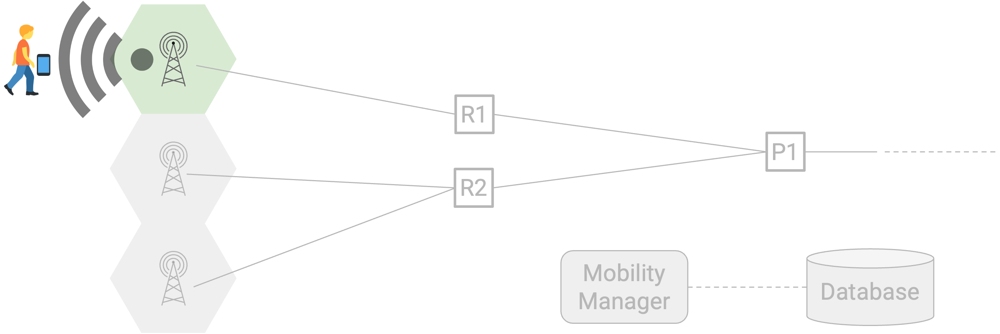

**Bước 2: Attachment (Gắn kết).** Sau khi chọn một trạm phát sóng, thiết bị của người dùng thông báo cho trạm rằng nó muốn kết nối. Trạm phát sóng phải hỏi **mobility manager** xem kết nối có được phép không (ví dụ: kiểm tra xem người dùng đã vượt quá hạn ngạch của họ chưa).

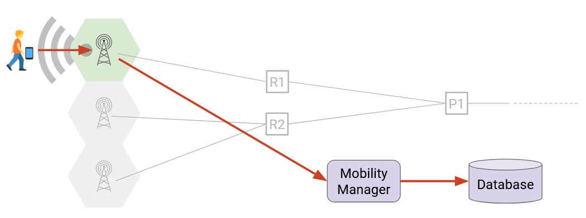

Nếu việc xác thực thành công, **mobility manager** sẽ cấu hình trạm phát sóng và các **router** để thiết lập một đường dẫn từ người dùng đến Internet (thông qua trạm phát sóng và các **router**).

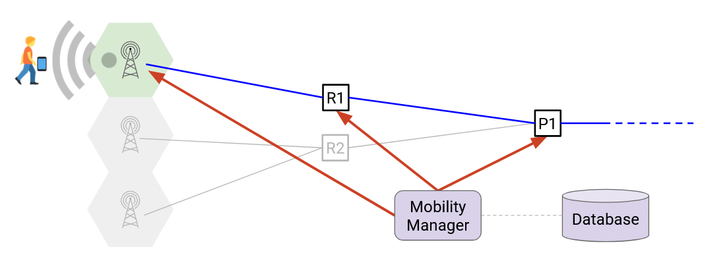

**Bước 3: Data exchange (Trao đổi dữ liệu).** Người dùng bây giờ có thể gửi và nhận dữ liệu dọc theo đường dẫn đã được cấu hình.

**Bước 4: Handover (Chuyển giao).** Khi người dùng di chuyển, họ có thể đi xa khỏi trạm phát sóng ban đầu của mình và đến gần một trạm mới hơn (trong cùng **RAN** của nhà khai thác). Trạm cũ, trạm mới và thiết bị của người dùng đều phối hợp với nhau để quyết định xem người dùng có nên chuyển trạm hay không.

Nếu tất cả đều đồng ý rằng người dùng nên chuyển trạm, họ sẽ thông báo cho **mobility manager**, và **mobility manager** sẽ cấu hình lại trạm phát sóng và các **router** để thiết lập một đường dẫn mới từ người dùng đến Internet (lúc này sử dụng trạm mới, và có thể cả các **router** khác). Quá trình chuyển giao này phải liền mạch, nghĩa là người dùng có thể gửi và nhận dữ liệu trong suốt quá trình và không bị gián đoạn. Để đạt được một cuộc **handover** liền mạch như vậy đòi hỏi mạng phải liên tục giám sát thiết bị người dùng.

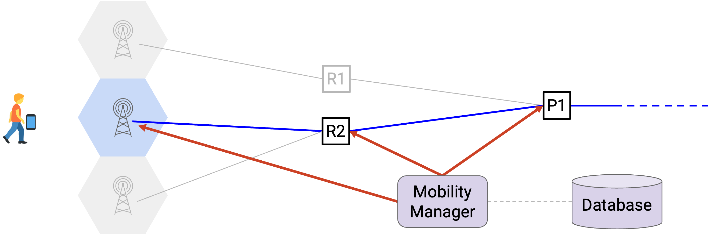

Các bước 3 và 4 có thể lặp lại khi người dùng di chuyển và **router** tốt nhất để sử dụng liên tục thay đổi.

Một tính năng cuối cùng chúng ta cần triển khai là **roaming** (chuyển vùng). Nếu người dùng đến một quốc gia khác như Đức, nhà khai thác của họ (ví dụ: Verizon, có trụ sở tại Mỹ) có thể không có vùng phủ sóng ở Đức. Nhưng, Verizon có thể ký hợp đồng với Deutsche Telecom (một nhà khai thác ở Đức), để cho phép khách hàng của Verizon sử dụng cơ sở hạ tầng của Deutsche Telecom. Điều này có nghĩa là Deutsche Telecom có thể cần hỗ trợ không chỉ người dùng của mình, mà cả người dùng từ các mạng khác như Verizon.

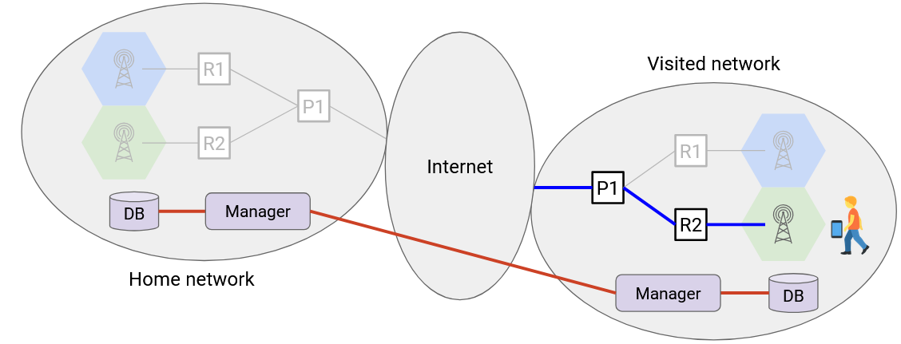

Các bước kết nối trong một mạng khách (khi đang **roaming**) nói chung khá tương tự, ngoại trừ việc các **mobility manager** trong mạng khách và mạng chủ cũng phải phối hợp với nhau (ví dụ: Deutsche Telecom kiểm tra với Verizon để xem người dùng có trả tiền cho dịch vụ **roaming** hay không).

## Bước 0: Registration

Khi bạn đăng ký một **data plan**, bạn sẽ nhận được một **IMSI (International Mobile Subscriber Identity)** (Nhận dạng Thuê bao Di động Quốc tế), đây là một mã định danh duy nhất được liên kết với thuê bao của bạn. Số này được lưu trữ an toàn trong phần cứng của một **SIM card** (thẻ SIM).

Lưu ý: Đây là lý do tại sao các nhà khai thác như Verizon cung cấp cho bạn một **SIM card** để lắp vào điện thoại. Nếu bạn đổi điện thoại nhưng vẫn giữ nguyên gói cước, bạn chỉ cần chuyển **SIM card** sang điện thoại mới, và bây giờ điện thoại mới của bạn được liên kết với cùng một số **IMSI**. Hoặc, nếu bạn đổi gói cước nhưng sử dụng cùng một điện thoại, bạn lắp một **SIM card** mới vào điện thoại, và bây giờ điện thoại đó được liên kết với một số **IMSI** mới.

3 chữ số đầu tiên của **IMSI** là **Mobile Country Code** (Mã Quốc gia Di động), xác định một quốc gia. 2-3 chữ số tiếp theo là **Mobile Network Code** (Mã Mạng Di động), đại diện cho nhà cung cấp dịch vụ của bạn (ví dụ: Verizon, AT\&T). Các chữ số còn lại là **Mobile Subscriber Identification Number** (Số Nhận dạng Thuê bao Di động), xác định một người dùng cụ thể trong nhà cung cấp dịch vụ đó. Tổng thể **IMSI** không thể vượt quá 15 chữ số.

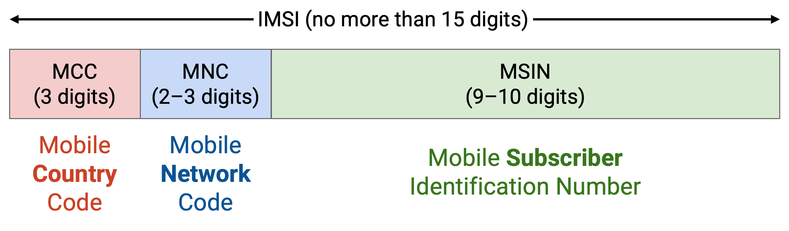

Lưu ý rằng **IMSI** không giống như một **IP address** (địa chỉ IP). Nếu bạn trả tiền cho một **data plan** kéo dài một năm, bạn sẽ giữ nguyên **IMSI** trong cả năm. Nhưng, mỗi lần bạn **attachment** và kết nối với mạng, bạn có thể nhận được một **IP address** khác nhau.

Có hai mã định danh khác được sử dụng trong các mạng di động. Chúng khác biệt với **IMSI**, và chúng ta sẽ không đề cập chi tiết về chúng. **IMEI (International Mobile Equipment Identity)** (Nhận dạng Thiết bị Di động Quốc tế) định danh duy nhất một thiết bị vật lý. **IMEI** mã hóa nhà sản xuất và kiểu máy của thiết bị ("đây là một chiếc iPhone 13"), và không thay đổi ngay cả khi bạn thay đổi **data plan**. Hoặc, nếu bạn có hai điện thoại được bao phủ bởi cùng một **data plan**, bạn sẽ có hai số **IMEI**, nhưng chỉ có một **IMSI** duy nhất.

Mã định danh còn lại là số điện thoại của bạn. Một lần nữa, điều này khác biệt với **IMSI** hoặc **IMEI**, và các chữ số đại diện cho những thứ khác nhau (ví dụ: mã vùng của bạn). Mạng điện thoại sẽ cần liên kết số điện thoại của bạn với một **IMSI** cụ thể để xác định gói cước điện thoại của bạn.

Sau khi bạn đăng ký và nhận được **IMSI**, nhà khai thác (ví dụ: Verizon) sẽ lưu trữ **IMSI** của bạn và thông tin về gói cước của bạn trong **database**.

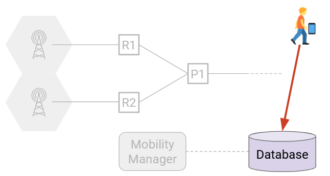

Trong quá trình **registration**, thiết bị của người dùng (**SIM card**) và nhà khai thác (**database**) cũng đồng ý về một khóa bí mật chia sẻ. Điều này sẽ hữu ích khi chúng ta thực hiện **attachment**.

## Bước 1: Discovery

Làm thế nào thiết bị người dùng khám phá ra những trạm phát sóng nào đang trong tầm phủ sóng và thuộc sở hữu của nhà khai thác của người dùng?

Mỗi trạm phát sóng sẽ truyền các **beacons** (tín hiệu báo hiệu) định kỳ, thông báo cho mọi người trong phạm vi rằng trạm đó tồn tại. Thông điệp **beacon** cũng bao gồm nhà khai thác mạng (ví dụ: xin chào, tôi là một trạm của Verizon), trong đó nhà khai thác được xác định bằng **Mobile Network Code** gồm 2-3 chữ số. Hãy nhớ rằng, **IMSI** của thiết bị (trên **SIM card**) cũng có một **Mobile Network Code**, vì vậy thiết bị có thể kiểm tra: **SIM card** của tôi nói rằng tôi ở trong mạng 220, và **beacon** của trạm này nói rằng nó ở trong mạng 220, vì vậy tôi có thể sử dụng trạm này.

**Beacon** được truyền trên một tần số cụ thể gọi là **control channel** (kênh điều khiển), để **beacon** không gây nhiễu với việc truyền dữ liệu. Mỗi dải tần số có một **control channel** liên quan riêng. Nhớ lại rằng các trạm lân cận có các dải tần số không chồng chéo, điều này cũng có nghĩa là chúng có các **control channel** khác nhau (tránh nhiễu).

Thiết bị của người dùng có thể nghe thấy nhiều **beacons**. Người dùng đo cường độ tín hiệu đến các trạm khác nhau và chọn trạm (thuộc nhà khai thác của mình) có tín hiệu tốt nhất.

Có một vấn đề chúng ta phải giải quyết. Làm thế nào thiết bị của người dùng biết nên nghe **control channel** nào? Thiết bị cần phải dò đúng **control channel** để nhận được các **beacons**. Chúng ta có một **bootstrapping problem** (vấn đề mồi).

Có một vài giải pháp cho vấn đề này. Thiết bị có thể chỉ cần quét và thử một loạt tần số (chậm, nhưng đôi khi là lựa chọn duy nhất). Nhà khai thác có thể cung cấp cho thiết bị một danh sách các **control channel** được cấu hình sẵn trong quá trình **registration**. Thiết bị cũng có thể lưu vào bộ đệm các kênh đã sử dụng trước đó.

Lưu ý rằng việc quét các trạm tiếp theo sau khi **discovery** là không cần thiết. Trong quá trình **handover**, trạm cũ sẽ cho người dùng biết chính xác tần số dữ liệu nào để sử dụng trên trạm mới. Đây là lý do tại sao **handover** (cỡ 0.01--0.1 giây) nhanh hơn nhiều so với việc quét trong quá trình **discovery** (cỡ 10--100 giây).

## Bước 2: Attachment

1.  Khi một người dùng đã khám phá ra một trạm, nó sẽ gửi một **attach request** (yêu cầu gắn kết) đến trạm đó. Người dùng bao gồm **IMSI** của mình (ID thuê bao) trong yêu cầu.
2.  Trạm sau đó phải gửi yêu cầu đến **mobility manager**, nơi thực sự xử lý yêu cầu.
3.  Trình quản lý tra cứu **IMSI** trong **database** để biết chi tiết về gói dịch vụ của người dùng. Trình quản lý cũng thực hiện xác thực (chi tiết mã hóa bị bỏ qua) bằng cách sử dụng khóa bí mật được biết bởi thiết bị và trình quản lý (trong **database** của nó).

Nếu xác thực thành công, chúng ta biết người dùng chính là người mà họ tự nhận. Nếu việc tra cứu **database** cũng cho thấy người dùng đủ điều kiện sử dụng dịch vụ, thì trình quản lý sẽ chấp thuận **attach request**.

4.  Sau khi **attach request** được chấp thuận, **mobility manager** bây giờ phải cấu hình **data plane** để cung cấp kết nối cho người dùng. Đầu tiên, trình quản lý gán một **IP address** cho thiết bị. Sau đó, trình quản lý cấu hình trạm, cho bộ điều khiển vô tuyến của trạm biết cần phân bổ bao nhiêu tài nguyên cho người dùng này. Trình quản lý cũng cấu hình trạm và các **router** để tạo ra một đường dẫn giữa thiết bị và Internet. Cuối cùng, trình quản lý khởi tạo các bộ đếm và bộ định hình để theo dõi việc sử dụng Internet của thiết bị.

Sau khi thiết lập kết nối cho người dùng, trình quản lý kết thúc bằng cách ghi lại thông tin vị trí của người dùng trong **database**. Cụ thể, **database** ánh xạ **IMSI** của người dùng tới **IP address** của nó và đường dẫn mà nó đang sử dụng (trạm nào, cổng nào).

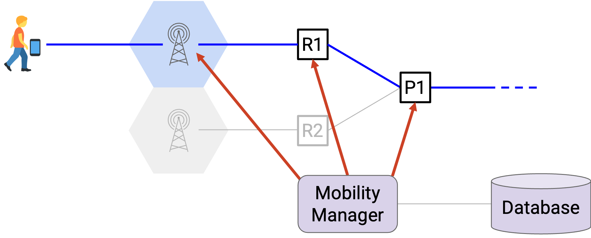

Lưu ý rằng toàn bộ quá trình **attachment** xảy ra trên các **control channel**. Chúng ta chưa gán bất kỳ tần số nào cho người dùng, vì vậy người dùng phải sử dụng các **control channel** chuyên dụng để giao tiếp.

## Bước 3: Data Exchange

Tại thời điểm này, mạng được cấu hình để thiết bị có thể sử dụng **IP address** của mình để gửi và nhận tin nhắn.

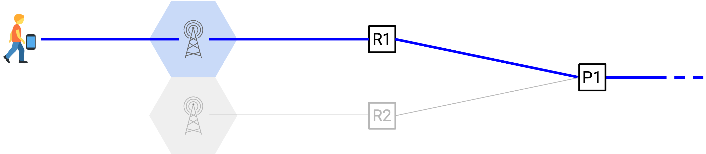

Làm thế nào mạng di động (**tower**, **radio gateway**, **packet gateway**) biết cách chuyển tiếp các gói tin? Người dùng liên tục di chuyển, vì vậy nếu chúng ta chạy một thuật toán định tuyến truyền thống như vector khoảng cách, các tuyến đường sẽ không bao giờ hội tụ.

Thay vào đó, trình quản lý sẽ tạo ra một đường dẫn giữa thiết bị và Internet bằng cách sử dụng **tunnels** (đường hầm). Hãy nhớ rằng, đường đi của gói tin là từ thiết bị, đến trạm, đến **radio gateway**, đến **packet gateway**.

Về mặt khái niệm, để triển khai **tunnel**, chúng ta sẽ nói với trạm: Nếu bạn nhận được một gói tin từ người dùng, hãy gửi nó theo đường này (vào **tunnel** màu xanh). Ở phía bên kia của liên kết có dây, các gói tin sẽ thoát khỏi **tunnel** màu xanh và đến **radio gateway**. Sau đó, chúng ta sẽ nói với **radio gateway**: Nếu bạn nhận được một gói tin thoát ra khỏi **tunnel**, hãy gửi nó theo đường này (vào **tunnel** màu xanh lá). Các gói tin sau đó đi qua **tunnel** màu xanh lá và đến **packet gateway**, nơi có thể chuyển tiếp gói tin vào Internet.

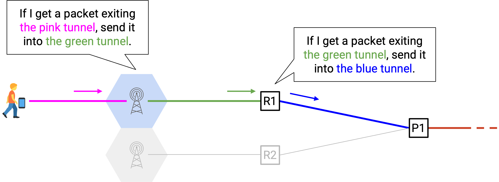

Các gói tin đến cũng đi qua các **tunnels**. Chúng ta nói với **packet gateway**: Nếu bạn nhận được một gói tin dành cho Người dùng A, hãy gửi nó vào **tunnel** màu xanh lá (hướng tới **radio gateway**). Chúng ta cũng nói với **radio gateway**: Nếu bạn nhận được một gói tin thoát ra khỏi **tunnel** màu xanh lá, hãy gửi nó vào **tunnel** màu xanh lam (hướng tới trạm).

Lưu ý rằng không có thành phần mạng nào đang chạy một giao thức định tuyến để tìm đường đi. Thay vào đó, trình quản lý đang chỉ cho các **router** cách chuyển tiếp các gói tin. Mỗi người dùng sẽ cần bộ **tunnels** của riêng mình, vì vậy mạng đang lưu trữ **per-user state** (trạng thái theo từng người dùng) (ví dụ: một mục trong bảng cho mỗi người dùng được kết nối).

Làm thế nào chúng ta thực sự triển khai các quy tắc này? Ví dụ, làm thế nào **radio gateway** biết khi nào một gói tin đến đang ra khỏi **tunnel** màu xanh? Chúng ta có thể sử dụng **encapsulation** (đóng gói). Khi đi vào một **tunnel**, chúng ta có thể thêm một tiêu đề mới, cho biết gói tin đang đi qua **tunnel** đó (ví dụ: "gói tin này đang đi qua **tunnel** màu xanh"). Ở đầu kia, khi gói tin thoát khỏi **tunnel**, cổng sẽ nhìn vào tiêu đề phụ và biết gói tin đến từ **tunnel** nào. Cổng sau đó có thể sử dụng thông tin này để quyết định nơi chuyển tiếp gói tin tiếp theo.

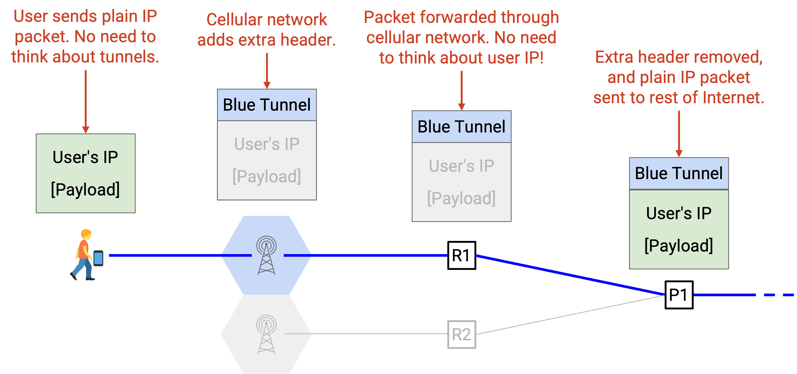

Lưu ý rằng với **tunnels** và **encapsulation**, các **router** không bao giờ chuyển tiếp dựa trên IP của người dùng. Người dùng luôn di chuyển, vì vậy chúng ta không thể sử dụng IP của họ để xác định vị trí của họ. Thay vào đó, chúng ta phải sử dụng các **tunnels** được cấu hình sẵn này để quyết định nơi chuyển tiếp gói tin.

## Bước 4: Handover

Điều gì xảy ra nếu người dùng di chuyển từ một trạm này sang một trạm khác? Hãy xem xét một giao thức (đơn giản hóa một chút). Chúng ta sẽ gọi các trạm là cũ và mới, và di chuyển từ trạm cũ sang trạm mới.

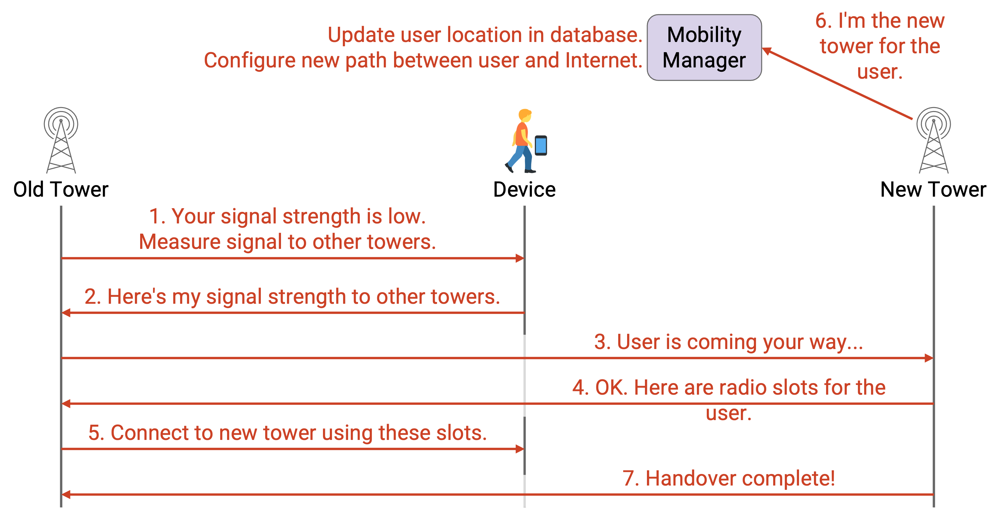

1.  Thiết bị của bạn liên tục đo cường độ tín hiệu của nó tới trạm cũ và báo cáo cường độ đó cho trạm cũ. Tại một thời điểm nào đó, trạm cũ sẽ nói: Cường độ tín hiệu của bạn quá thấp. Đây là một số trạm lân cận (thuộc cùng một nhà khai thác) và các tần số **control channel** tương ứng của chúng. Bạn có thể đo cường độ tín hiệu của mình tới các trạm lân cận này không?
2.  Thiết bị của bạn đo cường độ tín hiệu đến các trạm lân cận và báo cáo các giá trị đó cho trạm cũ. Trạm cũ sẽ chọn trạm mới tốt nhất, dựa trên bất kỳ chính sách nào mà nhà khai thác muốn.
3.  Trạm cũ nói với trạm mới: Người dùng đang đến chỗ bạn. Điều này khiến trạm mới phân bổ một số tài nguyên tần số cho người dùng.
4.  Trạm mới cho trạm cũ biết những tài nguyên tần số nào đã được phân bổ.
5.  Trạm cũ nói với người dùng: Hãy kết nối với trạm mới, sử dụng các tần số này.
6.  Trạm mới báo cáo cho **mobility manager**: Tôi là trạm mới cho người dùng. Trình quản lý cập nhật **database** của mình với vị trí mới của người dùng. Trình quản lý cũng cập nhật các **tunnels** để tạo ra một đường dẫn mới giữa người dùng và Internet (thông qua một trạm mới, và cũng có thể thông qua các **radio gateway** và **packet gateway** mới).
7.  Cuối cùng, trạm mới thông báo cho trạm cũ rằng **handover** đã hoàn tất.

Tại sao quá trình **handover** lại phức tạp đến vậy? Hãy nhớ rằng, chúng ta muốn cung cấp cho người dùng giao tiếp liền mạch, không bị gián đoạn khi họ di chuyển giữa các trạm. Điều này đòi hỏi sự hợp tác giữa người dùng, các trạm cũ và mới, **mobility manager**, và các cổng.

Giao tiếp liền mạch rất khó vì quá trình **handover** không phải là nguyên tử. Người dùng vẫn đang gửi và nhận dữ liệu trong khi **handover** đang diễn ra. Ví dụ, các máy chủ bên ngoài trả lời người dùng có thể đã gửi một loạt các gói tin đến trạm cũ. Trong quá trình chuyển giao, trạm cũ tiếp tục đệm bất kỳ dữ liệu nào nó nhận được cho người dùng đó. Sau khi chuyển giao, trạm cũ có thể gửi dữ liệu đã đệm đó đến trạm mới, nơi sẽ chuyển tiếp dữ liệu đó đến người dùng. Lưu ý rằng các mạng **TCP/IP** truyền thống không cần phải đệm dữ liệu như thế này. Loại đệm này là một tính năng mới được thêm vào cho các cuộc **handover** liền mạch khi người dùng di chuyển.

Lưu ý rằng các quyết định trong quá trình **handover** này luôn được thực hiện bởi nhà khai thác. Thiết bị không được chọn trạm tiếp theo để sử dụng. Lợi ích của thiết kế này là nó cho phép nhà khai thác kiểm soát nhiều hơn. Ví dụ, nếu một trạm bị quá tải, nhà khai thác có thể cân bằng tải và gửi người dùng đến một trạm khác. Hoặc, nếu một số người dùng được ưu tiên hơn những người khác, nhà khai thác có thể gửi những người dùng ít được ưu tiên hơn đến các trạm kém hơn. Nhược điểm của thiết kế này là nó hơi chậm hơn và đòi hỏi nhiều lượt đi-về và phức tạp hơn.

Lưu ý rằng **IP address** của người dùng không thay đổi trong quá trình chuyển giao. Chúng ta chỉ cập nhật các **tunnels** để các gói tin dành cho **IP address** của người dùng đi qua một đường dẫn khác.

**Handover** rất phức tạp và đòi hỏi phải cập nhật **per-user state** trong mạng. Nếu số lượng người dùng tăng lên, hoặc người dùng di chuyển rất nhanh, giao thức này sẽ gặp phải những thách thức về khả năng mở rộng. Tuy nhiên, mạng di động hiện đại hoạt động khá tốt ở quy mô lớn, bởi vì rất nhiều công sức đã được đổ vào việc tối ưu hóa các giao thức này. Đó là lý do tại sao các tài liệu đặc tả tiêu chuẩn thường dài hàng ngàn trang\!

## Roaming

Nhớ lại rằng một người dùng có thể **roaming** và kết nối với một mạng khác nếu họ đang đến thăm một quốc gia khác (hoặc bất kỳ nơi nào mà nhà khai thác của họ không có vùng phủ sóng).

Quá trình kết nối (**discovery**, **attachment**, **handover**) trong một mạng khách nói chung khá tương tự như kết nối trong mạng chủ. Sự khác biệt chính là, **mobility manager** trong mạng khách phải giao tiếp trở lại với **mobility manager** trong mạng chủ.

Ví dụ, mạng khách cần yêu cầu mạng chủ giúp xác thực người dùng (kiểm tra xem người dùng đã trả tiền cho dịch vụ **roaming** chưa). Ngoài ra, mạng khách cần gửi dữ liệu theo dõi trở lại mạng chủ, để mạng chủ biết vị trí của người dùng.

Làm thế nào mạng khách biết mạng chủ ở đâu? Hãy nhớ rằng, trong quá trình **attachment**, thiết bị trình diện **IMSI** của nó, và **IMSI** chứa một **Mobile Network Code** xác định nhà khai thác của người dùng.

Có hai cách tiếp cận khác nhau để thiết lập các **tunnels** giữa người dùng và Internet.

Trong phương pháp **home routing** (định tuyến tại nhà), lưu lượng được tạo **tunnel** thông qua **packet gateway** của mạng chủ. Điều này có nghĩa là tất cả các gói tin phải đi từ mạng khách trở về mạng chủ, trước khi được chuyển tiếp đến mạng Internet rộng lớn hơn. Điều này có lợi vì nó cho phép **packet gateway** của mạng chủ có thể theo dõi người dùng. Một nhược điểm là, nếu bạn là người dùng có trụ sở tại Hoa Kỳ, bạn **roaming** ở Đức, và bạn muốn truy cập một trang web ở Đức, gói tin của bạn phải đi từ Đức, trở về cổng ở Hoa Kỳ, và sau đó quay trở lại Đức.

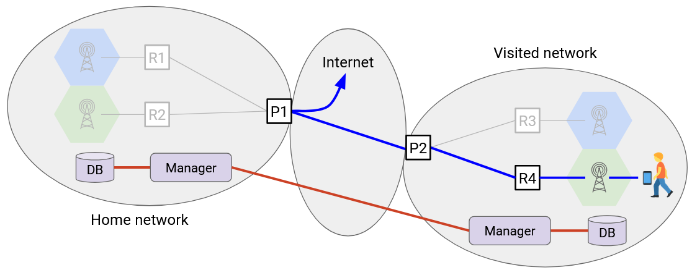

Trong phương pháp **local breakout** (tách nhánh cục bộ), lưu lượng được tạo **tunnel** thông qua **packet gateway** của mạng khách. Điều này có thể rút ngắn tuyến đường giữa người dùng và Internet, vì các gói tin không phải đi hết quãng đường trở về mạng chủ trước. Tuy nhiên, điều này có thể làm cho việc tính toán mức sử dụng của người dùng trở nên phức tạp hơn, vì mạng **roaming** bây giờ phải thực hiện việc tính toán và gửi dữ liệu trở lại mạng chủ.

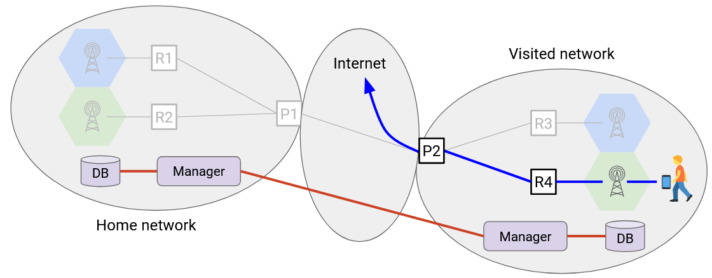

## Các Hoạt động Bổ sung

Chúng ta đã xem xét một số hoạt động chính trong các mạng di động, nhưng cũng có các hoạt động khác tồn tại.

**Lawful intercept** (Can thiệp hợp pháp) là một yêu cầu pháp lý đối với tất cả các nhà khai thác di động. Điều này cho phép một chính phủ có lệnh khám xét có thể nghe lén kết nối của bạn và nghe các gói tin bạn đang gửi.

**Stolen phone registries** (Sổ đăng ký điện thoại bị đánh cắp) cho phép người dùng báo cáo điện thoại của họ bị đánh cắp. Sau đó, nếu kẻ trộm cố gắng kết nối điện thoại bị đánh cắp của bạn vào mạng, nhà khai thác (**mobility manager** và **database**) sẽ nhận thấy rằng điện thoại đã bị đánh cắp và có thể cố gắng truy tìm điện thoại. Ở đây, nhà khai thác sử dụng **IMEI** (số ID được mã hóa cứng vào điện thoại của bạn) để xác định chiếc điện thoại cụ thể (bất kể **IMSI**, ID thuê bao). Các thiết bị cần phải báo cáo **IMEI** của chúng khi kết nối, cho phép nhà khai thác kiểm tra xem điện thoại có bị đánh cắp hay không.

Những hoạt động bổ sung này là khả thi vì nhà khai thác có quyền kiểm soát tập trung, theo dõi tất cả người dùng và vị trí của họ.

## Suy ngẫm về Thiết kế Mạng Di động

Như chúng ta đã lưu ý trước đó, các mạng di động có những mục tiêu và lựa chọn thiết kế cơ bản khác biệt so với Internet truyền thống. Ví dụ, chúng ta đã thấy rằng xác thực và tính toán cước là những mục tiêu trung tâm của mạng di động, mặc dù đây không phải là mục tiêu trong Internet truyền thống. Chúng ta cũng thấy rằng việc phân bổ dựa trên **reservations**, và mạng duy trì **per-user state** đang thay đổi một cách linh động.

Việc sử dụng các mạng dựa trên **reservation** có trạng thái đã làm tăng sự phức tạp của mạng lưới của chúng ta. Các thành phần khác nhau phải liên tục cấu hình lại các **tunnels** khi người dùng di chuyển.

Hãy nghĩ về một số thiết kế thay thế khả thi. Nhớ lại rằng **handover** phức tạp vì chúng ta muốn người dùng giữ nguyên **IP address** khi họ di chuyển. Điều gì sẽ xảy ra nếu thay vào đó chúng ta thay đổi **IP address** của người dùng trong mỗi lần **handover**? Bây giờ, các **IP address** thực sự phản ánh vị trí của người dùng, và chúng ta có thể sử dụng lại các giao thức định tuyến truyền thống. Tuy nhiên, các giao thức ở tầng cao hơn như **TCP** và **HTTP** sẽ bị hỏng. Hãy nhớ rằng, **TCP** dựa vào việc hai người dùng kết nối giữ nguyên cùng một **IP address**.

Việc sử dụng cùng một **IP address** làm tăng sự phức tạp, nhưng việc thay đổi **IP address** làm hỏng **TCP**. Một giải pháp khả thi là sử dụng một **transport-level protocol** (giao thức tầng vận chuyển) khác cho phép thay đổi **IP address**, như **QUIC** (được phát triển tại Google). Khi đó, mặc dù các **IP address** đang thay đổi, chúng ta có thể sử dụng trường **flow label** (nhãn luồng) trong tiêu đề **IPv6** để gắn nhãn cho tất cả các gói tin trong một luồng.